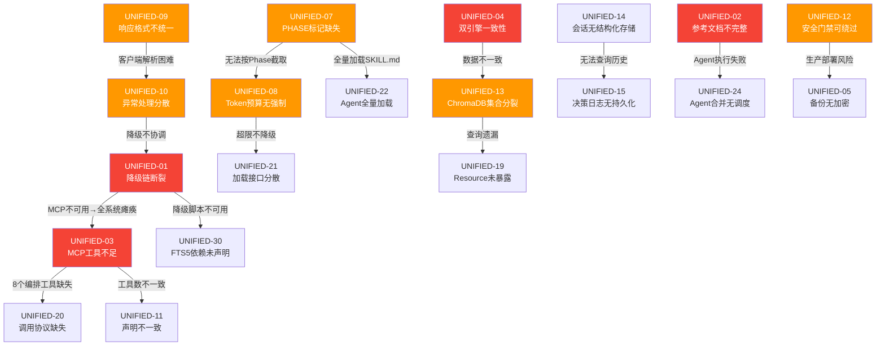
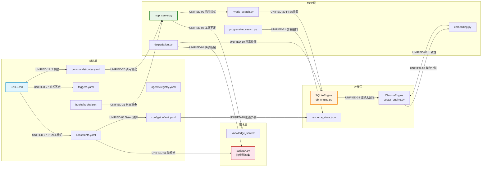
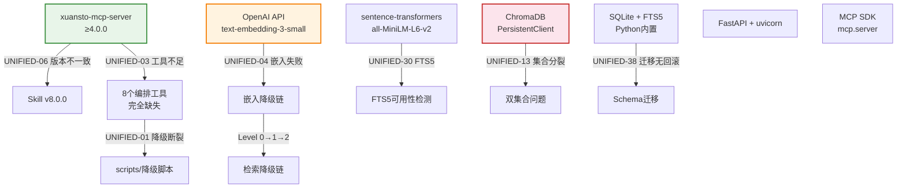
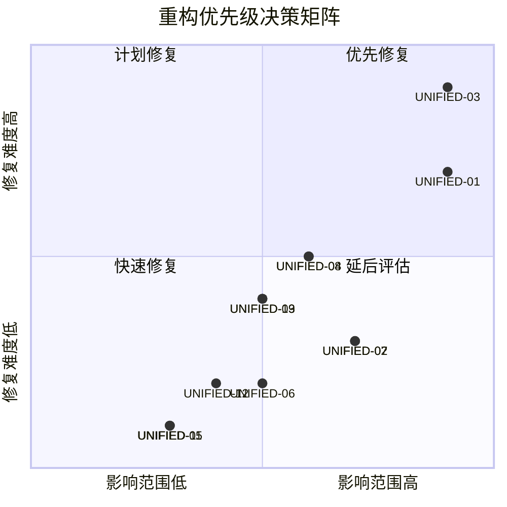
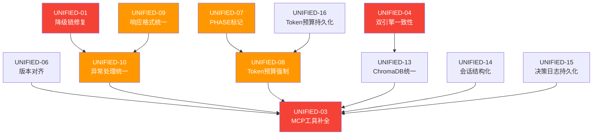
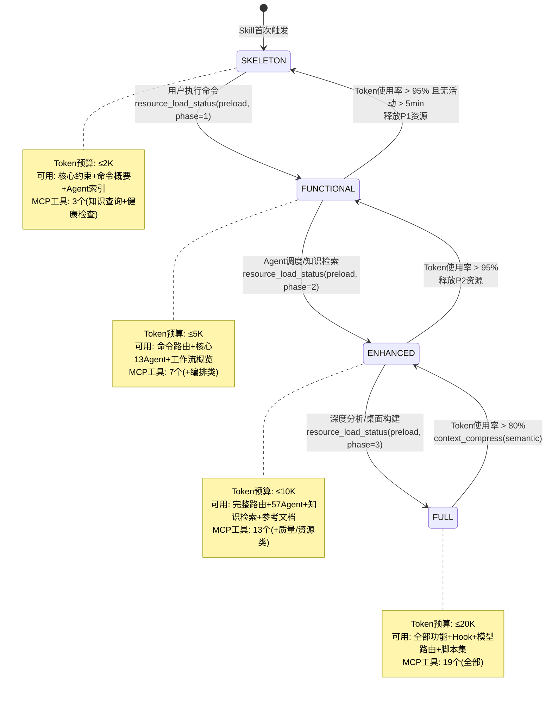
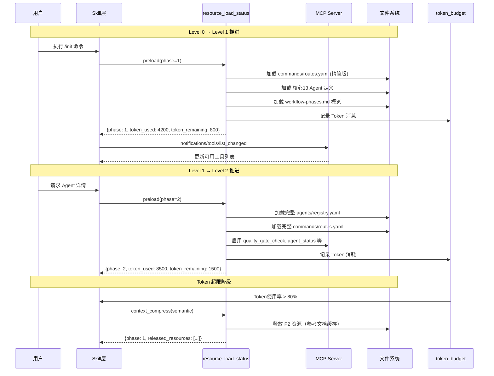
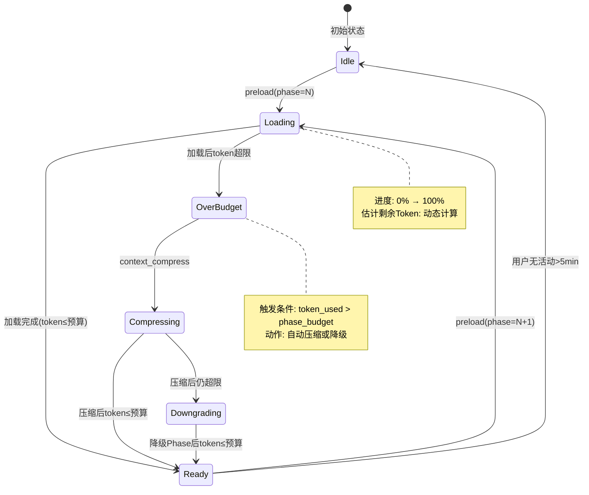
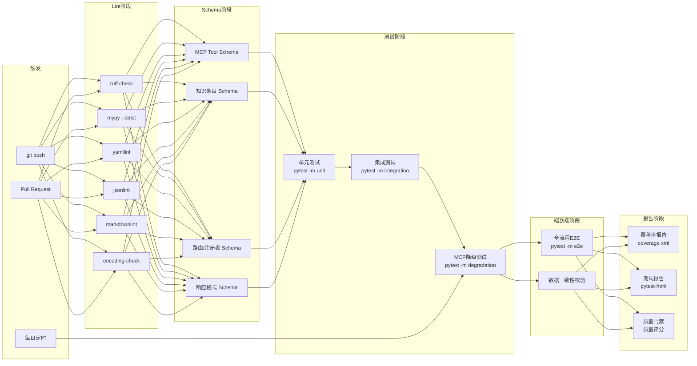

# xuansto-skill-v2 集成重构计划

> 版本: 8.0.0 | 编写日期: 2026-05-24 | 编码: UTF-8 | 行尾: LF
> 整合来源: ARCHITECTURE.md / DATABASE_DESIGN.md / MCP_REVIEW.md / SKILL_REVIEW.md / API_SPECIFICATION.md / PROBLEM.md

---

## 目录

1. [统一问题清单](#1-统一问题清单)
2. [影响链分析](#2-影响链分析)
3. [优先级矩阵](#3-优先级矩阵)
4. [模块化重构步骤](#4-模块化重构步骤)
5. [渐进式加载披露实现方案](#5-渐进式加载披露实现方案)
6. [测试策略](#6-测试策略)
7. [持续集成建议](#7-持续集成建议)

---

## 1. 统一问题清单

以下清单合并了 ARCHITECTURE.md（ARCH-01~10, CONST-01~10, DEBT-01~09）、DATABASE_DESIGN.md（DB-01~10）、MCP_REVIEW.md（MCP-01~07）、SKILL_REVIEW.md（SKILL-01~12）、API_SPECIFICATION.md（API-01~08）及 PROBLEM.md（P0-01~P3-02）的全部发现，去重后按统一编号排列。

影响域标记：**Skill** = 声明层 | **MCP** = 工具层 | **数据** = 存储层 | **API** = 接口层 | **特效** = 渐进式加载/降级 | **架构** = 全局 | **安全** = 安全域

### 1.1 紧急（P0）

| 编号 | 问题 | 来源 | 影响域 | 说明 |
|------|------|------|--------|------|
| UNIFIED-01 | 降级链断裂：MCP→脚本→内联三级降级未实际实现 | P0-01, ARCH-01, DEBT-01, SKILL-02, MCP-05, API-08 | Skill, MCP, 架构, 特效 | degradation.py 仅返回 fallback 响应，未调用 scripts/ 目录脚本；MCP 不可用时系统完全瘫痪 |
| UNIFIED-02 | 参考文档不完整 | P0-02, ARCH-02, DEBT-02, SKILL-05 | Skill, 数据 | v2 references/ 从 2 个扩展到 80+，但 SKILL.md 外部参考表仅列出 6 个，Agent/命令执行时无法获取关键参考 |
| UNIFIED-03 | MCP 工具实现严重不足 | MCP-01, ARCH-07, API-02 | MCP, Skill, API | 声明 19 个工具仅实现 10 个（全部为知识域），8 个核心编排工具完全缺失 |
| UNIFIED-04 | 双引擎一致性风险 | DB-01 | 数据, MCP | SQLite 与 ChromaDB 之间无事务保证，embedding 写入失败仅标记 pending，可能导致数据不一致 |

### 1.2 高（P1）

| 编号 | 问题 | 来源 | 影响域 | 说明 |
|------|------|------|--------|------|
| UNIFIED-05 | 备份无加密默认 | DB-08 | 数据, 安全 | 备份文件默认明文存储，需手动设置 KNOWLEDGE_BACKUP_KEY 才启用加密 |
| UNIFIED-06 | Skill 与 MCP Server 版本不一致 | P1-01, ARCH-03, DEBT-03 | 架构, MCP | Skill v8.0.0 vs MCP Server v3.5.0，兼容性无法判断 |
| UNIFIED-07 | PHASE 标记未嵌入 SKILL.md | ARCH-04, SKILL-01 | Skill, 特效 | constraints.yaml 定义了 PHASE_0~3 标记，但 SKILL.md 未实际添加注释，渐进式加载无法按 Phase 截取 |
| UNIFIED-08 | Token 预算无运行时强制机制 | ARCH-05, SKILL-06 | Skill, MCP, 特效 | token_optimization.budget 仅作为配置声明，超限不触发降级或压缩 |
| UNIFIED-09 | MCP/HTTP 响应格式不统一 | API-04, MCP-06 | API, MCP | MCP 返回 TextContent(JSON)，HTTP 直接返回 JSON，错误码与 isError 标记未对齐 |
| UNIFIED-10 | 异常处理分散，缺乏统一协调 | API-06, API-08 | API, MCP, 架构 | 三层降级（MCP→脚本→引擎）分散在不同模块，无统一降级协调器 |
| UNIFIED-11 | MCP 工具数量声明不一致 | SKILL-04 | Skill, MCP | SKILL.md 标题声明"17 MCP 工具"，mcp-tools.md 实际列出 19 个 |
| UNIFIED-12 | 安全硬门禁在 autonomous 模式下可能被绕过 | SKILL-09 | Skill, 安全 | auto_proceed_on_timeout=true + approval_timeout=5min 可能导致生产部署等高风险操作自动执行 |
| UNIFIED-13 | ChromaDB 集合分裂 | DB-09 | 数据, MCP | knowledge 与 knowledge_primary 双集合，embedding 级别切换时可能导致查询遗漏 |
| UNIFIED-14 | 会话状态无结构化存储 | DB-02 | 数据, MCP | 会话摘要以 Markdown 存储，无法程序化查询和聚合 |
| UNIFIED-15 | 决策日志无持久化 | DB-03 | 数据, MCP | decision_log 数据存储机制未定义，PreCompact 时才持久化 |
| UNIFIED-16 | Token 预算状态无持久化 | DB-04 | 数据, 特效 | token_budget 状态仅存于内存，会话中断后丢失 |

### 1.3 中（P2）

| 编号 | 问题 | 来源 | 影响域 | 说明 |
|------|------|------|--------|------|
| UNIFIED-17 | server_health 文档缺失 | P1-02, DEBT-04 | MCP, API | 已实现但未在早期文档列出 |
| UNIFIED-18 | knowledge_search 缺少 inject/precipitate 文档 | P1-03, DEBT-05 | MCP, API | 知识注入和经验沉淀功能文档缺失 |
| UNIFIED-19 | Resource 未暴露 | MCP-02 | MCP, API | 知识库条目、项目配置、Agent 注册表等未通过 MCP Resource 协议暴露 |
| UNIFIED-20 | Skill↔MCP Server 缺乏显式调用协议 | API-01 | Skill, MCP, API | 命令路由仅声明 mcp_tools 列表，缺少调用时序和参数传递规范 |
| UNIFIED-21 | 渐进式加载接口分散 | API-03 | Skill, MCP, 特效 | 接口分散在 constraints.yaml、resource_load_status Tool 和 SKILL.md 标记中 |
| UNIFIED-22 | Agent 定义文件全量加载 | SKILL-07 | Skill, 特效 | 57 个 Agent .md 文件无按需加载机制，Token 消耗约 500/Agent |
| UNIFIED-23 | Hook 系统仅 security-block 有实际实现 | ARCH-06 | Skill, MCP | 14 个 Hook 仅 security-block 有拦截逻辑，其余为声明式 |
| UNIFIED-24 | Agent 合并策略无运行时调度逻辑 | ARCH-08 | Skill, 架构 | agent_merge_policy 声明但无实际运行时评估和自动激活 |
| UNIFIED-25 | 重试机制不完整 | API-07 | API, MCP | 仅 HTTP update_entry 实现版本冲突重试，其余操作无重试 |
| UNIFIED-26 | 经验模式文件无索引 | DB-07 | 数据 | .knowledge/experience/patterns/ 下 JSON 文件无统一索引 |
| UNIFIED-27 | 触发条件三处冗余 | SKILL-03 | Skill | SKILL.md triggers 与 triggers.yaml 内容完全相同 |
| UNIFIED-28 | loop/planning_files 配置外移状态不明 | SKILL-08 | Skill, 数据 | default.yaml 声明已移至 .skill-config.yaml 但未验证 |
| UNIFIED-29 | 工作流 YAML 与 MD 可能不一致 | SKILL-10 | Skill, 数据 | workflows/ 同时存在 .md 和 _yaml/*.yaml 两种格式 |
| UNIFIED-30 | knowledge_search 降级链中 SQLite FTS5 依赖未声明 | SKILL-11 | MCP, 数据 | 降级到 L2 时可能因缺少 FTS5 扩展而再次失败 |
| UNIFIED-31 | Hook 系统与 MCP 工具 hook_manage 职责重叠 | SKILL-12 | Skill, MCP | hooks.json 静态配置与 hook_manage 动态执行交互关系未明确 |

### 1.4 低（P3）

| 编号 | 问题 | 来源 | 影响域 | 说明 |
|------|------|------|--------|------|
| UNIFIED-32 | Prompt 模板未实现 | MCP-03 | MCP | MCP Prompt 协议可复用于代码审查等场景，当前未利用 |
| UNIFIED-33 | 工具列表静态（listChanged: False） | MCP-04 | MCP, 特效 | 无法动态增减工具，渐进式加载阶段切换时无法通知客户端 |
| UNIFIED-34 | 无 Resource 订阅机制 | MCP-07 | MCP, API | 知识库变更、工作流状态变化无法主动通知客户端 |
| UNIFIED-35 | 版本管理缺乏语义化策略 | API-05 | API | KB_VERSION 硬编码，Schema 版本与 API 版本独立管理 |
| UNIFIED-36 | 配置分散 | DB-05 | 数据, 架构 | 知识库配置分布在 config.yaml、platform-config.yaml、default.yaml、constraints.yaml 多处 |
| UNIFIED-37 | resource_state.json 格式兼容 | DB-06 | 数据, 特效 | 旧格式与新格式需自动升级（已实现自动升级逻辑） |
| UNIFIED-38 | Schema 迁移无回滚 | DB-10 | 数据 | SQLite schema 迁移 v9-v12 仅支持前向，无回滚机制 |
| UNIFIED-39 | 评估框架不完整 | P2-01, DEBT-06, ARCH-09 | Skill, 架构 | evals/ 目录有 2 个文件但无实际评估流程 |
| UNIFIED-40 | CHANGELOG.md 缺失 | P2-02, DEBT-07 | Skill | 无法追踪版本变更 |
| UNIFIED-41 | v1 与 v2 重复文件 | P3-01, DEBT-08, ARCH-10 | 架构 | 维护成本增加，可能出现不一致 |
| UNIFIED-42 | SKILL.md 行数可能超 500 行 | P3-02, DEBT-09 | Skill, 特效 | Token 消耗增加，需外移详细步骤 |

### 1.5 去重映射表

| 统一编号 | 原始编号 |
|----------|----------|
| UNIFIED-01 | P0-01, ARCH-01, DEBT-01, SKILL-02, MCP-05, API-08 |
| UNIFIED-02 | P0-02, ARCH-02, DEBT-02, SKILL-05 |
| UNIFIED-03 | MCP-01, ARCH-07, API-02 |
| UNIFIED-04 | DB-01 |
| UNIFIED-05 | DB-08 |
| UNIFIED-06 | P1-01, ARCH-03, DEBT-03 |
| UNIFIED-07 | ARCH-04, SKILL-01 |
| UNIFIED-08 | ARCH-05, SKILL-06 |
| UNIFIED-09 | API-04, MCP-06 |
| UNIFIED-10 | API-06, API-08 |
| UNIFIED-11 | SKILL-04 |
| UNIFIED-12 | SKILL-09 |
| UNIFIED-13 | DB-09 |
| UNIFIED-14 | DB-02 |
| UNIFIED-15 | DB-03 |
| UNIFIED-16 | DB-04 |
| UNIFIED-17 | P1-02, DEBT-04 |
| UNIFIED-18 | P1-03, DEBT-05 |
| UNIFIED-19 | MCP-02 |
| UNIFIED-20 | API-01 |
| UNIFIED-21 | API-03 |
| UNIFIED-22 | SKILL-07 |
| UNIFIED-23 | ARCH-06 |
| UNIFIED-24 | ARCH-08 |
| UNIFIED-25 | API-07 |
| UNIFIED-26 | DB-07 |
| UNIFIED-27 | SKILL-03 |
| UNIFIED-28 | SKILL-08 |
| UNIFIED-29 | SKILL-10 |
| UNIFIED-30 | SKILL-11 |
| UNIFIED-31 | SKILL-12 |
| UNIFIED-32 | MCP-03 |
| UNIFIED-33 | MCP-04 |
| UNIFIED-34 | MCP-07 |
| UNIFIED-35 | API-05 |
| UNIFIED-36 | DB-05 |
| UNIFIED-37 | DB-06 |
| UNIFIED-38 | DB-10 |
| UNIFIED-39 | P2-01, DEBT-06, ARCH-09 |
| UNIFIED-40 | P2-02, DEBT-07 |
| UNIFIED-41 | P3-01, DEBT-08, ARCH-10 |
| UNIFIED-42 | P3-02, DEBT-09 |

---

## 2. 影响链分析

### 2.1 核心问题连锁影响



### 2.2 文件级影响链



### 2.3 外部依赖影响链



---

## 3. 优先级矩阵

### 3.1 紧急/高/中/低分级

| 优先级 | 编号 | 依据 | 修复预估 |
|--------|------|------|----------|
| **紧急** | UNIFIED-01 | MCP不可用时全系统瘫痪，降级承诺形同虚设 | 5天 |
| **紧急** | UNIFIED-02 | Agent/命令执行时无法获取关键参考，直接影响输出质量 | 3天 |
| **紧急** | UNIFIED-03 | 8个核心编排工具缺失，/init /plan /implement 等命令无法执行 | 15天 |
| **紧急** | UNIFIED-04 | 数据不一致可能导致知识检索返回错误结果 | 3天 |
| **高** | UNIFIED-05 | 备份明文存储，敏感数据泄露风险 | 1天 |
| **高** | UNIFIED-06 | 版本不一致导致兼容性判断困难 | 2天 |
| **高** | UNIFIED-07 | PHASE标记缺失是渐进式加载的基础前提 | 2天 |
| **高** | UNIFIED-08 | Token超限不降级，成本失控 | 3天 |
| **高** | UNIFIED-09 | 响应格式不统一增加客户端复杂度 | 2天 |
| **高** | UNIFIED-10 | 异常处理分散导致降级不协调 | 3天 |
| **高** | UNIFIED-11 | 工具数声明不一致造成用户困惑 | 0.5天 |
| **高** | UNIFIED-12 | 安全门禁可绕过，生产环境风险 | 1天 |
| **高** | UNIFIED-13 | ChromaDB集合分裂导致查询遗漏 | 2天 |
| **高** | UNIFIED-14 | 会话状态无法程序化查询 | 2天 |
| **高** | UNIFIED-15 | 决策日志丢失影响可追溯性 | 1天 |
| **高** | UNIFIED-16 | Token预算丢失导致成本控制失效 | 1天 |
| **中** | UNIFIED-17~31 | 功能缺失/不一致/冗余，不影响核心可用性 | 各1~3天 |
| **低** | UNIFIED-32~42 | 体验优化/长期维护，可延后处理 | 各0.5~3天 |

### 3.2 优先级决策矩阵



### 3.3 修复依赖顺序



---

## 4. 模块化重构步骤

### 阶段总览

| 阶段 | 名称 | 解决问题 | 预估工期 | 前置依赖 |
|------|------|----------|----------|----------|
| Phase R0 | 基础设施修复 | UNIFIED-01, 04, 05, 06, 09, 11 | 8天 | 无 |
| Phase R1 | 渐进式加载基础 | UNIFIED-07, 08, 16, 21, 22 | 7天 | R0 |
| Phase R2 | MCP 工具补全 | UNIFIED-03, 10, 13, 14, 15, 17, 18, 19, 20 | 18天 | R0, R1 |
| Phase R3 | Skill 层优化 | UNIFIED-02, 12, 23, 24, 27, 28, 29, 31, 42 | 10天 | R1 |
| Phase R4 | 长尾收尾 | UNIFIED-25, 26, 30, 32~42 | 12天 | R2, R3 |

### Phase R0: 基础设施修复

#### R0-1: 降级链实际实现（UNIFIED-01）

| 项目 | 内容 |
|------|------|
| **输入** | constraints.yaml 降级映射表、scripts/ 目录脚本清单 |
| **输出** | degradation.py 可实际调用 scripts/ 脚本，返回与 MCP 相同 JSON 结构 |
| **验收标准** | 1. MCP Server 停止后，所有 19 个工具可降级到脚本执行<br/>2. 降级结果 JSON 结构与 MCP 响应一致<br/>3. 降级检测→脚本调用→结果包装 全流程 ≤5s |
| **依赖** | 无 |

**实现要点**：

```python
class DegradationExecutor:
    def execute_fallback(self, tool_name: str, arguments: dict) -> dict:
        fallback_script = self._get_fallback_script(tool_name)
        if fallback_script:
            result = self._run_script(fallback_script, arguments)
            return self._wrap_as_mcp_response(result, degraded=True)
        return self._inline_fallback(tool_name, arguments)
```

#### R0-2: 双引擎一致性保障（UNIFIED-04）

| 项目 | 内容 |
|------|------|
| **输入** | SQLiteEngine、ChromaEngine 现有接口 |
| **输出** | 双写确认机制 + 定时对账 + 不一致自动修复 |
| **验收标准** | 1. SQLite 写入成功后标记 pending，ChromaDB 写入成功后标记 ready<br/>2. 对账日志记录不一致条目<br/>3. 自动修复成功率 ≥95% |
| **依赖** | 无 |

#### R0-3: 备份加密默认启用（UNIFIED-05）

| 项目 | 内容 |
|------|------|
| **输入** | backup.py 现有实现 |
| **输出** | 默认启用 AES-256 加密，密钥自动生成到 .knowledge/.backup_key |
| **验收标准** | 1. 新建备份默认加密<br/>2. 备份元数据标记 encrypted=true<br/>3. 恢复时自动检测加密状态 |
| **依赖** | 无 |

#### R0-4: 版本对齐（UNIFIED-06）

| 项目 | 内容 |
|------|------|
| **输入** | SKILL.md version、MCP Server version |
| **输出** | 双向声明兼容版本范围，server_health 增加版本校验 |
| **验收标准** | 1. SKILL.md 声明 `mcp_server_min_version: "4.0.0"`<br/>2. MCP Server 声明 `skill_min_version: "8.0.0"`<br/>3. server_health 返回版本兼容性检查结果 |
| **依赖** | 无 |

#### R0-5: 响应格式统一（UNIFIED-09, UNIFIED-11）

| 项目 | 内容 |
|------|------|
| **输入** | mcp_server.py、api_routes.py 现有响应格式 |
| **输出** | 统一 make_response/make_error_response 契约 |
| **验收标准** | 1. MCP Tool 和 HTTP 端点使用相同 JSON Schema<br/>2. 错误响应包含 code/message/details/retryable<br/>3. SKILL.md 工具数更新为 19 |
| **依赖** | 无 |

### Phase R1: 渐进式加载基础

#### R1-1: SKILL.md PHASE 标记嵌入（UNIFIED-07）

| 项目 | 内容 |
|------|------|
| **输入** | constraints.yaml disclosure 配置、SKILL.md 当前内容 |
| **输出** | SKILL.md 包含 `<!-- PHASE_0_START -->` ~ `<!-- PHASE_3_END -->` 标记 |
| **验收标准** | 1. 4 对 PHASE 标记正确嵌入<br/>2. Phase 0 内容 ≤2K Token<br/>3. Host 可按标记截取内容 |
| **依赖** | R0 |

#### R1-2: Token 预算运行时强制（UNIFIED-08, UNIFIED-16）

| 项目 | 内容 |
|------|------|
| **输入** | configs/default.yaml token_optimization、constraints.yaml token_budgets |
| **输出** | token_budget 工具运行时检查 + 持久化到 SQLite |
| **验收标准** | 1. 超 80% 自动触发 context_compress<br/>2. 超 95% 强制降级 Phase<br/>3. 预算状态持久化，会话恢复后不丢失 |
| **依赖** | R0-5（响应格式统一） |

#### R1-3: Agent 按需加载（UNIFIED-22）

| 项目 | 内容 |
|------|------|
| **输入** | agents/registry.yaml、agents/*/*.md |
| **输出** | Agent 定义按 Phase 渐进加载机制 |
| **验收标准** | 1. Phase 0 不加载任何 Agent 定义<br/>2. Phase 1 加载 13 个核心 Agent（≤150 Token/Agent）<br/>3. Phase 2 加载完整 57 个 Agent |
| **依赖** | R1-1（PHASE 标记） |

#### R1-4: 渐进式加载接口统一（UNIFIED-21）

| 项目 | 内容 |
|------|------|
| **输入** | resource_load_status Tool、constraints.yaml、resource_state.json |
| **输出** | 统一加载状态查询/预加载/缓存/进度 API |
| **验收标准** | 1. status/preload/cache/clear_cache/loading_progress 5 个 action 全部可用<br/>2. Phase 切换时发送 notifications/tools/list_changed |
| **依赖** | R1-1, R1-2 |

### Phase R2: MCP 工具补全

#### R2-1: P0 核心编排工具实现（UNIFIED-03 部分）

| 项目 | 内容 |
|------|------|
| **输入** | mcp-tools.md 工具定义、降级脚本 |
| **输出** | skill_analyze、quality_gate_check、session_manage、workflow_dispatch、project_init 5 个工具 |
| **验收标准** | 1. 5 个工具通过 MCP 协议可调用<br/>2. 参数校验符合 JSON Schema（additionalProperties: false）<br/>3. 降级到脚本时返回相同结构 |
| **依赖** | R0-1（降级链）、R0-5（响应格式） |

#### R2-2: P1 质量安全工具实现（UNIFIED-03 部分）

| 项目 | 内容 |
|------|------|
| **输入** | mcp-tools.md 工具定义、降级脚本 |
| **输出** | spec_drift_detect、security_scan、code_simplify、agent_status、resource_load_status、context_compress、token_budget、knowledge_inject 8 个工具 |
| **验收标准** | 同 R2-1 |
| **依赖** | R2-1 |

#### R2-3: P2 辅助工具实现（UNIFIED-03 部分）

| 项目 | 内容 |
|------|------|
| **输入** | mcp-tools.md 工具定义 |
| **输出** | hook_manage、server_health、decision_log、agent_manage、metrics_report 5 个工具 |
| **验收标准** | 同 R2-1 |
| **依赖** | R2-2 |

#### R2-4: 异常处理统一（UNIFIED-10）

| 项目 | 内容 |
|------|------|
| **输入** | 各模块异常处理现状 |
| **输出** | 统一异常分类 + 降级协调器 |
| **验收标准** | 1. 错误码→HTTP 状态码映射表完整<br/>2. 降级协调器统一检测→执行→恢复流程<br/>3. isError 标记正确区分协议错误与工具执行错误 |
| **依赖** | R0-5（响应格式） |

#### R2-5: ChromaDB 集合统一（UNIFIED-13）

| 项目 | 内容 |
|------|------|
| **输入** | ChromaEngine 双集合现状 |
| **输出** | 单集合 + 元数据 embedding_tier 标记 |
| **验收标准** | 1. 迁移后仅存在 knowledge 集合<br/>2. 元数据包含 embedding_tier: "api"/"local"<br/>3. 查询无遗漏 |
| **依赖** | R0-2（双引擎一致性） |

#### R2-6: 会话/决策/Token 结构化存储（UNIFIED-14, 15, 16）

| 项目 | 内容 |
|------|------|
| **输入** | Markdown/内存存储现状 |
| **输出** | SQLite session_states、decision_logs、token_budget_states 表 |
| **验收标准** | 1. 迁移脚本从 Markdown 解析到 SQLite<br/>2. 原文件保留为 .migrated<br/>3. MCP 工具可查询结构化数据 |
| **依赖** | R0-2 |

#### R2-7: Resource 暴露（UNIFIED-19）

| 项目 | 内容 |
|------|------|
| **输入** | MCP Resource 协议规范 |
| **输出** | knowledge://、workflow://、agent:// 等 12 个 Resource |
| **验收标准** | 1. list_resources 返回 12 个 Resource URI<br/>2. read_resource 返回正确内容类型<br/>3. P0 Resource 支持订阅 |
| **依赖** | R2-1 |

#### R2-8: SkillToolCall 协议定义（UNIFIED-20）

| 项目 | 内容 |
|------|------|
| **输入** | commands/routes.yaml、constraints.yaml |
| **输出** | Skill→MCP Tool 调用时序规范 + 参数传递规则 |
| **验收标准** | 1. 定义链式调用参数传递规则<br/>2. 定义超时（30s/Tool, 120s/链）<br/>3. 定义重试策略（retryable 最多 2 次） |
| **依赖** | R2-1 |

### Phase R3: Skill 层优化

#### R3-1: 参考文档补全（UNIFIED-02）

| 项目 | 内容 |
|------|------|
| **输入** | v1 参考文档、SKILL.md 外部参考表 |
| **输出** | references/ 关键文档补全 + SKILL.md 参考表更新 |
| **验收标准** | 1. quality-gates.md、agent-registry.md 等关键文档迁移完成<br/>2. SKILL.md 外部参考表列出所有可用文档<br/>3. MCP Resource 可动态提供参考文档 |
| **依赖** | R1-1（PHASE 标记） |

#### R3-2: 安全门禁加固（UNIFIED-12）

| 项目 | 内容 |
|------|------|
| **输入** | configs/default.yaml security_hard_gates |
| **输出** | security_hard_gates 不受 approval_timeout 限制 |
| **验收标准** | 1. 生产部署/密钥轮换/破坏性 DDL 始终等待人工确认<br/>2. 超时不自动放行<br/>3. 日志记录等待时长 |
| **依赖** | 无 |

#### R3-3: Hook 系统实现补全（UNIFIED-23, 31）

| 项目 | 内容 |
|------|------|
| **输入** | hooks/hooks.json 14 个 Hook 定义 |
| **输出** | 全部 Hook 有完整实现 + hooks.json 与 hook_manage 职责明确 |
| **验收标准** | 1. strict 配置下 14 个 Hook 全部生效<br/>2. hooks.json 为声明式配置，hook_manage 为运行时接口<br/>3. Hook 执行失败不阻塞主流程 |
| **依赖** | R2-3（hook_manage 工具） |

#### R3-4: Agent 合并策略实现（UNIFIED-24）

| 项目 | 内容 |
|------|------|
| **输入** | configs/default.yaml agent_merge_policy |
| **输出** | 运行时评估 + 自动激活合并策略 |
| **验收标准** | 1. project_scale < medium 时自动合并安全测试 Agent<br/>2. 合并日志记录到 decision_log<br/>3. 合并后 Token 消耗降低 ≥30% |
| **依赖** | R2-1（agent_status 工具） |

#### R3-5: 触发条件去重（UNIFIED-27）

| 项目 | 内容 |
|------|------|
| **输入** | SKILL.md triggers、triggers.yaml |
| **输出** | 废弃 triggers.yaml，SKILL.md 通过 {{include:}} 引用 |
| **验收标准** | 1. triggers.yaml 标记为 deprecated<br/>2. SKILL.md 使用单一来源<br/>3. 触发准确率不降低 |
| **依赖** | 无 |

#### R3-6: 配置外移验证（UNIFIED-28）

| 项目 | 内容 |
|------|------|
| **输入** | configs/default.yaml loop/planning_files 声明 |
| **输出** | 验证 .skill-config.yaml 是否存在，不存在则回迁 |
| **验收标准** | 1. loop 和 planning_files 配置可正确读取<br/>2. 运行时无配置缺失警告 |
| **依赖** | 无 |

#### R3-7: 工作流格式统一（UNIFIED-29）

| 项目 | 内容 |
|------|------|
| **输入** | workflows/*.md + workflows/_yaml/*.yaml |
| **输出** | YAML 为机器执行版本，MD 为人类可读版本，建立自动生成流程 |
| **验收标准** | 1. YAML→MD 自动生成脚本<br/>2. CI 中校验 YAML 与 MD 一致性 |
| **依赖** | 无 |

#### R3-8: SKILL.md 瘦身（UNIFIED-42）

| 项目 | 内容 |
|------|------|
| **输入** | SKILL.md 当前内容 |
| **输出** | 详细步骤外移到 references/，SKILL.md 保留概要和索引 |
| **验收标准** | 1. SKILL.md ≤500 行<br/>2. Phase 0 内容 ≤2K Token<br/>3. 外移内容通过 {{include:}} 或 MCP Resource 可访问 |
| **依赖** | R1-1（PHASE 标记） |

### Phase R4: 长尾收尾

#### R4-1: 重试机制完善（UNIFIED-25）

| 项目 | 内容 |
|------|------|
| **输入** | 当前仅 HTTP update_entry 有重试 |
| **输出** | 分层重试：同步重试 + 异步重试 |
| **验收标准** | 1. 版本冲突最多 3 次立即重试<br/>2. 可重试服务错误最多 2 次指数退避<br/>3. 嵌入失败后台异步重试（60s 间隔，最多 5 次） |
| **依赖** | R2-4（异常处理统一） |

#### R4-2: 经验模式索引化（UNIFIED-26）

| 项目 | 内容 |
|------|------|
| **输入** | .knowledge/experience/patterns/*.json |
| **输出** | SQLite experience_patterns 表 |
| **验收标准** | 1. 迁移脚本解析 JSON 到 SQLite<br/>2. 按错误类型/置信度/状态可查询 |
| **依赖** | R0-2 |

#### R4-3: FTS5 可用性检测（UNIFIED-30）

| 项目 | 内容 |
|------|------|
| **输入** | hybrid_search.py 降级逻辑 |
| **输出** | 降级脚本中检测 FTS5 可用性，不可用时直接降级到关键词匹配 |
| **验收标准** | 1. FTS5 不可用时自动跳过 bm25_only 级别<br/>2. 日志记录降级原因 |
| **依赖** | R0-1（降级链） |

#### R4-4: 文档补全（UNIFIED-17, 18, 40）

| 项目 | 内容 |
|------|------|
| **输入** | mcp-tools.md、PROBLEM.md |
| **输出** | server_health 文档、inject/precipitate 文档、CHANGELOG.md |
| **验收标准** | 1. mcp-tools.md 包含全部 19 个工具文档<br/>2. CHANGELOG.md 记录 v8.0.0 变更 |
| **依赖** | R2-3 |

#### R4-5: 低优先级问题批量处理（UNIFIED-32~39, 41）

| 项目 | 内容 |
|------|------|
| **输入** | 各低优先级问题 |
| **输出** | Prompt 模板、工具列表动态更新、Resource 订阅、语义化版本、配置合并、Schema 回滚、评估框架、v1 归档 |
| **验收标准** | 各问题独立验收 |
| **依赖** | R2, R3 |

---

## 5. 渐进式加载披露实现方案

### 5.1 阶段设计

#### 5.1.1 四级加载模型

| 级别 | 名称 | Token 预算 | 可用资源 | 不可用资源 | 触发条件 |
|------|------|-----------|----------|------------|----------|
| Level 0 | 骨架 | ≤2K | 核心约束(5条) + 命令列表(31条) + MCP依赖声明 + Agent索引(名称/层级) | 命令步骤、Agent详情、知识检索、参考文档 | Skill 首次触发 |
| Level 1 | 功能 | ≤5K | + 命令路由表(精简) + 工作流Phase概览 + 核心13 Agent | 完整57 Agent、参考文档、知识检索 | 用户执行命令 |
| Level 2 | 增强 | ≤10K | + 完整命令路由 + 完整Agent注册表 + 知识检索 + 参考文档索引 | Hook系统、模型路由详情 | Agent调度/知识检索请求 |
| Level 3 | 完整 | ≤20K | + Hook系统 + 模型路由 + 关键规则 + 脚本集 + 披露资源 | 无 | 深度分析/桌面构建/自主循环 |

#### 5.1.2 各级别 MCP 工具可用性

| 工具 | Level 0 | Level 1 | Level 2 | Level 3 |
|------|---------|---------|---------|---------|
| knowledge_search | ✅ | ✅ | ✅ | ✅ |
| knowledge_stats | ✅ | ✅ | ✅ | ✅ |
| server_health | ✅ | ✅ | ✅ | ✅ |
| skill_analyze | ❌ | ✅ | ✅ | ✅ |
| workflow_dispatch | ❌ | ✅ | ✅ | ✅ |
| session_manage | ❌ | ✅ | ✅ | ✅ |
| project_init | ❌ | ✅ | ✅ | ✅ |
| quality_gate_check | ❌ | ❌ | ✅ | ✅ |
| agent_status | ❌ | ❌ | ✅ | ✅ |
| resource_load_status | ❌ | ❌ | ✅ | ✅ |
| knowledge_inject | ❌ | ❌ | ✅ | ✅ |
| token_budget | ❌ | ❌ | ✅ | ✅ |
| security_scan | ❌ | ❌ | ❌ | ✅ |
| code_simplify | ❌ | ❌ | ❌ | ✅ |
| spec_drift_detect | ❌ | ❌ | ❌ | ✅ |
| context_compress | ❌ | ❌ | ❌ | ✅ |
| hook_manage | ❌ | ❌ | ❌ | ✅ |
| decision_log | ❌ | ❌ | ❌ | ✅ |
| agent_manage | ❌ | ❌ | ❌ | ✅ |
| metrics_report | ❌ | ❌ | ❌ | ✅ |

### 5.2 状态机



### 5.3 过渡动画

#### 5.3.1 Phase 推进流程



#### 5.3.2 加载过渡状态



### 5.4 性能指标

| 指标 | 当前值 | 目标值 | 实现路径 | 验证方法 |
|------|--------|--------|----------|----------|
| Skill 触发时 Token | ~8,000 | ≤2,000 | Phase 0 仅加载骨架 | 统计 SKILL.md PHASE_0 范围 Token 数 |
| 单命令执行 Token | ~15,000 | ≤5,000 | Phase 1 按需加载命令详情 | 统计 /init 命令完整执行 Token 消耗 |
| 全流程 Token（9 Phase） | ~84,000 | ≤30,000 | 4 级渐进加载 + Token 预算强制 | 统计 /sprint 全流程 Token 消耗 |
| Agent 调度 Token（单次） | ~500/Agent | ≤150/Agent | Agent 索引摘要→按需加载完整定义 | 统计 agent_status(detail) Token 消耗 |
| 骨架加载时间 | N/A（全量） | ≤500ms | Phase 0 仅读取 SKILL.md PHASE_0 范围 | 计时 resource_load_status(status) |
| Phase 资源预加载 | N/A（全量） | ≤2s/Phase | resource_load_status(preload) | 计时 preload 调用到完成 |
| 知识检索响应 | 1-5s | ≤3s | 混合检索 + 降级链 | 计时 knowledge_search 调用 |
| Phase 降级响应 | N/A | ≤1s | Token 超限自动触发 | 计时从超限检测到降级完成 |

---

## 6. 测试策略

### 6.1 单元测试

#### 6.1.1 MCP Tool 单元测试

| 测试对象 | 测试用例数 | 覆盖场景 | 优先级 |
|----------|-----------|----------|--------|
| knowledge_search | 15 | hybrid/semantic_only/keyword_only 模式、空结果、降级链、Token 预算裁剪 | P0 |
| knowledge_add | 12 | 正常添加、去重检测(skip/merge/keep_both)、敏感内容拦截、嵌入降级 | P0 |
| knowledge_update | 10 | 正常更新、版本冲突、乐观锁重试、敏感内容拦截 | P0 |
| knowledge_delete | 6 | 正常删除、级联删除(ChromaDB+SQLite)、不存在条目 | P0 |
| skill_analyze | 8 | basic/full 深度、包含/排除脚本和Agent、无效路径 | P1 |
| quality_gate_check | 10 | 按Phase过滤、BLOCK/WARN结果、force_refresh、空项目 | P1 |
| session_manage | 12 | save/load/list/detect/verify/track/restore 7个action | P1 |
| workflow_dispatch | 10 | start/status/abort/phase/recover/snapshots 6个action | P1 |
| token_budget | 8 | status/set_budget/recommend/report 4个action | P1 |
| resource_load_status | 10 | status/preload/cache/clear_cache/loading_progress 5个action | P1 |

**测试框架**：pytest + pytest-asyncio

```python
import pytest
from knowledge_server.mcp_server import register_mcp_tools

class TestKnowledgeSearch:
    @pytest.fixture
    def server(self):
        return KnowledgeServer(db_path=":memory:")

    @pytest.mark.asyncio
    async def test_hybrid_search_returns_results(self, server):
        server.sqlite.add_entry({"title": "Test", "content": "content", "scope": "general"})
        result = await call_tool("knowledge_search", {"query": "test", "top_k": 5})
        assert result["status"] == "ok"
        assert len(result["data"]["results"]) > 0

    @pytest.mark.asyncio
    async def test_search_degradation_to_fts5(self, server):
        server.chroma.available = False
        result = await call_tool("knowledge_search", {"query": "test"})
        assert result["data"]["degradation_level"] >= 2
```

#### 6.1.2 状态管理单元测试

| 测试对象 | 测试用例数 | 覆盖场景 |
|----------|-----------|----------|
| DegradationManager | 8 | 4级降级、恢复检测、定期检查启停 |
| EmbeddingManager | 6 | 3级嵌入降级、API可用性检测 |
| LoadingState | 8 | 4级Phase推进、Token超限降级、resource_state.json 读写 |
| TokenBudgetState | 6 | 预算设置、使用率计算、warn/block 阈值 |

### 6.2 集成测试

#### 6.2.1 Skill-MCP 联动测试

| 测试场景 | 步骤 | 预期结果 |
|----------|------|----------|
| /init 命令完整流程 | 1. 触发 Skill<br/>2. 路由匹配 /init<br/>3. 调用 skill_analyze → knowledge_search → workflow_dispatch → project_init → decision_log<br/>4. 验证结果 | 5 个 MCP 工具按序调用，返回统一 JSON 格式 |
| /plan 命令降级流程 | 1. 停止 MCP Server<br/>2. 触发 /plan<br/>3. 验证降级到脚本执行 | 降级结果与 MCP 响应结构一致，degraded=true |
| /loop 自主循环 | 1. 启动 /loop<br/>2. 验证 Phase 0→8 推进<br/>3. 验证 Token 预算检查 | Phase 按序推进，Token 超限时自动降级 |
| 命令路由冲突 | 1. 输入模糊意图<br/>2. 验证路由优先级 | 精确匹配 > 语义匹配 > 更具体命令 > /sprint 兜底 |

#### 6.2.2 特效加载流程测试

| 测试场景 | 步骤 | 预期结果 |
|----------|------|----------|
| Phase 0→1 推进 | 1. Skill 首次触发（Phase 0）<br/>2. 用户执行命令<br/>3. resource_load_status(preload, phase=1) | Token ≤5K，7 个 MCP 工具可用 |
| Phase 2→1 降级 | 1. Phase 2 已加载<br/>2. Token 使用率 > 95%<br/>3. 自动降级 | Phase 回退到 1，P2 资源释放 |
| ChromaDB 不可用降级 | 1. 停止 ChromaDB<br/>2. 执行 knowledge_search | degradation_level=2，search_strategy=keyword_only |
| 嵌入降级链 | 1. 模拟 OpenAI API 不可用<br/>2. 验证 sentence-transformers 降级<br/>3. 模拟 ST 不可用<br/>4. 验证 BM25-only 降级 | 3 级降级按序触发 |

### 6.3 端到端测试

| 测试场景 | 输入 | 验证点 | 预期耗时 |
|----------|------|--------|----------|
| Web 应用全流程 | "帮我搭建一个 React+TypeScript 项目" | 1. Skill 正确触发<br/>2. /init → /plan → /implement → /test → /review → /deploy 完整流程<br/>3. 代码文件生成<br/>4. 门禁报告输出<br/>5. 会话状态保存 | ≤10min |
| 桌面应用全流程 | "构建一个 Electron 桌面应用" | 1. 平台检测为 desktop<br/>2. 桌面相关 Agent 调度<br/>3. /build-desktop 执行<br/>4. Electron 安全检查通过 | ≤15min |
| 降级全链路 | 停止 MCP Server + ChromaDB + OpenAI API | 1. 所有工具降级到脚本<br/>2. 检索降级到 FTS5<br/>3. 嵌入降级到 BM25-only<br/>4. 核心功能不中断 | ≤5min |
| Token 预算控制 | 大型项目（>50 文件） | 1. Phase 0 Token ≤2K<br/>2. 超 80% 自动压缩<br/>3. 超 95% 强制降级<br/>4. 全流程 Token ≤30K | ≤10min |

### 6.4 回归验证方案

| 验证项 | 频率 | 方法 | 通过标准 |
|--------|------|------|----------|
| MCP Tool 调用成功率 | 每次提交 | pytest 单元测试 | 100% 通过 |
| 降级链完整性 | 每次提交 | 集成测试（停止 MCP Server） | 所有 19 个工具可降级 |
| Token 预算控制 | 每次提交 | 单元测试 + 集成测试 | 超 80% 压缩、超 95% 降级 |
| 渐进式加载 | 每日 | 端到端测试 | Phase 推进/降级正常 |
| 数据一致性 | 每日 | 对账脚本 | SQLite/ChromaDB 不一致率 <0.1% |
| 安全门禁 | 每次提交 | 单元测试 | 安全硬门禁不可绕过 |
| 响应格式 | 每次提交 | JSON Schema 校验 | 所有响应符合统一契约 |

---

## 7. 持续集成建议

### 7.1 Lint 检查

| 检查项 | 工具 | 触发条件 | 配置 |
|--------|------|----------|------|
| Python 代码风格 | ruff check | 每次提交 | pyproject.toml ruff 配置 |
| Python 类型检查 | mypy --strict | 每次提交 | 知识库服务模块 |
| YAML 格式校验 | yamllint | 每次提交 | constraints.yaml, routes.yaml, registry.yaml, default.yaml |
| JSON 格式校验 | jsonlint | 每次提交 | hooks.json, trigger_eval.json |
| Markdown 格式 | markdownlint | 每次提交 | SKILL.md, references/*.md |
| 编码检查 | check-encoding.py | 每次提交 | UTF-8 无 BOM + LF 行尾 |
| 注释语言检查 | check-comment-lang.py | 每次提交 | Python 脚本注释语言一致性 |

### 7.2 Schema 校验

| 校验项 | 工具 | 触发条件 | 说明 |
|--------|------|----------|------|
| MCP Tool 参数 Schema | jsonschema | 每次提交 | 验证 mcp-tools.md 中 JSON Schema 的 additionalProperties: false |
| 知识条目 Schema | jsonschema | 每次提交 | 验证 knowledge_entries 表结构与新 Schema 一致 |
| 命令路由 Schema | 自定义校验脚本 | 每次提交 | 验证 routes.yaml 中每条路由包含 intent/command/mcp_tools/fallback/phase |
| Agent 注册表 Schema | 自定义校验脚本 | 每次提交 | 验证 registry.yaml 中每个 Agent 包含 name/file/phases/model_routing |
| constraints.yaml Schema | 自定义校验脚本 | 每次提交 | 验证 token_budgets/resource_priority/disclosure 结构完整 |
| 响应格式 Schema | jsonschema | 每次提交 | 验证 MCP/HTTP 响应符合统一契约 |

### 7.3 MCP 定义验证

| 验证项 | 方法 | 触发条件 | 说明 |
|--------|------|----------|------|
| 工具注册完整性 | pytest | 每次提交 | 验证 mcp_server.py 注册的工具数 = mcp-tools.md 文档数 |
| 工具参数校验 | pytest | 每次提交 | 对每个工具发送无效参数，验证返回 INVALID_PARAMS |
| 工具降级验证 | pytest | 每日 | 停止 MCP Server，验证每个工具可降级到脚本 |
| Resource URI 可达性 | pytest | 每次提交 | 验证 list_resources 返回的 URI 可通过 read_resource 读取 |
| 工具 Annotations 正确性 | pytest | 每次提交 | 验证 readOnlyHint/destructiveHint/idempotentHint/openWorldHint 标记正确 |
| 版本兼容性 | pytest | 每次提交 | 验证 server_health 返回版本兼容性检查结果 |

### 7.4 构建流水线



### 7.5 CI 配置示例

```yaml
name: xuansto-skill-v2 CI

on:
  push:
    paths:
      - '.trae/skills/xuansto-skill-v2/**'
      - 'scripts/knowledge_server/**'
  pull_request:
  schedule:
    - cron: '0 6 * * *'

jobs:
  lint:
    runs-on: ubuntu-latest
    steps:
      - uses: actions/checkout@v4
      - name: Python Lint
        run: |
          pip install ruff mypy
          ruff check scripts/knowledge_server/
          mypy --strict scripts/knowledge_server/
      - name: YAML/JSON/MD Lint
        run: |
          pip install yamllint jsonlint markdownlint-cli
          yamllint .trae/skills/xuansto-skill-v2/*.yaml
          jsonlint .trae/skills/xuansto-skill-v2/hooks/hooks.json
      - name: Encoding Check
        run: python .trae/skills/xuansto-skill-v2/scripts/check-encoding.py

  schema:
    runs-on: ubuntu-latest
    needs: lint
    steps:
      - uses: actions/checkout@v4
      - name: Schema Validation
        run: |
          pip install jsonschema pyyaml
          python scripts/validate-schemas.py

  unit-test:
    runs-on: ubuntu-latest
    needs: schema
    steps:
      - uses: actions/checkout@v4
      - name: Unit Tests
        run: |
          pip install -e scripts/knowledge_server/
          pytest scripts/knowledge_server/tests/ -m unit --cov --cov-report=xml

  integration-test:
    runs-on: ubuntu-latest
    needs: unit-test
    steps:
      - uses: actions/checkout@v4
      - name: Integration Tests
        run: |
          pytest scripts/knowledge_server/tests/ -m integration

  degradation-test:
    runs-on: ubuntu-latest
    needs: unit-test
    if: github.event_name == 'schedule'
    steps:
      - uses: actions/checkout@v4
      - name: Degradation Tests
        run: |
          pytest scripts/knowledge_server/tests/ -m degradation

  e2e-test:
    runs-on: ubuntu-latest
    needs: integration-test
    if: github.event_name == 'schedule'
    steps:
      - uses: actions/checkout@v4
      - name: E2E Tests
        run: |
          pytest scripts/knowledge_server/tests/ -m e2e --timeout=600
```

### 7.6 质量门禁

| 门禁 | 阈值 | 阻断级别 | 说明 |
|------|------|----------|------|
| 单元测试通过率 | 100% | BLOCK | 所有单元测试必须通过 |
| 代码覆盖率 | ≥80% | BLOCK | knowledge_server/ 模块覆盖率 |
| MCP Tool Schema 校验 | 100% | BLOCK | 所有工具参数/返回值 Schema 有效 |
| Lint 错误数 | 0 | BLOCK | ruff/mypy/yamllint 零错误 |
| 集成测试通过率 | 100% | BLOCK | Skill-MCP 联动测试 |
| 降级测试通过率 | ≥90% | WARN | 降级链完整性 |
| E2E 测试通过率 | ≥95% | WARN | 完整交互流程 |
| 数据一致性 | <0.1% | WARN | SQLite/ChromaDB 不一致率 |

---

> 文档结束 | 生成时间: 2026-05-24 | 基于 6 份分析文档整合 | 统一问题 42 项（紧急 4 / 高 12 / 中 15 / 低 11）
