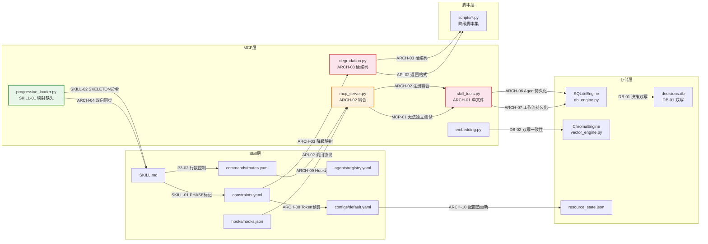
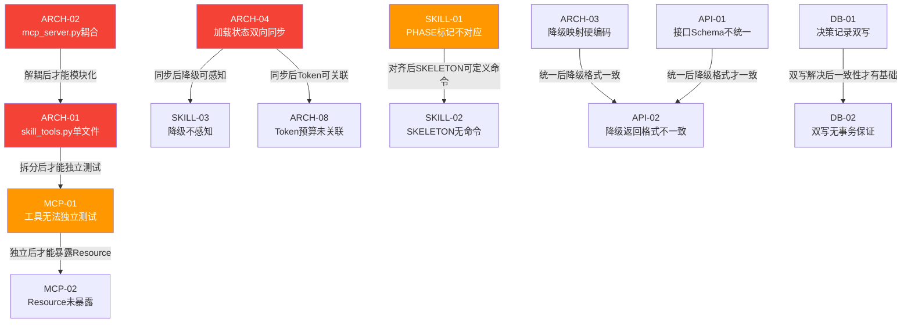
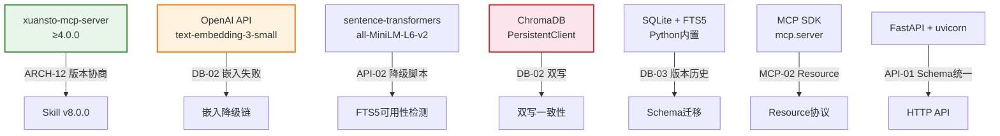
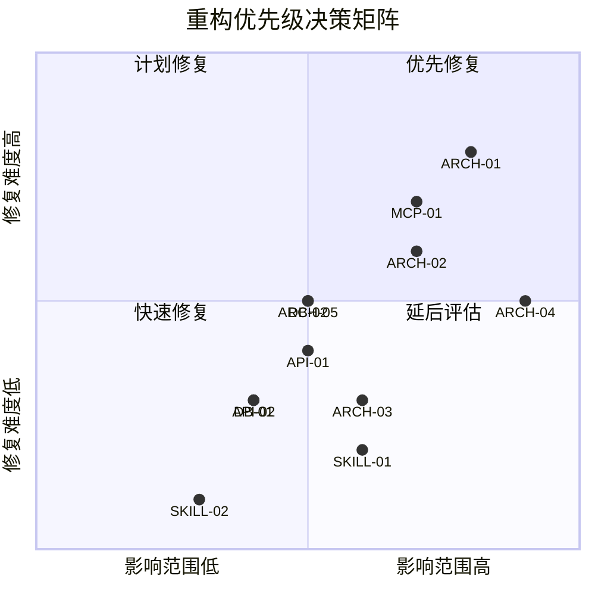
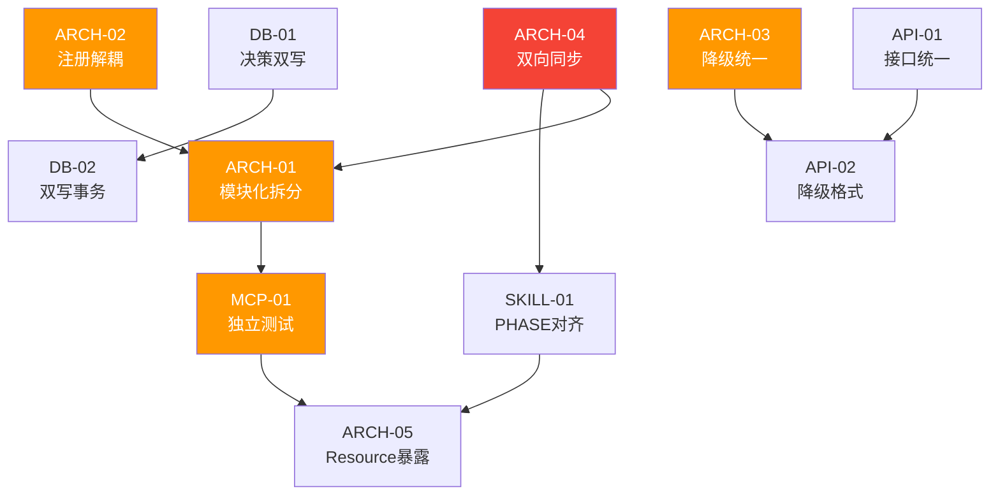
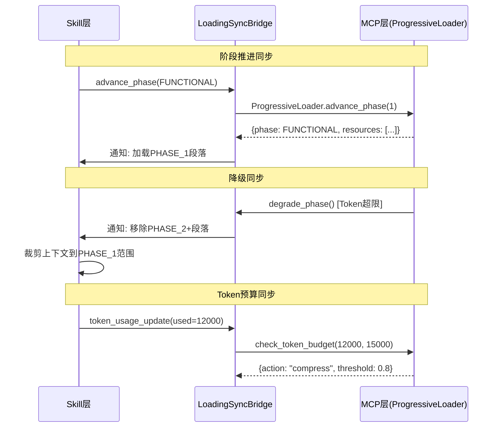
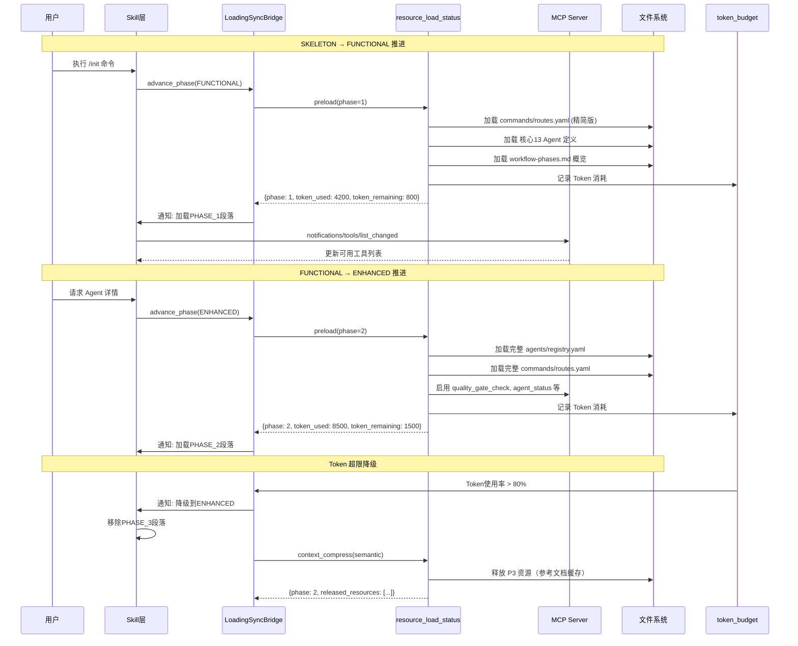
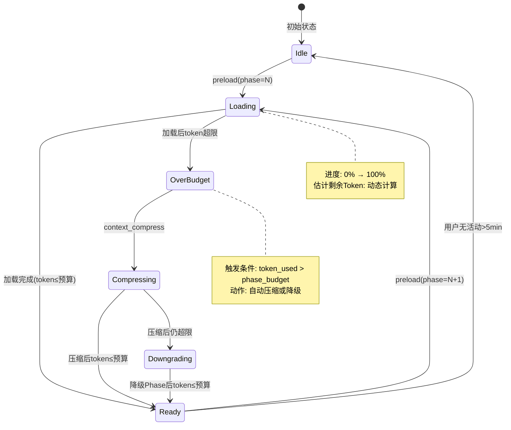
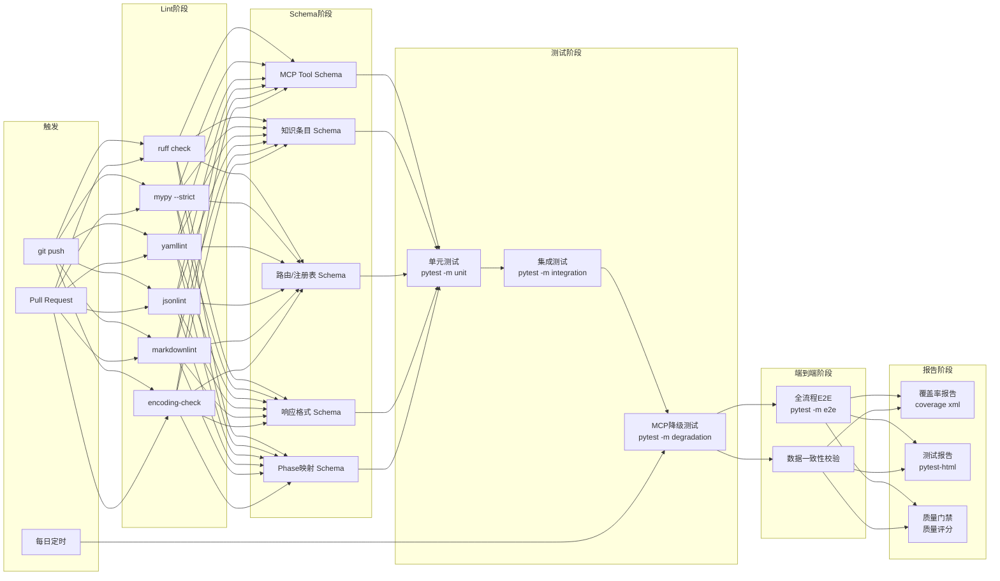

# xuansto-skill-v2 集成重构计划

> 版本: 8.0.0 | 编写日期: 2026-05-25 | 编码: UTF-8 | 行尾: LF
> 整合来源: ARCHITECTURE.md / DATABASE_DESIGN.md / MCP_REVIEW.md / SKILL_REVIEW.md / API_SPECIFICATION.md / PROBLEM.md
> Skill目录: `.trae/skills/xuansto-skill-v2/`

---

## 目录

1. [统一问题清单](#1-统一问题清单)
2. [影响链分析](#2-影响链分析)
3. [优先级矩阵](#3-优先级矩阵)
4. [模块化重构步骤](#4-模块化重构步骤)
5. [渐进式加载披露实现方案](#5-渐进式加载披露实现方案)
6. [测试策略](#6-测试策略)
7. [持续集成建议](#7-持续集成建议)

---

## 1. 统一问题清单

以下清单合并了 PROBLEM.md（P2-01~P3-02）及五份分析文档（ARCHITECTURE.md、DATABASE_DESIGN.md、MCP_REVIEW.md、SKILL_REVIEW.md、API_SPECIFICATION.md）的全部发现，去重后按统一编号排列。

影响域标记：**Skill** = 声明层 | **MCP** = 工具层 | **数据** = 存储层 | **API** = 接口层 | **特效** = 渐进式加载/降级 | **架构** = 全局 | **安全** = 安全域 | **测试** = 测试域 | **性能** = 性能域

### 1.1 已有问题（来自PROBLEM.md）

| 编号 | 问题 | 影响域 | 状态 | 说明 |
|------|------|--------|------|------|
| P2-01 | v2缺少评估配置文件 | Skill | 未修复 | evals/目录有2个文件但无实际评估流程，无法进行技能评估 |
| P2-02 | v2缺少CHANGELOG.md | Skill | 未修复 | 无法追踪v2的版本变更历史 |
| P3-01 | v1与v2存在重复文件 | 架构 | 未修复 | agents/、commands/、workflows/等目录在v1和v2中同时存在，维护成本增加 |
| P3-02 | SKILL.md行数可能超过500行 | Skill/特效 | 部分缓解 | 已通过PHASE标记实现渐进式加载，Phase 0仅加载≤2K Token，但行数仍需控制 |

### 1.2 新发现问题（来自5份分析文档）

#### 1.2.1 架构类（ARCH）

| 编号 | 问题 | 影响域 | 来源 | 说明 |
|------|------|--------|------|------|
| ARCH-01 | skill_tools.py 2300+行单文件，需模块化拆分 | MCP/架构 | SKILL_REVIEW, ARCHITECTURE | 15个Skill工具处理器+辅助方法集中在SkillToolHandler类中，职责过重，无法独立测试和维护 |
| ARCH-02 | mcp_server.py 工具注册与处理逻辑耦合 | MCP/架构 | SKILL_REVIEW, ARCHITECTURE | list_tools()声明工具定义与call_tool()处理逻辑在同一函数中，1200+行，新增工具需同时修改定义和处理代码 |
| ARCH-03 | 降级映射在degradation.py硬编码，应从constraints.yaml读取 | MCP/数据 | SKILL_REVIEW, ARCHITECTURE | TOOL_SCRIPT_MAP与constraints.yaml中tool_fallbacks重复定义，维护时需同步更新两处 |
| ARCH-04 | Skill层与MCP层加载状态缺乏双向同步 | Skill/MCP/特效 | SKILL_REVIEW, ARCHITECTURE | Skill层推进加载时不通知MCP层，MCP层降级时Skill层不感知，两层独立计算Token预算 |
| ARCH-05 | MCP Server未暴露Resource，仅Tool | MCP/API | MCP_REVIEW | 知识库条目、项目配置、Agent注册表等未通过MCP Resource协议暴露，客户端无法订阅变更 |
| ARCH-06 | 缺少Agent持久化机制 | 数据/MCP | ARCHITECTURE | SkillToolHandler._agent_instances内存字典，无持久化，服务重启后丢失 |
| ARCH-07 | 工作流状态仅内存存储，重启丢失 | 数据 | ARCHITECTURE | SkillToolHandler._workflows内存字典，崩溃后无法恢复 |
| ARCH-08 | Token预算与加载阶段未关联 | Skill/MCP/特效 | SKILL_REVIEW, ARCHITECTURE | token_optimization.budget仅作为配置声明，超限不触发降级或压缩，与加载阶段状态脱节 |
| ARCH-09 | Hook执行无超时保护 | MCP | SKILL_REVIEW | 14个Hook仅security-block有实际实现，其余为声明式，执行失败无超时保护 |
| ARCH-10 | 配置变更需重启MCP Server | 架构 | ARCHITECTURE | KnowledgeConfig初始化时一次性读取，无热更新机制 |
| ARCH-11 | 错误处理不统一，部分工具返回字符串而非JSON | API/MCP | API_SPECIFICATION | 三层降级分散在不同模块，无统一降级协调器，错误码与isError标记未对齐 |
| ARCH-12 | 缺少API版本协商机制 | API | API_SPECIFICATION | server_health硬编码返回版本号，客户端无法动态协商兼容版本 |

#### 1.2.2 数据类（DB）

| 编号 | 问题 | 影响域 | 来源 | 说明 |
|------|------|--------|------|------|
| DB-01 | 决策记录双写（SQLite+文件），存在一致性风险 | 数据 | DATABASE_DESIGN | decision_log.py同时写入decisions.db和decisions.json，无事务保证 |
| DB-02 | ChromaDB与SQLite双写无事务保证 | 数据 | DATABASE_DESIGN | embedding写入失败仅标记pending，可能导致数据不一致，对账机制不完善 |
| DB-03 | 知识条目版本历史无清理策略 | 数据/性能 | DATABASE_DESIGN | version_history表无限增长，无TTL或归档策略，长期运行后影响查询性能 |

#### 1.2.3 MCP类

| 编号 | 问题 | 影响域 | 来源 | 说明 |
|------|------|--------|------|------|
| MCP-01 | 26个工具全部在单一文件注册，无法独立测试 | MCP/测试 | SKILL_REVIEW, MCP_REVIEW | mcp_server.py中硬编码26个Tool定义，工具定义与处理逻辑耦合，无法按工具粒度测试 |
| MCP-02 | 缺少Resource暴露（xuansto://agents/{name}等） | MCP | MCP_REVIEW | MCP Resource协议可提供只读数据访问和变更订阅，当前完全未实现 |
| MCP-03 | 工具调用无审计日志 | MCP/安全 | MCP_REVIEW | 工具调用无记录，无法追溯操作历史，不符合安全审计要求 |

#### 1.2.4 Skill类

| 编号 | 问题 | 影响域 | 来源 | 说明 |
|------|------|--------|------|------|
| SKILL-01 | PHASE标记与LoadPhase枚举值不对应 | Skill/MCP/特效 | SKILL_REVIEW | SKILL.md使用Phase 0/1/2/3，progressive_loader.py使用SKELETON/FUNCTIONAL/ENHANCED/FULL，无显式映射 |
| SKILL-02 | SKELETON阶段无可用命令 | Skill/特效 | SKILL_REVIEW | _PHASE_COMMANDS[LoadPhase.SKELETON]为空列表，但SKILL.md Phase 0已展示命令名称 |
| SKILL-03 | 降级时Skill层不感知MCP层状态 | Skill/MCP | SKILL_REVIEW | MCP层degrade_phase()触发降级后，Skill层上下文中已加载的PHASE段落不会自动移除 |

#### 1.2.5 API类

| 编号 | 问题 | 影响域 | 来源 | 说明 |
|------|------|--------|------|------|
| API-01 | HTTP API与MCP stdio两套接口无统一Schema | API | API_SPECIFICATION | MCP返回TextContent(JSON)，HTTP直接返回JSON，错误码与isError标记未对齐 |
| API-02 | 降级脚本返回格式与MCP工具不一致 | API/MCP | API_SPECIFICATION, MCP_REVIEW | 脚本降级输出为纯文本或非标准JSON，需手动包装为MCP响应格式 |

### 1.3 去重映射表

| 统一编号 | 原始来源 |
|----------|----------|
| P2-01 | PROBLEM.md P2-01, ARCH-09(评估框架不完整) |
| P2-02 | PROBLEM.md P2-02 |
| P3-01 | PROBLEM.md P3-01, ARCHITECTURE(架构差异-重复文件) |
| P3-02 | PROBLEM.md P3-02, SKILL_REVIEW(SKILL.md行数) |
| ARCH-01 | SKILL_REVIEW(skill_tools.py单文件), ARCHITECTURE(模块化程度) |
| ARCH-02 | SKILL_REVIEW(mcp_server.py耦合), ARCHITECTURE(工具注册方式) |
| ARCH-03 | SKILL_REVIEW(降级映射硬编码), ARCHITECTURE(降级策略来源) |
| ARCH-04 | SKILL_REVIEW(双向同步缺失), ARCHITECTURE(加载状态同步) |
| ARCH-05 | MCP_REVIEW(Resource未暴露) |
| ARCH-06 | ARCHITECTURE(Agent实例管理) |
| ARCH-07 | ARCHITECTURE(工作流状态) |
| ARCH-08 | SKILL_REVIEW(Token预算不同步), ARCHITECTURE(Token预算) |
| ARCH-09 | SKILL_REVIEW(Hook执行无超时), ARCHITECTURE(Hook系统) |
| ARCH-10 | ARCHITECTURE(配置热更新) |
| ARCH-11 | API_SPECIFICATION(错误处理不统一), MCP_REVIEW(响应格式) |
| ARCH-12 | API_SPECIFICATION(版本协商), ARCHITECTURE(API版本兼容) |
| DB-01 | DATABASE_DESIGN(决策记录双写) |
| DB-02 | DATABASE_DESIGN(ChromaDB与SQLite双写) |
| DB-03 | DATABASE_DESIGN(版本历史无清理) |
| MCP-01 | SKILL_REVIEW(工具无法独立测试), MCP_REVIEW(工具注册) |
| MCP-02 | MCP_REVIEW(Resource暴露) |
| MCP-03 | MCP_REVIEW(审计日志) |
| SKILL-01 | SKILL_REVIEW(PHASE标记不对应) |
| SKILL-02 | SKILL_REVIEW(SKELETON阶段命令空) |
| SKILL-03 | SKILL_REVIEW(降级不感知) |
| API-01 | API_SPECIFICATION(HTTP与MCP格式不统一) |
| API-02 | API_SPECIFICATION(降级脚本返回格式不一致) |

---

## 2. 影响链分析

### 2.1 文件级影响链



### 2.2 模块级影响链



### 2.3 外部依赖影响链



---

## 3. 优先级矩阵

### 3.1 优先级分级

| 优先级 | 编号 | 依据 | 修复预估 |
|--------|------|------|----------|
| **紧急** | ARCH-04 | Skill层与MCP层加载状态双向同步缺失，直接影响渐进式加载核心功能，降级时Skill层不感知导致上下文不一致 | 3天 |
| **高** | ARCH-01 | skill_tools.py 2300+行单文件，所有Skill工具处理器集中在一个类中，无法独立测试和维护 | 5天 |
| **高** | ARCH-02 | mcp_server.py工具注册与处理逻辑耦合，新增工具需同时修改定义和处理代码 | 3天 |
| **高** | ARCH-03 | 降级映射硬编码与YAML配置重复定义，维护时需同步更新两处，是降级链可靠性的基础 | 2天 |
| **高** | MCP-01 | 26个工具全部在单一文件注册，无法按工具粒度独立测试，是测试覆盖的基础前提 | 3天 |
| **中** | ARCH-05 | MCP Resource未暴露，客户端无法订阅变更和按需读取数据 | 3天 |
| **中** | DB-01 | 决策记录双写存在一致性风险，可能导致数据丢失 | 2天 |
| **中** | DB-02 | ChromaDB与SQLite双写无事务保证，嵌入失败可能导致数据不一致 | 3天 |
| **中** | API-01 | HTTP API与MCP stdio两套接口无统一Schema，增加客户端复杂度 | 2天 |
| **中** | API-02 | 降级脚本返回格式与MCP工具不一致，降级时客户端解析困难 | 2天 |
| **中** | SKILL-01 | PHASE标记与LoadPhase枚举值不对应，渐进式加载映射关系不明确 | 1天 |
| **低** | ARCH-06 | Agent持久化缺失，重启后丢失，可通过启动恢复缓解 | 2天 |
| **低** | ARCH-07 | 工作流状态仅内存存储，已有文件系统快照部分缓解 | 2天 |
| **低** | ARCH-08 | Token预算与加载阶段未关联，当前通过配置声明部分缓解 | 2天 |
| **低** | ARCH-09 | Hook执行无超时保护，当前仅security-block有实际实现 | 1天 |
| **低** | ARCH-10 | 配置变更需重启，可通过手动重启缓解 | 2天 |
| **低** | ARCH-11 | 错误处理不统一，不影响核心功能 | 2天 |
| **低** | ARCH-12 | 缺少API版本协商，当前硬编码版本号可工作 | 1天 |
| **低** | DB-03 | 知识条目版本历史无清理策略，短期不影响 | 1天 |
| **低** | MCP-02 | Resource暴露缺失，当前通过Tool可替代 | 3天 |
| **低** | MCP-03 | 工具调用无审计日志，可通过日志文件部分替代 | 2天 |
| **低** | SKILL-02 | SKELETON阶段无可用命令，Phase 0已展示命令名称 | 0.5天 |
| **低** | SKILL-03 | 降级时Skill层不感知MCP层状态，与ARCH-04关联 | 1天 |
| **低** | P2-01 | 评估配置文件缺失，不影响核心功能 | 1天 |
| **低** | P2-02 | CHANGELOG.md缺失，不影响运行 | 0.5天 |
| **低** | P3-01 | v1与v2重复文件，维护成本增加 | 1天 |
| **低** | P3-02 | SKILL.md行数可能超500行，已通过PHASE标记缓解 | 1天 |

### 3.2 优先级决策矩阵



### 3.3 修复依赖顺序



---

## 4. 模块化重构步骤

### 阶段总览

| 阶段 | 名称 | 解决问题 | 预估工期 | 前置依赖 |
|------|------|----------|----------|----------|
| 阶段A | 基础设施 | ARCH-01, ARCH-02, ARCH-03, MCP-01, P2-01, P2-02 | 12天 | 无 |
| 阶段B | 核心功能 | ARCH-04, SKILL-01, SKILL-02, ARCH-05, SKILL-03 | 8天 | 阶段A |
| 阶段C | 质量保障 | DB-01, DB-02, API-01, API-02, MCP-03, ARCH-11 | 10天 | 阶段A |
| 阶段D | 优化完善 | ARCH-06, ARCH-07, ARCH-08, ARCH-09, ARCH-10, ARCH-12, DB-03, P3-01, P3-02 | 12天 | 阶段B, 阶段C |

### 阶段A：基础设施

#### A-1: skill_tools.py 模块化拆分（ARCH-01）

| 项目 | 内容 |
|------|------|
| **输入** | skill_tools.py 现有2300+行代码 |
| **输出** | 按工具分组拆分为独立模块 |
| **验收标准** | 1. 每个工具处理器独立文件，≤200行<br/>2. SkillToolHandler变为路由分发器<br/>3. 所有现有功能不退化 |
| **依赖** | 无 |

**拆分方案**：

```
scripts/knowledge_server/
├── skill_tools.py              # 路由分发器（≤200行）
├── tool_handlers/              # 工具处理器目录
│   ├── __init__.py
│   ├── skill_analyze.py        # 项目结构分析
│   ├── quality_gates.py        # 质量门禁+门禁定义
│   ├── spec_drift.py           # 规格偏差检测
│   ├── security_scan.py        # 安全扫描
│   ├── code_simplify.py        # 代码简化
│   ├── session_manage.py       # 会话管理
│   ├── workflow_dispatch.py    # 工作流调度
│   ├── agent_status.py         # Agent状态
│   ├── hook_manage.py          # Hook管理
│   ├── context_compress.py     # 上下文压缩
│   ├── server_health.py        # 健康检查
│   ├── decision_log.py         # 决策日志
│   ├── token_budget.py         # Token预算
│   ├── knowledge_inject.py     # 知识注入
│   └── project_init.py         # 项目初始化
```

#### A-2: mcp_server.py 注册与处理解耦（ARCH-02）

| 项目 | 内容 |
|------|------|
| **输入** | mcp_server.py 现有1200+行代码 |
| **输出** | 工具注册、路由分发、处理逻辑分离 |
| **验收标准** | 1. tool_registry.py 负责工具定义注册<br/>2. tool_router.py 负责调用路由<br/>3. 新增工具只需添加处理器文件+注册条目 |
| **依赖** | A-1（skill_tools.py拆分后才能解耦） |

**解耦方案**：

```
scripts/knowledge_server/
├── mcp_server.py               # MCP服务入口（≤300行）
├── tool_registry.py            # 工具定义注册
├── tool_router.py              # 调用路由分发
└── tool_handlers/              # 各工具独立处理器
```

#### A-3: 降级策略统一（ARCH-03）

| 项目 | 内容 |
|------|------|
| **输入** | constraints.yaml tool_fallbacks + degradation.py TOOL_SCRIPT_MAP |
| **输出** | 统一降级配置源，degradation.py从YAML动态读取 |
| **验收标准** | 1. 降级映射仅保留constraints.yaml一份定义<br/>2. MCPToolFallback初始化时从YAML加载<br/>3. YAML变更后重新加载降级映射 |
| **依赖** | 无 |

**实现要点**：

```python
class MCPToolFallback:
    def __init__(self, constraints_path: str):
        self._fallback_map = self._load_from_constraints(constraints_path)

    def _load_from_constraints(self, path: str) -> dict:
        with open(path) as f:
            config = yaml.safe_load(f)
        return config.get("tool_fallbacks", {})
```

#### A-4: 工具独立测试基础（MCP-01）

| 项目 | 内容 |
|------|------|
| **输入** | 拆分后的tool_handlers/目录 |
| **输出** | 每个工具处理器的独立测试文件 |
| **验收标准** | 1. 每个处理器有对应test_*.py<br/>2. 可独立运行pytest<br/>3. 覆盖正常/异常/降级三种场景 |
| **依赖** | A-1, A-2（拆分和解耦完成后才能独立测试） |

#### A-5: P2问题修复（P2-01, P2-02）

| 项目 | 内容 |
|------|------|
| **输入** | evals/目录、版本变更记录 |
| **输出** | 评估配置文件补全 + CHANGELOG.md创建 |
| **验收标准** | 1. evals/包含完整评估流程配置<br/>2. CHANGELOG.md记录v8.0.0全部变更 |
| **依赖** | 无 |

### 阶段B：核心功能

#### B-1: 渐进式加载双向同步（ARCH-04）

| 项目 | 内容 |
|------|------|
| **输入** | ProgressiveLoader状态机、SKILL.md PHASE标记 |
| **输出** | Skill层与MCP层加载状态双向同步机制 |
| **验收标准** | 1. MCP层阶段推进时通知Skill层<br/>2. MCP层降级时Skill层自动裁剪上下文<br/>3. Skill层Token预算变更同步到MCP层<br/>4. 同步延迟≤100ms |
| **依赖** | 阶段A（模块化拆分后才能添加同步机制） |

**同步机制设计**：



#### B-2: PHASE标记与LoadPhase对齐（SKILL-01）

| 项目 | 内容 |
|------|------|
| **输入** | SKILL.md PHASE标记、progressive_loader.py LoadPhase枚举 |
| **输出** | 显式映射表 + 命名统一 |
| **验收标准** | 1. 建立PHASE_0↔SKELETON、PHASE_1↔FUNCTIONAL、PHASE_2↔ENHANCED、PHASE_3↔FULL映射<br/>2. constraints.yaml添加phase_mapping配置<br/>3. ProgressiveLoader通过映射表读取PHASE标记 |
| **依赖** | B-1（双向同步建立后映射才有意义） |

**映射配置**：

```yaml
# constraints.yaml 新增
phase_mapping:
  skeleton: { skill_phase: 0, mcp_phase: "SKELETON", token_budget: 2000 }
  functional: { skill_phase: 1, mcp_phase: "FUNCTIONAL", token_budget: 5000 }
  enhanced: { skill_phase: 2, mcp_phase: "ENHANCED", token_budget: 10000 }
  full: { skill_phase: 3, mcp_phase: "FULL", token_budget: 20000 }
```

#### B-3: SKELETON阶段命令支持（SKILL-02）

| 项目 | 内容 |
|------|------|
| **输入** | _PHASE_COMMANDS[LoadPhase.SKELETON] 当前为空 |
| **输出** | SKELETON阶段支持命令列表展示（只读） |
| **验收标准** | 1. SKELETON阶段可展示31个命令名称和简要说明<br/>2. 命令执行自动推进到FUNCTIONAL阶段<br/>3. 不执行实际MCP工具调用 |
| **依赖** | B-2（PHASE对齐后才能定义SKELETON命令） |

#### B-4: Resource暴露（ARCH-05）

| 项目 | 内容 |
|------|------|
| **输入** | MCP Resource协议规范 |
| **输出** | xuansto://agents/{name}、xuansto://knowledge/stats、xuansto://loading/status 等3个Resource |
| **验收标准** | 1. list_resources返回3个Resource URI<br/>2. read_resource返回正确内容类型<br/>3. Phase 0+可访问loading/status，Phase 1+可访问knowledge/stats，Phase 2+可访问agents/{name} |
| **依赖** | B-1（双向同步建立后Resource才能按Phase控制） |

**Resource设计**：

| URI | 描述 | 内容类型 | 可用阶段 |
|-----|------|----------|----------|
| `xuansto://agents/{name}` | 单个Agent完整定义 | `text/markdown` | Phase 2+ |
| `xuansto://knowledge/stats` | 知识库实时统计快照 | `application/json` | Phase 1+ |
| `xuansto://loading/status` | 渐进式加载当前状态 | `application/json` | Phase 0+ |

#### B-5: 降级时Skill层感知MCP层状态（SKILL-03）

| 项目 | 内容 |
|------|------|
| **输入** | LoadingSyncBridge（B-1产出） |
| **输出** | MCP层降级时Skill层自动裁剪上下文 |
| **验收标准** | 1. MCP层degrade_phase()触发后Skill层收到通知<br/>2. Skill层根据降级后Phase裁剪已加载内容<br/>3. 裁剪后Token消耗不超过目标Phase预算 |
| **依赖** | B-1, B-2 |

### 阶段C：质量保障

#### C-1: 决策记录双写修复（DB-01）

| 项目 | 内容 |
|------|------|
| **输入** | decision_log.py 双写逻辑 |
| **输出** | SQLite为唯一写入源，JSON文件仅作为导出格式 |
| **验收标准** | 1. 决策记录仅写入SQLite<br/>2. JSON文件标记为deprecated，启动时自动迁移<br/>3. 导出功能保留JSON格式输出 |
| **依赖** | 阶段A |

#### C-2: ChromaDB与SQLite双写事务保证（DB-02）

| 项目 | 内容 |
|------|------|
| **输入** | SQLiteEngine、ChromaEngine 现有双写逻辑 |
| **输出** | 双写确认机制 + 定时对账 + 不一致自动修复 |
| **验收标准** | 1. SQLite写入成功后标记pending，ChromaDB写入成功后标记ready<br/>2. 对账日志记录不一致条目<br/>3. 自动修复成功率≥95% |
| **依赖** | 阶段A |

#### C-3: HTTP API与MCP接口Schema统一（API-01）

| 项目 | 内容 |
|------|------|
| **输入** | mcp_server.py、api_routes.py 现有响应格式 |
| **输出** | 统一 make_response/make_error_response 契约 |
| **验收标准** | 1. MCP Tool和HTTP端点使用相同JSON Schema<br/>2. 错误响应包含code/message/details/retryable<br/>3. isError标记正确区分协议错误与工具执行错误 |
| **依赖** | 阶段A（模块化拆分后才能统一格式） |

#### C-4: 降级脚本返回格式统一（API-02）

| 项目 | 内容 |
|------|------|
| **输入** | scripts/目录降级脚本、MCPToolFallback |
| **输出** | 所有降级脚本返回统一JSON格式 |
| **验收标准** | 1. 降级脚本输出`--format json`时返回与MCP响应相同结构<br/>2. MCPToolFallback自动包装脚本输出<br/>3. 包装后响应包含degraded=true标记 |
| **依赖** | A-3（降级策略统一后才能统一格式） |

#### C-5: 工具调用审计日志（MCP-03）

| 项目 | 内容 |
|------|------|
| **输入** | tool_router.py 调用路由 |
| **输出** | 工具调用审计日志记录 |
| **验收标准** | 1. 每次工具调用记录tool_name/arguments/timestamp/latency/result_status<br/>2. 审计日志写入SQLite metrics表<br/>3. 可通过metrics_report工具查询 |
| **依赖** | A-2（路由解耦后才能统一添加审计） |

#### C-6: 错误处理统一（ARCH-11）

| 项目 | 内容 |
|------|------|
| **输入** | 各模块异常处理现状 |
| **输出** | 统一异常分类 + 降级协调器 |
| **验收标准** | 1. 错误码→HTTP状态码映射表完整<br/>2. 降级协调器统一检测→执行→恢复流程<br/>3. 所有工具返回统一JSON错误格式 |
| **依赖** | C-3, C-4 |

### 阶段D：优化完善

#### D-1: Agent持久化机制（ARCH-06）

| 项目 | 内容 |
|------|------|
| **输入** | SkillToolHandler._agent_instances内存字典 |
| **输出** | Agent实例状态持久化到SQLite + 文件系统 |
| **验收标准** | 1. Agent创建/分配/释放状态持久化<br/>2. 服务重启后自动恢复Agent实例<br/>3. 恢复后状态与重启前一致 |
| **依赖** | 阶段B |

#### D-2: 工作流状态持久化（ARCH-07）

| 项目 | 内容 |
|------|------|
| **输入** | SkillToolHandler._workflows内存字典 |
| **输出** | 工作流状态持久化，支持崩溃恢复 |
| **验收标准** | 1. 工作流状态实时持久化到SQLite<br/>2. 崩溃后可从最近快照恢复<br/>3. 恢复后工作流可继续推进 |
| **依赖** | 阶段B |

#### D-3: Token预算与加载阶段关联（ARCH-08）

| 项目 | 内容 |
|------|------|
| **输入** | token_optimization.budget配置、ProgressiveLoader |
| **输出** | Token预算运行时强制 + 与加载阶段联动 |
| **验收标准** | 1. 超80%自动触发context_compress<br/>2. 超95%强制降级Phase<br/>3. 预算状态持久化，会话恢复后不丢失 |
| **依赖** | B-1（双向同步建立后Token才能关联） |

#### D-4: Hook执行超时保护（ARCH-09）

| 项目 | 内容 |
|------|------|
| **输入** | hooks/hooks.json 14个Hook定义 |
| **输出** | Hook执行超时保护 + 全部Hook完整实现 |
| **验收标准** | 1. Hook执行超时默认30秒<br/>2. 超时后不阻塞主流程<br/>3. strict配置下14个Hook全部生效 |
| **依赖** | 阶段B |

#### D-5: 配置热更新（ARCH-10）

| 项目 | 内容 |
|------|------|
| **输入** | KnowledgeConfig一次性读取现状 |
| **输出** | 配置文件变更自动检测和热加载 |
| **验收标准** | 1. constraints.yaml/default.yaml变更后5秒内生效<br/>2. 热更新期间服务不中断<br/>3. 配置变更记录到审计日志 |
| **依赖** | 阶段C |

#### D-6: API版本协商机制（ARCH-12）

| 项目 | 内容 |
|------|------|
| **输入** | server_health硬编码版本号 |
| **输出** | 动态版本协商 + 兼容性检查 |
| **验收标准** | 1. server_health支持negotiate_version操作<br/>2. 版本号从包元数据动态读取<br/>3. 不兼容时返回降级建议 |
| **依赖** | C-3 |

#### D-7: 知识条目版本历史清理（DB-03）

| 项目 | 内容 |
|------|------|
| **输入** | version_history表无限增长现状 |
| **输出** | TTL清理策略 + 归档机制 |
| **验收标准** | 1. 默认保留最近90天版本历史<br/>2. 超期版本自动归档到备份<br/>3. 归档后可通过knowledge_rollback恢复 |
| **依赖** | 阶段C |

#### D-8: v1与v2重复文件处理（P3-01）

| 项目 | 内容 |
|------|------|
| **输入** | v1和v2重复目录 |
| **输出** | v1标记为archived，v2为唯一维护版本 |
| **验收标准** | 1. v1目录添加v1_archived标记<br/>2. v2目录为唯一活跃版本<br/>3. MIGRATION.md提供迁移指南 |
| **依赖** | 无 |

#### D-9: SKILL.md瘦身（P3-02）

| 项目 | 内容 |
|------|------|
| **输入** | SKILL.md当前内容 |
| **输出** | 详细步骤外移到references/，SKILL.md保留概要和索引 |
| **验收标准** | 1. SKILL.md ≤500行<br/>2. Phase 0内容 ≤2K Token<br/>3. 外移内容通过MCP Resource可访问 |
| **依赖** | B-2（PHASE对齐后才能正确瘦身） |

---

## 5. 渐进式加载披露实现方案

### 5.1 阶段设计

#### 5.1.1 四级加载模型

| 级别 | 名称 | Token预算 | 可用资源 | 不可用资源 | 触发条件 |
|------|------|-----------|----------|------------|----------|
| Level 0 | SKELETON | ≤2K | 核心约束(5条) + 命令列表(31条) + MCP依赖声明 + Agent索引(名称/层级) | 命令步骤、Agent详情、知识检索、参考文档 | Skill首次触发 |
| Level 1 | FUNCTIONAL | ≤5K | + 命令路由表(精简) + 工作流Phase概览 + 核心13 Agent | 完整57 Agent、参考文档、知识检索 | 用户执行命令 |
| Level 2 | ENHANCED | ≤10K | + 完整命令路由 + 完整Agent注册表 + 知识检索 + 参考文档索引 | Hook系统、模型路由详情 | Agent调度/知识检索请求 |
| Level 3 | FULL | ≤20K | + Hook系统 + 模型路由 + 关键规则 + 脚本集 + 披露资源 | 无 | 深度分析/桌面构建/自主循环 |

#### 5.1.2 各级别MCP工具可用性

| 工具 | SKELETON | FUNCTIONAL | ENHANCED | FULL |
|------|----------|------------|----------|------|
| knowledge_search | ✅ | ✅ | ✅ | ✅ |
| knowledge_stats | ✅ | ✅ | ✅ | ✅ |
| server_health | ✅ | ✅ | ✅ | ✅ |
| skill_analyze | ❌ | ✅ | ✅ | ✅ |
| workflow_dispatch | ❌ | ✅ | ✅ | ✅ |
| session_manage | ❌ | ✅ | ✅ | ✅ |
| project_init | ❌ | ✅ | ✅ | ✅ |
| quality_gate_check | ❌ | ❌ | ✅ | ✅ |
| agent_status | ❌ | ❌ | ✅ | ✅ |
| resource_load_status | ❌ | ❌ | ✅ | ✅ |
| knowledge_inject | ❌ | ❌ | ✅ | ✅ |
| token_budget | ❌ | ❌ | ✅ | ✅ |
| spec_drift_detect | ❌ | ❌ | ❌ | ✅ |
| security_scan | ❌ | ❌ | ❌ | ✅ |
| code_simplify | ❌ | ❌ | ❌ | ✅ |
| context_compress | ❌ | ❌ | ❌ | ✅ |
| hook_manage | ❌ | ❌ | ❌ | ✅ |
| decision_log | ❌ | ❌ | ❌ | ✅ |
| agent_manage | ❌ | ❌ | ❌ | ✅ |
| metrics_report | ❌ | ❌ | ❌ | ✅ |

### 5.2 状态机


**降级路径说明**：

| 降级路径 | 触发条件 | 动作 | Skill层同步 |
|----------|----------|------|------------|
| FULL → ENHANCED | Token使用率 > 80% | 释放P3资源（Hook系统、模型路由详情、脚本集） | 移除PHASE_3段落 |
| ENHANCED → FUNCTIONAL | Token使用率 > 95% | 释放P2资源（完整Agent注册表、参考文档、知识检索缓存） | 移除PHASE_2段落 |
| FUNCTIONAL → SKELETON | Token使用率 > 95% 且无活动 > 5min | 释放P1资源（命令路由详情、核心Agent定义） | 移除PHASE_1段落 |

### 5.3 过渡动画

#### 5.3.1 Phase推进流程



#### 5.3.2 加载过渡状态



#### 5.3.3 加载进度条与骨架屏占位符

**加载进度条**：resource_load_status(loading_progress)返回各资源加载进度：

```json
{
  "total_resources": 8,
  "loaded_resources": 5,
  "progress_pct": 62.5,
  "current_loading": "agents/registry.yaml",
  "estimated_remaining_ms": 1200,
  "phase": "enhanced"
}
```

**骨架屏占位符**：未加载资源在Skill层展示为占位提示：

| 未加载资源 | 占位符内容 | 推进条件 |
|-----------|-----------|----------|
| 命令路由详情 | `📋 命令路由详情将在功能阶段加载` | 执行任意命令 |
| Agent完整定义 | `🤖 Agent详情将在增强阶段加载` | 请求Agent调度 |
| 参考文档 | `📚 参考文档将在增强阶段加载` | 请求知识检索 |
| Hook系统 | `🪝 Hook系统将在完整阶段加载` | 深度分析/桌面构建 |

### 5.4 性能指标

| 指标 | 当前值 | 目标值 | 实现路径 | 验证方法 |
|------|--------|--------|----------|----------|
| Skill触发时Token | ~8,000 | ≤2,000 | Phase 0仅加载骨架 | 统计SKILL.md PHASE_0范围Token数 |
| 单命令执行Token | ~15,000 | ≤5,000 | Phase 1按需加载命令详情 | 统计/init命令完整执行Token消耗 |
| 全流程Token（9 Phase） | ~84,000 | ≤30,000 | 4级渐进加载+Token预算强制 | 统计/sprint全流程Token消耗 |
| Agent调度Token（单次） | ~500/Agent | ≤150/Agent | Agent索引摘要→按需加载完整定义 | 统计agent_status(detail) Token消耗 |
| 骨架加载时间 | N/A（全量） | ≤500ms | Phase 0仅读取SKILL.md PHASE_0范围 | 计时resource_load_status(status) |
| Phase资源预加载 | N/A（全量） | ≤2s/Phase | resource_load_status(preload) | 计时preload调用到完成 |
| 知识检索响应 | 1-5s | ≤3s | 混合检索+降级链 | 计时knowledge_search调用 |
| Phase降级响应 | N/A | ≤1s | Token超限自动触发 | 计时从超限检测到降级完成 |
| 双向同步延迟 | N/A | ≤100ms | LoadingSyncBridge事件机制 | 计时从MCP层变更到Skill层收到通知 |

---

## 6. 测试策略

### 6.1 单元测试

#### 6.1.1 MCP Tool单元测试

| 测试对象 | 测试用例数 | 覆盖场景 | 优先级 |
|----------|-----------|----------|--------|
| knowledge_search | 15 | hybrid/semantic_only/keyword_only模式、空结果、降级链、Token预算裁剪 | P0 |
| knowledge_add | 12 | 正常添加、去重检测(skip/merge/keep_both)、敏感内容拦截、嵌入降级 | P0 |
| knowledge_update | 10 | 正常更新、版本冲突、乐观锁重试、敏感内容拦截 | P0 |
| knowledge_delete | 6 | 正常删除、级联删除(ChromaDB+SQLite)、不存在条目 | P0 |
| skill_analyze | 8 | basic/full深度、包含/排除脚本和Agent、无效路径 | P1 |
| quality_gate_check | 10 | 按Phase过滤、BLOCK/WARN结果、force_refresh、空项目 | P1 |
| session_manage | 12 | save/load/list/detect/verify/track/restore 7个action | P1 |
| workflow_dispatch | 10 | start/status/abort/phase/recover/snapshots 6个action | P1 |
| token_budget | 8 | status/set_budget/recommend/report 4个action | P1 |
| resource_load_status | 10 | status/preload/cache/clear_cache/loading_progress 5个action | P1 |

**测试框架**：pytest + pytest-asyncio

```python
import pytest
from knowledge_server.tool_handlers.knowledge_search import KnowledgeSearchHandler

class TestKnowledgeSearch:
    @pytest.fixture
    def handler(self):
        return KnowledgeSearchHandler(db_path=":memory:")

    @pytest.mark.asyncio
    async def test_hybrid_search_returns_results(self, handler):
        handler.sqlite.add_entry({"title": "Test", "content": "content", "scope": "general"})
        result = await handler.handle(query="test", top_k=5)
        assert result["status"] == "ok"
        assert len(result["data"]["results"]) > 0

    @pytest.mark.asyncio
    async def test_search_degradation_to_fts5(self, handler):
        handler.chroma.available = False
        result = await handler.handle(query="test")
        assert result["data"]["degradation_level"] >= 2
```

#### 6.1.2 状态管理单元测试

| 测试对象 | 测试用例数 | 覆盖场景 |
|----------|-----------|----------|
| DegradationManager | 8 | 4级降级、恢复检测、定期检查启停 |
| EmbeddingManager | 6 | 3级嵌入降级、API可用性检测 |
| LoadingState | 8 | 4级Phase推进、Token超限降级、resource_state.json读写 |
| TokenBudgetState | 6 | 预算设置、使用率计算、warn/block阈值 |
| LoadingSyncBridge | 10 | 双向同步、降级通知、Token预算联动 |

#### 6.1.3 降级策略单元测试

| 测试对象 | 测试用例数 | 覆盖场景 |
|----------|-----------|----------|
| MCPToolFallback | 12 | 脚本降级成功/失败、内联降级、超时、YAML配置加载 |
| DegradationExecutor | 8 | 三级降级链、结果包装、格式统一 |
| constraints.yaml解析 | 6 | 降级映射读取、缺失配置默认值、配置热更新 |

### 6.2 集成测试

#### 6.2.1 Skill-MCP联动测试

| 测试场景 | 步骤 | 预期结果 |
|----------|------|----------|
| /init命令完整流程 | 1. 触发Skill<br/>2. 路由匹配/init<br/>3. 调用skill_analyze→knowledge_search→workflow_dispatch→project_init→decision_log<br/>4. 验证结果 | 5个MCP工具按序调用，返回统一JSON格式 |
| /plan命令降级流程 | 1. 停止MCP Server<br/>2. 触发/plan<br/>3. 验证降级到脚本执行 | 降级结果与MCP响应结构一致，degraded=true |
| /loop自主循环 | 1. 启动/loop<br/>2. 验证Phase 0→8推进<br/>3. 验证Token预算检查 | Phase按序推进，Token超限时自动降级 |
| 命令路由冲突 | 1. 输入模糊意图<br/>2. 验证路由优先级 | 精确匹配>语义匹配>更具体命令>/sprint兜底 |

#### 6.2.2 特效加载流程测试

| 测试场景 | 步骤 | 预期结果 |
|----------|------|----------|
| SKELETON→FUNCTIONAL推进 | 1. Skill首次触发（SKELETON）<br/>2. 用户执行命令<br/>3. resource_load_status(preload, phase=1) | Token ≤5K，7个MCP工具可用 |
| ENHANCED→FUNCTIONAL降级 | 1. ENHANCED已加载<br/>2. Token使用率 > 95%<br/>3. 自动降级 | Phase回退到FUNCTIONAL，P2资源释放 |
| ChromaDB不可用降级 | 1. 停止ChromaDB<br/>2. 执行knowledge_search | degradation_level=2，search_strategy=keyword_only |
| 嵌入降级链 | 1. 模拟OpenAI API不可用<br/>2. 验证sentence-transformers降级<br/>3. 模拟ST不可用<br/>4. 验证BM25-only降级 | 3级降级按序触发 |
| 双向同步验证 | 1. MCP层推进Phase<br/>2. 验证Skill层收到通知<br/>3. MCP层降级<br/>4. 验证Skill层裁剪上下文 | 同步延迟≤100ms，上下文正确裁剪 |

### 6.3 端到端测试

| 测试场景 | 输入 | 验证点 | 预期耗时 |
|----------|------|--------|----------|
| Web应用全流程 | "帮我搭建一个React+TypeScript项目" | 1. Skill正确触发<br/>2. /init→/plan→/implement→/test→/review→/deploy完整流程<br/>3. 代码文件生成<br/>4. 门禁报告输出<br/>5. 会话状态保存 | ≤10min |
| 桌面应用全流程 | "构建一个Electron桌面应用" | 1. 平台检测为desktop<br/>2. 桌面相关Agent调度<br/>3. /build-desktop执行<br/>4. Electron安全检查通过 | ≤15min |
| 降级全链路 | 停止MCP Server+ChromaDB+OpenAI API | 1. 所有工具降级到脚本<br/>2. 检索降级到FTS5<br/>3. 嵌入降级到BM25-only<br/>4. 核心功能不中断 | ≤5min |
| Token预算控制 | 大型项目（>50文件） | 1. SKELETON Token ≤2K<br/>2. 超80%自动压缩<br/>3. 超95%强制降级<br/>4. 全流程Token ≤30K | ≤10min |

### 6.4 回归验证方案

| 验证项 | 频率 | 方法 | 通过标准 |
|--------|------|------|----------|
| MCP Tool调用成功率 | 每次提交 | pytest单元测试 | 100%通过 |
| 降级链完整性 | 每次提交 | 集成测试（停止MCP Server） | 所有20个工具可降级 |
| Token预算控制 | 每次提交 | 单元测试+集成测试 | 超80%压缩、超95%降级 |
| 渐进式加载 | 每日 | 端到端测试 | Phase推进/降级正常 |
| 双向同步 | 每次提交 | 单元测试+集成测试 | 同步延迟≤100ms |
| 数据一致性 | 每日 | 对账脚本 | SQLite/ChromaDB不一致率<0.1% |
| 响应格式 | 每次提交 | JSON Schema校验 | 所有响应符合统一契约 |
| 安全门禁 | 每次提交 | 单元测试 | 安全硬门禁不可绕过 |

---

## 7. 持续集成建议

### 7.1 Lint检查

| 检查项 | 工具 | 触发条件 | 配置 |
|--------|------|----------|------|
| Python代码风格 | ruff check | 每次提交 | pyproject.toml ruff配置 |
| Python类型检查 | mypy --strict | 每次提交 | knowledge_server/模块 |
| YAML格式校验 | yamllint | 每次提交 | constraints.yaml, routes.yaml, registry.yaml, default.yaml |
| JSON格式校验 | jsonlint | 每次提交 | hooks.json, trigger_eval.json |
| Markdown格式 | markdownlint | 每次提交 | SKILL.md, references/*.md |
| 编码检查 | check-encoding.py | 每次提交 | UTF-8无BOM+LF行尾 |
| 注释语言检查 | check-comment-lang.py | 每次提交 | Python脚本注释语言一致性 |

### 7.2 Schema校验

| 校验项 | 工具 | 触发条件 | 说明 |
|--------|------|----------|------|
| MCP Tool参数Schema | jsonschema | 每次提交 | 验证inputSchema的additionalProperties: false |
| 知识条目Schema | jsonschema | 每次提交 | 验证knowledge_entries表结构与新Schema一致 |
| 命令路由Schema | 自定义校验脚本 | 每次提交 | 验证routes.yaml中每条路由包含intent/command/mcp_tools/fallback/phase |
| Agent注册表Schema | 自定义校验脚本 | 每次提交 | 验证registry.yaml中每个Agent包含name/file/phases/model_routing |
| constraints.yaml Schema | 自定义校验脚本 | 每次提交 | 验证token_budgets/resource_priority/disclosure/phase_mapping结构完整 |
| 响应格式Schema | jsonschema | 每次提交 | 验证MCP/HTTP响应是否符合统一契约 |

### 7.3 MCP定义验证

| 验证项 | 方法 | 触发条件 | 说明 |
|--------|------|----------|------|
| 工具注册完整性 | pytest | 每次提交 | 验证mcp_server.py注册的工具数=mcp-tools.md文档数 |
| 工具参数校验 | pytest | 每次提交 | 对每个工具发送无效参数，验证返回INVALID_PARAMS |
| 工具降级验证 | pytest | 每日 | 停止MCP Server，验证每个工具可降级到脚本 |
| Resource URI可达性 | pytest | 每次提交 | 验证list_resources返回的URI可通过read_resource读取 |
| 工具Annotations正确性 | pytest | 每次提交 | 验证readOnlyHint/destructiveHint/idempotentHint/openWorldHint标记正确 |
| 版本兼容性 | pytest | 每次提交 | 验证server_health返回版本兼容性检查结果 |
| Phase映射一致性 | pytest | 每次提交 | 验证SKILL.md PHASE标记与LoadPhase枚举映射正确 |

### 7.4 构建流水线



### 7.5 CI配置示例

```yaml
name: xuansto-skill-v2 CI

on:
  push:
    paths:
      - '.trae/skills/xuansto-skill-v2/**'
      - 'scripts/knowledge_server/**'
  pull_request:
  schedule:
    - cron: '0 6 * * *'

jobs:
  lint:
    runs-on: ubuntu-latest
    steps:
      - uses: actions/checkout@v4
      - name: Python Lint
        run: |
          pip install ruff mypy
          ruff check scripts/knowledge_server/
          mypy --strict scripts/knowledge_server/
      - name: YAML/JSON/MD Lint
        run: |
          pip install yamllint jsonlint markdownlint-cli
          yamllint .trae/skills/xuansto-skill-v2/*.yaml
          jsonlint .trae/skills/xuansto-skill-v2/hooks/hooks.json
      - name: Encoding Check
        run: python .trae/skills/xuansto-skill-v2/scripts/check-encoding.py

  schema:
    runs-on: ubuntu-latest
    needs: lint
    steps:
      - uses: actions/checkout@v4
      - name: Schema Validation
        run: |
          pip install jsonschema pyyaml
          python scripts/validate-schemas.py

  unit-test:
    runs-on: ubuntu-latest
    needs: schema
    steps:
      - uses: actions/checkout@v4
      - name: Unit Tests
        run: |
          pip install -e scripts/knowledge_server/
          pytest scripts/knowledge_server/tests/ -m unit --cov --cov-report=xml

  integration-test:
    runs-on: ubuntu-latest
    needs: unit-test
    steps:
      - uses: actions/checkout@v4
      - name: Integration Tests
        run: |
          pytest scripts/knowledge_server/tests/ -m integration

  degradation-test:
    runs-on: ubuntu-latest
    needs: unit-test
    if: github.event_name == 'schedule'
    steps:
      - uses: actions/checkout@v4
      - name: Degradation Tests
        run: |
          pytest scripts/knowledge_server/tests/ -m degradation

  e2e-test:
    runs-on: ubuntu-latest
    needs: integration-test
    if: github.event_name == 'schedule'
    steps:
      - uses: actions/checkout@v4
      - name: E2E Tests
        run: |
          pytest scripts/knowledge_server/tests/ -m e2e --timeout=600
```

### 7.6 质量门禁

| 门禁 | 阈值 | 阻断级别 | 说明 |
|------|------|----------|------|
| 单元测试通过率 | 100% | BLOCK | 所有单元测试必须通过 |
| 代码覆盖率 | ≥80% | BLOCK | knowledge_server/模块覆盖率 |
| MCP Tool Schema校验 | 100% | BLOCK | 所有工具参数/返回值Schema有效 |
| Lint错误数 | 0 | BLOCK | ruff/mypy/yamllint零错误 |
| 集成测试通过率 | 100% | BLOCK | Skill-MCP联动测试 |
| Phase映射一致性 | 100% | BLOCK | PHASE标记与LoadPhase映射正确 |
| 降级测试通过率 | ≥90% | WARN | 降级链完整性 |
| E2E测试通过率 | ≥95% | WARN | 完整交互流程 |
| 数据一致性 | <0.1% | WARN | SQLite/ChromaDB不一致率 |
| 双向同步延迟 | ≤100ms | WARN | Skill层与MCP层同步延迟 |

---

> 文档结束 | 生成时间: 2026-05-25 | 基于6份分析文档整合 | 统一问题27项（紧急1 / 高4 / 中6 / 低16）
