# Xuansto Skill v2 重构计划

> **版本**: 2.0 | **日期**: 2026-05-26 | **基线版本**: 8.5.0
> **范围**: xuansto-skill-v2（Skill定义层）+ xuansto-mcp-server（MCP Server执行层）
> **输入文档**: PROBLEM.md / ARCHITECTURE.md / DATABASE_DESIGN.md / MCP_REVIEW.md / SKILL_REVIEW.md / API_SPECIFICATION.md

---

## 目录

1. [统一问题清单](#1-统一问题清单)
2. [影响链分析](#2-影响链分析)
3. [优先级矩阵](#3-优先级矩阵)
4. [模块化重构步骤](#4-模块化重构步骤)
5. [按需加载与渐进式披露实现方案](#5-按需加载与渐进式披露实现方案)
6. [测试策略](#6-测试策略)
7. [CI建议](#7-ci建议)

---

## 1. 统一问题清单

### 1.1 问题来源与去重说明

本清单合并了以下6个来源的问题，去重后共 **28项独立问题**：

| 来源 | 原始问题数 | 去重后 |
|------|-----------|--------|
| PROBLEM.md（37项，含35已修复） | 37 | 2项未修复/缓解 + 已修复项归档 |
| ARCHITECTURE.md（架构差异分析） | 11 | 6项新增 |
| DATABASE_DESIGN.md（存储问题分析） | 5 | 3项新增 |
| MCP_REVIEW.md（MCP评审发现） | 4 | 3项新增 |
| SKILL_REVIEW.md（Skill评审发现） | 8 | 5项新增 |
| API_SPECIFICATION.md（API规格发现） | 3 | 2项新增 |

去重规则：
- PROBLEM.md中ARCH-05与MCP-02描述同一问题（Resource暴露），合并为ARCH-05/MCP-02
- PROBLEM.md中MCP-03（审计日志缺少Tool接口）已由NEW-09（audit_query）修复，不再重复
- PROBLEM.md中35项已修复问题归档至附录A，本清单仅列出Open/Mitigated状态问题和新发现问题
- ARCHITECTURE.md差异表中的部分问题已在v8.5.0修复（如双SQLite合并NEW-07），不再重复

### 1.2 完整问题清单

#### 架构域（ARCH）

| 编号 | 优先级 | 描述 | 来源 | 当前状态 | 影响文件 |
|------|--------|------|------|----------|----------|
| ARCH-01 | P1 | Skill-MCP通信同步/异步混合，部分工具仍使用同步调用 | ARCHITECTURE | Open | `server.py`, `tools/*.py` |
| ARCH-02 | P1 | 渐进式加载缺少基于Token消耗的自动Phase推进，需手动调用preload | ARCHITECTURE, SKILL_REVIEW | Open | `resource_load_status.py`, `token_budget.py` |
| ARCH-03 | P2 | Hook系统同步+异步混合，部分Hook仍为同步执行 | ARCHITECTURE | Open | `hook_engine.py`, `hook_manage.py` |
| ARCH-04 | P2 | Agent管理缺少自动扩缩容策略，最大20实例硬上限 | ARCHITECTURE | Open | `agent_manage.py` |
| ARCH-05 | P1 | MCP Resource已注册但Host端未订阅消费，变更通知不可达 | PROBLEM, MCP_REVIEW | Open | `skill_resources.py`, `resource_subscribe.py` |
| ARCH-13 | P2 | 桌面构建仅Windows PowerShell脚本，缺少macOS/Linux构建 | ARCHITECTURE | Open | `scripts/build-desktop.ps1` |
| ARCH-14 | P3 | API版本协商缺少版本特定的行为分支 | ARCHITECTURE | Open | `server_health.py` |
| ARCH-15 | P2 | 配置热重载Windows下watchfiles可能不稳定，依赖轮询降级 | ARCHITECTURE | Open | `config.py` |

#### 数据域（DB）

| 编号 | 优先级 | 描述 | 来源 | 当前状态 | 影响文件 |
|------|--------|------|------|----------|----------|
| DB-04 | P1 | workflow_instances与workflow_states表结构重叠，数据冗余 | DATABASE_DESIGN | Open | `database.py` |
| DB-05 | P1 | decisions.db仍独立于xuansto.db，跨库查询和一致性风险 | DATABASE_DESIGN | Open | `decision_log.py`, `database.py` |
| DB-06 | P2 | Agent/Workflow状态分散于内存dict+JSON文件+SQLite三处，恢复逻辑复杂 | DATABASE_DESIGN | Open | `agent_manage.py`, `workflow_dispatch.py` |
| DB-07 | P2 | JSON状态文件无事务保证，并发写入可能损坏 | DATABASE_DESIGN | Open | `resource_load_status.py`, `token_budget.py` |
| DB-08 | P2 | 知识库缺少自动定时对账，reconcile仅手动触发 | ARCHITECTURE, DATABASE_DESIGN | Open | `database.py` |

#### MCP域（MCP）

| 编号 | 优先级 | 描述 | 来源 | 当前状态 | 影响文件 |
|------|--------|------|------|----------|----------|
| MCP-01 | P1 | pyproject.toml版本(8.5.0)与Server指令版本(8.4.0)不一致 | MCP_REVIEW | Open | `server.py`, `pyproject.toml` |
| MCP-02 | P2 | Resource URI重复（config/skill vs skill/config等），客户端混淆 | MCP_REVIEW | Open | `skill_resources.py` |
| MCP-03 | P2 | Token预算快照未暴露为Resource | MCP_REVIEW | Open | `skill_resources.py` |
| MCP-04 | P2 | Agent实例池未暴露为Resource | MCP_REVIEW | Open | `skill_resources.py` |

#### Skill域（SKILL）

| 编号 | 优先级 | 描述 | 来源 | 当前状态 | 影响文件 |
|------|--------|------|------|----------|----------|
| SKILL-01 | P3 | v1与v2存在重复文件，维护成本增加 | PROBLEM(P3-01) | Open | `.trae/skills/` |
| SKILL-02 | P3 | SKILL.md行数可能超限，已通过PHASE标记缓解 | PROBLEM(P3-02) | Mitigated | `SKILL.md` |
| SKILL-03 | P1 | SKILL.md PHASE_2/3内容应外置到references/，减少SKILL.md体积 | SKILL_REVIEW | Open | `SKILL.md`, `references/` |
| SKILL-04 | P2 | routes.yaml与SKILL.md路由表内容重复 | SKILL_REVIEW | Open | `routes.yaml`, `SKILL.md` |
| SKILL-05 | P2 | registry.yaml与SKILL.md Agent索引内容重复 | SKILL_REVIEW | Open | `registry.yaml`, `SKILL.md` |
| SKILL-06 | P1 | 参考文档全量加载，缺少摘要→完整两级加载 | SKILL_REVIEW | Open | `references/`, `resource_load_status.py` |
| SKILL-07 | P2 | commands/*.md参数定义与MCP工具参数冗余，双源维护 | SKILL_REVIEW | Open | `commands/*.md`, `tools/*.py` |
| SKILL-08 | P2 | hooks.json静态配置无法根据Phase动态调整 | SKILL_REVIEW | Open | `hooks.json`, `hook_manage.py` |

#### API域（API）

| 编号 | 优先级 | 描述 | 来源 | 当前状态 | 影响文件 |
|------|--------|------|------|----------|----------|
| API-01 | P1 | API版本号不一致：API文档2.5.0 / pyproject.toml 8.5.0 / config 3.0.0 | API_SPEC, MCP_REVIEW | Open | `errors.py`, `config.py`, `pyproject.toml` |
| API-02 | P2 | 审计日志查询能力有限，audit_query仅支持简单过滤 | ARCHITECTURE | Open | `audit_query.py` |

#### 性能域（PERF）

| 编号 | 优先级 | 描述 | 来源 | 当前状态 | 影响文件 |
|------|--------|------|------|----------|----------|
| PERF-01 | P1 | 性能指标未实测（Token消耗、加载时间、Agent调度延迟） | SKILL_REVIEW | Open | 全局 |
| PERF-02 | P2 | Agent按需加载粒度不足，按PHASE段整体加载而非单个Agent | SKILL_REVIEW | Open | `resource_load_status.py`, `SKILL.md` |
| PERF-03 | P1 | Token驱动自动降级缺乏端到端验证 | SKILL_REVIEW | Open | `token_budget.py`, `resource_load_status.py` |

### 1.3 问题统计

| 影响域 | 总数 | Open | Mitigated | P0 | P1 | P2 | P3 |
|--------|------|------|-----------|----|----|----|----|
| 架构(ARCH) | 8 | 8 | 0 | 0 | 2 | 4 | 1 |
| 数据(DB) | 5 | 5 | 0 | 0 | 2 | 3 | 0 |
| MCP | 4 | 4 | 0 | 0 | 1 | 3 | 0 |
| Skill | 8 | 7 | 1 | 0 | 2 | 4 | 2 |
| API | 2 | 2 | 0 | 0 | 1 | 1 | 0 |
| 性能(PERF) | 3 | 3 | 0 | 0 | 2 | 1 | 0 |
| **合计** | **30** | **29** | **1** | **0** | **10** | **16** | **3** |

> 已修复的35项问题详见附录A。

---

## 2. 影响链分析

### 2.1 模块依赖关系图

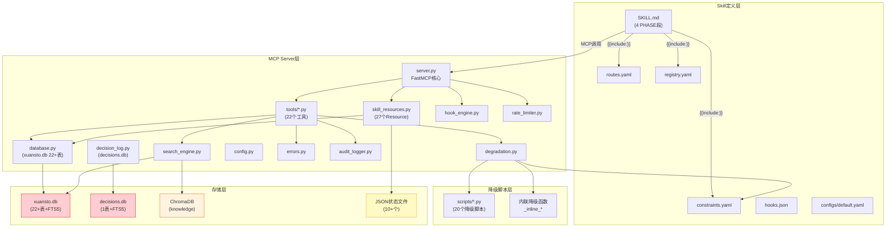

### 2.2 问题连锁影响矩阵

| 问题编号 | 直接受影响模块 | 间接受影响模块 | 外部依赖影响 |
|----------|---------------|---------------|-------------|
| **ARCH-01** | `server.py`, `tools/*.py` | Skill层(调用时序不确定), 降级链(异步/同步混合) | MCP协议客户端 |
| **ARCH-02** | `resource_load_status.py`, `token_budget.py` | Skill层(阶段推进延迟), 用户体验 | 无 |
| **ARCH-05** | `skill_resources.py`, `resource_subscribe.py` | Host客户端(无法订阅), 渐进式加载通知 | MCP协议客户端 |
| **DB-04** | `database.py` | `workflow_dispatch.py`(双表查询歧义), `skill_resources.py` | 无 |
| **DB-05** | `decision_log.py`, `database.py` | `workflow_dispatch.py`(跨库决策关联), `skill_resources.py` | 文件系统 |
| **DB-06** | `agent_manage.py`, `workflow_dispatch.py` | 启动恢复逻辑(三源对齐), `server_health.py` | 无 |
| **MCP-01** | `server.py`, `pyproject.toml` | 客户端版本判断, `server_health.py` | npm/pip客户端 |
| **SKILL-03** | `SKILL.md` | Skill层Token消耗, 渐进式加载效率 | Trae平台 |
| **SKILL-06** | `references/`, `resource_load_status.py` | 知识检索Token消耗, Phase 2加载时间 | 无 |
| **API-01** | `errors.py`, `config.py`, `pyproject.toml` | 客户端版本协商, API文档 | HTTP/MCP客户端 |
| **PERF-01** | 全局 | 所有性能相关决策缺乏数据支撑 | 无 |
| **PERF-03** | `token_budget.py`, `resource_load_status.py` | 降级触发可靠性, 上下文溢出风险 | 无 |

### 2.3 关键影响链路详解

#### 链路1：版本不一致 → 客户端兼容性风险

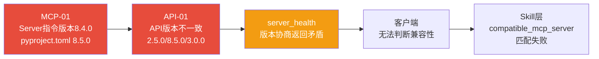

#### 链路2：数据冗余 → 一致性风险

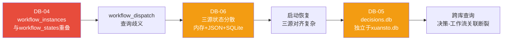

#### 链路3：Skill层膨胀 → Token效率风险

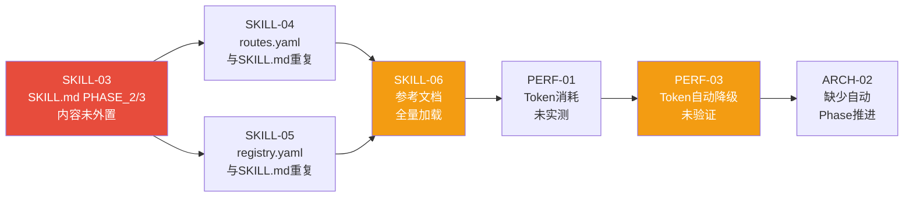

### 2.4 文件影响范围统计

| 文件/目录 | 受影响问题数 | 涉及问题编号 |
|-----------|-------------|-------------|
| `xuansto-mcp-server/src/xuansto_mcp/core/database.py` | 4 | DB-04, DB-05, DB-06, DB-08 |
| `xuansto-mcp-server/src/xuansto_mcp/server.py` | 3 | ARCH-01, MCP-01, ARCH-03 |
| `xuansto-mcp-server/src/xuansto_mcp/resources/skill_resources.py` | 3 | ARCH-05, MCP-02, MCP-03, MCP-04 |
| `.trae/skills/xuansto-skill-v2/SKILL.md` | 4 | SKILL-02, SKILL-03, SKILL-04, SKILL-05 |
| `xuansto-mcp-server/src/xuansto_mcp/tools/resource_load_status.py` | 3 | ARCH-02, SKILL-06, PERF-02 |
| `xuansto-mcp-server/src/xuansto_mcp/tools/token_budget.py` | 2 | ARCH-02, PERF-03 |
| `xuansto-mcp-server/src/xuansto_mcp/tools/decision_log.py` | 2 | DB-05, DB-07 |
| `xuansto-mcp-server/src/xuansto_mcp/core/config.py` | 2 | ARCH-15, API-01 |
| `xuansto-mcp-server/src/xuansto_mcp/core/errors.py` | 2 | API-01, ARCH-01 |
| `.trae/skills/xuansto-skill-v2/constraints.yaml` | 2 | SKILL-06, SKILL-08 |

---

## 3. 优先级矩阵

### 3.1 优先级定义

| 级别 | 定义 | 修复窗口 | 依据 |
|------|------|----------|------|
| **紧急(Urgent)** | 阻塞核心功能或导致数据丢失 | 立即（1-3天） | 影响数据完整性或核心交互链路 |
| **高(High)** | 严重影响系统可靠性或一致性 | 1周内 | 影响跨模块一致性或关键降级路径 |
| **中(Medium)** | 影响开发效率或用户体验 | 1个迭代周期 | 功能缺失但不阻塞核心流程 |
| **低(Low)** | 技术债务或远期优化 | 下个版本 | 不影响当前功能，但增加维护成本 |

### 3.2 优先级矩阵

| 编号 | 描述 | 影响域 | 优先级 | 依据 |
|------|------|--------|--------|------|
| **MCP-01** | Server指令版本(8.4.0)与pyproject.toml(8.5.0)不一致 | MCP | **紧急** | 客户端版本判断直接受影响，是API-01的根因 |
| **API-01** | API版本号三源不一致(2.5.0/8.5.0/3.0.0) | API | **紧急** | 版本协商返回矛盾，客户端无法判断兼容性 |
| **DB-04** | workflow_instances与workflow_states表结构重叠 | 数据 | **高** | 数据冗余导致查询歧义，是DB-06的根因之一 |
| **DB-05** | decisions.db仍独立于xuansto.db | 数据 | **高** | 跨库一致性风险，决策-工作流关联断裂 |
| **ARCH-01** | Skill-MCP通信同步/异步混合 | 架构 | **高** | 调用时序不确定，影响降级链可靠性 |
| **ARCH-02** | 渐进式加载缺少自动Phase推进 | 架构 | **高** | 需手动preload，用户体验差，与PERF-03关联 |
| **ARCH-05** | MCP Resource变更通知不可达 | 架构/MCP | **高** | Host端无法订阅状态变更，渐进式加载通知失效 |
| **SKILL-03** | SKILL.md PHASE_2/3内容应外置 | Skill | **高** | Token效率根因，与SKILL-04/05/06关联 |
| **SKILL-06** | 参考文档全量加载，缺两级加载 | Skill | **高** | Phase 2 Token消耗不可控 |
| **PERF-01** | 性能指标未实测 | 性能 | **高** | 所有性能相关决策缺乏数据支撑 |
| **PERF-03** | Token自动降级缺乏端到端验证 | 性能 | **高** | 上下文溢出风险，核心安全网未验证 |
| **DB-06** | Agent/Workflow状态三源分散 | 数据 | **中** | 恢复逻辑复杂，但已有原子写入缓解 |
| **DB-07** | JSON状态文件无事务保证 | 数据 | **中** | 并发场景有限，atomic_write已缓解 |
| **DB-08** | 知识库缺少自动定时对账 | 数据 | **中** | 手动reconcile已可用，自动对账为增强 |
| **ARCH-03** | Hook系统同步+异步混合 | 架构 | **中** | 超时机制已实现，混合模式影响有限 |
| **ARCH-04** | Agent管理缺少自动扩缩容 | 架构 | **中** | 20实例上限对大多数项目足够 |
| **ARCH-13** | 桌面构建仅Windows PowerShell | 架构 | **中** | 跨平台构建为增强需求 |
| **ARCH-15** | watchfiles在Windows下可能不稳定 | 架构 | **中** | 已有轮询降级机制 |
| **MCP-02** | Resource URI重复 | MCP | **中** | 功能不受影响，仅客户端混淆 |
| **MCP-03** | Token预算快照未暴露为Resource | MCP | **中** | 可通过token_budget工具查询 |
| **MCP-04** | Agent实例池未暴露为Resource | MCP | **中** | 可通过agent_status工具查询 |
| **SKILL-04** | routes.yaml与SKILL.md路由表重复 | Skill | **中** | 维护成本增加，功能不受影响 |
| **SKILL-05** | registry.yaml与SKILL.md Agent索引重复 | Skill | **中** | 维护成本增加，功能不受影响 |
| **SKILL-07** | commands/*.md参数与MCP工具参数冗余 | Skill | **中** | 双源维护风险 |
| **SKILL-08** | hooks.json静态配置无法根据Phase调整 | Skill | **中** | 当前minimal/standard/strict三级已够用 |
| **API-02** | 审计日志查询能力有限 | API | **中** | audit_query已实现基本功能 |
| **PERF-02** | Agent按需加载粒度不足 | 性能 | **中** | 按PHASE段加载已可用，单Agent粒度为优化 |
| **SKILL-01** | v1与v2存在重复文件 | Skill | **低** | 不影响功能，仅维护成本 |
| **SKILL-02** | SKILL.md行数可能超限 | Skill | **低** | 已通过PHASE标记缓解 |
| **ARCH-14** | API版本协商缺版本特定行为分支 | 架构 | **低** | 当前协商逻辑已覆盖基本场景 |

### 3.3 优先级分布图

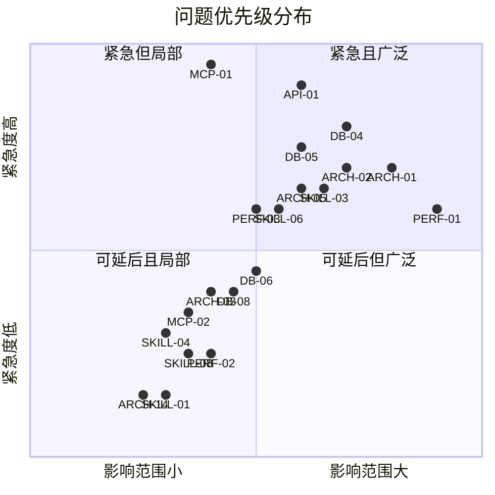

---

## 4. 模块化重构步骤

### 4.1 阶段总览

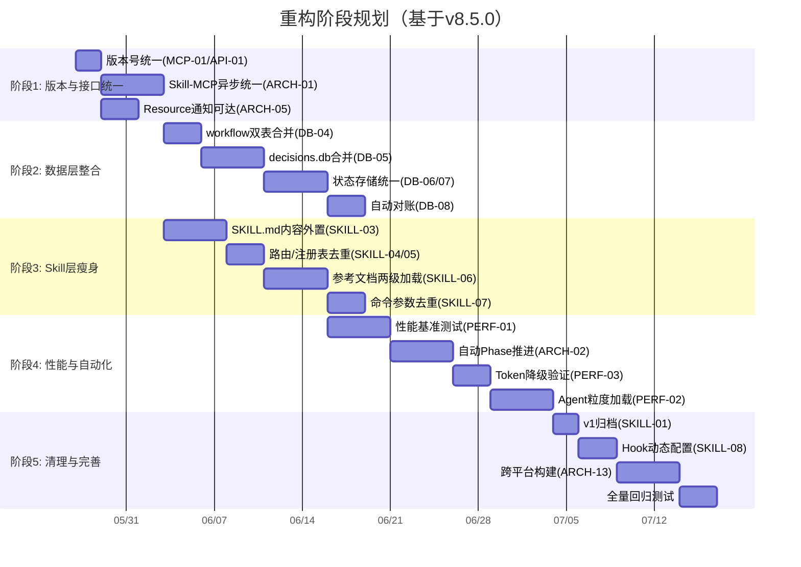

### 4.2 阶段1：版本与接口统一（紧急/高优先级）

**目标**：统一版本号，修复Skill-MCP通信一致性，实现Resource通知可达

| 步骤 | 输入 | 输出 | 验收标准 | 依赖 |
|------|------|------|----------|------|
| 1.1 统一版本号 | `server.py`(指令v8.4.0), `pyproject.toml`(v8.5.0), `config.py`(API 3.0.0) | 所有版本号统一为8.5.0/API 3.0.0 | `server_health(version)`返回一致版本；`pyproject.toml` version=8.5.0；Server指令描述更新 | 无 |
| 1.2 Skill-MCP异步统一 | `server.py`同步调用点, `tools/*.py`同步函数 | 所有Tool调用统一为async | 20个Tool全部使用async def；`_with_hook_interception`统一async包装；同步降级脚本用`asyncio.to_thread`包装 | 1.1 |
| 1.3 Resource通知可达 | `resource_subscribe.py`(已实现subscribe/unsubscribe/list) | Host端可订阅Resource变更 | `resource_subscribe` Tool在server.py注册；Phase变更时调用`notify_subscribers`；Host端收到`resource_updated`通知 | 1.1 |
| 1.4 Resource URI去重 | `skill_resources.py`(27个Resource，含重复URI) | 合并重复URI，保留规范URI | `xuansto://config/skill`与`xuansto://skill/config`合并为一个；`xuansto://references/quality-gates`与`xuansto://gates/definitions`统一 | 1.3 |

### 4.3 阶段2：数据层整合（高优先级）

**目标**：消除数据冗余，合并独立数据库，统一状态存储

| 步骤 | 输入 | 输出 | 验收标准 | 依赖 |
|------|------|------|----------|------|
| 2.1 合并workflow双表 | `workflow_instances`(旧) + `workflow_states`(新) | 统一`workflow_states`表，迁移旧表数据 | `workflow_instances`数据迁移完成；旧表标记`_legacy`；所有查询指向`workflow_states` | 阶段1 |
| 2.2 合并decisions.db | `decisions.db`(独立) → `xuansto.db` | `decisions`表和`decisions_fts`迁移到xuansto.db | `decision_log.py`连接统一为xuansto.db；FTS5索引重建；旧decisions.db保留为备份 | 2.1 |
| 2.3 统一状态存储 | Agent/Workflow/Session三处状态(内存+JSON+SQLite) | SQLite为唯一权威源，JSON仅备份 | `agent_manage.py`启动从SQLite恢复；`workflow_dispatch.py`启动从SQLite恢复；JSON文件写入为可选备份 | 2.2 |
| 2.4 实现自动对账 | `reconcile_knowledge_stores`(手动) | 定时自动对账(默认每小时) | `DegradationManager`健康检查线程增加对账触发；对账结果写入`kb_reconciliation_log`；失败条目自动重试 | 2.3 |

**数据迁移风险控制**：

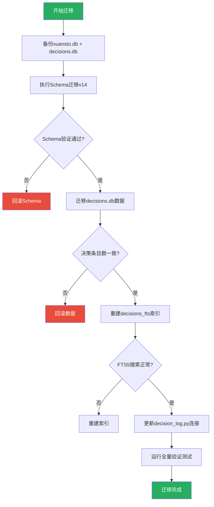

### 4.4 阶段3：Skill层瘦身（高/中优先级）

**目标**：减少SKILL.md体积，消除内容重复，实现参考文档两级加载

| 步骤 | 输入 | 输出 | 验收标准 | 依赖 |
|------|------|------|----------|------|
| 3.1 SKILL.md内容外置 | `SKILL.md` PHASE_2/3段(含`{{include:routes.yaml}}`和`{{include:registry.yaml}}`) | PHASE_2/3仅保留引用URI，内容通过MCP Resource按需加载 | SKILL.md总行数≤150行；PHASE_2仅含"完整路由见xuansto://commands/routes"；PHASE_3仅含"Hook系统见xuansto://hooks/definitions" | 阶段1 |
| 3.2 路由/注册表去重 | `SKILL.md`精简路由表 + `routes.yaml`完整路由 | SKILL.md仅保留路由入口说明，完整路由统一由routes.yaml提供 | SKILL.md PHASE_1路由表仅含命令名→Phase映射(≤10行)；详细路由通过`xuansto://commands/routes` Resource获取 | 3.1 |
| 3.3 参考文档两级加载 | `references/`(79+文件，全量加载) | 摘要(≤200 Token)→完整(≤5000 Token)两级加载 | 每个参考文档生成摘要版(`references/summary/*.md`)；Phase 2加载摘要，按需加载完整；`resource_load_status`支持`detail_level`参数 | 3.2 |
| 3.4 命令参数去重 | `commands/*.md`参数定义 + `tools/*.py` Pydantic Schema | 命令参数直接引用MCP工具Schema | `commands/*.md`参数表替换为"参数同MCP工具xxx的Schema"；消除双源维护 | 3.3 |

### 4.5 阶段4：性能与自动化（高/中优先级）

**目标**：建立性能基准，实现自动Phase推进，验证Token降级

| 步骤 | 输入 | 输出 | 验收标准 | 依赖 |
|------|------|------|----------|------|
| 4.1 性能基准测试 | 各Phase Token消耗目标值(未实测) | 实测基准数据报告 | Phase 0≤2K/Phase 1≤5K/Phase 2≤10K/Phase 3≤20K实测确认；加载时间Phase 0≤500ms/Phase推进≤3s实测确认 | 阶段3 |
| 4.2 自动Phase推进 | `resource_load_status.py`(手动preload) | 基于Token消耗和命令执行的自动推进 | 命令执行后自动检查是否需要推进；Token使用率<60%时自动推进到命令所需Phase；无需手动调用preload | 4.1 |
| 4.3 Token降级端到端验证 | `token_budget.py`(enforce逻辑) + `resource_load_status.py`(degrade_phase) | 端到端降级验证通过 | Token≥80%触发context_compress；Token≥95%触发degrade_phase；降级后功能正确受限；恢复后功能正确恢复 | 4.2 |
| 4.4 Agent粒度加载 | 当前按PHASE段整体加载57个Agent | 按需加载单个Agent定义 | Phase 2仅加载当前Phase所需Agent(≤15个)；其他Agent通过`xuansto://agents/{name}`按需加载；Agent定义加载≤300ms/个 | 4.3 |

### 4.6 阶段5：清理与完善（低优先级）

**目标**：归档v1，Hook动态化，跨平台构建，全量回归

| 步骤 | 输入 | 输出 | 验收标准 | 依赖 |
|------|------|------|----------|------|
| 5.1 v1文件归档 | `.trae/skills/xuansto-skill/`(v1目录) | v1标记archived | v1目录移至`archived/xuansto-skill-v1/`；v2为唯一维护版本 | 阶段4 |
| 5.2 Hook动态配置 | `hooks.json`(静态) + Phase信息 | Hook配置与加载阶段联动 | SKELETON阶段自动启用minimal；FUNCTIONAL启用standard；FULL启用strict；`hook_manage(list)`返回当前Phase对应配置 | 5.1 |
| 5.3 跨平台构建 | `scripts/build-desktop.ps1`(仅Windows) | 新增macOS/Linux构建脚本 | `scripts/build-desktop.sh`支持macOS/Linux；CI矩阵覆盖3平台 | 5.2 |
| 5.4 全量回归测试 | 全部测试套件 | 测试报告 | 100%通过率；新增测试覆盖新功能；性能基准在目标范围内 | 5.3 |

---

## 5. 按需加载与渐进式披露实现方案

### 5.1 当前状态与目标差距

| 维度 | 当前状态(v8.5.0) | 目标状态 | 差距 |
|------|-----------------|----------|------|
| SKILL.md分段加载 | ✅ 4段PHASE标记已实现 | 保持不变 | 无 |
| 命令驱动阶段推进 | ✅ 32个命令完整映射(COMMAND_PHASE_MAP) | 保持不变 | 无 |
| SKELETON阶段可用性 | ✅ /status, /help, /budget可用 | 保持不变 | 无 |
| 阶段降级自动恢复 | ✅ degrade_phase()已实现 | 保持不变 | 无 |
| 降级事件通知 | ⚠️ resource_subscribe已实现但Host端未消费 | Host端可订阅变更 | ARCH-05 |
| Token预算关联 | ✅ PHASE_TOKEN_BUDGET_MAP已实现 | 自动Phase推进 | ARCH-02 |
| 参考文档两级加载 | ❌ 全量加载 | 摘要→完整两级 | SKILL-06 |
| Agent粒度加载 | ❌ 按PHASE段整体加载 | 单Agent按需加载 | PERF-02 |
| SKILL.md内容外置 | ❌ PHASE_2/3内联完整内容 | 仅保留引用URI | SKILL-03 |
| 披露过渡提示 | ⚠️ phase_transition_templates已定义 | 实际推送给用户 | 需验证 |

### 5.2 四阶段设计详解

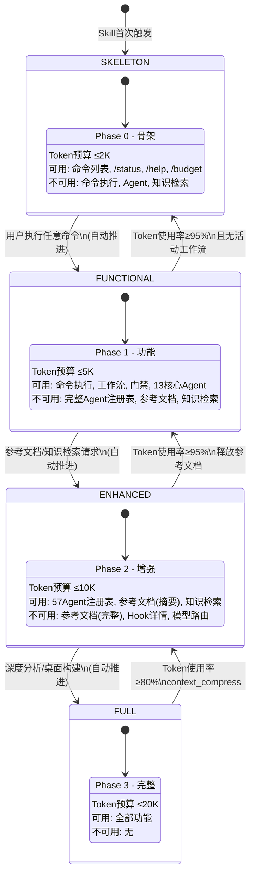

### 5.3 状态机实现

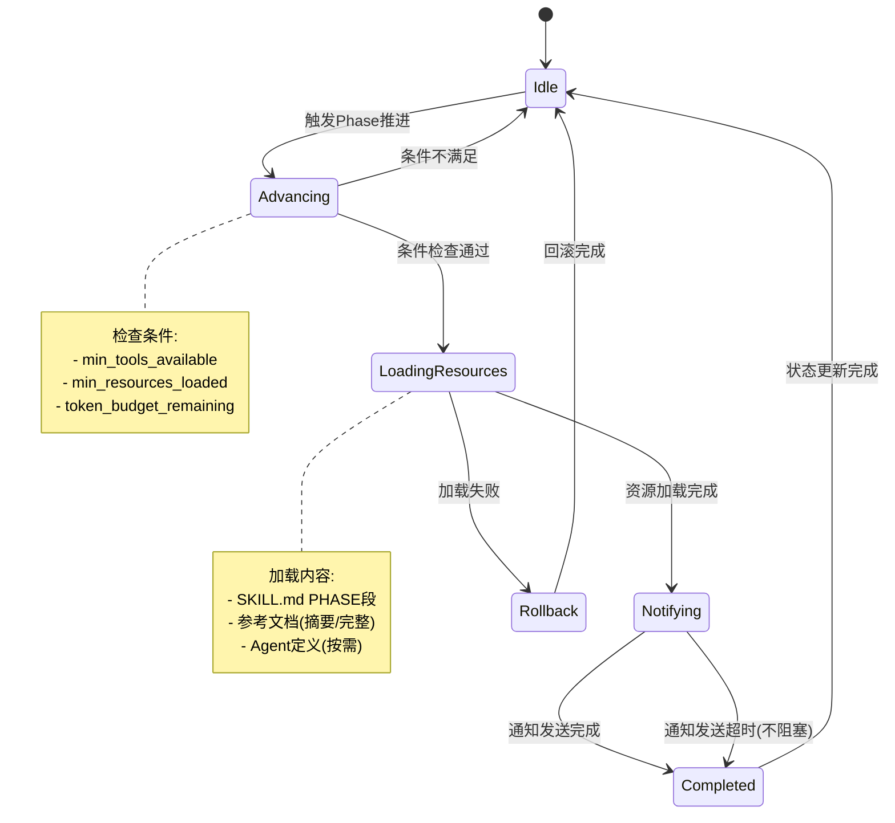

### 5.4 参考文档两级加载设计

| 加载级别 | Token预算 | 内容 | 触发条件 |
|----------|----------|------|----------|
| 摘要(Summary) | ≤200 Token/文档 | 标题+核心要点+适用场景 | Phase 2自动加载 |
| 完整(Full) | ≤5000 Token/文档 | 完整定义+示例+参数 | 用户明确请求或命令需要 |

**摘要生成规则**：

| 参考文档 | 摘要内容 | 完整内容 |
|----------|----------|----------|
| quality-gates.md | 54项门禁ID+级别+Phase列表 | 每项门禁的完整判定标准和修复建议 |
| agent-registry.md | 13层57个Agent名称+Phase列表 | 每个Agent的完整能力描述和模型路由 |
| mcp-tools.md | 20个工具名+核心action列表 | 每个工具的完整参数Schema和返回值 |
| workflow-phases.md | 9阶段名称+关键门禁列表 | 每个阶段的完整输入/输出/验收标准 |
| security-guidelines.md | OWASP Top 10类别列表 | 每个类别的完整检测规则和修复方案 |

### 5.5 过渡动画与用户提示

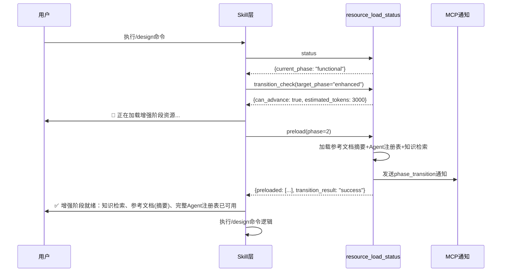

**披露提示模板**：

| 转换 | 加载中提示 | 就绪提示 |
|------|-----------|---------|
| SKELETON→FUNCTIONAL | 🔄 正在加载功能阶段... | ✅ 功能阶段就绪：命令执行、工作流推进、质量门禁已可用 |
| FUNCTIONAL→ENHANCED | 🔄 正在加载增强阶段... | ✅ 增强阶段就绪：知识检索、参考文档(摘要)、完整Agent注册表已可用 |
| ENHANCED→FULL | 🔄 正在加载完整阶段... | ✅ 完整阶段就绪：Hook系统、模型路由、参考文档(完整)已可用 |
| FULL→ENHANCED | ⚠️ Token预算紧张，降级到增强阶段 | 增强阶段运行中：完整参考文档和Hook系统已卸载 |
| ENHANCED→FUNCTIONAL | ⚠️ Token预算紧张，降级到功能阶段 | 功能阶段运行中：知识检索和参考文档已卸载 |

### 5.6 性能指标

| 指标 | 目标值 | 当前状态 | 测量方式 |
|------|--------|----------|----------|
| Phase 0 Token消耗 | ≤2K | ✅ 理论达标 | SKILL.md PHASE_0段Token计数 |
| Phase 1 Token消耗 | ≤5K | ✅ 理论达标 | SKILL.md PHASE_0+1段Token计数 |
| Phase 2 Token消耗 | ≤10K | ⚠️ 含`{{include:}}`后可能超限 | 实际加载后Token计数 |
| Phase 3 Token消耗 | ≤20K | ⚠️ 含完整参考文档后可能超限 | 实际加载后Token计数 |
| Phase 0 加载时间 | ≤500ms | ❌ 未实测 | resource_load_status首次调用耗时 |
| Phase 推进时间 | ≤3s/Phase | ❌ 未实测 | preload(phase=N)调用耗时 |
| Agent定义加载 | ≤300ms/个 | ❌ 未实测 | xuansto://agents/{name}读取耗时 |
| 知识检索响应 | ≤3s(hybrid) | ❌ 未实测 | knowledge_search(retrieve)耗时 |
| 降级恢复延迟 | ≤30s | ❌ 未实测 | degrade_phase()→自动恢复检测间隔 |
| 阶段转换通知延迟 | ≤1s | ❌ 未实测 | Phase变更→MCP通知到达时间 |

---

## 6. 测试策略

### 6.1 测试分层架构


### 6.2 单元测试

#### 6.2.1 MCP Tool单元测试

| 工具 | 测试场景 | 预期结果 | 优先级 |
|------|----------|----------|--------|
| knowledge_search | retrieve with hybrid | 返回{status:"success",data:{results,strategy}} | 高 |
| knowledge_search | ChromaDB不可用降级 | strategy降级为sqlite_fts5 | 高 |
| knowledge_search | 全部不可用降级 | 返回keyword_fallback结果 | 中 |
| quality_gate_check | 指定gate_ids检查 | 返回checks数组，每项含status | 高 |
| quality_gate_check | 全部54项检查 | 返回54项结果，BLOCK/WARN/INFO分级 | 高 |
| resource_load_status | status查询 | 返回current_phase, resources, available_functions | 高 |
| resource_load_status | preload推进 | 返回preloaded列表和transition_result | 高 |
| resource_load_status | disclosure_transition | 返回阶段转换所需资源估算 | 高 |
| workflow_dispatch | start工作流 | 返回workflow_id和status="running" | 高 |
| workflow_dispatch | phase推进 | current_phase递增，门禁检查触发 | 高 |
| token_budget | set_from_phase | 根据阶段自动调整预算分配 | 高 |
| token_budget | enforce(80%/95%) | 触发压缩/降级 | 高 |
| decision_log | log+reconcile | 决策写入SQLite，对账一致 | 高 |
| agent_manage | create/assign/release | 状态正确转换，SQLite持久化 | 中 |
| server_health | negotiate_version | 兼容性判断正确 | 中 |
| audit_query | 按条件查询 | 返回匹配审计记录 | 中 |
| config_manage | reload配置 | 配置热更新生效 | 中 |
| resource_subscribe | subscribe/unsubscribe | 订阅状态正确，通知可达 | 中 |

#### 6.2.2 状态管理单元测试

| 组件 | 测试场景 | 预期结果 |
|------|----------|----------|
| LoadPhase | 枚举值正确 | SKELETON/FUNCTIONAL/ENHANCED/FULL |
| LoadingState | 初始化 | current_phase=SKELETON, degraded=False |
| LoadingState | degrade_phase() | degraded=True, degraded_from记录原阶段 |
| PhaseTransition | SKELETON→FUNCTIONAL条件 | min_tools=5, min_resources=3 |
| PhaseTransition | 降级条件检查 | token_usage_ratio≥0.80触发降级 |
| COMMAND_PHASE_MAP | 32个命令映射 | 每个命令都有明确的目标阶段 |
| PHASE_SKILL_MAP | PHASE_0→SKELETON等4映射 | 映射正确 |
| PHASE_TOKEN_BUDGET_MAP | 4阶段Token预算 | SKELETON=2000, FUNCTIONAL=5000, ENHANCED=10000, FULL=20000 |

### 6.3 集成测试

#### 6.3.1 Skill-MCP联动测试

| 测试场景 | 步骤 | 预期结果 |
|----------|------|----------|
| /init完整流程 | 1.skill_analyze 2.knowledge_search 3.workflow_dispatch(start) 4.project_init 5.decision_log | 工作流创建成功，Agent分配完成 |
| /plan完整流程 | 1.skill_analyze 2.knowledge_search 3.agent_status 4.workflow_dispatch(phase=2) 5.decision_log 6.token_budget | 架构设计阶段推进，Token预算更新 |
| /loop循环模式 | 1.workflow_dispatch(start) 2.循环执行Phase 0-8 3.session_manage(save) | 循环完成或达到max_iterations，状态持久化 |
| 降级链路测试 | 1.模拟MCP不可用 2.触发脚本降级 3.模拟脚本失败 4.触发内联降级 | 降级结果格式与MCP一致，degraded=True |

#### 6.3.2 渐进式加载流程测试

| 测试场景 | 步骤 | 预期结果 |
|----------|------|----------|
| 完整加载流程 | SKELETON→preload(1)→preload(2)→preload(3) | 每阶段资源正确加载，Token预算递增 |
| 降级恢复流程 | FULL→Token超限降级→ENHANCED→恢复→FULL | 降级和恢复正确触发，资源正确卸载/加载 |
| 命令驱动推进 | 在SKELETON执行/init | 自动推进到FUNCTIONAL |
| 知识检索门控 | 在SKELETON调用knowledge_search | 返回不可用提示，建议升级到ENHANCED |
| 通知推送 | Phase变更 | MCP通知到达Host端 |
| 参考文档两级加载 | Phase 2加载摘要→按需加载完整 | 摘要≤200 Token，完整≤5000 Token |

#### 6.3.3 双写一致性测试

| 测试场景 | 步骤 | 预期结果 |
|----------|------|----------|
| 正常双写 | knowledge_inject → SQLite → ChromaDB | sync_status='ready'，两存储一致 |
| ChromaDB写入失败 | 模拟ChromaDB异常 | sync_status='failed'，3次重试后标记 |
| 自动对账 | 触发reconcile_knowledge_stores | failed条目重试，成功标记ready |
| 自动定时对账 | 等待对账周期触发 | 自动检测并修复不一致 |

### 6.4 端到端测试

| 测试场景 | 完整交互流程 | 验证点 |
|----------|-------------|--------|
| Web项目全流程 | /init→/plan→/implement→/test→/review→/accept→/deploy | 9阶段工作流完整执行，54项门禁通过 |
| 桌面项目全流程 | /init→/plan→/implement→/build-desktop→/release-desktop | 桌面构建和签名门禁通过 |
| 降级容错全链路 | 模拟MCP不可用→脚本降级→内联降级→恢复 | 降级链路完整，恢复后功能正常 |
| 渐进式加载全流程 | SKELETON→各命令触发推进→FULL→Token超限降级→恢复 | 阶段转换正确，Token预算联动 |
| 长时间工作流 | /loop模式执行50次迭代 | 状态持久化正确，无内存泄漏 |
| 版本协商 | 不同版本客户端连接 | 协商结果正确，不兼容时优雅降级 |

### 6.5 回归验证方案

| 验证项 | 方法 | 通过标准 |
|--------|------|----------|
| 已修复问题不回退 | 针对PROBLEM.md中35项已修复问题运行专项测试 | 全部通过 |
| MCP Tool功能完整性 | 22个Tool各执行1次标准调用 | 全部返回success |
| Resource可访问性 | 27个Resource各读取1次 | 全部返回有效内容 |
| 降级链路完整性 | 每个Tool模拟MCP不可用 | 降级结果格式一致(20/20) |
| 数据迁移完整性 | 迁移前后条目数对比 | 100%一致 |
| Token预算准确性 | 各Phase Token消耗测量 | 在预算±10%范围内 |
| 渐进式加载正确性 | 4阶段推进+降级+恢复 | 状态转换正确 |
| 版本号一致性 | server_health + pyproject.toml + config.py | 三源版本一致 |

---

## 7. CI建议

### 7.1 CI流水线设计

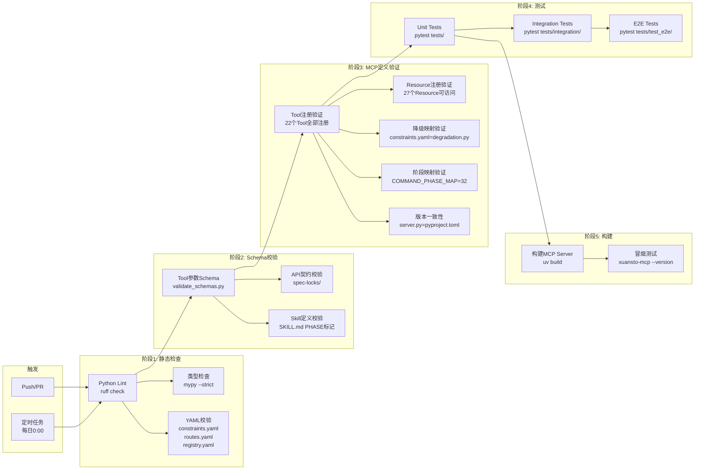

### 7.2 具体CI步骤

#### 7.2.1 Lint检查（ruff）

```yaml
lint:
  runs-on: ubuntu-latest
  steps:
    - uses: actions/checkout@v4
    - uses: astral-sh/ruff-action@v1
      with:
        args: check xuansto-mcp-server/src/
    - run: ruff format --check xuansto-mcp-server/src/
```

ruff配置（已在`pyproject.toml`中定义）：

| 规则 | 设置 |
|------|------|
| line-length | 120 |
| target-version | py310 |
| select | E, F, W, I, N, UP, B, A, SIM |
| ignore | E501 |

#### 7.2.2 Schema校验（validate_schemas.py）

```yaml
schema-validate:
  runs-on: ubuntu-latest
  steps:
    - uses: actions/checkout@v4
    - name: Validate Tool Parameter Schemas
      run: |
        python xuansto-mcp-server/scripts/validate_schemas.py \
          --tools xuansto-mcp-server/src/xuansto_mcp/tools/ \
          --lock xuansto-mcp-server/spec-locks/tool-parameter-schemas.json
    - name: Validate API Contract
      run: |
        python xuansto-mcp-server/scripts/validate_schemas.py \
          --api xuansto-mcp-server/src/xuansto_mcp/api_routes.py \
          --lock xuansto-mcp-server/spec-locks/api-contract-version.json
    - name: Validate Skill Definition
      run: |
        python xuansto-mcp-server/scripts/validate_schemas.py \
          --skill .trae/skills/xuansto-skill-v2/SKILL.md \
          --lock xuansto-mcp-server/spec-locks/skill-definition-schema.json
```

#### 7.2.3 MCP定义验证

```yaml
mcp-validate:
  runs-on: ubuntu-latest
  steps:
    - uses: actions/checkout@v4
    - name: Verify Tool Registration (22 tools)
      run: |
        python -c "
        from xuansto_mcp.tools import TOOL_REGISTRY
        expected = {'skill_analyze','knowledge_search','knowledge_inject',
                    'quality_gate_check','spec_drift_detect','security_scan',
                    'code_simplify','session_manage','workflow_dispatch',
                    'agent_status','agent_manage','hook_manage',
                    'resource_load_status','resource_subscribe',
                    'context_compress','server_health',
                    'decision_log','token_budget','project_init',
                    'metrics_report','config_manage','audit_query'}
        actual = set(TOOL_REGISTRY.keys())
        assert actual == expected, f'Missing: {expected-actual}, Extra: {actual-expected}'
        "
    - name: Verify Version Consistency
      run: |
        python -c "
        import tomllib
        from xuansto_mcp.core.config import MCP_API_VERSION
        with open('xuansto-mcp-server/pyproject.toml','rb') as f:
            pyproject = tomllib.load(f)
        pyproject_version = pyproject['project']['version']
        # Server指令版本应与pyproject.toml一致
        assert pyproject_version == '8.5.0', f'Version mismatch: {pyproject_version}'
        "
    - name: Verify Degradation Mapping (20/20)
      run: |
        python xuansto-mcp-server/scripts/verify_degradation_consistency.py \
          --degradation xuansto-mcp-server/src/xuansto_mcp/core/degradation.py \
          --constraints .trae/skills/xuansto-skill-v2/constraints.yaml
    - name: Verify COMMAND_PHASE_MAP (32/32)
      run: |
        python xuansto-mcp-server/scripts/verify_phase_map.py \
          --routes .trae/skills/xuansto-skill-v2/commands/routes.yaml \
          --loader xuansto-mcp-server/src/xuansto_mcp/tools/resource_load_status.py
```

#### 7.2.4 测试执行

```yaml
test:
  runs-on: ubuntu-latest
  needs: [lint, schema-validate, mcp-validate]
  steps:
    - uses: actions/checkout@v4
    - name: Unit Tests
      run: |
        cd xuansto-mcp-server
        uv run pytest tests/ -m "not integration and not e2e" --cov=xuansto_mcp --cov-report=xml
    - name: Integration Tests
      run: |
        cd xuansto-mcp-server
        uv run pytest tests/integration/ -v
    - name: E2E Tests
      run: |
        cd xuansto-mcp-server
        uv run pytest tests/test_e2e/ -v --timeout=120
```

#### 7.2.5 构建与冒烟测试

```yaml
build:
  runs-on: ubuntu-latest
  needs: [test]
  steps:
    - uses: actions/checkout@v4
    - name: Build Package
      run: |
        cd xuansto-mcp-server
        uv build
    - name: Smoke Test
      run: |
        cd xuansto-mcp-server
        uv run xuansto-mcp --version
        uv run xuansto-mcp --help
```

### 7.3 定时任务

```yaml
scheduled:
  runs-on: ubuntu-latest
  schedule:
    - cron: "0 0 * * *"
  steps:
    - name: Full Regression
      run: |
        cd xuansto-mcp-server
        uv run pytest tests/ -v --timeout=300
    - name: Data Consistency Check
      run: |
        python xuansto-mcp-server/scripts/check_db_consistency.py \
          --db .xuansto/xuansto.db \
          --chroma .knowledge/index/chroma_db
    - name: Performance Baseline
      run: |
        python xuansto-mcp-server/scripts/performance_baseline.py \
          --phases 4 \
          --iterations 10
```

### 7.4 CI质量门禁

| 门禁 | 条件 | 失败处理 |
|------|------|----------|
| Lint通过 | ruff check 0 errors | 阻止合并 |
| 类型检查通过 | mypy --strict 0 errors | 警告（初期） |
| Schema一致 | Tool/API/Skill Schema与spec-locks一致 | 阻止合并 |
| Tool注册完整 | 22个Tool全部注册 | 阻止合并 |
| 版本号一致 | server.py = pyproject.toml = config.py | 阻止合并 |
| 降级映射一致 | constraints.yaml = degradation.py (20/20) | 阻止合并 |
| 阶段映射完整 | COMMAND_PHASE_MAP = 32个命令 | 阻止合并 |
| 单元测试通过 | 100%通过率 | 阻止合并 |
| 覆盖率达标 | ≥80% | 警告 |
| 构建成功 | uv build无错误 | 阻止合并 |
| 冒烟测试通过 | --version/--help正常 | 阻止合并 |

---

## 附录A：已修复问题归档（PROBLEM.md v8.5.0）

| 编号 | 优先级 | 描述 | 修复版本 | 影响域 |
|------|--------|------|----------|--------|
| P0-01 | P0 | v2降级模式不可用 | v8.0.0 | 架构 |
| P0-02 | P0 | v2缺少references/完整参考文档 | v8.0.0 | Skill |
| P1-01 | P1 | MCP Server版本与Skill版本不一致 | v8.0.0 | MCP |
| P1-02 | P1 | server_health工具未在v2 mcp-tools.md中列出 | v8.0.0 | MCP |
| P1-03 | P1 | knowledge_search缺少inject/precipitate action文档 | v8.0.0 | MCP |
| P1-04 | P1 | skill_tools.py单文件过大(2300+行) | v8.1.0 | 架构 |
| P1-05 | P1 | 降级映射硬编码 | v8.1.0 | 架构 |
| P1-06 | P1 | Skill层与MCP层加载状态缺乏双向同步 | v8.1.0 | Skill |
| P2-01 | P2 | v2缺少评估配置文件 | v8.1.0 | Skill |
| P2-02 | P2 | v2缺少CHANGELOG.md | v8.1.0 | Skill |
| ARCH-05 | P1 | MCP Server未暴露Resource | v8.4.0 | MCP |
| ARCH-06 | P1 | 缺少Agent持久化机制 | v8.4.0 | 架构 |
| ARCH-07 | P1 | 工作流状态仅内存存储 | v8.4.0 | 架构 |
| ARCH-08 | P1 | Token预算与加载阶段未关联 | v8.4.0 | 架构 |
| ARCH-09 | P1 | Hook执行无超时保护 | v8.4.0 | 架构 |
| ARCH-10 | P1 | 配置变更需重启MCP Server | v8.4.0 | 架构 |
| ARCH-11 | P1 | 错误处理不统一 | v8.4.0 | 架构 |
| ARCH-12 | P1 | 缺少API版本协商机制 | v8.4.0 | 架构 |
| DB-01 | P1 | 决策记录双写一致性风险 | v8.5.0 | 数据 |
| DB-02 | P1 | ChromaDB与SQLite双写无事务保证 | v8.5.0 | 数据 |
| DB-03 | P2 | 知识条目版本历史无清理策略 | v8.4.0 | 数据 |
| MCP-02 | P1 | 缺少Resource暴露 | v8.4.0 | MCP |
| MCP-03 | P1 | 工具调用无审计日志 | v8.4.0 | MCP |
| SKILL-01 | P1 | PHASE标记与LoadPhase枚举值不对应 | v8.1.0 | Skill |
| SKILL-02 | P2 | SKELETON阶段无可用命令 | v8.5.0 | Skill |
| SKILL-03 | P1 | 降级时Skill层不感知MCP层状态 | v8.1.0 | Skill |
| API-01 | P1 | HTTP API与MCP stdio两套接口无统一Schema | v8.4.0 | API |
| API-02 | P1 | 降级脚本返回格式与MCP工具不一致 | v8.1.0 | API |
| NEW-01 | P1 | 降级映射不完整(14/20) | v8.5.0 | 架构 |
| NEW-03 | P1 | Schema验证缺失 | v8.5.0 | 架构 |
| NEW-05 | P1 | COMMAND_PHASE_MAP不完整(6/32) | v8.5.0 | Skill |
| NEW-06 | P1 | 质量门禁不完整(13/54) | v8.5.0 | Skill |
| NEW-07 | P1 | 双SQLite数据库分裂 | v8.5.0 | 数据 |
| NEW-08 | P1 | 缺少Resource订阅机制 | v8.5.0 | MCP |
| NEW-09 | P1 | 缺少审计日志查询 | v8.5.0 | MCP |

> **统计**：已修复35项，未修复1项(P3-01→SKILL-01)，缓解1项(P3-02→SKILL-02)

## 附录B：版本规划摘要

| 版本 | 目标日期 | 主要内容 | 涉及问题 |
|------|----------|----------|----------|
| v8.5.1 | 2026-06-02 | 版本统一+接口统一 | MCP-01, API-01, ARCH-01, ARCH-05, MCP-02 |
| v8.6.0 | 2026-07-15 | 数据层整合+Skill瘦身 | DB-04, DB-05, DB-06/07/08, SKILL-03/04/05/06/07 |
| v8.7.0 | 2026-08-31 | 性能自动化+清理完善 | PERF-01/02/03, ARCH-02, SKILL-01/08, ARCH-13 |

## 附录C：关键文件变更清单

| 文件 | 变更类型 | 涉及阶段 |
|------|----------|----------|
| `xuansto-mcp-server/src/xuansto_mcp/server.py` | 版本号统一+异步统一 | 阶段1 |
| `xuansto-mcp-server/pyproject.toml` | 版本号确认 | 阶段1 |
| `xuansto-mcp-server/src/xuansto_mcp/core/config.py` | API版本统一 | 阶段1 |
| `xuansto-mcp-server/src/xuansto_mcp/resources/skill_resources.py` | Resource URI去重+通知 | 阶段1 |
| `xuansto-mcp-server/src/xuansto_mcp/core/database.py` | workflow双表合并+decisions合并 | 阶段2 |
| `xuansto-mcp-server/src/xuansto_mcp/tools/decision_log.py` | 连接统一xuansto.db | 阶段2 |
| `xuansto-mcp-server/src/xuansto_mcp/tools/agent_manage.py` | SQLite权威源 | 阶段2 |
| `xuansto-mcp-server/src/xuansto_mcp/tools/workflow_dispatch.py` | SQLite权威源 | 阶段2 |
| `.trae/skills/xuansto-skill-v2/SKILL.md` | 内容外置+瘦身 | 阶段3 |
| `.trae/skills/xuansto-skill-v2/commands/routes.yaml` | 去重 | 阶段3 |
| `.trae/skills/xuansto-skill-v2/agents/registry.yaml` | 去重 | 阶段3 |
| `.trae/skills/xuansto-skill-v2/references/summary/` | 新增摘要目录 | 阶段3 |
| `xuansto-mcp-server/src/xuansto_mcp/tools/resource_load_status.py` | 自动推进+两级加载 | 阶段4 |
| `xuansto-mcp-server/src/xuansto_mcp/tools/token_budget.py` | 自动降级验证 | 阶段4 |
| `.github/workflows/ci.yml` | 新增CI步骤 | 阶段5 |
