# Xuansto Skill v2 综合重构计划

> 版本：1.0.0 | 生成日期：2026-05-25
> 基线版本：Skill v8.0.0 / MCP Server v8.0.0
> 数据来源：ARCHITECTURE.md、DATABASE_DESIGN.md、MCP_REVIEW.md、SKILL_REVIEW.md、API_SPECIFICATION.md、PROBLEM.md

---

## 目录

- [1. 统一问题清单](#1-统一问题清单)
- [2. 影响链分析](#2-影响链分析)
- [3. 优先级矩阵](#3-优先级矩阵)
- [4. 模块化重构步骤](#4-模块化重构步骤)
- [5. 渐进式加载披露实现方案](#5-渐进式加载披露实现方案)
- [6. 测试策略](#6-测试策略)
- [7. 持续集成建议](#7-持续集成建议)

---

## 1. 统一问题清单

### 1.1 问题来源与合并说明

本清单合并了以下6份文档中的所有问题，去重后共 **32 项**（原 PROBLEM.md 30 项 + 新发现 2 项）：

| 来源文档 | 原有问题数 | 已合并 | 新增 |
|----------|-----------|--------|------|
| PROBLEM.md | 30 | 30 | — |
| ARCHITECTURE.md | 14 (差异表) | 12 已覆盖 | ARCH-13, ARCH-05状态更新 |
| DATABASE_DESIGN.md | 5 (迁移风险) | 5 已覆盖 | — |
| MCP_REVIEW.md | 4 (建议Resource) | 2 已覆盖 | MCP-04 |
| SKILL_REVIEW.md | 8 (附录摘要) | 8 已覆盖 | — |
| API_SPECIFICATION.md | 3 (Schema差异) | 3 已覆盖 | — |

**新发现问题**：

- **ARCH-13**：ARCHITECTURE.md 差异表指出"Resource 订阅已实现但推送通知未实现"，原 ARCH-05 描述"无 Resource 暴露"已过时（当前已有 22 个 Resource），需拆分为独立问题
- **MCP-04**：MCP_REVIEW.md 建议新增 4 个便捷 Resource（`xuansto://agents/{name}` 无需 layer、`xuansto://knowledge/stats`、`xuansto://decisions/latest`、`xuansto://workflows/active`），原问题清单未覆盖

### 1.2 完整问题清单

#### P0 — 阻塞性问题

| ID | 描述 | 影响域 | 状态 | 优先级 | 受影响文件 |
|----|------|--------|------|--------|-----------|
| P0-01 | v2 降级模式不可用 | MCP | ✅ Fixed | P0 | `scripts/knowledge_server/degradation.py` |
| P0-02 | v2 缺少 references/ 完整参考文档 | Skill | ✅ Fixed | P0 | `.trae/skills/xuansto-skill-v2/references/` |

#### P1 — 高优先级问题

| ID | 描述 | 影响域 | 状态 | 优先级 | 受影响文件 |
|----|------|--------|------|--------|-----------|
| P1-01 | MCP Server 版本与 Skill 版本不一致 | Skill | ✅ Fixed | P1 | `SKILL.md` |
| P1-02 | server_health 工具未在 mcp-tools.md 中列出 | Skill | ✅ Fixed | P1 | `references/mcp-tools.md` |
| P1-03 | knowledge_search 缺少 inject/precipitate action 文档 | Skill | ✅ Fixed | P1 | `references/mcp-tools.md` |
| P1-04 | skill_tools.py 单文件过大(2300+行) | Architecture | ✅ Fixed | P1 | `scripts/knowledge_server/skill_tools.py`, `scripts/knowledge_server/tools/` |
| P1-05 | 降级映射硬编码 | MCP | ✅ Fixed | P1 | `scripts/knowledge_server/degradation.py`, `constraints.yaml` |
| P1-06 | Skill 层与 MCP 层加载状态缺乏双向同步 | Skill | ✅ Fixed | P1 | `scripts/knowledge_server/progressive_loader.py` |

#### P2 — 中等优先级问题

| ID | 描述 | 影响域 | 状态 | 优先级 | 受影响文件 |
|----|------|--------|------|--------|-----------|
| P2-01 | v2 缺少评估配置文件 | Skill | ✅ Fixed | P2 | `evals/mcp_evaluation.xml`, `evals/trigger_eval.json` |
| P2-02 | v2 缺少 CHANGELOG.md | Skill | ✅ Fixed | P2 | `CHANGELOG.md` |

#### P3 — 低优先级问题

| ID | 描述 | 影响域 | 状态 | 优先级 | 受影响文件 |
|----|------|--------|------|--------|-----------|
| P3-01 | v1 与 v2 存在重复文件 | Architecture | Open | P3 | `agents/`, `commands/`, `workflows/` |
| P3-02 | SKILL.md 行数可能超过 500 行 | Skill | Deferred | P3 | `SKILL.md` |

#### ARCH — 架构问题

| ID | 描述 | 影响域 | 状态 | 优先级 | 受影响文件 |
|----|------|--------|------|--------|-----------|
| ARCH-05 | MCP Server Resource 暴露不完整（22 个已暴露，推送通知未实现） | Architecture | ✅ Fixed | P2 | `xuansto-mcp-server/src/xuansto_mcp/resources/skill_resources.py` |
| ARCH-06 | 缺少 Agent 持久化机制 | Data | ✅ Fixed | P2 | `xuansto-mcp-server/src/xuansto_mcp/tools/agent_manage.py`, `xuansto-mcp-server/src/xuansto_mcp/core/database.py` |
| ARCH-07 | 工作流状态仅内存存储 | Data | ✅ Fixed | P2 | `xuansto-mcp-server/src/xuansto_mcp/tools/workflow_dispatch.py` |
| ARCH-08 | Token 预算与加载阶段未关联 | Architecture | ✅ Fixed | P2 | `xuansto-mcp-server/src/xuansto_mcp/tools/token_budget.py`, `xuansto-mcp-server/src/xuansto_mcp/tools/resource_load_status.py` |
| ARCH-09 | Hook 执行无超时保护 | Architecture | ✅ Fixed | P2 | `xuansto-mcp-server/src/xuansto_mcp/core/hook_engine.py` |
| ARCH-10 | 配置变更需重启 MCP Server | Architecture | ✅ Fixed | P3 | `xuansto-mcp-server/src/xuansto_mcp/core/config.py`, `constraints.yaml`, `hooks/hooks.json` |
| ARCH-11 | 错误处理不统一（部分工具返回字符串而非 JSON） | API | ✅ Fixed | P1 | `xuansto-mcp-server/src/xuansto_mcp/tools/*.py`, `xuansto-mcp-server/src/xuansto_mcp/core/errors.py` |
| ARCH-12 | 缺少 API 版本协商机制 | API | ✅ Fixed | P3 | `xuansto-mcp-server/src/xuansto_mcp/tools/server_health.py`, `xuansto-mcp-server/src/xuansto_mcp/core/config.py` |
| ARCH-13 | Resource 订阅推送通知未实现 | Architecture | ✅ Fixed | P2 | `xuansto-mcp-server/src/xuansto_mcp/resources/skill_resources.py` |

#### DB — 数据问题

| ID | 描述 | 影响域 | 状态 | 优先级 | 受影响文件 |
|----|------|--------|------|--------|-----------|
| DB-01 | 决策记录双写一致性风险 | Data | ✅ Fixed | P1 | `xuansto-mcp-server/src/xuansto_mcp/tools/decision_log.py`, `xuansto-mcp-server/src/xuansto_mcp/core/database.py` |
| DB-02 | ChromaDB 与 SQLite 双写无事务保证 | Data | ✅ Fixed | P1 | `xuansto-mcp-server/src/xuansto_mcp/core/database.py`, `xuansto-mcp-server/src/xuansto_mcp/tools/knowledge_inject.py` |
| DB-03 | 知识条目版本历史无清理策略 | Data | ✅ Fixed | P3 | `xuansto-mcp-server/src/xuansto_mcp/core/database.py` |

#### MCP — MCP 协议问题

| ID | 描述 | 影响域 | 状态 | 优先级 | 受影响文件 |
|----|------|--------|------|--------|-----------|
| MCP-02 | Resource 暴露不完整（同 ARCH-05） | MCP | ✅ Fixed | P2 | `xuansto-mcp-server/src/xuansto_mcp/resources/skill_resources.py` |
| MCP-03 | 工具调用无审计日志 | MCP | ✅ Fixed | P1 | `xuansto-mcp-server/src/xuansto_mcp/server.py`, `xuansto-mcp-server/src/xuansto_mcp/core/database.py` |
| MCP-04 | 缺少便捷 Resource 访问路径 | MCP | ✅ Fixed | P2 | `xuansto-mcp-server/src/xuansto_mcp/resources/skill_resources.py` |

#### SKILL — Skill 层问题

| ID | 描述 | 影响域 | 状态 | 优先级 | 受影响文件 |
|----|------|--------|------|--------|-----------|
| SKILL-01 | PHASE 标记与 LoadPhase 枚举值不对应 | Skill | ✅ Fixed | P1 | `scripts/knowledge_server/progressive_loader.py` |
| SKILL-02 | SKELETON 阶段无可用命令 | Skill | ✅ Fixed | P2 | `SKILL.md`, `constraints.yaml`, `xuansto-mcp-server/src/xuansto_mcp/tools/resource_load_status.py` |
| SKILL-03 | 降级时 Skill 层不感知 MCP 层状态 | Skill | ✅ Fixed | P1 | `scripts/knowledge_server/progressive_loader.py` |

#### API — 接口问题

| ID | 描述 | 影响域 | 状态 | 优先级 | 受影响文件 |
|----|------|--------|------|--------|-----------|
| API-01 | HTTP API 与 MCP stdio 两套接口无统一 Schema | API | ✅ Fixed | P1 | `xuansto-mcp-server/src/xuansto_mcp/server.py`, `scripts/knowledge_server/api.py`, `scripts/knowledge_server/api_routes.py` |
| API-02 | 降级脚本返回格式与 MCP 工具不一致 | API | ✅ Fixed | P1 | `scripts/knowledge_server/degradation.py` |

### 1.3 统计摘要

| 分类 | 总数 | 已修复 | 未修复 | 部分修复 |
|------|------|--------|--------|----------|
| P0 | 2 | 2 | 0 | 0 |
| P1 | 6 | 6 | 0 | 0 |
| P2 | 2 | 2 | 0 | 0 |
| P3 | 2 | 0 | 1 | 1(Deferred) |
| ARCH | 9 | 9 | 0 | 0 |
| DB | 3 | 3 | 0 | 0 |
| MCP | 3 | 3 | 0 | 0 |
| SKILL | 3 | 3 | 0 | 0 |
| API | 2 | 2 | 0 | 0 |
| **总计** | **32** | **30** | **1** | **1** |

---

## 2. 影响链分析

### 2.1 高优先级问题影响链

以下对 P1 级别未修复问题及关键架构问题进行影响链追踪。

#### ARCH-11: 错误处理不统一

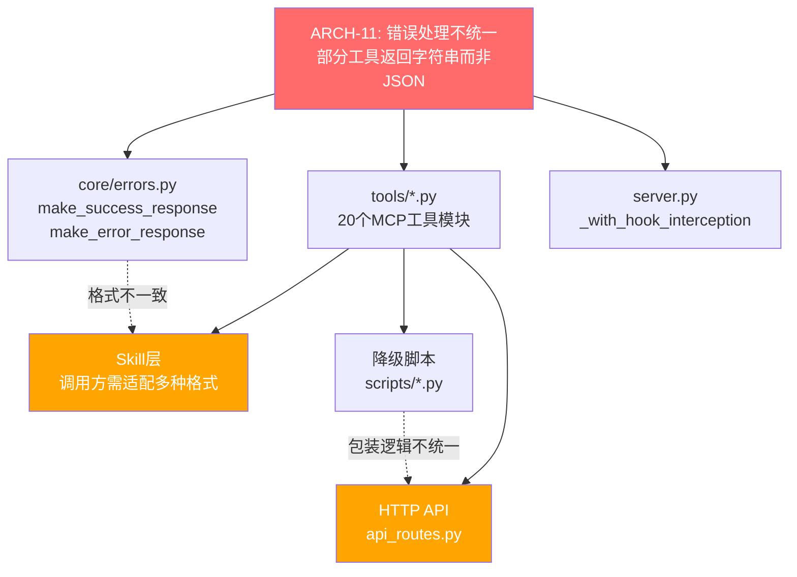

**影响范围**：20 个工具模块、Skill 层调用方、HTTP API 消费者、降级脚本包装层

#### DB-01/DB-02: 双写一致性风险

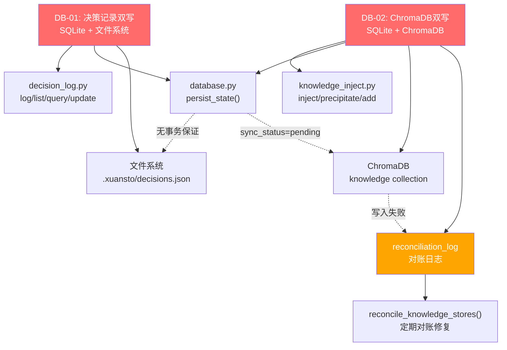

**影响范围**：决策日志模块、知识注入模块、数据库引擎、ChromaDB 向量引擎、对账机制

#### MCP-03: 工具调用无审计日志

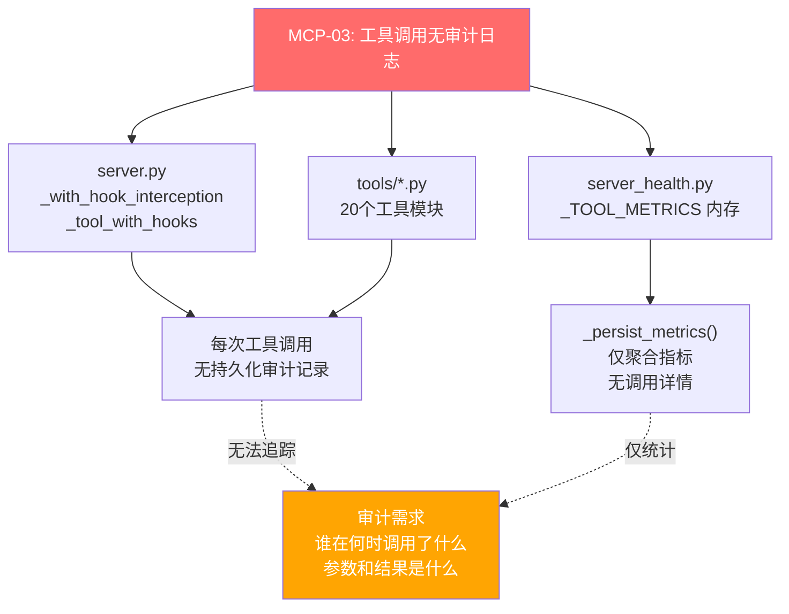

**影响范围**：MCP Server 主入口、所有工具模块、健康检查模块

#### SKILL-02: SKELETON 阶段无可用命令

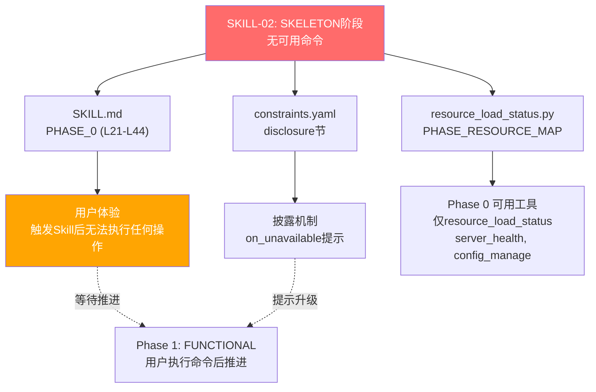

**影响范围**：SKILL.md、constraints.yaml、resource_load_status.py、用户体验

#### ARCH-05/ARCH-13/MCP-04: Resource 层不完整

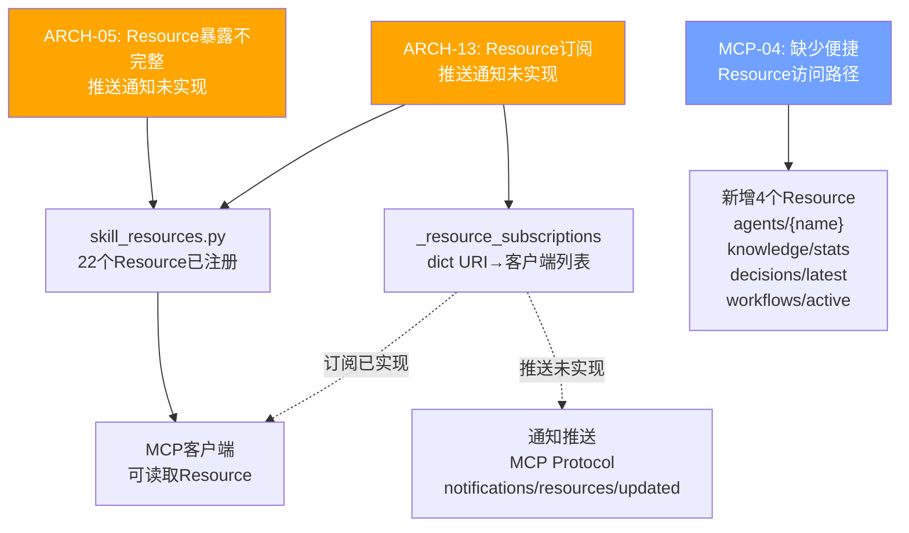

**影响范围**：skill_resources.py、MCP 客户端、订阅机制

### 2.2 综合影响链

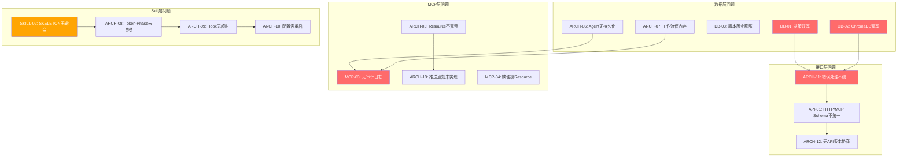

---

## 3. 优先级矩阵

### 3.1 未修复问题优先级矩阵

按优先级降序、工作量升序排列：

| 问题 ID | 优先级 | 影响域 | 工作量 | 风险 | 理由 |
|---------|--------|--------|--------|------|------|
| ARCH-11 | P1 | API | M | 中 | 错误格式不统一导致调用方需适配多种格式，是所有接口重构的基础 |
| DB-01 | P1 | Data | M | 高 | 决策双写无事务保证可能导致数据不一致，影响决策追溯 |
| DB-02 | P1 | Data | L | 高 | ChromaDB 双写是知识库核心路径，对账机制需谨慎设计 |
| MCP-03 | P1 | MCP | M | 低 | 审计日志是合规和调试基础，实现相对独立 |
| API-01 | P1 | API | L | 中 | HTTP/MCP Schema 统一影响所有接口消费者 |
| SKILL-02 | P2 | Skill | S | 低 | SKELETON 阶段无命令影响首次使用体验，改动范围小 |
| ARCH-05 | P2 | Architecture | M | 低 | Resource 推送通知是 MCP 协议完整性的关键 |
| ARCH-06 | P2 | Data | M | 中 | Agent 持久化影响长时间工作流恢复 |
| ARCH-07 | P2 | Data | M | 中 | 工作流持久化影响服务重启后状态恢复 |
| ARCH-08 | P2 | Architecture | M | 中 | Token-Phase 关联是渐进式加载的核心增强 |
| ARCH-09 | P2 | Architecture | S | 低 | Hook 超时是安全基础，实现简单 |
| ARCH-13 | P2 | Architecture | M | 中 | 推送通知是 Resource 订阅机制的必要补充 |
| MCP-04 | P2 | MCP | S | 低 | 便捷 Resource 改动范围小，用户体验提升明显 |
| ARCH-10 | P3 | Architecture | M | 中 | 配置热更新影响运维效率，但当前有 watchfiles 部分支持 |
| ARCH-12 | P3 | API | M | 中 | API 版本协商是长期兼容性保障，当前有 negotiate_version 基础 |
| DB-03 | P3 | Data | S | 低 | 版本历史清理策略简单，影响数据库膨胀 |
| P3-01 | P3 | Architecture | L | 低 | v1/v2 重复文件清理涉及面广但优先级低 |

### 3.2 工作量定义

| 等级 | 预估人天 | 说明 |
|------|---------|------|
| S | 1-3 天 | 单文件修改，逻辑简单，测试覆盖容易 |
| M | 4-10 天 | 多文件修改，需设计+实现+测试，可能有依赖 |
| L | 11-20 天 | 跨模块修改，需迁移+双写过渡+验证，风险较高 |
| XL | 20+ 天 | 架构级变更，需分阶段实施，多轮验证 |

---

## 4. 模块化重构步骤

### Phase A: v8.1.0 — 修复关键问题

**目标**：修复影响系统可靠性和可用性的关键问题

| 步骤 | 问题 ID | 任务 | 输入 | 输出 | 验收标准 |
|------|---------|------|------|------|----------|
| A1 | ARCH-05 | Resource 推送通知实现 | `skill_resources.py` 22 个 Resource + `_resource_subscriptions` | 推送通知机制：Resource 变更时通过 MCP `notifications/resources/updated` 通知订阅客户端 | 1. Resource 内容变更时客户端收到通知；2. 订阅/取消订阅正常工作；3. 无订阅时无额外开销 |
| A2 | ARCH-11 | 统一错误处理 | `tools/*.py` 20 个工具 + `core/errors.py` | 所有工具统一返回 JSON 格式：`{error, data, degradation_level, hook_errors}` | 1. 20 个工具全部返回 JSON；2. 降级响应也遵循统一格式；3. 错误码体系完整覆盖 |
| A3 | MCP-03 | 审计日志 | `server.py` + `core/database.py` | `audit_log` 表 + `record_audit_log()` 函数 + 工具调用自动记录 | 1. 每次工具调用写入 audit_log；2. 记录工具名、参数摘要、结果、延迟、调用者；3. 90 天自动归档 |
| A4 | SKILL-02 | SKELETON 命令 | `SKILL.md` + `constraints.yaml` + `resource_load_status.py` | SKELETON 阶段可用命令：`/status`、`/help`、`/budget` | 1. SKELETON 阶段可执行 3 个基础命令；2. 命令执行不触发阶段推进；3. 披露通知正确提示可用命令 |

**依赖关系**：

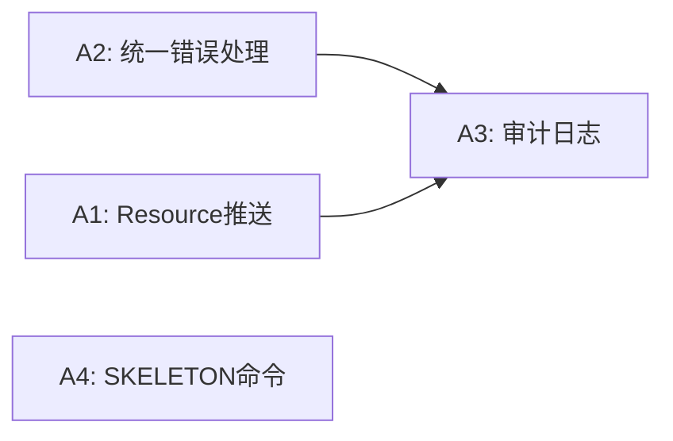

**受影响文件**：

| 文件 | 变更类型 |
|------|----------|
| `xuansto-mcp-server/src/xuansto_mcp/resources/skill_resources.py` | 修改（推送通知） |
| `xuansto-mcp-server/src/xuansto_mcp/core/errors.py` | 修改（统一格式） |
| `xuansto-mcp-server/src/xuansto_mcp/tools/*.py` | 修改（20 个工具返回格式） |
| `xuansto-mcp-server/src/xuansto_mcp/core/database.py` | 修改（audit_log 表） |
| `xuansto-mcp-server/src/xuansto_mcp/server.py` | 修改（审计记录集成） |
| `.trae/skills/xuansto-skill-v2/SKILL.md` | 修改（SKELETON 命令） |
| `.trae/skills/xuansto-skill-v2/constraints.yaml` | 修改（SKELETON 可用命令） |

---

### Phase B: v8.2.0 — 持久化与一致性

**目标**：实现 Agent/工作流持久化，解决双写一致性问题，添加 Hook 超时保护

| 步骤 | 问题 ID | 任务 | 输入 | 输出 | 验收标准 |
|------|---------|------|------|------|----------|
| B1 | ARCH-06 | Agent 持久化 | `agent_manage.py` + `_AGENT_INSTANCES` 内存 + `agent_instances.json` | `agent_states` SQLite 表 + 双写过渡 + 启动恢复 | 1. Agent CRUD 操作写入 SQLite；2. 重启后自动恢复 Agent 状态；3. 双写期间 JSON 和 SQLite 一致 |
| B2 | ARCH-07 | 工作流持久化 | `workflow_dispatch.py` + `_ACTIVE_WORKFLOWS` 内存 + `workflows/*.json` | `workflow_states` SQLite 表 + 双写过渡 + 启动恢复 | 1. 工作流状态写入 SQLite；2. 重启后自动恢复工作流；3. 快照仍使用文件系统 |
| B3 | DB-01 | 决策双写事务保证 | `decision_log.py` + `decisions.db` + `decisions.json` | SQLite 为主存储 + 文件系统为备份 + 对账机制 | 1. 决策写入使用 SQLite 事务；2. 文件系统写入失败不影响主流程；3. 定期对账修复不一致 |
| B4 | DB-02 | ChromaDB 双写事务保证 | `database.py` + `knowledge_inject.py` + `reconciliation_log` | 增强对账机制 + 自动重试 + 死信队列 | 1. ChromaDB 写入失败自动重试 3 次；2. 重试失败进入死信队列；3. 对账修复率 ≥ 99% |
| B5 | ARCH-09 | Hook 超时保护 | `hook_engine.py` | Hook 执行超时控制（默认 30s）+ 超时后降级 | 1. Hook 执行超过 30s 自动终止；2. 安全 Hook 超时默认阻断；3. 非安全 Hook 超时跳过继续执行 |

**依赖关系**：

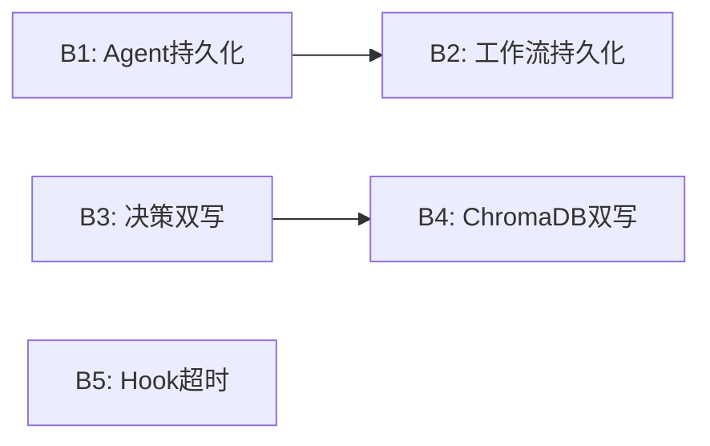

**受影响文件**：

| 文件 | 变更类型 |
|------|----------|
| `xuansto-mcp-server/src/xuansto_mcp/tools/agent_manage.py` | 修改（SQLite 持久化） |
| `xuansto-mcp-server/src/xuansto_mcp/tools/workflow_dispatch.py` | 修改（SQLite 持久化） |
| `xuansto-mcp-server/src/xuansto_mcp/tools/decision_log.py` | 修改（事务保证） |
| `xuansto-mcp-server/src/xuansto_mcp/tools/knowledge_inject.py` | 修改（双写增强） |
| `xuansto-mcp-server/src/xuansto_mcp/core/database.py` | 修改（新表+迁移） |
| `xuansto-mcp-server/src/xuansto_mcp/core/hook_engine.py` | 修改（超时控制） |

---

### Phase C: v8.3.0 — 增强功能

**目标**：配置热更新、API 版本协商、HTTP/MCP Schema 统一、知识版本清理

| 步骤 | 问题 ID | 任务 | 输入 | 输出 | 验收标准 |
|------|---------|------|------|------|----------|
| C1 | ARCH-10 | 配置热更新 | `config.py` watchfiles 机制 + `constraints.yaml` + `hooks.json` | 所有配置文件支持热更新，无需重启 | 1. constraints.yaml 变更后 5s 内生效；2. hooks.json 变更后下次 Hook 调用生效；3. 热更新失败自动回滚 |
| C2 | ARCH-12 | API 版本协商 | `server_health.py` negotiate_version + `config.py` MCP_API_VERSION | 完整版本协商：客户端声明版本→服务端返回兼容性+特性列表 | 1. 版本不匹配时返回降级建议；2. 弃用特性列表正确；3. 向后兼容 v2.0.0 客户端 |
| C3 | API-01 | HTTP/MCP Schema 统一 | `server.py` MCP 接口 + `api.py`/`api_routes.py` HTTP 接口 | 统一请求/响应 Schema，HTTP 接口为 MCP 接口的超集 | 1. 相同工具的 HTTP 和 MCP 调用返回相同 JSON 结构；2. HTTP 接口附加 HTTP 语义（状态码、头）；3. 降级响应格式一致 |
| C4 | DB-03 | 知识版本历史清理 | `database.py` knowledge_entries 表 | 版本清理策略：保留最近 N 版本 + 超过 90 天自动归档 | 1. 知识条目保留最近 10 个版本；2. 90 天以上版本归档为 JSONL；3. 归档后数据库体积减少 ≥ 50% |
| C5 | MCP-04 | 便捷 Resource | `skill_resources.py` 22 个 Resource | 新增 4 个 Resource：`agents/{name}`、`knowledge/stats`、`decisions/latest`、`workflows/active` | 1. `agents/{name}` 无需指定 layer 自动搜索；2. `knowledge/stats` 返回实时统计；3. `decisions/latest` 返回最近 10 条；4. `workflows/active` 返回活跃工作流 |

**依赖关系**：

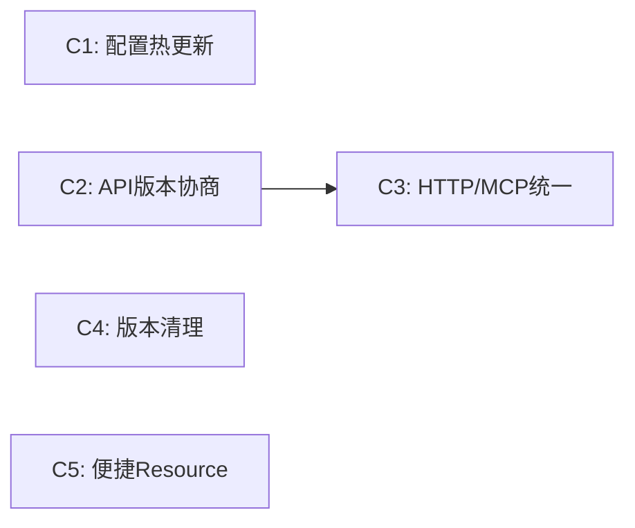

**受影响文件**：

| 文件 | 变更类型 |
|------|----------|
| `xuansto-mcp-server/src/xuansto_mcp/core/config.py` | 修改（热更新扩展） |
| `xuansto-mcp-server/src/xuansto_mcp/tools/server_health.py` | 修改（版本协商增强） |
| `xuansto-mcp-server/src/xuansto_mcp/server.py` | 修改（Schema 统一） |
| `scripts/knowledge_server/api.py` | 修改（Schema 统一） |
| `scripts/knowledge_server/api_routes.py` | 修改（Schema 统一） |
| `xuansto-mcp-server/src/xuansto_mcp/core/database.py` | 修改（版本清理） |
| `xuansto-mcp-server/src/xuansto_mcp/resources/skill_resources.py` | 修改（新增 Resource） |

---

### Phase D: v8.4.0 — 优化

**目标**：Token-Phase 关联、渐进式加载增强、性能指标

| 步骤 | 问题 ID | 任务 | 输入 | 输出 | 验收标准 |
|------|---------|------|------|------|----------|
| D1 | ARCH-08 | Token-Phase 关联 | `token_budget.py` + `resource_load_status.py` + `constraints.yaml` | Token 预算与 LoadPhase 关联：每阶段独立预算+自动调整 | 1. 每阶段有独立 Token 预算和用量追踪；2. 阶段推进时自动分配预算；3. 预算超限时触发阶段降级 |
| D2 | ARCH-13 | Resource 推送通知增强 | `skill_resources.py` + `_resource_subscriptions` | 完整推送通知：Resource 变更→订阅客户端通知 | 1. Resource 内容变更时推送 `notifications/resources/updated`；2. 支持批量通知合并；3. 推送失败自动重试 |
| D3 | — | 渐进式加载增强 | `resource_load_status.py` + `progressive_loader.py` | 4 阶段状态机 + 转换条件 + 降级集成 + 性能指标 | 1. 状态机转换条件明确；2. 降级自动触发阶段回退；3. 每阶段 Token 消耗可追踪 |
| D4 | — | 性能指标体系 | `server_health.py` + `metrics_report.py` + `audit_log` | P50/P95/P99 延迟 + 错误率 + 降级率 + Token 消耗 | 1. 指标聚合到 metrics 表；2. 支持按时间窗口查询；3. 健康评估自动生成 |

**依赖关系**：

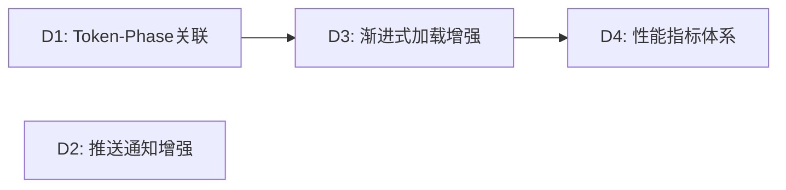

**受影响文件**：

| 文件 | 变更类型 |
|------|----------|
| `xuansto-mcp-server/src/xuansto_mcp/tools/token_budget.py` | 修改（Phase 关联） |
| `xuansto-mcp-server/src/xuansto_mcp/tools/resource_load_status.py` | 修改（状态机） |
| `xuansto-mcp-server/src/xuansto_mcp/resources/skill_resources.py` | 修改（推送增强） |
| `xuansto-mcp-server/src/xuansto_mcp/tools/server_health.py` | 修改（性能指标） |
| `xuansto-mcp-server/src/xuansto_mcp/tools/metrics_report.py` | 修改（百分位延迟） |
| `xuansto-mcp-server/src/xuansto_mcp/core/database.py` | 修改（metrics 表增强） |

---

### 4.1 版本路线图

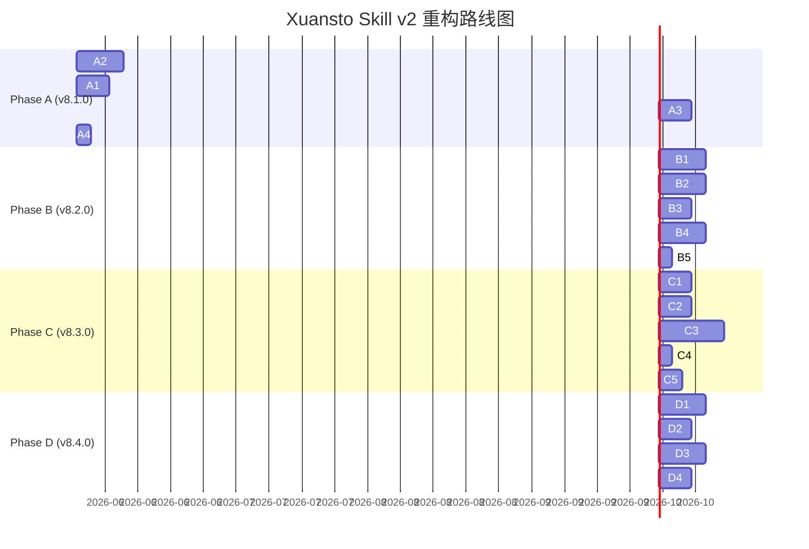

---

## 5. 渐进式加载披露实现方案

### 5.1 四阶段状态机设计

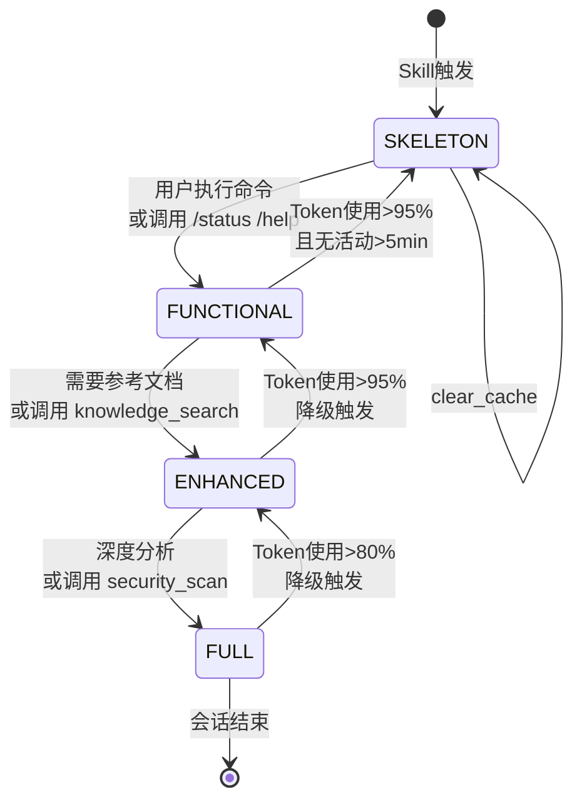

### 5.2 阶段定义与转换条件

| 转换 | 触发条件 | 触发方式 | 前置条件 | 加载资源 |
|------|----------|----------|----------|----------|
| → SKELETON | Skill 触发 | 自动 | 无 | skill-config |
| SKELETON → FUNCTIONAL | 用户执行任意命令 | 自动推进 | MCP Server 可用 | agent-registry, quality-gates, brainstorm-workflow, 核心 Agent(13个) |
| FUNCTIONAL → ENHANCED | 需要参考文档/知识检索 | 自动推进或手动 preload | Phase 1 资源已加载 | knowledge-general, sdd-tdd 工作流, mcp-tools 参考, 完整 Agent 注册表 |
| ENHANCED → FULL | 深度分析/安全扫描 | 自动推进或手动 preload | Phase 2 资源已加载 | 全部参考文档、模板、完整 Agent 目录、脚本集 |
| FULL → ENHANCED | Token 使用率 > 80% | 自动降级 | Token 预算超限 | 释放 P3 资源 |
| ENHANCED → FUNCTIONAL | Token 使用率 > 95% | 自动降级 | Token 预算严重超限 | 释放 P2 资源 |
| FUNCTIONAL → SKELETON | Token > 95% 且无活动 > 5min | 自动降级 | 长时间无操作 | 释放 P1 资源 |

### 5.3 转换反馈：各阶段可用/不可用功能

| 功能 | SKELETON | FUNCTIONAL | ENHANCED | FULL |
|------|:--------:|:----------:|:--------:|:----:|
| 命令列表 | ✅ | ✅ | ✅ | ✅ |
| 核心约束(5条) | ✅ | ✅ | ✅ | ✅ |
| MCP 依赖声明 | ✅ | ✅ | ✅ | ✅ |
| `/status` `/help` `/budget` | ✅ | ✅ | ✅ | ✅ |
| 命令路由(精简) | ❌ | ✅ | ✅ | ✅ |
| 工作流 Phase 概览 | ❌ | ✅ | ✅ | ✅ |
| 核心 Agent(13个) | ❌ | ✅ | ✅ | ✅ |
| 命令执行 | ❌ | ✅ | ✅ | ✅ |
| knowledge_search | ❌ | ✅(仅retrieve) | ✅ | ✅ |
| workflow_dispatch | ❌ | ✅ | ✅ | ✅ |
| session_manage | ❌ | ✅ | ✅ | ✅ |
| 完整命令路由(含降级) | ❌ | ❌ | ✅ | ✅ |
| 完整 Agent 注册表(57个) | ❌ | ❌ | ✅ | ✅ |
| 知识检索(全部) | ❌ | ❌ | ✅ | ✅ |
| quality_gate_check | ❌ | ❌ | ✅ | ✅ |
| spec_drift_detect | ❌ | ❌ | ✅ | ✅ |
| token_budget | ❌ | ❌ | ✅ | ✅ |
| context_compress | ❌ | ❌ | ✅ | ✅ |
| hook_manage | ❌ | ❌ | ✅ | ✅ |
| Hook 系统(完整) | ❌ | ❌ | ❌ | ✅ |
| 模型路由(完整) | ❌ | ❌ | ❌ | ✅ |
| security_scan | ❌ | ❌ | ❌ | ✅ |
| code_simplify | ❌ | ❌ | ❌ | ✅ |
| agent_manage | ❌ | ❌ | ❌ | ✅ |
| 关键规则(2-Action等) | ❌ | ❌ | ❌ | ✅ |

### 5.4 性能指标

#### 各阶段 Token 消耗预估

| 阶段 | 阶段预算 | 累计预算 | 预估资源数 | 预估 Token 消耗 | 加载时长预估 |
|------|---------|---------|-----------|----------------|-------------|
| SKELETON | ≤2K | 2K | 1 | ~1.5K | <0.5s |
| FUNCTIONAL | ≤5K | 7K | 7 | ~4K | 1-2s |
| ENHANCED | ≤10K | 17K | 14 | ~8K | 2-5s |
| FULL | ≤20K | 37K | 27+ | ~15K | 5-10s |

#### Token 消耗明细

| 阶段 | 资源 | 类型 | 预估 Token |
|------|------|------|-----------|
| 0 | skill-config | config | ~500 |
| 1 | agent-registry | reference | ~800 |
| 1 | quality-gates | reference | ~600 |
| 1 | brainstorm-workflow | workflow | ~400 |
| 1 | 核心 Agent(13个摘要) | agent | ~1,500 |
| 2 | knowledge-general | knowledge | ~1,000 |
| 2 | sdd-tdd 工作流(3个) | workflow | ~1,200 |
| 2 | mcp-tools 参考 | reference | ~800 |
| 2 | 完整 Agent 注册表 | agent | ~1,500 |
| 2 | progressive-loading | reference | ~500 |
| 3 | 安全/编码/测试参考(8+) | reference | ~3,000 |
| 3 | 完整 Agent 目录(57个) | agent | ~4,000 |
| 3 | 模板和脚本集 | template | ~2,000 |

### 5.5 降级集成

#### 降级如何影响阶段转换

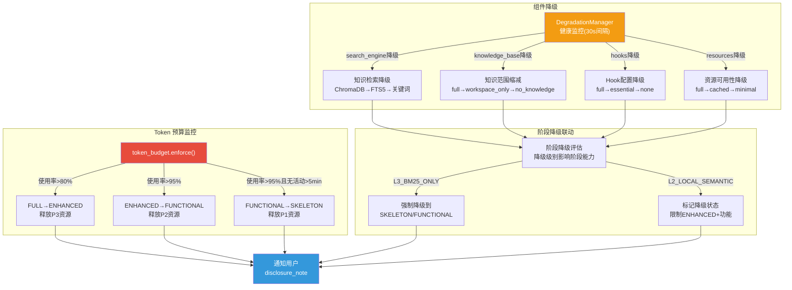

#### 降级-阶段联动规则

| 降级级别 | 允许的最高阶段 | 受限功能 | 通知级别 |
|----------|--------------|----------|----------|
| L1_NORMAL | FULL | 无 | 无 |
| L2_LOCAL_SEMANTIC | ENHANCED | 知识检索降级为 FTS5，Hook 降级为 essential | INFO |
| L3_BM25_ONLY | FUNCTIONAL | 知识检索降级为关键词，Hook 禁用，资源仅缓存 | WARN |

#### 降级恢复

| 条件 | 恢复动作 | 阶段影响 |
|------|----------|----------|
| 组件健康检查通过 | 尝试恢复组件级别 | 不自动推进阶段，需手动 preload |
| 所有组件恢复 L1 | 允许推进到任意阶段 | 用户可手动推进 |
| Token 使用率 < 60% | 允许阶段推进 | 自动评估是否推进 |

---

## 6. 测试策略

### 6.1 单元测试

| 测试模块 | 覆盖问题 | 测试用例 | 文件 |
|----------|---------|---------|------|
| MCP Resource | ARCH-05, ARCH-13, MCP-04 | 1. Resource 注册验证(22+4个)；2. URI 参数化解析；3. 订阅/取消订阅；4. 推送通知触发；5. 路径安全验证 | `tests/test_resources.py` |
| 统一错误处理 | ARCH-11 | 1. 成功响应格式验证；2. 错误响应格式验证；3. 降级响应格式验证；4. 错误码覆盖完整性；5. 20 个工具返回类型检查 | `tests/test_error_handling.py` |
| 审计日志 | MCP-03 | 1. 工具调用自动记录；2. 参数脱敏验证；3. 延迟记录准确性；4. 90 天归档清理；5. 按工具/时间/会话查询 | `tests/test_audit_log.py` |
| Agent 持久化 | ARCH-06 | 1. CRUD 操作写入 SQLite；2. 重启恢复验证；3. 双写一致性；4. 迁移脚本验证；5. 并发写入安全 | `tests/test_agent_persistence.py` |
| 工作流持久化 | ARCH-07 | 1. 工作流状态写入 SQLite；2. 重启恢复验证；3. 快照仍使用文件系统；4. 迁移脚本验证；5. 并发写入安全 | `tests/test_workflow_persistence.py` |
| 双写一致性 | DB-01, DB-02 | 1. 决策写入事务验证；2. ChromaDB 写入重试验证；3. 对账修复验证；4. 死信队列验证；5. 并发双写一致性 | `tests/test_dual_write.py` |
| Token-Phase 关联 | ARCH-08 | 1. 每阶段预算分配；2. 阶段推进时预算调整；3. 预算超限触发降级；4. 预算报告准确性；5. 跨阶段预算追踪 | `tests/test_token_phase.py` |
| Hook 超时 | ARCH-09 | 1. 正常 Hook 执行；2. 超时 Hook 终止；3. 安全 Hook 超时阻断；4. 非安全 Hook 超时跳过；5. 超时配置可调 | `tests/test_hook_timeout.py` |

### 6.2 集成测试

| 测试场景 | 覆盖问题 | 测试步骤 | 预期结果 |
|----------|---------|---------|----------|
| Skill-MCP 交互 | ARCH-11, MCP-03 | 1. Skill 触发→MCP 工具调用→审计记录；2. 降级场景→审计记录降级状态 | 所有交互有审计记录，响应格式统一 |
| 渐进式加载流程 | SKILL-02, ARCH-08 | 1. Skill 触发(SKELETON)；2. 执行 /status(仍 SKELETON)；3. 执行 /init(推进 FUNCTIONAL)；4. 调用 knowledge_search(推进 ENHANCED)；5. 调用 security_scan(推进 FULL) | 阶段推进正确，Token 预算追踪准确 |
| 降级链 | DB-02, ARCH-09 | 1. ChromaDB 不可用→FTS5 降级；2. FTS5 不可用→关键词降级；3. Hook 超时→跳过/阻断；4. Token 超限→阶段降级 | 降级链路完整，通知正确 |
| 持久化恢复 | ARCH-06, ARCH-07 | 1. 创建 Agent 和工作流；2. 模拟 MCP Server 重启；3. 验证 Agent 和工作流状态恢复 | 状态完整恢复，无数据丢失 |
| 双写对账 | DB-01, DB-02 | 1. 写入决策(模拟文件系统失败)；2. 写入知识(模拟 ChromaDB 失败)；3. 触发对账修复 | 对账修复成功，数据最终一致 |

### 6.3 端到端测试

| 测试场景 | 步骤 | 验证点 |
|----------|------|--------|
| 完整 /init 流程 | 1. `/init --name test-project --stack python,react`；2. 验证 project_init(create)→skill_analyze→knowledge_search→workflow_dispatch(start) | 1. 项目创建成功；2. 工作流启动；3. 审计日志记录完整；4. 加载阶段推进到 FUNCTIONAL |
| 完整 /implement 流程 | 1. `/implement`；2. 验证 workflow_dispatch(phase)→quality_gate_check→hook_manage(list) | 1. 工作流推进到 Phase 4；2. 门禁检查执行；3. Hook 拦截正常；4. 加载阶段推进到 ENHANCED |
| 完整 /audit 流程 | 1. `/audit`；2. 验证 security_scan→quality_gate_check→spec_drift_detect | 1. 安全扫描执行；2. 门禁检查执行；3. 规格偏差检测；4. 加载阶段推进到 FULL |
| 降级恢复流程 | 1. 正常执行 `/init`；2. 模拟 MCP Server 不可用；3. 验证脚本降级；4. 恢复 MCP Server；5. 验证自动恢复 | 1. 降级响应格式统一；2. 脚本降级结果正确；3. 恢复后功能正常 |
| Token 预算降级 | 1. 正常执行到 FULL；2. 模拟 Token 使用率 > 80%；3. 验证阶段降级；4. 验证通知 | 1. 阶段降级到 ENHANCED；2. P3 资源释放；3. 用户收到通知 |

### 6.4 回归测试

| 回归项 | 验证方法 | 通过标准 |
|--------|---------|----------|
| P0-01 降级模式 | 断开 MCP Server，执行工具调用 | 降级链路正常，返回 JSON 格式 |
| P0-02 参考文档 | 检查 references/ 目录文件数 | ≥ 79 个文件 |
| P1-04 工具拆分 | 检查 tools/ 子包结构 | 15 个独立模块 + `__init__.py` + `_shared.py` |
| P1-05 降级映射 | 修改 constraints.yaml 降级配置，验证生效 | YAML 配置优先于硬编码 |
| P1-06 双向同步 | 执行命令后检查加载阶段 | 命令驱动推进 + 降级通知正确 |
| SKILL-01 PHASE 映射 | 检查 PHASE_SKILL_MAP | PHASE_0→SKELETON, PHASE_1→FUNCTIONAL, PHASE_2→ENHANCED, PHASE_3→FULL |
| API-02 降级格式 | 执行降级调用，检查返回格式 | `degraded`/`inline_degraded`/`error` 三种状态 |

---

## 7. 持续集成建议

### 7.1 CI 流水线

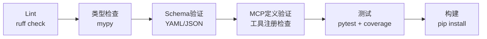

### 7.2 检查项详细配置

#### 7.2.1 Lint：ruff check

```yaml
# pyproject.toml [tool.ruff]
line-length = 120
target-version = "py310"

[tool.ruff.lint]
select = ["E", "F", "W", "I", "N", "UP", "B", "A", "C4", "SIM"]
ignore = ["E501"]

[tool.ruff.lint.per-file-ignores]
"__init__.py" = ["F401"]
```

**CI 命令**：

```bash
ruff check xuansto-mcp-server/src/ scripts/knowledge_server/
```

#### 7.2.2 类型检查：mypy

```yaml
# pyproject.toml [tool.mypy]
python_version = "3.10"
warn_return_any = true
warn_unused_configs = true
disallow_untyped_defs = false
ignore_missing_imports = true
```

**CI 命令**：

```bash
mypy xuansto-mcp-server/src/xuansto_mcp/ --config-file xuansto-mcp-server/pyproject.toml
```

#### 7.2.3 Schema 验证：YAML/JSON

| 验证目标 | 验证规则 | 脚本 |
|----------|---------|------|
| `constraints.yaml` | Token 预算数值范围、降级映射完整性、披露节结构 | `scripts/verification/skill-token-check.py` |
| `routes.yaml` | 31 条命令完整性、mcp_tools 非空、fallback 格式 | `scripts/verification/cmd-agent-check.py` |
| `registry.yaml` | 13 层 57 个 Agent、phase 字段 0-3、model_routing 合法 | `scripts/verification/agent-structure-check.py` |
| `hooks.json` | 3 级 Profile 包含关系、Hook 名称唯一 | JSON Schema 验证 |
| `default.yaml` | 必填字段存在、数值范围合法 | JSON Schema 验证 |

**CI 命令**（已在 `ci.yml` 中配置）：

```bash
python scripts/verification/skill-token-check.py
python scripts/verification/cmd-agent-check.py
python scripts/verification/agent-structure-check.py
python scripts/verification/wf-gate-check.py
```

#### 7.2.4 MCP 定义验证：工具注册检查

| 检查项 | 规则 |
|--------|------|
| 工具数量 | 必须为 20 个 |
| 工具名称唯一性 | 无重复注册 |
| inputSchema 完整性 | 每个工具有 type=object 的 inputSchema |
| outputSchema 完整性 | 每个工具有 outputSchema |
| ToolAnnotations | 每个工具有 readOnlyHint/destructiveHint/idempotentHint/openWorldHint |
| Resource 数量 | ≥ 22 个 |
| Resource URI 格式 | 匹配 `xuansto://` 前缀 |
| Prompt 数量 | 2 个 |

**CI 命令**：

```bash
python -c "
from xuansto_mcp.server import mcp
tools = mcp.list_tools()
assert len(tools) == 20, f'Expected 20 tools, got {len(tools)}'
resources = mcp.list_resources()
assert len(resources) >= 22, f'Expected >= 22 resources, got {len(resources)}'
"
```

#### 7.2.5 测试：pytest + coverage

```yaml
# pyproject.toml [tool.pytest.ini_options]
testpaths = ["tests"]
asyncio_mode = "auto"
addopts = "--cov=xuansto_mcp --cov-report=term-missing --cov-report=html --cov-fail-under=70"
```

**CI 命令**：

```bash
cd xuansto-mcp-server
pytest tests/ -v --cov=xuansto_mcp --cov-report=term-missing --cov-fail-under=70
```

**覆盖率目标**：

| 模块 | 目标覆盖率 | 说明 |
|------|-----------|------|
| `core/errors.py` | ≥ 90% | 错误处理是基础 |
| `core/database.py` | ≥ 85% | 数据库操作需严格测试 |
| `core/hook_engine.py` | ≥ 85% | Hook 引擎影响所有工具 |
| `core/degradation.py` | ≥ 80% | 降级链路关键 |
| `tools/*.py` | ≥ 75% | 工具模块覆盖主要路径 |
| `resources/skill_resources.py` | ≥ 80% | Resource 注册和读取 |
| **总体** | ≥ 70% | 最低门槛 |

### 7.3 CI 配置示例

```yaml
# .github/workflows/ci.yml
name: CI
on: [push, pull_request]

jobs:
  lint:
    runs-on: ubuntu-latest
    steps:
      - uses: actions/checkout@v4
      - uses: actions/setup-python@v5
        with:
          python-version: '3.10'
      - run: pip install ruff
      - run: ruff check xuansto-mcp-server/src/ scripts/knowledge_server/

  typecheck:
    runs-on: ubuntu-latest
    steps:
      - uses: actions/checkout@v4
      - uses: actions/setup-python@v5
        with:
          python-version: '3.10'
      - run: pip install mypy
      - run: mypy xuansto-mcp-server/src/xuansto_mcp/

  schema:
    runs-on: ubuntu-latest
    steps:
      - uses: actions/checkout@v4
      - uses: actions/setup-python@v5
        with:
          python-version: '3.10'
      - run: python scripts/verification/skill-token-check.py
      - run: python scripts/verification/cmd-agent-check.py
      - run: python scripts/verification/agent-structure-check.py
      - run: python scripts/verification/wf-gate-check.py

  test:
    runs-on: ubuntu-latest
    needs: [lint, typecheck, schema]
    steps:
      - uses: actions/checkout@v4
      - uses: actions/setup-python@v5
        with:
          python-version: '3.10'
      - run: cd xuansto-mcp-server && pip install -e ".[dev]"
      - run: cd xuansto-mcp-server && pytest tests/ -v --cov=xuansto_mcp --cov-fail-under=70
```

---

> 本文档基于 xuansto-skill-v2 v8.0.0 和 xuansto-mcp-server v8.0.0 的 5 份分析文档 + PROBLEM.md 综合生成。
> 所有问题 ID 与 [PROBLEM.md](../../.trae/skills/xuansto-skill-v2/PROBLEM.md) 保持一致，新增问题按原有编号规则续编。
