# Xuansto Skill v2 重构计划

> **版本**: 1.0 | **日期**: 2026-05-26 | **基线版本**: 8.4.0
> **范围**: xuansto-skill-v2（Skill定义层）+ xuansto-mcp-server（MCP Server执行层）
> **输入文档**: ARCHITECTURE.md / DATABASE_DESIGN.md / MCP_REVIEW.md / SKILL_REVIEW.md / API_SPECIFICATION.md / PROBLEM.md

---

## 目录

1. [统一问题清单](#1-统一问题清单)
2. [影响链分析](#2-影响链分析)
3. [优先级矩阵](#3-优先级矩阵)
4. [模块化重构步骤](#4-模块化重构步骤)
5. [渐进式加载披露实现方案](#5-渐进式加载披露实现方案)
6. [测试策略](#6-测试策略)
7. [CI建议](#7-ci建议)

---

## 1. 统一问题清单

### 1.1 问题来源与去重说明

本清单合并了 PROBLEM.md（17项未修复）和5份分析文档中新发现的问题（11项），去重后共 **22项独立问题**。

去重规则：
- ARCH-05 与 MCP-02 描述同一问题（Resource暴露），合并为 ARCH-05/MCP-02
- ARCHITECTURE.md 发现6项问题在代码中已实现但 PROBLEM.md 仍标记为未修复，本清单标注"⚠️ 状态待验证"
- P3-02（SKILL.md行数）已通过渐进式加载缓解，降级为"已缓解"

### 1.2 完整问题清单

| 编号 | 影响域 | 优先级 | 描述 | 来源 | 当前状态 | 计划版本 |
|------|--------|--------|------|------|----------|----------|
| **ARCH-05/MCP-02** | 架构/MCP | 中 | MCP Resource已注册但Host端未订阅，变更通知不可达 | PROBLEM+MCP_REVIEW | ⚠️ 代码已实现Resource注册(25+个)，但订阅管理未暴露为Tool | v8.5.0 |
| **ARCH-06** | 架构 | 低 | Agent持久化机制 | PROBLEM | ⚠️ agent_states表+agent_manage.py已实现CRUD+load_on_startup，需验证恢复完整性 | v8.5.0验证 |
| **ARCH-07** | 架构 | 低 | 工作流状态持久化 | PROBLEM | ⚠️ workflow_states表+workflow_dispatch.py已实现+load_on_startup，需验证Phase推进恢复 | v8.5.0验证 |
| **ARCH-08** | 架构/Skill | 低 | Token预算与加载阶段未关联 | PROBLEM | 未实现关联逻辑 | v8.5.0 |
| **ARCH-09** | 架构 | 低 | Hook执行无超时保护 | PROBLEM | ⚠️ hook_engine.py已实现DEFAULT_HOOK_TIMEOUT_SECONDS=30.0+asyncio.wait_for | v8.5.0验证 |
| **ARCH-10** | 架构 | 低 | 配置变更需重启MCP Server | PROBLEM | ⚠️ config.py已实现watchfiles/SIGHUP/轮询三种热更新机制 | v8.5.0验证 |
| **ARCH-11** | 架构/MCP | 中 | 错误处理不统一，部分工具返回字符串而非JSON | PROBLEM | 大部分实现make_response统一格式，需排查边缘情况 | v8.5.0 |
| **ARCH-12** | 架构/API | 低 | API版本协商机制不完整 | PROBLEM+API_SPEC | 声明已有(MCP_API_VERSION等)，协商逻辑未完整实现 | v8.6.0 |
| **DB-01** | 数据 | 中 | 决策记录双写一致性风险 | PROBLEM | decision_records仅存于MCP Server数据库，无跨库同步 | v8.5.0 |
| **DB-02** | 数据 | 中 | ChromaDB与SQLite双写无事务保证 | PROBLEM+DB_DESIGN | persist_knowledge_dual_write先写SQLite(pending)→再写ChromaDB→成功标记ready | v8.5.0 |
| **DB-03** | 数据 | 低 | 知识条目版本历史无清理策略 | PROBLEM | ⚠️ database.py已实现cleanup_knowledge_versions(keep_last_n=10) | v8.5.0验证 |
| **MCP-03** | MCP | 中 | 工具调用审计日志缺少MCP Tool查询接口 | PROBLEM+MCP_REVIEW | ⚠️ audit_logger.py已实现记录，但仅通过Resource暴露，无主动查询Tool | v8.5.0 |
| **SKILL-02** | Skill | 低 | SKELETON阶段无可用命令（仅/status、/help、/budget） | PROBLEM | constraints.yaml声明可用但需验证实际可用性 | v8.5.0 |
| **API-01** | API | 中 | HTTP API与MCP stdio两套接口无统一Schema | PROBLEM+API_SPEC | MCP返回{status:"success"}，HTTP返回{status:"ok"}，错误码体系不一致 | v8.5.0 |
| **P3-01** | 架构 | 低 | v1与v2存在重复文件 | PROBLEM | agents/commands/workflows目录双版本并存 | v8.6.0 |
| **P3-02** | Skill | 低 | SKILL.md行数可能超过500行 | PROBLEM | ✅ 已通过PHASE标记渐进式加载缓解 | 已缓解 |
| **NEW-01** | 架构/MCP | 中 | 降级映射数量不一致：degradation.py FALLBACK_MAP含20个函数，constraints.yaml tool_fallbacks仅14个映射 | ARCHITECTURE | metrics_report/config_manage等新增工具在constraints.yaml缺少降级声明 | v8.5.0 |
| **NEW-02** | 架构 | 中 | 知识库HTTP服务(scripts/knowledge_server/)与MCP Server(knowledge_search工具)功能重叠 | ARCHITECTURE | 两套独立实现，HTTP API v2.0.0 vs MCP API v3.0.0 | v8.6.0 |
| **NEW-03** | 架构/CI | 低 | spec-locks目录含3个JSON Schema锁文件，但未在CI/CD中强制校验 | ARCHITECTURE | api-contract-version.json / skill-definition-schema.json / tool-parameter-schemas.json | v8.5.0 |
| **NEW-04** | 测试 | 低 | 部分工具(config_manage/metrics_report)缺少专项测试 | ARCHITECTURE | 100+测试文件但覆盖不均 | v8.6.0 |
| **NEW-05** | Skill | 中 | COMMAND_PHASE_MAP仅覆盖6个命令，25个命令不触发阶段推进 | SKILL_REVIEW | 仅/init/sprint/implement/audit/refactor/loop有映射 | v8.5.0 |
| **NEW-06** | Skill/数据 | 中 | _shared.py内嵌门禁_QUALITY_GATES仅13项，与声明的54项不一致 | SKILL_REVIEW | 内嵌门禁作为降级后备，与references/quality-gates.md定义不匹配 | v8.5.0 |
| **NEW-07** | 数据 | 高 | 双SQLite实例问题：xuansto.db(14表)与knowledge.db(9表)独立运行，knowledge_entries表重复定义 | DB_DESIGN | MCP Server与Knowledge Server各自管理独立数据库实例 | v8.5.0 |
| **NEW-08** | MCP | 中 | Resource订阅管理(subscribe_resource/unsubscribe_resource)未暴露为MCP Tool | MCP_REVIEW | skill_resources.py内部已实现，Host端无法主动订阅变更 | v8.5.0 |
| **NEW-09** | MCP | 中 | 审计日志查询缺少MCP Tool接口（与MCP-03部分重叠） | MCP_REVIEW | 仅xuansto://audit/log Resource暴露最近50条，无按条件查询Tool | v8.5.0 |
| **NEW-10** | API | 低 | MCP Server版本(3.0.0)与Knowledge Server HTTP API版本(2.0.0)不一致 | API_SPEC | 两套独立版本号，客户端无法统一判断兼容性 | v8.6.0 |
| **NEW-11** | 管理 | 中 | PROBLEM.md状态与代码实际状态不同步：6个问题已实现但仍标记为未修复 | ARCHITECTURE | ARCH-05/06/07/09/10 + DB-03 + MCP-03 | 立即 |

### 1.3 问题统计

| 影响域 | 总数 | ⚠️待验证 | 未实现 | 已缓解 |
|--------|------|----------|--------|--------|
| 架构(ARCH) | 8 | 5 | 2 | 0 |
| 数据(DB) | 3 | 1 | 2 | 0 |
| MCP | 4 | 1 | 3 | 0 |
| Skill | 3 | 0 | 3 | 0 |
| API | 3 | 0 | 3 | 0 |
| 测试 | 1 | 0 | 1 | 0 |
| 管理 | 1 | 0 | 1 | 0 |
| **合计** | **23** | **7** | **15** | **1** |

---

## 2. 影响链分析

### 2.1 模块依赖关系图

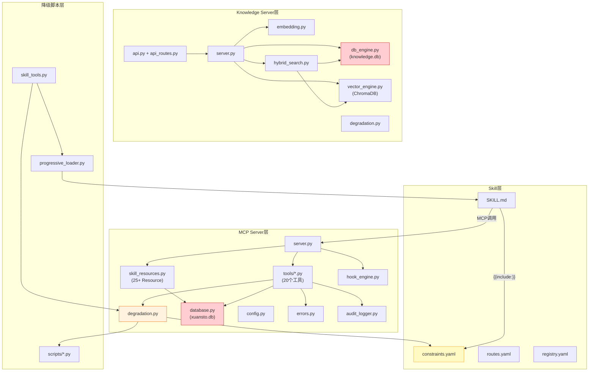

### 2.2 问题连锁影响矩阵

| 问题编号 | 直接受影响模块 | 间接受影响模块 | 外部依赖影响 |
|----------|---------------|---------------|-------------|
| **ARCH-05/MCP-02** | skill_resources.py, resource_load_status.py | Skill层(无法感知Resource变更), Host客户端(无法订阅) | MCP协议客户端 |
| **ARCH-11** | errors.py, 所有tools/*.py | Skill层(需处理多种返回格式), 降级脚本(格式不一致) | HTTP API客户端 |
| **DB-01** | database.py(decision_records) | workflow_dispatch.py, decision_log.py | 文件系统(双写目标) |
| **DB-02** | database.py(persist_knowledge_dual_write), search_engine.py | knowledge_search.py, knowledge_inject.py | ChromaDB |
| **NEW-07** | database.py, db_engine.py | 所有知识相关工具, 搜索引擎, 降级管理器 | ChromaDB, 文件系统 |
| **NEW-01** | degradation.py, constraints.yaml | 所有降级路径, MCP工具调用链 | scripts/目录 |
| **NEW-02** | knowledge_server/*, tools/knowledge_search.py | Skill层(两套接口选择), API客户端 | FastAPI, Uvicorn |
| **API-01** | errors.py, api.py, api_routes.py | 所有MCP客户端, 所有HTTP客户端 | 无 |
| **NEW-05** | progressive_loader.py, skill_tools.py | Skill层(阶段推进不完整), 用户体验 | 无 |
| **NEW-06** | tools/_shared.py, quality_gate_check.py | 降级模式下的门禁检查准确性 | references/quality-gates.md |
| **NEW-08** | skill_resources.py | Host客户端(无法订阅变更), 渐进式加载通知 | MCP协议 |
| **MCP-03/NEW-09** | audit_logger.py, server.py | 运维(无法主动查询审计), 合规需求 | 无 |

### 2.3 关键影响链路详解

#### 链路1：双SQLite实例 → 数据一致性风险

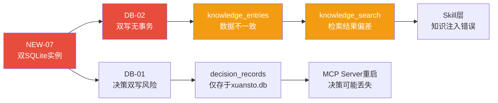

#### 链路2：降级映射不一致 → 降级失败

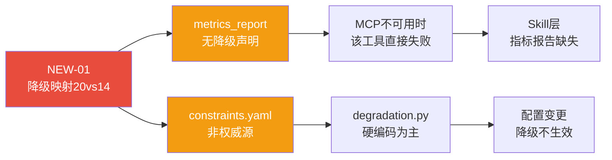

#### 链路3：API格式不统一 → 客户端适配成本

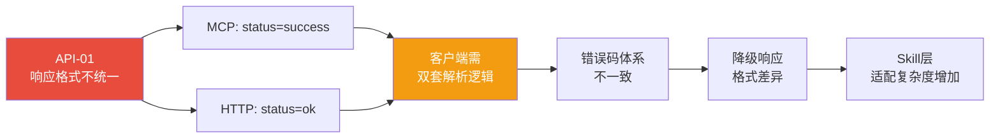

### 2.4 文件影响范围统计

| 文件/目录 | 受影响问题数 | 涉及问题编号 |
|-----------|-------------|-------------|
| `xuansto-mcp-server/src/xuansto_mcp/core/database.py` | 4 | DB-01, DB-02, NEW-07, ARCH-06/07 |
| `xuansto-mcp-server/src/xuansto_mcp/core/degradation.py` | 3 | NEW-01, ARCH-11, MCP-03 |
| `xuansto-mcp-server/src/xuansto_mcp/core/errors.py` | 2 | ARCH-11, API-01 |
| `xuansto-mcp-server/src/xuansto_mcp/resources/skill_resources.py` | 2 | ARCH-05/MCP-02, NEW-08 |
| `xuansto-mcp-server/src/xuansto_mcp/core/audit_logger.py` | 2 | MCP-03, NEW-09 |
| `.trae/skills/xuansto-skill-v2/constraints.yaml` | 2 | NEW-01, SKILL-02 |
| `scripts/knowledge_server/db_engine.py` | 2 | NEW-07, DB-02 |
| `scripts/knowledge_server/progressive_loader.py` | 2 | NEW-05, ARCH-08 |
| `scripts/knowledge_server/skill_tools.py` | 2 | NEW-05, NEW-06 |
| `scripts/knowledge_server/api.py` + `api_routes.py` | 2 | API-01, NEW-02 |

---

## 3. 优先级矩阵

### 3.1 优先级定义

| 级别 | 定义 | 修复窗口 | 依据 |
|------|------|----------|------|
| **紧急** | 阻塞核心功能或导致数据丢失 | 立即（1-3天） | 影响数据完整性或核心交互链路 |
| **高** | 严重影响系统可靠性或一致性 | 1周内 | 影响跨模块一致性或关键降级路径 |
| **中** | 影响开发效率或用户体验 | 1个迭代周期 | 功能缺失但不阻塞核心流程 |
| **低** | 技术债务或远期优化 | 下个版本 | 不影响当前功能，但增加维护成本 |

### 3.2 优先级矩阵

| 编号 | 描述 | 影响域 | 优先级 | 依据 |
|------|------|--------|--------|------|
| **NEW-11** | PROBLEM.md状态与代码不同步 | 管理 | **紧急** | 6个问题误标为未修复，导致重构方向偏差 |
| **NEW-07** | 双SQLite实例问题 | 数据 | **高** | knowledge_entries重复定义是DB-01/DB-02的根因 |
| **DB-02** | ChromaDB与SQLite双写无事务保证 | 数据 | **高** | 知识检索结果可能不一致 |
| **NEW-01** | 降级映射数量不一致(20 vs 14) | 架构/MCP | **高** | 新增工具降级失败，constraints.yaml非权威源 |
| **ARCH-11** | 错误处理不统一 | 架构/MCP | **高** | 客户端需处理多种返回格式，是API-01的根因之一 |
| **API-01** | HTTP API与MCP两套接口无统一Schema | API | **高** | 两套客户端适配成本高 |
| **DB-01** | 决策记录双写一致性风险 | 数据 | **中** | MCP Server数据库损坏时决策丢失 |
| **ARCH-05/MCP-02** | Resource变更通知不可达 | 架构/MCP | **中** | Host端无法订阅状态变更 |
| **NEW-08** | Resource订阅管理未暴露为Tool | MCP | **中** | 与ARCH-05关联 |
| **MCP-03/NEW-09** | 审计日志缺少Tool查询接口 | MCP | **中** | 运维和合规需求 |
| **NEW-05** | COMMAND_PHASE_MAP仅覆盖6个命令 | Skill | **中** | 25个命令不触发阶段推进 |
| **NEW-06** | 内嵌门禁仅13项vs声明54项 | Skill/数据 | **中** | 降级模式下门禁检查不准确 |
| **NEW-02** | 知识库HTTP服务与MCP Server功能重叠 | 架构 | **中** | 两套独立实现增加维护成本 |
| **SKILL-02** | SKELETON阶段无可用命令 | Skill | **中** | 用户首次交互体验差 |
| **ARCH-08** | Token预算与加载阶段未关联 | 架构/Skill | **低** | 无法根据阶段自动调整Token分配 |
| **ARCH-12** | API版本协商机制不完整 | 架构/API | **低** | 客户端无法自动适配API变更 |
| **NEW-03** | spec-locks未在CI中强制校验 | 架构/CI | **低** | API契约可能被意外破坏 |
| **NEW-04** | 部分工具缺少专项测试 | 测试 | **低** | config_manage/metrics_report覆盖不足 |
| **NEW-10** | MCP与KB版本号不一致 | API | **低** | 客户端版本判断困难 |
| **P3-01** | v1与v2存在重复文件 | 架构 | **低** | 维护成本增加 |
| **ARCH-06** | Agent持久化(待验证) | 架构 | **低** | 代码已实现，需验证完整性 |
| **ARCH-07** | 工作流持久化(待验证) | 架构 | **低** | 代码已实现，需验证完整性 |
| **ARCH-09** | Hook超时保护(待验证) | 架构 | **低** | 代码已实现，需验证完整性 |
| **ARCH-10** | 配置热更新(待验证) | 架构 | **低** | 代码已实现，需验证完整性 |
| **DB-03** | 版本历史清理(待验证) | 数据 | **低** | 代码已实现，需验证完整性 |

### 3.3 优先级分布图

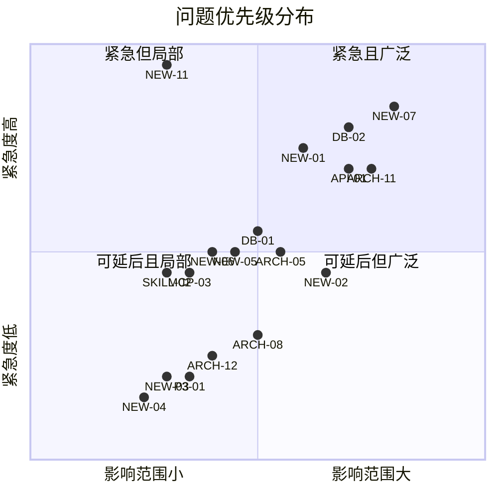

---

## 4. 模块化重构步骤

### 4.1 阶段总览

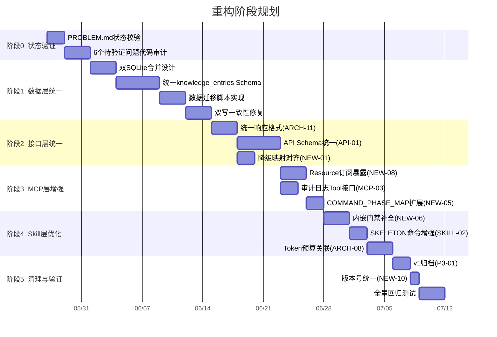

### 4.2 阶段0：状态验证（紧急）

**目标**：确认6个"待验证"问题的实际代码状态，更新PROBLEM.md

| 步骤 | 输入 | 输出 | 验收标准 | 依赖 |
|------|------|------|----------|------|
| 0.1 审计ARCH-05代码 | skill_resources.py | Resource注册清单+订阅机制状态 | 25+ Resource已注册，subscribe/unsubscribe函数存在 | 无 |
| 0.2 审计ARCH-06/07代码 | database.py, agent_manage.py, workflow_dispatch.py | 持久化+恢复逻辑完整性报告 | agent_states/workflow_states表存在，load_on_startup函数存在 | 无 |
| 0.3 审计ARCH-09/10代码 | hook_engine.py, config.py | 超时保护+热更新机制报告 | DEFAULT_HOOK_TIMEOUT_SECONDS=30.0存在，watchfiles/SIGHUP机制存在 | 无 |
| 0.4 审计DB-03/MCP-03代码 | database.py, audit_logger.py | 版本清理+审计日志报告 | cleanup_knowledge_versions函数存在，audit记录逻辑存在 | 无 |
| 0.5 更新PROBLEM.md | 审计结果 | 更新后的PROBLEM.md | 6个问题状态与代码实际一致 | 0.1-0.4 |

### 4.3 阶段1：数据层统一（高优先级）

**目标**：合并双SQLite实例，修复双写一致性

| 步骤 | 输入 | 输出 | 验收标准 | 依赖 |
|------|------|------|----------|------|
| 1.1 设计统一Schema | xuansto.db(14表) + knowledge.db(9表) | 统一DDL脚本 | knowledge_entries合并字段完整，FTS5触发器正确 | 阶段0 |
| 1.2 实现Schema迁移 | 统一DDL | migration_v13.py | xuansto.db包含所有22+表，旧表保留为_legacy | 1.1 |
| 1.3 实现数据迁移 | knowledge.db数据 | 迁移后xuansto.db | 源库条目数=目标库条目数，FTS5索引完整 | 1.2 |
| 1.4 更新代码引用 | db_engine.py, database.py | 统一数据库连接 | 所有知识操作指向xuansto.db，knowledge.db可删除 | 1.3 |
| 1.5 修复DB-02双写一致性 | persist_knowledge_dual_write | 对账+自动重试机制 | ChromaDB写入失败自动重试3次，sync_status='failed'可追踪 | 1.4 |
| 1.6 修复DB-01决策双写 | decision_records | 决策记录持久化保证 | 决策写入SQLite后确认，文件系统备份可选 | 1.4 |

**数据迁移风险控制**：

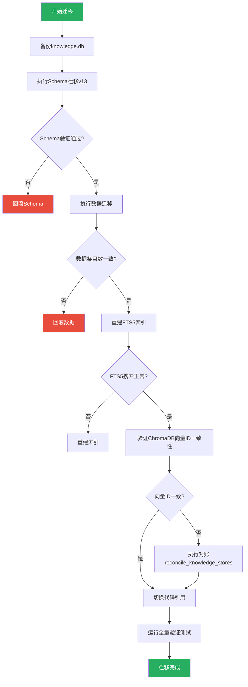

### 4.4 阶段2：接口层统一（高优先级）

**目标**：统一响应格式，对齐降级映射

| 步骤 | 输入 | 输出 | 验收标准 | 依赖 |
|------|------|------|----------|------|
| 2.1 统一MCP Tool响应格式 | errors.py make_response | 所有Tool返回{status,data,metadata} | 排查20个Tool，修复返回字符串的边缘情况 | 阶段1 |
| 2.2 统一HTTP API响应格式 | api.py make_response | HTTP API返回{status,data,error,metadata} | 与MCP格式对齐，status值统一为ok/error | 2.1 |
| 2.3 对齐降级映射 | degradation.py FALLBACK_MAP(20) + constraints.yaml(14) | constraints.yaml补全6个映射 | 20个工具全部有降级声明，constraints.yaml为唯一权威源 | 2.1 |
| 2.4 移除硬编码降级映射 | degradation.py TOOL_SCRIPT_MAP | 仅从constraints.yaml读取 | YAML读取失败时回退到硬编码（向后兼容） | 2.3 |
| 2.5 统一错误码体系 | errors.py + api_routes.py | 合并错误码枚举 | MCP:ERR_VALIDATION与HTTP:BAD_REQUEST映射明确 | 2.2 |

### 4.5 阶段3：MCP层增强（中优先级）

**目标**：暴露Resource订阅，增加审计查询Tool

| 步骤 | 输入 | 输出 | 验收标准 | 依赖 |
|------|------|------|----------|------|
| 3.1 暴露Resource订阅管理 | skill_resources.py内部函数 | resource_subscribe Tool | Host端可调用subscribe/unsubscribe action | 阶段2 |
| 3.2 增加审计日志查询Tool | audit_logger.py | audit_query Tool | 支持按tool_name/date/limit条件查询 | 阶段2 |
| 3.3 扩展COMMAND_PHASE_MAP | progressive_loader.py(6个映射) | 覆盖全部31个命令 | 每个命令都有明确的阶段推进映射 | 3.1 |
| 3.4 实现阶段变更通知 | Resource订阅 + notifications.py | 阶段变更MCP通知推送 | Phase变更时Host端收到通知 | 3.1 |

### 4.6 阶段4：Skill层优化（中优先级）

**目标**：补全内嵌门禁，增强SKELETON阶段，关联Token预算

| 步骤 | 输入 | 输出 | 验收标准 | 依赖 |
|------|------|------|----------|------|
| 4.1 补全_QUALITY_GATES | _shared.py(13项) + references/quality-gates.md(54项) | 54项完整内嵌门禁 | 降级模式下所有54项门禁可检查 | 阶段3 |
| 4.2 SKELETON命令增强 | constraints.yaml + SKILL.md | /status, /help, /budget在Phase 0可用 | Phase 0用户可执行这3个命令 | 4.1 |
| 4.3 Token预算与阶段关联 | token_budget.py + progressive_loader.py | 阶段推进自动调整预算分配 | Phase推进时token_budget自动更新phase_allocations | 4.2 |
| 4.4 API版本协商完善 | server_health.py _negotiate_api_version | 完整协商逻辑+客户端自动适配 | 客户端首次连接时自动协商，不兼容时优雅降级 | 4.3 |

### 4.7 阶段5：清理与验证（低优先级）

**目标**：归档v1，统一版本号，全量回归

| 步骤 | 输入 | 输出 | 验收标准 | 依赖 |
|------|------|------|----------|------|
| 5.1 v1文件归档 | agents/commands/workflows目录 | v1标记archived，v2为唯一版本 | v1文件移至archived/目录或添加.deprecated标记 | 阶段4 |
| 5.2 统一版本号 | __init__.py(3.0.0) + KB_VERSION(2.0.0) | 统一为单一版本号 | MCP Server和KB HTTP API使用同一版本 | 5.1 |
| 5.3 spec-locks CI校验 | spec-locks/*.json | CI步骤强制校验Schema | PR提交时自动校验API契约一致性 | 5.2 |
| 5.4 全量回归测试 | 全部测试套件 | 测试报告 | 100%通过率，新增测试覆盖新功能 | 5.3 |

---

## 5. 渐进式加载披露实现方案

### 5.1 当前状态与目标差距

| 维度 | 当前状态 | 目标状态 | 差距 |
|------|----------|----------|------|
| SKILL.md分段加载 | ✅ 4段PHASE标记已实现 | 保持不变 | 无 |
| 命令驱动阶段推进 | ⚠️ 仅6个命令有映射 | 全部31个命令有映射 | NEW-05 |
| SKELETON阶段可用性 | ⚠️ 仅/status/help/budget声明可用 | 核心查询命令可用 | SKILL-02 |
| 阶段降级自动恢复 | ✅ degrade_phase()已实现 | 保持不变 | 无 |
| 降级事件通知 | ⚠️ resource_load_status返回降级信息 | 主动推送MCP通知 | ARCH-05/NEW-08 |
| Token预算关联 | ❌ 独立管理 | 阶段推进自动调整 | ARCH-08 |
| 披露过渡动画 | ❌ 无 | 阶段转换时提供用户提示 | 新增 |

### 5.2 四阶段设计详解

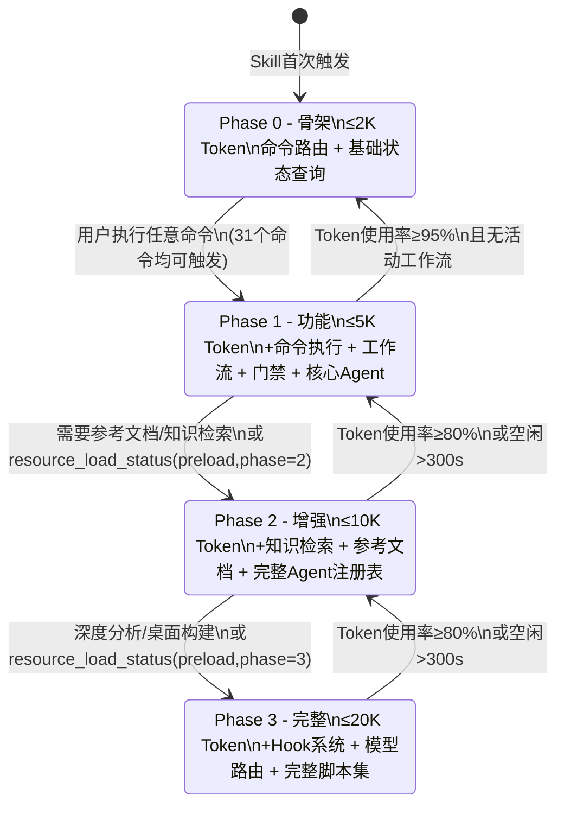

### 5.3 状态机设计

```python
class LoadPhase(str, Enum):
    SKELETON = "skeleton"
    FUNCTIONAL = "functional"
    ENHANCED = "enhanced"
    FULL = "full"

class PhaseTransition:
    TRANSITION_CONDITIONS = {
        (LoadPhase.SKELETON, LoadPhase.FUNCTIONAL): {
            "min_tools": 5,
            "min_resources": 3,
            "trigger": "command_execution"
        },
        (LoadPhase.FUNCTIONAL, LoadPhase.ENHANCED): {
            "min_tools": 12,
            "min_resources": 10,
            "trigger": "knowledge_or_reference_request"
        },
        (LoadPhase.ENHANCED, LoadPhase.FULL): {
            "min_tools": 20,
            "min_resources": 18,
            "trigger": "deep_analysis_or_desktop_build"
        }
    }

    DEGRADATION_CONDITIONS = {
        (LoadPhase.FULL, LoadPhase.ENHANCED): {
            "token_usage_ratio": 0.80,
            "idle_seconds": 300
        },
        (LoadPhase.ENHANCED, LoadPhase.FUNCTIONAL): {
            "token_usage_ratio": 0.80,
            "idle_seconds": 300
        },
        (LoadPhase.FUNCTIONAL, LoadPhase.SKELETON): {
            "token_usage_ratio": 0.95,
            "idle_seconds": 300,
            "no_active_workflow": True
        }
    }
```

### 5.4 完整COMMAND_PHASE_MAP（目标）

| 命令 | 推进到 | 依据 |
|------|--------|------|
| /init, /sprint, /sdd-tdd-medium | FUNCTIONAL | 初始化需要命令执行和工作流 |
| /implement, /fix | FUNCTIONAL | 代码实现需要门禁检查 |
| /plan, /spec, /design, /design-system | ENHANCED | 设计需要参考文档和知识检索 |
| /brainstorm, /clarify | ENHANCED | 需求分析需要知识检索 |
| /test, /review, /audit | ENHANCED | 测试审查需要参考文档 |
| /accept, /deploy | ENHANCED | 验收部署需要完整信息 |
| /refactor, /simplify | ENHANCED | 重构需要知识检索 |
| /build, /build-desktop, /release-desktop | FULL | 构建需要完整脚本集 |
| /loop, /cancel-loop | FUNCTIONAL | 循环模式需要工作流 |
| /learn | ENHANCED | 学习需要知识检索 |
| /status, /agent-status, /budget, /decision | SKELETON(不推进) | 查询类命令无需推进 |
| /rollback, /execute-plan | FUNCTIONAL | 操作类命令 |
| /sdd-tdd-fast | FUNCTIONAL | 快速模式跳过初始化 |

### 5.5 过渡动画与用户提示

阶段转换时向用户提供清晰的提示信息：

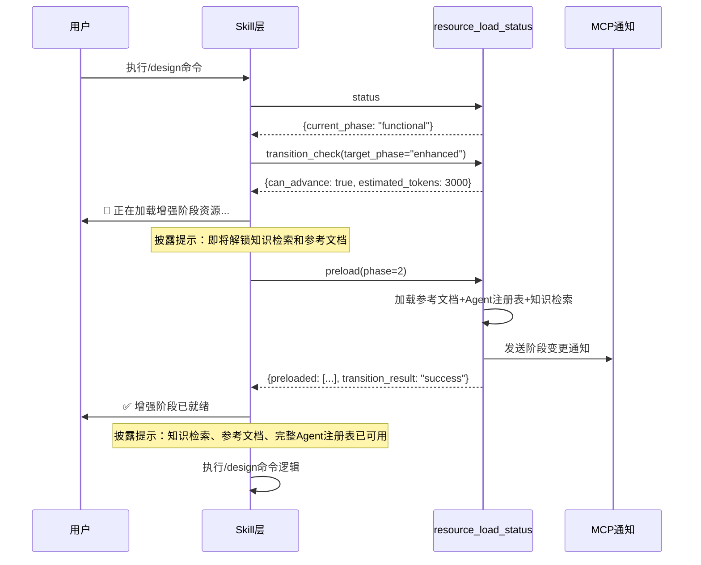

**披露提示模板**：

| 转换 | 加载中提示 | 就绪提示 |
|------|-----------|---------|
| SKELETON→FUNCTIONAL | 🔄 正在加载功能阶段... | ✅ 功能阶段就绪：命令执行、工作流推进、质量门禁已可用 |
| FUNCTIONAL→ENHANCED | 🔄 正在加载增强阶段... | ✅ 增强阶段就绪：知识检索、参考文档、完整Agent注册表已可用 |
| ENHANCED→FULL | 🔄 正在加载完整阶段... | ✅ 完整阶段就绪：Hook系统、模型路由、完整脚本集已可用 |
| FULL→ENHANCED | ⚠️ Token预算紧张，降级到增强阶段 | 增强阶段运行中：完整脚本集和Hook系统已卸载 |
| ENHANCED→FUNCTIONAL | ⚠️ Token预算紧张，降级到功能阶段 | 功能阶段运行中：知识检索和参考文档已卸载 |

### 5.6 性能指标

| 指标 | 目标值 | 测量方式 |
|------|--------|----------|
| Phase 0加载时间 | ≤500ms | resource_load_status(action="status")首次调用耗时 |
| Phase 0→1推进时间 | ≤2s | preload(phase=1)调用耗时 |
| Phase 1→2推进时间 | ≤3s | preload(phase=2)调用耗时 |
| Phase 2→3推进时间 | ≤5s | preload(phase=3)调用耗时 |
| Phase 0 Token消耗 | ≤2K | SKILL.md PHASE_0段Token计数 |
| Phase 1 Token消耗 | ≤5K | SKILL.md PHASE_0+1段Token计数 |
| Phase 2 Token消耗 | ≤10K | SKILL.md PHASE_0+1+2段Token计数 |
| Phase 3 Token消耗 | ≤20K | SKILL.md PHASE_0+1+2+3段Token计数 |
| 降级恢复延迟 | ≤30s | degrade_phase()→自动恢复检测间隔 |
| 阶段转换通知延迟 | ≤1s | Phase变更→MCP通知到达时间 |

---

## 6. 测试策略

### 6.1 测试分层架构

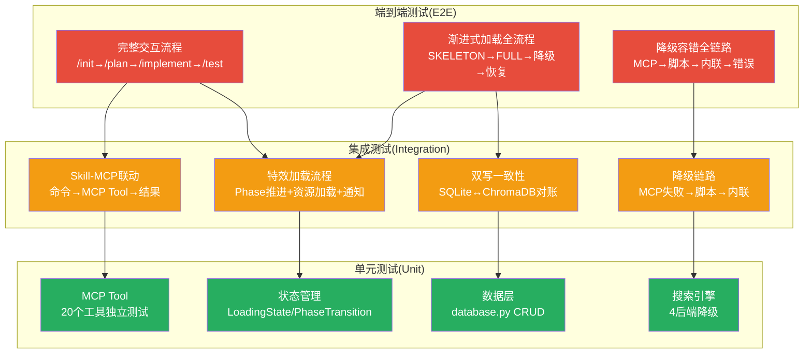

### 6.2 单元测试

#### 6.2.1 MCP Tool单元测试

| 工具 | 测试场景 | 预期结果 | 优先级 |
|------|----------|----------|--------|
| knowledge_search | retrieve with hybrid | 返回{status:"success",data:{results, strategy}} | 高 |
| knowledge_search | ChromaDB不可用降级 | strategy降级为sqlite_fts5_bm25 | 高 |
| knowledge_search | 全部不可用降级 | 返回keyword_tfidf结果 | 中 |
| quality_gate_check | 指定gate_ids检查 | 返回checks数组，每项含status | 高 |
| quality_gate_check | 脚本不存在降级 | 使用INLINE_CHECKS | 中 |
| resource_load_status | status查询 | 返回current_phase, resources, available_functions | 高 |
| resource_load_status | preload推进 | 返回preloaded列表和transition_result | 高 |
| resource_load_status | token_report | 返回各工具Token使用统计 | 中 |
| workflow_dispatch | start工作流 | 返回workflow_id和status="running" | 高 |
| workflow_dispatch | phase推进 | current_phase递增 | 高 |
| agent_manage | create/assign/release | 状态正确转换 | 中 |
| config_manage | reload配置 | 配置热更新生效 | 中 |
| metrics_report | query指标 | 返回tool_name对应指标 | 低 |
| server_health | 版本协商 | 兼容性判断正确 | 中 |

#### 6.2.2 状态管理单元测试

| 组件 | 测试场景 | 预期结果 |
|------|----------|----------|
| LoadPhase | 枚举值正确 | SKELETON="skeleton", FUNCTIONAL="functional"等 |
| LoadingState | 初始化 | current_phase=SKELETON, degraded=False |
| LoadingState | degrade_phase() | degraded=True, degraded_from记录原阶段 |
| PhaseTransition | SKELETON→FUNCTIONAL条件 | min_tools=5, min_resources=3 |
| PhaseTransition | 降级条件检查 | token_usage_ratio≥0.80触发降级 |
| ProgressiveLoader | advance_phase() | 阶段正确推进，资源列表更新 |
| ProgressiveLoader | sync_from_skill_phase() | PHASE_SKILL_MAP映射正确 |
| COMMAND_PHASE_MAP | 31个命令映射 | 每个命令都有明确的目标阶段 |

### 6.3 集成测试

#### 6.3.1 Skill-MCP联动测试

| 测试场景 | 步骤 | 预期结果 |
|----------|------|----------|
| /init完整流程 | 1.skill_analyze 2.knowledge_search 3.workflow_dispatch(start) 4.project_init 5.decision_log | 工作流创建成功，Agent分配完成 |
| /plan完整流程 | 1.skill_analyze 2.knowledge_search 3.agent_status 4.workflow_dispatch(phase=2) 5.decision_log 6.token_budget | 架构设计阶段推进，Token预算更新 |
| /loop循环模式 | 1.workflow_dispatch(start) 2.循环执行Phase 0-8 3.session_manage(save) | 循环完成或达到max_iterations，状态持久化 |
| 降级链路测试 | 1.模拟MCP不可用 2.触发脚本降级 3.模拟脚本失败 4.触发内联降级 | 降级结果格式与MCP一致，degraded=True |

#### 6.3.2 特效加载流程测试

| 测试场景 | 步骤 | 预期结果 |
|----------|------|----------|
| 完整加载流程 | SKELETON→preload(1)→preload(2)→preload(3) | 每阶段资源正确加载，Token预算递增 |
| 降级恢复流程 | FULL→Token超限降级→ENHANCED→恢复→FULL | 降级和恢复正确触发，资源正确卸载/加载 |
| 命令驱动推进 | 在SKELETON执行/init | 自动推进到FUNCTIONAL |
| 知识检索门控 | 在SKELETON调用knowledge_search | 返回不可用提示，建议升级到ENHANCED |
| 通知推送 | Phase变更 | MCP通知到达Host端 |

#### 6.3.3 双写一致性测试

| 测试场景 | 步骤 | 预期结果 |
|----------|------|----------|
| 正常双写 | knowledge_inject → SQLite → ChromaDB | sync_status='ready'，两存储一致 |
| ChromaDB写入失败 | 模拟ChromaDB异常 | sync_status='pending'，reconciliation_log记录 |
| 自动对账 | 触发reconcile_knowledge_stores | pending条目重试，成功标记ready |
| 过期清理 | cleanup_stale_pending_entries(24h) | 超时pending条目标记failed |

### 6.4 端到端测试

| 测试场景 | 完整交互流程 | 验证点 |
|----------|-------------|--------|
| Web项目全流程 | /init→/plan→/implement→/test→/review→/accept→/deploy | 9阶段工作流完整执行，54项门禁通过 |
| 桌面项目全流程 | /init→/plan→/implement→/build-desktop→/release-desktop | 桌面构建和签名门禁通过 |
| 降级容错全链路 | 模拟MCP不可用→脚本降级→内联降级→恢复 | 降级链路完整，恢复后功能正常 |
| 渐进式加载全流程 | SKELETON→各命令触发推进→FULL→Token超限降级→恢复 | 阶段转换正确，Token预算联动 |
| 长时间工作流 | /loop模式执行50次迭代 | 状态持久化正确，无内存泄漏 |

### 6.5 回归验证方案

| 验证项 | 方法 | 通过标准 |
|--------|------|----------|
| 已修复问题不回退 | 针对P0/P1/P2已修复的10个问题运行专项测试 | 全部通过 |
| MCP Tool功能完整性 | 20个Tool各执行1次标准调用 | 全部返回success |
| Resource可访问性 | 25+个Resource各读取1次 | 全部返回有效内容 |
| 降级链路完整性 | 每个Tool模拟MCP不可用 | 降级结果格式一致 |
| 数据迁移完整性 | 迁移前后条目数对比 | 100%一致 |
| Token预算准确性 | 各Phase Token消耗测量 | 在预算±10%范围内 |
| 渐进式加载正确性 | 4阶段推进+降级+恢复 | 状态转换正确 |

---

## 7. CI建议

### 7.1 CI流水线设计

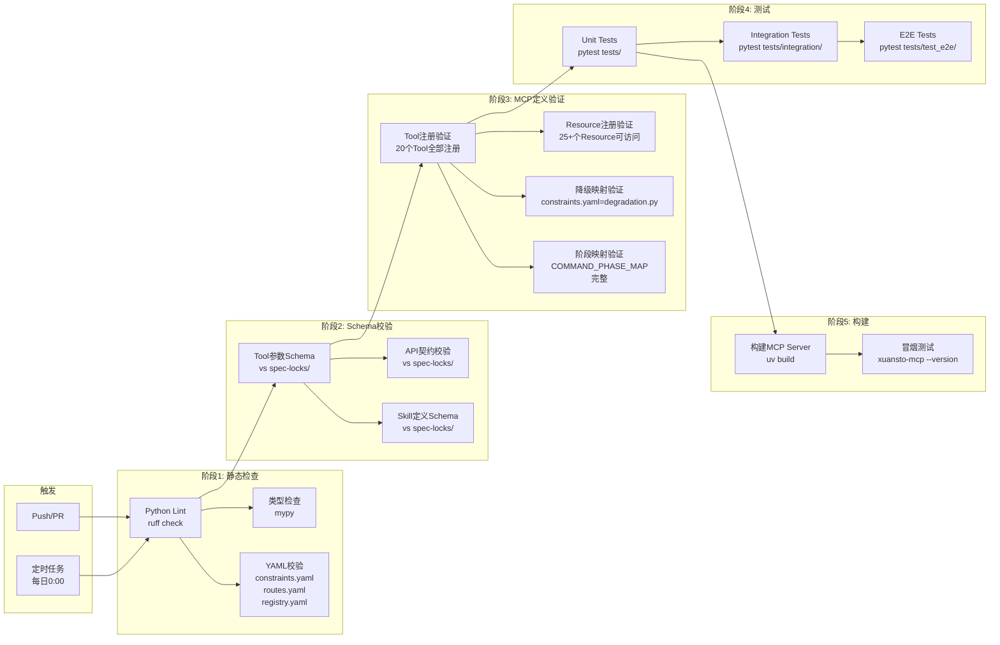

### 7.2 具体CI步骤

#### 7.2.1 Lint检查

```yaml
# .github/workflows/ci.yml
lint:
  runs-on: ubuntu-latest
  steps:
    - uses: actions/checkout@v4
    - uses: astral-sh/ruff-action@v1
      with:
        args: check xuansto-mcp-server/src/
    - run: ruff format --check xuansto-mcp-server/src/
```

#### 7.2.2 Schema校验

```yaml
schema-validate:
  runs-on: ubuntu-latest
  steps:
    - uses: actions/checkout@v4
    - name: Validate Tool Parameter Schemas
      run: |
        python scripts/validate_schemas.py \
          --tools xuansto-mcp-server/src/xuansto_mcp/tools/ \
          --lock xuansto-mcp-server/spec-locks/tool-parameter-schemas.json
    - name: Validate API Contract
      run: |
        python scripts/validate_schemas.py \
          --api xuansto-mcp-server/src/xuansto_mcp/api_routes.py \
          --lock xuansto-mcp-server/spec-locks/api-contract-version.json
    - name: Validate Skill Definition
      run: |
        python scripts/validate_schemas.py \
          --skill .trae/skills/xuansto-skill-v2/SKILL.md \
          --lock xuansto-mcp-server/spec-locks/skill-definition-schema.json
```

#### 7.2.3 MCP定义验证

```yaml
mcp-validate:
  runs-on: ubuntu-latest
  steps:
    - uses: actions/checkout@v4
    - name: Verify Tool Registration
      run: |
        python -c "
        from xuansto_mcp.tools import TOOL_REGISTRY
        expected = {'skill_analyze','knowledge_search','knowledge_inject',
                    'quality_gate_check','spec_drift_detect','security_scan',
                    'code_simplify','session_manage','workflow_dispatch',
                    'agent_status','agent_manage','hook_manage',
                    'resource_load_status','context_compress','server_health',
                    'decision_log','token_budget','project_init',
                    'metrics_report','config_manage'}
        actual = set(TOOL_REGISTRY.keys())
        assert actual == expected, f'Missing: {expected-actual}, Extra: {actual-expected}'
        "
    - name: Verify Degradation Mapping Consistency
      run: |
        python scripts/verify_degradation_consistency.py \
          --degradation xuansto-mcp-server/src/xuansto_mcp/core/degradation.py \
          --constraints .trae/skills/xuansto-skill-v2/constraints.yaml
    - name: Verify COMMAND_PHASE_MAP Completeness
      run: |
        python scripts/verify_phase_map.py \
          --routes .trae/skills/xuansto-skill-v2/commands/routes.yaml \
          --loader scripts/knowledge_server/progressive_loader.py
```

#### 7.2.4 测试执行

```yaml
test:
  runs-on: ubuntu-latest
  needs: [lint, schema-validate, mcp-validate]
  steps:
    - uses: actions/checkout@v4
    - name: Unit Tests
      run: |
        cd xuansto-mcp-server
        uv run pytest tests/ -m "not integration and not e2e" --cov=xuansto_mcp --cov-report=xml
    - name: Integration Tests
      run: |
        cd xuansto-mcp-server
        uv run pytest tests/integration/ -v
    - name: E2E Tests
      run: |
        cd xuansto-mcp-server
        uv run pytest tests/test_e2e/ -v --timeout=120
```

#### 7.2.5 构建与冒烟测试

```yaml
build:
  runs-on: ubuntu-latest
  needs: [test]
  steps:
    - uses: actions/checkout@v4
    - name: Build Package
      run: |
        cd xuansto-mcp-server
        uv build
    - name: Smoke Test
      run: |
        cd xuansto-mcp-server
        uv run xuansto-mcp --version
        uv run xuansto-mcp --help
```

### 7.3 定时任务

```yaml
scheduled:
  runs-on: ubuntu-latest
  schedule:
    - cron: "0 0 * * *"
  steps:
    - name: Full Regression
      run: |
        cd xuansto-mcp-server
        uv run pytest tests/ -v --timeout=300
    - name: Data Consistency Check
      run: |
        python scripts/check_db_consistency.py \
          --db .xuansto/xuansto.db \
          --chroma .knowledge/index/chroma_db
```

### 7.4 CI质量门禁

| 门禁 | 条件 | 失败处理 |
|------|------|----------|
| Lint通过 | ruff check 0 errors | 阻止合并 |
| Schema一致 | Tool/API/Skill Schema与spec-locks一致 | 阻止合并 |
| Tool注册完整 | 20个Tool全部注册 | 阻止合并 |
| 降级映射一致 | constraints.yaml = degradation.py | 阻止合并 |
| 单元测试通过 | 100%通过率 | 阻止合并 |
| 覆盖率达标 | ≥80% | 警告 |
| 构建成功 | uv build无错误 | 阻止合并 |
| 冒烟测试通过 | --version/--help正常 | 阻止合并 |

---

## 附录A：版本规划摘要

| 版本 | 目标日期 | 主要内容 | 涉及问题 |
|------|----------|----------|----------|
| v8.4.1 | 2026-05-30 | 状态验证+PROBLEM.md更新 | NEW-11, ARCH-05/06/07/09/10验证, DB-03验证, MCP-03验证 |
| v8.5.0 | 2026-06-30 | 数据层统一+接口层统一+MCP增强+Skill优化 | NEW-07, DB-01/02, ARCH-11, API-01, NEW-01, NEW-05/06/08/09, SKILL-02, ARCH-08, NEW-03 |
| v8.6.0 | 2026-08-31 | 清理归档+版本统一+测试补全 | P3-01, NEW-02, NEW-04, NEW-10, ARCH-12 |

## 附录B：关键文件变更清单

| 文件 | 变更类型 | 涉及阶段 |
|------|----------|----------|
| `PROBLEM.md` | 更新状态 | 阶段0 |
| `xuansto-mcp-server/src/xuansto_mcp/core/database.py` | Schema合并+迁移 | 阶段1 |
| `scripts/knowledge_server/db_engine.py` | 废弃(合并到database.py) | 阶段1 |
| `xuansto-mcp-server/src/xuansto_mcp/core/degradation.py` | 降级映射对齐 | 阶段2 |
| `.trae/skills/xuansto-skill-v2/constraints.yaml` | 补全6个降级映射 | 阶段2 |
| `xuansto-mcp-server/src/xuansto_mcp/core/errors.py` | 统一错误码 | 阶段2 |
| `scripts/knowledge_server/api.py` | 响应格式统一 | 阶段2 |
| `xuansto-mcp-server/src/xuansto_mcp/resources/skill_resources.py` | 暴露订阅管理 | 阶段3 |
| `xuansto-mcp-server/src/xuansto_mcp/tools/audit_query.py` | 新增Tool | 阶段3 |
| `scripts/knowledge_server/progressive_loader.py` | 扩展COMMAND_PHASE_MAP | 阶段3 |
| `scripts/knowledge_server/tools/_shared.py` | 补全54项门禁 | 阶段4 |
| `xuansto-mcp-server/src/xuansto_mcp/tools/token_budget.py` | 阶段关联 | 阶段4 |
| `.github/workflows/ci.yml` | 新增CI步骤 | 阶段5 |
