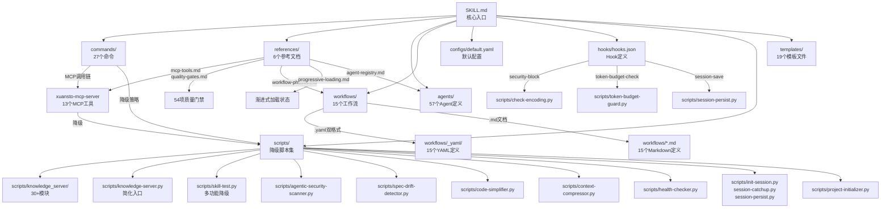
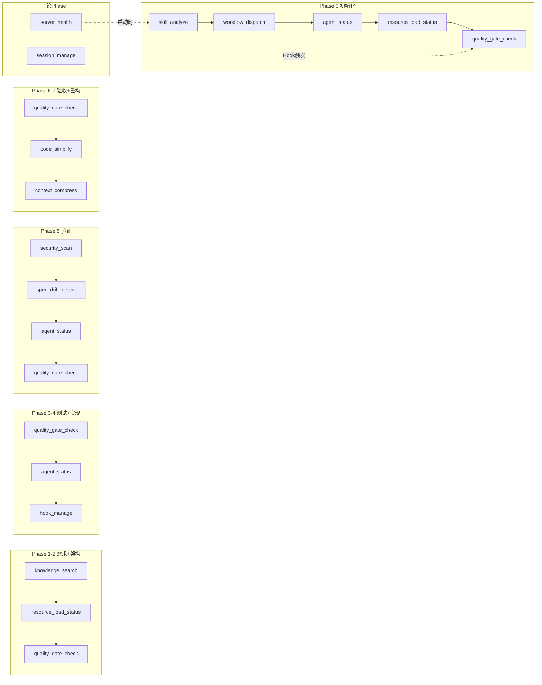
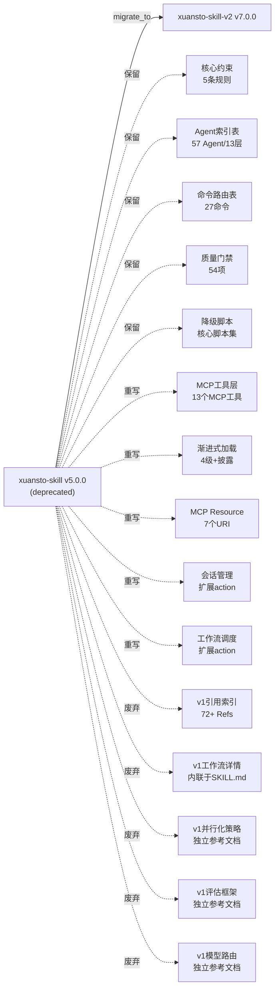

# Xuansto Skill v7.0.0 (MCP Edition) 综合评审文档

> 评审版本: xuansto-skill-v2 7.0.0 | 评审日期: 2026-05-22 | 基于源码事实分析

---

## 目录

1. [SKILL.md全文分析](#1-skillmd全文分析)
2. [功能逻辑分解](#2-功能逻辑分解)
3. [交互模式](#3-交互模式)
4. [渐进式加载披露逻辑分析](#4-渐进式加载披露逻辑分析)
5. [可复用与需废弃部分](#5-可复用与需废弃部分)
6. [引用依赖追踪](#6-引用依赖追踪)

---

## 1. SKILL.md全文分析

### 1.1 触发条件：三维触发矩阵

SKILL.md的frontmatter定义了三维触发矩阵：`phrases` / `keywords` / `commands` / `not_for`。

#### 1.1.1 phrases（短语触发）

共47个触发短语，覆盖中英文双语场景：

| 语言 | 数量 | 典型示例 |
|------|------|----------|
| 英文 | 21 | "build this properly", "write tests first", "plan my sprint", "review architecture", "brainstorm", "design system", "simplify code", "loop task", "security review", "penetration test", "desktop build", "app packaging", "pentest" |
| 中文 | 26 | "帮我搭建项目", "先写测试再写代码", "做个代码审查", "安全审计一下", "重构这段代码", "帮我规划一下", "完整开发一个功能", "从需求到部署", "多agent协作", "TDD开发", "SDD驱动", "桌面打包", "渗透测试", "规格驱动开发", "搭建项目", "从零开发", "端到端开发", "开发一个功能", "先写规格", "做需求分析", "全流程开发", "规格驱动", "测试先行", "桌面应用" |

**分析**：phrases覆盖了从需求到部署的全生命周期意图表达，中文短语占55%，体现了中文优先的设计倾向。但存在重复语义覆盖（如"帮我搭建项目"与"搭建项目"、"TDD开发"与"测试先行"），建议去重以减少触发矩阵体积。

#### 1.1.2 keywords（关键词触发）

共83个关键词，分为以下类别：

| 类别 | 数量 | 示例 |
|------|------|------|
| 核心标识 | 1 | xuansto |
| 方法论 | 6 | SDD, TDD, spec-driven, test-driven, 规格优先, 测试先行 |
| 架构概念 | 8 | quality-gates, multi-agent, agent-orchestration, autonomous-development, self-evolving-code, 质量门禁, 自动化开发, 编排器 |
| 工作流 | 5 | 9-phase-workflow, 54-quality-gates, 57-agents, 27-commands, 全生命周期 |
| 桌面开发 | 6 | desktop-development, desktop-app, cross-platform, Electron, Tauri, Flutter |
| 安全 | 5 | OWASP, TrinityGuard, penetration-testing, pentest, security-audit, vulnerability-scan |
| 开发阶段 | 8 | 冲刺规划, 需求澄清, 架构规划, 代码审查, 安全审计, 桌面构建, 桌面开发, 桌面应用 |
| 技术概念 | 4 | IPC-contracts, token-optimization, spec-drift, project-setup |
| 功能动词 | 6 | brainstorm, design-system, simplify, loop, 搭建项目, 从零开发 |
| 其他 | 34 | 端到端开发, 先写规格, 需求分析, agent协作, 重构安全网, 全流程开发, 规格驱动, 多agent协作, 桌面打包, 渗透测试 等 |

**分析**：keywords与phrases存在大量语义重叠（如"渗透测试"同时出现在phrases和keywords中），这是有意设计——phrases匹配用户完整语句，keywords匹配用户输入中的关键词片段。但83个关键词中约30%与phrases完全重复，可考虑合并去重以降低触发矩阵的Token消耗。

#### 1.1.3 commands（斜杠命令触发）

共27个斜杠命令：

```
/sprint, /clarify, /plan, /spec, /design, /implement, /test, /review, /fix,
/accept, /deploy, /build-desktop, /release-desktop, /refactor, /audit,
/agent-status, /learn, /brainstorm, /execute-plan, /design-system, /simplify,
/loop, /cancel-loop, /build, /init, /status, /rollback
```

**命令分类**：

| 类别 | 命令 | 数量 |
|------|------|------|
| 工作流类 | /sprint, /clarify, /plan, /spec, /design, /implement, /test, /review, /fix, /accept, /deploy, /brainstorm, /execute-plan, /design-system, /simplify, /refactor, /audit | 17 |
| 桌面类 | /build-desktop, /release-desktop | 2 |
| 系统类 | /agent-status, /learn, /loop, /cancel-loop, /build, /init, /status, /rollback | 8 |

#### 1.1.4 not_for（排除触发）

共12条排除规则：

| 排除项 | 说明 |
|--------|------|
| simple single-file edits | 单文件编辑（添加注释、修复拼写错误） |
| pure infrastructure/DevOps | 纯基础设施/DevOps无代码变更 |
| documentation-only tasks | 纯文档任务无代码 |
| simple Q&A or explanations | 简单问答或解释 |
| pure UI/UX design without code | 纯UI/UX设计无代码开发（应使用ui-ux-pro-max） |
| pure data analysis or reporting | 纯数据分析或报告 |
| simple config changes | 简单配置变更（环境变量、标志位） |
| one-line fixes or trivial patches | 单行修复或5行以下的补丁 |
| simple security scans without remediation | 简单安全扫描无代码修复 |
| documentation-only security reports | 纯文档安全报告 |
| desktop app UI design only | 仅桌面应用UI设计无代码 |
| quick hotfixes under 5 lines | 5行以下的快速热修复 |

**分析**：not_for定义清晰，与phrases/keywords形成互补——正面匹配+负面排除确保触发精准度。但缺少对"已有其他Skill更好匹配"场景的排除规则（如"仅前端样式调整"应优先匹配frontend-design Skill）。

### 1.2 参数定义与校验

SKILL.md本身不定义全局参数，参数定义分散在27个命令的`.md`文件中。各命令参数遵循统一模式：

| 参数类型 | 校验方式 | 示例 |
|----------|----------|------|
| string | 非空校验 | `<topic>` in /brainstorm |
| enum | 值域校验 | `--depth: quick/standard/thorough` |
| int | 范围校验 | `--coverage: 80` (百分比) |
| flag | 布尔校验 | `--auto`, `--skip-tests` |
| path | 存在性校验 | `--input: .sprint/artifacts/requirements/` |
| json | 格式校验 | `--constraints: {}` |
| list | 元素校验 | `--skip-phases: []` |

**问题**：参数校验逻辑仅在命令文档中描述，无运行时校验脚本。LLM需自行理解并执行参数校验，可能导致参数传递错误不被捕获。

### 1.3 提示词/指令内容

SKILL.md的核心指令内容分为以下部分：

| 部分 | 行数 | 内容 |
|------|------|------|
| 核心约束 | 5条 | Spec>Test>Code / Karpathy准则 / 增量约束 / 脚本规范 / 跨平台 |
| MCP Server依赖 | 1节 | 版本要求、降级模式功能范围表 |
| 渐进式加载披露 | 1节 | 4级加载阶段、加载指令、资源优先级、功能可用性披露 |
| MCP工具调用 | 1节 | 13个工具概要表 |
| MCP Resource访问 | 1节 | 7个URI资源 |
| 降级模式 | 1节 | 检测→回退→格式统一 |
| 执行入口 | 5步 | 平台检测→规模评估→工作流选择→MCP+知识检索→Phase 0 |
| 工作流Phase概览 | 9行 | Phase 0-8的MCP工具和关键门禁 |
| 命令路由表 | 27行 | 用户意图→命令→MCP调用链→降级策略 |
| 命令详细步骤 | 27节 | 每个命令的MCP调用步骤 |
| Agent角色索引表 | 13层57个 | 按层级分组的Agent列表 |
| Hook系统 | 1节 | 核心Hook和MCP工具映射 |
| 模型路由 | 1节 | fast/standard/deep三级 |
| 会话持久化 | 1节 | SessionStart/Stop Hook |
| 关键规则 | 1节 | 6条规则 |

**Token估算**：SKILL.md全文约420行，预估Token消耗约8K-10K。通过渐进式加载，Phase 0骨架可降至~2K。

### 1.4 引用的脚本或工具列表

#### MCP工具（13个）

| 工具 | 用途 | 降级脚本 |
|------|------|----------|
| skill_analyze | 项目结构分析 | scripts/skill-test.py --analyze |
| knowledge_search | 知识库检索 | scripts/knowledge-server.py --search |
| quality_gate_check | 质量门禁检查 | scripts/skill-test.py --gate |
| spec_drift_detect | 规格漂移检测 | scripts/spec-drift-detector.py |
| security_scan | 安全扫描 | scripts/agentic-security-scanner.py |
| code_simplify | 代码简化分析 | scripts/code-simplifier.py |
| session_manage | 会话状态管理 | scripts/init-session.py / session-catchup.py / session-persist.py |
| workflow_dispatch | 工作流调度 | scripts/project-initializer.py (start) / 内联Phase推进 |
| agent_status | Agent状态查询 | 静态注册表 / scripts/skill-test.py --agents |
| hook_manage | Hook管理 | scripts/check-encoding.py / token-budget-guard.py / session-persist.py |
| resource_load_status | 渐进式加载状态 | 内联状态检查(resource_state.json) |
| context_compress | 上下文压缩 | scripts/context-compressor.py |
| server_health | 服务器健康检查 | scripts/health-checker.py |

#### 降级脚本（完整列表）

| 脚本文件 | 对应MCP工具 | 语言 |
|----------|-------------|------|
| scripts/skill-test.py | skill_analyze, quality_gate_check, agent_status | Python |
| scripts/knowledge-server.py | knowledge_search | Python |
| scripts/spec-drift-detector.py | spec_drift_detect | Python |
| scripts/agentic-security-scanner.py | security_scan | Python |
| scripts/code-simplifier.py | code_simplify | Python |
| scripts/init-session.py | session_manage(save/init) | Python |
| scripts/session-catchup.py | session_manage(load/detect/restore) | Python |
| scripts/session-persist.py | session_manage(save/load/list) | Python |
| scripts/project-initializer.py | workflow_dispatch(start) | Python |
| scripts/check-encoding.py | hook_manage(encoding-check) | Python |
| scripts/token-budget-guard.py | hook_manage(token-budget-check) | Python |
| scripts/context-compressor.py | context_compress | Python |
| scripts/health-checker.py | server_health | Python |

---

## 2. 功能逻辑分解

### 2.1 执行流程步骤拆解

#### Step 1: 平台检测

**触发时机**：Skill首次触发 / /init命令执行 / SessionStart Hook(platform-detect)

**逻辑**：
1. 读取项目根目录文件列表
2. 按优先级检测平台类型（配置于`configs/default.yaml`的`platform_detection`节）：
   - `explicit_declaration`：用户显式声明（如`/init --type desktop`）
   - `dependency_analysis`：分析package.json/Cargo.toml/pubspec.yaml中的依赖
   - `structure_analysis`：分析目录结构（如src-tauri目录→Tauri）
   - `default_web`：无法检测时默认Web平台
3. Web项目指示器：package.json with react/vue/angular / next.config.js / vite.config.ts
4. Desktop项目指示器：package.json with electron / src-tauri directory / electron-builder.yml

**涉及文件**：
- [configs/default.yaml](file:///d:/Projects/TraeProjects/skiller/.trae/skills/xuansto-skill-v2/configs/default.yaml) - `platform_detection`配置节
- [hooks/hooks.json](file:///d:/Projects/TraeProjects/skiller/.trae/skills/xuansto-skill-v2/hooks/hooks.json) - `platform-detect` Hook
- MCP工具：`skill_analyze(skill_path, depth="full")`

#### Step 2: 规模评估

**触发时机**：平台检测完成后

**逻辑**：
1. 统计项目文件数
2. 判断项目规模：
   - 文件数>50 → 大型项目（full工作流）
   - 文件数20-50 → 中型项目（medium工作流）
   - 文件数<20 → 小型项目（fast工作流）
3. 判断优先级：用户显式指定 > 项目特征自动判断 > 默认medium

**涉及文件**：
- [SKILL.md](file:///d:/Projects/TraeProjects/skiller/.trae/skills/xuansto-skill-v2/SKILL.md) - 工作流选择逻辑
- [configs/default.yaml](file:///d:/Projects/TraeProjects/skiller/.trae/skills/xuansto-skill-v2/configs/default.yaml) - `orchestrator.lean_mode_threshold`配置

#### Step 3: 工作流选择

**触发时机**：规模评估完成后

**逻辑**：根据规模选择工作流级别：

| 条件 | 工作流 | 文件 |
|------|--------|------|
| 大型/完整流程/安全关键 | sdd-tdd-full | [workflows/sdd-tdd-full.md](file:///d:/Projects/TraeProjects/skiller/.trae/skills/xuansto-skill-v2/workflows/sdd-tdd-full.md) |
| 中型/中等复杂度 | sdd-tdd-medium | [workflows/sdd-tdd-medium.md](file:///d:/Projects/TraeProjects/skiller/.trae/skills/xuansto-skill-v2/workflows/sdd-tdd-medium.md) |
| 小型/快速迭代 | sdd-tdd-fast | [workflows/sdd-tdd-fast.md](file:///d:/Projects/TraeProjects/skiller/.trae/skills/xuansto-skill-v2/workflows/sdd-tdd-fast.md) |

特殊工作流（按命令触发）：

| 命令 | 工作流 |
|------|--------|
| /brainstorm, /clarify | brainstorming-workflow |
| /design, /design-system | ui-ux-workflow |
| /build-desktop | desktop-build-workflow |
| /release-desktop | desktop-release-workflow |
| /audit | security-audit |
| /loop | autonomous_loop |
| /review | subagent-driven-workflow |

**涉及文件**：
- [workflows/](file:///d:/Projects/TraeProjects/skiller/.trae/skills/xuansto-skill-v2/workflows/) - 15个工作流定义（.md + .yaml双格式）
- MCP工具：`workflow_dispatch(action="start", workflow=选定工作流)`

#### Step 4: 加载命令+知识检索

**触发时机**：工作流选择完成后，每个Phase开始前

**逻辑**：
1. 读取`commands/[command].md`获取当前命令的详细步骤
2. 解析任务类型和技术栈
3. 调用`knowledge_search(query=任务关键词, search_type="hybrid")`检索相关知识
4. 注入Agent上下文（Token≤2048）
5. 完成后沉淀经验（knowledge_search(action="precipitate")）

**知识检索降级链**：
```
ChromaDB(语义+关键词) → SQLite FTS5(关键词) → keyword_fallback(纯关键词匹配)
```

**涉及文件**：
- [commands/](file:///d:/Projects/TraeProjects/skiller/.trae/skills/xuansto-skill-v2/commands/) - 27个命令定义文件
- [scripts/knowledge-server.py](file:///d:/Projects/TraeProjects/skiller/.trae/skills/xuansto-skill-v2/scripts/knowledge-server.py) - 知识服务器
- [scripts/knowledge_server/](file:///d:/Projects/TraeProjects/skiller/.trae/skills/xuansto-skill-v2/scripts/knowledge_server/) - 知识服务器完整模块（30+文件）

#### Step 5: 执行Phase 0

**触发时机**：知识检索完成后

**逻辑**（9步）：
1. `skill_analyze(skill_path, depth="full")` → 获取项目元数据
2. 检测平台类型（package.json/pubspec.yaml/Cargo.toml）
3. 评估项目规模（文件数统计）
4. `workflow_dispatch(action="start", workflow=选定工作流)` → 启动工作流实例
5. `agent_status(action="by_phase", phase=0)` → 查询初始化阶段Agent
6. `resource_load_status(action="preload", phase=0)` → 预加载Phase 0资源
7. 建立设计系统基线（色彩/字体/间距/组件规范）
8. `quality_gate_check(gate_ids=["DESIGN-SYSTEM-COMPLETE", "ANTI-PATTERN-CHECK"])` → 验证初始化门禁
9. 门禁通过后触发PhaseEnter Hook → 进入Phase 1

**涉及文件**：
- [references/workflow-phases.md](file:///d:/Projects/TraeProjects/skiller/.trae/skills/xuansto-skill-v2/references/workflow-phases.md) - Phase 0详细步骤
- [references/quality-gates.md](file:///d:/Projects/TraeProjects/skiller/.trae/skills/xuansto-skill-v2/references/quality-gates.md) - 门禁定义
- [hooks/hooks.json](file:///d:/Projects/TraeProjects/skiller/.trae/skills/xuansto-skill-v2/hooks/hooks.json) - Hook定义

### 2.2 各步骤涉及的代码/脚本文件/函数名/关键逻辑

| 步骤 | 脚本文件 | 关键函数/逻辑 | MCP工具 |
|------|----------|---------------|---------|
| 平台检测 | scripts/skill-test.py --analyze | 项目结构扫描、依赖解析 | skill_analyze |
| 规模评估 | scripts/skill-test.py --analyze | 文件计数、模块统计 | skill_analyze |
| 工作流选择 | scripts/project-initializer.py | 工作流实例化、Phase初始化 | workflow_dispatch |
| 知识检索 | scripts/knowledge-server.py / scripts/knowledge_server/ | hybrid_search(), progressive_search(), vector_engine | knowledge_search |
| Phase 0执行 | scripts/skill-test.py --gate | 门禁检查逻辑 | quality_gate_check |
| 安全扫描 | scripts/agentic-security-scanner.py | agentic_scan(), dependency_scan() | security_scan |
| 规格漂移 | scripts/spec-drift-detector.py | spec_vs_code_diff() | spec_drift_detect |
| 代码简化 | scripts/code-simplifier.py | simplify(), dedup() | code_simplify |
| 会话管理 | scripts/init-session.py / session-catchup.py / session-persist.py | save(), load(), detect() | session_manage |
| 上下文压缩 | scripts/context-compressor.py | semantic_compress(), selective_compress() | context_compress |
| 健康检查 | scripts/health-checker.py | health_check() | server_health |
| Hook执行 | scripts/check-encoding.py / token-budget-guard.py | encoding_check(), budget_check() | hook_manage |

---

## 3. 交互模式

### 3.1 用户输入格式

#### 3.1.1 自然语言输入

用户可通过自然语言触发Skill，匹配逻辑为：

```
用户输入 → phrases匹配(完整语句) → keywords匹配(关键词片段) → 语义匹配 → 命令路由
```

**匹配优先级**：精确匹配 > 语义匹配 > 更具体命令优先 > 默认/sprint兜底

**示例**：

| 用户输入 | 匹配方式 | 路由命令 |
|----------|----------|----------|
| "帮我搭建项目" | phrases精确匹配 | /init → /brainstorm |
| "先写测试再写代码" | phrases精确匹配 | /implement (TDD模式) |
| "安全审计一下" | phrases精确匹配 | /audit |
| "重构这段代码" | phrases精确匹配 | /refactor |
| "我想做一个SaaS产品" | 语义匹配 | /brainstorm |
| "检查代码质量" | 语义匹配 | /review |

#### 3.1.2 斜杠命令输入

27个斜杠命令均支持别名和参数：

```
/命令名 [必选参数] [--可选参数=值] [--flag]
```

**命令别名示例**：

| 命令 | 别名 |
|------|------|
| /accept | acc |
| /agent-status | agents, as |
| /brainstorm | bs, explore |
| /build | b |
| /cancel-loop | cancel, stop |
| /clarify | c |
| /deploy | dep |
| /design | d |
| /design-system | ds, design-sys |
| /execute-plan | ep, exec |
| /fix | f |
| /implement | i, impl |
| /learn | l |
| /loop | lp |
| /plan | p |
| /refactor | ref |
| /release-desktop | rdesk |
| /review | r, rv |
| /rollback | rb, revert |
| /simplify | simp |
| /spec | sp |
| /sprint | sp, sprint-start |
| /status | st, info |
| /test | t |

### 3.2 输出格式

#### 3.2.1 命令输出

各命令的输出格式由命令定义中的"输出交付"步骤决定：

| 命令 | 输出格式 | 输出文件 |
|------|----------|----------|
| /brainstorm | 设计文档(.md) | .agent_cache/<task>/design-document.md |
| /clarify | 需求文档(.md) + 验收标准(.json) | clarified-requirements.md, acceptance-criteria.json |
| /plan | 实施计划(.md) + 任务图(.json) | implementation-plan.md, task-graph.json |
| /spec | 规格文档(.yaml/.md) | api-spec.yaml, data-model.md, architecture.md |
| /review | 审查报告(.md/.json/.sarif) | 审查报告 |
| /audit | 安全报告(.md/.html/.pdf/.sarif) | 安全审计报告 |
| /accept | 验收报告(.md/.html/.pdf) | 验收报告 |
| /init | 初始化报告(.md) | init-report.md |
| /status | 状态报告(table/.json/.md) | 控制台输出 |
| /agent-status | Agent状态表(table/.json/.detailed) | 控制台输出 |

#### 3.2.2 门禁检查输出

```json
{
  "status": "success",
  "data": {
    "gates_checked": 6,
    "gates_passed": 5,
    "gates_failed": 1,
    "results": [
      {
        "gate_id": "TEST-PASS",
        "status": "PASS",
        "severity": "BLOCK",
        "message": "All 42 tests passed. Coverage: 87.3%",
        "details": { ... }
      }
    ],
    "can_proceed": false
  }
}
```

### 3.3 交互阶段

#### 3.3.1 单轮交互

适用于查询类命令，一次输入一次输出：

| 命令 | 交互模式 | 说明 |
|------|----------|------|
| /status | 单轮 | 查询即返回 |
| /agent-status | 单轮 | 查询即返回 |
| /build | 单轮 | 构建即返回结果 |
| /rollback | 单轮 | 执行即返回 |

#### 3.3.2 多轮交互

适用于工作流类命令，需要多轮对话推进：

| 命令 | 交互模式 | 交互轮数 |
|------|----------|----------|
| /brainstorm | 多轮(6阶段) | Discovery→Option→Design→Reflect→Commit→Transition |
| /clarify | 多轮(5步) | 输入验证→Agent调度→任务执行→结果验证→输出交付 |
| /plan | 多轮(5步) | 输入验证→Agent调度→任务执行→结果验证→输出交付 |
| /sprint | 多轮(6阶段) | Clarify→Plan→Implement→Test→Review→Accept |
| /loop | 多轮(9阶段) | Clarify→Plan→Spec→Design→Implement→Test→Review→Accept→Deploy |
| /implement | 多轮(5步) | 每个原子任务一轮 |

**交互控制参数**：

| 参数 | 命令 | 说明 |
|------|------|------|
| --interactive | /loop | 每阶段确认 |
| --auto | /accept, /fix | 自动模式 |
| --depth | /brainstorm, /clarify, /learn | 交互深度 |
| --skip-* | /sprint, /init | 跳过特定阶段 |
| --dry-run | /deploy, /refactor, /execute-plan | 仅模拟不执行 |

---

## 4. 渐进式加载披露逻辑分析

### 4.1 当前实现方式

#### 4.1.1 四级加载层次

渐进式加载在[references/progressive-loading.md](file:///d:/Projects/TraeProjects/skiller/.trae/skills/xuansto-skill-v2/references/progressive-loading.md)中定义了4级加载：

| 阶段 | 名称 | 加载内容 | 预估Token |
|------|------|----------|-----------|
| Phase 0 | 骨架(Skeleton) | 核心约束+命令概要+Agent索引 | ~2K |
| Phase 1 | 功能(Functional) | 命令详细步骤+工作流Phase+MCP工具参数 | ~3K |
| Phase 2 | 增强(Enhanced) | 参考文档+模板+知识库索引 | ~5K |
| Phase 3 | 完整(Full) | 全部资源+脚本集+披露资源 | ~10K |

#### 4.1.2 LoadPhase枚举

```python
class LoadPhase(str, Enum):
    SKELETON = "skeleton"
    FUNCTIONAL = "functional"
    ENHANCED = "enhanced"
    FULL = "full"
```

#### 4.1.3 available_functions（功能可用性披露）

SKILL.md中定义了各加载阶段的功能可用性表：

| 加载阶段 | 可用功能 | 不可用功能 |
|----------|----------|------------|
| Phase 0: 骨架 | 命令路由、Agent索引、核心约束 | 命令详细步骤、参考文档、知识检索 |
| Phase 1: 功能 | 命令执行、工作流推进、门禁检查 | 参考文档、Agent详细定义、知识检索 |
| Phase 2: 增强 | 知识检索、参考文档、Agent详细定义 | 完整脚本集、评估配置 |
| Phase 3: 完整 | 全部功能可用 | 无 |

#### 4.1.4 disclosure_note（披露说明）

当功能因加载阶段限制不可用时，系统应：
1. 通过`xuansto://loading/status`披露当前可用功能范围
2. 提示用户可通过`resource_load_status(preload)`推进加载
3. 降级到可用功能范围内执行

#### 4.1.5 priority/batch_mode

资源优先级定义：

| 优先级 | 名称 | 资源 | Token紧张时处理 |
|--------|------|------|-----------------|
| P0 | 必须 | SKILL.md核心约束、命令路由表、Agent索引表 | 始终保留 |
| P1 | 重要 | 命令详细步骤、工作流Phase定义、MCP工具参数 | Token>95%时释放 |
| P2 | 增强 | 参考文档、模板文件、知识库 | Token>80%时释放 |
| P3 | 可选 | 示例文档、评估配置、披露资源 | Token>60%时释放 |

`resource_load_status`工具支持`batch_mode`参数，批量模式并发加载多个资源。

### 4.2 加载方式

#### 4.2.1 同步加载

当前实现以同步加载为主：

| 加载场景 | 方式 | 说明 |
|----------|------|------|
| Skill首次触发 | 同步 | 加载Phase 0骨架（SKILL.md核心部分） |
| 命令路由匹配 | 同步 | 读取commands/[command].md |
| Phase转换 | 同步 | resource_load_status(preload, phase=N) |
| 参考文档请求 | 同步 | 读取references/目录文件 |

#### 4.2.2 异步加载

当前无真正的异步加载实现。`batch_mode`参数设计为并发加载，但实际执行仍依赖LLM的顺序工具调用。

### 4.3 与"渐进式加载披露"目标的差距

#### 4.3.1 缺少加载状态管理

**现状**：
- `resource_load_status`工具定义了status/preload/cache/clear_cache/loading_progress五种action
- `resource_state.json`定义了持久化格式
- 但无实际的状态管理器实现——状态管理完全依赖LLM的上下文记忆

**差距**：
- 无独立的状态管理进程/服务
- 加载状态无法跨会话持久化（resource_state.json仅定义格式，无写入逻辑）
- LLM上下文丢失后无法恢复加载状态

#### 4.3.2 缺少优先级调度

**现状**：
- P0-P3优先级定义清晰
- 资源释放顺序定义明确（P3→P2→P1→P0）
- 但无调度器实现——优先级判断完全依赖LLM推理

**差距**：
- 无独立的优先级调度器
- Token预算检查依赖`token-budget-guard.py`脚本，但脚本仅做检查不做调度
- 缺少基于Token预算的自动资源释放机制

#### 4.3.3 缺少占位符

**现状**：
- 功能可用性披露表定义了"不可用功能"列表
- disclosure_note定义了3步披露流程
- 但无占位符机制——不可用功能不会在输出中预留位置

**差距**：
- 未加载的资源无占位符标记
- 用户无法感知哪些功能"将要加载但尚未加载"
- 缺少"加载中"状态的视觉反馈

#### 4.3.4 其他差距

| 差距项 | 说明 |
|--------|------|
| 无加载进度条 | loading_progress仅返回0.0-1.0浮点数，无UI呈现 |
| 无预加载预测 | 缺少基于用户行为预测下一阶段并提前加载的机制 |
| 无缓存失效 | content_hash定义了但无实际缓存验证逻辑 |
| 无TTL管理 | LoadingProgress.ttl定义了但无过期清理逻辑 |
| 降级策略不完整 | MCP不可用时降级为"直接读取本地文件"，但未定义文件读取失败的处理 |

#### 4.3.5 差距总结

| 维度 | 设计完整度 | 实现完整度 | 差距 |
|------|-----------|-----------|------|
| 加载阶段定义 | ★★★★★ | ★★★☆☆ | 定义清晰但无状态管理器 |
| 优先级调度 | ★★★★☆ | ★★☆☆☆ | 优先级定义完整但无调度器 |
| 功能可用性披露 | ★★★★☆ | ★★★☆☆ | 披露规则清晰但无占位符 |
| 降级策略 | ★★★★★ | ★★★★☆ | 降级链完整，脚本覆盖率高 |
| Token优化 | ★★★★☆ | ★★★☆☆ | 压缩策略定义完整但自动化不足 |
| 缓存管理 | ★★★☆☆ | ★☆☆☆☆ | 格式定义但无实现 |

---

## 5. 可复用与需废弃部分

### 5.1 可直接迁移至新Skill或MCP的模块

#### 5.1.1 MCP工具定义（高复用）

[references/mcp-tools.md](file:///d:/Projects/TraeProjects/skiller/.trae/skills/xuansto-skill-v2/references/mcp-tools.md)中的13个MCP工具定义完整，包含参数Schema、返回值JSON Schema、错误码、降级脚本路径和调用示例。可直接迁移至xuansto-mcp-server实现。

| MCP工具 | 复用价值 | 迁移难度 |
|---------|---------|---------|
| skill_analyze | 高 | 低 - 已有skill-test.py降级实现 |
| knowledge_search | 高 | 中 - 需ChromaDB/FTS5依赖 |
| quality_gate_check | 高 | 低 - 已有skill-test.py --gate降级实现 |
| spec_drift_detect | 高 | 低 - 已有spec-drift-detector.py |
| security_scan | 高 | 中 - 需OWASP Agentic Top 10规则 |
| code_simplify | 中 | 低 - 已有code-simplifier.py |
| session_manage | 高 | 中 - 需持久化存储 |
| workflow_dispatch | 高 | 中 - 需工作流引擎 |
| agent_status | 中 | 低 - 静态注册表查询 |
| hook_manage | 中 | 低 - Hook配置管理 |
| resource_load_status | 中 | 中 - 需状态管理器 |
| context_compress | 中 | 低 - 已有context-compressor.py |
| server_health | 低 | 低 - 简单健康检查 |

#### 5.1.2 质量门禁定义（高复用）

[references/quality-gates.md](file:///d:/Projects/TraeProjects/skiller/.trae/skills/xuansto-skill-v2/references/quality-gates.md)中的54项门禁定义完整，包含检查项、通过条件、阻塞级别、自动化程度和失败处理。可直接迁移至独立的质量门禁服务。

#### 5.1.3 Agent注册表（高复用）

[references/agent-registry.md](file:///d:/Projects/TraeProjects/skiller/.trae/skills/xuansto-skill-v2/references/agent-registry.md)和[agents/](file:///d:/Projects/TraeProjects/skiller/.trae/skills/xuansto-skill-v2/agents/)目录下的57个Agent定义文件，结构统一，可直接迁移。

#### 5.1.4 命令定义（中复用）

[commands/](file:///d:/Projects/TraeProjects/skiller/.trae/skills/xuansto-skill-v2/commands/)目录下的27个命令定义文件，结构统一（frontmatter+MCP调用链+降级策略+涉及Agent+参数定义+执行流程+质量门禁+使用示例），可作为新Skill的命令模板。

#### 5.1.5 配置系统（高复用）

[configs/default.yaml](file:///d:/Projects/TraeProjects/skiller/.trae/skills/xuansto-skill-v2/configs/default.yaml)的配置结构完整，覆盖编排器、质量门禁、通信协议、桌面应用、日志、知识库、安全、可观测性、成本优化、平台检测、人机协作、编码、Token优化等13个配置域。

#### 5.1.6 Hook系统（高复用）

[hooks/hooks.json](file:///d:/Projects/TraeProjects/skiller/.trae/skills/xuansto-skill-v2/hooks/hooks.json)定义了3个Profile（minimal/standard/strict）和14个Hook，结构清晰，可直接迁移。

#### 5.1.7 降级脚本（高复用）

scripts/目录下的降级脚本可直接迁移，特别是：
- `scripts/skill-test.py` - 多功能降级脚本
- `scripts/knowledge-server.py` + `scripts/knowledge_server/` - 完整知识服务
- `scripts/agentic-security-scanner.py` - 安全扫描
- `scripts/spec-drift-detector.py` - 规格漂移检测
- `scripts/code-simplifier.py` - 代码简化

### 5.2 需重写或废弃的部分

#### 5.2.1 v1 SKILL.md（需废弃）

[.trae/skills/xuansto-skill/SKILL.md](file:///d:/Projects/TraeProjects/skiller/.trae/skills/xuansto-skill/SKILL.md)已标记为`deprecated: true`，`migrate_to: xuansto-skill-v2`。v1与v2的主要差异：

| 维度 | v1 (5.0.0) | v2 (7.0.0) | 变更 |
|------|-----------|-----------|------|
| MCP工具 | 无MCP依赖 | 13个MCP工具 | 新增MCP层 |
| 降级策略 | 脚本直接调用 | MCP优先→脚本降级 | 增加MCP层 |
| 渐进式加载 | 无 | 4级加载+披露 | 新增 |
| MCP Resource | 无 | 7个URI | 新增 |
| 知识检索 | retrieve/inject/precipitate | retrieve/inject/precipitate(简化) | 简化API |
| 会话管理 | track/restore | save/load/list/detect/verify/track/restore | 扩展action |
| 工作流调度 | phase(current/advance) | start/status/abort/phase/recover/snapshots | 扩展action |
| Agent状态 | list/query | list/by_phase/detail/create/match/assign/release/... | 大幅扩展 |
| 引用索引 | 72+ Refs, 49 Scripts | 按需加载 | 精简 |

#### 5.2.2 渐进式加载状态管理（需重写）

当前渐进式加载的状态管理完全依赖LLM上下文记忆，缺少：
- 独立的状态管理服务
- 跨会话持久化
- 自动资源释放调度器
- 缓存失效和TTL管理

**建议**：将状态管理逻辑迁移至xuansto-mcp-server的`resource_load_status`工具中实现，而非依赖LLM推理。

#### 5.2.3 工作流引擎（需重写）

当前工作流调度完全依赖LLM的Phase推进推理，缺少：
- 独立的工作流引擎进程
- Phase状态机实现
- 自动门禁检查和Phase转换
- 工作流快照和恢复

**建议**：将工作流引擎迁移至xuansto-mcp-server的`workflow_dispatch`工具中实现。

#### 5.2.4 Token预算管理（需重写）

当前Token预算管理依赖`token-budget-guard.py`脚本和LLM自律，缺少：
- 实时Token计数器
- 自动压缩触发
- 并行→串行自动降级
- 预算耗尽优雅退出

#### 5.2.5 重复的触发矩阵（需精简）

phrases(47个)和keywords(83个)存在约30%语义重叠，建议：
- 合并去重
- 按语义聚类分组
- 降低触发矩阵Token消耗

---

## 6. 引用依赖追踪

### 6.1 核心依赖图



### 6.2 MCP工具调用链依赖图



### 6.3 命令→MCP工具→降级脚本完整调用链

```mermaid
graph TD
    subgraph "命令层"
        INIT["/init"]
        BRAINSTORM["/brainstorm"]
        CLARIFY["/clarify"]
        PLAN["/plan"]
        SPEC["/spec"]
        DESIGN["/design"]
        IMPLEMENT["/implement"]
        TEST["/test"]
        REVIEW["/review"]
        FIX["/fix"]
        AUDIT["/audit"]
        ACCEPT["/accept"]
        DEPLOY["/deploy"]
        SIMPLIFY["/simplify"]
        REFACTOR["/refactor"]
        LOOP["/loop"]
        SPRINT["/sprint"]
        BUILD["/build"]
        BDESK["/build-desktop"]
        RDESK["/release-desktop"]
        LEARN["/learn"]
        AST["/agent-status"]
        STATUS["/status"]
        ROLLBACK["/rollback"]
        CANCEL["/cancel-loop"]
        EXECPLAN["/execute-plan"]
        DSYS["/design-system"]
    end

    subgraph "MCP工具层"
        SA2[skill_analyze]
        KS2[knowledge_search]
        QGC6[quality_gate_check]
        SDD2[spec_drift_detect]
        SS2[security_scan]
        CS2[code_simplify]
        SM2[session_manage]
        WD2[workflow_dispatch]
        AS4[agent_status]
        HM2[hook_manage]
        RLS3[resource_load_status]
        CC2[context_compress]
        SH2[server_health]
    end

    subgraph "降级脚本层"
        ST["skill-test.py"]
        KSV["knowledge-server.py"]
        SDD3["spec-drift-detector.py"]
        ASS["agentic-security-scanner.py"]
        CS3["code-simplifier.py"]
        IS["init-session.py"]
        SC["session-catchup.py"]
        SP["session-persist.py"]
        PI["project-initializer.py"]
        CE["check-encoding.py"]
        TBG["token-budget-guard.py"]
        CC3["context-compressor.py"]
        HC["health-checker.py"]
    end

    INIT --> SA2 --> ST
    INIT --> WD2 --> PI
    BRAINSTORM --> KS2 --> KSV
    BRAINSTORM --> WD2
    CLARIFY --> KS2
    PLAN --> SA2
    PLAN --> KS2
    PLAN --> AS4
    SPEC --> WD2
    SPEC --> QGC6 --> ST
    SPEC --> SDD2 --> SDD3
    DESIGN --> QGC6
    DESIGN --> KS2
    IMPLEMENT --> QGC6
    IMPLEMENT --> AS4
    IMPLEMENT --> HM2 --> CE
    TEST --> QGC6
    REVIEW --> QGC6
    REVIEW --> SS2 --> ASS
    REVIEW --> CS2 --> CS3
    FIX --> SM2 --> IS
    FIX --> QGC6
    FIX --> SS2
    AUDIT --> SS2
    AUDIT --> QGC6
    AUDIT --> SDD2
    ACCEPT --> QGC6
    DEPLOY --> QGC6
    DEPLOY --> SH2 --> HC
    DEPLOY --> WD2
    SIMPLIFY --> CS2
    SIMPLIFY --> QGC6
    SIMPLIFY --> CC2 --> CC3
    REFACTOR --> CS2
    REFACTOR --> QGC6
    REFACTOR --> CC2
    LOOP --> SA2
    LOOP --> KS2
    LOOP --> QGC6
    LOOP --> SDD2
    LOOP --> SS2
    LOOP --> CS2
    LOOP --> SM2
    LOOP --> WD2
    LOOP --> AS4
    LOOP --> HM2
    LOOP --> RLS3
    LOOP --> CC2
    LOOP --> SH2
    SPRINT --> WD2
    SPRINT --> SM2
    SPRINT --> RLS3
    BUILD --> SA2
    BUILD --> QGC6
    BUILD --> SH2
    BDESK --> QGC6
    BDESK --> SA2
    BDESK --> WD2
    RDESK --> QGC6
    RDESK --> WD2
    LEARN --> KS2
    AST --> AS4
    STATUS --> WD2
    STATUS --> SM2
    STATUS --> SH2
    ROLLBACK --> SM2
    ROLLBACK --> WD2
    CANCEL --> WD2
    CANCEL --> SM2
    EXECPLAN --> WD2
    EXECPLAN --> SM2
    DSYS --> QGC6
    DSYS --> KS2
    DSYS --> WD2
```



### 6.4 文件依赖统计

| 文件/目录 | 被引用次数 | 引用来源 |
|-----------|-----------|----------|
| scripts/skill-test.py | 15 | skill_analyze降级, quality_gate_check降级, agent_status降级, /build, /test, /accept, /fix, /audit, /deploy, /build-desktop, /release-desktop, /implement, /review |
| scripts/knowledge-server.py | 6 | knowledge_search降级, /brainstorm, /clarify, /plan, /learn, /design, /design-system |
| scripts/agentic-security-scanner.py | 4 | security_scan降级, /review, /audit, /fix |
| scripts/code-simplifier.py | 4 | code_simplify降级, /review, /simplify, /refactor |
| scripts/spec-drift-detector.py | 3 | spec_drift_detect降级, /spec, /audit |
| scripts/init-session.py | 5 | session_manage(save/init)降级, /brainstorm, /clarify, /plan, /fix, /sprint |
| scripts/session-catchup.py | 3 | session_manage(load/restore)降级, /status, /rollback |
| scripts/session-persist.py | 3 | session_manage(兜底)降级, hook_manage降级 |
| scripts/project-initializer.py | 2 | workflow_dispatch(start)降级, /init |
| scripts/context-compressor.py | 3 | context_compress降级, /simplify, /refactor, /loop |
| scripts/health-checker.py | 3 | server_health降级, /deploy, /build, /status |
| scripts/check-encoding.py | 1 | hook_manage(encoding-check)降级 |
| scripts/token-budget-guard.py | 1 | hook_manage(token-budget-check)降级 |
| references/mcp-tools.md | 1 | SKILL.md按需加载 |
| references/quality-gates.md | 1 | SKILL.md按需加载 |
| references/workflow-phases.md | 1 | SKILL.md按需加载 |
| references/progressive-loading.md | 1 | SKILL.md按需加载 |
| references/agent-registry.md | 1 | SKILL.md按需加载 |
| references/knowledge-workflow-details.md | 1 | v1遗留，v2未引用 |
| configs/default.yaml | 1 | SKILL.md配置引用 |
| hooks/hooks.json | 1 | SKILL.md Hook系统引用 |

### 6.5 v1→v2迁移依赖



---

> 评审结论：xuansto-skill-v2 7.0.0在架构设计上显著优于v1，MCP工具层和渐进式加载披露是核心创新点。主要差距在于渐进式加载的状态管理、优先级调度和占位符机制尚未实现，仍依赖LLM推理而非独立服务。建议将状态管理、工作流引擎和Token预算管理迁移至xuansto-mcp-server实现，以实现真正的"渐进式加载披露"目标。
