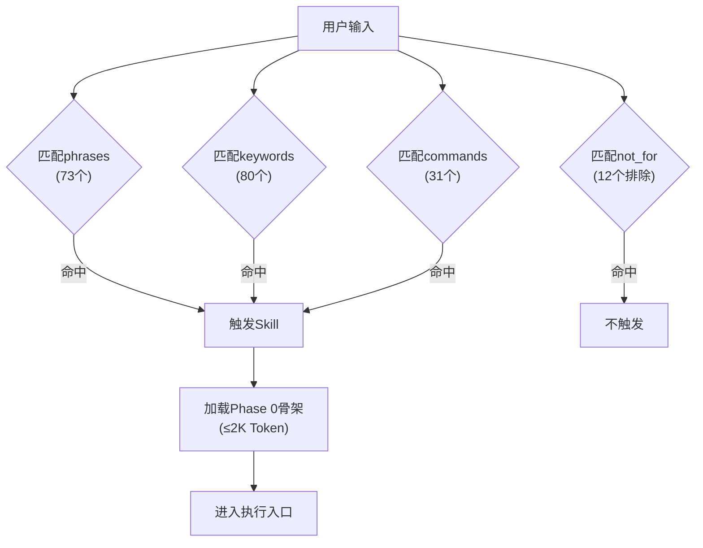
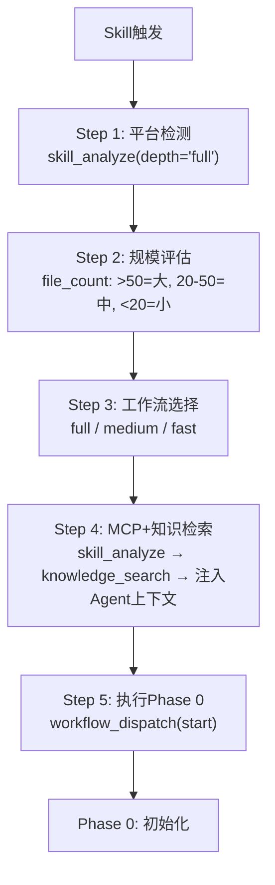
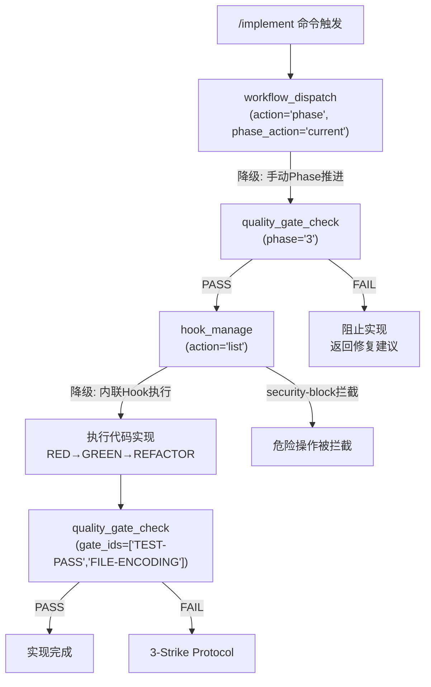
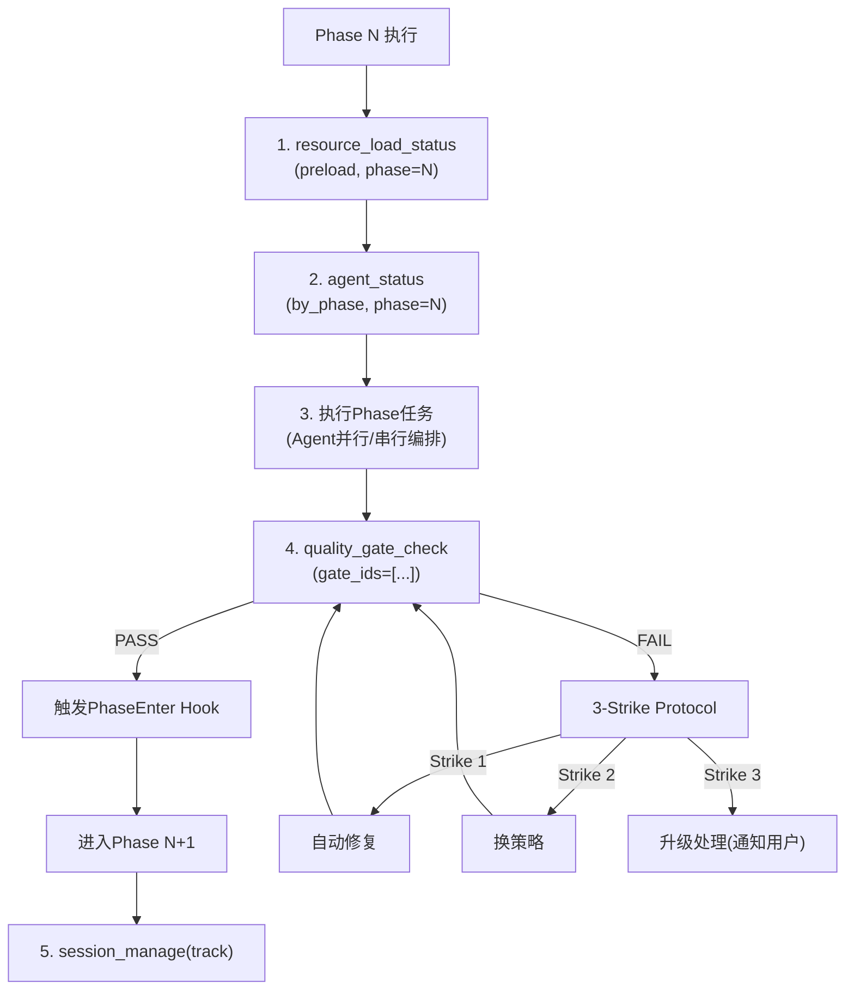
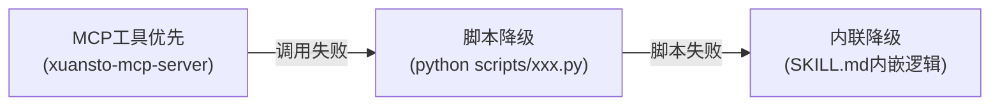
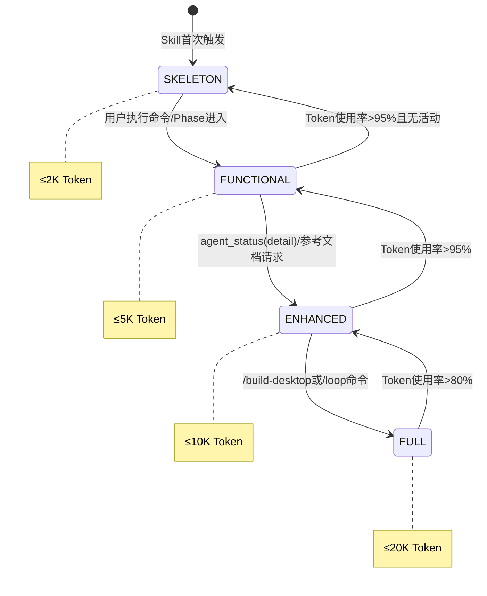
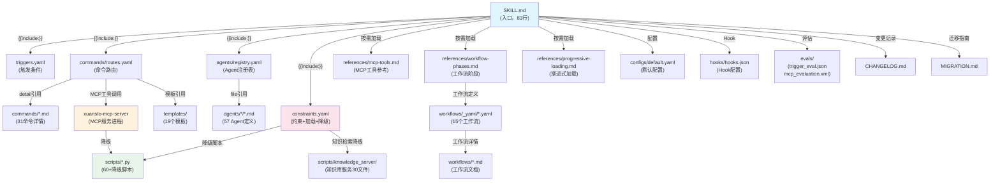
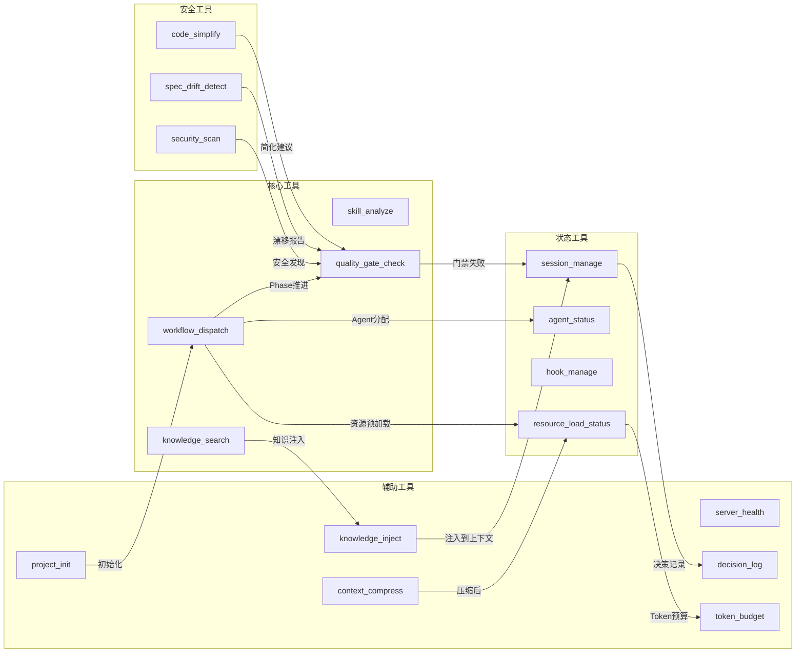
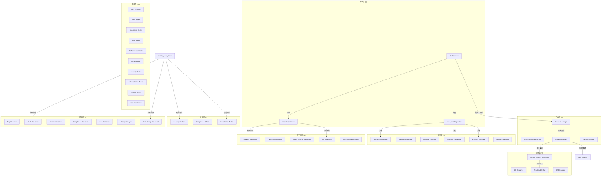

# Xuansto Skill v8.0.0 综合分析文档

> 版本: 2.0.0 | 日期: 2026-05-23 | 分析范围: xuansto-skill-v2 (v8.0.0) + xuansto-skill (v4.0.0 ARCHIVED)

---

## 目录

- [1. Skill定义文件全文解析](#1-skill定义文件全文解析)
  - [1.1 v8 SKILL.md 解析](#11-v8-skillmd-解析)
  - [1.2 v4 SKILL.md 解析（ARCHIVED）](#12-v4-skillmd-解析archived)
  - [1.3 v4 vs v8 对比表](#13-v4-vs-v8-对比表)
- [2. 功能逻辑分步拆解](#2-功能逻辑分步拆解)
  - [2.1 触发与入口](#21-触发与入口)
  - [2.2 命令路由与执行](#22-命令路由与执行)
  - [2.3 工作流Phase推进](#23-工作流phase推进)
  - [2.4 质量门禁检查](#24-质量门禁检查)
  - [2.5 MCP工具调用链](#25-mcp工具调用链)
  - [2.6 降级与容错](#26-降级与容错)
- [3. 交互模式](#3-交互模式)
  - [3.1 单轮交互](#31-单轮交互)
  - [3.2 多轮交互](#32-多轮交互)
  - [3.3 输入输出格式](#33-输入输出格式)
- [4. 特效逻辑分析](#4-特效逻辑分析)
  - [4.1 渐进式加载](#41-渐进式加载)
  - [4.2 MCP工具驱动](#42-mcp工具驱动)
  - [4.3 Hook系统](#43-hook系统)
  - [4.4 模型路由](#44-模型路由)
  - [4.5 与渐进式目标的差距](#45-与渐进式目标的差距)
- [5. 可复用模块清单 / 需废弃或重写部分](#5-可复用模块清单--需废弃或重写部分)
  - [5.1 可复用模块](#51-可复用模块)
  - [5.2 需废弃部分](#52-需废弃部分)
  - [5.3 需重写部分](#53-需重写部分)
- [6. 依赖图](#6-依赖图)
- [7. 问题清单](#7-问题清单)

---

## 1. Skill定义文件全文解析

### 1.1 v8 SKILL.md 解析

**文件路径**: `.trae/skills/xuansto-skill-v2/SKILL.md`
**版本**: 8.0.0 (MCP Edition) | **状态**: 活跃 | **行数**: 83行

#### 1.1.1 Frontmatter 元数据

| 字段 | 值 | 说明 |
|------|-----|------|
| name | xuansto-skill-v2 | Skill标识符 |
| version | 8.0.0 | 版本号 |
| agents_summary | "13 layers / 57 agents (via MCP v2)" | Agent规模，标注MCP驱动 |
| min_version | 1.0.0 | 最低平台版本 |
| license | MIT | 许可证 |
| author | skiller-team | 作者 |

#### 1.1.2 触发条件（外部化到 triggers.yaml）

v8将触发条件完全外部化到 `triggers.yaml`，SKILL.md的frontmatter中仅保留引用摘要，通过 `{{include:triggers.yaml}}` 延迟加载。

**triggers.yaml 完整内容**:

| 触发类型 | 数量 | 说明 |
|----------|------|------|
| phrases | 73个 | 中英文触发短语，如 "build this properly"、"帮我搭建项目" |
| keywords | 80个 | 关键词匹配，如 "xuansto"、"SDD"、"pentest" |
| commands | 31个 | 斜杠命令，从/init到/budget |
| not_for | 12个 | 排除场景，如 "simple single-file edits" |

**代码位置**: `.trae/skills/xuansto-skill-v2/triggers.yaml` L1-L202

#### 1.1.3 核心约束（5条，外部化到 constraints.yaml）

| ID | 规则 | 说明 |
|----|------|------|
| spec-first | Spec > Test > Code | 先规格再测试最后代码，覆盖率≥80% |
| karpathy | Think Before Coding \| Simplicity First \| Surgical Changes | Karpathy准则 |
| incremental | 分解→实现→测试→重复 | 3-Strike Protocol |
| script-standard | Python优先 \| UTF-8无BOM+无U+FFFD | 验证后删除临时脚本 |
| cross-platform | Web+Desktop(Electron/Tauri/Flutter) | 桌面端需IPC安全+代码签名 |

**代码位置**: `.trae/skills/xuansto-skill-v2/constraints.yaml` L3-L13

#### 1.1.4 执行入口（5步，MCP驱动）

```
Step 1: 平台检测 → 检查项目依赖和结构
Step 2: 规模评估 → 统计文件数判断规模
Step 3: 工作流选择 → full/medium/fast
Step 4: MCP+知识检索 → skill_analyze → knowledge_search → 注入Agent上下文
Step 5: 执行Phase 0 → 按Phase顺序推进
```

**代码位置**: `.trae/skills/xuansto-skill-v2/SKILL.md` L39-L45

#### 1.1.5 MCP依赖声明

- 最低兼容: xuansto-mcp-server >= 4.0.0
- API版本: 3.0.0
- MCP不可用时自动降级到 scripts/ 目录Python脚本

**代码位置**: `.trae/skills/xuansto-skill-v2/SKILL.md` L27-L29

#### 1.1.6 MCP工具摘要表（17个）

SKILL.md中内嵌了17个MCP工具的精简摘要表，包含工具名、功能、关键参数三列。完整参数和返回值在 `references/mcp-tools.md` 中按需加载。

**代码位置**: `.trae/skills/xuansto-skill-v2/SKILL.md` L48-L68

#### 1.1.7 外部参考文件表

SKILL.md通过 `{{include:}}` 指令引用4个外部配置文件，以及3个按需加载的参考文件：

| 引用方式 | 文件 | 内容 |
|----------|------|------|
| `{{include:}}` | triggers.yaml | 触发条件完整定义 |
| `{{include:}}` | constraints.yaml | 核心约束+Token预算+降级规则 |
| `{{include:}}` | commands/routes.yaml | 31命令路由表(含降级策略) |
| `{{include:}}` | agents/registry.yaml | 57 Agent注册表(13层) |
| 按需加载 | references/mcp-tools.md | 17个MCP工具完整参数与返回值 |
| 按需加载 | references/workflow-phases.md | 9阶段工作流详情 |
| 按需加载 | references/progressive-loading.md | 渐进式加载规范 |

**代码位置**: `.trae/skills/xuansto-skill-v2/SKILL.md` L69-L79

#### 1.1.8 关键规则

SKILL.md末尾列出关键规则摘要：
- 2-Action Research | 3-Strike Error | Chesterton's Fence | Loop Enforcement
- Confidence≥80 | 三级仲裁(L1技术→L2策略ADR→L3安全人工)
- UTF-8无BOM+LF | Python优先 | 业务注释中文
- Git:`<类型>(<范围>): <中文描述>` | 禁止Shell(.sh) | 五步闭环

**代码位置**: `.trae/skills/xuansto-skill-v2/SKILL.md` L82-L83

---

### 1.2 v4 SKILL.md 解析（ARCHIVED）

**文件路径**: `.trae/skills/xuansto-skill/SKILL.md`
**版本**: 5.0.0 (标记为ARCHIVED) | **状态**: 已废弃 | **迁移目标**: xuansto-skill-v2

#### 1.2.1 Frontmatter 元数据

| 字段 | 值 | 说明 |
|------|-----|------|
| name | xuansto-skill | Skill标识符 |
| version | 5.0.0 | 版本号 |
| deprecated | true | 已废弃标记 |
| migrate_to | xuansto-skill-v2 | 迁移目标 |
| agents_summary | "13 layers / 57 agents" | Agent规模 |

#### 1.2.2 触发条件（内嵌在SKILL.md中）

- **phrases**: 52个触发短语
- **keywords**: 57个关键词
- **commands**: 27个斜杠命令
- **not_for**: 12个排除场景

**特征**: v4将所有触发条件直接内嵌在SKILL.md的frontmatter中，导致SKILL.md体积膨胀至310+行。

#### 1.2.3 命令路由表（27命令，内嵌在SKILL.md中）

v4将完整的27命令路由表（含MCP工具调用链和降级策略）全部内嵌在SKILL.md中，每个命令包含详细步骤说明。

#### 1.2.4 Agent角色索引表（13层/57Agent，内嵌在SKILL.md中）

v4在SKILL.md中内嵌了完整的Agent层级索引表。

---

### 1.3 v4 vs v8 对比表

| 维度 | v4 (xuansto-skill) | v8 (xuansto-skill-v2) |
|------|---------------------|------------------------|
| **版本** | 5.0.0 | 8.0.0 |
| **状态** | ARCHIVED | 活跃 |
| **SKILL.md行数** | ~310行 | 83行 |
| **触发条件** | 内嵌frontmatter | 外部化 `triggers.yaml` |
| **命令路由** | 内嵌SKILL.md | 外部化 `commands/routes.yaml` |
| **Agent注册** | 内嵌SKILL.md | 外部化 `agents/registry.yaml` |
| **约束配置** | 内嵌SKILL.md | 外部化 `constraints.yaml` |
| **命令数** | 27 | 31（新增/sdd-tdd-medium, /sdd-tdd-fast, /decision, /budget） |
| **MCP工具数** | 13个 | 17个（含agent_manage, knowledge_inject, project_init, metrics_report） |
| **MCP依赖** | 无明确版本要求 | xuansto-mcp-server >= 4.0.0, API 3.0.0 |
| **降级策略** | 简单提及 | 完整三级降级链+脚本降级 |
| **渐进式加载** | 无 | 4阶段加载+状态机+披露规范 |
| **Hook系统** | 文字描述 | 3级profile(minimal/standard/strict)+15个Hook定义 |
| **Token预算** | 简单提及 | 完整配置(2K/5K/10K/20K四阶段) |
| **脚本目录** | 引用49个脚本 | 60+脚本（含knowledge_server/子目录30个文件） |
| **参考文件** | 72+引用 | 90+文件（含agent-details/57个Agent详细定义） |
| **工作流定义** | SKILL.md内描述 | 独立YAML+MD文件（workflows/目录15个） |
| **模板文件** | SKILL.md内引用 | 独立文件（templates/目录19个模板） |
| **评估配置** | evals/目录 | evals/目录（trigger_eval.json + mcp_evaluation.xml） |
| **CHANGELOG** | 有 | 有（v8.0.0完整变更记录） |
| **MIGRATION** | 无 | 有（v1→v2迁移指南） |

---

## 2. 功能逻辑分步拆解

### 2.1 触发与入口

#### 2.1.1 触发判定流程



**代码位置**:
- v8: `.trae/skills/xuansto-skill-v2/triggers.yaml` L1-L202
- v8约束: `.trae/skills/xuansto-skill-v2/constraints.yaml` L15-L20

#### 2.1.2 执行入口流程



**代码位置**:
- v8: `.trae/skills/xuansto-skill-v2/SKILL.md` L39-L45
- v8工作流详情: `.trae/skills/xuansto-skill-v2/references/workflow-phases.md` L74-L106

### 2.2 命令路由与执行

#### 2.2.1 路由匹配优先级

```
精确匹配 > 语义匹配 > 更具体命令优先 > 默认/sprint兜底
```

**代码位置**: `.trae/skills/xuansto-skill-v2/commands/routes.yaml` L1

#### 2.2.2 命令执行流程（以 /implement 为例）



**代码位置**: `.trae/skills/xuansto-skill-v2/commands/routes.yaml` L78-L87

#### 2.2.3 v8新增命令路由（v4中无独立路由）

| 命令 | 意图 | Phase | MCP工具 |
|------|------|-------|---------|
| /sdd-tdd-medium | 中等规模SDD+TDD开发 | 0 | skill_analyze, workflow_dispatch, resource_load_status |
| /sdd-tdd-fast | 快速SDD+TDD开发 | 1 | workflow_dispatch, resource_load_status |
| /decision | 决策记录 | null | decision_log |
| /budget | Token预算管理 | null | token_budget, resource_load_status |

**代码位置**: `.trae/skills/xuansto-skill-v2/commands/routes.yaml` L274-L308

#### 2.2.4 命令→Phase→MCP工具完整映射

| 意图 | 命令 | Phase | MCP工具链 | 降级策略 |
|------|------|-------|-----------|----------|
| 从零开始新项目 | /init | 0 | skill_analyze, knowledge_search, workflow_dispatch, project_init, decision_log | ChromaDB→SQLite FTS→关键词 |
| 头脑风暴 | /brainstorm | 1 | knowledge_search, workflow_dispatch | 知识检索→降级链 |
| 澄清需求 | /clarify | 1 | knowledge_search, workflow_dispatch, quality_gate_check | 知识检索→降级链；门禁→内嵌检查 |
| 规划架构 | /plan | 2 | skill_analyze, knowledge_search, agent_status, workflow_dispatch, decision_log, token_budget | 项目分析→基础扫描 |
| 写规格文档 | /spec | 2 | workflow_dispatch, quality_gate_check, spec_drift_detect | 门禁失败→修复建议 |
| 设计 | /design | 2 | quality_gate_check, knowledge_search, workflow_dispatch | 设计门禁→内嵌检查 |
| 设计系统 | /design-system | 2 | quality_gate_check, knowledge_search, workflow_dispatch | 知识检索→降级链 |
| 写代码 | /implement | 4 | workflow_dispatch, quality_gate_check, hook_manage | 门禁失败→阻止+修复建议 |
| 跑测试 | /test | 5 | quality_gate_check, workflow_dispatch | 测试门禁FAIL→返回失败文件 |
| 代码审查 | /review | 5 | quality_gate_check, security_scan, code_simplify | 安全扫描→内嵌降级 |
| 安全审计 | /audit | 5 | security_scan, quality_gate_check, spec_drift_detect | 安全扫描→内嵌agentic+dependency |
| 修复Bug | /fix | 4 | session_manage, quality_gate_check, hook_manage | 会话追踪→内存临时状态 |
| 验收确认 | /accept | 6 | quality_gate_check, workflow_dispatch | 门禁检查→增量缓存 |
| 代码简化 | /simplify | 7 | code_simplify, quality_gate_check, context_compress | 代码简化→内嵌simplify+dedup |
| 代码重构 | /refactor | 7 | code_simplify, quality_gate_check, context_compress | 门禁→内嵌检查；压缩→脚本降级 |
| 部署交付 | /deploy | 8 | quality_gate_check, server_health, workflow_dispatch | 健康检查→基础状态返回 |
| 构建项目 | /build | 8 | skill_analyze, quality_gate_check, server_health | 构建门禁→内嵌检查 |
| 桌面构建 | /build-desktop | 8 | quality_gate_check, skill_analyze, workflow_dispatch | 桌面门禁→文件存在性检查 |
| 桌面发布 | /release-desktop | 8 | quality_gate_check, workflow_dispatch | 桌面门禁→文件存在性检查 |
| 冲刺 | /sprint | 0 | workflow_dispatch, session_manage, resource_load_status, token_budget, project_init | 快速工作流→精简Phase |
| 知识学习 | /learn | — | knowledge_search, knowledge_inject, session_manage | ChromaDB→SQLite FTS→关键词 |
| 执行计划 | /execute-plan | — | workflow_dispatch, session_manage | 工作流启动→手动Phase推进 |
| 自主循环 | /loop | — | workflow_dispatch, session_manage, resource_load_status, token_budget, decision_log | 逐步降级: MCP完整→MCP简化→脚本 |
| 取消循环 | /cancel-loop | — | workflow_dispatch, session_manage | 工作流中止→状态持久化 |
| 查询Agent | /agent-status | — | agent_status | 静态注册表查询 |
| 查询进度 | /status | — | workflow_dispatch, session_manage, server_health | 工作流状态→持久化文件读取 |
| 回滚 | /rollback | — | session_manage, workflow_dispatch | 会话恢复→最近保存点 |
| 中等SDD+TDD | /sdd-tdd-medium | 0 | skill_analyze, workflow_dispatch, resource_load_status | 项目分析→基础扫描 |
| 快速SDD+TDD | /sdd-tdd-fast | 1 | workflow_dispatch, resource_load_status | 工作流→内联阶段推进 |
| 决策记录 | /decision | — | decision_log | 决策日志→内联JSON记录 |
| Token预算 | /budget | — | token_budget, resource_load_status | Token预算→内联估算 |

**代码位置**: `.trae/skills/xuansto-skill-v2/commands/routes.yaml` L1-L308

### 2.3 工作流Phase推进

#### 2.3.1 Phase转换流程



**代码位置**: `.trae/skills/xuansto-skill-v2/references/workflow-phases.md` L74-L380

#### 2.3.2 9阶段工作流详情

| Phase | 名称 | MCP工具 | 关键门禁 | Agent分配 |
|-------|------|---------|----------|-----------|
| 0 | 初始化 | skill_analyze, workflow_dispatch, agent_status, resource_load_status | DESIGN-SYSTEM-COMPLETE, ANTI-PATTERN-CHECK | Orchestrator, System Architect, Design System Generator, Knowledge Manager |
| 1 | 需求分析 | knowledge_search, resource_load_status | BRAINSTORM-COMPLETE, GATE-001~002 | Product Manager, Brainstorming Facilitator, Technical Writer, Knowledge Manager |
| 2 | 架构设计 | knowledge_search, resource_load_status | PLAN-ATOMIC, GATE-003~004 | System Architect, Product Manager, Data Modeler, Technical Writer |
| 3 | 测试先行 | — | TEST-FIRST | Test Architect, Unit Tester, Integration Tester, E2E Tester |
| 4 | 代码实现 | quality_gate_check, agent_status | GATE-007, TEST-PASS, FILE-ENCODING | Backend/Frontend/Fullstack/Database/Mobile Developer, Subagent Dispatcher |
| 5 | 测试验证 | security_scan, spec_drift_detect, agent_status | AI-PENTEST, SPEC-CONSISTENCY | Security Auditor, Penetration Tester, E2E/Performance Tester, QA Engineer |
| 6 | 验收确认 | quality_gate_check | GATE-013~014, UX-ACCEPTANCE | Product Manager, UX Designer, Compliance Officer, Quality Monitor |
| 7 | 持续重构 | code_simplify, context_compress | SIMPLIFICATION-BEHAVIOR, CHESTERTON-FENCE | Refactoring Specialist, Code Reviewer, Bug Scanner, History Analyzer |
| 8 | 部署交付 | — | DESKTOP-BUILD/SIGN/UPDATE/CROSS | Build-Release Engineer, CI/CD Specialist, Desktop Developer, IPC Specialist |

**代码位置**: `.trae/skills/xuansto-skill-v2/references/workflow-phases.md` L5-L380

#### 2.3.3 工作流选择矩阵

| 工作流名称 | 适用场景 | Phase覆盖 |
|-----------|---------|-----------|
| sdd-tdd-full | 大型项目/完整流程 | 0-8全部 |
| sdd-tdd-medium | 中等项目 | 合并部分阶段 |
| sdd-tdd-fast | 小型项目/快速迭代 | 精简阶段 |
| brainstorming-workflow | 需求探索 | Phase 1 |
| bug-fix | Bug修复 | Phase 4-5 |
| security-audit | 安全审计 | Phase 5 |
| desktop-build-workflow | 桌面构建 | Phase 8 |
| ui-ux-workflow | UI/UX设计 | Phase 2 |
| webapp-testing-workflow | Web测试 | Phase 5 |
| subagent-driven-workflow | 代码审查 | Phase 5 |
| autonomous_loop | 自主循环 | 全阶段 |
| acceptance | 验收 | Phase 6 |
| cross-platform-workflow | 跨平台 | Phase 8 |
| flutter-desktop-workflow | Flutter桌面 | Phase 8 |
| performance-test | 性能测试 | Phase 5 |

**代码位置**: `.trae/skills/xuansto-skill-v2/workflows/` 目录（15个YAML + 15个MD）

### 2.4 质量门禁检查

#### 2.4.1 门禁体系概览

共54项质量门禁，按Phase分布：

| Phase | 门禁数 | 关键门禁 |
|-------|--------|----------|
| 0 | 2+ | DESIGN-SYSTEM-COMPLETE, ANTI-PATTERN-CHECK |
| 1 | 3 | BRAINSTORM-COMPLETE, GATE-001, GATE-002 |
| 2 | 4 | PLAN-ATOMIC, GATE-003, GATE-004 |
| 3 | 1 | TEST-FIRST |
| 4 | 3+ | GATE-007, TEST-PASS, FILE-ENCODING |
| 5 | 4+ | AI-PENTEST, SPEC-CONSISTENCY, GATE-011, GATE-012 |
| 6 | 4 | GATE-013, GATE-014, UX-ACCEPTANCE, INFRA-HEALTH |
| 7 | 3 | SIMPLIFICATION-BEHAVIOR, CHESTERTON-FENCE, GATE-015 |
| 8 | 5 | DESKTOP-BUILD, DESKTOP-SIGN, DESKTOP-UPDATE, DESKTOP-CROSS, IPC-CONTRACT |

**代码位置**: `.trae/skills/xuansto-skill-v2/constraints.yaml` L55-L82

#### 2.4.2 门禁异常处理（3-Strike Protocol）

```
门禁检查结果
  ├─ PASS → 正常通过
  ├─ WARN → 警告，连续2次WARN自动升级为BLOCK
  └─ BLOCK → 阻塞
      → Strike 1: 自动修复
      → Strike 2: 换策略
      → Strike 3: 升级处理（通知用户）
```

**代码位置**: `.trae/skills/xuansto-skill-v2/constraints.yaml` L8-L9

### 2.5 MCP工具调用链

#### 2.5.1 17个MCP工具一览

| 工具名 | 功能 | 关键参数 | 降级脚本 |
|--------|------|----------|----------|
| skill_analyze | 项目结构分析 | skill_path, depth | scripts/skill-test.py --analyze |
| knowledge_search | 三层知识库检索 | action, query, top_k, search_type | scripts/knowledge-server.py --search |
| quality_gate_check | 54项质量门禁 | gate_ids, phase, project_path | scripts/skill-test.py --gate |
| spec_drift_detect | 规格偏差检测 | spec_dir, src_dir | scripts/spec-drift-detector.py |
| security_scan | OWASP+依赖扫描 | target, severity_threshold | scripts/agentic-security-scanner.py |
| code_simplify | 代码简化分析 | target, scope, include_dedup | scripts/code-simplifier.py |
| session_manage | 会话状态管理 | action, completed_tasks, decisions | scripts/init-session.py / session-catchup.py / session-persist.py |
| workflow_dispatch | 工作流调度 | action, workflow, project_path | scripts/project-initializer.py / 内联Phase推进 |
| agent_status | Agent状态查询 | action, phase, agent_name | 静态注册表 / scripts/skill-test.py --agents |
| hook_manage | Hook管理 | action, profile, hook_name | scripts/check-encoding.py / token-budget-guard.py / session-persist.py |
| resource_load_status | 渐进式加载状态 | action, phase, resource_ids | 内联状态检查 |
| context_compress | 上下文压缩 | content, strategy, target_tokens | scripts/context-compressor.py |
| server_health | 服务器健康检查 | — | scripts/health-checker.py |
| decision_log | 决策日志管理 | action, title, decision | 内联JSON记录 |
| token_budget | Token预算管理 | action, total_budget | scripts/token-budget-guard.py / 内联估算 |
| knowledge_inject | 知识注入到上下文 | action, content, scope | scripts/knowledge_server/main.py --inject |
| project_init | 项目初始化 | action, name, stack | scripts/project-initializer.py / 内联模板生成 |

**代码位置**: `.trae/skills/xuansto-skill-v2/references/mcp-tools.md` L1-L1313

#### 2.5.2 典型MCP调用链

**从零开始新项目 (/init)**:
```
skill_analyze(skill_path, depth="full")
  → knowledge_search(query="项目初始化最佳实践", action="retrieve")
  → workflow_dispatch(action="start", workflow="brainstorming-workflow")
  → project_init(action="create", name=..., stack=...)
  → decision_log(action="log", title="项目初始化决策", ...)
```

**代码审查 (/review)**:
```
quality_gate_check(gate_ids=["GATE-009", "MULTI-PERSPECTIVE-COVERAGE"])
  → security_scan(target=".", severity_threshold="medium")
  → code_simplify(target=".", scope="recent")
```

**安全审计 (/audit)**:
```
security_scan(target=".", severity_threshold="low", include_agentic=True)
  → quality_gate_check(gate_ids=["AI-PENTEST", "AGENTIC-SECURITY"])
  → spec_drift_detect(spec_dir=".trae/specs", src_dir=".")
```

### 2.6 降级与容错

#### 2.6.1 三级降级链



**MCP检测**: 尝试调用skill_analyze，失败则进入降级模式
**脚本降级**: 使用 `python scripts/xxx.py --format json` 调用
**结果格式**: 降级模式下结果包装为与MCP工具相同的JSON结构

**代码位置**: `.trae/skills/xuansto-skill-v2/constraints.yaml` L184-L204

#### 2.6.2 知识检索降级链

```
ChromaDB（向量+关键词混合）→ SQLite FTS5（全文搜索）→ 关键词匹配
```

**代码位置**: `.trae/skills/xuansto-skill-v2/constraints.yaml` L204

#### 2.6.3 渐进式加载降级

| 不可用功能 | 不可用阶段 | 降级行为 |
|-----------|-----------|----------|
| 命令执行 | Phase 0 | 仅展示命令列表，提示用户执行命令推进到Phase 1 |
| 工作流详情 | Phase 0 | 使用核心约束中的精简规则替代 |
| 完整命令路由 | Phase 0/1 | 使用精简路由表(无降级策略列) |
| 完整Agent注册表 | Phase 0/1 | Phase 0无Agent信息；Phase 1使用核心Agent索引(13个) |
| 知识检索 | Phase 0/1 | 跳过知识检索，使用内嵌模板和默认知识 |
| 参考文档 | Phase 0/1 | 使用SKILL.md内嵌摘要替代 |
| Hook系统 | Phase 0/1/2 | 使用minimal配置(security-block仅) |
| 模型路由 | Phase 0/1/2 | 默认使用standard路由 |

**代码位置**: `.trae/skills/xuansto-skill-v2/constraints.yaml` L158-L182

---

## 3. 交互模式

### 3.1 单轮交互

适用于查询类命令，一次输入一次输出：

| 命令 | 输入 | 输出 | MCP工具 |
|------|------|------|---------|
| /agent-status | 无或Agent名称 | Agent列表或详情 | agent_status |
| /status | 无 | 当前Phase+任务+决策 | workflow_dispatch, session_manage, server_health |
| /build | 无 | 构建门禁结果+健康检查 | skill_analyze, quality_gate_check, server_health |
| /budget | action参数 | Token预算状态 | token_budget, resource_load_status |
| /decision | action+title+decision | 决策记录 | decision_log |

**交互流程**:
```
用户: /agent-status
  → agent_status(action="list")
  → 返回57个Agent列表（名称/层级/状态/能力）
  → 结束
```

### 3.2 多轮交互

适用于开发类命令，需要多轮对话推进Phase：

| 命令 | 轮次 | 说明 |
|------|------|------|
| /init → /brainstorm | 3-5轮 | 需求探索→设计文档→用户确认 |
| /clarify | 2-3轮 | 需求澄清→完整性检查 |
| /plan | 2-4轮 | 架构设计→原子任务分解→门禁验证 |
| /implement | 多轮 | 逐个原子任务实现→测试→门禁 |
| /review | 2-3轮 | 多视角审查→安全扫描→简化建议 |
| /loop | 持续 | 自主循环直到完成或停滞 |

**交互流程（以/init为例）**:
```
Round 1: 用户: "帮我搭建一个React项目"
  → skill_analyze → 平台检测 → 规模评估
  → workflow_dispatch(start, brainstorming-workflow)
  → 输出: 项目分析报告 + 设计系统基线

Round 2: 用户确认设计方向
  → knowledge_search(retrieve) → 检索最佳实践
  → 输出: 技术选型建议 + 架构草案

Round 3: 用户确认架构
  → quality_gate_check(DESIGN-SYSTEM-COMPLETE, ANTI-PATTERN-CHECK)
  → project_init(create, ...)
  → 输出: 项目初始化结果 + 下一步建议
```

### 3.3 输入输出格式

#### 输入格式

| 类型 | 格式 | 示例 |
|------|------|------|
| 斜杠命令 | `/command [args]` | `/implement`, `/review` |
| 自然语言 | 中文/英文描述 | "帮我搭建项目", "build from scratch" |
| 混合模式 | 命令+描述 | `/plan 用户认证模块` |

#### 输出格式

MCP工具返回统一JSON结构：
```json
{
  "status": "success|error",
  "data": { ... },
  "metadata": {
    "tool": "工具名",
    "latency_ms": 123,
    "degraded": false
  }
}
```

降级模式下返回相同结构，`degraded` 字段为 `true`。

---

## 4. 特效逻辑分析

### 4.1 渐进式加载

#### 4.1.1 实现方式

v8通过 `constraints.yaml` 定义了4阶段渐进式加载，配合 `references/progressive-loading.md` 提供完整规范：

| 加载阶段 | 名称 | 触发条件 | 加载内容 | Token预算 |
|----------|------|----------|----------|-----------|
| Phase 0 | 骨架 | Skill触发时 | 核心元数据、命令列表(无详情)、MCP依赖声明、核心约束(5条) | ≤2K |
| Phase 1 | 功能 | 用户执行命令时 | 命令描述+MCP工具可用性+核心约束+核心Agent(编排+产品+工程层13个) | ≤5K |
| Phase 2 | 增强 | 需要参考文档时 | 完整命令路由(含降级)+完整Agent注册表(57个)+外部参考+MCP工具摘要+知识检索 | ≤10K |
| Phase 3 | 完整 | 深度分析时 | Hook系统+模型路由+关键规则+全部上述内容 | ≤20K |

**代码位置**:
- 加载阶段定义: `.trae/skills/xuansto-skill-v2/constraints.yaml` L15-L35
- 完整规范: `.trae/skills/xuansto-skill-v2/references/progressive-loading.md` L1-L313

#### 4.1.2 状态机设计



**代码位置**: `.trae/skills/xuansto-skill-v2/references/progressive-loading.md` L77-L112

#### 4.1.3 资源优先级

| 优先级 | 名称 | 资源 | 加载阶段 | Token紧张时处理 |
|--------|------|------|----------|-----------------|
| P0 | 必须 | SKILL.md核心约束、命令路由表、Agent索引表 | Phase 0 | 始终保留 |
| P1 | 重要 | 命令详细步骤、工作流Phase定义、MCP工具参数 | Phase 1 | Token>95%时释放 |
| P2 | 增强 | 参考文档、模板文件、知识库 | Phase 2 | Token>80%时释放 |
| P3 | 可选 | 示例文档、评估配置、披露资源 | Phase 3 | Token>60%时释放 |

**代码位置**: `.trae/skills/xuansto-skill-v2/constraints.yaml` L37-L53

#### 4.1.4 披露规则

当请求的功能在当前加载阶段不可用时：
1. 通过 `xuansto://loading/status` 披露当前可用功能范围
2. 提示用户可通过 `resource_load_status(preload)` 推进加载
3. 降级到可用功能范围内执行

**代码位置**: `.trae/skills/xuansto-skill-v2/constraints.yaml` L155-L157

#### 4.1.5 性能目标

| 指标 | 当前值 | 目标值 | 降低比例 |
|------|--------|--------|----------|
| Skill触发时Token | ~8,000 | ≤2,000 | 75% |
| 单命令执行Token | ~15,000 | ≤5,000 | 67% |
| 全流程Token(9 Phase) | ~84,000 | ≤30,000 | 64% |
| Agent调度Token(单次) | ~500/Agent | ≤150/Agent | 70% |

**代码位置**: `.trae/skills/xuansto-skill-v2/references/progressive-loading.md` L219-L234

### 4.2 MCP工具驱动

#### 4.2.1 实现方式

v8通过 `xuansto-mcp-server` 提供MCP工具，Skill本身不包含工具实现代码，仅定义调用接口和降级策略。

**MCP Server架构**:
```
xuansto-mcp-server (独立进程)
  ├─ 17个MCP工具实现
  ├─ knowledge_server/ (知识库服务子模块)
  │   ├─ hybrid_search.py (混合检索)
  │   ├─ vector_engine.py (向量引擎)
  │   ├─ embedding.py (嵌入生成)
  │   ├─ db_engine.py (数据库引擎)
  │   ├─ degradation.py (降级处理)
  │   └─ ... (30个文件)
  └─ API版本: 3.0.0
```

**代码位置**: `.trae/skills/xuansto-skill-v2/scripts/knowledge_server/`

#### 4.2.2 MCP工具完整参数Schema

17个MCP工具的完整参数、返回值JSON Schema、错误码定义均记录在 `references/mcp-tools.md` 中（1313行），按需加载。

**代码位置**: `.trae/skills/xuansto-skill-v2/references/mcp-tools.md` L1-L1313

### 4.3 Hook系统

#### 4.3.1 实现方式

v8通过 `hooks.json` 定义了3个配置级别（minimal/standard/strict），每个级别包含5种生命周期Hook：

| 生命周期 | 触发时机 | minimal | standard | strict |
|----------|----------|---------|----------|--------|
| PreToolUse | 工具调用前 | security-block | +token-budget-check | +dangerous-cmd-confirm |
| PostToolUse | 工具调用后 | — | auto-format, encoding-check | +console-log-detect, type-check |
| SessionStart | 会话开始 | — | load-context, kb-health-check | +platform-detect |
| Stop | 会话结束 | session-save | +git-status-check, experience-precipitate | +pattern-detect |
| PreCompact | 上下文压缩前 | — | save-state | +decision-log-persist |

**代码位置**: `.trae/skills/xuansto-skill-v2/hooks/hooks.json` L1-L139

#### 4.3.2 关键Hook详情

**security-block**（安全阻断）:
- 类型: PreToolUse
- 匹配: `tool == "Bash" && command matches "(rm -rf|git push --force|DROP TABLE|TRUNCATE|chmod 777)"`
- 动作: block

**token-budget-check**（Token预算检查）:
- 类型: PreToolUse
- 匹配: `tool == "Bash" || tool == "Write"`
- 动作: warn/block
- 阈值: warn=80%, block=95%

**auto-format**（自动格式化）:
- 类型: PostToolUse
- 匹配: `tool == "Edit" || tool == "Write"`
- 支持: .ts/.tsx/.js/.jsx/.py/.go/.rs

**代码位置**: `.trae/skills/xuansto-skill-v2/hooks/hooks.json` L27-L137

### 4.4 模型路由

#### 4.4.1 实现方式

v8通过 `agents/registry.yaml` 为每个Agent定义了模型路由级别：

| 级别 | 适用场景 | Agent数量 | Agent列表 |
|------|----------|-----------|-----------|
| fast | 搜索/简单编辑 | 8 | Data Seeder, Unit Tester, Bug Scanner, Comment Verifier, Doc Reviewer, Monitor Specialist, Token Optimizer, Quality Monitor, Progress Tracker, Decision Logger |
| standard | 多文件实现 | 34 | 大多数工程/测试/DevOps/产品/设计/文档Agent |
| deep | 架构设计/安全分析 | 10 | Orchestrator, System Architect, Design System Generator, Native Module Developer, IPC Specialist, AI Penetration Tester, Security Tester, Security Auditor, Penetration Tester, Test Architect |

**代码位置**: `.trae/skills/xuansto-skill-v2/agents/registry.yaml` L286-L289

### 4.5 与渐进式目标的差距

#### 4.5.1 已实现的渐进式特性

| 特性 | 实现状态 | 说明 |
|------|----------|------|
| 4阶段加载 | ✅ 已实现 | constraints.yaml定义了skeleton/functional/enhanced/full |
| 资源优先级 | ✅ 已实现 | P0-P3四级优先级 |
| 状态机 | ✅ 已实现 | LoadPhase枚举+转换规则+触发矩阵 |
| 披露规则 | ✅ 已实现 | on_unavailable定义了3步披露流程 |
| Token预算控制 | ✅ 已实现 | 每阶段Token预算(2K/5K/10K/20K) |
| 降级加载策略 | ✅ 已实现 | MCP→脚本→内联三级降级 |
| 低精度→高精度 | ✅ 已实现 | 参考文档摘要(~200)→完整(~2000-5000) |
| 资源释放顺序 | ✅ 已实现 | P3→P2→P1→P0 |
| LoadingProgress数据结构 | ✅ 已实现 | resource_uri, phase, progress, content_hash, ttl |
| resource_state.json | ✅ 已实现 | v3格式(含phase字段)，向后兼容v2 |

#### 4.5.2 未实现/存在差距的特性

| 特性 | 差距 | 问题编号 | 状态 |
|------|------|----------|------|
| 渐进式加载实际运行时 | 状态机定义完整但Trae平台侧未实现按Phase裁剪上下文 | SKILL-13 | 待实施 |
| SKILL.md Phase标记 | constraints.yaml定义了PHASE_0_START/END标记但SKILL.md未使用 | SKILL-14 | 待实施 |
| Agent合并策略执行 | default.yaml定义了9条合并规则但无运行时执行逻辑 | SKILL-11 | 待实施 |
| Hook降级完整性 | 降级模式仅能执行3个Hook，auto-format等无法降级 | SKILL-10 | 待实施 |
| 工作流YAML/MD同步 | 双格式存在不一致风险 | SKILL-12 | 待实施 |

---

## 5. 可复用模块清单 / 需废弃或重写部分

### 5.1 可复用模块

| 模块 | 来源 | 说明 | 复用方式 |
|------|------|------|----------|
| agents/registry.yaml | v8 | 57 Agent结构化注册表（含Phase/模型路由） | 直接复用，按需扩展 |
| commands/routes.yaml | v8 | 31命令路由表（含MCP工具链/降级/Phase映射） | 直接复用 |
| constraints.yaml | v8 | 核心约束+Token预算+降级规则+披露规则+渐进式加载 | 直接复用 |
| triggers.yaml | v8 | 触发条件外部化定义（73 phrases + 80 keywords） | 直接复用 |
| hooks/hooks.json | v8 | Hook系统3级配置（15个Hook定义） | 直接复用 |
| configs/default.yaml | v8 | 完整默认配置（编排器/门禁/通信/桌面/安全/知识/监控等） | 直接复用 |
| references/mcp-tools.md | v8 | 17个MCP工具参数与返回值（1313行） | 直接复用 |
| references/workflow-phases.md | v8 | 9阶段工作流详细步骤 | 直接复用 |
| references/progressive-loading.md | v8 | 渐进式加载完整规范 | 直接复用 |
| references/quality-gates.md | v8 | 54项质量门禁完整定义 | 直接复用 |
| references/agent-details/ | v8 | 57个Agent详细定义文件 | 直接复用 |
| scripts/knowledge_server/ | v8 | 知识库服务完整实现（30个文件） | 直接复用 |
| scripts/*.py | v8 | 60+降级脚本 | 直接复用，需验证降级调用链 |
| workflows/_yaml/*.yaml | v8 | 15个工作流YAML定义 | 直接复用 |
| templates/ | v8 | 19个模板文件（PRD/ADR/设计系统/测试计划等） | 直接复用 |
| evals/trigger_eval.json | v8 | 触发准确性评估（10 should_trigger + 10 should_not_trigger） | 直接复用 |
| evals/mcp_evaluation.xml | v8 | MCP工具评估（10个QA pair） | 直接复用 |
| CHANGELOG.md | v8 | 版本变更追踪 | 直接复用 |
| MIGRATION.md | v8 | v1→v2迁移指南 | 直接复用 |

### 5.2 需废弃部分

| 模块 | 来源 | 原因 |
|------|------|------|
| v4 SKILL.md内嵌触发条件 | v1 | 已外部化到triggers.yaml |
| v4 SKILL.md内嵌命令路由表 | v1 | 已外部化到routes.yaml |
| v4 SKILL.md内嵌Agent索引表 | v1 | 已外部化到registry.yaml |
| v4 SKILL.md内嵌命令详细步骤 | v1 | 已外部化到commands/*.md |
| v4 references/中与v8重复的文件 | v1 | v8已有更新版本 |
| v4 .knowledge/目录结构 | v1 | v8有独立的.knowledge/结构 |
| v4 memory/目录 | v1 | v8已精简 |
| knowledge_auto_retrieve工具 | v8 | 已废弃，由knowledge_search替代 |
| knowledge_progressive_search工具 | v8 | 已废弃，由knowledge_search的hybrid模式替代 |
| Shell脚本(.sh)支持 | v8 | 已移除，Python-only |

### 5.3 需重写部分

| 模块 | 来源 | 原因 | 重写方案 |
|------|------|------|----------|
| SKILL.md Phase标记 | v8 | constraints.yaml定义了PHASE_0_START/END标记但SKILL.md未使用 | 在SKILL.md中添加Phase标记注释，支持渐进式裁剪 |
| Agent合并执行逻辑 | v8 | default.yaml定义了9条合并规则但无运行时执行 | 在Orchestrator或MCP Server中实现合并执行逻辑 |
| Hook降级脚本 | v8 | 降级模式仅能执行3个Hook | 为auto-format/kb-health-check等Hook实现独立降级脚本 |
| 工作流YAML→MD生成 | v8 | 双格式存在同步风险 | 实现YAML→MD自动生成，YAML为单一来源 |
| mcp_evaluation.xml | v8 | 引用了已废弃的knowledge_auto_retrieve和knowledge_progressive_search | 更新评估用例以适配v8工具集 |

---

## 6. 依赖图

### 6.1 文件调用链（Mermaid）



### 6.2 MCP工具依赖关系图



### 6.3 命令→MCP工具→降级脚本映射

```mermaid
graph TD
    subgraph 命令层
        INIT["/init"]
        PLAN["/plan"]
        IMPL["/implement"]
        TEST["/test"]
        REVIEW["/review"]
        AUDIT["/audit"]
        LOOP["/loop"]
        SPRINT["/sprint"]
    end

    subgraph MCP工具层
        SA2[skill_analyze]
        KS2[knowledge_search]
        WD2[workflow_dispatch]
        QGC2[quality_gate_check]
        SS2[security_scan]
        CS2[code_simplify]
        SM2[session_manage]
        RLS2[resource_load_status]
        DL2[decision_log]
        TB2[token_budget]
        PI2[project_init]
        HM2[hook_manage]
        SDD2[spec_drift_detect]
        KI2[knowledge_inject]
    end

    subgraph 降级脚本层
        ST["skill-test.py"]
        KS_PY["knowledge-server.py"]
        PI_PY["project-initializer.py"]
        ASS["agentic-security-scanner.py"]
        CS_PY["code-simplifier.py"]
        SC_PY["session-catchup.py"]
        SP_PY["session-persist.py"]
        HC["health-checker.py"]
        SDD_PY["spec-drift-detector.py"]
        CC_PY["context-compressor.py"]
        TB_PY["token-budget-guard.py"]
    end

    INIT --> SA2 --> ST
    INIT --> KS2 --> KS_PY
    INIT --> WD2 --> PI_PY
    INIT --> PI2 --> PI_PY
    INIT --> DL2

    PLAN --> SA2
    PLAN --> KS2
    PLAN --> AS2[agent_status]
    PLAN --> WD2
    PLAN --> DL2
    PLAN --> TB2 --> TB_PY

    IMPL --> WD2
    IMPL --> QGC2 --> ST
    IMPL --> HM2

    TEST --> QGC2
    TEST --> WD2

    REVIEW --> QGC2
    REVIEW --> SS2 --> ASS
    REVIEW --> CS2 --> CS_PY

    AUDIT --> SS2
    AUDIT --> QGC2
    AUDIT --> SDD2 --> SDD_PY

    LOOP --> WD2
    LOOP --> SM2 --> SC_PY
    LOOP --> RLS2
    LOOP --> TB2
    LOOP --> DL2

    SPRINT --> WD2
    SPRINT --> SM2
    SPRINT --> RLS2
    SPRINT --> TB2
    SPRINT --> PI2
```



### 6.4 Agent层级依赖图



---

## 7. 问题清单

### SKILL-01: v8降级模式不可用 ✅ 已解决

- **严重级别**: P0 阻塞
- **当前状态**: 已实现subprocess_utils异步降级调用链
- **解决**: degradation.py已实现到scripts/目录下Python脚本的实际异步调用

### SKILL-02: v8参考文档严重不足 ✅ 已解决

- **严重级别**: P0 阻塞
- **当前状态**: v8 references/已扩展到90+文件
- **解决**: 从v4迁移关键参考文件到v8 references/，并通过MCP Resource提供

### SKILL-03: MCP Server版本与Skill版本不一致 ✅ 已解决

- **严重级别**: P1 高
- **当前状态**: MCP Server已升级，API版本3.0.0
- **解决**: 升级MCP Server

### SKILL-04: knowledge_search读写分离 ✅ 已解决

- **严重级别**: P1 高
- **当前状态**: knowledge_search改为retrieve only（只读），所有写入操作通过knowledge_inject
- **解决**: knowledge_search仅保留retrieve action，knowledge_inject处理inject/precipitate/delete

### SKILL-05: server_health工具未在mcp-tools.md中列出 ✅ 已解决

- **严重级别**: P1 高
- **当前状态**: 已在mcp-tools.md中补充server_health工具文档
- **解决**: 补充了server_health工具的参数和返回值文档

### SKILL-06: v8缺少评估配置文件 ✅ 已解决

- **严重级别**: P2 中
- **当前状态**: v8已有evals/目录（trigger_eval.json + mcp_evaluation.xml）
- **解决**: 创建了evals/目录，包含触发准确性评估和MCP工具评估

### SKILL-07: v8缺少CHANGELOG.md ✅ 已解决

- **严重级别**: P2 中
- **当前状态**: v8已有完整CHANGELOG.md
- **解决**: 创建了v8专用CHANGELOG.md，记录8.0.0版本变更

### SKILL-08: v4与v8存在大量重复文件 ✅ 已解决

- **严重级别**: P3 低
- **当前状态**: v4已标记为ARCHIVED，SKILL.md中包含迁移提示
- **解决**: v4 SKILL.md添加了ARCHIVED标记和migrate_to字段

### SKILL-09: v8 SKILL.md行数可能超过500行上限 ✅ 已解决

- **严重级别**: P3 低
- **当前状态**: SKILL.md精简至83行
- **解决**: 将详细内容外移到references/和外部YAML配置

### SKILL-10: Hook系统与MCP工具的集成不完整

- **严重级别**: P2 中
- **当前状态**: hooks.json定义了15个Hook，但降级时仅能执行3个Hook（encoding-check、token-budget-check、session-save）
- **影响**: 降级模式下auto-format、kb-health-check等Hook无法执行
- **修复方案**: 为每个Hook实现独立的降级脚本
- **代码位置**: `.trae/skills/xuansto-skill-v2/hooks/hooks.json`, `.trae/skills/xuansto-skill-v2/constraints.yaml` L179-L182

### SKILL-11: Agent合并策略仅在default.yaml中定义，未在运行时实际执行

- **严重级别**: P2 中
- **当前状态**: configs/default.yaml定义了9条Agent合并规则，但无代码实现合并逻辑
- **影响**: 小型项目无法自动减少Agent数量，Token浪费
- **修复方案**: 在Orchestrator或MCP Server中实现Agent合并执行逻辑
- **代码位置**: `.trae/skills/xuansto-skill-v2/configs/default.yaml` L21-L51

### SKILL-12: 工作流YAML与MD存在同步风险

- **严重级别**: P3 低
- **当前状态**: workflows/目录同时包含_yaml/*.yaml和*.md两种格式，内容可能不一致
- **影响**: 工作流定义存在两个来源，可能导致执行歧义
- **修复方案**: 确定单一来源（建议YAML为权威源），MD由YAML生成
- **代码位置**: `.trae/skills/xuansto-skill-v2/workflows/`

### SKILL-13: 渐进式加载状态机未在Trae平台侧实现

- **严重级别**: P2 中
- **当前状态**: constraints.yaml和progressive-loading.md定义了完整的4阶段加载状态机，但Trae平台侧未实现按Phase裁剪上下文
- **影响**: 所有资源在Skill触发时全量加载，Token消耗未优化
- **修复方案**: 在SKILL.md中添加Phase标记注释（PHASE_0_START/END），配合Trae平台实现渐进式裁剪
- **代码位置**: `.trae/skills/xuansto-skill-v2/constraints.yaml` L84-L99

### SKILL-14: SKILL.md未使用Phase标记

- **严重级别**: P3 低
- **当前状态**: constraints.yaml定义了PHASE_0_START/END等标记，但SKILL.md中未添加对应注释
- **影响**: 渐进式加载无法按Phase裁剪SKILL.md内容
- **修复方案**: 在SKILL.md中添加Phase标记注释
- **代码位置**: `.trae/skills/xuansto-skill-v2/constraints.yaml` L84-L99, `.trae/skills/xuansto-skill-v2/SKILL.md`

### SKILL-15: mcp_evaluation.xml引用已废弃工具

- **严重级别**: P3 低
- **当前状态**: evals/mcp_evaluation.xml中的QA pair 2/3/6/10引用了已废弃的knowledge_auto_retrieve和knowledge_progressive_search工具
- **影响**: MCP评估用例无法执行
- **修复方案**: 更新评估用例以适配v8工具集（knowledge_search替代）
- **代码位置**: `.trae/skills/xuansto-skill-v2/evals/mcp_evaluation.xml` L14-L127

---

## 附录: 问题统计摘要

| 严重级别 | 数量 | 问题编号 |
|----------|------|----------|
| P0 阻塞 | 2 | SKILL-01 ✅, SKILL-02 ✅ |
| P1 高 | 3 | SKILL-03 ✅, SKILL-04 ✅, SKILL-05 ✅ |
| P2 中 | 4 | SKILL-06 ✅, SKILL-07 ✅, SKILL-10, SKILL-11, SKILL-13 |
| P3 低 | 5 | SKILL-08 ✅, SKILL-09 ✅, SKILL-12, SKILL-14, SKILL-15 |
| **总计** | **15** | **9已解决，6待实施** |

---

## 附录: 文件统计

| 目录 | 文件数 | 说明 |
|------|--------|------|
| SKILL.md | 1 | 入口文件，83行 |
| constraints.yaml | 1 | 约束+加载+降级配置，209行 |
| triggers.yaml | 1 | 触发条件，202行 |
| agents/registry.yaml | 1 | Agent注册表，289行 |
| agents/*/*.md | 57 | Agent定义文件 |
| references/agent-details/ | 57 | Agent详细定义 |
| references/*.md | 90+ | 参考文档 |
| commands/routes.yaml | 1 | 命令路由表，308行 |
| commands/*.md | 31 | 命令详情文件 |
| hooks/hooks.json | 1 | Hook配置，139行 |
| configs/default.yaml | 1 | 默认配置，394行 |
| scripts/*.py | 30+ | 降级脚本 |
| scripts/knowledge_server/ | 30 | 知识库服务 |
| scripts/verification/ | 4 | 验证脚本 |
| scripts/workflow-tools/ | 5 | 工作流工具 |
| workflows/_yaml/ | 15 | 工作流YAML定义 |
| workflows/*.md | 15 | 工作流文档 |
| templates/ | 19 | 模板文件 |
| evals/ | 2 | 评估配置 |
| **总计** | **370+** | — |
