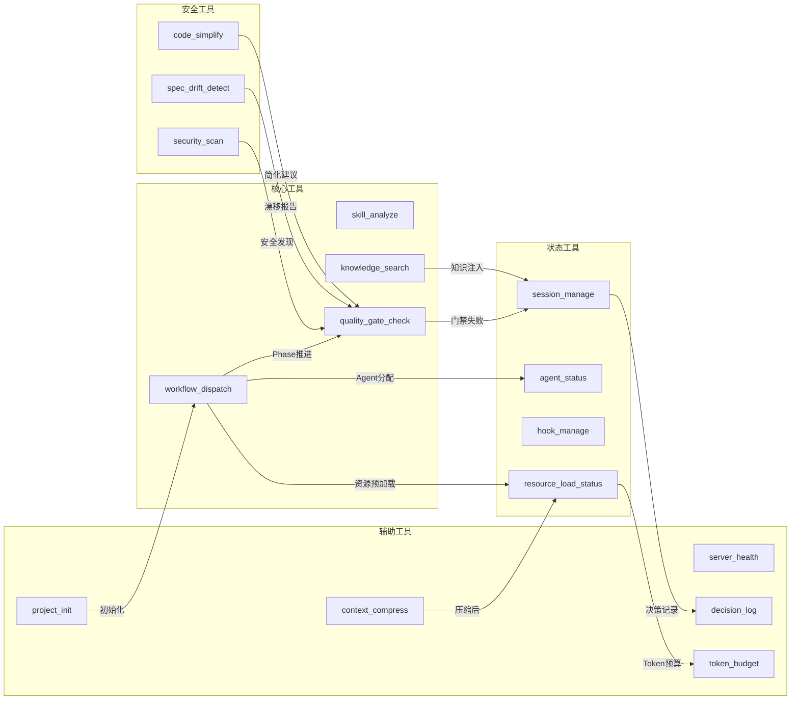

# Xuansto Skill 详细分析文档

> 版本: 1.0.0 | 日期: 2026-05-23 | 分析范围: xuansto-skill (v5) + xuansto-skill-v2 (v8)

---

## 目录

- [1. Skill定义文件全文解析](#1-skill定义文件全文解析)
  - [1.1 v5 SKILL.md 解析](#11-v5-skillmd-解析)
  - [1.2 v2 SKILL.md 解析](#12-v2-skillmd-解析)
  - [1.3 v5 vs v2 对比表](#13-v5-vs-v2-对比表)
- [2. 功能逻辑分步拆解](#2-功能逻辑分步拆解)
  - [2.1 触发与入口](#21-触发与入口)
  - [2.2 命令路由与执行](#22-命令路由与执行)
  - [2.3 工作流Phase推进](#23-工作流phase推进)
  - [2.4 质量门禁检查](#24-质量门禁检查)
  - [2.5 MCP工具调用链](#25-mcp工具调用链)
  - [2.6 降级与容错](#26-降级与容错)
- [3. 交互模式](#3-交互模式)
  - [3.1 单轮交互](#31-单轮交互)
  - [3.2 多轮交互](#32-多轮交互)
  - [3.3 输入输出格式](#33-输入输出格式)
- [4. 特效逻辑分析](#4-特效逻辑分析)
  - [4.1 渐进式加载](#41-渐进式加载)
  - [4.2 MCP工具驱动](#42-mcp工具驱动)
  - [4.3 Hook系统](#43-hook系统)
  - [4.4 模型路由](#44-模型路由)
  - [4.5 与渐进式目标的差距](#45-与渐进式目标的差距)
- [5. 可复用模块清单 / 需废弃或重写部分](#5-可复用模块清单--需废弃或重写部分)
  - [5.1 可复用模块](#51-可复用模块)
  - [5.2 需废弃部分](#52-需废弃部分)
  - [5.3 需重写部分](#53-需重写部分)
- [6. 依赖图](#6-依赖图)
- [7. 问题清单](#7-问题清单)

---

## 1. Skill定义文件全文解析

### 1.1 v5 SKILL.md 解析

**文件路径**: `.trae/skills/xuansto-skill/SKILL.md`
**版本**: 5.0.0 | **状态**: 已废弃(deprecated: true) | **迁移目标**: xuansto-skill-v2

#### 1.1.1 Frontmatter 元数据

| 字段 | 值 | 说明 |
|------|-----|------|
| name | xuansto-skill | Skill标识符 |
| version | 5.0.0 | 版本号 |
| deprecated | true | 已废弃标记 |
| migrate_to | xuansto-skill-v2 | 迁移目标 |
| agents_summary | "13 layers / 57 agents" | Agent规模 |
| min_version | 1.0.0 | 最低平台版本 |
| license | MIT | 许可证 |

#### 1.1.2 触发条件（内嵌在SKILL.md中）

- **phrases**: 52个触发短语（中英文混合），如 "build this properly"、"帮我搭建项目"
- **keywords**: 57个关键词，如 "xuansto"、"SDD"、"TDD"、"pentest"
- **commands**: 27个斜杠命令
- **not_for**: 12个排除场景

**特征**: v5将所有触发条件直接内嵌在SKILL.md的frontmatter中，导致SKILL.md体积膨胀。

#### 1.1.3 核心约束（5条）

1. Spec > Test > Code，覆盖率≥80%
2. Karpathy准则：Think Before Coding | Simplicity First | Surgical Changes
3. 增量约束：分解→实现→测试→重复；3-Strike Protocol
4. 脚本规范：Python优先 | UTF-8无BOM+无U+FFFD | 验证后删除临时脚本
5. 跨平台：Web+Desktop(Electron/Tauri/Flutter)

#### 1.1.4 执行入口（5步）

1. 平台检测 → 检查项目依赖和结构
2. 规模评估 → 统计文件数判断规模
3. 工作流选择 → full/medium/fast
4. 加载命令+知识检索 → 读取commands/对应.md → knowledge_search → 注入Agent上下文
5. 执行Phase 0 → 按Phase顺序推进

#### 1.1.5 工作流Phase概览（9阶段 + 跨阶段）

| Phase | 名称 | 关键门禁 |
|-------|------|----------|
| 0 | 初始化 | DESIGN-SYSTEM-COMPLETE, ANTI-PATTERN-CHECK |
| 1 | 需求分析 | BRAINSTORM-COMPLETE, GATE-001~002 |
| 2 | 架构设计 | PLAN-ATOMIC, GATE-003~004 |
| 3 | 测试先行 | TEST-FIRST |
| 4 | 代码实现 | GATE-007, TEST-PASS, FILE-ENCODING, GATE-009 |
| 5 | 测试验证 | AI-PENTEST, SPEC-CONSISTENCY, GATE-011~012 |
| 6 | 验收确认 | GATE-013~014, UX-ACCEPTANCE |
| 7 | 持续重构 | SIMPLIFICATION-BEHAVIOR, CHESTERTON-FENCE |
| 8 | 部署交付 | DESKTOP-BUILD/SIGN/UPDATE/CROSS, IPC-CONTRACT |

#### 1.1.6 命令路由表（27命令，内嵌在SKILL.md中）

v5将完整的27命令路由表（含MCP工具调用链和降级策略）全部内嵌在SKILL.md中，每个命令包含详细步骤说明，导致SKILL.md超过310行。

#### 1.1.7 Agent角色索引表（13层/57Agent，内嵌在SKILL.md中）

v5在SKILL.md中内嵌了完整的Agent层级索引表，按13个层级列出57个Agent。

#### 1.1.8 外部引用

v5引用了大量外部参考文件（72+个），包括：
- 门禁恢复详情: `references/gate-recovery-details.md`
- 知识工作流: `references/knowledge-workflow-details.md`
- Token降级: `references/token-degradation-details.md`
- 会话持久化: `references/session-persistence.md`
- Hook系统: `references/hook-system.md`
- 模型路由: `references/model-routing.md`
- 并行化策略: `references/parallelization-strategy.md`
- 评估框架: `references/evaluation-framework.md`
- MCP集成: `references/mcp-integration-strategy.md`

---

### 1.2 v2 SKILL.md 解析

**文件路径**: `.trae/skills/xuansto-skill-v2/SKILL.md`
**版本**: 8.0.0 (MCP Edition) | **状态**: 活跃

#### 1.2.1 Frontmatter 元数据

| 字段 | 值 | 说明 |
|------|-----|------|
| name | xuansto-skill-v2 | Skill标识符 |
| version | 8.0.0 | 版本号 |
| agents_summary | "13 layers / 57 agents (via MCP v2)" | Agent规模，标注MCP驱动 |
| min_version | 1.0.0 | 最低平台版本 |
| license | MIT | 许可证 |

#### 1.2.2 触发条件（外部化到 triggers.yaml）

v2将触发条件完全外部化到 `triggers.yaml`，SKILL.md仅通过 `{{include:triggers.yaml}}` 引用。

**triggers.yaml 内容**:
- **phrases**: 52个（与v5相同）
- **keywords**: 57个（与v5相同）
- **commands**: 27个（与v5相同）
- **not_for**: 12个（与v5相同）

#### 1.2.3 外部参考（按需加载）

v2采用 `{{include:}}` 指令延迟加载外部文件：

| 引用文件 | 内容 |
|----------|------|
| `{{include:triggers.yaml}}` | 触发条件完整定义 |
| `{{include:commands/routes.yaml}}` | 27命令路由表 |
| `{{include:agents/registry.yaml}}` | 57 Agent注册表 |
| `{{include:constraints.yaml}}` | 核心约束+Token预算+降级规则 |
| `references/mcp-tools.md` | 17个MCP工具参数与返回值 |
| `references/workflow-phases.md` | 9阶段工作流详情 |
| `references/quality-gates.md` | 54项质量门禁定义 |

#### 1.2.4 核心约束（5条，与v5一致）

v2核心约束与v5完全相同，但通过 `constraints.yaml` 外部化提供了更详细的配置参数。

#### 1.2.5 MCP依赖

- 最低兼容: xuansto-mcp-server >= 4.0.0
- API版本: 2.0.0
- MCP不可用时自动降级到 scripts/ 目录Python脚本

#### 1.2.6 执行入口（5步，与v5逻辑相同但MCP驱动）

1. 平台检测 → 检查项目依赖和结构
2. 规模评估 → 统计文件数判断规模
3. 工作流选择 → full/medium/fast
4. **MCP+知识检索** → skill_analyze → knowledge_search → 注入Agent上下文
5. 执行Phase 0 → 按Phase顺序推进

**关键差异**: v2步骤4明确使用MCP工具（skill_analyze、knowledge_search），而非v5的"读取commands/对应.md"。

#### 1.2.7 工作流Phase概览（9阶段，增加MCP工具列）

v2的Phase概览表增加了"MCP工具"列，明确标注每个Phase使用的MCP工具：

| Phase | 名称 | MCP工具 | 关键门禁 |
|-------|------|---------|----------|
| 0 | 初始化 | skill_analyze, workflow_dispatch, agent_status, resource_load_status | DESIGN-SYSTEM-COMPLETE, ANTI-PATTERN-CHECK |
| 1 | 需求分析 | knowledge_search, resource_load_status | BRAINSTORM-COMPLETE, GATE-001~002 |
| 2 | 架构设计 | knowledge_search, resource_load_status | PLAN-ATOMIC, GATE-003~004 |
| 3 | 测试先行 | — | TEST-FIRST |
| 4 | 代码实现 | quality_gate_check, agent_status | GATE-007, TEST-PASS, FILE-ENCODING |
| 5 | 测试验证 | security_scan, spec_drift_detect, agent_status | AI-PENTEST, SPEC-CONSISTENCY |
| 6 | 验收确认 | quality_gate_check | GATE-013~014, UX-ACCEPTANCE |
| 7 | 持续重构 | code_simplify, context_compress | SIMPLIFICATION-BEHAVIOR, GATE-015 |
| 8 | 部署交付 | — | DESKTOP-BUILD/SIGN/UPDATE/CROSS |

---

### 1.3 v5 vs v2 对比表

| 维度 | v5 (xuansto-skill) | v2 (xuansto-skill-v2) |
|------|---------------------|------------------------|
| **版本** | 5.0.0 | 8.0.0 |
| **状态** | 已废弃 | 活跃 |
| **SKILL.md行数** | ~310行 | ~71行 |
| **触发条件** | 内嵌frontmatter | 外部化 `triggers.yaml` |
| **命令路由** | 内嵌SKILL.md | 外部化 `commands/routes.yaml` |
| **Agent注册** | 内嵌SKILL.md | 外部化 `agents/registry.yaml` |
| **约束配置** | 内嵌SKILL.md | 外部化 `constraints.yaml` |
| **MCP工具数** | 13个（SKILL.md中声明16个） | 17个（含decision_log, token_budget, project_init） |
| **MCP依赖** | 无明确版本要求 | xuansto-mcp-server >= 4.0.0 |
| **降级策略** | 简单提及 | 完整三级降级链（constraints.yaml） |
| **渐进式加载** | 无 | 4阶段加载（skeleton/functional/enhanced/full） |
| **Hook系统** | 文字描述 | 完整JSON配置（hooks.json，3个profile） |
| **Token预算** | 简单提及 | 完整配置（.skill-config.yaml + constraints.yaml） |
| **脚本目录** | 引用49个脚本 | 实际包含60+脚本（含knowledge_server/子目录） |
| **参考文件** | 72+引用 | 6个核心引用（按需加载） |
| **工作流定义** | SKILL.md内描述 | 独立YAML+MD文件（workflows/目录） |
| **模板文件** | SKILL.md内引用 | 独立文件（templates/目录，19个模板） |
| **问题清单** | 27个问题（全部已修复） | 9个问题（全部未修复） |

---

## 2. 功能逻辑分步拆解

### 2.1 触发与入口

#### 2.1.1 触发判定流程

```
用户输入 → Trae平台匹配Skill
  ├─ 匹配phrases（52个短语）→ 触发
  ├─ 匹配keywords（57个关键词）→ 触发
  ├─ 匹配commands（27个斜杠命令）→ 触发
  └─ 匹配not_for（12个排除场景）→ 不触发
```

**代码位置**:
- v5: `.trae/skills/xuansto-skill/SKILL.md` L11-L15（frontmatter triggers）
- v2: `.trae/skills/xuansto-skill-v2/triggers.yaml` L1-L163

#### 2.1.2 执行入口流程

```
Step 1: 平台检测
  ├─ v5: 分析package.json/pubspec.yaml/Cargo.toml → 判断Web/Desktop/Flutter
  └─ v2: 调用skill_analyze(depth="full") → MCP返回平台类型

Step 2: 规模评估
  ├─ v5: 统计项目文件数 → >50=大, 20-50=中, <20=小
  └─ v2: 调用skill_analyze → MCP返回structure.file_count

Step 3: 工作流选择
  ├─ 大项目/安全关键/用户指定 → full（9阶段，全部门禁）
  ├─ 中等项目/中等复杂度 → medium（合并阶段，核心门禁）
  └─ 小项目/快速迭代 → fast（最少阶段，仅核心门禁）
  优先级: 用户显式指定 > 项目特征自动判断 > 默认medium

Step 4: 知识检索
  ├─ v5: 读取commands/对应.md → 解析任务类型+技术栈 → knowledge_search → 注入Agent上下文(token≤2048)
  └─ v2: skill_analyze → knowledge_search(retrieve) → 注入Agent上下文 → 完成后沉淀经验

Step 5: 执行Phase 0
  └─ 调用workflow_dispatch(start) → 启动工作流实例
```

**代码位置**:
- v5: `.trae/skills/xuansto-skill/SKILL.md` L40-L44
- v2: `.trae/skills/xuansto-skill-v2/SKILL.md` L46-L52
- v2工作流详情: `.trae/skills/xuansto-skill-v2/references/workflow-phases.md` L5-L36

### 2.2 命令路由与执行

#### 2.2.1 路由匹配优先级

```
精确匹配 > 语义匹配 > 更具体命令优先 > 默认/sprint兜底
```

**代码位置**:
- v5: `.trae/skills/xuansto-skill/SKILL.md` L97
- v2: `.trae/skills/xuansto-skill-v2/commands/routes.yaml` L1

#### 2.2.2 命令执行流程（以 /implement 为例）

```
/implement 命令触发
  │
  ├─ Step 1: workflow_dispatch(action="phase", phase_action="current")
  │   → 查询当前Phase状态
  │   → 降级: 手动Phase推进
  │
  ├─ Step 2: quality_gate_check(phase="3")
  │   → 检查测试先行门禁（TEST-FIRST）
  │   → 降级: 内嵌检查
  │   → 失败: 阻止实现，返回修复建议
  │
  ├─ Step 3: hook_manage(action="list")
  │   → 获取当前Hook配置
  │   → 降级: 内联Hook执行
  │   → 拦截: security-block检查
  │
  └─ Step 4: knowledge_search(query="实现模式", action="retrieve")
      → 检索实现参考
      → 降级: ChromaDB→SQLite FTS→关键词
```

**代码位置**:
- v5: `.trae/skills/xuansto-skill/SKILL.md` L137-L143
- v2: `.trae/skills/xuansto-skill-v2/commands/routes.yaml` L78-L87
- v2命令详情: `.trae/skills/xuansto-skill-v2/commands/implement.md`

#### 2.2.3 v2新增命令路由（v5中无独立路由）

| 命令 | 意图 | Phase | MCP工具 |
|------|------|-------|---------|
| /sdd-tdd-medium | 中等规模SDD+TDD开发 | 0 | skill_analyze, workflow_dispatch, resource_load_status |
| /sdd-tdd-fast | 快速SDD+TDD开发 | 1 | workflow_dispatch, resource_load_status |
| /decision | 决策记录 | null | decision_log |
| /budget | Token预算管理 | null | token_budget, resource_load_status |

**代码位置**: `.trae/skills/xuansto-skill-v2/commands/routes.yaml` L274-L308

### 2.3 工作流Phase推进

#### 2.3.1 Phase转换流程

```
Phase N 执行
  ├─ 1. 调用resource_load_status(preload, phase=N) → 预加载资源
  ├─ 2. 调用agent_status(by_phase, phase=N) → 查询可用Agent
  ├─ 3. 执行Phase任务（Agent并行/串行编排）
  ├─ 4. 调用quality_gate_check(gate_ids=[...]) → 验证门禁
  │   ├─ PASS → 触发PhaseEnter Hook → 进入Phase N+1
  │   ├─ FAIL → 3-Strike Protocol
  │   │   ├─ Strike 1: 自动修复
  │   │   ├─ Strike 2: 换策略
  │   │   └─ Strike 3: 升级处理（通知用户）
  │   └─ PASS_WITH_NOTE → 记录到gate-exceptions.jsonl
  └─ 5. 调用session_manage(track) → 追踪进度
```

**代码位置**:
- v2工作流详情: `.trae/skills/xuansto-skill-v2/references/workflow-phases.md`
- v2工作流YAML: `.trae/skills/xuansto-skill-v2/workflows/_yaml/` (15个YAML文件)

#### 2.3.2 工作流选择矩阵

| 工作流名称 | 适用场景 | Phase覆盖 |
|-----------|---------|-----------|
| sdd-tdd-full | 大型项目/完整流程 | 0-8全部 |
| sdd-tdd-medium | 中等项目 | 合并部分阶段 |
| sdd-tdd-fast | 小型项目/快速迭代 | 精简阶段 |
| brainstorming-workflow | 需求探索 | Phase 1 |
| bug-fix | Bug修复 | Phase 4-5 |
| security-audit | 安全审计 | Phase 5 |
| desktop-build-workflow | 桌面构建 | Phase 8 |
| ui-ux-workflow | UI/UX设计 | Phase 2 |
| webapp-testing-workflow | Web测试 | Phase 5 |
| subagent-driven-workflow | 代码审查 | Phase 5 |
| autonomous_loop | 自主循环 | 全阶段 |
| acceptance | 验收 | Phase 6 |
| cross-platform-workflow | 跨平台 | Phase 8 |
| flutter-desktop-workflow | Flutter桌面 | Phase 8 |
| performance-test | 性能测试 | Phase 5 |

**代码位置**: `.trae/skills/xuansto-skill-v2/workflows/` 目录

### 2.4 质量门禁检查

#### 2.4.1 门禁体系概览

共54项质量门禁，按Phase分布：

| Phase | 门禁数 | 关键门禁 |
|-------|--------|----------|
| 0 | 6 | DESIGN-SYSTEM-COMPLETE, ANTI-PATTERN-CHECK, DESIGN-REVIEW-PRODUCT/TECH/DESIGN, DESIGN-TOKENS |
| 1 | 3 | GATE-001, GATE-002, BRAINSTORM-COMPLETE |
| 2 | 4 | GATE-003, GATE-004, PLAN-ATOMIC, SPEC-ATOMIC |
| 3 | 1 | TEST-FIRST |
| 4 | 11 | GATE-007, TEST-PASS, GATE-009, MULTI-PERSPECTIVE-COVERAGE, TDD-RED/GREEN/REFACTOR, EXECUTION-VERIFY, SCRIPT-SECURITY, SCRIPT-CLEANUP, TOKEN-BUDGET |
| 5 | 10 | GATE-011, GATE-012, SPEC-CONSISTENCY, AGENTIC-SECURITY, AI-PENTEST, VISUAL-REGRESSION, RENDER-CHECK, ACCESSIBILITY, PERFORMANCE, SECURITY-FIX-CLOSED |
| 6 | 4 | GATE-013, GATE-014, UX-ACCEPTANCE, DOD-CHECK |
| 7 | 4 | GATE-015, DOC-COMPLETENESS, SIMPLIFICATION-BEHAVIOR, CHESTERTON-FENCE |
| 8 | 5 | DESKTOP-BUILD, DESKTOP-SIGN, DESKTOP-UPDATE, DESKTOP-CROSS, IPC-CONTRACT |
| 跨阶段 | 6 | ITERATION-BUDGET, SESSION-RECOVERY, BUILD-SUCCESS, ROLLBACK-SAFETY, INIT-COMPLETE, STATUS-HEALTHY |

**代码位置**: `.trae/skills/xuansto-skill-v2/references/quality-gates.md`

#### 2.4.2 门禁异常处理

```
门禁检查结果
  ├─ PASS → 正常通过
  ├─ PASS_WITH_NOTE → 通过但存在注意事项
  │   → 记录到 .skill-logs/gate-exceptions.jsonl
  │   → 连续3次PASS_WITH_NOTE → 触发人工审查断点
  ├─ WARN → 警告
  │   → 连续2次WARN → 自动升级为BLOCK
  └─ BLOCK → 阻塞
      → 3-Strike Protocol: 自动修复→换策略→升级处理
      → 降级不可逆：必须通过人工审查确认
```

**容差规则**:
- 数值型指标: ±0.5%容差
- 布尔型指标: 无容差
- 比率型指标: 2%容差
- 安全类门禁: 无容差

**代码位置**: `.trae/skills/xuansto-skill-v2/references/quality-gates.md` L1031-L1053

### 2.5 MCP工具调用链

#### 2.5.1 17个MCP工具一览

| 工具名 | 功能 | 降级脚本 |
|--------|------|----------|
| skill_analyze | 项目结构分析 | scripts/skill-test.py --analyze |
| knowledge_search | 知识检索（retrieve/inject/precipitate） | scripts/knowledge-server.py --search |
| quality_gate_check | 54项质量门禁检查 | scripts/skill-test.py --gate |
| spec_drift_detect | 规格漂移检测 | scripts/spec-drift-detector.py |
| security_scan | OWASP+依赖漏洞扫描 | scripts/agentic-security-scanner.py |
| code_simplify | 代码简化分析 | scripts/code-simplifier.py |
| session_manage | 会话状态管理 | scripts/init-session.py / session-catchup.py / session-persist.py |
| workflow_dispatch | 工作流调度 | scripts/project-initializer.py / 内联Phase推进 |
| agent_status | Agent状态查询 | 静态注册表 / scripts/skill-test.py --agents |
| hook_manage | Hook管理 | scripts/check-encoding.py / token-budget-guard.py / session-persist.py |
| resource_load_status | 渐进式加载状态 | 内联状态检查 |
| context_compress | 上下文压缩 | scripts/context-compressor.py |
| server_health | 服务器健康检查 | scripts/health-checker.py |
| decision_log | 决策日志管理 | 内联JSON记录 |
| token_budget | Token预算管理 | scripts/token-budget-guard.py / 内联估算 |
| project_init | 项目初始化 | scripts/project-initializer.py / 内联模板生成 |

**代码位置**: `.trae/skills/xuansto-skill-v2/references/mcp-tools.md`

#### 2.5.2 典型MCP调用链

**从零开始新项目 (/init)**:
```
skill_analyze(skill_path, depth="full")
  → knowledge_search(query="项目初始化最佳实践", action="retrieve")
  → workflow_dispatch(action="start", workflow="brainstorming-workflow")
  → project_init(action="create", name=..., stack=...)
  → decision_log(action="log", title="项目初始化决策", ...)
```

**代码审查 (/review)**:
```
quality_gate_check(gate_ids=["GATE-009", "MULTI-PERSPECTIVE-COVERAGE"])
  → security_scan(target=".", severity_threshold="medium")
  → code_simplify(target=".", scope="recent")
```

**安全审计 (/audit)**:
```
security_scan(target=".", severity_threshold="low", include_agentic=True)
  → quality_gate_check(gate_ids=["AI-PENTEST", "AGENTIC-SECURITY"])
  → spec_drift_detect(spec_dir=".trae/specs", src_dir=".")
```

### 2.6 降级与容错

#### 2.6.1 三级降级链

```
MCP工具优先 → REST API降级 → 文件系统兜底
```

**MCP检测**: 尝试调用skill_analyze，失败则进入降级模式

**脚本降级**: 使用 `python scripts/xxx.py --format json` 调用

**结果格式**: 降级模式下结果包装为与MCP工具相同的JSON结构

**代码位置**: `.trae/skills/xuansto-skill-v2/constraints.yaml` L107-L125

#### 2.6.2 知识检索降级链

```
ChromaDB（向量+关键词混合）→ SQLite FTS5（全文搜索）→ 关键词匹配
```

**代码位置**: `.trae/skills/xuansto-skill-v2/constraints.yaml` L126

#### 2.6.3 Token降级策略

| 级别 | 触发条件 | 动作 |
|------|----------|------|
| L1 | Token使用率≥80% | 减少并行Agent数至5，MCP工具降级 |
| L2 | Token使用率≥95% | 精简模式，仅保留核心层Agent（≤15个） |
| L3 | Token使用率=100% | 最小串行模式，仅3个Agent |

**恢复**: Token使用率降至60%时逐步恢复

**代码位置**: `.trae/skills/xuansto-skill-v2/.skill-config.yaml` L69-L83

---

## 3. 交互模式

### 3.1 单轮交互

适用于查询类命令，一次输入一次输出：

| 命令 | 输入 | 输出 |
|------|------|------|
| /agent-status | 无或Agent名称 | Agent列表或详情 |
| /status | 无 | 当前Phase+任务+决策 |
| /build | 无 | 构建门禁结果+健康检查 |
| /budget | action参数 | Token预算状态 |

**交互流程**:
```
用户: /agent-status
  → agent_status(action="list")
  → 返回57个Agent列表（名称/层级/状态/能力）
  → 结束
```

### 3.2 多轮交互

适用于开发类命令，需要多轮对话推进Phase：

| 命令 | 轮次 | 说明 |
|------|------|------|
| /init → /brainstorm | 3-5轮 | 需求探索→设计文档→用户确认 |
| /clarify | 2-3轮 | 需求澄清→完整性检查 |
| /plan | 2-4轮 | 架构设计→原子任务分解→门禁验证 |
| /implement | 多轮 | 逐个原子任务实现→测试→门禁 |
| /review | 2-3轮 | 多视角审查→安全扫描→简化建议 |
| /loop | 持续 | 自主循环直到完成或停滞 |

**交互流程（以/init为例）**:
```
Round 1: 用户: "帮我搭建一个React项目"
  → skill_analyze → 平台检测 → 规模评估
  → workflow_dispatch(start, brainstorming-workflow)
  → 输出: 项目分析报告 + 设计系统基线

Round 2: 用户确认设计方向
  → knowledge_search(retrieve) → 检索最佳实践
  → 输出: 技术选型建议 + 架构草案

Round 3: 用户确认架构
  → quality_gate_check(DESIGN-SYSTEM-COMPLETE, ANTI-PATTERN-CHECK)
  → project_init(create, ...)
  → 输出: 项目初始化结果 + 下一步建议
```

### 3.3 输入输出格式

#### 输入格式

| 类型 | 格式 | 示例 |
|------|------|------|
| 斜杠命令 | `/command [args]` | `/implement`, `/review` |
| 自然语言 | 中文/英文描述 | "帮我搭建项目", "build from scratch" |
| 混合模式 | 命令+描述 | `/plan 用户认证模块` |

#### 输出格式

MCP工具返回统一JSON结构：
```json
{
  "status": "success|error",
  "data": { ... },
  "metadata": {
    "tool": "工具名",
    "latency_ms": 123,
    "degraded": false
  }
}
```

降级模式下返回相同结构，`degraded` 字段为 `true`。

---

## 4. 特效逻辑分析

### 4.1 渐进式加载

#### 4.1.1 实现方式

v2通过 `constraints.yaml` 定义了4阶段渐进式加载：

| 阶段 | 触发条件 | 加载内容 | Token预算 |
|------|----------|----------|-----------|
| Phase 0: 骨架 | Skill触发时 | 核心元数据、命令列表(无详情) | ≤2K |
| Phase 1: 功能 | 用户执行命令时 | 命令描述+MCP工具可用性+核心约束+核心Agent | ≤5K |
| Phase 2: 增强 | 需要参考文档时 | Agent注册表+工作流定义+质量门禁摘要+知识检索 | ≤10K |
| Phase 3: 完整 | 深度分析时 | 完整参考+模板+知识库+全部Agent定义 | ≤20K |

**代码位置**: `.trae/skills/xuansto-skill-v2/constraints.yaml` L15-L35

#### 4.1.2 资源优先级

| 优先级 | 资源 |
|--------|------|
| P0 必须加载 | SKILL.md核心约束、命令路由表、Agent索引表 |
| P1 重要 | 命令详细步骤、工作流Phase定义、MCP工具参数 |
| P2 增强 | 参考文档、模板文件、知识库 |
| P3 可选 | 示例文档、评估配置、披露资源 |

**代码位置**: `.trae/skills/xuansto-skill-v2/constraints.yaml` L37-L53

#### 4.1.3 披露规则

当请求的功能在当前加载阶段不可用时：
1. 通过 `xuansto://loading/status` 披露当前可用功能范围
2. 提示用户可通过 `resource_load_status(preload)` 推进加载
3. 降级到可用功能范围内执行

**代码位置**: `.trae/skills/xuansto-skill-v2/constraints.yaml` L83-L104

### 4.2 MCP工具驱动

#### 4.2.1 实现方式

v2通过 `xuansto-mcp-server` 提供MCP工具，Skill本身不包含工具实现代码，仅定义调用接口和降级策略。

**MCP Server架构**:
```
xuansto-mcp-server (独立进程)
  ├─ 17个MCP工具实现
  ├─ knowledge_server/ (知识库服务子模块)
  │   ├─ hybrid_search.py (混合检索)
  │   ├─ vector_engine.py (向量引擎)
  │   ├─ embedding.py (嵌入生成)
  │   ├─ db_engine.py (数据库引擎)
  │   ├─ degradation.py (降级处理)
  │   └─ ... (20+文件)
  └─ API版本: 2.0.0
```

**代码位置**: `.trae/skills/xuansto-skill-v2/scripts/knowledge_server/`

#### 4.2.2 降级模式问题

**SKILL-01**: v2降级模式不可用

MCP Server的 `degradation.py` 仅返回fallback响应，未实际调用scripts/目录下的Python脚本。当MCP Server不可用时，所有MCP工具调用将失败，系统完全无法运行。

**代码位置**: `.trae/skills/xuansto-skill-v2/PROBLEM.md` P0-01

### 4.3 Hook系统

#### 4.3.1 实现方式

v2通过 `hooks.json` 定义了3个配置级别（minimal/standard/strict），每个级别包含5种生命周期Hook：

| 生命周期 | 触发时机 | standard配置 |
|----------|----------|-------------|
| PreToolUse | 工具调用前 | security-block, token-budget-check |
| PostToolUse | 工具调用后 | auto-format, encoding-check |
| SessionStart | 会话开始 | load-context, kb-health-check |
| Stop | 会话结束 | session-save, git-status-check, experience-precipitate |
| PreCompact | 上下文压缩前 | save-state |

**代码位置**: `.trae/skills/xuansto-skill-v2/hooks/hooks.json`

#### 4.3.2 Hook配置级别对比

| Hook | minimal | standard | strict |
|------|---------|----------|--------|
| security-block | ✅ | ✅ | ✅ |
| token-budget-check | ❌ | ✅ | ✅ |
| dangerous-cmd-confirm | ❌ | ❌ | ✅ |
| auto-format | ❌ | ✅ | ✅ |
| encoding-check | ❌ | ✅ | ✅ |
| console-log-detect | ❌ | ❌ | ✅ |
| type-check | ❌ | ❌ | ✅ |
| load-context | ❌ | ✅ | ✅ |
| kb-health-check | ❌ | ✅ | ✅ |
| platform-detect | ❌ | ❌ | ✅ |
| session-save | ✅ | ✅ | ✅ |
| git-status-check | ❌ | ✅ | ✅ |
| experience-precipitate | ❌ | ✅ | ✅ |
| pattern-detect | ❌ | ❌ | ✅ |
| save-state | ❌ | ✅ | ✅ |
| decision-log-persist | ❌ | ❌ | ✅ |

**环境变量覆盖**: `ECC_HOOK_PROFILE`

**代码位置**: `.trae/skills/xuansto-skill-v2/.skill-config.yaml` L113-L120

### 4.4 模型路由

#### 4.4.1 实现方式

v2通过 `agents/registry.yaml` 为每个Agent定义了模型路由级别：

| 级别 | 适用场景 | Token节省 |
|------|----------|-----------|
| fast | 搜索/简单编辑/文档 | 60% |
| standard | 多文件实现/代码审查/测试 | baseline |
| deep | 架构设计/安全分析/复杂调试 | -50% |

**Agent模型路由分布**:
- fast: 8个Agent（Data Seeder, Unit Tester, Bug Scanner, Comment Verifier, Doc Reviewer, Monitor Specialist, Token Optimizer, Quality Monitor, Progress Tracker, Decision Logger）
- standard: 33个Agent（大多数工程/测试/DevOps Agent）
- deep: 10个Agent（Orchestrator, System Architect, Design System Generator, Native Module Developer, IPC Specialist, AI Penetration Tester, Security Tester, Security Auditor, Penetration Tester, Test Architect）

**代码位置**: `.trae/skills/xuansto-skill-v2/agents/registry.yaml` L286-L289

### 4.5 与渐进式目标的差距

#### 4.5.1 已实现的渐进式特性

| 特性 | 实现状态 | 说明 |
|------|----------|------|
| 4阶段加载 | ✅ 已实现 | constraints.yaml定义了skeleton/functional/enhanced/full |
| 资源优先级 | ✅ 已实现 | P0-P3四级优先级 |
| 按需加载策略 | ✅ 已实现 | .skill-config.yaml配置lazy加载 |
| Phase感知卸载 | ✅ 已实现 | phase_transition_rules定义了Phase间资源切换 |
| 披露规则 | ✅ 已实现 | on_unavailable定义了3步披露流程 |
| Token预算控制 | ✅ 已实现 | 每阶段Token预算+三级压缩 |

#### 4.5.2 未实现/存在差距的特性

| 特性 | 差距 | 问题编号 |
|------|------|----------|
| 降级脚本实际调用 | degradation.py仅返回fallback响应 | SKILL-01 |
| 参考文档完整性 | v2仅6个参考文件，v1有72+ | SKILL-02 |
| MCP版本一致性 | MCP Server v3.5.0 vs Skill v8.0.0 | SKILL-03 |
| knowledge_search inject/precipitate | mcp-tools.md仅文档了retrieve | SKILL-04 |
| server_health文档 | 工具已实现但未在mcp-tools.md列出 | SKILL-05 |
| 评估配置 | v1有evals/目录，v2无 | SKILL-06 |
| CHANGELOG | v2无版本变更追踪 | SKILL-07 |
| v1/v2文件重复 | agents/commands/workflows在两版本中同时存在 | SKILL-08 |
| SKILL.md行数 | v2增强后可能超过500行上限 | SKILL-09 |

---

## 5. 可复用模块清单 / 需废弃或重写部分

### 5.1 可复用模块

| 模块 | 来源 | 说明 | 复用方式 |
|------|------|------|----------|
| agents/registry.yaml | v2 | 57 Agent结构化注册表（含Phase/模型路由） | 直接复用，按需扩展 |
| commands/routes.yaml | v2 | 27+命令路由表（含MCP工具链/降级/Phase映射） | 直接复用 |
| constraints.yaml | v2 | 核心约束+Token预算+降级规则+披露规则 | 直接复用 |
| triggers.yaml | v2 | 触发条件外部化定义 | 直接复用 |
| hooks/hooks.json | v2 | Hook系统3级配置 | 直接复用 |
| configs/default.yaml | v2 | 完整默认配置（编排器/门禁/通信/桌面/安全等） | 直接复用 |
| references/quality-gates.md | v2 | 54项质量门禁完整定义 | 直接复用 |
| references/workflow-phases.md | v2 | 9阶段工作流详细步骤 | 直接复用 |
| references/mcp-tools.md | v2 | 17个MCP工具参数与返回值 | 直接复用，需补充缺失工具 |
| scripts/knowledge_server/ | v2 | 知识库服务完整实现（20+文件） | 直接复用 |
| scripts/*.py | v2 | 60+降级脚本 | 直接复用，需验证降级调用链 |
| workflows/_yaml/*.yaml | v2 | 15个工作流YAML定义 | 直接复用 |
| templates/ | v2 | 19个模板文件 | 直接复用 |

### 5.2 需废弃部分

| 模块 | 来源 | 原因 |
|------|------|------|
| v5 SKILL.md内嵌触发条件 | v1 | 已外部化到triggers.yaml |
| v5 SKILL.md内嵌命令路由表 | v1 | 已外部化到routes.yaml |
| v5 SKILL.md内嵌Agent索引表 | v1 | 已外部化到registry.yaml |
| v5 SKILL.md内嵌命令详细步骤 | v1 | 已外部化到commands/*.md |
| v5 references/中与v2重复的文件 | v1 | v2已有更新版本 |
| v5 .knowledge/目录结构 | v1 | v2有独立的.knowledge/结构 |
| v5 memory/目录 | v1 | v2已精简 |

### 5.3 需重写部分

| 模块 | 来源 | 原因 | 重写方案 |
|------|------|------|----------|
| degradation.py | v2 MCP Server | 仅返回fallback响应，未实际调用脚本 | 实现到scripts/目录下Python脚本的实际调用链 |
| mcp-tools.md | v2 references/ | 缺少server_health、knowledge_search inject/precipitate文档 | 补充缺失工具文档 |
| PROBLEM.md | v2 | 9个问题全部未修复 | 按优先级修复P0→P1→P2→P3 |
| evals/ | v2 | 缺失评估配置 | 从v1迁移并适配v2结构 |
| CHANGELOG.md | v2 | 缺失版本变更追踪 | 创建v2专用CHANGELOG |

---

## 6. 依赖图

### 6.1 文件调用链（Mermaid）

```mermaid
graph TD
    SKILL["SKILL.md<br/>(入口，71行)"]
    SKILL -->|{{include:}}| TRIGGERS["triggers.yaml<br/>(触发条件)"]
    SKILL -->|{{include:}}| ROUTES["commands/routes.yaml<br/>(命令路由)"]
    SKILL -->|{{include:}}| REGISTRY["agents/registry.yaml<br/>(Agent注册表)"]
    SKILL -->|{{include:}}| CONSTRAINTS["constraints.yaml<br/>(约束配置)"]
    SKILL -->|按需加载| MCP_TOOLS["references/mcp-tools.md<br/>(MCP工具参考)"]
    SKILL -->|按需加载| WF_PHASES["references/workflow-phases.md<br/>(工作流阶段)"]
    SKILL -->|按需加载| Q_GATES["references/quality-gates.md<br/>(质量门禁)"]

    ROUTES -->|detail引用| CMD_MD["commands/*.md<br/>(27+命令详情)"]
    REGISTRY -->|file引用| AGENT_MD["agents/*/*.md<br/>(57 Agent定义)"]

    CONSTRAINTS -->|降级脚本| SCRIPTS["scripts/*.py<br/>(60+降级脚本)"]
    CONSTRAINTS -->|知识检索降级| KB_SERVER["scripts/knowledge_server/<br/>(知识库服务)"]

    SKILL -->|配置| CONFIG[".skill-config.yaml<br/>(运行时配置)"]
    SKILL -->|配置| DEFAULT["configs/default.yaml<br/>(默认配置)"]
    SKILL -->|Hook| HOOKS["hooks/hooks.json<br/>(Hook配置)"]

    ROUTES -->|MCP工具调用| MCP_SERVER["xuansto-mcp-server<br/>(MCP服务进程)"]
    MCP_SERVER -->|降级| SCRIPTS

    CONFIG -->|Hook profile| HOOKS
    CONFIG -->|Token预算| CONSTRAINTS
    CONFIG -->|会话持久化| SESSION_SCRIPTS["scripts/session-*.py"]

    WF_PHASES -->|工作流定义| WF_YAML["workflows/_yaml/*.yaml<br/>(15个工作流)"]
    WF_YAML -->|工作流详情| WF_MD["workflows/*.md<br/>(工作流文档)"]

    Q_GATES -->|门禁脚本| GATE_SCRIPTS["scripts/skill-test.py<br/>scripts/coverage-check.py<br/>scripts/agentic-security-scanner.py<br/>..."]

    ROUTES -->|模板引用| TEMPLATES["templates/*.md<br/>(19个模板)"]

    style SKILL fill:#e1f5fe
    style MCP_SERVER fill:#fff3e0
    style SCRIPTS fill:#e8f5e9
    style CONSTRAINTS fill:#fce4ec
```

### 6.2 MCP工具依赖关系图



### 6.3 命令→MCP工具→降级脚本映射

```mermaid
graph TD
    subgraph 命令层
        INIT["/init"]
        PLAN["/plan"]
        IMPL["/implement"]
        TEST["/test"]
        REVIEW["/review"]
        AUDIT["/audit"]
        LOOP["/loop"]
    end

    subgraph MCP工具层
        SA2[skill_analyze]
        KS2[knowledge_search]
        WD2[workflow_dispatch]
        QGC2[quality_gate_check]
        SS2[security_scan]
        CS2[code_simplify]
        SM2[session_manage]
        RLS2[resource_load_status]
        DL2[decision_log]
        TB2[token_budget]
        PI2[project_init]
    end

    subgraph 降级脚本层
        ST["skill-test.py"]
        KS_PY["knowledge-server.py"]
        PI_PY["project-initializer.py"]
        ASS["agentic-security-scanner.py"]
        CS_PY["code-simplifier.py"]
        SC_PY["session-catchup.py"]
        SP_PY["session-persist.py"]
        HC["health-checker.py"]
    end

    INIT --> SA2 --> ST
    INIT --> KS2 --> KS_PY
    INIT --> WD2 --> PI_PY
    INIT --> PI2 --> PI_PY
    INIT --> DL2

    PLAN --> SA2
    PLAN --> KS2
    PLAN --> WD2
    PLAN --> DL2
    PLAN --> TB2

    IMPL --> WD2
    IMPL --> QGC2 --> ST
    IMPL --> HM2[hook_manage]

    TEST --> QGC2
    TEST --> WD2

    REVIEW --> QGC2
    REVIEW --> SS2 --> ASS
    REVIEW --> CS2 --> CS_PY

    AUDIT --> SS2
    AUDIT --> QGC2
    AUDIT --> SDD2[spec_drift_detect] --> SDD_PY["spec-drift-detector.py"]

    LOOP --> WD2
    LOOP --> SM2 --> SC_PY
    LOOP --> RLS2
    LOOP --> TB2
    LOOP --> DL2
```



---

## 7. 问题清单

### SKILL-01: v2降级模式不可用

- **严重级别**: P0 阻塞
- **需求来源**: SKILL.md声明"MCP工具优先→脚本降级→文件系统兜底"
- **当前状态**: MCP Server的degradation.py仅返回fallback响应，未实际调用scripts/目录下的Python脚本
- **影响**: MCP Server不可用时，所有MCP工具调用将失败，系统完全无法运行
- **修复方案**: 实现degradation.py到scripts/目录下Python脚本的实际调用链
- **代码位置**: `scripts/knowledge_server/degradation.py`

### SKILL-02: v2参考文档严重不足

- **严重级别**: P0 阻塞
- **需求来源**: v1有72+参考文件，v2仅6个
- **当前状态**: v2 references/仅包含mcp-tools.md、workflow-phases.md、quality-gates.md、agent-registry.md、knowledge-workflow-details.md、progressive-loading.md
- **影响**: Agent和命令执行时无法获取详细参考（如编码规范、安全指南、桌面开发指南等）
- **修复方案**: 从v1迁移关键参考文件到v2 references/，或通过MCP Resource提供
- **代码位置**: `.trae/skills/xuansto-skill-v2/references/`

### SKILL-03: MCP Server版本与Skill版本不一致

- **严重级别**: P1 高
- **当前状态**: MCP Server v3.5.0 vs Skill v8.0.0
- **影响**: 用户难以判断版本兼容性，SKILL.md声明需要>=4.0.0但实际为3.5.0
- **修复方案**: 在SKILL.md和MCP Server README中互相声明兼容版本；升级MCP Server到4.0.0+
- **代码位置**: `.trae/skills/xuansto-skill-v2/SKILL.md` L43, `scripts/knowledge_server/mcp_server.py`

### SKILL-04: knowledge_search缺少inject/precipitate action文档

- **严重级别**: P1 高
- **当前状态**: v1 SKILL.md声明knowledge_search支持retrieve/inject/precipitate三个action，v2 mcp-tools.md仅文档了retrieve
- **影响**: 知识注入和经验沉淀功能无法使用
- **修复方案**: 在mcp-tools.md中补充inject和precipitate action的参数和返回值文档
- **代码位置**: `.trae/skills/xuansto-skill-v2/references/mcp-tools.md` L83-L148

### SKILL-05: server_health工具未在v2 mcp-tools.md中列出

- **严重级别**: P1 高
- **当前状态**: MCP Server实现了server_health工具，但v2 references/mcp-tools.md未包含
- **影响**: 用户无法了解server_health工具的参数和返回值
- **修复方案**: 在mcp-tools.md中补充server_health工具文档
- **代码位置**: `.trae/skills/xuansto-skill-v2/references/mcp-tools.md`

### SKILL-06: v2缺少评估配置文件

- **严重级别**: P2 中
- **当前状态**: v1有evals/目录（含mcp_evaluation.xml和trigger_eval.json），v2无
- **影响**: 无法进行技能评估和触发准确性测试
- **修复方案**: 从v1迁移evals/目录并适配v2结构
- **代码位置**: `.trae/skills/xuansto-skill/evals/`

### SKILL-07: v2缺少CHANGELOG.md

- **严重级别**: P2 中
- **当前状态**: v1有完整CHANGELOG，v2无
- **影响**: 无法追踪v2的版本变更历史
- **修复方案**: 创建v2专用CHANGELOG.md
- **代码位置**: `.trae/skills/xuansto-skill-v2/`

### SKILL-08: v1与v2存在大量重复文件

- **严重级别**: P3 低
- **当前状态**: agents/、commands/、workflows/等目录在v1和v2中同时存在，内容可能不一致
- **影响**: 维护成本增加，可能出现不一致
- **修复方案**: 确立v2为唯一维护版本，v1标记为archived或删除
- **代码位置**: `.trae/skills/xuansto-skill/` vs `.trae/skills/xuansto-skill-v2/`

### SKILL-09: v2 SKILL.md行数可能超过500行上限

- **严重级别**: P3 低
- **当前状态**: 当前71行，但增强后可能接近或超过skill-creator建议的500行上限
- **影响**: Token消耗增加
- **修复方案**: 将详细步骤外移到references/，SKILL.md保留概要和索引
- **代码位置**: `.trae/skills/xuansto-skill-v2/SKILL.md`

### SKILL-10: Hook系统与MCP工具的集成不完整

- **严重级别**: P2 中
- **当前状态**: hooks.json定义了Hook配置，但Hook执行依赖hook_manage MCP工具，降级时仅能执行部分Hook（encoding-check、token-budget-check、session-save）
- **影响**: 降级模式下Hook覆盖不完整，auto-format、kb-health-check等Hook无法执行
- **修复方案**: 为每个Hook实现独立的降级脚本
- **代码位置**: `.trae/skills/xuansto-skill-v2/hooks/hooks.json`, `.trae/skills/xuansto-skill-v2/constraints.yaml` L119-L122

### SKILL-11: Agent合并策略仅在default.yaml中定义，未在运行时实际执行

- **严重级别**: P2 中
- **当前状态**: configs/default.yaml定义了9条Agent合并规则，但无代码实现合并逻辑
- **影响**: 小型项目无法自动减少Agent数量，Token浪费
- **修复方案**: 在Orchestrator或MCP Server中实现Agent合并执行逻辑
- **代码位置**: `.trae/skills/xuansto-skill-v2/configs/default.yaml` L21-L51

### SKILL-12: 工作流YAML与MD存在同步风险

- **严重级别**: P3 低
- **当前状态**: workflows/目录同时包含_yaml/*.yaml和*.md两种格式，内容可能不一致
- **影响**: 工作流定义存在两个来源，可能导致执行歧义
- **修复方案**: 确定单一来源（建议YAML为权威源），MD由YAML生成
- **代码位置**: `.trae/skills/xuansto-skill-v2/workflows/`

---

## 附录: 问题统计摘要

| 严重级别 | 数量 | 问题编号 |
|----------|------|----------|
| P0 阻塞 | 2 | SKILL-01, SKILL-02 |
| P1 高 | 3 | SKILL-03, SKILL-04, SKILL-05 |
| P2 中 | 3 | SKILL-06, SKILL-07, SKILL-10, SKILL-11 |
| P3 低 | 3 | SKILL-08, SKILL-09, SKILL-12 |
| **总计** | **12** | |
