# Xuansto Skill v2 综合分析文档

> 版本：8.4.0 | 分析日期：2026-05-26
> 分析范围：SKILL.md、57个Agent、31个命令、20个MCP工具、降级脚本、渐进式加载、模块化重构
> 技能根目录：`.trae/skills/xuansto-skill-v2/`

---

## 1. SKILL.md 全文解析

### 1.1 YAML Frontmatter

**代码位置**：[SKILL.md](file:///c:/Users/86156/.trae-cn/worktrees/skiller/feat-develop-main-branch-H3MhdQ/.trae/skills/xuansto-skill-v2/SKILL.md#L1-L19)

| 字段 | 值 | 说明 |
|------|-----|------|
| `name` | `xuansto-skill-v2` | 技能唯一标识 |
| `version` | `8.4.0` | 当前版本号 |
| `description` | 多Agent自主开发编排引擎 | 核心定位：通过20个MCP原子工具驱动9阶段全生命周期开发流程 |
| `agents_summary` | 13 layers / 57 agents (via MCP v2) | Agent编排规模 |
| `compatible_mcp_server` | `>=4.0.0` | 最低兼容MCP Server版本 |
| `mcp_server_min_version` | `4.0.0` | MCP Server最低版本硬约束 |
| `min_version` | `1.0.0` | Skill运行时最低版本 |
| `v1_archived` | `true` | v1已归档 |
| `license` | MIT | 开源协议 |
| `author` | skiller-team | 维护团队 |
| `tags` | 22个 | xuansto, multi-agent, sdd, tdd, orchestration 等 |

**触发条件三维度**：

| 维度 | 数量 | 示例 |
|------|------|------|
| `phrases` | 62条 | "build this properly", "帮我搭建项目", "全流程开发" |
| `keywords` | 96条 | xuansto, SDD, TDD, 9-phase-workflow, 桌面打包 |
| `commands` | 31条 | /init, /plan, /implement, /loop 等 |

**排除场景（not_for）**：12类，包括简单单文件编辑、纯DevOps、纯文档任务、简单Q&A、5行以下热修复等。

### 1.2 PHASE_0（骨架）

**代码位置**：[SKILL.md#L21-L44](file:///c:/Users/86156/.trae-cn/worktrees/skiller/feat-develop-main-branch-H3MhdQ/.trae/skills/xuansto-skill-v2/SKILL.md#L21-L44) `<!-- PHASE_0_START -->` ~ `<!-- PHASE_0_END -->`

**命令列表**（31个，L29）：

```
/sprint /clarify /plan /spec /design /implement /test /review /fix /accept
/deploy /build-desktop /release-desktop /refactor /audit /agent-status /learn
/brainstorm /execute-plan /design-system /simplify /loop /cancel-loop /build
/init /status /rollback /sdd-tdd-medium /sdd-tdd-fast /decision /budget
```

**MCP依赖**（L33-L34）：

- 最低兼容：xuansto-mcp-server >= 4.0.0
- API版本：3.0.0
- 不可用时自动降级到 `scripts/` 目录Python脚本，详见 `{{include:constraints.yaml}}`

**核心约束（5条，L38-L42）**：

| 编号 | 约束ID | 规则 | 对应constraints.yaml位置 |
|------|--------|------|--------------------------|
| 1 | `spec-first` | Spec > Test > Code：先规格再测试最后代码，覆盖率≥80% | [constraints.yaml#L4-L5](file:///c:/Users/86156/.trae-cn/worktrees/skiller/feat-develop-main-branch-H3MhdQ/.trae/skills/xuansto-skill-v2/constraints.yaml#L4-L5) |
| 2 | `karpathy` | Think Before Coding \| Simplicity First \| Surgical Changes | [constraints.yaml#L6-L7](file:///c:/Users/86156/.trae-cn/worktrees/skiller/feat-develop-main-branch-H3MhdQ/.trae/skills/xuansto-skill-v2/constraints.yaml#L6-L7) |
| 3 | `incremental` | 分解→实现→测试→重复；3-Strike Protocol | [constraints.yaml#L8-L9](file:///c:/Users/86156/.trae-cn/worktrees/skiller/feat-develop-main-branch-H3MhdQ/.trae/skills/xuansto-skill-v2/constraints.yaml#L8-L9) |
| 4 | `script-standard` | Python优先 \| UTF-8无BOM+无U+FFFD \| 验证后删除临时脚本 | [constraints.yaml#L10-L11](file:///c:/Users/86156/.trae-cn/worktrees/skiller/feat-develop-main-branch-H3MhdQ/.trae/skills/xuansto-skill-v2/constraints.yaml#L10-L11) |
| 5 | `cross-platform` | Web+Desktop(Electron/Tauri/Flutter)，桌面端需IPC安全+代码签名 | [constraints.yaml#L12-L13](file:///c:/Users/86156/.trae-cn/worktrees/skiller/feat-develop-main-branch-H3MhdQ/.trae/skills/xuansto-skill-v2/constraints.yaml#L12-L13) |

### 1.3 PHASE_1（功能）

**代码位置**：[SKILL.md#L46-L124](file:///c:/Users/86156/.trae-cn/worktrees/skiller/feat-develop-main-branch-H3MhdQ/.trae/skills/xuansto-skill-v2/SKILL.md#L46-L124) `<!-- PHASE_1_START -->` ~ `<!-- PHASE_1_END -->`

**执行入口**（5步，L49-L54）：

1. 平台检测 → 检查项目依赖和结构
2. 规模评估 → 统计文件数判断规模
3. 工作流选择 → full/medium/fast
4. MCP+知识检索 → skill_analyze → knowledge_search → 注入Agent上下文
5. 执行Phase 0 → 按Phase顺序推进

**工作流Phase概览表**（9阶段，L58-L68）：

| Phase | 名称 | MCP工具 | 关键门禁 |
|-------|------|---------|----------|
| 0 | 初始化 | skill_analyze, workflow_dispatch, agent_status, resource_load_status | DESIGN-SYSTEM-COMPLETE, ANTI-PATTERN-CHECK |
| 1 | 需求分析 | knowledge_search, resource_load_status | BRAINSTORM-COMPLETE, GATE-001~002 |
| 2 | 架构设计 | knowledge_search, resource_load_status | PLAN-ATOMIC, GATE-003~004 |
| 3 | 测试先行 | — | TEST-FIRST |
| 4 | 代码实现 | quality_gate_check, agent_status | GATE-007, TEST-PASS, FILE-ENCODING |
| 5 | 测试验证 | security_scan, spec_drift_detect, agent_status | AI-PENTEST, SPEC-CONSISTENCY |
| 6 | 验收确认 | quality_gate_check | GATE-013~014, UX-ACCEPTANCE |
| 7 | 持续重构 | code_simplify, context_compress | SIMPLIFICATION-BEHAVIOR, GATE-015 |
| 8 | 部署交付 | — | DESKTOP-BUILD/SIGN/UPDATE/CROSS |

**命令路由表（精简，L72-L104）**：31个命令按意图→命令→MCP工具链→Phase映射。

**核心Agent索引（13个，L108-L122）**：

| 层级 | Agent | Phase | 模型路由 |
|------|-------|-------|----------|
| 编排 | Orchestrator | 0,1,2 | deep |
| 编排 | Subagent Dispatcher | 0,4,5 | standard |
| 编排 | Task Coordinator | 0,4,5 | standard |
| 产品 | Product Manager | 1,6 | standard |
| 产品 | Brainstorming Facilitator | 1 | standard |
| 产品 | System Architect | 2 | deep |
| 产品 | Technical Writer | 1,6 | standard |
| 工程 | Backend Developer | 4 | standard |
| 工程 | Database Engineer | 4 | standard |
| 工程 | DevOps Engineer | 4,8 | standard |
| 工程 | Frontend Developer | 4 | standard |
| 工程 | Fullstack Engineer | 4 | standard |
| 工程 | Mobile Developer | 4 | standard |

### 1.4 PHASE_2（增强）

**代码位置**：[SKILL.md#L126-L220](file:///c:/Users/86156/.trae-cn/worktrees/skiller/feat-develop-main-branch-H3MhdQ/.trae/skills/xuansto-skill-v2/SKILL.md#L126-L220) `<!-- PHASE_2_START -->` ~ `<!-- PHASE_2_END -->`

**完整命令路由表**（L130）：通过 `{{include:commands/routes.yaml}}` 内联加载，31条路由含降级策略（fallback字段）。每条路由包含：intent、command、mcp_tools、fallback、phase、detail。

路由优先级规则（[routes.yaml#L1](file:///c:/Users/86156/.trae-cn/worktrees/skiller/feat-develop-main-branch-H3MhdQ/.trae/skills/xuansto-skill-v2/commands/routes.yaml#L1)）：`精确匹配 > 语义匹配 > 更具体命令优先 > 默认/sprint兜底`

**完整Agent注册表**（L134）：通过 `{{include:agents/registry.yaml}}` 内联加载，13层57个Agent完整定义。

**外部参考文件表**（L138-L193）：

配置文件（`{{include:}}` 内联加载）：

| 文件 | 内容 |
|------|------|
| `triggers.yaml` | 触发条件完整定义 |
| `constraints.yaml` | 核心约束与降级规则 |
| `commands/routes.yaml` | 完整命令路由表(含降级策略) |
| `agents/registry.yaml` | 完整Agent角色索引(13层57个) |

核心参考文档索引（5个P0级）：

| 文档 | 路径 | 内容摘要 |
|------|------|----------|
| 质量门禁 | references/quality-gates.md | 54项质量门禁详细定义与判定标准 |
| Agent注册表 | references/agent-registry.md | 完整Agent注册表(57个Agent/13层)与角色详情 |
| MCP工具 | references/mcp-tools.md | 20个MCP工具完整参数与返回值 |
| 工作流 | references/workflows.md | 9阶段工作流目标、步骤、门禁和命令路由详情 |
| 约束规则 | constraints.yaml | 核心约束与降级规则 |

集成与基础设施参考（P1级，11个）：

| 文件 | 内容 |
|------|------|
| references/mcp-integration-strategy.md | MCP集成策略 |
| references/session-persistence.md | 会话持久化 |
| references/token-optimization.md | Token优化策略 |
| references/hook-system.md | Hook系统完整定义 |
| references/model-routing.md | 模型路由规则 |
| references/workflow-checkpoints.md | 工作流检查点 |
| references/spec-drift-handling.md | 规格偏差检测 |
| references/agent-lifecycle.md | Agent生命周期管理 |
| references/knowledge-workflow-details.md | 知识工作流 |
| references/collaboration-modes.md | 协作模式定义 |
| references/iteration-scheduling.md | 智能迭代调度 |

并行与优化参考（P2级，2个）：

| 文件 | 内容 |
|------|------|
| references/parallelization-strategy.md | 并行化策略 |
| references/concurrency-standards.md | 并发编码标准 |

**MCP工具摘要表**（20个，L198-L218）：

| 工具 | 功能 | 关键参数 |
|------|------|----------|
| skill_analyze | 项目结构分析 | skill_path, depth |
| knowledge_search | 三层知识库检索 | action, query, top_k, search_type |
| knowledge_inject | 知识注入到上下文 | action, content, scope |
| quality_gate_check | 54项质量门禁 | gate_ids, phase, project_path |
| spec_drift_detect | 规格偏差检测 | spec_dir, src_dir |
| security_scan | OWASP+依赖扫描 | target, severity_threshold |
| code_simplify | 代码简化分析 | target, scope, include_dedup |
| session_manage | 会话状态管理 | action, completed_tasks, decisions |
| workflow_dispatch | 工作流调度 | action, workflow, project_path |
| agent_status | Agent状态查询 | action, phase, agent_name |
| agent_manage | Agent实例管理 | action, agent_type, agent_id |
| hook_manage | Hook管理 | action, profile, hook_name |
| resource_load_status | 渐进式加载状态 | action, phase, resource_ids |
| context_compress | 上下文压缩 | content, strategy, target_tokens |
| server_health | 服务器健康检查 | action, include_details |
| decision_log | 决策日志管理 | action, title, decision |
| token_budget | Token预算管理 | action, total_budget |
| project_init | 项目初始化 | action, name, stack |
| metrics_report | 指标报告 | action, tool_name, time_range |
| config_manage | 配置管理 | action, config_key, config_value |

### 1.5 PHASE_3（完整）

**代码位置**：[SKILL.md#L222-L248](file:///c:/Users/86156/.trae-cn/worktrees/skiller/feat-develop-main-branch-H3MhdQ/.trae/skills/xuansto-skill-v2/SKILL.md#L222-L248) `<!-- PHASE_3_START -->` ~ `<!-- PHASE_3_END -->`

**Hook系统说明**（L224-L233）：

三级配置：

| Profile | PreToolUse | PostToolUse | SessionStart | Stop | PreCompact |
|---------|-----------|-------------|-------------|------|-----------|
| minimal | security-block | — | — | session-save | — |
| standard | security-block, token-budget-check | auto-format, encoding-check | load-context, kb-health-check | session-save, git-status-check, experience-precipitate | save-state |
| strict | security-block, token-budget-check, dangerous-cmd-confirm | auto-format, encoding-check, console-log-detect, type-check | load-context, kb-health-check, platform-detect | session-save, git-status-check, experience-precipitate, pattern-detect | save-state, decision-log-persist |

关键Hook：

| Hook | 触发时机 | 动作 |
|------|----------|------|
| PhaseEnter | Phase转换时 | 执行门禁预检 |
| PreCommit | Git提交前 | 执行编码检查和格式验证 |
| PostTest | 测试完成后 | 执行覆盖率检查和规格偏差检测 |
| SecurityBlock | 安全阻断 | 检测敏感信息和危险操作 |

**模型路由说明**（L235-L242）：

| 路由 | 模型 | 适用场景 |
|------|------|----------|
| fast | 轻量模型 | 简单查询、格式化、快速响应 |
| standard | 标准模型 | 常规开发任务、代码生成、测试编写 |
| deep | 深度模型 | 架构设计、复杂分析、安全审计、决策仲裁 |

路由规则：Orchestrator/System Architect → deep；编排/产品层核心 → standard；简单查询 → fast

**关键规则**（L246-L248）：

- 2-Action Research | 3-Strike Error | Chesterton's Fence | Loop Enforcement
- Confidence≥80 | 三级仲裁(L1技术→L2策略ADR→L3安全人工)
- UTF-8无BOM+LF | Python优先 | 业务注释中文
- Git:`<类型>(<范围>): <中文描述>` | 禁止Shell(.sh) | 五步闭环

---

## 2. 功能逻辑分步拆解

从参数解析到最终输出的完整执行流程：

### Step 1: 平台检测 → 检查项目依赖和结构

**代码位置**：[configs/default.yaml#L174-L192](file:///c:/Users/86156/.trae-cn/worktrees/skiller/feat-develop-main-branch-H3MhdQ/.trae/skills/xuansto-skill-v2/configs/default.yaml#L174-L192)（平台检测配置）

**执行逻辑**：

1. 读取 `configs/default.yaml` 中 `platform_detection` 配置
2. 按优先级检测：显式声明 > 依赖分析 > 结构分析 > 默认Web
3. Web指示器：package.json with react/vue/angular、next.config.js、vite.config.ts
4. Desktop指示器：package.json with electron、src-tauri目录、electron-builder.yml
5. 无法检测时默认 `web`

**输出**：`platform = "web" | "desktop"`，决定后续Agent选择（桌面端激活Desktop Developer、IPC Specialist等）

### Step 2: 规模评估 → 统计文件数判断规模

**代码位置**：[configs/default.yaml#L18-L20](file:///c:/Users/86156/.trae-cn/worktrees/skiller/feat-develop-main-branch-H3MhdQ/.trae/skills/xuansto-skill-v2/configs/default.yaml#L18-L20)（精简模式阈值）

**执行逻辑**：

1. 调用 `skill_analyze(depth="full")` 扫描项目
2. 统计文件数和模块数
3. 判断规模：`max_files <= 50 && max_modules <= 10` → small；否则 medium/large
4. 小型项目触发 `lean_mode`，启用Agent合并策略

**Agent合并规则**（9条，[default.yaml#L25-L51](file:///c:/Users/86156/.trae-cn/worktrees/skiller/feat-develop-main-branch-H3MhdQ/.trae/skills/xuansto-skill-v2/configs/default.yaml#L25-L51)）：

| 合并组 | 条件 |
|--------|------|
| security-tester + ai-penetration-tester | project_scale < medium |
| integration-tester + e2e-tester | project_scale < medium |
| documentation-engineer + specification-keeper | project_scale < medium |
| cicd-specialist + devops-engineer | project_scale < small |
| desktop-developer + frontend-developer | desktop_framework == electron |
| desktop-tester + e2e-tester | desktop_test_complexity < medium |
| build-release-engineer + cicd-specialist | project_scale < small |
| knowledge-manager + learning-specialist | project_scale < medium |
| quality-monitor + progress-tracker | project_scale < medium |

### Step 3: 工作流选择 → full/medium/fast

**代码位置**：[SKILL.md#L48-L54](file:///c:/Users/86156/.trae-cn/worktrees/skiller/feat-develop-main-branch-H3MhdQ/.trae/skills/xuansto-skill-v2/SKILL.md#L48-L54)（执行入口）

**执行逻辑**：

| 工作流 | 触发条件 | Phase覆盖 | 命令 |
|--------|----------|-----------|------|
| full | 大型项目/完整SDD+TDD | Phase 0→8 全部 | /init, /sprint |
| medium | 中等规模SDD+TDD | Phase 0→8 精简 | /sdd-tdd-medium |
| fast | 快速SDD+TDD | Phase 1→8 跳过初始化 | /sdd-tdd-fast |

### Step 4: MCP+知识检索 → skill_analyze → knowledge_search → 注入Agent上下文

**代码位置**：
- [scripts/knowledge_server/tools/skill_analyze.py](file:///c:/Users/86156/.trae-cn/worktrees/skiller/feat-develop-main-branch-H3MhdQ/.trae/skills/xuansto-skill-v2/scripts/knowledge_server/tools/skill_analyze.py)（skill_analyze工具处理器）
- [scripts/knowledge_server/tools/knowledge_inject.py](file:///c:/Users/86156/.trae-cn/worktrees/skiller/feat-develop-main-branch-H3MhdQ/.trae/skills/xuansto-skill-v2/scripts/knowledge_server/tools/knowledge_inject.py)（knowledge_inject工具处理器）
- [scripts/knowledge_server/hybrid_search.py](file:///c:/Users/86156/.trae-cn/worktrees/skiller/feat-develop-main-branch-H3MhdQ/.trae/skills/xuansto-skill-v2/scripts/knowledge_server/hybrid_search.py)（混合搜索引擎）
- [scripts/knowledge_server/degradation.py](file:///c:/Users/86156/.trae-cn/worktrees/skiller/feat-develop-main-branch-H3MhdQ/.trae/skills/xuansto-skill-v2/scripts/knowledge_server/degradation.py)（降级管理器）

**执行逻辑**：

1. `skill_analyze(skill_path, depth)` → 分析项目结构，返回技术栈、文件统计
2. `knowledge_search(query, top_k=5, search_type="hybrid")` → 多引擎知识库检索
   - hybrid：语义+关键词混合（默认，权重0.6语义+0.4 BM25）
   - semantic_only：纯ChromaDB语义搜索
   - keyword_only：纯关键词搜索（SQLite FTS5 BM25 / SimpleSearchEngine）
3. `knowledge_inject(content, scope)` → 将检索结果注入Agent上下文
4. 知识检索降级链：ChromaDB(hybrid) → SQLite FTS5(BM25) → SimpleSearchEngine(文件关键词匹配)

**搜索引擎架构**：

| 引擎 | 搜索方式 | 降级条件 |
|------|----------|----------|
| chromadb | 向量语义搜索 | ImportError/运行时异常 |
| sqlite_fts5 | FTS5 BM25全文检索 | OperationalError |
| simple | 文件关键词匹配 | 始终可用 |
| hybrid | ChromaDB(0.6)+FTS5(0.4)混合 | ChromaDB不可用时降级到FTS5 |

自动检测逻辑：ChromaDB可用+SQLite存在 → hybrid；ChromaDB可用+SQLite不存在 → chromadb；ChromaDB不可用+SQLite存在 → sqlite_fts5；均不可用 → simple

### Step 5: 执行Phase 0 → 按Phase顺序推进

**代码位置**：
- [scripts/knowledge_server/progressive_loader.py](file:///c:/Users/86156/.trae-cn/worktrees/skiller/feat-develop-main-branch-H3MhdQ/.trae/skills/xuansto-skill-v2/scripts/knowledge_server/progressive_loader.py)（渐进式加载核心）
- [scripts/knowledge_server/skill_tools.py](file:///c:/Users/86156/.trae-cn/worktrees/skiller/feat-develop-main-branch-H3MhdQ/.trae/skills/xuansto-skill-v2/scripts/knowledge_server/skill_tools.py)（工具处理器+阶段推进）

**执行逻辑**：

1. 工具执行成功后，`SkillToolHandler.handle()` 调用 `_try_advance_phase()` 推进加载阶段
2. `_try_advance_phase()` 通过 `TOOL_COMMAND_MAP` 将工具名映射到命令，再通过 `COMMAND_PHASE_MAP` 映射到目标加载阶段
3. 推进时自动加载新阶段的资源列表
4. `ProgressiveLoader` 管理 `LoadingState` 数据类，跟踪当前阶段、已加载资源、降级状态

**命令→阶段推进映射**（[progressive_loader.py#L115-L124](file:///c:/Users/86156/.trae-cn/worktrees/skiller/feat-develop-main-branch-H3MhdQ/.trae/skills/xuansto-skill-v2/scripts/knowledge_server/progressive_loader.py#L115-L124)）：

| 命令 | 推进到 |
|------|--------|
| /init, /sprint, /implement | FUNCTIONAL |
| /audit, /refactor, /loop | ENHANCED |
| /build-desktop, /deploy | FULL |

**工具→命令映射**（[skill_tools.py#L17-L27](file:///c:/Users/86156/.trae-cn/worktrees/skiller/feat-develop-main-branch-H3MhdQ/.trae/skills/xuansto-skill-v2/scripts/knowledge_server/skill_tools.py#L17-L27)）：

| MCP工具 | 映射命令 |
|---------|----------|
| project_init | /init |
| workflow_dispatch | /sprint |
| skill_analyze, security_scan, quality_gate_check, spec_drift_detect | /audit |
| code_simplify | /refactor |
| hook_manage | /loop |
| knowledge_inject | /implement |

---

## 3. 交互模式分析

### 3.1 单轮命令（Single-turn）

无需多步交互，立即返回结果：

| 命令 | 功能 | MCP工具 | Phase |
|------|------|---------|-------|
| /status | 查询进度 | workflow_dispatch, session_manage, server_health | — |
| /agent-status | 查询Agent | agent_status | — |
| /budget | Token预算 | token_budget, resource_load_status | — |
| /decision | 决策记录 | decision_log | — |

**输入格式**：`/status`、`/agent-status`、`/budget`、`/decision`

**输出格式**：JSON结构化响应，包含status、data、meta字段

### 3.2 多轮命令（Multi-turn）

需要跨Phase交互，逐步推进工作流：

| 命令 | 功能 | MCP工具链 | Phase |
|------|------|-----------|-------|
| /init | 从零开始新项目 | skill_analyze, knowledge_search, workflow_dispatch, project_init, decision_log | 0 |
| /plan | 规划架构 | skill_analyze, knowledge_search, agent_status, workflow_dispatch, decision_log, token_budget | 2 |
| /implement | 写代码 | workflow_dispatch, quality_gate_check, hook_manage | 4 |
| /test | 跑测试 | quality_gate_check, workflow_dispatch | 5 |
| /review | 代码审查 | quality_gate_check, security_scan, code_simplify | 5 |
| /fix | 修复Bug | session_manage, quality_gate_check, hook_manage | 4 |
| /brainstorm | 头脑风暴 | knowledge_search, workflow_dispatch | 1 |
| /clarify | 澄清需求 | knowledge_search, workflow_dispatch, quality_gate_check | 1 |
| /spec | 写规格文档 | workflow_dispatch, quality_gate_check, spec_drift_detect | 2 |
| /design | 设计 | quality_gate_check, knowledge_search, workflow_dispatch | 2 |
| /design-system | 设计系统 | quality_gate_check, knowledge_search, workflow_dispatch | 2 |
| /accept | 验收确认 | quality_gate_check, workflow_dispatch | 6 |
| /deploy | 部署交付 | quality_gate_check, server_health, workflow_dispatch | 8 |
| /build | 构建项目 | skill_analyze, quality_gate_check, server_health | 8 |
| /build-desktop | 桌面构建 | quality_gate_check, skill_analyze, workflow_dispatch | 8 |
| /release-desktop | 桌面发布 | quality_gate_check, workflow_dispatch | 8 |
| /refactor | 代码重构 | code_simplify, quality_gate_check, context_compress | 7 |
| /simplify | 代码简化 | code_simplify, quality_gate_check, context_compress | 7 |
| /audit | 安全审计 | security_scan, quality_gate_check, spec_drift_detect | 5 |
| /learn | 知识学习 | knowledge_search, knowledge_inject, session_manage | — |
| /sprint | 冲刺 | workflow_dispatch, session_manage, resource_load_status, token_budget, project_init | 0 |
| /sdd-tdd-medium | 中等SDD+TDD | skill_analyze, workflow_dispatch, resource_load_status | 0 |
| /sdd-tdd-fast | 快速SDD+TDD | workflow_dispatch, resource_load_status | 1 |
| /execute-plan | 执行计划 | workflow_dispatch, session_manage | — |
| /rollback | 回滚 | session_manage, workflow_dispatch | — |

**输入格式**：`/implement --task=TASK-001 --parallel=3`、`/sprint --mode=fast --duration=1h`

**输出格式**：分阶段输出，每阶段包含门禁检查结果、Agent执行结果、下一步建议

### 3.3 循环模式（Loop mode）

| 命令 | 功能 | MCP工具链 | 说明 |
|------|------|-----------|------|
| /loop | 自主循环 | workflow_dispatch, session_manage, resource_load_status, token_budget, decision_log | 最大50次迭代，停滞阈值3次 |
| /cancel-loop | 取消循环 | workflow_dispatch, session_manage | 中止循环并持久化状态 |

**/loop参数**（[commands/loop.md#L108-L114](file:///c:/Users/86156/.trae-cn/worktrees/skiller/feat-develop-main-branch-H3MhdQ/.trae/skills/xuansto-skill-v2/commands/loop.md#L108-L114)）：

| 参数 | 类型 | 默认值 | 说明 |
|------|------|--------|------|
| `--from` | enum | clarify | 起始阶段 |
| `--to` | enum | deploy | 结束阶段 |
| `--interactive` | flag | false | 交互模式（每阶段确认） |
| `--skip-phases` | list | [] | 跳过的阶段 |
| `--max-iterations` | int | 3 | 最大迭代次数 |
| `--stop-on-failure` | flag | true | 失败时停止 |

**/loop降级策略**（[commands/loop.md#L38-L73](file:///c:/Users/86156/.trae-cn/worktrees/skiller/feat-develop-main-branch-H3MhdQ/.trae/skills/xuansto-skill-v2/commands/loop.md#L38-L73)）：逐步降级 Step 1→2→3

| Step | 策略 | 说明 |
|------|------|------|
| 1 | MCP完整调用 | 调用MCP工具完整参数，获取结构化JSON结果 |
| 2 | MCP简化调用 | 精简参数（降低depth/top_k等），仅获取核心结果 |
| 3 | 脚本降级调用 | 使用Python脚本替代，结果包装为与MCP相同的JSON结构 |

降级判定规则：
1. Step 1 失败条件：MCP工具返回错误码(DEGRADED/TIMEOUT/UNAVAILABLE)或调用超时(>30秒)
2. Step 2 失败条件：MCP简化调用仍返回错误或超时(>15秒)
3. Step 3 为最终兜底：脚本调用失败则记录错误并跳过该工具
4. 降级不可逆：一旦进入Step 2/3，同一工具在本轮循环中不再尝试更高级别
5. 降级事件记录：写入 session_manage(action=save) 的 decisions 字段

### 3.4 命令→9阶段映射

| 工作流Phase | 可用命令 |
|-------------|----------|
| Phase 0（初始化） | /init, /sprint, /sdd-tdd-medium |
| Phase 1（需求分析） | /brainstorm, /clarify, /sdd-tdd-fast |
| Phase 2（架构设计） | /plan, /spec, /design, /design-system |
| Phase 3（测试先行） | （由Phase 2自动推进，无独立命令） |
| Phase 4（代码实现） | /implement, /fix |
| Phase 5（测试验证） | /test, /review, /audit |
| Phase 6（验收确认） | /accept |
| Phase 7（持续重构） | /simplify, /refactor |
| Phase 8（部署交付） | /deploy, /build, /build-desktop, /release-desktop |
| 跨Phase | /learn, /execute-plan, /loop, /cancel-loop, /agent-status, /status, /rollback, /decision, /budget |

---

## 4. 渐进式加载与特效逻辑分析

### 4.1 四阶段Token预算

**代码位置**：[constraints.yaml#L15-L35](file:///c:/Users/86156/.trae-cn/worktrees/skiller/feat-develop-main-branch-H3MhdQ/.trae/skills/xuansto-skill-v2/constraints.yaml#L15-L35) + [progressive_loader.py#L20-L25](file:///c:/Users/86156/.trae-cn/worktrees/skiller/feat-develop-main-branch-H3MhdQ/.trae/skills/xuansto-skill-v2/scripts/knowledge_server/progressive_loader.py#L20-L25)

| 加载阶段 | 触发条件 | 加载内容 | Token预算 | 累计预算 |
|----------|----------|----------|-----------|----------|
| Phase 0: 骨架 | Skill触发时 | 核心元数据：技能名称、版本、可用命令列表(无详情) | ≤2K | 2K |
| Phase 1: 功能 | 用户执行命令时 | 命令描述+MCP工具可用性+核心约束+核心Agent | ≤5K | 7K |
| Phase 2: 增强 | 需要参考文档时 | Agent注册表+工作流定义+质量门禁摘要+参考文档URI+知识检索 | ≤10K | 17K |
| Phase 3: 完整 | 深度分析时 | 完整参考+模板+知识库访问+全部Agent定义+所有详情 | ≤20K | 37K |

### 4.2 资源优先级

**代码位置**：[constraints.yaml#L37-L53](file:///c:/Users/86156/.trae-cn/worktrees/skiller/feat-develop-main-branch-H3MhdQ/.trae/skills/xuansto-skill-v2/constraints.yaml#L37-L53) + [progressive_loader.py#L27-L32](file:///c:/Users/86156/.trae-cn/worktrees/skiller/feat-develop-main-branch-H3MhdQ/.trae/skills/xuansto-skill-v2/scripts/knowledge_server/progressive_loader.py#L27-L32)

| 优先级 | 名称 | 包含内容 | 加载阶段 |
|--------|------|----------|----------|
| P0_must | 必须加载 | SKILL.md核心约束、命令路由表、Agent索引表 | Phase 0 |
| P1_important | 重要加载 | 命令详细步骤、工作流Phase定义、MCP工具参数 | Phase 1 |
| P2_enhanced | 增强加载 | 参考文档、模板文件、知识库 | Phase 2 |
| P3_optional | 可选加载 | 示例文档、评估配置、披露资源 | Phase 3 |

### 4.3 披露机制

**代码位置**：[constraints.yaml#L83-L183](file:///c:/Users/86156/.trae-cn/worktrees/skiller/feat-develop-main-branch-H3MhdQ/.trae/skills/xuansto-skill-v2/constraints.yaml#L83-L183) + [progressive_loader.py#L94-L106](file:///c:/Users/86156/.trae-cn/worktrees/skiller/feat-develop-main-branch-H3MhdQ/.trae/skills/xuansto-skill-v2/scripts/knowledge_server/progressive_loader.py#L94-L106)

SKILL.md通过HTML注释标记实现分段加载：

| PHASE标记 | SKILL.md行范围 | 内容 |
|-----------|---------------|------|
| `<!-- PHASE_0_START -->` ~ `<!-- PHASE_0_END -->` | L21-L44 | YAML frontmatter + 命令列表 + MCP依赖 + 核心约束(5条) |
| `<!-- PHASE_1_START -->` ~ `<!-- PHASE_1_END -->` | L46-L124 | 执行入口 + 工作流Phase概览表 + 命令路由表(精简) + 核心Agent索引 |
| `<!-- PHASE_2_START -->` ~ `<!-- PHASE_2_END -->` | L126-L220 | 完整命令路由表 + 完整Agent注册表 + 外部参考文件表 + MCP工具摘要表 |
| `<!-- PHASE_3_START -->` ~ `<!-- PHASE_3_END -->` | L222-L248 | Hook系统说明 + 模型路由说明 + 关键规则 |

**披露通知机制**（[progressive_loader.py#L94-L106](file:///c:/Users/86156/.trae-cn/worktrees/skiller/feat-develop-main-branch-H3MhdQ/.trae/skills/xuansto-skill-v2/scripts/knowledge_server/progressive_loader.py#L94-L106)）：

| 阶段 | 披露通知 | 升级提示 |
|------|----------|----------|
| SKELETON | 仅核心元数据可用，命令步骤/工作流/Agent/参考文档不可用 | 执行任意命令推进到功能阶段 |
| FUNCTIONAL | 命令执行和工作流概览可用，完整路由/Agent注册表/参考文档不可用 | resource_load_status(preload) 推进到增强阶段 |
| ENHANCED | 完整路由/Agent/参考文档/知识检索可用，Hook/模型路由不可用 | 深度分析推进到完整阶段 |
| FULL | 全部功能可用 | — |

### 4.4 降级规则

**代码位置**：[constraints.yaml#L155-L183](file:///c:/Users/86156/.trae-cn/worktrees/skiller/feat-develop-main-branch-H3MhdQ/.trae/skills/xuansto-skill-v2/constraints.yaml#L155-L183) + [degradation.py](file:///c:/Users/86156/.trae-cn/worktrees/skiller/feat-develop-main-branch-H3MhdQ/.trae/skills/xuansto-skill-v2/scripts/knowledge_server/degradation.py)

| 功能 | 不可用阶段 | 降级行为 |
|------|-----------|----------|
| 命令执行 | Phase 0 | 仅展示命令列表，不执行；例外：/status、/help和/budget在Phase 0可用 |
| 工作流详情 | Phase 0 | 使用核心约束中的精简规则替代完整工作流定义 |
| 完整命令路由 | Phase 0, 1 | 使用精简路由表(无降级策略列)；Phase 2加载完整路由 |
| 完整Agent注册表 | Phase 0, 1 | Phase 0无Agent信息；Phase 1使用核心Agent索引(13个)；Phase 2加载完整57个 |
| 知识检索 | Phase 0, 1 | 跳过知识检索步骤，使用内嵌模板和默认知识；Phase 2起可用 |
| 参考文档 | Phase 0, 1 | 使用SKILL.md内嵌摘要替代；Phase 2起通过{{include:}}按需加载 |
| Hook系统 | Phase 0, 1, 2 | 使用minimal配置(security-block仅)；Phase 3加载完整Hook系统 |
| 模型路由 | Phase 0, 1, 2 | 默认使用standard路由；Phase 3加载完整模型路由说明 |

### 4.5 MCP工具降级链

**代码位置**：[constraints.yaml#L185-L239](file:///c:/Users/86156/.trae-cn/worktrees/skiller/feat-develop-main-branch-H3MhdQ/.trae/skills/xuansto-skill-v2/constraints.yaml#L185-L239) + [degradation.py#L172-L245](file:///c:/Users/86156/.trae-cn/worktrees/skiller/feat-develop-main-branch-H3MhdQ/.trae/skills/xuansto-skill-v2/scripts/knowledge_server/degradation.py#L172-L245)

```
MCP工具调用 → 脚本降级(scripts/xxx.py --format json) → 内联降级(_inline_xxx) → 错误响应
```

**MCPToolFallback.TOOL_SCRIPT_MAP**（[degradation.py#L175-L245](file:///c:/Users/86156/.trae-cn/worktrees/skiller/feat-develop-main-branch-H3MhdQ/.trae/skills/xuansto-skill-v2/scripts/knowledge_server/degradation.py#L175-L245)）：

| MCP工具 | 降级脚本 | 内联降级方法 |
|---------|----------|-------------|
| skill_analyze | scripts/skill-test.py --analyze --format json | — |
| quality_gate_check | scripts/skill-test.py --gate --format json | — |
| knowledge_search | scripts/knowledge-server.py --search --format json | — |
| knowledge_inject | scripts/knowledge_server/main.py --inject --format json | — |
| spec_drift_detect | scripts/spec-drift-detector.py --format json | _inline_spec_drift_detect |
| security_scan | scripts/agentic-security-scanner.py --format json | _inline_security_scan |
| code_simplify | scripts/code-simplifier.py --format json | _inline_code_simplify |
| session_manage | scripts/init-session.py / session-catchup.py / session-persist.py | — |
| workflow_dispatch | scripts/project-initializer.py | _inline_workflow_dispatch |
| agent_status | scripts/skill-test.py --agents --format json | _inline_agent_status |
| hook_manage | scripts/check-encoding.py / token-budget-guard.py / session-persist.py | _inline_hook_manage |
| resource_load_status | — | _inline_resource_load_status |
| context_compress | scripts/context-compressor.py --format json | — |
| server_health | scripts/health-checker.py --format json | _inline_server_health |
| decision_log | scripts/decision-log.py --format json | — |
| token_budget | scripts/token-budget-guard.py --format json | — |
| project_init | scripts/project-initializer.py | — |

**降级执行流程**（[degradation.py#L317-L381](file:///c:/Users/86156/.trae-cn/worktrees/skiller/feat-develop-main-branch-H3MhdQ/.trae/skills/xuansto-skill-v2/scripts/knowledge_server/degradation.py#L317-L381)）：

1. 查找工具在 `_tool_map` 中的配置（优先从constraints.yaml加载，失败回退硬编码）
2. 如果有 `script` 键：执行脚本 → 成功返回 `_wrap_degraded()` → 失败检查是否有 `inline` 键
3. 如果有 `scripts` 键（多脚本映射）：根据action参数选择脚本 → 成功返回 → 失败检查inline
4. 如果有 `inline` 键：调用内联降级方法 → 返回 `_wrap_inline_degraded()`
5. 全部失败：返回 `_wrap_error()`

**降级配置动态加载**（[degradation.py#L255-L272](file:///c:/Users/86156/.trae-cn/worktrees/skiller/feat-develop-main-branch-H3MhdQ/.trae/skills/xuansto-skill-v2/scripts/knowledge_server/degradation.py#L255-L272)）：`_load_fallbacks_from_yaml()` 从 `constraints.yaml` 读取 `degradation.tool_fallbacks`，失败时回退到硬编码 `TOOL_SCRIPT_MAP`。

**知识检索降级链**（[degradation.py#L24-L170](file:///c:/Users/86156/.trae-cn/worktrees/skiller/feat-develop-main-branch-H3MhdQ/.trae/skills/xuansto-skill-v2/scripts/knowledge_server/degradation.py#L24-L170)）：`DegradationManager` 管理4级降级：

| 级别 | 名称 | 搜索策略 | 触发条件 |
|------|------|----------|----------|
| 0 | normal | hybrid | 全功能可用 |
| 1 | local_semantic | hybrid | API embedding不可用 |
| 2 | bm25_only | keyword_only | 向量引擎不可用 |
| 3 | file_search | file_search | SQLite也不可用 |

自动恢复：`start_periodic_check()` 每30秒检查一次，尝试从低级恢复到高级。

### 4.6 渐进式加载实现方式与目标差距分析

**实现方式**：

1. **SKILL.md PHASE标记**：通过HTML注释 `<!-- PHASE_X_START/END -->` 将SKILL.md分为4段，按需加载
2. **ProgressiveLoader类**：Python实现，管理 `LoadingState` 数据类，跟踪当前阶段、已加载资源、降级状态
3. **命令驱动推进**：`COMMAND_PHASE_MAP` 定义命令→阶段映射，工具执行成功后自动推进
4. **PHASE_SKILL_MAP同步**：`sync_from_skill_phase()` 方法将SKILL.md PHASE标记与LoadPhase枚举同步
5. **降级感知**：`degrade_phase()` 方法在降级时设置 `degraded=True`，`resource_load_status` 工具返回降级信息

**与渐进式目标的差距**：

| 目标 | 当前状态 | 差距 |
|------|----------|------|
| SKILL.md按需分段加载 | ✅ PHASE标记已实现，4段 | 无 |
| 命令驱动阶段推进 | ✅ COMMAND_PHASE_MAP已实现 | 仅6个命令有映射，其余命令不触发推进 |
| SKELETON阶段可用命令 | ⚠️ 仅/status、/help、/budget | SKILL-02：用户在SKELETON阶段无法执行实质操作 |
| 阶段降级自动恢复 | ✅ degrade_phase()已实现 | FUNCTIONAL→SKELETON降级需300秒空闲，可能过长 |
| 降级事件通知 | ✅ resource_load_status返回降级信息 | 缺少主动推送机制（需Resource暴露） |
| 配置热重载 | ❌ constraints.yaml变更需重启 | ARCH-10：计划v8.4.0实现 |
| Token预算与加载阶段关联 | ❌ 独立管理 | ARCH-08：计划v8.4.0实现 |
| Hook执行超时保护 | ❌ 无超时限制 | ARCH-09：计划v8.4.0实现 |

---

## 5. 可复用模块清单 / 需废弃或重写部分

### 5.1 可复用模块

| 模块 | 路径 | 说明 | 复用价值 |
|------|------|------|----------|
| SKILL.md | `.trae/skills/xuansto-skill-v2/SKILL.md` | 技能主文件，248行，4段PHASE标记 | ⭐⭐⭐ 技能入口 |
| constraints.yaml | `.trae/skills/xuansto-skill-v2/constraints.yaml` | 核心约束+Token预算+降级规则+披露机制，245行 | ⭐⭐⭐ 单一权威源 |
| routes.yaml | `.trae/skills/xuansto-skill-v2/commands/routes.yaml` | 31条命令路由含降级策略，308行 | ⭐⭐⭐ 命令路由核心 |
| registry.yaml | `.trae/skills/xuansto-skill-v2/agents/registry.yaml` | 13层57个Agent完整注册表，342行 | ⭐⭐⭐ Agent发现核心 |
| hooks.json | `.trae/skills/xuansto-skill-v2/hooks/hooks.json` | 三级Hook配置+15个Hook定义，139行 | ⭐⭐⭐ Hook系统核心 |
| default.yaml | `.trae/skills/xuansto-skill-v2/configs/default.yaml` | 编排器/质量门禁/安全/桌面等全量默认配置，379行 | ⭐⭐⭐ 配置权威源 |
| .skill-config.yaml | `.trae/skills/xuansto-skill-v2/.skill-config.yaml` | 运行时配置（循环/规划/按需加载/知识服务），20行 | ⭐⭐ 运行时核心 |
| references/ | `.trae/skills/xuansto-skill-v2/references/` | 79+参考文档（含agent-details/57个Agent详情） | ⭐⭐ 知识库核心 |
| progressive_loader.py | `scripts/knowledge_server/progressive_loader.py` | 渐进式加载核心，332行，LoadPhase枚举+LoadingState+ProgressiveLoader | ⭐⭐⭐ 加载核心 |
| skill_tools.py | `scripts/knowledge_server/skill_tools.py` | 工具处理器+阶段推进，101行，SkillToolHandler | ⭐⭐⭐ 工具调度核心 |
| degradation.py | `scripts/knowledge_server/degradation.py` | DegradationManager+MCPToolFallback，724行 | ⭐⭐⭐ 降级核心 |
| tools/ 子包 | `scripts/knowledge_server/tools/` | 15个独立工具模块 + __init__.py + _shared.py | ⭐⭐⭐ 工具实现核心 |
| _shared.py | `scripts/knowledge_server/tools/_shared.py` | 共享常量、辅助函数、质量门禁定义、压缩算法，432行 | ⭐⭐ 工具共享基础 |
| commands/*.md | `.trae/skills/xuansto-skill-v2/commands/*.md` | 31个命令详情文件，含YAML frontmatter+MCP工具链+降级策略 | ⭐⭐ 命令详情 |
| agents/*/*.md | `.trae/skills/xuansto-skill-v2/agents/*/*.md` | 57个Agent定义文件，含YAML frontmatter+核心规则+MCP工具调用 | ⭐⭐ Agent定义 |

### 5.2 需重写部分

| 模块 | 当前状态 | 重写方向 |
|------|----------|----------|
| 错误处理 | 部分工具返回字符串而非JSON（ARCH-11） | 🔄 计划v8.3.0统一为JSON格式 |
| API Schema | HTTP API与MCP stdio两套接口无统一Schema（API-01） | 🔄 计划v8.3.0统一 |
| COMMAND_PHASE_MAP | 仅6个命令有映射，25个命令不触发阶段推进 | 🔄 扩展映射覆盖所有命令 |
| _shared.py内嵌门禁 | _QUALITY_GATES仅13项，与声明的54项不一致 | 🔄 从references/quality-gates.md动态加载或补全 |

### 5.3 需废弃部分

| 模块 | 说明 | 废弃计划 |
|------|------|----------|
| v1 Skill文件 | agents/、commands/、workflows/等目录在v1和v2中同时存在（P3-01） | v8.5.0标记v1为archived |
| 硬编码TOOL_SCRIPT_MAP | degradation.py中硬编码的降级映射，与constraints.yaml可能不一致 | constraints.yaml为权威源后移除硬编码 |

---

## 6. 依赖图

```mermaid
graph TB
    subgraph "Skill层（声明式配置）"
        SKILL["SKILL.md<br/>(v8.4.0, 248行)"]
        CONSTRAINTS["constraints.yaml<br/>核心约束+降级规则<br/>(245行)"]
        ROUTES["commands/routes.yaml<br/>31条命令路由<br/>(308行)"]
        REGISTRY["agents/registry.yaml<br/>13层57个Agent<br/>(342行)"]
        DEFAULT["configs/default.yaml<br/>默认配置<br/>(379行)"]
        HOOKS["hooks/hooks.json<br/>Hook系统<br/>(139行)"]
        SKILL_CONFIG[".skill-config.yaml<br/>运行时配置<br/>(20行)"]
        REFS["references/<br/>79+参考文档"]
        AGENT_DETAILS["references/agent-details/<br/>57个Agent详情"]
        COMMANDS_MD["commands/*.md<br/>31个命令详情"]
        AGENTS_MD["agents/*/*.md<br/>57个Agent定义"]
    end

    subgraph "MCP Server层（Python实现）"
        MCP_SERVER["mcp_server.py<br/>FastMCP入口"]
        SKILL_TOOLS["skill_tools.py<br/>SkillToolHandler<br/>(101行)"]
        PROGRESSIVE["progressive_loader.py<br/>ProgressiveLoader<br/>(332行)"]
        DEGRADATION["degradation.py<br/>DegradationManager<br/>+MCPToolFallback<br/>(724行)"]
        TOOLS_PKG["tools/ 子包<br/>15个独立工具模块"]
        TOOLS_INIT["tools/__init__.py<br/>TOOL_REGISTRY字典"]
        TOOLS_SHARED["tools/_shared.py<br/>共享常量+辅助函数<br/>(432行)"]
        SEARCH["hybrid_search.py<br/>混合搜索引擎"]
        EMBEDDING["embedding.py<br/>EmbeddingManager"]
        VECTOR["vector_engine.py<br/>ChromaDB引擎"]
        DB["db_engine.py<br/>SQLite引擎"]
        CONFIG["config.py<br/>路径/配置"]
        SERVER["server.py<br/>HTTP服务器"]
    end

    subgraph "降级脚本层"
        SCRIPTS["scripts/*.py<br/>50+降级脚本"]
        VERIFICATION["scripts/verification/<br/>4个验证脚本"]
        WORKFLOW_TOOLS["scripts/workflow-tools/<br/>5个工作流工具"]
    end

    SKILL -->|"{{include:}}"| CONSTRAINTS
    SKILL -->|"{{include:}}"| ROUTES
    SKILL -->|"{{include:}}"| REGISTRY
    SKILL -->|"外部引用"| REFS
    SKILL -->|"配置加载"| DEFAULT
    SKILL -->|"Hook配置"| HOOKS
    SKILL -->|"运行时配置"| SKILL_CONFIG

    REFS --> AGENT_DETAILS
    ROUTES -->|"detail字段"| COMMANDS_MD
    REGISTRY -->|"file字段"| AGENTS_MD

    MCP_SERVER --> SKILL_TOOLS
    MCP_SERVER --> PROGRESSIVE
    SKILL_TOOLS --> TOOLS_PKG
    SKILL_TOOLS --> DEGRADATION
    SKILL_TOOLS -->|"TOOL_COMMAND_MAP<br/>+COMMAND_PHASE_MAP"| PROGRESSIVE

    TOOLS_PKG --> TOOLS_INIT
    TOOLS_PKG --> TOOLS_SHARED
    TOOLS_PKG --> DB
    TOOLS_PKG --> SEARCH
    TOOLS_PKG --> CONFIG
    TOOLS_PKG --> DEGRADATION

    DEGRADATION -->|"_load_fallbacks_from_yaml()"| CONSTRAINTS
    DEGRADATION -->|"脚本降级"| SCRIPTS
    DEGRADATION --> EMBEDDING
    DEGRADATION --> VECTOR
    DEGRADATION --> DB

    SEARCH --> VECTOR
    SEARCH --> DB
    SEARCH --> EMBEDDING

    PROGRESSIVE -->|"PHASE_SKILL_MAP"| SKILL
    PROGRESSIVE -->|"LoadingState"| SKILL_TOOLS

    HOOKS -->|"Hook定义"| SKILL_TOOLS

    SCRIPTS --> VERIFICATION
    SCRIPTS --> WORKFLOW_TOOLS

    SKILL -.->|"MCP工具调用<br/>(stdio JSON-RPC)"| MCP_SERVER
    SKILL -.->|"脚本降级"| SCRIPTS

    style SKILL fill:#e1f5fe,stroke:#0288d1,stroke-width:2px
    style MCP_SERVER fill:#f3e5f5,stroke:#7b1fa2,stroke-width:2px
    style DEGRADATION fill:#fff3e0,stroke:#ef6c00,stroke-width:2px
    style PROGRESSIVE fill:#e8f5e9,stroke:#2e7d32,stroke-width:2px
    style TOOLS_PKG fill:#fce4ec,stroke:#c62828,stroke-width:2px
    style SCRIPTS fill:#f5f5f5,stroke:#616161,stroke-width:1px
    style CONSTRAINTS fill:#fff9c4,stroke:#f9a825,stroke-width:2px
```



**依赖关系说明**：

1. **SKILL.md → 配置文件**：SKILL.md通过`{{include:}}`指令内联加载constraints.yaml、routes.yaml、registry.yaml
2. **SKILL.md → references/**：79+参考文档通过外部引用按需加载，按P0/P1/P2优先级分组
3. **skill_tools.py → tools/子包**：15个工具模块通过`TOOL_REGISTRY`字典动态注册，`SkillToolHandler.handle()`委托给注册的handler
4. **skill_tools.py → progressive_loader.py**：`_try_advance_phase()`通过`TOOL_COMMAND_MAP`和`COMMAND_PHASE_MAP`实现命令驱动阶段推进
5. **degradation.py → constraints.yaml**：`_load_fallbacks_from_yaml()`从constraints.yaml读取降级映射，失败回退硬编码
6. **degradation.py → scripts/**：`MCPToolFallback.call_tool()`通过`subprocess.run()`调用scripts/目录下Python脚本
7. **degradation.py → 搜索引擎**：`DegradationManager`监控ChromaDB/SQLite/EmbeddingManager健康状态
8. **progressive_loader.py → SKILL.md**：`PHASE_SKILL_MAP`建立PHASE标记与LoadPhase枚举的映射
9. **tools/_shared.py**：共享常量（_QUALITY_GATES、_HOOK_DEFINITIONS、_DEFAULT_BUDGET_ALLOCATIONS）和辅助函数
10. **Skill → MCP Server**：Skill层通过MCP协议(stdio JSON-RPC)调用工具
11. **Skill → scripts/**：MCP不可用时降级到scripts/目录Python脚本

---

## 附录A：问题追踪摘要

**代码位置**：[PROBLEM.md](file:///c:/Users/86156/.trae-cn/worktrees/skiller/feat-develop-main-branch-H3MhdQ/.trae/skills/xuansto-skill-v2/PROBLEM.md)

| 优先级 | 总数 | 已修复 | 未修复 |
|--------|------|--------|--------|
| P0 | 2 | 2 | 0 |
| P1 | 6 | 6 | 0 |
| P2 | 2 | 2 | 0 |
| P3 | 2 | 0 | 2 |
| ARCH | 8 | 0 | 8 |
| DB | 3 | 0 | 3 |
| MCP | 2 | 0 | 2 |
| SKILL | 3 | 2 | 1 |
| API | 2 | 1 | 1 |
| **总计** | **30** | **13** | **17** |

关键未修复问题：

| 问题ID | 描述 | 优先级 | 计划版本 |
|--------|------|--------|----------|
| SKILL-02 | SKELETON阶段无可用命令（仅/status、/help、/budget） | 低 | v8.2.0 |
| ARCH-05 | MCP Server未暴露Resource | 中 | v8.2.0 |
| ARCH-11 | 错误处理不统一（部分返回字符串而非JSON） | 中 | v8.3.0 |
| DB-01 | 决策记录双写一致性风险 | 中 | v8.3.0 |
| DB-02 | ChromaDB与SQLite双写无事务保证 | 中 | v8.3.0 |
| API-01 | HTTP API与MCP stdio两套接口无统一Schema | 中 | v8.3.0 |
| MCP-03 | 工具调用无审计日志 | 中 | v8.3.0 |
| ARCH-06 | 缺少Agent持久化机制 | 低 | v8.4.0 |
| ARCH-07 | 工作流状态仅内存存储 | 低 | v8.4.0 |
| ARCH-08 | Token预算与加载阶段未关联 | 低 | v8.4.0 |
| ARCH-09 | Hook执行无超时保护 | 低 | v8.4.0 |
| ARCH-10 | 配置变更需重启MCP Server | 低 | v8.4.0 |
| ARCH-12 | 缺少API版本协商机制 | 低 | v8.4.0 |
| DB-03 | 知识条目版本历史无清理策略 | 低 | v8.5.0 |
| P3-01 | v1与v2存在重复文件 | 低 | v8.5.0 |
| P3-02 | SKILL.md行数可能超过500行 | 低 | 已通过PHASE标记缓解 |
| API-02 | 降级脚本返回格式与MCP工具不一致 | — | ✅ 已修复 |

---

## 附录B：文件统计

| 文件/目录 | 行数/数量 | 说明 |
|-----------|----------|------|
| SKILL.md | 248行 | 技能主文件 |
| constraints.yaml | 245行 | 核心约束 |
| .skill-config.yaml | 20行 | 运行时配置 |
| agents/registry.yaml | 342行 | Agent注册表 |
| commands/routes.yaml | 308行 | 命令路由表 |
| hooks/hooks.json | 139行 | Hook系统 |
| configs/default.yaml | 379行 | 默认配置 |
| commands/*.md | 31个 | 命令详情文件 |
| agents/*/*.md | 57个 | Agent定义文件 |
| references/ | 79+个 | 参考文档 |
| references/agent-details/ | 57个 | Agent详情文档 |
| scripts/knowledge_server/ | 40+个.py | MCP Server Python实现 |
| scripts/knowledge_server/tools/ | 15+1+1个.py | 15个工具模块+__init__+_shared |
| scripts/（根级） | 50+个 | 降级脚本+工具脚本 |

---

## 附录C：Agent层分布

**代码位置**：[agents/registry.yaml#L5-L342](file:///c:/Users/86156/.trae-cn/worktrees/skiller/feat-develop-main-branch-H3MhdQ/.trae/skills/xuansto-skill-v2/agents/registry.yaml#L5-L342)

| 层级 | Agent数量 | 加载阶段 | 代表Agent | 模型路由分布 |
|------|----------|----------|-----------|-------------|
| 编排 | 3 | Phase 1 | Orchestrator | 1 deep + 2 standard |
| 产品 | 4 | Phase 1 | System Architect | 1 deep + 3 standard |
| 设计 | 4 | Phase 2 | Design System Generator | 1 deep + 3 standard |
| 工程 | 6 | Phase 1 | Fullstack Engineer | 6 standard |
| 跨平台 | 5 | Phase 2 | IPC Specialist | 2 deep + 3 standard |
| 数据 | 3 | Phase 2 | DBA | 1 fast + 2 standard |
| 测试 | 10 | Phase 2 | AI Penetration Tester | 2 deep + 1 fast + 7 standard |
| 安全 | 3 | Phase 2 | Security Auditor | 2 deep + 1 standard |
| DevOps | 4 | Phase 2 | CI/CD Specialist | 1 fast + 3 standard |
| 质量 | 7 | Phase 2 | Code Reviewer | 3 fast + 4 standard |
| 文档 | 2 | Phase 2 | Specification Keeper | 2 standard |
| 知识 | 3 | Phase 2 | Token Optimizer | 1 fast + 2 standard |
| 监控 | 3 | Phase 2 | Decision Logger | 3 fast |
| **合计** | **57** | — | — | **7 deep + 6 fast + 44 standard** |
