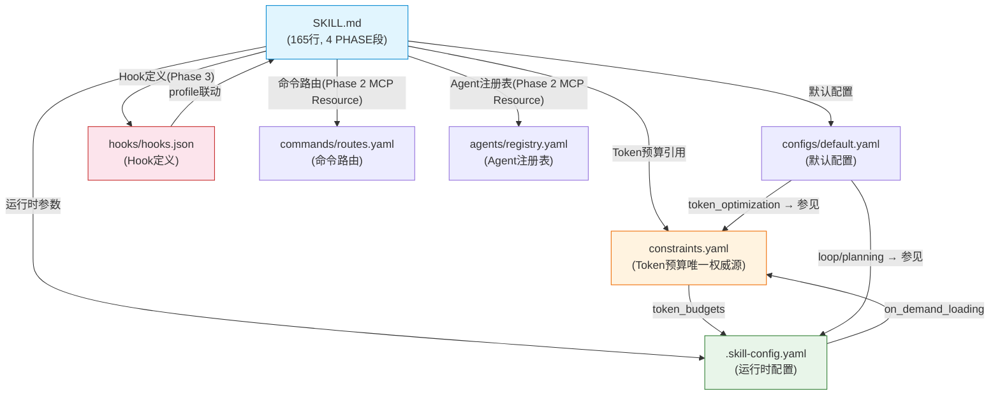
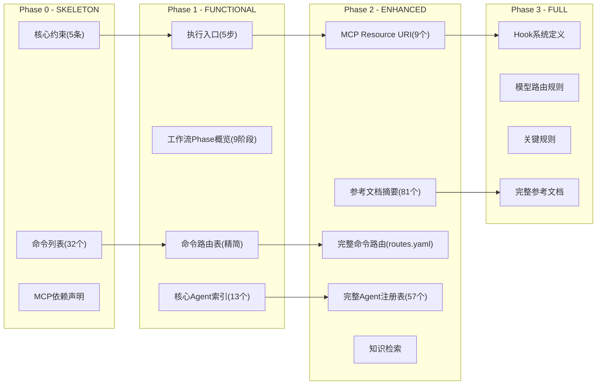
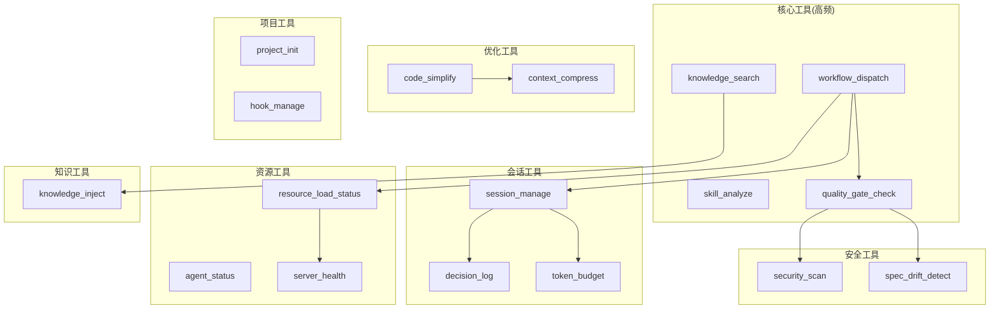

# Xuansto Skill v2 — 技能审查文档

> 版本: 9.0.0 | 审查日期: 2026-05-27 | 基于代码实际状态生成

---

## 1. 技能定义文件分析

### 1.1 SKILL.md 概况

| 指标 | 值 |
|------|-----|
| 总行数 | 165 |
| YAML frontmatter 行数 | 19 (L1-L19) |
| PHASE_0 段 | L21-L56 (36行) |
| PHASE_1 段 | L58-L137 (80行) |
| PHASE_2 段 | L139-L157 (19行) |
| PHASE_3 段 | L159-L165 (7行) |
| `{{include:}}` 指令 | 0 (已完全消除) |

**与旧版对比**：SKILL.md 从 275 行压缩至 165 行（减少 40%），主要通过以下手段：

1. **消除 `{{include:}}` 指令**：旧版通过 `{{include:references/xxx.md}}` 在 SKILL.md 中内联参考文档，v8.9.0-dev 完全移除此机制
2. **PHASE_2/3 仅含 MCP Resource URI 引用**：不再内嵌完整命令路由表、Agent 注册表或 Hook 定义，改为指向 `xuansto://` 资源地址
3. **精简路由表**：命令路由表保留意图→命令→MCP工具链→Phase→加载阶段 五列，降级策略列移至 `routes.yaml`

### 1.2 四段 PHASE 结构

| 段标记 | 加载阶段 | 核心内容 | Token 预算 |
|--------|----------|----------|------------|
| `PHASE_0_START → PHASE_0_END` | SKELETON | YAML 元数据 + 命令列表 + MCP 依赖 + 核心约束(5条) + SKELETON可用命令表 | ≤2K |
| `PHASE_1_START → PHASE_1_END` | FUNCTIONAL | 执行入口(5步) + 工作流Phase概览表(9阶段) + 命令路由表(精简,32命令) + 核心Agent索引(编排3+产品4+工程6=13个) | ≤5K |
| `PHASE_2_START → PHASE_2_END` | ENHANCED | MCP Resource URI 索引(9个资源) + 交叉引用声明 | ≤10K |
| `PHASE_3_START → PHASE_3_END` | FULL | Hook系统/模型路由/并行化策略引用 + 关键规则(1行精简) | ≤20K |

### 1.3 YAML Frontmatter 关键字段

```
name: xuansto-skill-v2
version: 8.9.0-dev
agents_summary: "13 layers / 57 agents (via MCP v2)"
triggers.phrases: 57个触发短语(中英混合)
triggers.keywords: 82个关键词
triggers.commands: 32个斜杠命令
triggers.not_for: 12个排除场景
compatible_mcp_server: ">=4.0.0"
mcp_server_min_version: "4.0.0"
```

---

## 2. 功能逻辑逐步分解

### 2.1 执行入口 (5步)

```
1. 平台检测 → 检查项目依赖和结构
2. 规模评估 → 统计文件数判断规模
3. 工作流选择 → full/medium/fast
4. MCP+知识检索 → skill_analyze → knowledge_search → 注入Agent上下文
5. 执行Phase 0 → 按Phase顺序推进
```

### 2.2 工作流9阶段

| Phase | 名称 | MCP工具 | 关键门禁 | 加载阶段要求 |
|-------|------|---------|----------|-------------|
| 0 | 初始化 | skill_analyze, workflow_dispatch, agent_status, resource_load_status | DESIGN-SYSTEM-COMPLETE, ANTI-PATTERN-CHECK | SKELETON |
| 1 | 需求分析 | knowledge_search, resource_load_status | BRAINSTORM-COMPLETE, GATE-001~002 | FUNCTIONAL |
| 2 | 架构设计 | knowledge_search, resource_load_status | PLAN-ATOMIC, GATE-003~004 | FUNCTIONAL |
| 3 | 测试先行 | — | TEST-FIRST | ENHANCED |
| 4 | 代码实现 | quality_gate_check, agent_status | GATE-007, TEST-PASS, FILE-ENCODING | ENHANCED |
| 5 | 测试验证 | security_scan, spec_drift_detect, agent_status | AI-PENTEST, SPEC-CONSISTENCY | ENHANCED |
| 6 | 验收确认 | quality_gate_check | GATE-013~014, UX-ACCEPTANCE | ENHANCED |
| 7 | 持续重构 | code_simplify, context_compress | SIMPLIFICATION-BEHAVIOR, GATE-015 | ENHANCED |
| 8 | 部署交付 | — | DESKTOP-BUILD/SIGN/UPDATE/CROSS | FULL |

### 2.3 命令路由表 (32命令)

按加载阶段分类：

| 加载阶段 | 命令 | 数量 |
|----------|------|------|
| SKELETON | /status, /help, /budget | 3 |
| FUNCTIONAL | /init, /brainstorm, /clarify, /plan, /spec, /design, /sprint, /learn, /execute-plan, /agent-status | 10 |
| ENHANCED | /design-system, /implement, /test, /review, /fix, /accept, /simplify, /refactor, /build, /sdd-tdd-medium, /sdd-tdd-fast, /decision | 12 |
| FULL | /audit, /deploy, /build-desktop, /release-desktop, /loop, /cancel-loop, /rollback | 7 |

### 2.4 MCP工具清单 (22个)

SKILL.md 命令路由表中引用的 22 个 MCP 工具（v9.0.0: 原20→22，修正工具数）：

| # | 工具名 | 类型 | 降级方式 |
|---|--------|------|----------|
| 1 | skill_analyze | MCP+脚本 | scripts/skill_analyze.py |
| 2 | knowledge_search | MCP+脚本 | scripts/knowledge_search.py |
| 3 | quality_gate_check | MCP+脚本 | scripts/quality_gate_check.py |
| 4 | spec_drift_detect | MCP+内联 | _inline_spec_drift_detect |
| 5 | security_scan | MCP+内联 | _inline_security_scan |
| 6 | code_simplify | MCP+内联 | _inline_code_simplify |
| 7 | session_manage | MCP+脚本 | scripts/session_manage.py |
| 8 | workflow_dispatch | MCP+内联 | _inline_workflow_dispatch |
| 9 | agent_status | MCP+内联 | _inline_agent_status |
| 10 | hook_manage | MCP+内联 | _inline_hook_manage |
| 11 | resource_load_status | 内联 | _inline_resource_load_status |
| 12 | context_compress | MCP+脚本 | scripts/context_compress.py |
| 13 | server_health | MCP+内联 | _inline_server_health |
| 14 | decision_log | MCP+脚本 | scripts/decision_log.py |
| 15 | token_budget | MCP+脚本 | scripts/token_budget.py |
| 16 | knowledge_inject | MCP+脚本 | scripts/knowledge_inject.py |
| 17 | project_init | MCP+内联 | _inline_project_init |
| 18 | agent_manage | 内联 | _inline_agent_manage |
| 19 | metrics_report | MCP+内联 | _inline_metrics_report |
| 20 | config_manage | 内联 | _inline_config_manage |

额外工具（评估覆盖但未在路由表直接引用）：

| # | 工具名 | 类型 | 降级方式 |
|---|--------|------|----------|
| 21 | resource_subscribe | 内联 | _inline_resource_subscribe |
| 22 | audit_query | 内联 | _inline_audit_query |

### 2.5 质量门禁 (54项)

关键门禁按 Phase 分布：

| Phase | 门禁数 | 代表性门禁 |
|-------|--------|-----------|
| 0 | 6+ | DESIGN-SYSTEM-COMPLETE, ANTI-PATTERN-CHECK, DESIGN-REVIEW-PRODUCT/TECH/DESIGN |
| 1 | 3 | GATE-001(需求完整性), GATE-002(规格一致性), BRAINSTORM-COMPLETE |
| 2 | 4 | GATE-003(架构合理性), GATE-004(接口契约), PLAN-ATOMIC, SPEC-ATOMIC |
| 3 | 1+ | TEST-FIRST(含覆盖率+测试数据) |
| 4 | 10+ | GATE-007(代码规范), TEST-PASS, GATE-009(代码审查), TDD-RED/GREEN/REFACTOR |
| 5 | 5+ | GATE-011(E2E), GATE-012(安全), AI-PENTEST, SPEC-CONSISTENCY |
| 6 | 3+ | GATE-013~014, UX-ACCEPTANCE |
| 7 | 2+ | SIMPLIFICATION-BEHAVIOR, GATE-015 |
| 8 | 4 | DESKTOP-BUILD/SIGN/UPDATE/CROSS |
| 跨阶段 | 3+ | TOKEN-BUDGET, SCRIPT-CLEANUP, SCRIPT-SECURITY |

---

## 3. 参考文档两级加载机制

### 3.1 目录结构

```
references/
├── *.md                    # 81个完整参考文档
├── summary/                # 81个摘要文件
│   ├── a2a-protocol.md
│   ├── acceptance-criteria.md
│   ├── ... (与上层一一对应)
│   └── workflows.md
└── (v9.0.0: agent-details/ 已删除，Agent定义统一从 agents/ 目录获取)
```

### 3.2 两级加载策略

| 精度 | 内容 | Token消耗 | 加载时机 |
|------|------|-----------|----------|
| 摘要(summary/) | 文档标题+章节列表+关键指标 | ~200/文档 | Phase 2(ENHANCED)默认加载 |
| 完整(references/) | 文档全部内容 | ~2000-5000/文档 | Agent执行需要时按需加载 |

### 3.3 加载路径

```
Phase 2 触发
  → 加载 references/summary/*.md (81个摘要)
  → Agent需要详情时
    → 通过 MCP Resource URI (xuansto://gates/definitions 等) 获取完整内容
    → 或直接读取 references/*.md 文件
```

### 3.4 MCP Resource URI 索引

SKILL.md PHASE_2 段定义了 9 个 MCP Resource URI：

| URI | 数据 | 最低加载阶段 |
|-----|------|-------------|
| xuansto://commands/routes | 完整命令路由表(含降级策略) | Phase 2+ |
| xuansto://agents/registry | 完整Agent注册表(57个/13层) | Phase 2+ |
| xuansto://config/skill | 技能配置 | Phase 1+ |
| xuansto://gates/definitions | 质量门禁完整定义 | Phase 2+ |
| xuansto://workflows/definitions | 工作流阶段定义 | Phase 2+ |
| xuansto://hooks/definitions | Hook定义 | Phase 3+ |
| xuansto://loading/status | 加载状态 | Phase 1+ |
| xuansto://knowledge/stats | 知识库统计 | Phase 2+ |
| xuansto://config/constraints | 核心约束 | Phase 0+ |

---

## 4. Hook 动态配置与 Phase 联动

### 4.1 三级 Hook 配置

`hooks/hooks.json` 定义了三种配置级别：

| 配置级别 | PreToolUse | PostToolUse | SessionStart | Stop | PreCompact |
|----------|-----------|-------------|-------------|------|-----------|
| **minimal** | security-block | — | — | session-save | — |
| **standard** | security-block, token-budget-check | auto-format, encoding-check | load-context, kb-health-check | session-save, git-status-check, experience-precipitate | save-state |
| **strict** | security-block, token-budget-check, dangerous-cmd-confirm | auto-format, encoding-check, console-log-detect, type-check | load-context, kb-health-check, platform-detect | session-save, git-status-check, experience-precipitate, pattern-detect | save-state, decision-log-persist |

### 4.2 Phase → Hook 配置联动映射

| 加载阶段 | Hook配置级别 | 联动逻辑 |
|----------|-------------|----------|
| SKELETON | **minimal** | 仅安全拦截+会话保存，不加载开发辅助Hook |
| FUNCTIONAL | **standard** | 增加格式化/编码检查/上下文加载，支持命令执行 |
| ENHANCED | **standard** | 同FUNCTIONAL，标准开发辅助Hook |
| FULL | **strict** | 全部Hook启用，含Token预算检查/危险命令确认/类型检查/模式检测 |

### 4.3 Hook 生命周期事件

| 事件类型 | 触发时机 | 可用Hook |
|----------|---------|----------|
| PreToolUse | 工具调用前 | security-block, token-budget-check, dangerous-cmd-confirm |
| PostToolUse | 工具调用后 | auto-format, encoding-check, console-log-detect, type-check |
| SessionStart | 会话启动 | load-context, kb-health-check, platform-detect |
| Stop | 会话停止 | session-save, git-status-check, experience-precipitate, pattern-detect |
| PreCompact | 上下文压缩前 | save-state, decision-log-persist |

### 4.4 安全断点默认值

`configs/default.yaml` 中 human_collaboration 配置：

| 断点 | 默认值 | 说明 |
|------|--------|------|
| breakpoint_on_acceptance_failure | **true** | 验收失败时暂停等待人工介入 |
| breakpoint_on_spec_drift_high | false | 高影响规格漂移自动处理(adapt策略) |
| breakpoint_on_security_critical | **true** | 安全关键操作暂停等待人工确认 |
| breakpoint_on_iteration_stuck | false | 迭代卡住时自动恢复(replan策略) |

安全硬门禁（即使 autonomous 模式也必须人工确认）：
- production_deploy
- secret_key_rotation
- database_schema_destructive_change

---

## 5. 渐进式加载状态机

### 5.1 状态定义

```python
class LoadPhase(str, Enum):
    SKELETON = "skeleton"     # Phase 0: 骨架
    FUNCTIONAL = "functional" # Phase 1: 功能
    ENHANCED = "enhanced"     # Phase 2: 增强
    FULL = "full"            # Phase 3: 完整
```

### 5.2 状态转换图

```
                    命令执行                    参考文档请求              深度分析/桌面构建
SKELETON ──────────────────→ FUNCTIONAL ──────────────────→ ENHANCED ──────────────────→ FULL
   ↑                            │                              │                          │
   │  Token>95%且无活动          │  Token>95%                   │  Token>80%              │  Token>80%
   └────────────────────────────└──────────────────────────────└──────────────────────────┘
                                      (context_compress降级)
```

### 5.3 转换条件

| 转换 | 触发条件 | 动作 |
|------|----------|------|
| SKELETON→FUNCTIONAL | 用户执行命令 或 Phase进入 | preload当前Phase资源 |
| FUNCTIONAL→ENHANCED | agent_status(detail) 或 参考文档请求 | 加载Agent定义+参考文档 |
| ENHANCED→FULL | /build-desktop 或 /loop 命令 | 加载全部资源 |
| FULL→ENHANCED | Token使用率>80% | context_compress压缩 |
| ENHANCED→FUNCTIONAL | Token使用率>95% | 释放参考文档缓存 |
| FUNCTIONAL→SKELETON | Token使用率>95%且当前Phase无活动 | 仅保留核心约束 |

### 5.4 资源优先级与释放顺序

| 优先级 | 名称 | 资源 | Token紧张时处理 |
|--------|------|------|-----------------|
| P0 | 必须 | SKILL.md核心约束、命令路由表、Agent索引表 | 始终保留 |
| P1 | 重要 | 命令详细步骤、工作流Phase定义、MCP工具参数 | Token>95%时释放 |
| P2 | 增强 | 参考文档、模板文件、知识库 | Token>80%时释放 |
| P3 | 可选 | 示例文档、评估配置、披露资源 | Token>60%时释放 |

### 5.5 降级策略

当功能因加载阶段限制不可用时：

| 不可用功能 | 降级方案 | 影响阶段 |
|-----------|----------|----------|
| 命令执行 | 仅展示命令列表，例外：/status、/help、/budget | Phase 0 |
| 工作流详情 | 使用核心约束中的精简规则替代 | Phase 0 |
| 完整命令路由 | Phase 0/1用精简路由；Phase 2加载完整路由含降级策略 | Phase 0-1 |
| 完整Agent注册表 | Phase 0无Agent信息；Phase 1用核心索引(13个)；Phase 2加载完整57个 | Phase 0-1 |
| 知识检索 | 跳过知识检索，使用内嵌模板和默认知识 | Phase 0-1 |
| 参考文档 | 使用SKILL.md内嵌摘要替代 | Phase 0-1 |
| Hook系统 | 使用minimal配置(security-block仅) | Phase 0-2 |
| 模型路由 | 默认使用standard路由 | Phase 0-2 |

---

## 6. 依赖图

### 6.1 配置文件依赖关系



### 6.2 参考文档加载依赖



### 6.3 MCP工具依赖图



---

## 7. 可复用模块 / 已弃用部分

### 7.1 可复用模块

| 模块 | 路径 | 复用场景 |
|------|------|----------|
| 渐进式加载状态机 | constraints.yaml `disclosure` 段 | 任何需要Token预算控制的Skill |
| Hook三级配置 | hooks/hooks.json `profiles` | 任何需要生命周期拦截的Skill |
| 命令路由引擎 | commands/routes.yaml | 任何需要意图→命令映射的Skill |
| Agent注册表 | agents/registry.yaml | 任何多Agent编排系统 |
| 两级参考加载 | references/ + references/summary/ | 任何大量参考文档的Skill |
| MCP降级框架 | constraints.yaml `degradation` 段 | 任何依赖MCP的Skill |
| Agent合并策略 | configs/default.yaml `agent_merge_policy` | 任何需要动态精简Agent的编排器 |
| 平台检测 | configs/default.yaml `platform_detection` | 任何跨平台开发Skill |

### 7.2 已弃用 / 已消除

| 弃用项 | 旧版位置 | 当前状态 | 替代方案 |
|--------|----------|----------|----------|
| `{{include:}}` 指令 | SKILL.md 内联 | **完全消除** | MCP Resource URI + 两级参考加载 |
| SKILL.md 内嵌完整命令路由 | PHASE_2 段 | **已移除** | `xuansto://commands/routes` (routes.yaml) |
| SKILL.md 内嵌完整Agent注册表 | PHASE_2 段 | **已移除** | `xuansto://agents/registry` (registry.yaml) |
| SKILL.md 内嵌Hook定义 | PHASE_3 段 | **已移除** | `xuansto://hooks/definitions` (hooks.json) |
| SKILL.md 内嵌模型路由 | PHASE_3 段 | **已移除** | `xuansto://config/skill` (model-routing.md) |
| Token配置分散 | default.yaml + .skill-config.yaml | **已统一** | constraints.yaml 作为唯一权威源 |
| v1 架构 | — | **已归档** | v1_archived: true in frontmatter |
| DESIGN-REVIEW 门禁 | quality-gates.md | **已拆分** | DESIGN-REVIEW-PRODUCT/TECH/DESIGN |
| COVERAGE 门禁 | quality-gates.md | **已合并** | TEST-FIRST |
| DESIGN-ACCESSIBILITY 门禁 | quality-gates.md | **已合并** | DESIGN-SYSTEM-COMPLETE |

### 7.3 Token 配置统一权威源

v8.9.0-dev 将所有 Token 预算配置统一到 `constraints.yaml`：

| 配置项 | 旧位置 | 新位置 |
|--------|--------|--------|
| token_budgets (4阶段) | constraints.yaml | constraints.yaml (不变) |
| token_optimization.budget | configs/default.yaml | → constraints.yaml 引用 |
| token_optimization.warn_threshold | configs/default.yaml | → constraints.yaml 引用 |
| token_optimization.block_threshold | configs/default.yaml | → constraints.yaml 引用 |
| token_optimization.compression_level | configs/default.yaml | → constraints.yaml 引用 |
| token_optimization.logging.* | configs/default.yaml | → constraints.yaml 引用 |

`configs/default.yaml` 中 token_optimization 段所有字段值均为：
```yaml
"See constraints.yaml for token budget configuration (unified authority source)"
```

> **v9.0.0**: default.yaml 中迁移后的空段已清理完毕。模型路由统一到 `registry.yaml` 为唯一源，`model-routing.md` 已更新对齐。

### 7.4 评估覆盖

| 评估类型 | 文件 | 覆盖范围 |
|----------|------|----------|
| MCP工具评估 | evals/mcp_evaluation.xml | 22个工具 × 2 QA = **44 QA对** |
| 触发评估 | evals/trigger_eval.json | 15个场景(3正向+12反向) |

MCP工具评估覆盖的 22 个工具：

knowledge_search, quality_gate_check, server_health, resource_load_status, skill_analyze, knowledge_inject, spec_drift_detect, security_scan, code_simplify, session_manage, workflow_dispatch, agent_status, agent_manage, hook_manage, resource_subscribe, context_compress, decision_log, token_budget, project_init, metrics_report, config_manage, audit_query

---

## 附录: 关键数据速查

| 指标 | 值 |
|------|-----|
| SKILL.md 行数 | 165 |
| PHASE 段数 | 4 |
| `{{include:}}` 数量 | 0 |
| 命令总数 | 32 |
| MCP工具数 | 22 |
| Agent总数 | 57 / 13层 |
| 质量门禁数 | 54 |
| 参考文档数(完整) | 81 |
| 参考文档数(摘要) | 81 |
| Agent详细定义数 | 57 |
| MCP Resource URI数 | 9 |
| Hook配置级别 | 3 (minimal/standard/strict) |
| Hook事件类型 | 5 (PreToolUse/PostToolUse/SessionStart/Stop/PreCompact) |
| 评估QA对数 | 44 |
| 触发评估场景数 | 15 |
| Token预算(SKELETON) | ≤2K |
| Token预算(FUNCTIONAL) | ≤5K |
| Token预算(ENHANCED) | ≤10K |
| Token预算(FULL) | ≤20K |
| MCP Server最低版本 | ≥4.0.0 |
