# Xuansto Skill v2 综合分析文档

> 版本：8.0.0 | 分析日期：2026-05-26
> 分析范围：SKILL.md、57个Agent、31个命令、20个MCP工具、降级脚本、渐进式加载、模块化重构

---

## 1. SKILL.md 全文解析

### 1.1 YAML Frontmatter

| 字段 | 值 | 说明 |
|------|-----|------|
| `name` | `xuansto-skill-v2` | 技能唯一标识 |
| `version` | `8.0.0` | 当前版本号 |
| `description` | 多Agent自主开发编排引擎 | 核心定位：通过20个MCP原子工具驱动9阶段全生命周期开发流程 |
| `agents_summary` | 13 layers / 57 agents (via MCP v2) | Agent编排规模 |
| `compatible_mcp_server` | `>=4.0.0` | 最低兼容MCP Server版本 |
| `mcp_server_min_version` | `4.0.0` | MCP Server最低版本硬约束 |
| `min_version` | `1.0.0` | Skill运行时最低版本 |
| `v1_archived` | `true` | v1已归档 |
| `license` | MIT | 开源协议 |
| `author` | skiller-team | 维护团队 |

**触发条件三维度**：

| 维度 | 数量 | 示例 |
|------|------|------|
| `phrases` | 62条 | "build this properly", "帮我搭建项目", "全流程开发" |
| `keywords` | 96条 | xuansto, SDD, TDD, 9-phase-workflow, 桌面打包 |
| `commands` | 31条 | /init, /plan, /implement, /loop 等 |

**排除场景（not_for）**：12类，包括简单单文件编辑、纯DevOps、纯文档任务、简单Q&A、5行以下热修复等。

### 1.2 PHASE_0（骨架）

**代码位置**：[SKILL.md](file:///c:/Users/86156/.trae-cn/worktrees/skiller/develop-main-branch-YzihpS/.trae/skills/xuansto-skill-v2/SKILL.md#L21-L44) `<!-- PHASE_0_START -->` ~ `<!-- PHASE_0_END -->`

**命令列表**（31个）：

```
/sprint /clarify /plan /spec /design /implement /test /review /fix /accept
/deploy /build-desktop /release-desktop /refactor /audit /agent-status /learn
/brainstorm /execute-plan /design-system /simplify /loop /cancel-loop /build
/init /status /rollback /sdd-tdd-medium /sdd-tdd-fast /decision /budget
```

**MCP依赖**：

- 最低兼容：xuansto-mcp-server >= 4.0.0
- API版本：3.0.0
- 不可用时自动降级到 `scripts/` 目录Python脚本，详见 `constraints.yaml`

**核心约束（5条）**：

| 编号 | 约束ID | 规则 |
|------|--------|------|
| 1 | `spec-first` | Spec > Test > Code：先规格再测试最后代码，覆盖率≥80% |
| 2 | `karpathy` | Think Before Coding \| Simplicity First \| Surgical Changes |
| 3 | `incremental` | 分解→实现→测试→重复；3-Strike Protocol |
| 4 | `script-standard` | Python优先 \| UTF-8无BOM+无U+FFFD \| 验证后删除临时脚本 |
| 5 | `cross-platform` | Web+Desktop(Electron/Tauri/Flutter)，桌面端需IPC安全+代码签名 |

### 1.3 PHASE_1（功能）

**代码位置**：[SKILL.md](file:///c:/Users/86156/.trae-cn/worktrees/skiller/develop-main-branch-YzihpS/.trae/skills/xuansto-skill-v2/SKILL.md#L46-L124) `<!-- PHASE_1_START -->` ~ `<!-- PHASE_1_END -->`

**执行入口**（5步）：

1. 平台检测 → 检查项目依赖和结构
2. 规模评估 → 统计文件数判断规模
3. 工作流选择 → full/medium/fast
4. MCP+知识检索 → skill_analyze → knowledge_search → 注入Agent上下文
5. 执行Phase 0 → 按Phase顺序推进

**工作流Phase概览表**（9阶段）：

| Phase | 名称 | MCP工具 | 关键门禁 |
|-------|------|---------|----------|
| 0 | 初始化 | skill_analyze, workflow_dispatch, agent_status, resource_load_status | DESIGN-SYSTEM-COMPLETE, ANTI-PATTERN-CHECK |
| 1 | 需求分析 | knowledge_search, resource_load_status | BRAINSTORM-COMPLETE, GATE-001~002 |
| 2 | 架构设计 | knowledge_search, resource_load_status | PLAN-ATOMIC, GATE-003~004 |
| 3 | 测试先行 | — | TEST-FIRST |
| 4 | 代码实现 | quality_gate_check, agent_status | GATE-007, TEST-PASS, FILE-ENCODING |
| 5 | 测试验证 | security_scan, spec_drift_detect, agent_status | AI-PENTEST, SPEC-CONSISTENCY |
| 6 | 验收确认 | quality_gate_check | GATE-013~014, UX-ACCEPTANCE |
| 7 | 持续重构 | code_simplify, context_compress | SIMPLIFICATION-BEHAVIOR, GATE-015 |
| 8 | 部署交付 | — | DESKTOP-BUILD/SIGN/UPDATE/CROSS |

**命令路由表（精简）**：31个命令按意图→命令→MCP工具链→Phase映射，详见 [SKILL.md#L70-L104](file:///c:/Users/86156/.trae-cn/worktrees/skiller/develop-main-branch-YzihpS/.trae/skills/xuansto-skill-v2/SKILL.md#L70-L104)。

**核心Agent索引（13个）**：

| 层级 | Agent | Phase | 模型路由 |
|------|-------|-------|----------|
| 编排 | Orchestrator | 0,1,2 | deep |
| 编排 | Subagent Dispatcher | 0,4,5 | standard |
| 编排 | Task Coordinator | 0,4,5 | standard |
| 产品 | Product Manager | 1,6 | standard |
| 产品 | Brainstorming Facilitator | 1 | standard |
| 产品 | System Architect | 2 | deep |
| 产品 | Technical Writer | 1,6 | standard |
| 工程 | Backend Developer | 4 | standard |
| 工程 | Database Engineer | 4 | standard |
| 工程 | DevOps Engineer | 4,8 | standard |
| 工程 | Frontend Developer | 4 | standard |
| 工程 | Fullstack Engineer | 4 | standard |
| 工程 | Mobile Developer | 4 | standard |

### 1.4 PHASE_2（增强）

**代码位置**：[SKILL.md](file:///c:/Users/86156/.trae-cn/worktrees/skiller/develop-main-branch-YzihpS/.trae/skills/xuansto-skill-v2/SKILL.md#L126-L220) `<!-- PHASE_2_START -->` ~ `<!-- PHASE_2_END -->`

**完整命令路由表**：通过 `{{include:commands/routes.yaml}}` 内联加载，31条路由含降级策略（fallback字段）。每条路由包含：intent、command、mcp_tools、fallback、phase、detail。

路由优先级规则：`精确匹配 > 语义匹配 > 更具体命令优先 > 默认/sprint兜底`

**完整Agent注册表**：通过 `{{include:agents/registry.yaml}}` 内联加载，13层57个Agent完整定义。

**外部参考文件表**：

配置文件（`{{include:}}` 内联加载）：

| 文件 | 内容 |
|------|------|
| `triggers.yaml` | 触发条件完整定义 |
| `constraints.yaml` | 核心约束与降级规则 |
| `commands/routes.yaml` | 完整命令路由表(含降级策略) |
| `agents/registry.yaml` | 完整Agent角色索引(13层57个) |

核心参考文档索引（5个P0级）：

| 文档 | 路径 | 内容摘要 |
|------|------|----------|
| 质量门禁 | references/quality-gates.md | 54项质量门禁详细定义与判定标准 |
| Agent注册表 | references/agent-registry.md | 完整Agent注册表(57个Agent/13层)与角色详情 |
| MCP工具 | references/mcp-tools.md | 20个MCP工具完整参数与返回值 |
| 工作流 | references/workflows.md | 9阶段工作流目标、步骤、门禁和命令路由详情 |
| 约束规则 | constraints.yaml | 核心约束与降级规则 |

集成与基础设施参考（P1级，11个）：

| 文件 | 内容 |
|------|------|
| references/mcp-integration-strategy.md | MCP集成策略 |
| references/session-persistence.md | 会话持久化 |
| references/token-optimization.md | Token优化策略 |
| references/hook-system.md | Hook系统完整定义 |
| references/model-routing.md | 模型路由规则 |
| references/workflow-checkpoints.md | 工作流检查点 |
| references/spec-drift-handling.md | 规格偏差检测 |
| references/agent-lifecycle.md | Agent生命周期管理 |
| references/knowledge-workflow-details.md | 知识工作流 |
| references/collaboration-modes.md | 协作模式定义 |
| references/iteration-scheduling.md | 智能迭代调度 |

并行与优化参考（P2级，2个）：

| 文件 | 内容 |
|------|------|
| references/parallelization-strategy.md | 并行化策略 |
| references/concurrency-standards.md | 并发编码标准 |

**MCP工具摘要表**（20个）：

| 工具 | 功能 | 关键参数 |
|------|------|----------|
| skill_analyze | 项目结构分析 | skill_path, depth |
| knowledge_search | 三层知识库检索 | action, query, top_k, search_type |
| knowledge_inject | 知识注入到上下文 | action, content, scope |
| quality_gate_check | 54项质量门禁 | gate_ids, phase, project_path |
| spec_drift_detect | 规格偏差检测 | spec_dir, src_dir |
| security_scan | OWASP+依赖扫描 | target, severity_threshold |
| code_simplify | 代码简化分析 | target, scope, include_dedup |
| session_manage | 会话状态管理 | action, completed_tasks, decisions |
| workflow_dispatch | 工作流调度 | action, workflow, project_path |
| agent_status | Agent状态查询 | action, phase, agent_name |
| agent_manage | Agent实例管理 | action, agent_type, agent_id |
| hook_manage | Hook管理 | action, profile, hook_name |
| resource_load_status | 渐进式加载状态 | action, phase, resource_ids |
| context_compress | 上下文压缩 | content, strategy, target_tokens |
| server_health | 服务器健康检查 | action, include_details |
| decision_log | 决策日志管理 | action, title, decision |
| token_budget | Token预算管理 | action, total_budget |
| project_init | 项目初始化 | action, name, stack |
| metrics_report | 指标报告 | action, tool_name, time_range |
| config_manage | 配置管理 | action, config_key, config_value |

### 1.5 PHASE_3（完整）

**代码位置**：[SKILL.md](file:///c:/Users/86156/.trae-cn/worktrees/skiller/develop-main-branch-YzihpS/.trae/skills/xuansto-skill-v2/SKILL.md#L222-L249) `<!-- PHASE_3_START -->` ~ `<!-- PHASE_3_END -->`

**Hook系统说明**：

三级配置：

| Profile | PreToolUse | PostToolUse | SessionStart | Stop | PreCompact |
|---------|-----------|-------------|-------------|------|-----------|
| minimal | security-block | — | — | session-save | — |
| standard | security-block, token-budget-check | auto-format, encoding-check | load-context, kb-health-check | session-save, git-status-check, experience-precipitate | save-state |
| strict | security-block, token-budget-check, dangerous-cmd-confirm | auto-format, encoding-check, console-log-detect, type-check | load-context, kb-health-check, platform-detect | session-save, git-status-check, experience-precipitate, pattern-detect | save-state, decision-log-persist |

关键Hook：

| Hook | 触发时机 | 动作 |
|------|----------|------|
| PhaseEnter | Phase转换时 | 执行门禁预检 |
| PreCommit | Git提交前 | 执行编码检查和格式验证 |
| PostTest | 测试完成后 | 执行覆盖率检查和规格偏差检测 |
| SecurityBlock | 安全阻断 | 检测敏感信息和危险操作 |

**模型路由说明**：

| 路由 | 模型 | 适用场景 |
|------|------|----------|
| fast | 轻量模型 | 简单查询、格式化、快速响应 |
| standard | 标准模型 | 常规开发任务、代码生成、测试编写 |
| deep | 深度模型 | 架构设计、复杂分析、安全审计、决策仲裁 |

路由规则：Orchestrator/System Architect → deep；编排/产品层核心 → standard；简单查询 → fast

**关键规则**：

- 2-Action Research | 3-Strike Error | Chesterton's Fence | Loop Enforcement
- Confidence≥80 | 三级仲裁(L1技术→L2策略ADR→L3安全人工)
- UTF-8无BOM+LF | Python优先 | 业务注释中文
- Git:`<类型>(<范围>): <中文描述>` | 禁止Shell(.sh) | 五步闭环

---

## 2. 功能逻辑分步拆解

从参数解析到最终输出的完整执行流程：

### Step 1: 平台检测 → 检查项目依赖和结构

**代码位置**：[default.yaml#L174-L192](file:///c:/Users/86156/.trae-cn/worktrees/skiller/develop-main-branch-YzihpS/.trae/skills/xuansto-skill-v2/configs/default.yaml#L174-L192)（平台检测配置）

**执行逻辑**：

1. 读取 `configs/default.yaml` 中 `platform_detection` 配置
2. 按优先级检测：显式声明 > 依赖分析 > 结构分析 > 默认Web
3. Web指示器：package.json with react/vue/angular、next.config.js、vite.config.ts
4. Desktop指示器：package.json with electron、src-tauri目录、electron-builder.yml
5. 无法检测时默认 `web`

**输出**：`platform = "web" | "desktop"`，决定后续Agent选择（桌面端激活Desktop Developer、IPC Specialist等）

### Step 2: 规模评估 → 统计文件数判断规模

**代码位置**：[default.yaml#L18-L20](file:///c:/Users/86156/.trae-cn/worktrees/skiller/develop-main-branch-YzihpS/.trae/skills/xuansto-skill-v2/configs/default.yaml#L18-L20)（精简模式阈值）

**执行逻辑**：

1. 调用 `skill_analyze(depth="full")` 扫描项目
2. 统计文件数和模块数
3. 判断规模：`max_files <= 50 && max_modules <= 10` → small；否则 medium/large
4. 小型项目触发 `lean_mode`，启用Agent合并策略

**Agent合并规则**（9条）：

| 合并组 | 条件 |
|--------|------|
| security-tester + ai-penetration-tester | project_scale < medium |
| integration-tester + e2e-tester | project_scale < medium |
| documentation-engineer + specification-keeper | project_scale < medium |
| cicd-specialist + devops-engineer | project_scale < small |
| desktop-developer + frontend-developer | desktop_framework == electron |
| desktop-tester + e2e-tester | desktop_test_complexity < medium |
| build-release-engineer + cicd-specialist | project_scale < small |
| knowledge-manager + learning-specialist | project_scale < medium |
| quality-monitor + progress-tracker | project_scale < medium |

### Step 3: 工作流选择 → full/medium/fast

**代码位置**：[SKILL.md#L48-L54](file:///c:/Users/86156/.trae-cn/worktrees/skiller/develop-main-branch-YzihpS/.trae/skills/xuansto-skill-v2/SKILL.md#L48-L54)（执行入口）

**执行逻辑**：

| 工作流 | 触发条件 | Phase覆盖 | 命令 |
|--------|----------|-----------|------|
| full | 大型项目/完整SDD+TDD | Phase 0→8 全部 | /init, /sprint |
| medium | 中等规模SDD+TDD | Phase 0→8 精简 | /sdd-tdd-medium |
| fast | 快速SDD+TDD | Phase 1→8 跳过初始化 | /sdd-tdd-fast |

### Step 4: MCP+知识检索 → skill_analyze → knowledge_search → 注入Agent上下文

**代码位置**：
- [server.py](file:///c:/Users/86156/.trae-cn/worktrees/skiller/develop-main-branch-YzihpS/xuansto-mcp-server/src/xuansto_mcp/server.py)（MCP Server入口，工具注册与Hook拦截）
- [tools/skill_analyze.py](file:///c:/Users/86156/.trae-cn/worktrees/skiller/develop-main-branch-YzihpS/xuansto-mcp-server/src/xuansto_mcp/tools/skill_analyze.py)
- [tools/knowledge_inject.py](file:///c:/Users/86156/.trae-cn/worktrees/skiller/develop-main-branch-YzihpS/xuansto-mcp-server/src/xuansto_mcp/tools/knowledge_inject.py)
- [core/search_engine.py](file:///c:/Users/86156/.trae-cn/worktrees/skiller/develop-main-branch-YzihpS/xuansto-mcp-server/src/xuansto_mcp/core/search_engine.py)（搜索引擎架构）

**执行逻辑**：

1. `skill_analyze(skill_path, depth)` → 分析项目结构，返回技术栈、文件统计
2. `knowledge_search(query, top_k=5, search_type="hybrid")` → 多引擎知识库检索
   - hybrid：语义+关键词混合（默认，权重0.6语义+0.4 BM25）
   - semantic_only：纯ChromaDB语义搜索
   - keyword_only：纯关键词搜索（SQLite FTS5 BM25 / SimpleSearchEngine）
3. `knowledge_inject(content, scope)` → 将检索结果注入Agent上下文
4. 知识检索降级链：ChromaDB(hybrid) → SQLite FTS5(BM25) → SimpleSearchEngine(文件关键词匹配)

**搜索引擎架构**（代码位置：[core/search_engine.py](file:///c:/Users/86156/.trae-cn/worktrees/skiller/develop-main-branch-YzihpS/xuansto-mcp-server/src/xuansto_mcp/core/search_engine.py)）：

| 引擎 | 类名 | 搜索方式 | 降级条件 |
|------|------|----------|----------|
| chromadb | ChromaDBSearchEngine | 向量语义搜索 | ImportError/运行时异常 |
| sqlite_fts5 | SQLiteFTSSearchEngine | FTS5 BM25全文检索 | OperationalError |
| simple | SimpleSearchEngine | 文件关键词匹配 | 始终可用 |
| hybrid | HybridSearchEngine | ChromaDB(0.6)+FTS5(0.4)混合 | ChromaDB不可用时降级到FTS5 |

自动检测逻辑：ChromaDB可用+SQLite存在 → hybrid；ChromaDB可用+SQLite不存在 → chromadb；ChromaDB不可用+SQLite存在 → sqlite_fts5；均不可用 → simple

### Step 5: 执行Phase 0 → 按Phase顺序推进

**代码位置**：
- [tools/resource_load_status.py](file:///c:/Users/86156/.trae-cn/worktrees/skiller/develop-main-branch-YzihpS/xuansto-mcp-server/src/xuansto_mcp/tools/resource_load_status.py)（渐进式加载状态管理）
- [resources/skill_resources.py#L198-L351](file:///c:/Users/86156/.trae-cn/worktrees/skiller/develop-main-branch-YzihpS/xuansto-mcp-server/src/xuansto_mcp/resources/skill_resources.py#L198-L351)（xuansto://loading/status Resource）

**执行逻辑**：

1. 工具执行成功后，`server.py` 中 `_with_hook_interception()` 处理工具调用
2. 通过 `resource_load_status` 工具管理渐进式加载阶段推进
3. 推进时自动加载新阶段的资源列表
4. `xuansto://loading/status` Resource 提供只读加载状态快照

**命令→阶段推进映射**：

| 命令 | 推进到 |
|------|--------|
| /init, /sprint, /implement | FUNCTIONAL |
| /audit, /refactor, /loop | ENHANCED |
| /build-desktop, /deploy | FULL |

---

## 3. 交互模式分析

### 3.1 单轮命令（Single-turn）

无需多步交互，立即返回结果：

| 命令 | 功能 | MCP工具 | Phase |
|------|------|---------|-------|
| /status | 查询进度 | workflow_dispatch, session_manage, server_health | — |
| /agent-status | 查询Agent | agent_status | — |
| /budget | Token预算 | token_budget, resource_load_status | — |
| /decision | 决策记录 | decision_log | — |

### 3.2 多轮命令（Multi-turn）

需要跨Phase交互，逐步推进工作流：

| 命令 | 功能 | MCP工具链 | Phase |
|------|------|-----------|-------|
| /init | 从零开始新项目 | skill_analyze, knowledge_search, workflow_dispatch, project_init, decision_log | 0 |
| /plan | 规划架构 | skill_analyze, knowledge_search, agent_status, workflow_dispatch, decision_log, token_budget | 2 |
| /implement | 写代码 | workflow_dispatch, quality_gate_check, hook_manage | 4 |
| /test | 跑测试 | quality_gate_check, workflow_dispatch | 5 |
| /review | 代码审查 | quality_gate_check, security_scan, code_simplify | 5 |
| /fix | 修复Bug | session_manage, quality_gate_check, hook_manage | 4 |
| /brainstorm | 头脑风暴 | knowledge_search, workflow_dispatch | 1 |
| /clarify | 澄清需求 | knowledge_search, workflow_dispatch, quality_gate_check | 1 |
| /spec | 写规格文档 | workflow_dispatch, quality_gate_check, spec_drift_detect | 2 |
| /design | 设计 | quality_gate_check, knowledge_search, workflow_dispatch | 2 |
| /design-system | 设计系统 | quality_gate_check, knowledge_search, workflow_dispatch | 2 |
| /accept | 验收确认 | quality_gate_check, workflow_dispatch | 6 |
| /deploy | 部署交付 | quality_gate_check, server_health, workflow_dispatch | 8 |
| /build | 构建项目 | skill_analyze, quality_gate_check, server_health | 8 |
| /build-desktop | 桌面构建 | quality_gate_check, skill_analyze, workflow_dispatch | 8 |
| /release-desktop | 桌面发布 | quality_gate_check, workflow_dispatch | 8 |
| /refactor | 代码重构 | code_simplify, quality_gate_check, context_compress | 7 |
| /simplify | 代码简化 | code_simplify, quality_gate_check, context_compress | 7 |
| /audit | 安全审计 | security_scan, quality_gate_check, spec_drift_detect | 5 |
| /learn | 知识学习 | knowledge_search, knowledge_inject, session_manage | — |
| /sprint | 冲刺 | workflow_dispatch, session_manage, resource_load_status, token_budget, project_init | 0 |
| /sdd-tdd-medium | 中等SDD+TDD | skill_analyze, workflow_dispatch, resource_load_status | 0 |
| /sdd-tdd-fast | 快速SDD+TDD | workflow_dispatch, resource_load_status | 1 |
| /execute-plan | 执行计划 | workflow_dispatch, session_manage | — |
| /rollback | 回滚 | session_manage, workflow_dispatch | — |

### 3.3 循环模式（Loop mode）

| 命令 | 功能 | MCP工具链 | 说明 |
|------|------|-----------|------|
| /loop | 自主循环 | workflow_dispatch, session_manage, resource_load_status, token_budget, decision_log | 最大50次迭代，停滞阈值3次 |
| /cancel-loop | 取消循环 | workflow_dispatch, session_manage | 中止循环并持久化状态 |

### 3.4 命令→9阶段映射

| 工作流Phase | 可用命令 |
|-------------|----------|
| Phase 0（初始化） | /init, /sprint, /sdd-tdd-medium |
| Phase 1（需求分析） | /brainstorm, /clarify, /sdd-tdd-fast |
| Phase 2（架构设计） | /plan, /spec, /design, /design-system |
| Phase 3（测试先行） | （由Phase 2自动推进，无独立命令） |
| Phase 4（代码实现） | /implement, /fix |
| Phase 5（测试验证） | /test, /review, /audit |
| Phase 6（验收确认） | /accept |
| Phase 7（持续重构） | /simplify, /refactor |
| Phase 8（部署交付） | /deploy, /build, /build-desktop, /release-desktop |
| 跨Phase | /learn, /execute-plan, /loop, /cancel-loop, /agent-status, /status, /rollback, /decision, /budget |

---

## 4. 渐进式加载逻辑分析

### 4.1 四阶段Token预算

**代码位置**：[constraints.yaml](file:///c:/Users/86156/.trae-cn/worktrees/skiller/develop-main-branch-YzihpS/.trae/skills/xuansto-skill-v2/constraints.yaml) + [resources/skill_resources.py#L198-L351](file:///c:/Users/86156/.trae-cn/worktrees/skiller/develop-main-branch-YzihpS/xuansto-mcp-server/src/xuansto_mcp/resources/skill_resources.py#L198-L351)

| 加载阶段 | 触发条件 | 加载内容 | Token预算 | 累计预算 |
|----------|----------|----------|-----------|----------|
| Phase 0: 骨架 | Skill触发时 | 核心元数据：技能名称、版本、可用命令列表(无详情) | ≤2K | 2K |
| Phase 1: 功能 | 用户执行命令时 | 命令描述+MCP工具可用性+核心约束+核心Agent | ≤5K | 7K |
| Phase 2: 增强 | 需要参考文档时 | Agent注册表+工作流定义+质量门禁摘要+参考文档URI+知识检索 | ≤10K | 17K |
| Phase 3: 完整 | 深度分析时 | 完整参考+模板+知识库访问+全部Agent定义+所有详情 | ≤20K | 37K |

### 4.2 资源优先级

**代码位置**：[constraints.yaml](file:///c:/Users/86156/.trae-cn/worktrees/skiller/develop-main-branch-YzihpS/.trae/skills/xuansto-skill-v2/constraints.yaml)

| 优先级 | 名称 | 包含内容 | 加载阶段 |
|--------|------|----------|----------|
| P0_must | 必须加载 | SKILL.md核心约束、命令路由表、Agent索引表 | Phase 0 |
| P1_important | 重要加载 | 命令详细步骤、工作流Phase定义、MCP工具参数 | Phase 1 |
| P2_enhanced | 增强加载 | 参考文档、模板文件、知识库 | Phase 2 |
| P3_optional | 可选加载 | 示例文档、评估配置、披露资源 | Phase 3 |

### 4.3 披露机制

**代码位置**：[constraints.yaml](file:///c:/Users/86156/.trae-cn/worktrees/skiller/develop-main-branch-YzihpS/.trae/skills/xuansto-skill-v2/constraints.yaml) + [SKILL.md](file:///c:/Users/86156/.trae-cn/worktrees/skiller/develop-main-branch-YzihpS/.trae/skills/xuansto-skill-v2/SKILL.md) PHASE标记 + [resources/skill_resources.py#L198-L351](file:///c:/Users/86156/.trae-cn/worktrees/skiller/develop-main-branch-YzihpS/xuansto-mcp-server/src/xuansto_mcp/resources/skill_resources.py#L198-L351)

SKILL.md通过HTML注释标记实现分段加载：

| PHASE标记 | 范围 | 内容 |
|-----------|------|------|
| `<!-- PHASE_0_START -->` ~ `<!-- PHASE_0_END -->` | L21-L44 | YAML frontmatter + 命令列表 + MCP依赖 + 核心约束(5条) |
| `<!-- PHASE_1_START -->` ~ `<!-- PHASE_1_END -->` | L46-L124 | 执行入口 + 工作流Phase概览表 + 命令路由表(精简) + 核心Agent索引 |
| `<!-- PHASE_2_START -->` ~ `<!-- PHASE_2_END -->` | L126-L220 | 完整命令路由表 + 完整Agent注册表 + 外部参考文件表 + MCP工具摘要表 |
| `<!-- PHASE_3_START -->` ~ `<!-- PHASE_3_END -->` | L222-L249 | Hook系统说明 + 模型路由说明 + 关键规则 |

**披露通知机制**（代码位置：[resources/skill_resources.py#L222-L286](file:///c:/Users/86156/.trae-cn/worktrees/skiller/develop-main-branch-YzihpS/xuansto-mcp-server/src/xuansto_mcp/resources/skill_resources.py#L222-L286)）：

| 阶段 | 披露通知 | 升级提示 |
|------|----------|----------|
| SKELETON | 仅核心元数据可用，命令步骤/工作流/Agent/参考文档不可用 | 执行任意命令推进到功能阶段 |
| FUNCTIONAL | 命令执行和工作流概览可用，完整路由/Agent注册表/参考文档不可用 | resource_load_status(preload) 推进到增强阶段 |
| ENHANCED | 完整路由/Agent/参考文档/知识检索可用，Hook/模型路由不可用 | 深度分析推进到完整阶段 |
| FULL | 全部功能可用 | — |

### 4.4 降级规则

**代码位置**：[constraints.yaml](file:///c:/Users/86156/.trae-cn/worktrees/skiller/develop-main-branch-YzihpS/.trae/skills/xuansto-skill-v2/constraints.yaml) + [core/degradation.py](file:///c:/Users/86156/.trae-cn/worktrees/skiller/develop-main-branch-YzihpS/xuansto-mcp-server/src/xuansto_mcp/core/degradation.py)

| 功能 | 不可用阶段 | 降级行为 |
|------|-----------|----------|
| 命令执行 | Phase 0 | 仅展示命令列表，不执行；提示用户执行命令推进到Phase 1 |
| 工作流详情 | Phase 0 | 使用核心约束中的精简规则替代完整工作流定义 |
| 完整命令路由 | Phase 0, 1 | 使用精简路由表(无降级策略列)；Phase 2加载完整路由 |
| 完整Agent注册表 | Phase 0, 1 | Phase 0无Agent信息；Phase 1使用核心Agent索引(13个)；Phase 2加载完整57个 |
| 知识检索 | Phase 0, 1 | 跳过知识检索步骤，使用内嵌模板和默认知识；Phase 2起可用 |
| 参考文档 | Phase 0, 1 | 使用SKILL.md内嵌摘要替代；Phase 2起通过{{include:}}按需加载 |
| Hook系统 | Phase 0, 1, 2 | 使用minimal配置(security-block仅)；Phase 3加载完整Hook系统 |
| 模型路由 | Phase 0, 1, 2 | 默认使用standard路由；Phase 3加载完整模型路由说明 |

**MCP工具降级链**（代码位置：[core/degradation.py#L650-L1068](file:///c:/Users/86156/.trae-cn/worktrees/skiller/develop-main-branch-YzihpS/xuansto-mcp-server/src/xuansto_mcp/core/degradation.py#L650-L1068)）：

```
MCP工具调用 → 脚本降级(scripts/xxx.py --format json) → 内联降级(_try_inline_fallback) → 最小化响应
```

20个MCP工具的降级映射（FALLBACK_MAP）：

| MCP工具 | 降级脚本 | 内联降级 |
|---------|----------|----------|
| skill_analyze | scripts/skill-test.py | _inline_skill_analyze |
| quality_gate_check | scripts/skill-test.py | _inline_quality_gate |
| knowledge_search | scripts/knowledge-server.py | _inline_knowledge_search |
| knowledge_inject | scripts/knowledge-server.py | _inline_knowledge_inject |
| spec_drift_detect | scripts/spec-drift-detector.py | _inline_spec_drift |
| security_scan | scripts/agentic-security-scanner.py | _inline_agentic_scan |
| code_simplify | scripts/code-simplifier.py | _inline_simplify |
| session_manage | scripts/init-session.py等 | _inline_session_manage |
| workflow_dispatch | scripts/project-initializer.py | _inline_workflow_dispatch |
| agent_status | scripts/skill-test.py | _inline_agent_status |
| hook_manage | 按hook名映射脚本 | _inline_hook_manage |
| resource_load_status | — | _inline_resource_load_status |
| context_compress | scripts/context-compressor.py | _inline_context_compress |
| server_health | scripts/health-checker.py | _inline_server_health |
| decision_log | scripts/decision-log.py | _inline_decision_log |
| token_budget | scripts/token-budget-guard.py | _inline_token_budget |
| project_init | scripts/project-initializer.py | _inline_project_init |
| agent_manage | — | _inline_agent_manage |
| metrics_report | scripts/test-reporter.py | _inline_metrics_report |
| config_manage | — | _inline_config_manage |

**降级配置热重载**：`DegradationExecutor` 支持从 `data/fallback_config.yaml` 动态加载降级映射，通过 `start_fallback_watcher()` 守护线程监控配置变更（watchfiles优先，polling降级）。

**知识检索降级链**：ChromaDB(hybrid) → SQLite FTS5(BM25) → SimpleSearchEngine(文件关键词匹配)

---

## 5. 可复用模块清单 / 需废弃或重写部分

### 5.1 可复用模块

| 模块 | 路径 | 说明 | 复用价值 |
|------|------|------|----------|
| constraints.yaml | `.trae/skills/xuansto-skill-v2/constraints.yaml` | 核心约束+Token预算+降级规则+披露机制 | ⭐⭐⭐ 单一权威源 |
| routes.yaml | `.trae/skills/xuansto-skill-v2/commands/routes.yaml` | 31条命令路由含降级策略 | ⭐⭐⭐ 命令路由核心 |
| registry.yaml | `.trae/skills/xuansto-skill-v2/agents/registry.yaml` | 13层57个Agent完整注册表 | ⭐⭐⭐ Agent发现核心 |
| hooks.json | `.trae/skills/xuansto-skill-v2/hooks/hooks.json` | 三级Hook配置+15个Hook定义 | ⭐⭐⭐ Hook系统核心 |
| default.yaml | `.trae/skills/xuansto-skill-v2/configs/default.yaml` | 编排器/质量门禁/安全/桌面等全量默认配置 | ⭐⭐⭐ 配置权威源 |
| references/ | `.trae/skills/xuansto-skill-v2/references/` | 79+参考文档（含agent-details/57个Agent详情） | ⭐⭐ 知识库核心 |
| .skill-config.yaml | `.trae/skills/xuansto-skill-v2/.skill-config.yaml` | 运行时配置（循环/规划/按需加载/知识服务） | ⭐⭐ 运行时核心 |
| server.py | `xuansto-mcp-server/src/xuansto_mcp/server.py` | MCP Server主入口，工具注册+Hook拦截+重试 | ⭐⭐⭐ 服务核心 |
| degradation.py | `xuansto-mcp-server/src/xuansto_mcp/core/degradation.py` | DegradationManager + DegradationExecutor + FALLBACK_MAP | ⭐⭐ 降级核心 |
| search_engine.py | `xuansto-mcp-server/src/xuansto_mcp/core/search_engine.py` | 4种搜索引擎(ChromaDB/FTS5/Simple/Hybrid) | ⭐⭐ 搜索核心 |
| database.py | `xuansto-mcp-server/src/xuansto_mcp/core/database.py` | SQLite引擎(13张表+双写+一致性修复) | ⭐⭐ 持久化核心 |
| hook_engine.py | `xuansto-mcp-server/src/xuansto_mcp/core/hook_engine.py` | HookEngine(8种HookType+动态注册+超时) | ⭐⭐ Hook核心 |
| errors.py | `xuansto-mcp-server/src/xuansto_mcp/core/errors.py` | 统一错误响应+重试+异常分类 | ⭐⭐ 错误处理核心 |
| schemas.py | `xuansto-mcp-server/src/xuansto_mcp/models/schemas.py` | 20个Pydantic输入Schema | ⭐⭐ Schema核心 |
| skill_resources.py | `xuansto-mcp-server/src/xuansto_mcp/resources/skill_resources.py` | 25个MCP Resource注册 | ⭐⭐ Resource核心 |
| tools/ 子包 | `xuansto-mcp-server/src/xuansto_mcp/tools/` | 20个独立工具模块 + __init__.py | ⭐⭐ 工具核心 |

### 5.2 需重写部分

| 模块 | 当前状态 | 重写方向 |
|------|----------|----------|
| api_routes.py (根级+api/子包) | 两份完全相同的文件，仅6个HTTP端点 | 🔄 合并为单文件，扩展端点覆盖所有20个工具 |
| 错误处理 | 部分工具返回字符串而非JSON（ARCH-11） | 🔄 计划v8.3.0统一为JSON格式 |
| API Schema | HTTP API与MCP stdio两套接口无统一Schema（API-01） | 🔄 计划v8.3.0统一 |

### 5.3 需废弃部分

| 模块 | 说明 | 废弃计划 |
|------|------|----------|
| v1 Skill文件 | agents/、commands/、workflows/等目录在v1和v2中同时存在（P3-01） | v8.5.0标记v1为archived |
| api_routes.py (根级) | 与api/api_routes.py完全重复 | 随api模块稳定后移除根级副本 |

---

## 6. 依赖图

```mermaid
graph TB
    subgraph "Skill层"
        SKILL["SKILL.md<br/>(v8.0.0)"]
        CONSTRAINTS["constraints.yaml<br/>核心约束+降级规则"]
        ROUTES["commands/routes.yaml<br/>31条命令路由"]
        REGISTRY["agents/registry.yaml<br/>13层57个Agent"]
        TRIGGERS["triggers.yaml<br/>触发条件"]
        DEFAULT["configs/default.yaml<br/>默认配置"]
        HOOKS["hooks/hooks.json<br/>Hook系统"]
        SKILL_CONFIG[".skill-config.yaml<br/>运行时配置"]
        REFS["references/<br/>79+参考文档"]
        AGENT_DETAILS["references/agent-details/<br/>57个Agent详情"]
        COMMANDS_MD["commands/*.md<br/>31个命令详情"]
        AGENTS_MD["agents/*/*.md<br/>57个Agent定义"]
    end

    subgraph "MCP Server层"
        SERVER["server.py<br/>FastMCP入口+Hook拦截"]
        TOOLS["tools/ 子包<br/>20个独立工具模块"]
        TOOLS_INIT["tools/__init__.py<br/>__all__导出"]
        RESOURCES["resources/skill_resources.py<br/>25个MCP Resource"]
        SCHEMAS["models/schemas.py<br/>20个Pydantic输入Schema"]
        CONFIG_MODELS["models/config_models.py<br/>配置Pydantic模型"]
        HOOK_ENGINE["core/hook_engine.py<br/>HookEngine<br/>8种HookType"]
        RATE_LIMITER["core/rate_limiter.py<br/>TokenBucket限流"]
        DEGRADATION["core/degradation.py<br/>DegradationManager<br/>DegradationExecutor<br/>FALLBACK_MAP(20)"]
        CONFIG["core/config.py<br/>路径/配置/热重载"]
        DB["core/database.py<br/>SQLite引擎(13张表)"]
        SEARCH["core/search_engine.py<br/>4种搜索引擎"]
        ERRORS["core/errors.py<br/>统一错误+重试+异常分类"]
        NOTIFICATIONS["core/notifications.py<br/>通知回调"]
        AUDIT["core/audit_logger.py<br/>审计日志"]
        CACHE["core/cache.py<br/>LRUCache"]
        VALIDATOR["core/validator.py<br/>路径安全验证"]
        CRYPTO["core/crypto.py<br/>加密工具"]
        PROTOCOL["core/protocol.py<br/>协议定义"]
        METRICS["core/metrics.py<br/>指标收集"]
        SUBPROCESS["core/subprocess_utils.py<br/>子进程工具"]
        LOGGING["core/logging_config.py<br/>日志配置"]
    end

    subgraph "HTTP API层"
        API_ROUTES["api/api_routes.py<br/>FastAPI HTTP端点(6个)"]
        API_ROOT["api_routes.py<br/>根级副本(重复)"]
    end

    subgraph "降级脚本层"
        SCRIPTS["scripts/*.py<br/>50+降级脚本"]
    end

    SKILL --> CONSTRAINTS
    SKILL --> ROUTES
    SKILL --> REGISTRY
    SKILL --> TRIGGERS
    SKILL --> REFS
    SKILL --> DEFAULT
    SKILL --> HOOKS
    SKILL --> SKILL_CONFIG

    REFS --> AGENT_DETAILS
    ROUTES --> COMMANDS_MD
    REGISTRY --> AGENTS_MD

    SERVER --> TOOLS
    SERVER --> RESOURCES
    SERVER --> HOOK_ENGINE
    SERVER --> RATE_LIMITER
    SERVER --> ERRORS
    TOOLS --> TOOLS_INIT
    TOOLS --> DB
    TOOLS --> SEARCH
    TOOLS --> CONFIG
    TOOLS --> DEGRADATION
    TOOLS --> CACHE
    TOOLS --> VALIDATOR

    DEGRADATION --> CONFIG
    DEGRADATION --> ERRORS
    DEGRADATION --> SCRIPTS
    DEGRADATION -->|"fallback_config.yaml热重载"| CONFIG

    HOOK_ENGINE --> HOOKS
    HOOK_ENGINE --> LOGGING

    RESOURCES --> CONFIG
    RESOURCES --> DB
    RESOURCES --> VALIDATOR
    RESOURCES --> DEGRADATION

    CONFIG -->|"watchfiles/polling热重载"| CONSTRAINTS
    CONFIG --> SKILL_CONFIG

    API_ROUTES --> CONFIG
    API_ROUTES --> SEARCH
    API_ROUTES --> ERRORS
    API_ROOT --> CONFIG
    API_ROOT --> SEARCH
    API_ROOT --> ERRORS

    SKILL -.->|"MCP工具调用<br/>(stdio JSON-RPC)"| SERVER
    SKILL -.->|"脚本降级"| SCRIPTS
    SERVER -.->|"Resource暴露"| SKILL

    style SKILL fill:#e1f5fe,stroke:#0288d1,stroke-width:2px
    style SERVER fill:#f3e5f5,stroke:#7b1fa2,stroke-width:2px
    style DEGRADATION fill:#fff3e0,stroke:#ef6c00,stroke-width:2px
    style SEARCH fill:#e8f5e9,stroke:#2e7d32,stroke-width:2px
    style TOOLS fill:#fce4ec,stroke:#c62828,stroke-width:2px
    style SCRIPTS fill:#f5f5f5,stroke:#616161,stroke-width:1px
    style API_ROUTES fill:#e0f2f1,stroke:#00695c,stroke-width:1px
```



**依赖关系说明**：

1. **SKILL.md → 配置文件**：SKILL.md通过`{{include:}}`指令内联加载constraints.yaml、routes.yaml、registry.yaml、triggers.yaml
2. **SKILL.md → references/**：79+参考文档通过外部引用按需加载，按P0/P1/P2优先级分组
3. **server.py → tools/**：20个工具模块通过`register(mcp)`动态注册，server.py替换`mcp.tool`为`_tool_with_hooks`实现Hook拦截
4. **server.py → core模块**：hook_engine.py提供Hook拦截，rate_limiter.py提供限流，errors.py提供重试和错误响应，degradation.py提供降级
5. **server.py → resources/**：skill_resources.py通过`register(mcp)`注册25个MCP Resource
6. **degradation.py → scripts/**：FALLBACK_MAP映射20个工具到脚本降级函数，支持fallback_config.yaml热重载
7. **degradation.py → DegradationManager**：监控4个组件(search_engine/knowledge_base/hooks/resources)健康状态，指数退避恢复
8. **config.py → 热重载**：watchfiles优先/polling降级监控.xuansto-config.yaml、constraints.yaml、.skill-config.yaml变更
9. **search_engine.py**：4种搜索引擎(ChromaDB/FTS5/Simple/Hybrid)，自动检测最佳引擎
10. **api_routes.py**：FastAPI HTTP端点(6个)，与MCP stdio并行提供HTTP访问
11. **Skill → MCP Server**：Skill层通过MCP协议(stdio JSON-RPC)调用工具
12. **Skill → scripts/**：MCP不可用时降级到scripts/目录Python脚本

---

## 附录：问题追踪摘要

| 优先级 | 总数 | 已修复 | 未修复 |
|--------|------|--------|--------|
| P0 | 2 | 2 | 0 |
| P1 | 6 | 6 | 0 |
| P2 | 2 | 2 | 0 |
| P3 | 2 | 0 | 2 |
| ARCH | 8 | 0 | 8 |
| DB | 3 | 0 | 3 |
| MCP | 2 | 0 | 2 |
| SKILL | 3 | 2 | 1 |
| API | 2 | 1 | 1 |
| **总计** | **30** | **13** | **17** |

关键未修复问题：
- ARCH-05: MCP Server未暴露Resource（计划v8.2.0）→ 已实现25个Resource
- ARCH-11: 错误处理不统一（计划v8.3.0）
- DB-01/02: 双写一致性风险（计划v8.3.0）
- SKILL-02: SKELETON阶段无可用命令（计划v8.2.0）
- API-01: HTTP API与MCP stdio无统一Schema（计划v8.3.0）
