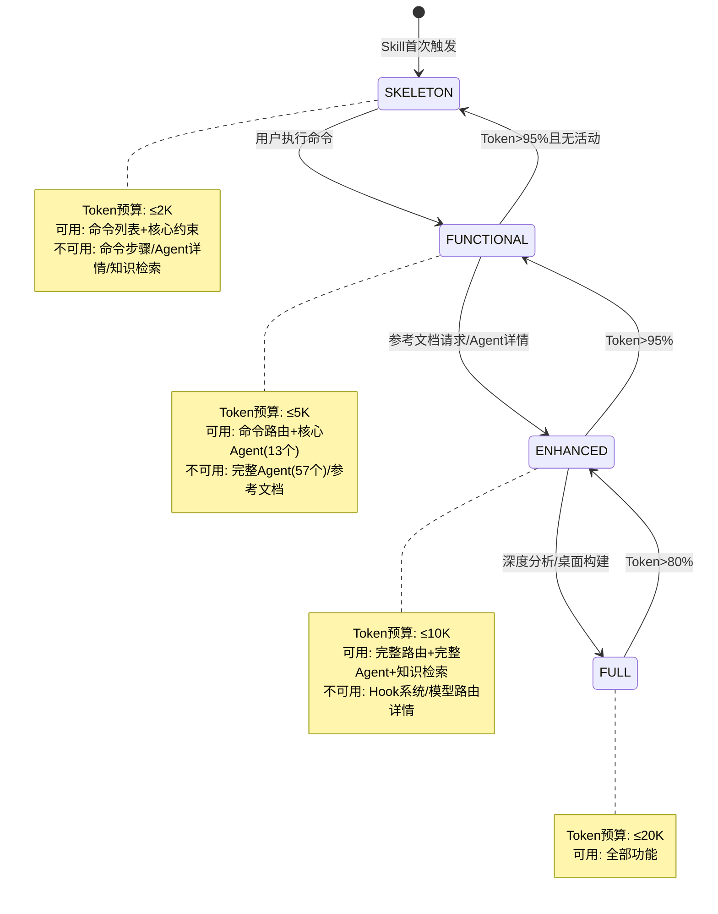
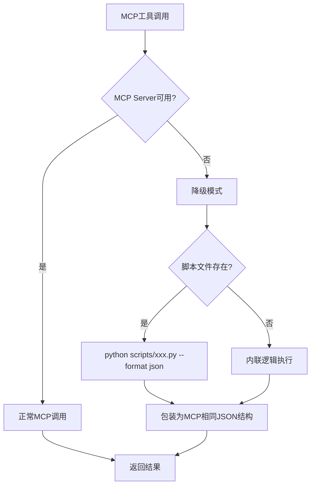
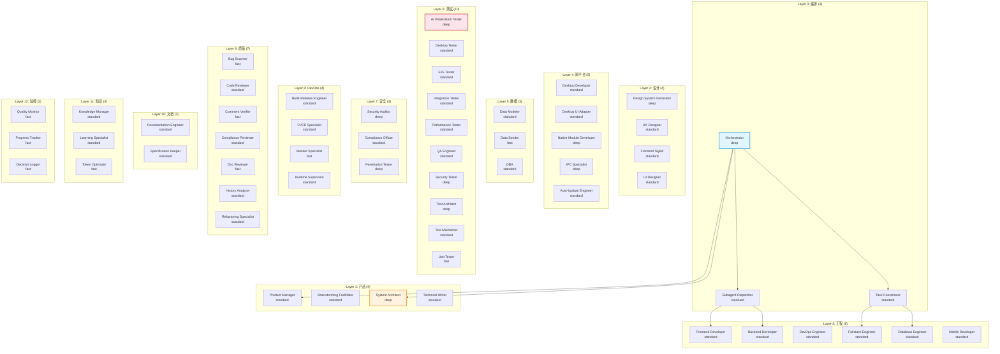

# xuansto-skill-v2 Skill 综合分析文档

> 版本：8.0.0 | 分析日期：2026-05-24 | 分析范围：SKILL.md、57个Agent定义、31个命令、15个工作流、19个MCP工具、降级脚本、Hook系统、渐进式加载规范
> 项目路径：`.trae/skills/xuansto-skill-v2/`

---

## 目录

1. [Skill 定义文件全文解析](#1-skill-定义文件全文解析)
2. [功能逻辑分步拆解](#2-功能逻辑分步拆解)
3. [交互模式分析](#3-交互模式分析)
4. [特效逻辑分析](#4-特效逻辑分析)
5. [可复用模块清单 / 需废弃或重写部分](#5-可复用模块清单--需废弃或重写部分)
6. [依赖图](#6-依赖图)
7. [问题清单](#7-问题清单)

---

## 1. Skill 定义文件全文解析

### 1.1 YAML Frontmatter 元数据

| 字段 | 值 | 说明 |
|------|----|------|
| `name` | `xuansto-skill-v2` | 技能唯一标识 |
| `version` | `8.0.0` | 当前版本号 |
| `description` | 多Agent自主开发编排引擎... | 技能描述，含核心指标：57 Agent/13层编排、54项质量门禁、31个命令 |
| `agents_summary` | `13 layers / 57 agents (via MCP v2)` | Agent概要 |
| `min_version` | `1.0.0` | 最低兼容版本 |
| `license` | `MIT` | 开源协议 |
| `author` | `skiller-team` | 作者 |

**代码位置**：[SKILL.md](/.trae/skills/xuansto-skill-v2/SKILL.md) L1-L16

### 1.2 触发条件

触发条件定义在三个位置，存在**三处冗余**：

| 定义位置 | 字段 | 数量 | 说明 |
|----------|------|------|------|
| `SKILL.md` → `triggers.phrases` | 英文+中文短语 | 75条 | 主定义 |
| `SKILL.md` → `triggers.keywords` | 英文+中文关键词 | 120条 | 主定义 |
| `SKILL.md` → `triggers.commands` | 斜杠命令 | 31条 | 主定义 |
| `triggers.yaml` → `phrases` | 英文+中文短语 | 75条 | 独立文件，与SKILL.md完全重复 |
| `triggers.yaml` → `keywords` | 英文+中文关键词 | 120条 | 独立文件，与SKILL.md完全重复 |
| `triggers.yaml` → `commands` | 斜杠命令 | 31条 | 独立文件，与SKILL.md完全重复 |

**代码位置**：[SKILL.md](/.trae/skills/xuansto-skill-v2/SKILL.md) L7-L11 / [triggers.yaml](/.trae/skills/xuansto-skill-v2/triggers.yaml) L3-L188

**触发机制分类**：

```
触发方式1: 短语匹配 → triggers.phrases（75条）
  ├── 英文: "build this properly", "write tests first", "spec-first" ...
  └── 中文: "帮我搭建项目", "先写测试再写代码", "规格驱动开发" ...

触发方式2: 关键词匹配 → triggers.keywords（120条）
  ├── 英文: xuansto, SDD, TDD, OWASP, Electron, Tauri ...
  └── 中文: 冲刺规划, 需求澄清, 架构规划, 代码审查 ...

触发方式3: 命令调用 → triggers.commands（31条）
  └── /sprint, /clarify, /plan, /spec, /design, /implement ...
```

### 1.3 排除条件（not_for）

定义了12类不应触发本Skill的场景：

| 排除场景 | 说明 |
|----------|------|
| 单文件编辑 | 添加注释、修正拼写 |
| 纯基础设施/DevOps | 无代码变更 |
| 纯文档任务 | 无代码开发 |
| 简单问答/解释 | 非开发任务 |
| 纯UI/UX设计 | 无代码（推荐使用ui-ux-pro-max） |
| 纯数据分析/报告 | 非开发任务 |
| 简单配置变更 | 环境变量、标志位 |
| 单行修复/小补丁 | 琐碎变更 |
| 简单安全扫描 | 无代码修复 |
| 纯文档安全报告 | 无代码修复 |
| 桌面应用纯UI设计 | 无代码 |
| 5行以内热修复 | 琐碎变更 |

**代码位置**：[SKILL.md](/.trae/skills/xuansto-skill-v2/SKILL.md) L11 / [triggers.yaml](/.trae/skills/xuansto-skill-v2/triggers.yaml) L190-L202

### 1.4 提示词结构

SKILL.md的Body部分构成Skill的完整提示词，按渐进式加载分为4个Phase区域：

| Phase区域 | 标记 | 内容 | Token预算 |
|-----------|------|------|-----------|
| Phase 0 骨架 | `PHASE_0_START → PHASE_0_END` | YAML frontmatter + 命令列表 + MCP依赖 + 核心约束(5条) | ≤2K |
| Phase 1 功能 | `PHASE_1_START → PHASE_1_END` | 执行入口 + 工作流Phase概览表 + 命令路由表(精简) + 核心Agent索引 | ≤5K |
| Phase 2 增强 | `PHASE_2_START → PHASE_2_END` | 完整命令路由表 + 完整Agent注册表 + 外部参考文件表 + MCP工具摘要表 | ≤10K |
| Phase 3 完整 | `PHASE_3_START → PHASE_3_END` | Hook系统说明 + 模型路由说明 + 关键规则 | ≤20K |

> ⚠️ **注意**：当前SKILL.md中**未实际包含** `PHASE_x_START/END` 标记注释，这些标记仅在 `constraints.yaml` 的 `disclosure` 配置中声明为规范。实际加载时由MCP工具 `resource_load_status` 控制。

**代码位置**：[constraints.yaml](/.trae/skills/xuansto-skill-v2/constraints.yaml) L83-L125

### 1.5 脚本引用

SKILL.md通过 `constraints.yaml` 的降级配置引用脚本，形成MCP→脚本→内联的三级降级链：

| MCP工具 | 降级脚本 | 代码位置 |
|---------|---------|----------|
| `skill_analyze` | `scripts/skill-test.py --analyze` | constraints.yaml L189 |
| `quality_gate_check` | `scripts/skill-test.py --gate` | constraints.yaml L190 |
| `knowledge_search` | `scripts/knowledge-server.py --search` | constraints.yaml L191 |
| `knowledge_inject` | `scripts/knowledge_server/main.py --inject` | constraints.yaml L192 |
| `spec_drift_detect` | `scripts/spec-drift-detector.py` | constraints.yaml L193 |
| `security_scan` | `scripts/agentic-security-scanner.py` | constraints.yaml L194 |
| `code_simplify` | `scripts/code-simplifier.py` | constraints.yaml L195 |
| `session_manage` | `scripts/init-session.py` / `session-catchup.py` / `session-persist.py` | constraints.yaml L196 |
| `workflow_dispatch` | `scripts/project-initializer.py` | constraints.yaml L197 |
| `agent_status` | `scripts/skill-test.py --agents` | constraints.yaml L198 |
| `hook_manage` | `scripts/check-encoding.py` / `token-budget-guard.py` / `session-persist.py` | constraints.yaml L199 |
| `resource_load_status` | 内联状态检查(`resource_state.json`) | constraints.yaml L200 |
| `context_compress` | `scripts/context-compressor.py` | constraints.yaml L201 |
| `server_health` | `scripts/health-checker.py` | constraints.yaml L202 |

---

## 2. 功能逻辑分步拆解

### 2.1 执行入口流程

从用户触发Skill到最终输出的完整流程：

```
用户输入
  │
  ▼
[Step 1] 触发匹配
  │  位置: SKILL.md triggers.phrases/keywords/commands
  │  逻辑: 短语匹配 → 关键词匹配 → 命令匹配 → not_for排除
  │
  ▼
[Step 2] 平台检测
  │  位置: configs/default.yaml → platform_detection
  │  逻辑: explicit_declaration → dependency_analysis → structure_analysis → default_web
  │  输出: platform = "web" | "desktop"
  │
  ▼
[Step 3] 规模评估
  │  位置: configs/default.yaml → orchestrator.lean_mode_threshold
  │  逻辑: 文件数>50=大(full), 20-50=中(medium), <20=小(fast)
  │  输出: scale = "full" | "medium" | "fast"
  │
  ▼
[Step 4] 工作流选择
  │  位置: SKILL.md → 执行入口 L39-L45
  │  逻辑: scale → 选择 sdd-tdd-full / sdd-tdd-medium / sdd-tdd-fast
  │  输出: workflow_name
  │
  ▼
[Step 5] MCP连接检测
  │  位置: constraints.yaml → degradation.mcp_detection L185
  │  逻辑: 尝试调用 skill_analyze → 失败则进入降级模式
  │  输出: mcp_available = true | false
  │
  ▼
[Step 6] 知识检索 + Agent上下文注入
  │  位置: SKILL.md → 执行入口 L44
  │  逻辑: skill_analyze → knowledge_search → knowledge_inject
  │  降级: ChromaDB → SQLite FTS → 关键词匹配
  │
  ▼
[Step 7] 执行Phase 0 → 按Phase顺序推进
  │  位置: references/workflow-phases.md
  │  逻辑: Phase 0(初始化) → Phase 1(需求) → ... → Phase 8(部署)
  │  每Phase: Agent分配 → 任务执行 → 门禁检查 → PhaseEnter Hook → 下一Phase
  │
  ▼
[Step 8] 输出
  输出物: 代码文件 + 测试文件 + 文档 + 门禁报告 + 会话状态
```

### 2.2 命令路由解析

命令路由的完整解析流程：

```
用户命令 (如 /plan)
  │
  ▼
[Step 1] 路由匹配
  │  位置: commands/routes.yaml
  │  逻辑: 精确匹配 > 语义匹配 > 更具体命令优先 > 默认/sprint兜底
  │  匹配: intent="规划架构" → command="/plan"
  │
  ▼
[Step 2] MCP工具链调用
  │  位置: commands/routes.yaml → mcp_tools
  │  匹配: /plan → [skill_analyze, knowledge_search, agent_status, workflow_dispatch, decision_log, token_budget]
  │
  ▼
[Step 3] 降级检查
  │  位置: commands/routes.yaml → fallback
  │  匹配: /plan → "项目分析→基础扫描；知识检索→降级链；决策日志→内联记录"
  │
  ▼
[Step 4] 命令详情加载
  │  位置: commands/routes.yaml → detail → commands/plan.md
  │  逻辑: 加载命令的详细执行步骤
  │
  ▼
[Step 5] Phase关联
  │  位置: commands/routes.yaml → phase
  │  匹配: /plan → phase=2(架构设计)
```

### 2.3 Agent调度逻辑

```
Phase N 开始
  │
  ▼
[Step 1] 查询Phase可用Agent
  │  位置: agents/registry.yaml → agents[].phases
  │  调用: agent_status(action="by_phase", phase=N)
  │
  ▼
[Step 2] Agent合并策略
  │  位置: configs/default.yaml → orchestrator.agent_merge_policy
  │  逻辑: 根据project_scale合并功能相近Agent
  │  示例: scale < medium → security-tester + ai-penetration-tester 合并
  │
  ▼
[Step 3] 模型路由
  │  位置: agents/registry.yaml → agents[].model_routing
  │  逻辑: fast(搜索/简单编辑) / standard(多文件实现) / deep(架构设计/安全分析)
  │
  ▼
[Step 4] 并发控制
  │  位置: configs/default.yaml → orchestrator.max_concurrent_agents=3
  │  逻辑: 单任务最多3个Agent并发，系统级上限10个
  │
  ▼
[Step 5] 任务分配与执行
  │  位置: Agent定义文件 agents/[layer]/[agent].md
  │  逻辑: 按Agent能力分配原子任务
```

### 2.4 质量门禁检查逻辑

```
Phase N 完成
  │
  ▼
[Step 1] 确定门禁集合
  │  位置: constraints.yaml → quality_gates_summary.key_gates
  │  逻辑: 按 phase 过滤 gate_ids
  │
  ▼
[Step 2] 调用门禁检查
  │  调用: quality_gate_check(gate_ids=[...], project_path=".")
  │  降级: scripts/skill-test.py --gate
  │
  ▼
[Step 3] 结果判断
  │  PASS → 触发PhaseEnter Hook → 进入下一Phase
  │  FAIL(BLOCK) → 阻止推进，返回修复建议
  │  FAIL(WARN) → 记录警告，可继续推进
  │
  ▼
[Step 4] 门禁绕过
  │  位置: configs/default.yaml → quality_gates.bypass_requires_approval=true
  │  逻辑: 绕过BLOCK级门禁需人工审批
```

---

## 3. 交互模式分析

### 3.1 单轮交互

单轮交互适用于查询类命令，一次输入一次输出：

| 命令 | 输入 | 输出 | MCP工具 |
|------|------|------|---------|
| `/agent-status` | 无参或`--phase N` | Agent列表/状态JSON | `agent_status` |
| `/status` | 无参 | 工作流状态+会话状态 | `workflow_dispatch`, `session_manage`, `server_health` |
| `/budget` | `action=status/set_budget/recommend/report` | Token预算报告 | `token_budget`, `resource_load_status` |
| `/decision` | `action=log/query/export` + 参数 | 决策记录/查询结果 | `decision_log` |

**输入格式**：

```
/agent-status --phase 4
/budget action=status
/decision action=log title="选择React" decision="React+TS" rationale="团队经验"
```

**输出格式**：统一JSON结构

```json
{
  "status": "success",
  "data": { ... },
  "metadata": {
    "tool": "agent_status",
    "latency_ms": 23,
    "degraded": false
  }
}
```

### 3.2 多轮交互

多轮交互适用于开发流程命令，需要多个Phase顺序推进：

| 命令 | 阶段跨度 | 交互轮次 | 说明 |
|------|----------|----------|------|
| `/init` | Phase 0 | 1-3轮 | 项目初始化+设计系统建立 |
| `/sprint` | Phase 0-8 | 多轮 | 全流程冲刺 |
| `/loop` | Phase 0-8 | 持续循环 | 自主循环模式 |
| `/sdd-tdd-full` | Phase 0-8 | 多轮 | 完整SDD+TDD流程 |
| `/sdd-tdd-medium` | Phase 0-8 | 多轮 | 中等规模SDD+TDD |
| `/sdd-tdd-fast` | Phase 1-8 | 多轮 | 快速SDD+TDD |

**多轮交互状态机**：

```
Session Start
  │
  ▼
session_manage(action="save/init") ─── 初始化会话
  │
  ▼
workflow_dispatch(action="start") ─── 启动工作流
  │
  ▼
Phase N 执行
  ├── agent_status(action="by_phase") ─── 查询可用Agent
  ├── [Agent执行任务]
  ├── quality_gate_check(gate_ids=[...]) ─── 门禁检查
  ├── session_manage(action="track") ─── 追踪进度
  └── decision_log(action="log") ─── 记录决策
  │
  ▼
Phase N+1 ... (循环)
  │
  ▼
Phase 8 完成
  │
  ▼
session_manage(action="save") ─── 保存会话+经验沉淀
```

### 3.3 自主循环模式

`/loop` 命令支持三种自主循环模式：

| 模式 | 配置项 | 行为 |
|------|--------|------|
| `autonomous` | `human_collaboration.loop_mode` | 全自动，置信度≥0.85时跳过人工评审 |
| `supervised` | — | 关键点暂停等待人工确认 |
| `manual` | — | 每步确认 |

**循环控制**：

| 参数 | 位置 | 说明 |
|------|------|------|
| `auto_pass_review_on_confidence` | configs/default.yaml L224 | 置信度阈值0.85 |
| `security_hard_gates` | configs/default.yaml L226-L229 | 生产部署/密钥轮换/破坏性DDL必须人工确认 |
| `approval_timeout_minutes` | configs/default.yaml L218 | 审批超时5分钟 |
| `auto_proceed_on_timeout` | configs/default.yaml L220 | 超时后自动放行 |

### 3.4 输入输出格式汇总

| 交互类型 | 输入格式 | 输出格式 | 状态持久化 |
|----------|----------|----------|-----------|
| 命令调用 | `/command [args]` | JSON + Markdown混合 | `.skill-logs/session-*.md` |
| MCP工具调用 | `tool_name(param=value)` | 标准JSON（status/data/metadata） | `.agent_cache/` |
| 降级脚本调用 | `python scripts/xxx.py --flag` | 与MCP相同的JSON结构 | `.knowledge/temp-scripts/` |
| 会话状态 | `session_manage(action=save/load)` | JSON | `.skill-logs/` + `.agent_cache/` |
| 决策日志 | `decision_log(action=log/query)` | JSON / Markdown | `.agent_cache/decision-log.md` |

---

## 4. 特效逻辑分析

### 4.1 渐进式加载

**设计目标**：按需加载Skill资源，控制Token消耗，从全量加载(~8K Token)降低到骨架加载(~2K Token)。

**实现方式**：

| 组件 | 实现方式 | 代码位置 |
|------|---------|----------|
| 加载阶段定义 | `constraints.yaml` → `token_budgets` / `disclosure` | L15-L125 |
| 状态机 | `references/progressive-loading.md` → LoadPhase枚举 | L80-L87 |
| 触发矩阵 | `references/progressive-loading.md` → 加载触发矩阵 | L117-L128 |
| MCP工具 | `resource_load_status(action=status/preload/cache/clear_cache)` | references/mcp-tools.md L815-L891 |
| 资源优先级 | `constraints.yaml` → `resource_priority` (P0-P3) | L37-L53 |
| 状态持久化 | `resource_state.json` (v3格式) | progressive-loading.md L253-L265 |

**加载阶段状态机**：



### 4.2 MCP降级链

**设计目标**：MCP Server不可用时自动降级到脚本调用，确保系统可用性。

**实现方式**：



**降级链细节**：

| 层级 | 名称 | 搜索策略 | 触发条件 |
|------|------|---------|----------|
| L1 | normal | hybrid(语义+关键词) | 默认 |
| L2 | local_semantic | hybrid(本地) | API embedding不可用 |
| L3 | bm25_only | keyword_only | 向量引擎不可用 |

**代码位置**：[constraints.yaml](/.trae/skills/xuansto-skill-v2/constraints.yaml) L184-L203 / [configs/default.yaml](/.trae/skills/xuansto-skill-v2/configs/default.yaml) L379-L394

### 4.3 Hook系统

**设计目标**：在工具调用前后自动执行检查/格式化/验证等操作。

**实现方式**：

| 配置级别 | PreToolUse | PostToolUse | SessionStart | Stop | PreCompact |
|----------|-----------|-------------|-------------|------|-----------|
| minimal | security-block | — | — | session-save | — |
| standard | security-block, token-budget-check | auto-format, encoding-check | load-context, kb-health-check | session-save, git-status-check, experience-precipitate | save-state |
| strict | security-block, token-budget-check, dangerous-cmd-confirm | auto-format, encoding-check, console-log-detect, type-check | load-context, kb-health-check, platform-detect | session-save, git-status-check, experience-precipitate, pattern-detect | save-state, decision-log-persist |

**关键Hook**：

| Hook名称 | 类型 | 触发条件 | 动作 |
|----------|------|---------|------|
| `security-block` | PreToolUse | Bash命令匹配危险模式 | 阻止执行 |
| `token-budget-check` | PreToolUse | Bash/Write工具调用 | 警告(>80%) / 阻断(>95%) |
| `auto-format` | PostToolUse | Edit/Write后 | 自动格式化(prettier/black/gofmt/rustfmt) |
| `encoding-check` | PostToolUse | Write后 | 验证UTF-8无BOM+无U+FFFD |
| `session-save` | Stop | 会话结束 | 保存到`.skill-logs/session-*.md` |
| `experience-precipitate` | Stop | 任务完成 | 触发知识沉淀 |

**代码位置**：[hooks/hooks.json](/.trae/skills/xuansto-skill-v2/hooks/hooks.json) L1-L138

### 4.4 与渐进式目标的差距分析

| 指标 | 当前值 | 目标值 | 差距 | 差距原因 |
|------|--------|--------|------|----------|
| Skill触发时Token | ~8K | ≤2K | 75% | SKILL.md全量加载，PHASE标记未实际实现 |
| 单命令执行Token | ~15K | ≤5K | 67% | 命令详情+Agent定义未按需加载 |
| 全流程Token(9 Phase) | ~84K | ≤30K | 64% | 无Token预算强制执行机制 |
| Agent调度Token(单次) | ~500 | ≤150 | 70% | Agent定义文件全量读取 |
| 骨架加载时间 | N/A(全量) | ≤500ms | — | 无实际渐进式加载实现 |
| Phase资源预加载 | N/A(全量) | ≤2s/Phase | — | 无预加载机制 |
| Agent定义按需加载 | N/A(全量) | ≤300ms/Agent | — | 无按需加载 |

**核心差距**：

1. **PHASE标记未实现**：`constraints.yaml` 定义了 `PHASE_0_START/END` 等标记，但 `SKILL.md` 中未实际添加这些注释
2. **resource_load_status 仅声明**：MCP工具存在但实际加载逻辑依赖MCP Server实现，Skill本身无法控制加载范围
3. **Token预算无强制**：`token_optimization.budget=100000` 仅作为配置声明，无实际拦截逻辑
4. **降级脚本未验证**：PROBLEM.md P0-01指出降级脚本调用链未实际实现

---

## 5. 可复用模块清单 / 需废弃或重写部分

### 5.1 可复用模块

| 模块 | 路径 | 复用价值 | 说明 |
|------|------|---------|------|
| Agent注册表 | `agents/registry.yaml` | ⭐⭐⭐⭐⭐ | 57 Agent/13层完整定义，结构清晰，可独立复用 |
| 命令路由表 | `commands/routes.yaml` | ⭐⭐⭐⭐⭐ | 31命令完整路由+降级策略，可独立复用 |
| 核心约束 | `constraints.yaml` | ⭐⭐⭐⭐ | 5条核心约束+Token预算+降级规则，可独立复用 |
| 默认配置 | `configs/default.yaml` | ⭐⭐⭐⭐ | 编排器/门禁/安全/桌面等完整配置，可独立复用 |
| Hook系统 | `hooks/hooks.json` | ⭐⭐⭐⭐ | 三级配置+14个Hook定义，可独立复用 |
| 渐进式加载规范 | `references/progressive-loading.md` | ⭐⭐⭐ | 状态机+触发矩阵+性能目标，设计可复用 |
| MCP工具参考 | `references/mcp-tools.md` | ⭐⭐⭐⭐ | 19个工具完整参数/返回值/错误码，可独立复用 |
| 工作流Phase定义 | `references/workflow-phases.md` | ⭐⭐⭐⭐ | 9阶段完整步骤+Agent分配+门禁，可独立复用 |
| 知识库服务 | `scripts/knowledge_server/` | ⭐⭐⭐ | 完整知识库服务(检索/注入/沉淀/降级)，可独立部署 |
| 工作流YAML | `workflows/_yaml/*.yaml` | ⭐⭐⭐ | 15个工作流YAML定义，可独立复用 |
| 模板文件 | `templates/*.md` | ⭐⭐⭐ | 20个模板(PRD/ADR/测试计划等)，可独立复用 |
| 降级脚本集 | `scripts/*.py` | ⭐⭐ | 各MCP工具的降级脚本，需验证可用性 |

### 5.2 需废弃或重写部分

| 模块/问题 | 当前状态 | 建议 | 优先级 |
|-----------|---------|------|--------|
| `triggers.yaml` 与 `SKILL.md` 触发条件重复 | 两处完全相同定义 | 废弃 `triggers.yaml`，仅保留 `SKILL.md` 中的定义，通过 `{{include:triggers.yaml}}` 引用 | P2 |
| SKILL.md PHASE标记缺失 | `constraints.yaml` 声明了标记但 `SKILL.md` 未实现 | 在 `SKILL.md` 中添加 `<!-- PHASE_x_START/END -->` 注释 | P1 |
| 降级脚本调用链未实现 | PROBLEM.md P0-01：degradation.py仅返回fallback响应 | 重写降级逻辑，实现实际脚本调用 | P0 |
| references/参考文档不完整 | PROBLEM.md P0-02：v2仅2个参考文件，v1有72+ | 迁移关键参考文件或通过MCP Resource提供 | P0 |
| MCP工具数量不一致 | SKILL.md声明17个，mcp-tools.md列出19个(含agent_manage, metrics_report) | 统一工具数量声明，更新SKILL.md摘要表 | P1 |
| server_health文档缺失 | PROBLEM.md P1-02：已实现但未在早期文档列出 | 已在mcp-tools.md中补充，需同步SKILL.md | P1 |
| knowledge_search inject/precipitate文档缺失 | PROBLEM.md P1-03 | 已在mcp-tools.md中补充action参数，需同步SKILL.md | P1 |
| 评估配置缺失 | PROBLEM.md P2-01：v2无evals/目录 | 实际存在 `evals/trigger_eval.json` 和 `evals/mcp_evaluation.xml`，需验证完整性 | P2 |
| CHANGELOG缺失 | PROBLEM.md P2-02 | 实际已存在 `CHANGELOG.md`，需确认内容完整性 | P3 |
| SKILL.md行数可能超500行 | PROBLEM.md P3-02 | 将详细步骤外移到references/，SKILL.md保留概要和索引 | P3 |
| loop/planning_files配置外移 | configs/default.yaml L332-L338 声明"已移至.skill-config.yaml" | 验证.skill-config.yaml是否存在并包含这些配置 | P2 |
| Agent定义文件未按需加载 | 57个Agent .md文件全量存在 | 实现按Phase渐进加载，Phase 0不加载任何Agent定义 | P1 |

---

## 6. 依赖图

### 6.1 文件调用链（Mermaid）

```mermaid
graph TD
    SKILL["SKILL.md<br/>(入口+元数据)"]
    TRIGGERS["triggers.yaml<br/>(触发条件)"]
    CONSTRAINTS["constraints.yaml<br/>(核心约束+降级)"]
    CONFIG["configs/default.yaml<br/>(完整配置)"]
    ROUTES["commands/routes.yaml<br/>(命令路由)"]
    REGISTRY["agents/registry.yaml<br/>(Agent注册表)"]
    HOOKS["hooks/hooks.json<br/>(Hook系统)"]

    SKILL -->|"{{include:}}"| TRIGGERS
    SKILL -->|"{{include:}}"| CONSTRAINTS
    SKILL -->|"{{include:}}"| ROUTES
    SKILL -->|"{{include:}}"| REGISTRY

    ROUTES -->|"detail引用"| CMD_FILES["commands/*.md<br/>(31个命令详情)"]
    REGISTRY -->|"file引用"| AGENT_FILES["agents/*/*.md<br/>(57个Agent定义)"]

    SKILL -->|"外部参考"| REF_MCP["references/mcp-tools.md"]
    SKILL -->|"外部参考"| REF_WF["references/workflow-phases.md"]
    SKILL -->|"外部参考"| REF_PL["references/progressive-loading.md"]

    CONSTRAINTS -->|"降级脚本"| SCRIPTS["scripts/*.py<br/>(降级脚本集)"]
    CONSTRAINTS -->|"降级脚本"| SCRIPTS_KB["scripts/knowledge_server/<br/>(知识库服务)"]

    CONFIG -->|"配置引用"| HOOKS
    CONFIG -->|"配置引用"| CONSTRAINTS

    ROUTES -->|"MCP工具调用"| MCP_TOOLS["xuansto-mcp-server<br/>(19个MCP工具)"]

    MCP_TOOLS -->|"降级"| SCRIPTS
    MCP_TOOLS -->|"降级"| SCRIPTS_KB

    HOOKS -->|"脚本引用"| SCRIPTS

    subgraph "参考文档层"
        REF_MCP
        REF_WF
        REF_PL
        REF_QG["references/quality-gates.md"]
        REF_SEC["references/security-guidelines.md"]
        REF_OTHER["references/*.md<br/>(80+参考文档)"]
    end

    subgraph "模板层"
        TEMPLATES["templates/*.md<br/>(20个模板)"]
    end

    subgraph "工作流层"
        WF_YAML["workflows/_yaml/*.yaml<br/>(15个工作流YAML)"]
        WF_MD["workflows/*.md<br/>(15个工作流文档)"]
    end

    SKILL -->|"按需加载"| REF_QG
    SKILL -->|"按需加载"| REF_SEC
    SKILL -->|"按需加载"| REF_OTHER
    SKILL -->|"按需加载"| TEMPLATES
    SKILL -->|"按需加载"| WF_YAML
    SKILL -->|"按需加载"| WF_MD

    style SKILL fill:#e1f5fe,stroke:#0288d1,stroke-width:2px
    style CONSTRAINTS fill:#fff3e0,stroke:#f57c00,stroke-width:2px
    style MCP_TOOLS fill:#e8f5e9,stroke:#388e3c,stroke-width:2px
    style SCRIPTS fill:#fce4ec,stroke:#c62828,stroke-width:2px
```



### 6.2 MCP工具依赖图

```mermaid
graph LR
    subgraph "命令层"
        C_INIT["/init"]
        C_BRAIN["/brainstorm"]
        C_CLARIFY["/clarify"]
        C_PLAN["/plan"]
        C_SPEC["/spec"]
        C_DESIGN["/design"]
        C_DS["/design-system"]
        C_IMPL["/implement"]
        C_TEST["/test"]
        C_REVIEW["/review"]
        C_AUDIT["/audit"]
        C_FIX["/fix"]
        C_ACCEPT["/accept"]
        C_SIMPLIFY["/simplify"]
        C_REFACTOR["/refactor"]
        C_DEPLOY["/deploy"]
        C_BUILD["/build"]
        C_BD["/build-desktop"]
        C_RD["/release-desktop"]
        C_SPRINT["/sprint"]
        C_LOOP["/loop"]
        C_OTHER["其他10个命令"]
    end

    subgraph "MCP工具层"
        SA["skill_analyze"]
        KS["knowledge_search"]
        QGC["quality_gate_check"]
        SDD["spec_drift_detect"]
        SS["security_scan"]
        CS["code_simplify"]
        SM["session_manage"]
        WD["workflow_dispatch"]
        AS["agent_status"]
        AM["agent_manage"]
        HM["hook_manage"]
        RLS["resource_load_status"]
        CC["context_compress"]
        SH["server_health"]
        DL["decision_log"]
        TB["token_budget"]
        KI["knowledge_inject"]
        PI["project_init"]
        MR["metrics_report"]
    end

    C_INIT --> SA
    C_INIT --> KS
    C_INIT --> WD
    C_INIT --> PI
    C_INIT --> DL

    C_PLAN --> SA
    C_PLAN --> KS
    C_PLAN --> AS
    C_PLAN --> WD
    C_PLAN --> DL
    C_PLAN --> TB

    C_REVIEW --> QGC
    C_REVIEW --> SS
    C_REVIEW --> CS

    C_AUDIT --> SS
    C_AUDIT --> QGC
    C_AUDIT --> SDD

    C_LOOP --> WD
    C_LOOP --> SM
    C_LOOP --> RLS
    C_LOOP --> TB
    C_LOOP --> DL

    C_SPRINT --> WD
    C_SPRINT --> SM
    C_SPRINT --> RLS
    C_SPRINT --> TB
    C_SPRINT --> PI

    style SA fill:#bbdefb
    style KS fill:#c8e6c9
    style QGC fill:#ffccbc
    style SS fill:#f8bbd0
    style WD fill:#d1c4e9
```



### 6.3 Agent层级依赖图



---

## 7. 问题清单

### SKILL-01: 渐进式加载PHASE标记未实现

- **严重级别**：P1
- **现状**：`constraints.yaml` L83-L125 定义了 `PHASE_0_START/END` 到 `PHASE_3_START/END` 标记，但 `SKILL.md` 中未实际添加这些HTML注释
- **影响**：渐进式加载无法按Phase精确控制SKILL.md的加载范围，Token优化目标无法达成
- **建议**：在 `SKILL.md` 对应位置添加 `<!-- PHASE_x_START -->` 和 `<!-- PHASE_x_END -->` 注释

### SKILL-02: 降级脚本调用链未实际实现

- **严重级别**：P0
- **现状**：PROBLEM.md P0-01指出，MCP Server的degradation.py仅返回fallback响应，未实际调用scripts/目录下的Python脚本
- **影响**：MCP Server不可用时系统完全无法运行，降级承诺形同虚设
- **建议**：实现degradation.py到scripts/目录下Python脚本的实际调用链

### SKILL-03: 触发条件三处冗余

- **严重级别**：P2
- **现状**：`SKILL.md` triggers 和 `triggers.yaml` 内容完全相同（75条phrases + 120条keywords + 31条commands）
- **影响**：维护成本翻倍，可能出现不一致
- **建议**：废弃 `triggers.yaml` 独立文件，仅保留 `SKILL.md` 中的定义，或通过 `{{include:triggers.yaml}}` 单一来源引用

### SKILL-04: MCP工具数量声明不一致

- **严重级别**：P1
- **现状**：SKILL.md标题声明"17 MCP工具驱动"，但mcp-tools.md实际列出19个工具（含agent_manage和metrics_report）
- **影响**：用户对工具数量产生困惑，两个工具未被SKILL.md摘要表收录
- **建议**：统一为19个工具，更新SKILL.md标题和摘要表

### SKILL-05: 参考文档不完整

- **严重级别**：P0
- **现状**：PROBLEM.md P0-02指出v2 references/仅2个参考文件（实际已扩展到80+），但SKILL.md外部参考文件表仅列出6个
- **影响**：Agent和命令执行时无法获取详细参考
- **建议**：更新SKILL.md外部参考文件表，或通过MCP Resource动态提供

### SKILL-06: Token预算无强制执行机制

- **严重级别**：P1
- **现状**：`configs/default.yaml` 声明 `token_optimization.budget=100000`，但无实际拦截逻辑；`constraints.yaml` 定义了4级Token预算(2K/5K/10K/20K)，但仅作为声明
- **影响**：Token超限不会触发降级或压缩，渐进式加载的Token目标无法保障
- **建议**：在Hook系统或MCP工具层实现Token预算强制检查

### SKILL-07: Agent定义文件全量加载

- **严重级别**：P1
- **现状**：57个Agent .md文件全部存在于agents/目录，无按需加载机制
- **影响**：Agent调度Token消耗约500/Agent，远超150/Agent的目标
- **建议**：实现Agent定义按Phase渐进加载，Phase 0不加载，Phase 1加载13个核心Agent，Phase 2加载完整57个

### SKILL-08: loop/planning_files配置外移状态不明

- **严重级别**：P2
- **现状**：`configs/default.yaml` L332-L338 声明"loop配置已移至.skill-config.yaml"和"planning_files配置已移至.skill-config.yaml"，但未验证目标文件是否存在
- **影响**：运行时可能读取不到loop和planning_files配置
- **建议**：验证 `.skill-config.yaml` 是否存在并包含这些配置，若不存在则回迁到 `default.yaml`

### SKILL-09: 安全硬门禁在autonomous模式下可能被绕过

- **严重级别**：P1
- **现状**：`configs/default.yaml` L226-L229 定义了3个security_hard_gates（production_deploy/secret_key_rotation/database_schema_destructive_change），但 `auto_proceed_on_timeout=true` + `approval_timeout_minutes=5` 可能导致超时后自动放行
- **影响**：生产部署等高风险操作可能在无人值守时自动执行
- **建议**：security_hard_gates应不受approval_timeout限制，始终等待人工确认

### SKILL-10: 工作流YAML与MD可能不一致

- **严重级别**：P2
- **现状**：`workflows/` 目录同时存在 `.md` 和 `_yaml/*.yaml` 两种格式，`references/workflow-phases.md` 声明"YAML为准"
- **影响**：MD和YAML内容可能不同步
- **建议**：建立YAML→MD自动生成流程，或明确MD为人类可读版本、YAML为机器执行版本

### SKILL-11: knowledge_search降级链中SQLite FTS5依赖未声明

- **严重级别**：P2
- **现状**：降级链 ChromaDB → SQLite FTS5 → 关键词匹配，但SQLite FTS5需要Python标准库以外的扩展
- **影响**：降级到L2时可能因缺少FTS5扩展而再次失败
- **建议**：在降级脚本中检测FTS5可用性，不可用时直接降级到关键词匹配

### SKILL-12: Hook系统与MCP工具hook_manage职责重叠

- **严重级别**：P2
- **现状**：`hooks/hooks.json` 定义了14个Hook的静态配置，`hook_manage` MCP工具支持动态执行Hook，但两者之间的交互关系未明确
- **影响**：Hook执行可能产生冲突（如hooks.json的auto-format与hook_manage执行的格式化）
- **建议**：明确hooks.json为声明式配置，hook_manage为运行时执行接口

---

## 附录A：文件统计

| 类别 | 数量 | 路径 |
|------|------|------|
| 核心定义文件 | 1 | SKILL.md |
| 约束文件 | 1 | constraints.yaml |
| 配置文件 | 1 | configs/default.yaml |
| 触发条件文件 | 1 | triggers.yaml |
| 命令路由文件 | 1 | commands/routes.yaml |
| 命令详情文件 | 31 | commands/*.md |
| Agent注册表 | 1 | agents/registry.yaml |
| Agent定义文件 | 57 | agents/*/*.md |
| Hook配置文件 | 1 | hooks/hooks.json |
| 工作流YAML | 15 | workflows/_yaml/*.yaml |
| 工作流MD | 15 | workflows/*.md |
| 参考文档 | 80+ | references/*.md + references/agent-details/*.md |
| 模板文件 | 20 | templates/* |
| 降级脚本 | 60+ | scripts/*.py + scripts/knowledge_server/*.py |
| 评估文件 | 2 | evals/* |
| 示例文件 | 2 | examples/* |
| **总计** | **290+** | — |

## 附录B：Agent层级分布

| 层级 | 名称 | Agent数 | Phase覆盖 | 模型路由分布 |
|------|------|---------|-----------|-------------|
| 0 | 编排 | 3 | 0,1,2,4,5 | deep:1, standard:2 |
| 1 | 产品 | 4 | 1,2,6 | deep:1, standard:3 |
| 2 | 设计 | 4 | 2,4 | deep:1, standard:3 |
| 3 | 工程 | 6 | 4 | standard:6 |
| 4 | 跨平台 | 5 | 4,5,8 | deep:2, standard:3 |
| 5 | 数据 | 3 | 2,4,8 | standard:2, fast:1 |
| 6 | 测试 | 10 | 3,4,5,7 | deep:3, standard:5, fast:2 |
| 7 | 安全 | 3 | 5,6 | deep:2, standard:1 |
| 8 | DevOps | 4 | 8 | standard:3, fast:1 |
| 9 | 质量 | 7 | 5,6,7 | standard:3, fast:4 |
| 10 | 文档 | 2 | 2,6 | standard:2 |
| 11 | 知识 | 3 | 0,1,7 | standard:2, fast:1 |
| 12 | 监控 | 3 | 0,2,5,6 | fast:3 |
| **总计** | **13层** | **57** | — | **deep:10, standard:32, fast:15** |

## 附录C：命令Phase分布

| Phase | 命令数 | 命令列表 |
|-------|--------|----------|
| 0 | 3 | /init, /sprint, /sdd-tdd-medium |
| 1 | 1 | /sdd-tdd-fast |
| 2 | 4 | /plan, /spec, /design, /design-system |
| 4 | 2 | /implement, /fix |
| 5 | 3 | /test, /review, /audit |
| 6 | 1 | /accept |
| 7 | 2 | /simplify, /refactor |
| 8 | 4 | /deploy, /build, /build-desktop, /release-desktop |
| null(跨Phase) | 11 | /brainstorm, /clarify, /learn, /execute-plan, /loop, /cancel-loop, /agent-status, /status, /rollback, /decision, /budget |
