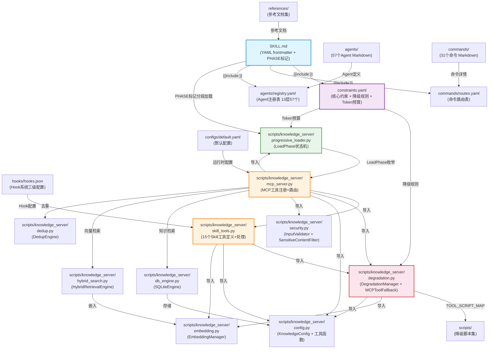

# Xuansto Skill v2 — 全面评审文档

> 版本: 8.0.0 | 评审日期: 2026-05-25 | Skill目录: `.trae/skills/xuansto-skill-v2/`

---

## 1. Skill定义文件全文解析

### 1.1 SKILL.md YAML Frontmatter

| 字段 | 值 |
|------|-----|
| `name` | `xuansto-skill-v2` |
| `version` | `8.0.0` |
| `agents_summary` | `"13 layers / 57 agents (via MCP v2)"` |
| `compatible_mcp_server` | `">=4.0.0"` |
| `mcp_server_min_version` | `"4.0.0"` |
| `min_version` | `1.0.0` |
| `v1_archived` | `true` |
| `license` | `MIT` |
| `author` | `skiller-team` |

**triggers 结构：**

| 类型 | 数量 | 示例 |
|------|------|------|
| `phrases` | 72 | `"build this properly"`, `"帮我搭建项目"`, `"TDD开发"`, `"桌面打包"` |
| `keywords` | 92 | `xuansto`, `SDD`, `TDD`, `spec-driven`, `9-phase-workflow`, `54-quality-gates` |
| `commands` | 31 | `/sprint`, `/implement`, `/audit`, `/build-desktop` 等 |
| `not_for` | 12 | `"simple single-file edits"`, `"documentation-only tasks"`, `"quick hotfixes under 5 lines"` |

### 1.2 PHASE标记渐进式加载

SKILL.md 通过 HTML 注释标记实现4阶段渐进式加载：

| Phase | 标记范围 | 内容 | Token预算 |
|-------|----------|------|-----------|
| Phase 0: 骨架 | `PHASE_0_START → PHASE_0_END` | YAML frontmatter + 命令列表 + MCP依赖 + 核心约束5条 | ≤2K |
| Phase 1: 功能 | `PHASE_0_START → PHASE_1_END` | +执行入口 + 工作流Phase概览 + 命令路由表(精简) + 核心Agent索引(13个) | ≤5K |
| Phase 2: 增强 | `PHASE_0_START → PHASE_2_END` | +完整命令路由表 + 完整Agent注册表(57个) + 外部参考文件 + MCP工具摘要 | ≤10K |
| Phase 3: 完整 | `PHASE_0_START → PHASE_3_END` | +Hook系统说明 + 模型路由说明 + 关键规则 | ≤20K |

**资源优先级映射：**

| 优先级 | 加载阶段 | 内容 |
|--------|----------|------|
| P0_must | Phase 0 | YAML frontmatter、命令列表、MCP依赖、核心约束 |
| P1_important | Phase 1 | 执行入口、工作流概览、精简路由表、核心Agent索引 |
| P2_enhanced | Phase 2 | 完整路由表、完整Agent注册表、参考文档、MCP工具摘要 |
| P3_optional | Phase 3 | Hook系统、模型路由、关键规则 |

### 1.3 核心约束5条

| # | ID | 规则 |
|---|-----|------|
| 1 | `spec-first` | **Spec > Test > Code**：先规格再测试最后代码，覆盖率≥80% |
| 2 | `karpathy` | **Karpathy准则**：Think Before Coding \| Simplicity First \| Surgical Changes |
| 3 | `incremental` | **增量约束**：分解→实现→测试→重复；3-Strike Protocol: 自动修复→换策略→升级处理 |
| 4 | `script-standard` | **脚本规范**：Python优先 \| UTF-8无BOM+无U+FFFD \| 验证后删除临时脚本 |
| 5 | `cross-platform` | **跨平台**：Web+Desktop(Electron/Tauri/Flutter)，桌面端需IPC安全+代码签名 |

### 1.4 命令路由表（精简版31个命令→MCP工具链→Phase映射）

| 意图 | 命令 | MCP工具链 | Phase |
|------|------|-----------|-------|
| 从零开始新项目 | `/init` | skill_analyze, knowledge_search, workflow_dispatch, project_init, decision_log | 0 |
| 头脑风暴/需求探索 | `/brainstorm` | knowledge_search, workflow_dispatch | 1 |
| 澄清需求 | `/clarify` | knowledge_search, workflow_dispatch, quality_gate_check | 1 |
| 规划架构 | `/plan` | skill_analyze, knowledge_search, agent_status, workflow_dispatch, decision_log, token_budget | 2 |
| 写规格文档 | `/spec` | workflow_dispatch, quality_gate_check, spec_drift_detect | 2 |
| 设计 | `/design` | quality_gate_check, knowledge_search, workflow_dispatch | 2 |
| 设计系统 | `/design-system` | quality_gate_check, knowledge_search, workflow_dispatch | 2 |
| 写代码 | `/implement` | workflow_dispatch, quality_gate_check, hook_manage | 4 |
| 跑测试 | `/test` | quality_gate_check, workflow_dispatch | 5 |
| 代码审查 | `/review` | quality_gate_check, security_scan, code_simplify | 5 |
| 安全审计 | `/audit` | security_scan, quality_gate_check, spec_drift_detect | 5 |
| 修复Bug | `/fix` | session_manage, quality_gate_check, hook_manage | 4 |
| 验收确认 | `/accept` | quality_gate_check, workflow_dispatch | 6 |
| 代码简化 | `/simplify` | code_simplify, quality_gate_check, context_compress | 7 |
| 代码重构 | `/refactor` | code_simplify, quality_gate_check, context_compress | 7 |
| 部署交付 | `/deploy` | quality_gate_check, server_health, workflow_dispatch | 8 |
| 构建项目 | `/build` | skill_analyze, quality_gate_check, server_health | 8 |
| 桌面构建 | `/build-desktop` | quality_gate_check, skill_analyze, workflow_dispatch | 8 |
| 桌面发布 | `/release-desktop` | quality_gate_check, workflow_dispatch | 8 |
| 冲刺 | `/sprint` | workflow_dispatch, session_manage, resource_load_status, token_budget, project_init | 0 |
| 知识学习 | `/learn` | knowledge_search, knowledge_inject, session_manage | — |
| 执行计划 | `/execute-plan` | workflow_dispatch, session_manage | — |
| 自主循环 | `/loop` | workflow_dispatch, session_manage, resource_load_status, token_budget, decision_log | — |
| 取消循环 | `/cancel-loop` | workflow_dispatch, session_manage | — |
| 查询Agent | `/agent-status` | agent_status | — |
| 查询进度 | `/status` | workflow_dispatch, session_manage, server_health | — |
| 回滚 | `/rollback` | session_manage, workflow_dispatch | — |
| 中等SDD+TDD | `/sdd-tdd-medium` | skill_analyze, workflow_dispatch, resource_load_status | 0 |
| 快速SDD+TDD | `/sdd-tdd-fast` | workflow_dispatch, resource_load_status | 1 |
| 决策记录 | `/decision` | decision_log | — |
| Token预算 | `/budget` | token_budget, resource_load_status | — |

### 1.5 Agent索引表（编排3+产品4+工程6=13个核心Agent）

| 层级 | Agent | Phase | 模型路由 |
|------|-------|-------|----------|
| 编排 | Orchestrator | 0, 1, 2 | deep |
| 编排 | Subagent Dispatcher | 0, 4, 5 | standard |
| 编排 | Task Coordinator | 0, 4, 5 | standard |
| 产品 | Product Manager | 1, 6 | standard |
| 产品 | Brainstorming Facilitator | 1 | standard |
| 产品 | System Architect | 2 | deep |
| 产品 | Technical Writer | 1, 6 | standard |
| 工程 | Backend Developer | 4 | standard |
| 工程 | Database Engineer | 4 | standard |
| 工程 | DevOps Engineer | 4, 8 | standard |
| 工程 | Frontend Developer | 4 | standard |
| 工程 | Fullstack Engineer | 4 | standard |
| 工程 | Mobile Developer | 4 | standard |

> 完整Agent注册表含13层57个Agent，详见 `agents/registry.yaml`。

### 1.6 MCP工具摘要表（20个工具名称+功能+关键参数）

| 工具 | 功能 | 关键参数 |
|------|------|----------|
| `skill_analyze` | 项目结构分析 | skill_path, depth(basic/full), include_scripts, include_agents |
| `knowledge_search` | 三层知识库检索 | query, top_k(1-50), search_type(hybrid/semantic_only/keyword_only), filters |
| `knowledge_inject` | 知识注入到上下文 | action, content, scope |
| `quality_gate_check` | 54项质量门禁 | gate_ids, phase(0-8), project_path, severity_filter(all/BLOCK/WARN), force_refresh |
| `spec_drift_detect` | 规格偏差检测 | spec_dir, src_dir |
| `security_scan` | OWASP+依赖扫描 | target, severity_threshold(critical/high/medium/low), include_agentic, include_dependency |
| `code_simplify` | 代码简化分析 | target, scope, include_dedup |
| `session_manage` | 会话状态管理 | action(init/catchup/persist), completed_tasks, decisions |
| `workflow_dispatch` | 工作流调度 | action(start/advance/status), workflow, project_path, phase |
| `agent_status` | Agent状态查询 | action, phase, agent_name |
| `agent_manage` | Agent实例管理 | action, agent_type, agent_id |
| `hook_manage` | Hook管理 | action(list/execute), profile(minimal/standard/strict), hook_name |
| `resource_load_status` | 渐进式加载状态 | action(status/preload/cache/clear_cache/loading_progress), target_phase(skeleton/functional/enhanced/full), resource_ids |
| `context_compress` | 上下文压缩 | content, strategy, target_tokens |
| `server_health` | 服务器健康检查 | action, include_details |
| `decision_log` | 决策日志管理 | action, title, decision |
| `token_budget` | Token预算管理 | action, total_budget |
| `project_init` | 项目初始化 | action, name, stack |
| `metrics_report` | 指标报告 | action, tool_name, time_range |
| `config_manage` | 配置管理 | action, config_key, config_value |

### 1.7 Hook系统说明（三级配置：minimal/standard/strict）

| 配置级别 | PreToolUse | PostToolUse | SessionStart | Stop | PreCompact |
|----------|------------|-------------|--------------|------|------------|
| **minimal** | security-block | — | — | session-save | — |
| **standard** | security-block, token-budget-check | auto-format, encoding-check | load-context, kb-health-check | session-save, git-status-check, experience-precipitate | save-state |
| **strict** | security-block, token-budget-check, dangerous-cmd-confirm | auto-format, encoding-check, console-log-detect, type-check | load-context, kb-health-check, platform-detect | session-save, git-status-check, experience-precipitate, pattern-detect | save-state, decision-log-persist |

**关键Hook定义：**

| Hook名称 | 类型 | 动作 | 说明 |
|----------|------|------|------|
| `security-block` | PreToolUse | block | 拦截危险操作(rm -rf, git push --force, DROP TABLE等) |
| `token-budget-check` | PreToolUse | warn/block | 80%警告, 95%阻断 |
| `dangerous-cmd-confirm` | PreToolUse | confirm | sudo/chmod等需确认 |
| `auto-format` | PostToolUse | format | 按文件类型自动格式化(prettier/black/gofmt/rustfmt) |
| `encoding-check` | PostToolUse | validate | UTF-8无BOM+无U+FFFD |
| `session-save` | Stop | save | 保存会话到.skill-logs/ |
| `experience-precipitate` | Stop | trigger | 触发知识沉淀 |

### 1.8 模型路由说明

| 路由 | 模型 | 适用场景 | Agent分配 |
|------|------|----------|-----------|
| `fast` | 轻量模型 | 搜索/简单编辑 | Data Seeder, Unit Tester, Bug Scanner, Comment Verifier, Doc Reviewer, Monitor Specialist, Token Optimizer, Quality Monitor, Progress Tracker, Decision Logger |
| `standard` | 标准模型 | 多文件实现/常规开发 | 大部分Agent(编排/产品/工程/测试/DevOps等) |
| `deep` | 深度模型 | 架构设计/安全分析 | Orchestrator, System Architect, Design System Generator, Native Module Developer, IPC Specialist, AI Penetration Tester, Security Tester, Security Auditor, Penetration Tester, Test Architect |

**路由规则：** Orchestrator/System Architect → deep；编排/产品层核心 → standard；简单查询 → fast

---

## 2. 功能逻辑分步拆解

### 2.1 执行入口

```
1. 平台检测 → 检查项目依赖和结构(package.json/Cargo.toml/go.mod/pyproject.toml/pubspec.yaml)
2. 规模评估 → 统计文件数判断规模(small/medium/large)，决定是否启用lean_mode
3. 工作流选择 → full/medium/fast（/sprint=full, /sdd-tdd-medium=medium, /sdd-tdd-fast=fast）
4. MCP+知识检索 → skill_analyze → knowledge_search → 注入Agent上下文
5. 执行Phase 0 → 按Phase顺序推进，每阶段过门禁
```

**平台检测优先级：** 显式声明 > 依赖分析 > 结构分析 > 默认Web

**规模评估与Agent合并：** 当 `project_scale < medium` 时自动合并Agent（如 security-tester + ai-penetration-tester、integration-tester + e2e-tester 等9条合并规则）

### 2.2 工作流9阶段

| Phase | 名称 | 目标 | MCP工具链 | 关键门禁 |
|-------|------|------|-----------|----------|
| **0** | 初始化 | 项目结构分析、平台检测、规模评估 | skill_analyze, workflow_dispatch, agent_status, resource_load_status | DESIGN-SYSTEM-COMPLETE, ANTI-PATTERN-CHECK |
| **1** | 需求分析 | 头脑风暴、需求澄清、用户故事 | knowledge_search, resource_load_status | BRAINSTORM-COMPLETE, GATE-001~002(SPEC-COMPLETE, REQUIREMENT-TRACEABLE) |
| **2** | 架构设计 | 技术选型、架构规划、规格编写 | knowledge_search, resource_load_status | PLAN-ATOMIC, GATE-003~004(ARCH-REVIEW, API-CONTRACT) |
| **3** | 测试先行 | 编写测试用例(TDD) | — | TEST-FIRST |
| **4** | 代码实现 | 增量编码、门禁检查 | quality_gate_check, agent_status | GATE-007, TEST-PASS, FILE-ENCODING |
| **5** | 测试验证 | 安全扫描、规格偏差检测 | security_scan, spec_drift_detect, agent_status | AI-PENTEST, SPEC-CONSISTENCY |
| **6** | 验收确认 | 产品验收、文档完善 | quality_gate_check | GATE-013~014, UX-ACCEPTANCE |
| **7** | 持续重构 | 代码简化、行为等价验证 | code_simplify, context_compress | SIMPLIFICATION-BEHAVIOR, GATE-015 |
| **8** | 部署交付 | 构建、签名、发布 | — | DESKTOP-BUILD/SIGN/UPDATE/CROSS |

### 2.3 每个Phase的关键门禁和MCP工具链

**Phase 0 — 初始化：**
- 门禁：DESIGN-SYSTEM-COMPLETE(BLOCK), ANTI-PATTERN-CHECK(WARN)
- 工具：skill_analyze → workflow_dispatch(start) → agent_status → resource_load_status

**Phase 1 — 需求分析：**
- 门禁：SPEC-COMPLETE(BLOCK), REQUIREMENT-TRACEABLE(WARN)
- 工具：knowledge_search(hybrid) → workflow_dispatch(advance) → quality_gate_check

**Phase 2 — 架构设计：**
- 门禁：ARCH-REVIEW(BLOCK), API-CONTRACT(WARN)
- 工具：knowledge_search → spec_drift_detect → quality_gate_check → decision_log

**Phase 3 — 测试先行：**
- 门禁：TEST-FIRST(BLOCK)
- 工具：无MCP工具依赖，内联TDD流程

**Phase 4 — 代码实现：**
- 门禁：GATE-007(BLOCK), TEST-PASS(BLOCK), FILE-ENCODING(WARN)
- 工具：workflow_dispatch → quality_gate_check → hook_manage(encoding-check)

**Phase 5 — 测试验证：**
- 门禁：AI-PENTEST(BLOCK), SPEC-CONSISTENCY(BLOCK)
- 工具：security_scan → spec_drift_detect → quality_gate_check

**Phase 6 — 验收确认：**
- 门禁：GATE-013~014(BLOCK), UX-ACCEPTANCE(WARN)
- 工具：quality_gate_check → workflow_dispatch

**Phase 7 — 持续重构：**
- 门禁：SIMPLIFICATION-BEHAVIOR(BLOCK), GATE-015(WARN)
- 工具：code_simplify → context_compress → quality_gate_check

**Phase 8 — 部署交付：**
- 门禁：DESKTOP-BUILD/SIGN/UPDATE/CROSS(BLOCK)
- 工具：server_health → quality_gate_check → workflow_dispatch

---

## 3. 交互模式分析

### 3.1 单轮交互

以下命令执行后立即返回结果，无需多轮对话：

| 命令 | 功能 | 输入 | 输出 |
|------|------|------|------|
| `/agent-status` | 查询Agent状态 | agent_name(可选) | Agent列表+状态JSON |
| `/budget` | Token预算查询 | — | 当前预算/已用/剩余JSON |
| `/decision` | 决策记录 | title, decision | 决策ID+时间戳JSON |
| `/status` | 进度查询 | — | 当前Phase/任务/健康状态JSON |
| `/cancel-loop` | 取消循环 | — | 循环终止确认JSON |
| `/rollback` | 回滚 | — | 恢复点信息JSON |
| `/learn` | 知识学习 | query | 知识检索结果JSON |

### 3.2 多轮交互

以下命令需要跨多个Phase持续执行，涉及多轮对话：

| 命令 | 跨越Phase | 交互模式 |
|------|-----------|----------|
| `/sprint` | 0→8 | 全流程自主循环，关键点暂停 |
| `/loop` | 动态 | 自主循环模式(autonomous/supervised/manual) |
| `/implement` | 4→5 | 编码→测试验证循环 |
| `/sdd-tdd-medium` | 0→8 | 中等规模SDD+TDD全流程 |
| `/sdd-tdd-fast` | 1→5 | 快速SDD+TDD精简流程 |
| `/execute-plan` | 动态 | 按计划逐步推进 |

### 3.3 输入输出格式

**输入格式：** 命令参数 → MCP工具JSON

```json
// 示例: /implement 命令调用 workflow_dispatch
{
  "action": "advance",
  "workflow": "sdd-tdd",
  "project_path": "/path/to/project",
  "phase": 4
}
```

**输出格式：** MCP工具JSON → 结果JSON

```json
// 示例: quality_gate_check 返回
{
  "status": "ok",
  "data": {
    "gates_checked": 54,
    "gates_passed": 52,
    "gates_failed": 2,
    "can_proceed": false,
    "results": [
      {
        "gate_id": "TEST-PASS",
        "status": "FAIL",
        "severity": "BLOCK",
        "message": "单元测试覆盖率 72% 低于阈值 80%",
        "details": { "coverage": 72, "threshold": 80 }
      }
    ]
  }
}
```

**降级模式输出：** 脚本降级时包装为相同JSON结构，附加 `"degraded": true` 标记。

---

## 4. 特效逻辑分析

### 4.1 渐进式加载实现

**Skill层（SKILL.md PHASE标记）：**

SKILL.md 通过 HTML 注释 `<!-- PHASE_N_START -->` / `<!-- PHASE_N_END -->` 将内容分为4段。Skill运行时按需加载对应段落的Markdown内容到LLM上下文中。

| 段落 | 标记 | 内容概要 |
|------|------|----------|
| Phase 0 | `PHASE_0_START → PHASE_0_END` | 核心元数据、命令列表、MCP依赖、5条约束 |
| Phase 1 | `PHASE_1_START → PHASE_1_END` | 执行入口、工作流概览、精简路由表、核心Agent索引 |
| Phase 2 | `PHASE_2_START → PHASE_2_END` | 完整路由表、完整Agent注册表、参考文档、MCP工具摘要 |
| Phase 3 | `PHASE_3_START → PHASE_3_END` | Hook系统、模型路由、关键规则 |

**MCP层（progressive_loader.py LoadPhase枚举）：**

```python
class LoadPhase(str, Enum):
    SKELETON = "skeleton"    # 对应 Phase 0
    FUNCTIONAL = "functional" # 对应 Phase 1
    ENHANCED = "enhanced"    # 对应 Phase 2
    FULL = "full"           # 对应 Phase 3
```

`ProgressiveLoader` 类维护 `LoadingState` 状态机，提供：
- `advance_phase(target_phase)`: 推进到目标阶段，加载对应资源
- `degrade_phase()`: 降级到上一阶段（FULL→ENHANCED→FUNCTIONAL→SKELETON）
- `can_access(resource_priority)`: 检查当前阶段是否可访问指定优先级资源
- `check_token_budget(usage, budget)`: Token预算超80%/95%时触发降级
- `get_available_commands()`: 获取当前阶段可用命令列表

**MCP层 resource_load_status 工具：** 通过 `action=status/preload/cache/clear_cache/loading_progress` 控制渐进式加载状态，返回当前阶段、已加载资源、可用命令、披露说明等。

### 4.2 当前实现方式

- **Skill层**：通过PHASE标记分段，Skill运行时按需将对应段落注入LLM上下文
- **MCP层**：`resource_load_status` 工具控制 `ProgressiveLoader` 状态机，管理资源加载和降级
- **两层协同**：Skill层读取SKILL.md段落 → MCP层通过 `resource_load_status(preload)` 推进加载阶段

### 4.3 与渐进式目标的差距

| 差距项 | 现状 | 目标 |
|--------|------|------|
| **双向同步缺失** | Skill层与MCP层缺乏双向同步机制。Skill层推进加载时不会通知MCP层，MCP层降级时Skill层不感知 | 两层应共享加载状态，变更时互相通知 |
| **降级不感知** | MCP层 `degrade_phase()` 触发降级后，Skill层上下文中已加载的PHASE段落不会自动移除 | Skill层应根据MCP层降级信号裁剪上下文 |
| **Token预算不同步** | Skill层Token预算由LLM上下文窗口控制，MCP层由 `check_token_budget()` 控制，两者独立计算 | 应统一Token预算管理，MCP层预算变更时同步到Skill层 |
| **资源ID不对应** | Skill层PHASE标记是Markdown段落，MCP层资源ID是字符串(如"command-route-full")，两者无显式映射 | 应建立PHASE标记到资源ID的映射表 |
| **SKELETON阶段命令空** | `_PHASE_COMMANDS[LoadPhase.SKELETON]` 为空列表，但SKILL.md Phase 0已展示命令名称 | SKELETON阶段应至少支持命令列表展示 |

---

## 5. 可复用模块清单/需废弃或重写部分

### 5.1 可复用模块

| 模块 | 路径 | 核心能力 | 复用价值 |
|------|------|----------|----------|
| **knowledge_server核心** | `scripts/knowledge_server/` | SQLite存储 + ChromaDB向量检索 + 混合搜索引擎 + 嵌入管理 | ⭐⭐⭐ 高：独立知识库服务，可被其他Skill复用 |
| **progressive_loader** | `scripts/knowledge_server/progressive_loader.py` | LoadPhase枚举 + LoadingState状态机 + 阶段推进/降级/资源管理 | ⭐⭐⭐ 高：通用渐进式加载框架 |
| **degradation降级链** | `scripts/knowledge_server/degradation.py` | DegradationManager(4级降级) + MCPToolFallback(脚本降级) | ⭐⭐⭐ 高：通用MCP降级框架 |
| **hybrid_search** | `scripts/knowledge_server/hybrid_search.py` | 语义+关键词混合检索引擎 | ⭐⭐ 中：依赖ChromaDB |
| **dedup** | `scripts/knowledge_server/dedup.py` | 知识条目去重引擎 | ⭐⭐ 中：知识库专用 |
| **security** | `scripts/knowledge_server/security.py` | InputValidator + SensitiveContentFilter + RateLimiter | ⭐⭐ 中：通用安全组件 |
| **Hook系统** | `hooks/hooks.json` | 三级配置(minimal/standard/strict) + 事件触发 | ⭐⭐ 中：通用Hook框架 |
| **Agent注册表** | `agents/registry.yaml` | 13层57个Agent定义 + 模型路由 + Phase映射 | ⭐⭐ 中：Agent编排基础 |

### 5.2 需重构模块

| 模块 | 路径 | 问题 | 重构建议 |
|------|------|------|----------|
| **skill_tools.py** | `scripts/knowledge_server/skill_tools.py` | 2300+行单文件，包含15个MCP工具定义+SkillToolHandler处理逻辑，职责过重 | 拆分为：`tool_definitions/`(工具定义)、`tool_handlers/`(处理逻辑)、`quality_gates.py`(门禁逻辑) |
| **mcp_server.py** | `scripts/knowledge_server/mcp_server.py` | 工具注册(`register_mcp_tools`)与处理逻辑(`call_tool`)耦合在同一函数中，1200+行 | 拆分为：`tool_registry.py`(注册)、`tool_router.py`(路由)、各工具独立handler |
| **constraints.yaml** | 根目录 | 降级映射(`tool_fallbacks`)硬编码在YAML中，与`degradation.py`中`TOOL_SCRIPT_MAP`重复 | 统一降级配置源，`degradation.py`从YAML读取而非硬编码 |
| **SKILL.md** | 根目录 | PHASE标记与MCP层LoadPhase枚举命名不一致(Phase 0 vs SKELETON) | 统一命名，建立显式映射 |

### 5.3 需废弃部分

| 废弃项 | 位置 | 原因 | 替代方案 |
|--------|------|------|----------|
| **硬编码降级映射** | `degradation.py` `MCPToolFallback.TOOL_SCRIPT_MAP` | 与`constraints.yaml`中`tool_fallbacks`重复定义，维护两处 | 从YAML配置读取降级映射，`MCPToolFallback`初始化时加载 |
| **_PHASE_COMMANDS空列表** | `progressive_loader.py` `LoadPhase.SKELETON` | SKELETON阶段命令列表为空，但SKILL.md Phase 0已展示命令名称 | SKELETON阶段应包含命令列表展示(只读) |
| **重复的门禁定义** | `skill_tools.py` `_QUALITY_GATES` | 与`references/quality-gates.md`定义重复 | 门禁定义统一从YAML/JSON加载 |

---

## 6. 依赖图



**依赖链说明：**

1. **SKILL.md** 是入口文件，通过 `{{include:}}` 指令内联加载 `constraints.yaml`、`routes.yaml`、`registry.yaml`
2. **mcp_server.py** 是MCP服务核心，注册所有工具并路由调用，依赖 `skill_tools.py`（Skill工具）、`progressive_loader.py`（加载状态）、`degradation.py`（降级管理）
3. **skill_tools.py** 定义15个Skill专用MCP工具（skill_analyze, quality_gate_check等），依赖 `degradation.py` 进行脚本降级
4. **progressive_loader.py** 实现4阶段状态机（SKELETON→FUNCTIONAL→ENHANCED→FULL），被 `mcp_server.py` 的 `resource_load_status` 工具调用
5. **degradation.py** 包含两层降级：`DegradationManager`（知识检索降级链 normal→local_semantic→bm25_only→file_search）和 `MCPToolFallback`（MCP工具脚本降级），通过 `TOOL_SCRIPT_MAP` 映射到 `scripts/` 目录下的降级脚本
6. **constraints.yaml** 定义核心约束、Token预算、降级规则，与 `degradation.py` 存在配置重复

---

*文档生成时间: 2026-05-25 | 基于 xuansto-skill-v2 v8.0.0 源码分析*
