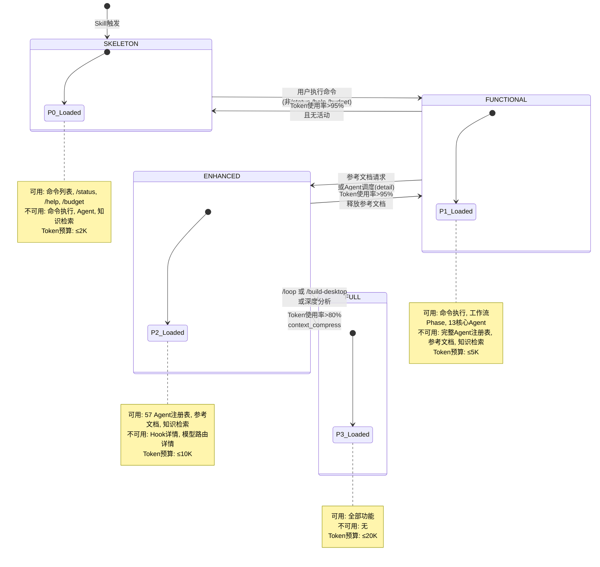

# Xuansto Skill v2 技能评审文档

> 版本: 8.5.0 | 评审日期: 2026-05-26 | 评审范围: SKILL.md、57个Agent、32个命令、20个MCP工具、降级脚本、渐进式加载

---

## 目录

1. [技能定义文件完整解析](#1-技能定义文件完整解析)
2. [功能逻辑逐步拆解](#2-功能逻辑逐步拆解)
3. [交互模式分析](#3-交互模式分析)
4. [特效逻辑分析（渐进式加载）](#4-特效逻辑分析渐进式加载)
5. [可复用模块列表 / 需废弃或重写的部分](#5-可复用模块列表--需废弃或重写的部分)
6. [依赖关系图](#6-依赖关系图)

---

## 1. 技能定义文件完整解析

### 1.1 SKILL.md 总体结构

SKILL.md 是技能的核心定义文件，共263行，采用 **4阶段PHASE标记** 实现渐进式加载。文件结构如下：

| 区域 | 行范围 | 标记 | 加载阶段 | 内容 |
|------|--------|------|----------|------|
| YAML Frontmatter | L1-L19 | — | Phase 0 | 元数据、触发条件、关键词、命令列表 |
| PHASE_0 | L21-L56 | `PHASE_0_START/END` | 骨架 | 命令列表、SKELETON可用命令、MCP依赖、核心约束 |
| PHASE_1 | L58-L137 | `PHASE_1_START/END` | 功能 | 执行入口、工作流Phase概览、命令路由表(精简)、核心Agent索引 |
| PHASE_2 | L139-L233 | `PHASE_2_START/END` | 增强 | 完整命令路由表、完整Agent注册表、参考文件索引、MCP工具摘要 |
| PHASE_3 | L235-L262 | `PHASE_3_START/END` | 完整 | Hook系统说明、模型路由说明、关键规则 |

### 1.2 触发条件解析

触发条件定义在 YAML Frontmatter 的 `triggers` 字段中，包含三类：

#### 1.2.1 phrases（短语触发）

共 **73个** 触发短语，覆盖中英文场景：

| 语言 | 示例 | 场景 |
|------|------|------|
| 英文 | "build this properly", "write tests first", "start a new project" | 全流程开发、TDD、项目搭建 |
| 中文 | "帮我搭建项目", "先写测试再写代码", "完整开发一个功能" | 全流程开发、测试先行、端到端 |

#### 1.2.2 keywords（关键词触发）

共 **100+个** 关键词，按领域分组：

| 领域 | 关键词示例 |
|------|-----------|
| 核心标识 | xuansto, SDD, TDD, spec-driven, test-driven |
| 架构概念 | multi-agent, agent-orchestration, autonomous-development |
| 桌面开发 | desktop-development, Electron, Tauri, Flutter |
| 安全审计 | OWASP, TrinityGuard, penetration-testing, security-audit |
| 质量控制 | quality-gates, 54-quality-gates, 57-agents, 32-commands |
| 中文关键词 | 全流程开发, 规格驱动, 测试先行, 桌面打包, 渗透测试 |

#### 1.2.3 commands（命令触发）

共 **32个** 斜杠命令：

```
/sprint /clarify /plan /spec /design /implement /test /review /fix /accept
/deploy /build-desktop /release-desktop /refactor /audit /agent-status /learn
/brainstorm /execute-plan /design-system /simplify /loop /cancel-loop /build
/init /status /help /rollback /sdd-tdd-medium /sdd-tdd-fast /decision /budget
```

#### 1.2.4 not_for（排除条件）

定义 **12种** 不适用场景，避免误触发：

| 排除场景 | 说明 |
|----------|------|
| simple single-file edits | 单文件简单编辑（加注释、修错字） |
| pure infrastructure/DevOps | 纯基础设施运维无代码变更 |
| documentation-only tasks | 纯文档任务无代码 |
| simple Q&A or explanations | 简单问答解释 |
| quick hotfixes under 5 lines | 5行以内的快速热修复 |

### 1.3 参数定义

SKILL.md 本身不直接定义运行时参数，参数通过以下间接方式提供：

| 参数来源 | 文件 | 说明 |
|----------|------|------|
| 命令参数 | `commands/[cmd].md` | 每个命令定义自己的参数表（如 /init 的 --type, --template 等） |
| 配置参数 | `configs/default.yaml` | 编排器、质量门禁、安全、Token优化等全局配置 |
| 运行时参数 | `.skill-config.yaml` | 循环控制、规划文件、按需加载、知识服务配置 |
| 约束参数 | `constraints.yaml` | Token预算、资源优先级、降级映射 |

### 1.4 提示词（Prompts）结构

SKILL.md 的提示词分布在4个PHASE段中，按渐进式方式加载到LLM上下文：

| PHASE | 提示词内容 | Token预算 |
|-------|-----------|-----------|
| PHASE_0 | 核心身份声明 + 命令列表 + 5条核心约束 | ≤2K |
| PHASE_1 | 执行入口5步骤 + 工作流9阶段概览 + 32命令精简路由 + 13核心Agent | ≤5K |
| PHASE_2 | 完整路由表(routes.yaml内联) + 完整Agent注册表(registry.yaml内联) + 参考文件索引 + 20 MCP工具摘要 | ≤10K |
| PHASE_3 | Hook三级配置 + 模型路由规则 + 关键规则集 | ≤20K |

### 1.5 脚本引用

SKILL.md 通过 `constraints.yaml` 的 `degradation.tool_fallbacks` 间接引用降级脚本：

| MCP工具 | 降级脚本 | 内联降级函数 |
|---------|----------|-------------|
| skill_analyze | `scripts/skill_analyze.py` | — |
| quality_gate_check | `scripts/quality_gate_check.py` | — |
| spec_drift_detect | `scripts/spec_drift_detect.py` | `_inline_spec_drift_detect` |
| security_scan | `scripts/security_scan.py` | `_inline_security_scan` |
| code_simplify | `scripts/code_simplify.py` | `_inline_code_simplify` |
| session_manage | `scripts/session_manage.py` | — |
| workflow_dispatch | `scripts/workflow_dispatch.py` | `_inline_workflow_dispatch` |
| agent_status | `scripts/agent_status.py` | `_inline_agent_status` |
| hook_manage | `scripts/hook_manage.py` | `_inline_hook_manage` |
| context_compress | `scripts/context_compress.py` | — |
| server_health | `scripts/server_health.py` | `_inline_server_health` |
| decision_log | `scripts/decision_log.py` | — |
| token_budget | `scripts/token_budget.py` | — |
| knowledge_inject | `scripts/knowledge_inject.py` | — |
| knowledge_search | `scripts/knowledge_search.py` | `_inline_knowledge_search` |
| resource_load_status | — | `_inline_resource_load_status` |
| project_init | `scripts/project_init.py` | `_inline_project_init` |
| agent_manage | — | `_inline_agent_manage` |
| metrics_report | `scripts/metrics_report.py` | `_inline_metrics_report` |
| config_manage | — | `_inline_config_manage` |

---

## 2. 功能逻辑逐步拆解

### 2.1 总体执行流程

从用户输入到最终输出，xuansto-skill-v2 的执行链路如下：

```
用户输入 → 触发条件匹配 → 渐进式加载推进 → 命令路由 → MCP工具调用链 → Agent调度 → 结果验证 → 输出
```

### 2.2 步骤1：触发与加载

**代码位置**: SKILL.md L1-L19 (YAML Frontmatter) + constraints.yaml L83-L157

| 步骤 | 操作 | 位置 |
|------|------|------|
| 1.1 | Trae引擎匹配 `triggers.phrases` / `triggers.keywords` / `triggers.commands` | SKILL.md L7-L11 |
| 1.2 | 排除 `not_for` 场景 | SKILL.md L11 |
| 1.3 | 加载 PHASE_0 段（骨架），Token预算≤2K | SKILL.md L21-L56 |
| 1.4 | 系统进入 SKELETON 阶段，仅 /status /help /budget 可用 | SKILL.md L33-L41 |
| 1.5 | 通过 `resource_load_status` 披露当前可用功能范围 | constraints.yaml L155-L157 |

### 2.3 步骤2：命令路由

**代码位置**: SKILL.md L82-L117 (精简路由) + routes.yaml (完整路由)

| 步骤 | 操作 | 位置 |
|------|------|------|
| 2.1 | 用户执行命令（如 /init），触发 SKELETON→FUNCTIONAL 推进 | constraints.yaml L107-L113 |
| 2.2 | 加载 PHASE_1 段，Token预算≤5K | SKILL.md L58-L137 |
| 2.3 | 按路由优先级匹配命令：精确匹配 > 语义匹配 > 更具体命令优先 > /sprint兜底 | routes.yaml L1 |
| 2.4 | 确定目标命令的 MCP工具链、工作流Phase、降级策略 | routes.yaml L3-L316 |
| 2.5 | 加载命令详细定义 `commands/[cmd].md` | routes.yaml 各 route.detail |

### 2.4 步骤3：MCP工具调用

**代码位置**: SKILL.md L208-L231 (MCP工具摘要) + references/mcp-tools.md (完整参数)

| 步骤 | 操作 | 位置 |
|------|------|------|
| 3.1 | 检测 MCP Server 可用性：调用 `skill_analyze` | constraints.yaml L186 |
| 3.2 | MCP可用 → 直接调用MCP工具，获取结构化JSON结果 | SKILL.md L208-L231 |
| 3.3 | MCP不可用 → 进入降级模式 | constraints.yaml L186-L257 |
| 3.4 | 降级链：MCP完整调用 → MCP简化调用 → Python脚本降级 → 内联降级 → 错误响应 | constraints.yaml L185-L257 |

**降级判定规则**（以 /loop 命令为例，参见 commands/loop.md）：

| Step | 策略 | 失败条件 |
|------|------|----------|
| Step 1 | MCP完整调用 | 返回错误码(DEGRADED/TIMEOUT/UNAVAILABLE)或超时>30秒 |
| Step 2 | MCP简化调用 | 仍返回错误或超时>15秒 |
| Step 3 | Python脚本降级 | 脚本执行失败则记录错误并跳过 |

### 2.5 步骤4：Agent调度

**代码位置**: registry.yaml (完整注册表) + agents/[layer]/[agent].md (Agent定义)

| 步骤 | 操作 | 位置 |
|------|------|------|
| 4.1 | Orchestrator 接收任务，查询 `agent_status` | agents/orchestrator/orchestrator.md L44-L51 |
| 4.2 | 根据工作流Phase确定需要的Agent层 | registry.yaml 各 agent.phases |
| 4.3 | 按模型路由分配执行策略：deep/standard/fast | registry.yaml 各 agent.model_routing |
| 4.4 | 执行Agent合并策略（精简模式下合并相似Agent） | configs/default.yaml L22-L51 |
| 4.5 | Agent执行任务，遵循STC规则(Spec>Test>Code) | agents/orchestrator/orchestrator.md L17 |

**Agent合并规则**（来自 configs/default.yaml L22-L51）：

| 合并组 | 条件 | 说明 |
|--------|------|------|
| security-tester + ai-penetration-tester | project_scale < medium | 安全测试合并 |
| integration-tester + e2e-tester | project_scale < medium | 测试合并 |
| documentation-engineer + specification-keeper | project_scale < medium | 文档合并 |
| cicd-specialist + devops-engineer | project_scale < small | DevOps合并 |
| desktop-developer + frontend-developer | desktop_framework == electron | Electron合并 |

### 2.6 步骤5：质量门禁检查

**代码位置**: references/quality-gates.md (54项门禁定义) + SKILL.md L70-L80 (门禁概览)

| 步骤 | 操作 | 位置 |
|------|------|------|
| 5.1 | 每个Phase转换时触发 `quality_gate_check` | SKILL.md L70-L80 |
| 5.2 | 检查当前Phase的所有BLOCK级门禁 | references/quality-gates.md |
| 5.3 | BLOCK门禁失败 → 阻止Phase推进，返回修复建议 | — |
| 5.4 | WARN门禁失败 → 记录警告，允许继续 | — |
| 5.5 | 门禁绕过需审批 | configs/default.yaml L59 |

**关键门禁分布**：

| Phase | 门禁 | 级别 |
|-------|------|------|
| 0 | DESIGN-SYSTEM-COMPLETE, ANTI-PATTERN-CHECK | BLOCK |
| 1 | BRAINSTORM-COMPLETE, GATE-001(需求完整性), GATE-002(规格一致性) | BLOCK |
| 2 | PLAN-ATOMIC, GATE-003(架构合理性), GATE-004(接口契约) | BLOCK |
| 3 | TEST-FIRST | BLOCK |
| 4 | GATE-007(代码规范), TEST-PASS, FILE-ENCODING | BLOCK |
| 5 | AI-PENTEST, SPEC-CONSISTENCY, AGENTIC-SECURITY | BLOCK |
| 6 | GATE-013(部署就绪), UX-ACCEPTANCE | BLOCK |
| 7 | SIMPLIFICATION-BEHAVIOR, GATE-015(迭代闭环) | BLOCK |
| 8 | DESKTOP-BUILD/SIGN/UPDATE/CROSS | BLOCK |

### 2.7 步骤6：Hook系统执行

**代码位置**: hooks/hooks.json + SKILL.md L237-L245

| 步骤 | 操作 | 位置 |
|------|------|------|
| 6.1 | 根据当前Hook配置级别(minimal/standard/strict)加载Hook | hooks/hooks.json L3-L24 |
| 6.2 | PreToolUse: 安全阻断(security-block)、Token预算检查 | hooks/hooks.json L27-L44 |
| 6.3 | PostToolUse: 自动格式化、编码检查、console.log检测 | hooks/hooks.json L47-L80 |
| 6.4 | SessionStart: 加载上下文、知识库健康检查、平台检测 | hooks/hooks.json L82-L99 |
| 6.5 | Stop: 会话保存、Git状态检查、经验沉淀 | hooks/hooks.json L101-L125 |
| 6.6 | PreCompact: 状态保存、决策日志持久化 | hooks/hooks.json L127-L137 |

### 2.8 步骤7：结果输出

| 输出类型 | 格式 | 示例 |
|----------|------|------|
| 命令执行结果 | 结构化Markdown报告 | init-report.md（见 commands/init.md L128-L169） |
| MCP工具返回 | 统一JSON: `{status, data, error, metadata}` | CHANGELOG.md L34-L36 |
| 降级结果 | JSON: `{status: "degraded"/"inline_degraded"/"error", ...}` | constraints.yaml L188 |
| 门禁检查 | JSON: `{gate_id, passed, level, message}` | references/quality-gates.md |
| 加载状态 | JSON: `{current_phase, loaded_resources, available_commands}` | references/progressive-loading.md L158-L174 |

---

## 3. 交互模式分析

### 3.1 单轮交互

单轮交互适用于简单命令，用户输入一个命令，系统执行后返回结果：

| 命令 | 交互模式 | 输入 | 输出 |
|------|----------|------|------|
| /status | 单轮 | 无参数 | 项目状态JSON |
| /help | 单轮 | 无参数 | 可用命令列表 |
| /budget | 单轮 | 可选action参数 | Token预算报告 |
| /agent-status | 单轮 | 可选agent_name | Agent状态信息 |
| /decision | 单轮 | title + decision | 决策记录确认 |

**单轮交互流程**：

```
用户输入 → 命令路由 → MCP工具调用(1-2个) → 结果返回
```

### 3.2 多轮交互

多轮交互适用于复杂工作流命令，需要多个Phase推进和Agent协作：

| 命令 | 交互模式 | Phase跨度 | Agent数 |
|------|----------|-----------|---------|
| /init | 多轮 | 0→1 | 3 (Orchestrator, System Architect, Knowledge Manager) |
| /sprint | 多轮 | 0→8 | 5+ |
| /loop | 多轮 | 0→8 | 8+ (全生命周期) |
| /implement | 多轮 | 4 | 3+ (工程层Agent) |
| /review | 多轮 | 5 | 5+ (质量+安全Agent) |
| /audit | 多轮 | 5 | 3+ (安全Agent) |

**多轮交互流程**（以 /loop 为例）：

```
/loop → SKELETON→FUNCTIONAL→ENHANCED→FULL(加载推进)
     → Clarify → Plan → Spec → Design → Implement → Test → Review → Accept → Deploy
     → 每阶段: MCP工具调用 → Agent调度 → 质量门禁 → Phase推进
     → Token超80%: context_compress → 可能降级
     → 全阶段完成或迭代次数达上限 → 输出最终报告
```

### 3.3 输入格式

| 输入方式 | 格式 | 示例 |
|----------|------|------|
| 斜杠命令 | `/command [options]` | `/init --type desktop` |
| 自然语言 | 触发短语/关键词 | "帮我从零搭建一个项目" |
| 参数化 | `--key=value` | `/loop --from=plan --to=test --interactive` |

### 3.4 输出格式

| 输出场景 | 格式 | 说明 |
|----------|------|------|
| 命令执行结果 | Markdown报告 | 含状态表格、创建文件列表、验证结果 |
| MCP工具响应 | 统一JSON | `{status, data, error, metadata}` |
| 门禁检查 | JSON | `{gate_id, passed, level, message, suggestions}` |
| 降级通知 | 文本+JSON | "功能不可用，已降级为xxx" + 降级结果JSON |
| 阶段转换 | 披露文本 | "命令详细步骤已加载，可执行命令" |

### 3.5 人机协作断点

系统在以下场景触发人机协作断点（来自 configs/default.yaml L198-L229）：

| 断点场景 | 默认行为 | 配置项 |
|----------|----------|--------|
| 验收失败 | 自动重试(最多3次) | `breakpoint_on_acceptance_failure: false` |
| 高影响规格漂移 | 自动适配 | `breakpoint_on_spec_drift_high: false` |
| 安全关键操作 | 自动执行+审计日志 | `breakpoint_on_security_critical: false` |
| 迭代卡住 | 自动重新规划 | `breakpoint_on_iteration_stuck: false` |
| 生产部署 | **必须人工确认** | `security_hard_gates: [production_deploy, ...]` |
| 密钥轮换 | **必须人工确认** | `security_hard_gates: [secret_key_rotation, ...]` |
| 破坏性数据库变更 | **必须人工确认** | `security_hard_gates: [database_schema_destructive_change]` |

---

## 4. 特效逻辑分析（渐进式加载）

### 4.1 实现方法

渐进式加载是 xuansto-skill-v2 的核心特效，通过 **SKILL.md PHASE标记 + MCP progressive_loader + resource_load_status工具** 三层协作实现。

#### 4.1.1 第一层：SKILL.md PHASE标记

SKILL.md 使用HTML注释标记将内容分为4段：

```
<!-- PHASE_0_START --> ... <!-- PHASE_0_END -->   → 骨架(≤2K Token)
<!-- PHASE_1_START --> ... <!-- PHASE_1_END -->   → 功能(≤5K Token)
<!-- PHASE_2_START --> ... <!-- PHASE_2_END -->   → 增强(≤10K Token)
<!-- PHASE_3_START --> ... <!-- PHASE_3_END -->   → 完整(≤20K Token)
```

Trae引擎按当前加载阶段截取SKILL.md内容，仅将对应PHASE段及之前的内容注入LLM上下文。

#### 4.1.2 第二层：MCP progressive_loader

`progressive_loader.py`（位于 xuansto-mcp-server）维护加载状态机：

```python
class LoadPhase(str, Enum):
    SKELETON = "skeleton"    # Phase 0
    FUNCTIONAL = "functional" # Phase 1
    ENHANCED = "enhanced"    # Phase 2
    FULL = "full"           # Phase 3
```

关键映射：

| 映射 | 来源 | 说明 |
|------|------|------|
| `COMMAND_PHASE_MAP` | progressive_loader.py | 32个命令→加载阶段映射 |
| `PHASE_SKILL_MAP` | progressive_loader.py | PHASE_0→SKELETON, PHASE_1→FUNCTIONAL, PHASE_2→ENHANCED, PHASE_3→FULL |
| `PHASE_TOKEN_BUDGET_MAP` | token_budget.py | 各阶段Token预算映射 |

#### 4.1.3 第三层：resource_load_status MCP工具

通过 `resource_load_status` 工具实现加载状态查询和推进：

| Action | 描述 | 阶段变更 |
|--------|------|----------|
| status | 查询当前加载状态 | 不变 |
| preload | 预加载指定Phase资源 | 推进到目标Phase |
| cache | 查询缓存状态 | 不变 |
| clear_cache | 清理缓存 | 降级到SKELETON |
| loading_progress | 查询加载进度 | 不变 |

### 4.2 加载方法

| 触发事件 | 加载动作 | 目标Phase |
|----------|----------|-----------|
| Skill首次触发 | 加载PHASE_0骨架 | SKELETON |
| 用户执行任意非SKELETON命令 | 加载PHASE_0+1 | FUNCTIONAL |
| Agent调度需要参考文档 | 加载PHASE_0+1+2 | ENHANCED |
| /loop 或 /build-desktop 命令 | 加载PHASE_0+1+2+3 | FULL |
| Token使用率>80% | context_compress压缩 | 降级到ENHANCED |
| Token使用率>95% | 释放参考文档缓存 | 降级到FUNCTIONAL/SKELETON |

### 4.3 与渐进式加载目标的差距

根据 references/progressive-loading.md 定义的目标与当前实现的对比：

| 指标 | 目标值 | 当前状态 | 差距分析 |
|------|--------|----------|----------|
| Skill触发时Token | ≤2,000 | PHASE_0≤2K ✅ | 已达标 |
| 单命令执行Token | ≤5,000 | PHASE_1≤5K ✅ | 已达标 |
| 全流程Token(9 Phase) | ≤30,000 | PHASE_3≤20K ✅ | 已达标 |
| Agent调度Token(单次) | ≤150/Agent | 依赖Agent定义大小 | **未验证** |
| 骨架加载时间 | ≤500ms | 依赖Trae引擎 | **未验证** |
| Phase资源预加载 | ≤2s/Phase | 依赖MCP Server | **未验证** |
| Agent定义按需加载 | ≤300ms/Agent | 依赖文件系统 | **未验证** |
| 知识检索响应 | ≤3s(hybrid) | 依赖ChromaDB | **未验证** |

**关键差距**：

1. **性能指标未实测**：Token消耗目标有理论值但缺乏实际基准测试数据
2. **Agent按需加载粒度不足**：当前按PHASE段整体加载，未实现单个Agent定义的按需加载（Phase 2加载全部57个Agent注册表，而非仅加载当前需要的Agent）
3. **参考文档两级加载未完全实现**：progressive-loading.md 定义了"摘要(~200 Token)→完整(~2000-5000 Token)"两级加载，但当前实现是全量加载参考文档
4. **Token驱动的自动降级缺乏实测**：Token>80%自动压缩、>95%自动降级的逻辑已定义但缺乏端到端验证
5. **{{include:}}内联加载机制**：SKILL.md使用`{{include:routes.yaml}}`等内联指令，实际加载时机由Trae引擎控制，Skill层无法精确控制

---

## 5. 可复用模块列表 / 需废弃或重写的部分

### 5.1 可复用模块

| 模块 | 文件/目录 | 复用价值 | 说明 |
|------|-----------|----------|------|
| 渐进式加载框架 | constraints.yaml (disclosure段) + references/progressive-loading.md | ⭐⭐⭐⭐⭐ | 4阶段加载+状态机+降级策略，可复用于其他大型Skill |
| 命令路由系统 | commands/routes.yaml + commands/*.md | ⭐⭐⭐⭐⭐ | 32命令路由+降级策略+MCP工具链映射，通用命令框架 |
| Agent注册表 | agents/registry.yaml + agents/**/*.md | ⭐⭐⭐⭐ | 13层57Agent分层架构，可扩展为通用Agent框架 |
| 降级引擎 | constraints.yaml (degradation段) | ⭐⭐⭐⭐⭐ | MCP→脚本→内联→错误 四级降级链，通用容错模式 |
| 质量门禁系统 | references/quality-gates.md | ⭐⭐⭐⭐ | 54项门禁+BLOCK/WARN/INFO三级，可复用于质量管控 |
| Hook系统 | hooks/hooks.json | ⭐⭐⭐⭐ | minimal/standard/strict三级配置+6类事件Hook |
| 模型路由 | SKILL.md L247-L255 + references/model-routing.md | ⭐⭐⭐ | fast/standard/deep三路由，可复用于多模型场景 |
| MCP工具摘要 | SKILL.md L208-L231 | ⭐⭐⭐ | 20个MCP工具参数速查表 |
| Token预算管理 | constraints.yaml (token_budgets段) + configs/default.yaml (token_optimization段) | ⭐⭐⭐⭐ | 分阶段Token预算+压缩策略+消耗日志 |
| 人机协作框架 | configs/default.yaml (human_collaboration段) | ⭐⭐⭐ | 断点触发+审批超时+安全硬门禁 |
| 知识检索降级链 | constraints.yaml L257 | ⭐⭐⭐ | ChromaDB→SQLite FTS→关键词匹配三级降级 |
| Agent合并策略 | configs/default.yaml (agent_merge_policy段) | ⭐⭐⭐ | 9条合并规则，按项目规模自动精简Agent |

### 5.2 需废弃或重写的部分

| 模块 | 文件/目录 | 问题 | 建议 |
|------|-----------|------|------|
| v1遗留文件 | `.trae/skills/xuansto-skill/` | P3-01: v1与v2重复文件，维护成本增加 | **废弃**：标记v1为archived，删除v1目录 |
| SKILL.md全量加载 | SKILL.md (263行) | P3-02: 虽有PHASE标记，但Trae引擎可能全量加载 | **重写**：将PHASE_2/3的内容完全外置到references/，SKILL.md仅保留引用URI |
| 硬编码降级映射 | degradation.py (MCPToolFallback) | P1-05已修复为YAML驱动，但仍有硬编码回退 | **重写**：完全移除硬编码回退，YAML读取失败时直接报错而非静默降级 |
| routes.yaml与SKILL.md路由表重复 | routes.yaml + SKILL.md L82-L117 | 精简路由表与完整路由表内容重复 | **重写**：SKILL.md仅保留路由入口说明，完整路由统一由routes.yaml提供 |
| registry.yaml与SKILL.md Agent索引重复 | registry.yaml + SKILL.md L119-L136 | 核心Agent索引与完整注册表内容重复 | **重写**：SKILL.md仅保留Agent层数统计，完整信息统一由registry.yaml提供 |
| 参考文档全量加载 | references/ (79+文件) | Phase 2加载时可能一次性注入过多参考文档 | **重写**：实现参考文档的摘要→完整两级加载 |
| commands/*.md参数定义 | commands/*.md | 部分命令参数定义与MCP工具参数存在冗余 | **优化**：命令参数直接引用MCP工具Schema，避免双源维护 |
| hooks.json静态配置 | hooks/hooks.json | Hook配置为静态JSON，无法根据Phase动态调整 | **重写**：Hook配置与加载阶段联动，SKELETON阶段仅启用minimal |

### 5.3 模块间耦合度评估

| 耦合对 | 耦合度 | 说明 |
|--------|--------|------|
| SKILL.md ↔ constraints.yaml | 高 | `{{include:constraints.yaml}}` 内联加载，SKILL.md直接依赖constraints结构 |
| SKILL.md ↔ routes.yaml | 高 | `{{include:commands/routes.yaml}}` 内联加载 |
| SKILL.md ↔ registry.yaml | 高 | `{{include:agents/registry.yaml}}` 内联加载 |
| routes.yaml ↔ commands/*.md | 中 | routes.yaml引用commands/*.md作为detail |
| registry.yaml ↔ agents/**/*.md | 中 | registry.yaml引用agents/层目录下的.md文件 |
| commands/*.md ↔ MCP工具 | 中 | 每个命令定义MCP工具调用链 |
| agents/**/*.md ↔ references/ | 低 | Agent定义引用references/作为补充文档 |
| hooks.json ↔ MCP工具 | 低 | Hook触发MCP工具调用但不直接依赖 |

---

## 6. 依赖关系图

### 6.1 文件调用链总览

```mermaid
graph TD
    subgraph "Skill定义层"
        SKILL["SKILL.md<br/>(4 PHASE段)"]
        CONFIG[".skill-config.yaml<br/>(运行时配置)"]
        DEFAULT["configs/default.yaml<br/>(默认配置)"]
        CONSTRAINTS["constraints.yaml<br/>(约束+降级)"]
    end

    subgraph "命令层"
        ROUTES["commands/routes.yaml<br/>(32命令路由)"]
        CMD_INIT["commands/init.md"]
        CMD_LOOP["commands/loop.md"]
        CMD_IMPL["commands/implement.md"]
        CMD_TEST["commands/test.md"]
        CMD_REVIEW["commands/review.md"]
        CMD_OTHER["commands/*.md<br/>(其余27个命令)"]
    end

    subgraph "Agent层"
        REGISTRY["agents/registry.yaml<br/>(57 Agent/13层)"]
        AGT_ORCH["agents/orchestrator/<br/>orchestrator.md"]
        AGT_PROD["agents/product/<br/>product-manager.md<br/>system-architect.md"]
        AGT_ENG["agents/engineering/<br/>backend-developer.md<br/>frontend-developer.md"]
        AGT_TEST["agents/testing/<br/>test-architect.md<br/>ai-penetration-tester.md"]
        AGT_SEC["agents/security/<br/>security-auditor.md"]
        AGT_OTHER["agents/其他9层/<br/>(设计/跨平台/数据/DevOps/质量/文档/知识/监控)"]
    end

    subgraph "参考文档层"
        REF_QG["references/quality-gates.md<br/>(54项门禁)"]
        REF_MCP["references/mcp-tools.md<br/>(20 MCP工具)"]
        REF_WF["references/workflow-phases.md<br/>(9阶段工作流)"]
        REF_AR["references/agent-registry.md"]
        REF_PL["references/progressive-loading.md"]
        REF_OTHER["references/*.md<br/>(74+其他参考)"]
    end

    subgraph "Hook层"
        HOOKS["hooks/hooks.json<br/>(3级配置+14个Hook)"]
    end

    subgraph "MCP工具层 (xuansto-mcp-server)"
        MCP_SA["skill_analyze"]
        MCP_KS["knowledge_search"]
        MCP_QG["quality_gate_check"]
        MCP_WD["workflow_dispatch"]
        MCP_AS["agent_status"]
        MCP_SS["security_scan"]
        MCP_SD["spec_drift_detect"]
        MCP_CS["code_simplify"]
        MCP_SM["session_manage"]
        MCP_OTHER_TOOLS["其余12个MCP工具"]
    end

    subgraph "降级脚本层"
        SCRIPTS["scripts/*.py<br/>(14个降级脚本)"]
        INLINE["内联降级函数<br/>(_inline_*)"]
    end

    SKILL -->|"{{include:}}"| CONSTRAINTS
    SKILL -->|"{{include:}}"| ROUTES
    SKILL -->|"{{include:}}"| REGISTRY
    SKILL -->|"引用"| REF_QG
    SKILL -->|"引用"| REF_MCP
    SKILL -->|"引用"| REF_WF
    SKILL -->|"引用"| REF_PL
    SKILL -->|"配置"| CONFIG
    SKILL -->|"配置"| DEFAULT
    SKILL -->|"配置"| HOOKS

    ROUTES -->|"detail引用"| CMD_INIT
    ROUTES -->|"detail引用"| CMD_LOOP
    ROUTES -->|"detail引用"| CMD_IMPL
    ROUTES -->|"detail引用"| CMD_TEST
    ROUTES -->|"detail引用"| CMD_REVIEW
    ROUTES -->|"detail引用"| CMD_OTHER

    REGISTRY -->|"file引用"| AGT_ORCH
    REGISTRY -->|"file引用"| AGT_PROD
    REGISTRY -->|"file引用"| AGT_ENG
    REGISTRY -->|"file引用"| AGT_TEST
    REGISTRY -->|"file引用"| AGT_SEC
    REGISTRY -->|"file引用"| AGT_OTHER

    CMD_INIT -->|"MCP调用"| MCP_SA
    CMD_INIT -->|"MCP调用"| MCP_KS
    CMD_INIT -->|"MCP调用"| MCP_WD
    CMD_LOOP -->|"MCP调用"| MCP_SA
    CMD_LOOP -->|"MCP调用"| MCP_KS
    CMD_LOOP -->|"MCP调用"| MCP_QG
    CMD_LOOP -->|"MCP调用"| MCP_WD
    CMD_IMPL -->|"MCP调用"| MCP_WD
    CMD_IMPL -->|"MCP调用"| MCP_QG
    CMD_TEST -->|"MCP调用"| MCP_QG
    CMD_REVIEW -->|"MCP调用"| MCP_QG
    CMD_REVIEW -->|"MCP调用"| MCP_SS

    CONSTRAINTS -->|"降级映射"| SCRIPTS
    CONSTRAINTS -->|"降级映射"| INLINE

    AGT_ORCH -->|"参考"| REF_OTHER
    AGT_PROD -->|"参考"| REF_OTHER
    AGT_ENG -->|"参考"| REF_OTHER

    HOOKS -->|"触发"| MCP_SA
    HOOKS -->|"触发"| MCP_KS
```



### 6.2 命令→MCP工具调用链

```mermaid
graph LR
    subgraph "Phase 0 命令"
        INIT["/init"]
        SPRINT["/sprint"]
        STATUS["/status"]
        HELP["/help"]
        BUDGET_CMD["/budget"]
    end

    subgraph "Phase 1-2 命令"
        BRAINSTORM["/brainstorm"]
        CLARIFY["/clarify"]
        PLAN["/plan"]
        SPEC["/spec"]
        DESIGN["/design"]
    end

    subgraph "Phase 4-5 命令"
        IMPLEMENT["/implement"]
        FIX["/fix"]
        TEST["/test"]
        REVIEW["/review"]
        AUDIT["/audit"]
    end

    subgraph "Phase 6-8 命令"
        ACCEPT["/accept"]
        SIMPLIFY["/simplify"]
        REFACTOR["/refactor"]
        DEPLOY["/deploy"]
        BUILD["/build"]
        BUILD_DESK["/build-desktop"]
    end

    subgraph "跨Phase命令"
        LOOP["/loop"]
        LEARN["/learn"]
        ROLLBACK["/rollback"]
    end

    subgraph "MCP工具"
        SA["skill_analyze"]
        KS["knowledge_search"]
        QG["quality_gate_check"]
        WD["workflow_dispatch"]
        AS["agent_status"]
        SS["security_scan"]
        SD["spec_drift_detect"]
        CS["code_simplify"]
        SM["session_manage"]
        HM["hook_manage"]
        RLS["resource_load_status"]
        CC["context_compress"]
        SH["server_health"]
        DL["decision_log"]
        TB["token_budget"]
        PI["project_init"]
        KI["knowledge_inject"]
        AM["agent_manage"]
        MR["metrics_report"]
        CM["config_manage"]
    end

    INIT --> SA & KS & WD & PI & DL
    SPRINT --> WD & SM & RLS & TB & PI
    STATUS --> WD & SM & SH
    HELP --> RLS
    BUDGET_CMD --> TB & RLS

    BRAINSTORM --> KS & WD
    CLARIFY --> KS & WD & QG
    PLAN --> SA & KS & AS & WD & DL & TB
    SPEC --> WD & QG & SD
    DESIGN --> QG & KS & WD

    IMPLEMENT --> WD & QG & HM
    FIX --> SM & QG & HM
    TEST --> QG & WD
    REVIEW --> QG & SS & CS
    AUDIT --> SS & QG & SD

    ACCEPT --> QG & WD
    SIMPLIFY --> CS & QG & CC
    REFACTOR --> CS & QG & CC
    DEPLOY --> QG & SH & WD
    BUILD --> SA & QG & SH
    BUILD_DESK --> QG & SA & WD

    LOOP --> WD & SM & RLS & TB & DL
    LEARN --> KS & KI & SM
    ROLLBACK --> SM & WD
```



### 6.3 Agent→Phase→模型路由映射

```mermaid
graph TD
    subgraph "模型路由"
        DEEP["deep<br/>(架构设计/安全分析)"]
        STANDARD["standard<br/>(多文件实现)"]
        FAST["fast<br/>(搜索/简单编辑)"]
    end

    subgraph "编排层 (3)"
        ORCH["Orchestrator<br/>Phase: 0,1,2"]
        SD["Subagent Dispatcher<br/>Phase: 0,4,5"]
        TC["Task Coordinator<br/>Phase: 0,4,5"]
    end

    subgraph "产品层 (4)"
        PM["Product Manager<br/>Phase: 1,6"]
        BF["Brainstorming Facilitator<br/>Phase: 1"]
        SA["System Architect<br/>Phase: 2"]
        TW["Technical Writer<br/>Phase: 1,6"]
    end

    subgraph "设计层 (4)"
        DSG["Design System Generator<br/>Phase: 2"]
        UX["UX Designer<br/>Phase: 2"]
        FS["Frontend Stylist<br/>Phase: 4"]
        UI["UI Designer<br/>Phase: 2"]
    end

    subgraph "工程层 (6)"
        BE["Backend Developer<br/>Phase: 4"]
        DBE["Database Engineer<br/>Phase: 4"]
        DOE["DevOps Engineer<br/>Phase: 4,8"]
        FE["Frontend Developer<br/>Phase: 4"]
        FSE["Fullstack Engineer<br/>Phase: 4"]
        MD["Mobile Developer<br/>Phase: 4"]
    end

    subgraph "测试层 (10)"
        TA["Test Architect<br/>Phase: 3"]
        UT["Unit Tester<br/>Phase: 3,4"]
        APT["AI Penetration Tester<br/>Phase: 5"]
        ST["Security Tester<br/>Phase: 5"]
        QA["QA Engineer<br/>Phase: 5,6"]
    end

    subgraph "安全层 (3)"
        SEC_A["Security Auditor<br/>Phase: 5"]
        CO["Compliance Officer<br/>Phase: 5,6"]
        PT["Penetration Tester<br/>Phase: 5"]
    end

    ORCH --> DEEP
    SA --> DEEP
    DSG --> DEEP
    APT --> DEEP
    ST --> DEEP
    SEC_A --> DEEP
    PT --> DEEP
    NMD["Native Module Developer<br/>Phase: 4"] --> DEEP
    IPC["IPC Specialist<br/>Phase: 4,5"] --> DEEP

    SD --> STANDARD
    TC --> STANDARD
    PM --> STANDARD
    BF --> STANDARD
    TW --> STANDARD
    UX --> STANDARD
    UI --> STANDARD
    BE --> STANDARD
    DBE --> STANDARD
    DOE --> STANDARD
    FE --> STANDARD
    FSE --> STANDARD
    MD --> STANDARD
    QA --> STANDARD
    CO --> STANDARD

    UT --> FAST
    DS["Data Seeder<br/>Phase: 4"] --> FAST
    BS["Bug Scanner<br/>Phase: 5"] --> FAST
    CV["Comment Verifier<br/>Phase: 5"] --> FAST
    DR["Doc Reviewer<br/>Phase: 6"] --> FAST
    MS["Monitor Specialist<br/>Phase: 8"] --> FAST
    TO["Token Optimizer<br/>Phase: 0,7"] --> FAST
    QM["Quality Monitor<br/>Phase: 0,5"] --> FAST
    PTR["Progress Tracker<br/>Phase: 0,6"] --> FAST
    DLG["Decision Logger<br/>Phase: 0,2,6"] --> FAST
```



### 6.4 渐进式加载状态机



---

## 附录A：文件清单统计

| 目录 | 文件数 | 说明 |
|------|--------|------|
| 根目录 | 5 | SKILL.md, .skill-config.yaml, PROBLEM.md, CHANGELOG.md, MIGRATION.md |
| agents/ | 58 | registry.yaml + 13层57个Agent定义.md |
| commands/ | 33 | routes.yaml + 32个命令定义.md |
| configs/ | 1 | default.yaml |
| hooks/ | 1 | hooks.json |
| references/ | 79+ | 57个agent-details + 22个核心参考文档 |
| constraints.yaml | 1 | 核心约束与降级规则 |
| **总计** | **178+** | — |

## 附录B：版本演进摘要

| 版本 | 日期 | 关键变更 |
|------|------|----------|
| 8.0.0 | 2026-05-24 | MCP Server + Skill 混合架构，57 Agent，54 门禁，31 命令 |
| 8.1.0 | 2026-05-26 | MCP Resource 27个，SKELETON基础命令 |
| 8.2.0 | 2026-05-26 | Streamable HTTP传输，审计日志，统一响应 |
| 8.3.0 | 2026-05-26 | Agent/Workflow持久化，Token-Phase链接，Hook超时，配置热重载 |
| 8.4.0 | 2026-05-26 | API版本协商，双写一致性，知识版本清理 |
| 8.5.0 | 2026-05-26 | 双SQLite合并，降级映射20/20，54门禁完整，32命令映射，Schema验证 |

## 附录C：已知问题摘要

| 优先级 | 总数 | 已修复 | 未修复 | 缓解 |
|--------|------|--------|--------|------|
| P0 | 2 | 2 | 0 | 0 |
| P1 | 6 | 6 | 0 | 0 |
| P2 | 2 | 2 | 0 | 0 |
| P3 | 2 | 0 | 1 | 1 |
| 架构(ARCH) | 8 | 8 | 0 | 0 |
| 数据库(DB) | 3 | 3 | 0 | 0 |
| MCP | 2 | 2 | 0 | 0 |
| Skill | 3 | 3 | 0 | 0 |
| API | 2 | 2 | 0 | 0 |
| 新增(v8.5.0) | 7 | 7 | 0 | 0 |
| **总计** | **37** | **35** | **1** | **1** |

未修复项：P3-01（v1与v2重复文件）
缓解项：P3-02（SKILL.md行数超限，已通过PHASE标记渐进式加载缓解）
