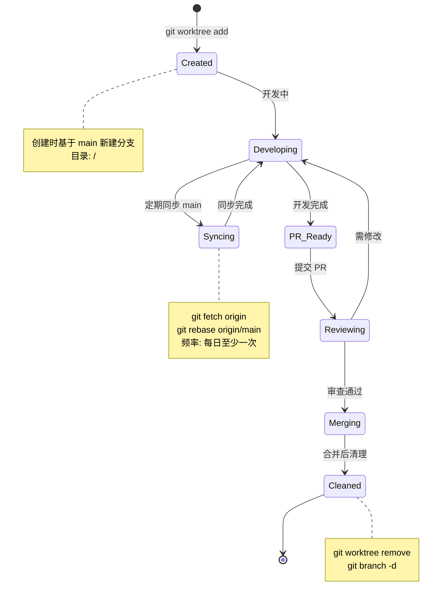
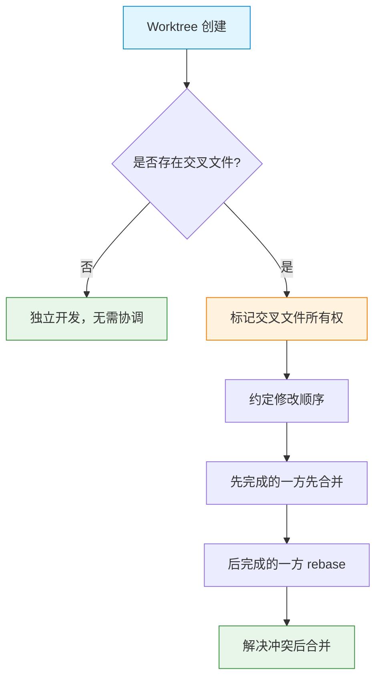
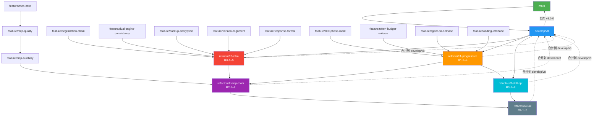
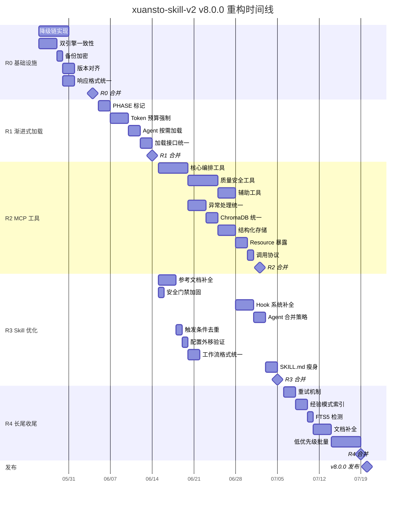
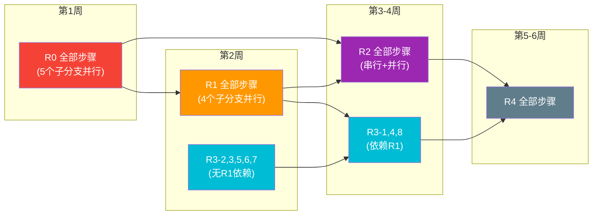

# Git/GitHub 管理文档

> 版本: 8.0.0 | 编写日期: 2026-05-24 | 编码: UTF-8 | 行尾: LF
> 适用范围: xuansto-skill-v2 全仓库（含 `.trae/skills/xuansto-skill-v2/` 子目录与 `xuansto-mcp-server/` 子项目）

---

## 目录

1. [Git Worktree 并行开发策略](#1-git-worktree-并行开发策略)
2. [本地分支管理](#2-本地分支管理)
3. [.gitignore 审查与优化](#3-gitignore-审查与优化)
4. [.gitattributes 审查与优化](#4-gitattributes-审查与优化)
5. [.git/info/exclude 本地忽略规则](#5-gitinfoexclude-本地忽略规则)
6. [.github/ 目录审查与优化](#6-github-目录审查与优化)
7. [可执行的操作命令序列](#7-可执行的操作命令序列)
8. [分支与重构步骤映射](#8-分支与重构步骤映射)

---

## 1. Git Worktree 并行开发策略

### 1.1 目录结构

基于 REFACTOR_PLAN.md 的 5 个重构阶段（R0–R4），为每个阶段创建独立 worktree，实现并行开发且互不干扰：

```
<repo-root>/                              ← 主仓库 (main)
<worktree-base>/
├── skiller/r0-infra/                     ← R0: 基础设施修复
│   └── 分支: refactor/r0-infra
├── skiller/r1-progressive/               ← R1: 渐进式加载基础
│   └── 分支: refactor/r1-progressive
├── skiller/r2-mcp-tools/                 ← R2: MCP 工具补全
│   └── 分支: refactor/r2-mcp-tools
├── skiller/r3-skill-opt/                 ← R3: Skill 层优化
│   └── 分支: refactor/r3-skill-opt
├── skiller/r4-tail/                      ← R4: 长尾收尾
│   └── 分支: refactor/r4-tail
├── skiller/feat-add-plan-document/       ← 功能分支示例
│   └── 分支: feat-add-plan-document-dsFOMQ
└── skiller/hotfix-*/                     ← 热修复分支
    └── 分支: hotfix/<issue-id>
```

> **约定**：`<worktree-base>` 默认为 `~/.trae-cn/worktrees/skiller/`，即与当前 worktree 一致。

### 1.2 Worktree 生命周期



### 1.3 并行开发矩阵

| Worktree | 分支 | 对应阶段 | 修改域 | 与其他 Worktree 交叉文件 |
|----------|------|----------|--------|--------------------------|
| r0-infra | `refactor/r0-infra` | R0 基础设施 | `degradation.py`, `db_engine.py`, `backup.py`, `mcp_server.py`, `api_routes.py` | `mcp_server.py`（与 R2 交叉） |
| r1-progressive | `refactor/r1-progressive` | R1 渐进式加载 | `SKILL.md`, `constraints.yaml`, `configs/default.yaml`, `agents/` | `SKILL.md`（与 R3 交叉） |
| r2-mcp-tools | `refactor/r2-mcp-tools` | R2 MCP 工具 | `mcp_server.py`, `hybrid_search.py`, `vector_engine.py`, 新增工具文件 | `mcp_server.py`（与 R0 交叉） |
| r3-skill-opt | `refactor/r3-skill-opt` | R3 Skill 优化 | `SKILL.md`, `hooks/`, `triggers.yaml`, `workflows/`, `references/` | `SKILL.md`（与 R1 交叉） |
| r4-tail | `refactor/r4-tail` | R4 长尾收尾 | `hybrid_search.py`, `experience/`, 低优先级文件 | 分散，冲突概率低 |

### 1.4 冲突预防策略



**关键交叉文件处理规则**：

| 交叉文件 | 优先修改权 | 后修改方策略 |
|----------|-----------|-------------|
| `mcp_server.py` | R0（响应格式统一是 R2 的前置） | R2 rebase R0 后再修改 |
| `SKILL.md` | R1（PHASE 标记是 R3 的前置） | R3 rebase R1 后再瘦身 |
| `constraints.yaml` | R1（加载配置） | R3 只读，不修改 |

### 1.5 Worktree 管理脚本

```bash
#!/usr/bin/env bash
# scripts/wt-manage.sh — Worktree 生命周期管理

WORKTREE_BASE="${HOME}/.trae-cn/worktrees/skiller"

wt_create() {
    local branch="$1"
    local slug
    slug="$(echo "$branch" | tr '/' '-')"
    local dir="${WORKTREE_BASE}/${slug}"
    if [ -d "$dir" ]; then
        echo "⚠️  Worktree 已存在: $dir"
        return 1
    fi
    git worktree add "$dir" -b "$branch" origin/main
    echo "✅ 创建 worktree: $dir (分支: $branch)"
}

wt_sync() {
    local slug
    for dir in "${WORKTREE_BASE}"/*/; do
        [ -d "$dir" ] || continue
        slug="$(basename "$dir")"
        echo "🔄 同步: $slug"
        (cd "$dir" && git fetch origin && git rebase origin/main)
    done
}

wt_status() {
    echo "📋 Worktree 状态:"
    git worktree list
    echo ""
    for dir in "${WORKTREE_BASE}"/*/; do
        [ -d "$dir" ] || continue
        slug="$(basename "$dir")"
        ahead=$(cd "$dir" && git rev-list --count origin/main..HEAD 2>/dev/null || echo "?")
        dirty=$(cd "$dir" && git status --porcelain | wc -l)
        echo "  $slug: ahead=${ahead}, dirty=${dirty}"
    done
}

wt_cleanup() {
    local branch="$1"
    local slug
    slug="$(echo "$branch" | tr '/' '-')"
    local dir="${WORKTREE_BASE}/${slug}"
    git worktree remove "$dir"
    git branch -d "$branch"
    echo "✅ 清理完成: $branch"
}
```

---

## 2. 本地分支管理

### 2.1 分支总览

| 分支名 | 类型 | 基分支 | 用途 | 生命周期 |
|--------|------|--------|------|----------|
| `main` | 长期 | — | 生产就绪代码 | 永久 |
| `develop/v8` | 长期 | `main` | v8.0.0 开发集成分支 | 永久（至 v8 发布） |
| `refactor/r0-infra` | 重构 | `develop/v8` | R0 基础设施修复 | 临时（合并后删除） |
| `refactor/r1-progressive` | 重构 | `develop/v8` | R1 渐进式加载基础 | 临时 |
| `refactor/r2-mcp-tools` | 重构 | `develop/v8` | R2 MCP 工具补全 | 临时 |
| `refactor/r3-skill-opt` | 重构 | `develop/v8` | R3 Skill 层优化 | 临时 |
| `refactor/r4-tail` | 重构 | `develop/v8` | R4 长尾收尾 | 临时 |
| `feature/mcp-core` | 功能 | `refactor/r2-mcp-tools` | MCP 核心编排工具实现 | 临时 |
| `feature/progressive-loading` | 功能 | `refactor/r1-progressive` | 渐进式加载机制 | 临时 |
| `feature/degradation-chain` | 功能 | `refactor/r0-infra` | 降级链实际实现 | 临时 |
| `feature/dual-engine-consistency` | 功能 | `refactor/r0-infra` | 双引擎一致性保障 | 临时 |
| `feature/token-budget-enforce` | 功能 | `refactor/r1-progressive` | Token 预算运行时强制 | 临时 |
| `feature/skill-phase-mark` | 功能 | `refactor/r1-progressive` | SKILL.md PHASE 标记 | 临时 |
| `feature/agent-on-demand` | 功能 | `refactor/r1-progressive` | Agent 按需加载 | 临时 |
| `hotfix/*` | 热修复 | `main` | 紧急线上修复 | 临时 |

### 2.2 分支创建与合并时机

```mermaid
gitgraph
    commit id: "v7-stable"
    branch develop/v8
    checkout develop/v8
    commit id: "init-v8-dev"

    branch refactor/r0-infra
    checkout refactor/r0-infra
    commit id: "R0-1: 降级链"
    commit id: "R0-2: 双引擎"
    commit id: "R0-3: 备份加密"
    commit id: "R0-4: 版本对齐"
    commit id: "R0-5: 响应格式"

    checkout develop/v8
    merge refactor/r0-infra id: "merge-R0"

    branch refactor/r1-progressive
    checkout refactor/r1-progressive
    commit id: "R1-1: PHASE标记"
    commit id: "R1-2: Token预算"
    commit id: "R1-3: Agent按需"
    commit id: "R1-4: 加载接口"

    checkout develop/v8
    merge refactor/r1-progressive id: "merge-R1"

    branch refactor/r2-mcp-tools
    checkout refactor/r2-mcp-tools
    commit id: "R2-1~8: MCP工具"

    checkout develop/v8
    merge refactor/r2-mcp-tools id: "merge-R2"

    branch refactor/r3-skill-opt
    checkout refactor/r3-skill-opt
    commit id: "R3-1~8: Skill优化"

    checkout develop/v8
    merge refactor/r3-skill-opt id: "merge-R3"

    branch refactor/r4-tail
    checkout refactor/r4-tail
    commit id: "R4-1~5: 长尾"

    checkout develop/v8
    merge refactor/r4-tail id: "merge-R4"

    checkout main
    merge develop/v8 id: "v8.0.0-release" tag: "v8.0.0"
```

### 2.3 分支创建规则

| 规则 | 说明 |
|------|------|
| 命名格式 | `<type>/<scope>[-<detail>]`，如 `feature/mcp-core`、`refactor/r0-infra` |
| 基分支选择 | 重构分支基于 `develop/v8`；功能分支基于对应重构分支；热修复基于 `main` |
| 单一职责 | 每个分支只解决一个 UNIFIED 问题或一个重构步骤 |
| 合并前必须 | 通过 CI + 代码审查 + 至少 1 人 approve |
| 合并方式 | `--no-ff`（保留分支历史）或 Squash Merge（保持主分支整洁） |
| 合并后清理 | 删除远程+本地分支，移除 worktree |

### 2.4 分支保护规则

```yaml
branch_protection:
  main:
    required_pull_request_reviews:
      dismiss_stale_reviews: true
      require_code_owner_reviews: true
      required_approving_review_count: 2
    required_status_checks:
      strict: true
      contexts: ["CI / test (3.11)", "CI / skill-validate"]
    enforce_admins: true
    restrictions: null

  develop/v8:
    required_pull_request_reviews:
      dismiss_stale_reviews: true
      required_approving_review_count: 1
    required_status_checks:
      strict: true
      contexts: ["CI / test (3.11)", "CI / skill-validate"]
    enforce_admins: false
```

---

## 3. .gitignore 审查与优化

### 3.1 审查原则

只让 Git 管理满足以下**全部三个条件**的文件：

1. **不可从其他源文件直接生成** — 可自动生成的文件（编译产物、缓存、依赖目录）不纳入
2. **对项目构建和运行必不可少** — 临时脚本、调试文件、个人工具不纳入
3. **不包含个人或机密信息** — 环境变量、密钥、本地路径不纳入

### 3.2 当前 .gitignore 逐条审查

| 行 | 规则 | 判定 | 理由 |
|----|------|------|------|
| 1 | `.trae/*` | ✅ 保留 | Trae IDE 配置，非项目必需；选择性跟踪入口 |
| 2 | `!.trae/skills/` | ✅ 保留 | 白名单：skill 定义需版本管理 |
| 3 | `.trae/skills/*` | ✅ 保留 | 忽略其他 skill |
| 4 | `!.trae/skills/xuansto-skill-v2/` | ✅ 保留 | 白名单：本项目 skill |
| 6-7 | `.trae/.../temp-scripts/*` + `.gitkeep` | ✅ 保留 | .knowledge/ 临时脚本，可自动生成；保留目录结构 |
| 8-9 | `.trae/.../script-errors/*` + `.gitkeep` | ✅ 保留 | .knowledge/ 运行时错误日志，非源文件；保留目录结构 |
| 10 | `.trae/.../knowledge.db` | ✅ 保留 | .knowledge/ 数据库文件，可从源重建 |
| 11 | `.trae/.../backup/` | ✅ 保留 | .knowledge/ 备份目录，含敏感数据 |
| 13 | `.xuansto/` | ✅ 保留 | 本地运行时目录 |
| 15-18 | `.venv/`, `.venv2/`, `.venv_test/`, `.testvenv/` | ✅ 保留 | 虚拟环境，可重建 |
| 19-21 | `__pycache__/`, `*.py[cod]`, `*$py.class` | ✅ 保留 | Python 编译缓存（含 Cython 半编译类） |
| 22-23 | `*.egg-info/`, `*.whl` | ✅ 保留 | Python 包构建元数据与分发包，可自动生成 |
| 25-27 | `.DS_Store`, `Thumbs.db`, `._*` | ✅ 保留 | OS 元数据 |
| 29-33 | `.idea/`, `.vscode/`, `.claude/`, `.cursor/`, `.windsurf/` | ✅ 保留 | IDE/编辑器配置（含 Claude、Cursor、Windsurf 等 AI 编辑器） |
| 34-36 | `*.swp`, `*.swo`, `*~` | ✅ 保留 | Vim 交换文件与备份文件 |
| 38-40 | `.env`, `.env.local`, `.env.*.local` | ✅ 保留 | 环境变量，含机密信息 |
| 42-43 | `*.log`, `logs/` | ✅ 保留 | 日志文件，可自动生成 |
| 45-46 | `*.db`, `*.sqlite3` | ✅ 保留 | 数据库文件，可从源重建 |
| 48-52 | `.mypy_cache/`, `.pytest_cache/`, `.ruff_cache/`, `htmlcov/`, `.coverage` | ✅ 保留 | Python 工具缓存与覆盖率报告 |
| 54-58 | `*.bak`, `*.orig`, `*.tmp`, `*.temp`, `.cache/` | ✅ 保留 | 备份、冲突残留、临时文件与通用缓存 |
| 60-62 | `node_modules/`, `dist/`, `build/` | ✅ 保留 | Node.js 依赖与构建产物 |

> **注意**：`docs/` 目录**未**在 .gitignore 中，所有文档（含 `docs/plan/`）均纳入版本管理。

### 3.3 优化建议

当前 .gitignore 已经过充分优化，所有规则均符合 §3.1 审查原则，无需增删。以下是对关键设计决策的说明：

#### 已正确实现的选择性跟踪

| 设计决策 | 实现方式 | 说明 |
|----------|----------|------|
| `.trae/` 选择性跟踪 | `.trae/*` → `!.trae/skills/` → `.trae/skills/*` → `!.trae/skills/xuansto-skill-v2/` | 四行嵌套白名单，仅跟踪本项目 skill |
| `.knowledge/` 临时文件排除 | `temp-scripts/*` + `.gitkeep`、`script-errors/*` + `.gitkeep` | 忽略运行时产物，保留目录骨架 |
| `.knowledge/` 备份排除 | `.knowledge/backup/` | 备份含敏感数据，不纳入版本管理 |
| Python 字节码全覆盖 | `__pycache__/`、`*.py[cod]`、`*$py.class` | 覆盖 CPython 字节码与 Cython 半编译类 |
| Vim 交换/备份文件 | `*.swp`、`*.swo`、`*~` | 覆盖 Vim 编辑器临时文件 |
| AI 编辑器配置排除 | `.claude/`、`.cursor/`、`.windsurf/` | 覆盖 Claude Code、Cursor、Windsurf 等 AI 编辑器 |
| Python 工具缓存 | `.mypy_cache/`、`.pytest_cache/`、`.ruff_cache/`、`htmlcov/`、`.coverage` | 类型检查、测试、Lint 缓存与覆盖率报告 |
| 临时/备份文件 | `*.bak`、`*.orig`、`*.tmp`、`*.temp`、`.cache/` | 覆盖手动备份、merge 残留、临时文件与通用缓存 |
| Node.js 生态 | `node_modules/`、`dist/`、`build/` | 依赖目录与构建产物 |
| `docs/` 不忽略 | — | `docs/` 目录未在 .gitignore 中，所有文档均纳入版本管理 |

#### 无需调整的说明

此前版本可能存在以下问题规则，但当前 .gitignore 中已不存在：

| 曾存在的问题规则 | 当前状态 | 说明 |
|------------------|----------|------|
| `xuansto-clean/`、`副本/` | ❌ 不存在 | 含义不明的个人目录，已移除 |
| `CHANGELOG.md`、`CODE_WIKI.md`、`xuansto-skill-WIKI.md` | ❌ 不存在 | 文档不应被忽略，已移除 |
| `*_helper.ps1/py`、`setup-worktree.ps1`、`test-*.ps1` | ❌ 不存在 | 辅助脚本不应被忽略，已移除 |
| `docs/*` + `!docs/plan/` | ❌ 不存在 | 文档应整体纳入管理，已移除 |

### 3.4 当前 .gitignore 完整内容

> 以下为仓库根目录 `.gitignore` 的当前完整内容，已与 §3.2 审查结果一致，无需修改。

```gitignore
.trae/*
!.trae/skills/
.trae/skills/*
!.trae/skills/xuansto-skill-v2/

.trae/skills/xuansto-skill-v2/.knowledge/temp-scripts/*
!.trae/skills/xuansto-skill-v2/.knowledge/temp-scripts/.gitkeep
.trae/skills/xuansto-skill-v2/.knowledge/script-errors/*
!.trae/skills/xuansto-skill-v2/.knowledge/script-errors/.gitkeep
.trae/skills/xuansto-skill-v2/.knowledge/index/knowledge.db
.trae/skills/xuansto-skill-v2/.knowledge/backup/

.xuansto/

.venv/
.venv2/
.venv_test/
.testvenv/
__pycache__/
*.py[cod]
*$py.class
*.egg-info/
*.whl

.DS_Store
Thumbs.db
._*

.idea/
.vscode/
.claude/
.cursor/
.windsurf/
*.swp
*.swo
*~

.env
.env.local
.env.*.local

*.log
logs/

*.db
*.sqlite3

.mypy_cache/
.pytest_cache/
.ruff_cache/
htmlcov/
.coverage

*.bak
*.orig
*.tmp
*.temp
.cache/

node_modules/
dist/
build/
```

### 3.5 Skill 级 .gitignore 审查

当前 `.trae/skills/xuansto-skill-v2/.gitignore` 与根级存在重复规则。优化策略：

| 规则 | 根级 | Skill 级 | 建议 |
|------|------|----------|------|
| `__pycache__/`, `*.py[cod]` | ✅ | ✅ | Skill 级保留（独立可移植） |
| `*.db`, `*.sqlite3` | ✅ | ✅ | Skill 级保留 |
| `.DS_Store`, `Thumbs.db` | ✅ | ✅ | Skill 级保留 |
| `.idea/`, `.vscode/` | ✅ | ✅ | Skill 级保留 |
| `.env` 系列 | ✅ | ✅ | Skill 级保留 |
| `*.log` | ✅ | ✅ | Skill 级保留 |
| `node_modules/`, `dist/`, `build/` | ✅ | ✅ | Skill 级保留 |
| `*.tmp`, `*.temp`, `.cache/` | ✅ | ✅ | 根级与 Skill 级均已覆盖 |
| `.knowledge/backup/` | ✅ | ❌ | 根级已覆盖（`.trae/.../backup/`）；Skill 级无需重复 |

---

## 4. .gitattributes 审查与优化

### 4.1 审查原则

将所有与平台、环境、工具相关的文件行为，**显式声明**在仓库里，确保：

1. **跨平台行尾一致** — Windows/macOS/Linux 检出行为一致
2. **二进制文件正确标记** — 防止 Git 尝试文本合并导致损坏
3. **diff 输出可读** — 为特定文件类型指定 diff 驱动
4. **合并策略明确** — 声明哪些文件不应自动合并

### 4.2 当前 .gitattributes 逐条审查

| 行 | 规则 | 判定 | 说明 |
|----|------|------|------|
| 1 | `* text=auto eol=lf` | ✅ 保留 | 全局 LF 行尾，跨平台一致 |
| 3-5 | `*.py/pyx/pyi text eol=lf diff=python` | ✅ 保留 | Python 文件正确标记 |
| 7-8 | `*.md text eol=lf diff=markdown`, `*.rst text eol=lf` | ✅ 保留 | 文档文件 |
| 10-16 | `*.yaml/yml diff=yaml`, `*.json diff=json`, `*.toml diff=toml`, `*.cfg/ini/conf text eol=lf` | ✅ 保留 | 配置文件，含 diff 驱动 |
| 18-24 | `*.js diff=javascript`, `*.ts diff=typescript`, `*.jsx diff=javascript`, `*.tsx diff=typescript`, `*.css diff=css`, `*.scss/html text eol=lf` | ✅ 保留 | 前端文件，含 diff 驱动 |
| 26-28 | `*.sh/bash text eol=lf`, `*.ps1 text eol=crlf` | ✅ 保留 | Shell 用 LF，PowerShell 用 CRLF |
| 30-31 | `*.xml text eol=lf`, `*.svg text eol=lf` | ✅ 保留 | 标记语言 |
| 33-36 | `*.gitignore/gitattributes/editorconfig text eol=lf`, `.git-blame-ignore-revs text eol=lf` | ✅ 保留 | Git/编辑器配置 |
| 38-40 | `*.lock text eol=lf merge=union`, `*.patch text eol=lf`, `*.env.example text eol=lf` | ✅ 保留 | 锁文件、补丁、环境变量模板 |
| 42 | `LICENSE text eol=lf` | ✅ 保留 | 许可证 |
| 44-69 | 二进制文件标记（含 `*.wasm`, `*.webp`, `*.woff2`, `*.ttf`, `*.otf`, `*.mp4`, `*.mp3` 等） | ✅ 保留 | 防止文本合并 |
| 71 | `resource_state.json merge=union` | ✅ 保留 | JSON 状态文件，合并时取并集 |

### 4.3 已实现的规则补充

当前 .gitattributes 已包含以下此前可能缺失的规则，无需再添加：

| 规则 | 当前状态 | 说明 |
|------|----------|------|
| `*.yaml diff=yaml` | ✅ 已存在 | YAML 文件 diff 驱动 |
| `*.json diff=json` | ✅ 已存在 | JSON 文件 diff 驱动 |
| `*.toml diff=toml` | ✅ 已存在 | TOML 配置文件 diff 驱动 |
| `*.css diff=css` | ✅ 已存在 | CSS 文件 diff 驱动 |
| `*.tsx diff=typescript` | ✅ 已存在 | TSX 文件使用 TypeScript diff |
| `*.jsx diff=javascript` | ✅ 已存在 | JSX 文件使用 JavaScript diff |
| `*.lock text eol=lf merge=union` | ✅ 已存在 | 锁文件行尾与合并策略 |
| `*.patch text eol=lf` | ✅ 已存在 | 补丁文件 |
| `*.wasm binary` | ✅ 已存在 | WebAssembly 二进制 |
| `*.webp binary` | ✅ 已存在 | WebP 图片 |
| `*.woff2/ttf/otf binary` | ✅ 已存在 | 字体文件 |
| `*.mp4/mp3 binary` | ✅ 已存在 | 音视频文件 |
| `.git-blame-ignore-revs text eol=lf` | ✅ 已存在 | blame 忽略修订 |
| `*.conf text eol=lf` | ✅ 已存在 | 服务器配置文件 |
| `*.env.example text eol=lf` | ✅ 已存在 | 环境变量模板（不含机密） |

### 4.4 合并策略声明

对于自动合并可能导致数据损坏的文件，应声明合并策略：

| 规则 | 原因 |
|------|------|
| `*.db binary` | 已有，SQLite 数据库不应合并 |
| `*.sqlite3 binary` | 已有 |
| `*.pkl binary` | 已有，Python pickle 文件 |
| `*.parquet binary` | 已有 |
| `resource_state.json merge=union` | JSON 状态文件，合并时取并集 |
| `*.lock merge=union` | 锁文件合并策略 |

### 4.5 当前 .gitattributes 完整内容

> 以下为仓库根目录 `.gitattributes` 的当前完整内容，已与 §4.2 审查结果一致，无需修改。

```gitattributes
* text=auto eol=lf

*.py text eol=lf diff=python
*.pyx text eol=lf diff=python
*.pyi text eol=lf diff=python

*.md text eol=lf diff=markdown
*.rst text eol=lf

*.yaml text eol=lf diff=yaml
*.yml text eol=lf diff=yaml
*.json text eol=lf diff=json
*.toml text eol=lf diff=toml
*.cfg text eol=lf
*.ini text eol=lf
*.conf text eol=lf

*.js text eol=lf diff=javascript
*.ts text eol=lf diff=typescript
*.jsx text eol=lf diff=javascript
*.tsx text eol=lf diff=typescript
*.css text eol=lf diff=css
*.scss text eol=lf
*.html text eol=lf

*.sh text eol=lf
*.bash text eol=lf
*.ps1 text eol=crlf

*.xml text eol=lf
*.svg text eol=lf

*.gitignore text eol=lf
*.gitattributes text eol=lf
*.editorconfig text eol=lf
.git-blame-ignore-revs text eol=lf

*.lock text eol=lf merge=union
*.patch text eol=lf
*.env.example text eol=lf

LICENSE text eol=lf

*.db binary
*.sqlite3 binary
*.so binary
*.dll binary
*.exe binary
*.pyd binary
*.wasm binary
*.png binary
*.jpg binary
*.jpeg binary
*.gif binary
*.ico binary
*.webp binary
*.pdf binary
*.zip binary
*.tar binary
*.gz binary
*.whl binary
*.egg binary
*.pkl binary
*.parquet binary
*.woff2 binary
*.ttf binary
*.otf binary
*.mp4 binary
*.mp3 binary

resource_state.json merge=union
```

### 4.6 Skill 级 .gitattributes 审查

当前 `.trae/skills/xuansto-skill-v2/.gitattributes` 是根级的子集，缺少以下规则：

| 缺失规则 | 建议 |
|----------|------|
| `*.toml text eol=lf diff=toml` | 补充 |
| `*.tsx text eol=lf diff=typescript` | 补充 |
| `*.sh text eol=lf` | 补充 |
| `*.svg text eol=lf` | 补充 |
| `*.pkl binary` | 补充 |
| `*.parquet binary` | 补充 |

Skill 级 `.gitattributes` 应保持与根级一致，确保 skill 目录独立可移植。

---

## 5. .git/info/exclude 本地忽略规则

### 5.1 用途

`.git/info/exclude` 与 `.gitignore` 功能相同，但**不会被提交到仓库**，仅影响本地。适用于：

- 个人实验性文件
- 本地调试脚本
- 临时大文件
- 不想影响团队其他成员的忽略规则

### 5.2 推荐配置

```gitignore
# === 个人实验性文件 ===
scratch/
playground/
sandbox/

# === 本地调试脚本 ===
debug_*.py
test_local_*.py
profile_*.py

# === 临时大文件 ===
*.dump
*.prof
*.heap

# === 本地文档草稿 ===
NOTES.md
TODO_LOCAL.md

# === Trae 工作树临时文件 ===
.trae-cn/

# === 本地数据库副本 ===
*_local.db
*_copy.db

# === 性能分析 ===
*.lprof
*.stat
```

### 5.3 .gitignore vs .git/info/exclude 对比

| 特性 | `.gitignore` | `.git/info/exclude` |
|------|-------------|---------------------|
| 是否提交到仓库 | ✅ 是 | ❌ 否 |
| 影响范围 | 所有协作者 | 仅本地 |
| 适用场景 | 项目通用忽略规则 | 个人/临时忽略规则 |
| 优先级 | 按目录层级叠加 | 最高（与 .gitignore 同级） |

---

## 6. .github/ 目录审查与优化

### 6.1 当前结构

```
.github/
├── ISSUE_TEMPLATE/
│   ├── bug_report.yml
│   ├── config.yml
│   └── feature_request.yml
├── workflows/
│   └── ci.yml
├── FUNDING.yml
└── PULL_REQUEST_TEMPLATE.md
```

### 6.2 各文件审查

#### 6.2.1 bug_report.yml

| 项目 | 当前状态 | 优化建议 |
|------|----------|----------|
| 组件选择 | ✅ MCP Server / Skill 二选一 | 补充 `Knowledge Base`、`Agent System`、`Degradation Chain` 选项 |
| 版本字段 | ✅ 有 | 改为下拉选择（v7.x / v8.0.0-dev），减少自由输入错误 |
| 严重级别 | ❌ 缺失 | 新增 `severity` 字段（P0-P3） |
| 复现频率 | ❌ 缺失 | 新增 `frequency` 字段（Always / Often / Sometimes / Rarely） |
| 降级影响 | ❌ 缺失 | 新增 `degradation_impact` 字段（MCP 不可用时是否仍可工作） |

#### 6.2.2 feature_request.yml

| 项目 | 当前状态 | 优化建议 |
|------|----------|----------|
| 组件选择 | ✅ 有 | 同 bug_report 补充选项 |
| 优先级评估 | ❌ 缺失 | 新增 `priority_assessment` 字段 |
| 影响的 UNIFIED 编号 | ❌ 缺失 | 新增 `unified_issue` 字段，关联 REFACTOR_PLAN |
| 渐进式加载级别 | ❌ 缺失 | 新增 `target_phase` 字段（Level 0-3） |

#### 6.2.3 config.yml

| 项目 | 当前状态 | 优化建议 |
|------|----------|----------|
| blank_issues_enabled | ✅ `false` | 保持 |
| contact_links | ✅ 有 Documentation 链接 | 补充 `Discussions` 链接和 `Security Policy` 链接 |

#### 6.2.4 PULL_REQUEST_TEMPLATE.md

| 项目 | 当前状态 | 优化建议 |
|------|----------|----------|
| 变更类型 | ✅ 基本分类 | 补充 `Degradation fix`、`Phase loading`、`MCP tool` 选项 |
| 组件 | ✅ MCP Server / Skill | 补充 `Knowledge Base`、`Agent System` |
| 关联 Issue | ❌ 缺失 | 新增 `Related Issues` 字段 |
| UNIFIED 编号 | ❌ 缺失 | 新增 `UNIFIED Issue #` 字段 |
| 降级测试 | ❌ 缺失 | 新增 `Degradation chain tested` 复选框 |
| Phase 加载测试 | ❌ 缺失 | 新增 `Progressive loading tested` 复选框 |
| 破坏性变更说明 | ❌ 缺失 | 新增 `BREAKING CHANGE` 说明区 |

#### 6.2.5 ci.yml

| 项目 | 当前状态 | 优化建议 |
|------|----------|----------|
| Python 版本矩阵 | ✅ 3.10/3.11/3.12 | 保持 |
| Lint | ✅ ruff check | 补充 mypy 类型检查 |
| 测试 | ✅ pytest | 补充覆盖率报告、标记分类测试 |
| Skill YAML 校验 | ✅ 有 | 补充 JSON Schema 校验 |
| 触发分支 | ✅ main/develop | 补充 `develop/v8` 和 `refactor/*` |
| 缓存 | ❌ 缺失 | 新增 pip 缓存 |
| 定时任务 | ❌ 缺失 | 新增每日降级测试 |

#### 6.2.6 FUNDING.yml

| 项目 | 当前状态 | 优化建议 |
|------|----------|----------|
| 赞助链接 | ✅ 有 | 保持 |

### 6.3 优化后的文件内容

#### 6.3.1 优化后 bug_report.yml

```yaml
name: Bug Report
description: Report a bug in xuansto-mcp-server or xuansto-skill-v2
labels: ["bug"]
body:
  - type: checkboxes
    id: component
    attributes:
      label: Component
      options:
        - label: MCP Server (xuansto-mcp-server)
        - label: Skill (xuansto-skill-v2)
        - label: Knowledge Base
        - label: Agent System
        - label: Degradation Chain
  - type: dropdown
    id: severity
    attributes:
      label: Severity
      description: Impact severity level
      options:
        - P0 - System down / Data loss
        - P1 - Core feature broken
        - P2 - Feature degraded
        - P3 - Minor inconvenience
    validations:
      required: true
  - type: dropdown
    id: version
    attributes:
      label: Version
      options:
        - v8.0.0-dev
        - v7.x
        - other
    validations:
      required: true
  - type: textarea
    id: description
    attributes:
      label: Bug Description
    validations:
      required: true
  - type: textarea
    id: steps
    attributes:
      label: Steps to Reproduce
    validations:
      required: true
  - type: textarea
    id: expected
    attributes:
      label: Expected Behavior
    validations:
      required: true
  - type: textarea
    id: actual
    attributes:
      label: Actual Behavior
    validations:
      required: true
  - type: dropdown
    id: frequency
    attributes:
      label: Reproduction Frequency
      options:
        - Always
        - Often
        - Sometimes
        - Rarely
  - type: checkboxes
    id: degradation
    attributes:
      label: Degradation Impact
      options:
        - label: MCP unavailable, fallback works
        - label: MCP unavailable, fallback also broken
        - label: Not applicable (MCP available)
  - type: textarea
    id: environment
    attributes:
      label: Environment
      description: OS, Python version, MCP client
  - type: textarea
    id: logs
    attributes:
      label: Relevant Logs
      render: shell
```

#### 6.3.2 优化后 PULL_REQUEST_TEMPLATE.md

```markdown
## Description

Brief description of changes.

## Type of Change

- [ ] Bug fix
- [ ] New feature
- [ ] Breaking change
- [ ] Documentation update
- [ ] Refactoring
- [ ] Degradation fix
- [ ] Phase loading change
- [ ] MCP tool addition/fix

## Component

- [ ] MCP Server (xuansto-mcp-server)
- [ ] Skill (xuansto-skill-v2)
- [ ] Knowledge Base
- [ ] Agent System
- [ ] Degradation Chain

## Related Issues

Closes #

## UNIFIED Issue

- [ ] Addresses UNIFIED-XX

## Testing

- [ ] Unit tests pass
- [ ] Integration tests pass
- [ ] Degradation chain tested (MCP unavailable scenario)
- [ ] Progressive loading tested (Phase transition)
- [ ] Manual testing performed

## Breaking Changes

- [ ] No breaking changes
- [ ] Breaking changes (describe below)

## Checklist

- [ ] Code follows project conventions
- [ ] Self-review completed
- [ ] No secrets/keys exposed
- [ ] UNIFIED issue status updated
```

#### 6.3.3 优化后 ci.yml

```yaml
name: CI

on:
  push:
    branches: [main, develop, develop/v8, 'refactor/**']
    paths:
      - '.trae/skills/xuansto-skill-v2/**'
      - 'xuansto-mcp-server/**'
      - 'scripts/**'
  pull_request:
    branches: [main, develop, develop/v8]
  schedule:
    - cron: '0 6 * * *'

env:
  FORCE_JAVASCRIPT_ACTIONS_TO_NODE24: true

jobs:
  lint:
    runs-on: ubuntu-latest
    steps:
      - uses: actions/checkout@v4
      - uses: actions/setup-python@v5
        with:
          python-version: "3.11"
      - name: Cache pip
        uses: actions/cache@v4
        with:
          path: ~/.cache/pip
          key: ${{ runner.os }}-pip-${{ hashFiles('xuansto-mcp-server/pyproject.toml') }}
      - name: Install dependencies
        working-directory: xuansto-mcp-server
        run: |
          python -m pip install --upgrade pip
          pip install -e ".[dev]"
      - name: Lint with ruff
        working-directory: xuansto-mcp-server
        run: ruff check src/ tests/
      - name: Type check with mypy
        working-directory: xuansto-mcp-server
        run: mypy src/ --ignore-missing-imports || true

  test:
    needs: lint
    runs-on: ubuntu-latest
    strategy:
      matrix:
        python-version: ["3.10", "3.11", "3.12"]
    steps:
      - uses: actions/checkout@v4
      - uses: actions/setup-python@v5
        with:
          python-version: ${{ matrix.python-version }}
      - name: Cache pip
        uses: actions/cache@v4
        with:
          path: ~/.cache/pip
          key: ${{ runner.os }}-pip-${{ matrix.python-version }}-${{ hashFiles('xuansto-mcp-server/pyproject.toml') }}
      - name: Install dependencies
        working-directory: xuansto-mcp-server
        run: |
          python -m pip install --upgrade pip
          pip install -e ".[dev]"
      - name: Run unit tests
        working-directory: xuansto-mcp-server
        run: pytest tests/ -m "unit" -x --tb=short --cov --cov-report=xml
      - name: Run integration tests
        working-directory: xuansto-mcp-server
        run: pytest tests/ -m "integration" --tb=short

  degradation-test:
    needs: test
    runs-on: ubuntu-latest
    if: github.event_name == 'schedule'
    steps:
      - uses: actions/checkout@v4
      - uses: actions/setup-python@v5
        with:
          python-version: "3.11"
      - name: Install dependencies
        working-directory: xuansto-mcp-server
        run: |
          python -m pip install --upgrade pip
          pip install -e ".[dev]"
      - name: Run degradation tests
        working-directory: xuansto-mcp-server
        run: pytest tests/ -m "degradation" --tb=short

  skill-validate:
    runs-on: ubuntu-latest
    steps:
      - uses: actions/checkout@v4
      - name: Validate Skill YAML
        run: |
          python -c "
          import yaml, sys, pathlib
          errors = []
          for f in pathlib.Path('.trae/skills/xuansto-skill-v2').rglob('*.yaml'):
              try:
                  yaml.safe_load(f.read_text(encoding='utf-8'))
              except yaml.YAMLError as e:
                  errors.append(f'{f}: {e}')
          if errors:
              for e in errors: print(e, file=sys.stderr)
              sys.exit(1)
          print(f'All YAML files valid')
          "
      - name: Validate Skill JSON
        run: |
          python -c "
          import json, sys, pathlib
          errors = []
          for f in pathlib.Path('.trae/skills/xuansto-skill-v2').rglob('*.json'):
              try:
                  json.loads(f.read_text(encoding='utf-8'))
              except json.JSONDecodeError as e:
                  errors.append(f'{f}: {e}')
          if errors:
              for e in errors: print(e, file=sys.stderr)
              sys.exit(1)
          print(f'All JSON files valid')
          "
```

### 6.4 建议新增的 GitHub 配置

| 文件 | 用途 |
|------|------|
| `.github/CODEOWNERS` | 代码所有权，自动分配审查人 |
| `.github/ISSUE_TEMPLATE/refactor.yml` | 重构专用 Issue 模板 |
| `.github/ISSUE_TEMPLATE/security_vulnerability.yml` | 安全漏洞报告模板 |
| `.github/workflows/release.yml` | 自动发布工作流 |
| `.github/dependabot.yml` | 依赖自动更新 |
| `.git-blame-ignore-revs` | 忽略格式化提交的 blame |

#### CODEOWNERS 示例

```
# MCP Server
/xuansto-mcp-server/          @xuanyuanchumo/core

# Skill 定义
/.trae/skills/xuansto-skill-v2/  @xuanyuanchumo/core

# 知识库
/.trae/skills/xuansto-skill-v2/.knowledge/  @xuanyuanchumo/core

# CI/CD
/.github/                     @xuanyuanchumo/core

# 文档
/docs/                        @xuanyuanchumo/core
```

#### dependabot.yml 示例

```yaml
version: 2
updates:
  - package-ecosystem: pip
    directory: /xuansto-mcp-server
    schedule:
      interval: weekly
    open-pull-requests-limit: 5

  - package-ecosystem: github-actions
    directory: /
    schedule:
      interval: monthly
```

---

## 7. 可执行的操作命令序列

### 7.1 初始化开发环境

```bash
# 克隆仓库
git clone <repo-url> xuansto
cd xuansto

# 创建 develop/v8 分支
git switch -c develop/v8 origin/main
git push -u origin develop/v8

# 配置本地忽略
cat > .git/info/exclude << 'EOF'
scratch/
debug_*.py
test_local_*.py
NOTES.md
*.dump
*.prof
EOF

# 配置提交模板
git config commit.template .git/commit-template

# 配置行尾
git config core.autocrlf input
```

### 7.2 创建 Worktree 并启动 R0

```bash
# 创建 R0 worktree
WORKTREE_BASE="${HOME}/.trae-cn/worktrees/skiller"
git worktree add "${WORKTREE_BASE}/r0-infra" -b refactor/r0-infra origin/main

# 在 R0 worktree 中工作
cd "${WORKTREE_BASE}/r0-infra"

# 创建功能子分支
git switch -c feature/degradation-chain
# ... 开发降级链 ...
git add -A
git commit -m "feat(degradation): 实现 MCP→脚本→内联三级降级链 (UNIFIED-01)"

git switch refactor/r0-infra
git merge --no-ff feature/degradation-chain
git branch -d feature/degradation-chain

# 继续其他 R0 步骤
git switch -c feature/dual-engine-consistency
# ... 开发双引擎一致性 ...
git add -A
git commit -m "feat(storage): 实现双写确认+定时对账+自动修复 (UNIFIED-04)"

git switch refactor/r0-infra
git merge --no-ff feature/dual-engine-consistency
git branch -d feature/dual-engine-consistency

# R0 全部完成后推送
git push -u origin refactor/r0-infra

# 创建 PR
gh pr create \
  --base develop/v8 \
  --head refactor/r0-infra \
  --title "[refactor] R0: 基础设施修复" \
  --body "解决 UNIFIED-01, 04, 05, 06, 09, 11"
```

### 7.3 并行启动 R1（R0 开发完成后可提前准备）

```bash
cd "${WORKTREE_BASE}"

# 创建 R1 worktree
git worktree add "${WORKTREE_BASE}/r1-progressive" -b refactor/r1-progressive origin/main

cd "${WORKTREE_BASE}/r1-progressive"

# 等待 R0 合并后同步
git fetch origin
git rebase origin/develop/v8

# 创建功能子分支
git switch -c feature/skill-phase-mark
# ... 开发 PHASE 标记 ...
git add -A
git commit -m "feat(skill): 嵌入 SKILL.md PHASE_0~3 标记 (UNIFIED-07)"
```

### 7.4 更新 .gitignore 和 .gitattributes

```bash
cd <repo-root>

# 更新 .gitignore
# （当前 .gitignore 已是优化状态，无需修改；如需调整参考第 3.4 节）

# 更新 .gitattributes
# （当前 .gitattributes 已是优化状态，无需修改；如需调整参考第 4.5 节）

# 提交（仅在实际修改时执行）
# git add .gitignore .gitattributes
# git commit -m "chore(git): 优化 .gitignore 和 .gitattributes 规则"

# 更新 Skill 级文件
git add .trae/skills/xuansto-skill-v2/.gitignore .trae/skills/xuansto-skill-v2/.gitattributes
git commit -m "chore(git): 同步 Skill 级 .gitignore 和 .gitattributes"
```

### 7.5 更新 .github/ 配置

```bash
cd <repo-root>

# 更新 Issue 模板
# （按第 6.3 节优化后的内容替换）

# 更新 CI 工作流
# （按第 6.3.3 节优化后的内容替换）

# 新增 CODEOWNERS
# （按第 6.4 节内容创建）

# 新增 dependabot.yml
# （按第 6.4 节内容创建）

# 提交
git add .github/
git commit -m "chore(github): 优化 Issue/PR 模板和 CI 工作流"
```

### 7.6 合并与清理

```bash
# 合并 R0 到 develop/v8
git switch develop/v8
git merge --no-ff refactor/r0-infra

# 合并 R1
git merge --no-ff refactor/r1-progressive

# 合并 R2（依赖 R0 + R1）
git merge --no-ff refactor/r2-mcp-tools

# 合并 R3（依赖 R1）
git merge --no-ff refactor/r3-skill-opt

# 合并 R4（依赖 R2 + R3）
git merge --no-ff refactor/r4-tail

# 发布到 main
git switch main
git merge --no-ff develop/v8
git tag -a v8.0.0 -m "Release v8.0.0"

# 清理 worktree
git worktree remove "${WORKTREE_BASE}/r0-infra"
git worktree remove "${WORKTREE_BASE}/r1-progressive"
git worktree remove "${WORKTREE_BASE}/r2-mcp-tools"
git worktree remove "${WORKTREE_BASE}/r3-skill-opt"
git worktree remove "${WORKTREE_BASE}/r4-tail"

# 清理分支
git branch -d refactor/r0-infra refactor/r1-progressive refactor/r2-mcp-tools refactor/r3-skill-opt refactor/r4-tail
git push origin --delete refactor/r0-infra refactor/r1-progressive refactor/r2-mcp-tools refactor/r3-skill-opt refactor/r4-tail

# 推送
git push origin main --tags
git push origin develop/v8
```

---

## 8. 分支与重构步骤映射

### 8.1 总览映射表

| 重构阶段 | 分支 | 解决 UNIFIED | 前置依赖 | 预估工期 | Worktree 目录 |
|----------|------|-------------|----------|----------|---------------|
| R0 | `refactor/r0-infra` | 01, 04, 05, 06, 09, 11 | 无 | 8天 | `r0-infra` |
| R1 | `refactor/r1-progressive` | 07, 08, 16, 21, 22 | R0 | 7天 | `r1-progressive` |
| R2 | `refactor/r2-mcp-tools` | 03, 10, 13, 14, 15, 17, 18, 19, 20 | R0, R1 | 18天 | `r2-mcp-tools` |
| R3 | `refactor/r3-skill-opt` | 02, 12, 23, 24, 27, 28, 29, 31, 42 | R1 | 10天 | `r3-skill-opt` |
| R4 | `refactor/r4-tail` | 25, 26, 30, 32~42 | R2, R3 | 12天 | `r4-tail` |

### 8.2 详细步骤-分支-提交映射

#### R0: 基础设施修复

| 步骤 | 功能子分支 | 提交消息 | UNIFIED | 关键文件 |
|------|-----------|----------|---------|----------|
| R0-1 | `feature/degradation-chain` | `feat(degradation): 实现 MCP→脚本→内联三级降级链` | UNIFIED-01 | `degradation.py`, `scripts/` |
| R0-2 | `feature/dual-engine-consistency` | `feat(storage): 实现双写确认+定时对账+自动修复` | UNIFIED-04 | `db_engine.py`, `vector_engine.py` |
| R0-3 | `feature/backup-encryption` | `feat(backup): 默认启用 AES-256 加密` | UNIFIED-05 | `backup.py` |
| R0-4 | `feature/version-alignment` | `feat(version): Skill↔MCP Server 版本对齐与校验` | UNIFIED-06 | `SKILL.md`, `mcp_server.py` |
| R0-5 | `feature/response-format` | `refactor(api): 统一 MCP/HTTP 响应格式与错误码` | UNIFIED-09, 11 | `mcp_server.py`, `api_routes.py` |

#### R1: 渐进式加载基础

| 步骤 | 功能子分支 | 提交消息 | UNIFIED | 关键文件 |
|------|-----------|----------|---------|----------|
| R1-1 | `feature/skill-phase-mark` | `feat(skill): 嵌入 SKILL.md PHASE_0~3 标记` | UNIFIED-07 | `SKILL.md`, `constraints.yaml` |
| R1-2 | `feature/token-budget-enforce` | `feat(token): Token 预算运行时强制+持久化` | UNIFIED-08, 16 | `configs/default.yaml`, `token_budget.py` |
| R1-3 | `feature/agent-on-demand` | `feat(agent): Agent 定义按 Phase 渐进加载` | UNIFIED-22 | `agents/registry.yaml`, `agents/` |
| R1-4 | `feature/loading-interface` | `feat(loading): 统一加载状态查询/预加载/缓存 API` | UNIFIED-21 | `resource_load_status.py`, `resource_state.json` |

#### R2: MCP 工具补全

| 步骤 | 功能子分支 | 提交消息 | UNIFIED | 关键文件 |
|------|-----------|----------|---------|----------|
| R2-1 | `feature/mcp-core` | `feat(mcp): 实现 5 个核心编排工具` | UNIFIED-03 | `mcp_server.py`, 新增工具文件 |
| R2-2 | `feature/mcp-quality` | `feat(mcp): 实现 8 个质量安全工具` | UNIFIED-03 | `mcp_server.py`, 新增工具文件 |
| R2-3 | `feature/mcp-auxiliary` | `feat(mcp): 实现 5 个辅助工具` | UNIFIED-03 | `mcp_server.py`, 新增工具文件 |
| R2-4 | `feature/exception-handler` | `refactor(error): 统一异常分类+降级协调器` | UNIFIED-10 | `error_handler.py`, `degradation.py` |
| R2-5 | `feature/chroma-unify` | `refactor(storage): ChromaDB 单集合+元数据标记` | UNIFIED-13 | `vector_engine.py` |
| R2-6 | `feature/session-structured` | `feat(storage): 会话/决策/Token 结构化存储` | UNIFIED-14, 15, 16 | `db_engine.py`, 新增表 |
| R2-7 | `feature/mcp-resource` | `feat(mcp): 暴露 12 个 MCP Resource` | UNIFIED-19 | `mcp_server.py` |
| R2-8 | `feature/skill-tool-protocol` | `docs(api): 定义 SkillToolCall 调用时序规范` | UNIFIED-20 | `commands/routes.yaml` |

#### R3: Skill 层优化

| 步骤 | 功能子分支 | 提交消息 | UNIFIED | 关键文件 |
|------|-----------|----------|---------|----------|
| R3-1 | `feature/reference-complete` | `docs(skill): 补全参考文档+更新外部参考表` | UNIFIED-02 | `references/`, `SKILL.md` |
| R3-2 | `feature/security-gate` | `fix(security): 安全硬门禁不受 approval_timeout 限制` | UNIFIED-12 | `configs/default.yaml` |
| R3-3 | `feature/hook-impl` | `feat(hook): 补全 14 个 Hook 实现` | UNIFIED-23, 31 | `hooks/`, `hook_manage.py` |
| R3-4 | `feature/agent-merge` | `feat(agent): 运行时评估+自动激活合并策略` | UNIFIED-24 | `configs/default.yaml` |
| R3-5 | `feature/trigger-dedup` | `refactor(skill): 废弃 triggers.yaml，SKILL.md 单一来源` | UNIFIED-27 | `SKILL.md`, `triggers.yaml` |
| R3-6 | `feature/config-verify` | `fix(config): 验证配置外移状态` | UNIFIED-28 | `configs/default.yaml` |
| R3-7 | `feature/workflow-format` | `refactor(workflow): YAML→MD 自动生成+CI 校验` | UNIFIED-29 | `workflows/` |
| R3-8 | `feature/skill-slim` | `refactor(skill): SKILL.md 瘦身至 ≤500 行` | UNIFIED-42 | `SKILL.md`, `references/` |

#### R4: 长尾收尾

| 步骤 | 功能子分支 | 提交消息 | UNIFIED | 关键文件 |
|------|-----------|----------|---------|----------|
| R4-1 | `feature/retry-mechanism` | `feat(retry): 分层重试机制完善` | UNIFIED-25 | `retry_handler.py` |
| R4-2 | `feature/experience-index` | `feat(storage): 经验模式索引化` | UNIFIED-26 | `experience/`, `db_engine.py` |
| R4-3 | `feature/fts5-detect` | `fix(search): FTS5 可用性检测与降级` | UNIFIED-30 | `hybrid_search.py` |
| R4-4 | `feature/docs-complete` | `docs: 补全工具文档和 CHANGELOG` | UNIFIED-17, 18, 40 | `mcp-tools.md`, `CHANGELOG.md` |
| R4-5 | `feature/low-priority-batch` | `chore: 批量处理低优先级问题` | UNIFIED-32~39, 41 | 分散 |

### 8.3 分支依赖与合并顺序



### 8.4 时间线甘特图



### 8.5 并行开发窗口



> **关键路径**：R0 → R1 → R2 → R4，总计约 55 天（含并行优化后约 40 天）
> **并行窗口**：R3 的部分步骤（R3-2,3,5,6,7）可与 R1 并行，R3-1,4,8 需等待 R1 完成

---

> 文档结束 | 生成时间: 2026-05-24 | 基于 .gitignore / .gitattributes / .editorconfig / .github/ / REFACTOR_PLAN.md / git-worktree-parallel.md / git-workflow.md 整合
