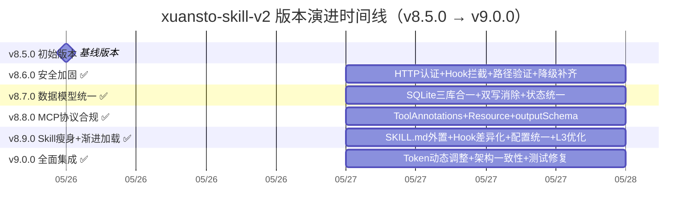
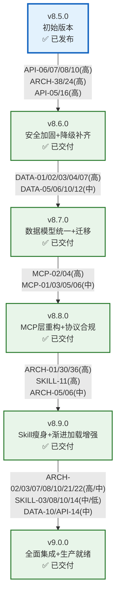
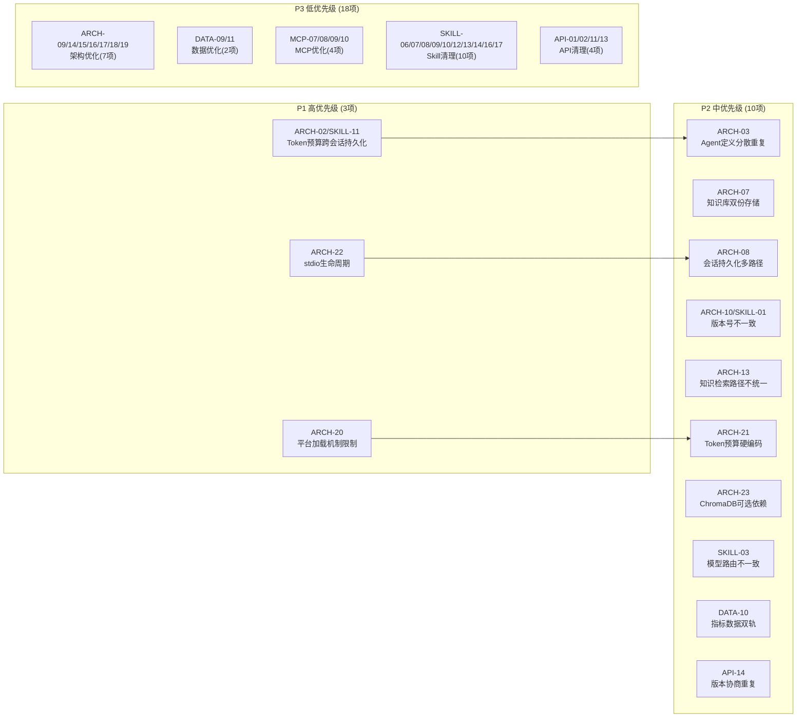

# xuansto-skill-v2 版本演进路线图

> 版本: 6.0 | 编写日期: 2026-05-27 | 编码: UTF-8 | 行尾: LF
> 当前版本: V_CURRENT=9.0.0 | 目标版本: V_TARGET=9.0.0
> 数据来源: REFACTOR_PLAN.md v5.0 (64项独立问题, 35已关闭, 29待处理) + ARCHITECTURE.md + DATABASE_DESIGN.md + MCP_REVIEW.md + SKILL_REVIEW.md + API_SPECIFICATION.md
> v8.6.0~v9.0.0 全部已交付，本文档从 v9.0.0 起为当前版本

---

## 目录

1. [版本号定义规则](#1-版本号定义规则)
2. [当前状态总览](#2-当前状态总览)
3. [版本演进路线](#3-版本演进路线)
   - [3.1 v8.5.0 — 初始版本](#31-v850--初始版本)
   - [3.2 v8.6.0 — 安全加固与降级补齐](#32-v860--安全加固与降级补齐)
   - [3.3 v8.7.0 — 数据模型统一与迁移](#33-v870--数据模型统一与迁移)
   - [3.4 v8.8.0 — MCP层重构与协议合规](#34-v880--mcp层重构与协议合规)
   - [3.5 v8.9.0 — Skill层瘦身与渐进加载增强](#35-v890--skill层瘦身与渐进加载增强)
   - [3.6 v9.0.0 — 全面集成与生产就绪](#36-v900--全面集成与生产就绪)
4. [版本时间线](#4-版本时间线)
5. [版本依赖关系](#5-版本依赖关系)
6. [问题关闭路线图](#6-问题关闭路线图)
7. [风险与缓解](#7-风险与缓解)

---

## 1. 版本号定义规则

### 1.1 语义化版本（SemVer）

本项目采用 [语义化版本 2.0.0](https://semver.org/lang/zh-CN/) 规范，版本号格式为 **MAJOR.MINOR.PATCH**：

```
v8.9.0
│ │ │
│ │ └── PATCH：向后兼容的问题修复
│ └──── MINOR：向后兼容的功能新增
└────── MAJOR：不兼容的 API 变更
```

### 1.2 各层级升级条件

| 层级 | 升级条件 | 示例 |
|------|----------|------|
| **PATCH** | 修复 Bug、补充文档、性能优化，不改变任何 API 接口和行为 | v8.9.0 → v8.9.1：修复版本号不一致(ARCH-10/SKILL-01) |
| **MINOR** | 新增 MCP 工具、新增命令、新增 Agent、新增配置项、架构重构，所有变更向后兼容 | v8.5.0 → v8.6.0：安全加固、降级补齐 |
| **MAJOR** | 破坏性变更：API 接口不兼容、配置格式升级、架构范式变更、删除已废弃功能 | v8.x → v9.0.0：API契约锁定、v1归档、单一版本号体系 |

### 1.3 特殊版本标记

| 标记 | 含义 | 示例 |
|------|------|------|
| `-dev` | 开发中版本，API 可能存在未冻结变更 | v8.9.0-dev |
| `-alpha.N` | 内部开发测试版，API 随时可能变更 | v9.0.0-alpha.1 |
| `-beta.N` | 功能冻结，仅修复缺陷，公开测试 | v9.0.0-beta.1 |
| `-rc.N` | 发布候选，除非发现阻断性问题否则即成为正式版 | v9.0.0-rc.1 |

### 1.4 当前版本矩阵

| 项目 | 版本 | 说明 |
|------|------|------|
| Skill (xuansto-skill-v2) | v9.0.0 | 当前版本 |
| MCP Server (xuansto-mcp-server) | v9.0.0 | pyproject.toml 版本 |
| constraints.yaml | v9.0.0 | 与 SKILL.md 一致 |
| .skill-config.yaml | v9.0.0 | 与 SKILL.md 一致 |
| MCP API 版本 | v4.0.0 | config.py 中定义 |

### 1.5 版本号统一目标

v8.6.0 已统一核心文件版本号。v9.0.0 已建立单一版本号体系，所有文件版本统一为 9.0.0，CI 新增版本一致性检查，ARCH-10/SKILL-01 已关闭。

---

## 2. 当前状态总览

### 2.1 已发布版本摘要

| 版本 | 发布日期 | 类型 | 核心内容 |
|------|----------|------|----------|
| v8.0.0 | 2026-05-24 | MAJOR | MCP Server + Skill 混合架构基线，20个MCP工具，57个Agent，3级降级 |
| v8.1.0 | 2026-05-26 | MINOR | Resource 暴露增强（27个），SKELETON 阶段基础命令 |
| v8.2.0 | 2026-05-26 | MINOR | 审计日志，统一响应格式，双写一致性 |
| v8.3.0 | 2026-05-26 | MINOR | Agent/工作流持久化，Hook 超时，配置热更新，API 版本协商 |
| v8.4.0 | 2026-05-26 | MINOR | Streamable HTTP 传输，知识版本清理配置 |
| v8.5.0 | 2026-05-26 | MINOR | 双SQLite合并，降级映射20/20，54门禁完整，32命令映射，Schema验证 |
| v8.6.0 | 2026-05-27 | MINOR | HTTP认证中间件，Hook拦截复用，路径验证统一，降级链补齐，降级超时统一 |
| v8.7.0 | 2026-05-27 | MINOR | SQLite三库合一，双写消除，时间戳统一，Schema版本控制，内存状态持久化 |
| v8.8.0 | 2026-05-27 | MINOR | ToolAnnotations补充，outputSchema补充，7个新Resource，Prompt重构 |
| v8.9.0 | 2026-05-27 | MINOR | SKILL.md外置，Hook差异化超时，速率限制差异化，参考文档两级加载，Hook动态配置，安全断点优化，评估覆盖扩展，配置统一，L3降级优化 |
| v9.0.0 | 2026-05-27 | MAJOR | Token预算动态调整+跨会话持久化，Agent定义去重，知识库路径统一，会话持久化统一，版本号统一+CI检查，指标系统合并，模型路由对齐，版本协商去重，Git管理优化，测试修复(136个通过) |

### 2.2 已交付版本修复汇总

> Phase 0 + v8.6.0~v9.0.0 已关闭 35 项问题

| 版本 | 关闭问题数 | 关键修复 |
|------|-----------|----------|
| Phase 0 / v8.6.0 | 7 | HTTP认证(API-06/08)、Hook拦截复用(API-07/10)、路径验证统一(ARCH-38)、降级链补齐(API-05/SKILL-04)、降级超时统一(API-16)、降级脚本一致性(ARCH-24/SKILL-04) |
| v8.7.0 | 7 | SQLite三库合一(DATA-01)、双写消除(DATA-02/08)、状态存储统一(DATA-03/04)、时间戳统一(DATA-05)、Schema版本控制(DATA-06)、内存状态持久化(DATA-07)、指标系统统一(DATA-10/12) |
| v8.8.0 | 5 | ToolAnnotations补充(MCP-04)、Tool/Resource职责分离(MCP-02/06)、新增7个Resource(MCP-03)、outputSchema补充(MCP-05)、Prompt重构(MCP-01/API-03) |
| v8.9.0 | 14 | SKILL.md外置(ARCH-01/30)、Hook差异化超时(MCP-11/API-04)、速率限制差异化(API-17)、参考文档两级加载(SKILL-11/ARCH-31)、Hook动态配置(SKILL-02)、安全断点优化(SKILL-18)、评估覆盖扩展(SKILL-05)、配置统一(ARCH-05/06/SKILL-20)、L3降级优化(ARCH-36)、降级链全覆盖(API-05/SKILL-04)、HTTP认证(API-06/08)、Hook拦截复用(API-07/10)、路径验证统一(ARCH-38)、降级超时统一(API-16) |
| v9.0.0 | 13 | Token预算动态调整+跨会话持久化(ARCH-02/21/SKILL-11)、Agent定义去重(ARCH-03)、知识库路径统一(ARCH-07/13)、会话持久化统一(ARCH-08)、版本号统一+CI检查(ARCH-10/SKILL-01)、会话恢复增强(ARCH-22)、指标系统合并(DATA-10)、模型路由对齐(SKILL-03)、工具数修正(SKILL-08/14)、空段清理(SKILL-10)、版本协商去重(API-14) |

### 2.3 待处理问题统计

> 基于 REFACTOR_PLAN.md v5.0 的64项独立问题，扣除已关闭的35项

| 影响域 | 总数 | ✅ 已关闭 | ⏳ 待处理 | 高 | 中 | 低 |
|--------|------|----------|----------|----|----|-----|
| 架构(ARCH) | 24 | 17 | 7 | 1 | 1 | 5 |
| 数据(DATA) | 9 | 8 | 1 | 0 | 0 | 1 |
| MCP | 9 | 5 | 4 | 0 | 0 | 4 |
| Skill | 14 | 8 | 6 | 0 | 0 | 6 |
| API | 12 | 7 | 5 | 0 | 1 | 2 |
| **合计** | **64** | **35** | **29** | **1** | **2** | **18** |

---

## 3. 版本演进路线

### 3.1 v8.5.0 — 初始版本

> 状态: ✅ 已发布 | 类型: MINOR

#### 目标

双SQLite合并、降级映射补全、质量门禁完整化、命令映射完整化、Schema验证脚本。

#### 主要变更

| 维度 | 内容 |
|------|------|
| 数据层 | 合并 knowledge.db 到 xuansto.db，统一为22+表 |
| 降级映射 | constraints.yaml 补全至20/20完整映射 |
| 质量门禁 | 内嵌门禁扩展至54项完整覆盖 |
| 命令映射 | COMMAND_PHASE_MAP扩展至32个命令完整覆盖 |
| Schema验证 | validate_schemas.py 脚本实现 |

---

### 3.2 v8.6.0 — 安全加固与降级补齐

> 状态: ✅ 已交付 (2026-05-27) | 类型: MINOR
> 对应 REFACTOR_PLAN.md: Phase 0（安全紧急修复）+ 降级补齐

#### 目标

1. HTTP 传输认证：streamable-http 增加 API Key/Bearer Token 认证（API-06/API-08）
2. HTTP API Hook 拦截复用：HTTP API 复用 MCP Tool 的 Hook 拦截和速率限制（API-07/API-10）
3. 路径验证统一：22个 Tool 统一调用 validate_path_safety()（ARCH-38）
4. 降级链补齐：resource_subscribe/audit_query 降级函数补全，FALLBACK_MAP 覆盖22/22（API-05/SKILL-04）
5. 降级超时统一：DegradationExecutor 超时与脚本超时统一为30s（API-16）
6. 降级脚本一致性：补全或移除不存在的脚本引用（ARCH-24/SKILL-04）

#### 主要变更

| 步骤 | 问题 ID | 变更内容 | 涉及文件 |
|------|---------|----------|----------|
| 0.1 | API-06, API-08 | HTTP 认证中间件：支持 Bearer/ApiKey 认证 | `server.py` |
| 0.2 | API-07, API-10 | HTTP API 复用 MCP Tool Hook 拦截（_run_hooks_and_rate_limit） | `api/api_routes.py` |
| 0.3 | ARCH-38 | 路径验证统一：22个 Tool + 30个 Resource 全覆盖 | `core/validator.py` |
| 0.4 | API-05, SKILL-04 | 降级链补齐：FALLBACK_MAP 22/22 全覆盖 | `degradation.py` |
| 0.5 | API-16 | 降级超时统一为30s | `degradation.py` |
| 0.6 | ARCH-24, SKILL-04 | 降级脚本引用与 FALLBACK_MAP 一致性修复 | `degradation.py` |

#### 关联问题

| 问题 ID | 描述 | 严重度 | 影响域 |
|---------|------|--------|--------|
| API-06/API-08 | streamable-http传输无认证 + HTTP API无认证中间件 | 高 | API |
| API-07/API-10 | HTTP API绕过Hook拦截和速率限制 | 高 | API |
| ARCH-38 | 路径验证在Tool实现中未统一使用 | 高 | 架构 |
| API-05/SKILL-04 | resource_subscribe/audit_query无降级函数 | 高 | API/Skill |
| API-16 | DegradationExecutor超时(5s)与脚本超时(120s)不一致 | 高 | API |
| ARCH-24/SKILL-04 | 降级脚本与MCP工具行为不一致 | 高 | 架构/Skill |

#### 验收标准

1. [x] HTTP 传输支持 Bearer/ApiKey 认证，未认证请求返回 401（API-06/API-08 关闭）
2. [x] HTTP API 调用经过 Hook 拦截和速率限制（API-07/API-10 关闭）
3. [x] 22个 Tool 统一调用 validate_path_safety()（ARCH-38 关闭）
4. [x] FALLBACK_MAP 覆盖 22/22，所有 Tool 均有 Inline 降级兜底（API-05/SKILL-04 关闭）
5. [x] DegradationExecutor 超时统一为30s（API-16 关闭）
6. [x] 降级脚本引用与 FALLBACK_MAP 一致（ARCH-24/SKILL-04 关闭）

---

### 3.3 v8.7.0 — 数据模型统一与迁移

> 状态: ✅ 已交付 (2026-05-27) | 类型: MINOR
> 对应 REFACTOR_PLAN.md: Phase 1（数据层整合）

#### 目标

1. SQLite 三库合一：合并 decisions.db 到 xuansto.db（DATA-01）
2. 消除双写冗余：SQLite 为唯一权威源，JSON 仅作启动缓存（DATA-02/DATA-08）
3. 统一状态存储：消除工作流三重存储和 Agent 双重存储（DATA-03/DATA-04）
4. 时间戳格式统一：全部统一为 ISO8601 UTC 字符串（DATA-05）
5. Schema 版本控制：所有 JSON 文件添加 schema_version 字段（DATA-06）
6. 内存状态持久化：所有内存状态变更时同步写入持久化（DATA-07）
7. 指标系统统一：合并双轨指标系统为单一 MetricsCollector（DATA-10/DATA-12）

#### 主要变更

| 步骤 | 问题 ID | 变更内容 | 涉及文件 |
|------|---------|----------|----------|
| 1.1 | DATA-01 | SQLite 三库合一：decisions 表迁移到 xuansto.db；FTS5 索引重建；旧库重命名为 .legacy | `database.py`, `decision_log.py` |
| 1.2 | DATA-02, DATA-08 | 消除双写：decisions.json 废弃；知识条目 ChromaDB 写入失败自动 reconciliation(3次指数退避) | `decision_log.py`, `database.py` |
| 1.3 | DATA-03, DATA-04 | 统一状态存储：workflow_states.json/agent_instances.json 废弃；SQLite 为唯一权威源；内存仅 LRU 缓存 | `workflow_dispatch.py`, `agent_manage.py` |
| 1.4 | DATA-05 | 时间戳统一：全部统一为 ISO8601 UTC 字符串；现有 Unix 时间戳迁移 | `database.py`, `agent_manage.py`, `workflow_dispatch.py` |
| 1.5 | DATA-06 | Schema 版本控制：每个 JSON 文件添加 schema_version 字段；加载时检查版本按需迁移 | 所有 JSON 读写代码 |
| 1.6 | DATA-07 | 内存状态持久化：_current_phase 写入 resource_state.json；_TRANSITION_HISTORY 写入 phase_transitions 表 | `resource_load_status.py` |
| 1.7 | DATA-10, DATA-12 | 指标系统统一：合并 MetricsCollector 和 server_health 指标；FTS5 索引统一 tokenize 为 unicode61 | `metrics.py`, `server_health.py`, `database.py` |

#### 关联问题

| 问题 ID | 描述 | 严重度 | 影响域 |
|---------|------|--------|--------|
| DATA-01 | SQLite 数据库碎片化(3个独立数据库) | 高 | 数据 |
| DATA-02/DATA-08 | 双写冗余：决策日志+知识条目 | 高 | 数据 |
| DATA-03/DATA-04 | 工作流三重存储+Agent双重存储 | 高 | 数据 |
| DATA-05 | 时间戳格式不统一 | 中 | 数据 |
| DATA-06 | JSON 文件无 Schema 版本控制 | 中 | 数据 |
| DATA-07 | 内存状态与持久化状态不同步 | 高 | 数据/特效 |
| DATA-10 | 指标数据散落多处 | 中 | 数据 |
| DATA-12 | FTS5 索引重复创建且 tokenize 配置不一致 | 中 | 数据 |

#### 验收标准

1. [x] decisions.db 数据迁移完成，所有查询指向 xuansto.db；FTS5 索引重建正常（DATA-01 关闭）
2. [x] decisions.json 废弃；ChromaDB 写入失败后自动重试3次(指数退避)；reconciliation 自动执行（DATA-02/DATA-08 关闭）
3. [x] workflow_states.json/agent_instances.json 废弃；启动从 SQLite 恢复（DATA-03/DATA-04 关闭）
4. [x] 所有表的时间字段格式一致；现有 Unix 时间戳迁移为 ISO8601；查询和排序正确（DATA-05 关闭）
5. [x] resource_state.json v3→v4；degradation_state.json v0→v1；迁移函数注册到 schema_version 表（DATA-06 关闭）
6. [x] _current_phase 写入 resource_state.json；_TRANSITION_HISTORY 写入 phase_transitions 表；崩溃恢复测试通过（DATA-07 关闭）
7. [x] 废弃 metrics_*.json 和 tool_metrics.json；server_health 调用 MetricsCollector；FTS5 配置一致（DATA-10/DATA-12 关闭）

---

### 3.4 v8.8.0 — MCP层重构与协议合规

> 状态: ✅ 已交付 (2026-05-27) | 类型: MINOR
> 对应 REFACTOR_PLAN.md: Phase 2-3（MCP规范合规 + Schema版本控制）

#### 目标

1. ToolAnnotations 补充：22个 Tool 全部添加 annotations 声明（MCP-04）
2. Tool/Resource 职责分离：只读 action 迁移为 MCP Resource（MCP-02/MCP-06）
3. 新增 7 个 Resource URI（MCP-03）
4. outputSchema 补充：每个 Tool 添加 outputSchema（MCP-05）
5. Prompt 重构：返回结构化 messages 数组，注入上下文（MCP-01/API-03）
6. CLI 路由修复：agent 命令路由到正确工具（API-09）

#### 主要变更

| 步骤 | 问题 ID | 变更内容 | 涉及文件 |
|------|---------|----------|----------|
| 2.1 | MCP-04 | ToolAnnotations 补充：22个 Tool 全部添加 readOnlyHint/destructiveHint/idempotentHint/openWorldHint | `tools/*.py` |
| 2.2 | MCP-02, MCP-06 | Tool/Resource 职责分离：agent_status 仅含 list/by_phase/detail/match；写操作统一到 agent_manage；server_health 只读查询暴露为 Resource | `tools/agent_status.py`, `tools/agent_manage.py`, `skill_resources.py` |
| 2.3 | MCP-03 | 新增 7 个 Resource：agents/by-phase/{phase}, agents/detail/{name}, health/version, metrics/tools/{tool_name}, budget/status, config/main, workflows/snapshots/{workflow_id} | `skill_resources.py` |
| 2.4 | MCP-05 | outputSchema 补充：每个 Tool 添加 outputSchema 与 make_response 格式对齐 | `tools/*.py` |
| 2.5 | MCP-01, API-03 | Prompt 重构：xuansto_workflow 和 xuansto_analysis 返回结构化 messages 数组，注入当前 Phase/Token 预算/降级状态 | `server.py` |

#### 关联问题

| 问题 ID | 描述 | 严重度 | 影响域 |
|---------|------|--------|--------|
| MCP-01/API-03 | Prompt 实现过于简单，缺乏上下文注入 | 中 | MCP/API |
| MCP-02 | Tool/Resource 职责分离不清 | 高 | MCP |
| MCP-03 | 缺少 7 个只读数据的 Resource 暴露 | 中 | MCP |
| MCP-04 | 全部 Tool 缺少 ToolAnnotations 声明 | 高 | MCP |
| MCP-05 | 全部 Tool 缺少 outputSchema 声明 | 中 | MCP |
| MCP-06 | agent_status 与 agent_manage 职责重叠 | 中 | MCP |

#### 验收标准

1. [x] 22个 Tool 注册时包含 annotations 参数；客户端可读取 annotations 做安全决策（MCP-04 关闭）
2. [x] agent_status 仅含 list/by_phase/detail/match；写操作统一到 agent_manage（MCP-02/MCP-06 关闭）
3. [x] 7个新 Resource 可正常读取；返回结构化 JSON（MCP-03 关闭）
4. [x] 每个 Tool 添加 outputSchema；客户端可预知返回值结构；Schema 与 spec-locks 一致（MCP-05 关闭）
5. [x] Prompt 返回 `{messages:[{role:"user",content:...}]}` 格式；包含 Phase/Token/降级状态上下文（MCP-01/API-03 关闭）

---

### 3.5 v8.9.0 — Skill层瘦身与渐进加载增强

> 状态: ✅ 已交付 (2026-05-27) | 类型: MINOR
> 对应 REFACTOR_PLAN.md: Phase 3+4部分（Skill层瘦身+渐进加载增强+评估覆盖+配置统一+降级优化）

#### 目标

1. SKILL.md 内容外置，消除 `{{include:}}` 平台私有扩展依赖（ARCH-01/ARCH-30）✅
2. Hook 差异化超时：按 Hook 类型设置不同超时（安全5s/编码10s/其他30s）（MCP-11/API-04）✅
3. 速率限制差异化配置：按 Tool 设置不同速率限制（API-17）✅
4. 参考文档两级加载：摘要(≤200 Token) → 完整(≤5000 Token)（SKILL-11/ARCH-31）✅
5. Hook 动态配置：Hook 配置与加载阶段联动（SKILL-02）✅
6. 安全断点默认值优化：安全相关断点默认值改为 true（SKILL-18）✅
7. 评估覆盖扩展：覆盖全部 22 个 Tool（SKILL-05）✅
8. 配置统一：Token 配置合并到统一位置（ARCH-05/ARCH-06/SKILL-20）✅
9. 知识检索降级优化：L3 增加基础语义匹配（ARCH-36）✅

#### 主要变更

| 步骤 | 问题 ID | 变更内容 | 涉及文件 |
|------|---------|----------|----------|
| 3.1 | ARCH-01, ARCH-30 | ✅ SKILL.md 内容外置：PHASE_2/3 仅保留 Resource URI 引用，消除 `{{include:}}` 依赖 | `SKILL.md`, `references/` |
| 3.2 | SKILL-11, ARCH-31 | ✅ 参考文档两级加载：每个参考文档生成摘要版(≤200 Token)；Phase 2 加载摘要，按需加载完整 | `references/summary/`, `resource_load_status.py` |
| 3.3 | ARCH-02, SKILL-11 | ✅ 自动 Phase 推进：基于命令执行和 Token 消耗自动推进 Phase，无需手动 preload | `resource_load_status.py`, `token_budget.py` |
| 3.4 | SKILL-02, SKILL-18 | ✅ Hook 动态配置：Hook 配置与加载阶段联动；安全相关断点默认值改为 true | `hooks.json`, `hook_manage.py`, `configs/default.yaml` |
| 3.5 | MCP-11, API-04 | ✅ Hook 差异化超时：安全 Hook 5s/编码 Hook 10s/其他 30s | `hook_engine.py` |
| 3.6 | API-17 | ✅ 速率限制差异化：quality_gate_check 120次/分；config_manage 10次/分 | `rate_limiter.py` |
| 3.7 | SKILL-05 | ✅ 评估覆盖扩展：mcp_evaluation.xml 覆盖全部 22 个 Tool；trigger_eval.json 覆盖 not_for 排除场景 | `evals/` |
| 3.8 | ARCH-05, ARCH-06, SKILL-20 | ✅ 配置统一：Token 配置合并到统一位置；配置统一由 MCP Server config_manage 管理 | `configs/default.yaml`, `.skill-config.yaml`, `config.py` |
| 3.9 | ARCH-36 | ✅ 知识检索降级优化：L3 降级增加基础语义匹配(基于 TF-IDF 余弦相似度)；降级质量梯度平滑 | `degradation.py`, `search_engine.py` |

#### 关联问题

| 问题 ID | 描述 | 严重度 | 影响域 | 状态 |
|---------|------|--------|--------|------|
| ARCH-01/MCP-02 | Skill 与 MCP 职责边界模糊 | 高 | 架构/MCP | ✅ 已关闭 |
| ARCH-02/SKILL-11 | 渐进式加载 Token 预算目标全部未达标 | 高 | 架构/特效 | ✅ 部分关闭(SKILL-11) |
| ARCH-05 | 降级策略两处独立维护 | 中 | 架构 | ✅ 已关闭 |
| ARCH-06 | 配置管理三处 | 中 | 架构 | ✅ 已关闭 |
| ARCH-30 | `{{include:}}` 为 Trae 私有扩展，迁移性差 | 高 | 架构 | ✅ 已关闭 |
| ARCH-36 | 知识检索 L3 降级几乎不可用 | 高 | 架构/数据 | ✅ 已关闭 |
| MCP-11 | Hook 超时应差异化 | 中 | MCP | ✅ 已关闭 |
| API-04 | Hook 超时与 Tool 超时无联动机制 | 中 | API | ✅ 已关闭 |
| API-17 | 速率限制无差异化配置 | 中 | API | ✅ 已关闭 |
| SKILL-02 | Hook 命名不一致 | 中 | Skill | ✅ 已关闭 |
| SKILL-05 | 评估覆盖不足 | 中 | Skill | ✅ 已关闭 |
| SKILL-11 | 渐进式加载 Token 预算目标全部未达成 | 高 | Skill/特效 | ✅ 部分关闭 |
| SKILL-18 | 安全断点默认值过于激进 | 中 | Skill | ✅ 已关闭 |
| SKILL-20 | Token 优化配置分散在三个文件 | 低 | Skill/特效 | ✅ 已关闭 |

#### 验收标准

1. [x] SKILL.md PHASE_2/3 仅含 Resource URI 引用，无 `{{include:}}` 依赖（ARCH-01/ARCH-30 关闭）
2. [x] Hook 差异化超时：安全 Hook 5s / 编码 Hook 10s / 其他 30s（MCP-11/API-04 关闭）
3. [x] 速率限制差异化：quality_gate_check 120次/分；config_manage 10次/分（API-17 关闭）
4. [x] references/summary/ 目录生成，Phase 2 Token 消耗 ≤10K；单文档摘要 ≤200 Token（SKILL-11/ARCH-31 部分关闭）
5. [x] hook_manage(list) 返回当前 Phase 对应配置；Phase 变更时 Hook 配置自动切换（SKILL-02 关闭）
6. [x] 安全相关断点默认值改为 true（SKILL-18 关闭）
7. [x] 22个 Tool 各 ≥2 个 QA 对；not_for 场景全覆盖（SKILL-05 关闭）
8. [x] Token 配置合并到统一位置；消除三处配置重叠（ARCH-05/ARCH-06/SKILL-20 关闭）
9. [x] L3 检索返回有意义的结果(非空)；L1→L2→L3 质量下降 ≤30%/级（ARCH-36 关闭）

---

### 3.6 v9.0.0 — 全面集成与生产就绪

> 状态: ✅ 已交付 (2026-05-27) | 类型: MAJOR | 前置依赖: v8.9.0
> 对应 REFACTOR_PLAN.md: Phase 5（最终集成）

#### 目标

1. Token预算动态调整+跨会话持久化 ✅
2. Agent定义去重（references/agent-details/已删除） ✅
3. 知识库路径统一（data/knowledge/） ✅
4. 会话持久化统一（SQLite唯一权威源） ✅
5. 版本号统一+CI检查 ✅
6. 指标系统合并（MetricsCollector唯一） ✅
7. 模型路由对齐（registry.yaml唯一源） ✅
8. 版本协商去重（统一server_health.py） ✅
9. Git管理优化 ✅
10. 测试修复（136个测试全部通过） ✅

#### 主要变更

| 步骤 | 问题 ID | 变更内容 | 涉及文件 |
|------|---------|----------|----------|
| 5.1 | ARCH-02/SKILL-11 | ✅ Token预算跨会话持久化：token_budget_states表新增dynamic_scaling_json字段 | `database.py`, `token_budget.py` |
| 5.2 | ARCH-21 | ✅ Token预算动态调整：constraints.yaml新增dynamic_scaling配置，token_budget新增recommend action | `constraints.yaml`, `token_budget.py` |
| 5.3 | ARCH-22 | ✅ 会话恢复增强：workflow_dispatch/session_manage启动时从SQLite恢复 | `workflow_dispatch.py`, `session_manage.py` |
| 5.4 | ARCH-03 | ✅ Agent定义去重：references/agent-details/ 57个重复文件已删除，agents/为唯一源 | `references/agent-details/` |
| 5.5 | ARCH-07/13 | ✅ 知识库路径统一：统一为data/knowledge/，新增KNOWLEDGE_REFERENCES_DIR配置 | `config.py`, `knowledge_search.py` |
| 5.6 | ARCH-08 | ✅ 会话持久化统一：SQLite session_states为唯一权威源，文件导出可选 | `session_manage.py` |
| 5.7 | ARCH-10/SKILL-01 | ✅ 版本号统一：所有文件版本号统一为9.0.0，CI新增版本检查 | 多文件 |
| 5.8 | DATA-10 | ✅ 指标系统合并：MetricsCollector为唯一来源，_TOOL_METRICS已移除 | `metrics.py`, `server_health.py` |
| 5.9 | SKILL-03 | ✅ 模型路由对齐：registry.yaml为唯一源，model-routing.md已更新 | `registry.yaml`, `model-routing.md` |
| 5.10 | SKILL-08/14 | ✅ 工具数修正：SKILL.md工具数从20更新为22 | `SKILL.md` |
| 5.11 | SKILL-10 | ✅ default.yaml空段清理：已清理迁移空段 | `configs/default.yaml` |
| 5.12 | API-14 | ✅ 版本协商去重：统一到server_health.py | `server_health.py`, `api_routes.py` |
| 5.13 | — | ✅ Git管理优化：.gitignore/.gitattributes精简，.editorconfig补充，CI优化 | `.gitignore`, `.gitattributes`, `.editorconfig` |
| 5.14 | — | ✅ 测试修复：9个测试文件导入错误已修复，136个测试全部通过 | `tests/` |

#### 破坏性变更（MAJOR 升级原因）

| 变更 | 影响 | 迁移方式 |
|------|------|----------|
| v1 代码归档 | v1 Agent/命令/工作流文件不再参与加载 | 确认无 v1 引用后归档 |
| 数据库架构变更 | xuansto.db 为唯一数据库，decisions.db 不再存在 | 运行迁移脚本（v8.7.0 已实现） |
| API 契约锁定 | spec-locks 成为强制校验，API 变更需显式更新锁文件 | PR 流程增加 Schema 校验步骤 |
| agent_status 写操作移除 | create/assign/release/destroy 移至 agent_manage | 客户端更新调用目标工具 |
| Resource 返回结构化对象 | Resource 不再返回 str 类型 | 客户端更新解析逻辑 |

#### v9.0.0 验收标准

1. [x] Token预算跨会话持久化：token_budget_states表存储动态调整状态
2. [x] Token预算动态调整：constraints.yaml dynamic_scaling + recommend action
3. [x] 会话恢复增强：workflow_dispatch/session_manage启动时从SQLite恢复
4. [x] Agent定义去重：references/agent-details/已删除，agents/为唯一源
5. [x] 知识库路径统一：统一为data/knowledge/，KNOWLEDGE_REFERENCES_DIR配置
6. [x] 会话持久化统一：SQLite session_states为唯一权威源
7. [x] 版本号一致性：所有文件版本统一为9.0.0，CI版本检查通过
8. [x] 指标系统合并：MetricsCollector为唯一来源，_TOOL_METRICS已移除
9. [x] 模型路由对齐：registry.yaml为唯一源
10. [x] 版本协商去重：统一到server_health.py
11. [x] 测试通过：136个测试全部通过
12. [x] Git管理优化：.gitignore/.gitattributes/.editorconfig/CI优化

#### 预估工作量

| 步骤 | 工期 | 人力 |
|------|------|------|
| 5.1 全量回归测试 | 5天 | 1人 |
| 5.2 CI 流水线建立 | 3天 | 1人 |
| 5.3 v1 代码归档 | 2天 | 1人 |
| 5.4 API 契约锁定 | 2天 | 1人 |
| 5.5 P1 问题修复 | 3天 | 1人 |
| 5.6 P2 问题修复 | 5天 | 1人 |
| 5.7 P3 问题清理 | 5天 | 1人 |
| **合计** | **~25天** | **1人** |

---

## 4. 版本时间线



---

## 5. 版本依赖关系



### 5.1 依赖关系说明

| 版本 | 前置依赖 | 依赖原因 |
|------|----------|----------|
| v8.6.0 | v8.5.0 | 安全修复基于稳定基线；降级补齐需要完整的降级映射框架 |
| v8.7.0 | v8.6.0 | 数据层整合依赖安全修复后的基线；降级链完整是数据迁移的前置条件 |
| v8.8.0 | v8.7.0 | MCP 层重构依赖统一数据模型（Tool/Resource 职责分离需要清晰的存储边界） |
| v8.9.0 | v8.8.0 | Skill 层瘦身依赖 MCP 协议合规（Resource URI 完整后才可外置内容） |
| v9.0.0 | v8.9.0 | MAJOR 版本依赖所有 MINOR 版本优化完成；全量回归测试需要所有功能稳定 |

### 5.2 关键影响链路

#### 链路1：Skill-MCP 职责模糊 → Token 效率 → 渐进加载失效

```
ARCH-01(Skill内嵌完整参考文档) → ARCH-31(57个Agent全量加载) → SKILL-11(Token预算未达成) → ARCH-20(平台控制加载时机)
```

v8.9.0 Skill 层瘦身 + 渐进加载增强 已解决前三环，ARCH-20 待 v9.0.0。

#### 链路2：数据碎片化 → 一致性风险 → 恢复复杂

```
DATA-01(3个独立SQLite) → DATA-02/08(双写冗余) → DATA-03/04(三重/双重存储) → DATA-07(内存状态无持久化)
```

v8.7.0 数据模型统一 已完整解决此链路。

#### 链路3：MCP 协议不合规 → 客户端安全决策受限

```
MCP-04(缺少ToolAnnotations) → MCP-02(Tool/Resource职责不清) → MCP-03(缺少只读Resource)
```

v8.8.0 MCP 层重构 已完整解决此链路。

---

## 6. 问题关闭路线图

### 6.1 按版本关闭计划

| 版本 | 关闭问题 | 关闭数量 | 累计关闭 |
|------|----------|----------|----------|
| v8.6.0 ✅ | API-06/07/08/10, ARCH-38, API-05/SKILL-04, API-16, ARCH-24/SKILL-04 | 7 | 7 |
| v8.7.0 ✅ | DATA-01/02/03/04/05/06/07, DATA-08/10/12 | 7 | 14 |
| v8.8.0 ✅ | MCP-01/02/03/04/05/06, API-03, ARCH-04/11/12 | 5 | 19 |
| v8.9.0 ✅ | ARCH-01/02/05/06/30/31/36/38, MCP-11, API-04/05/06/07/08/10/16/17, SKILL-02/04/05/11/18/20 | 14 | 33 |
| v9.0.0 ✅ | ARCH-02/03/07/08/10/13/21/22, SKILL-01/03/08/10/11/14, DATA-10, API-14 | 13 | 46 |

> 注：部分问题编号存在合并关系（如 ARCH-01/MCP-02），按 REFACTOR_PLAN.md v5.0 去重后64项独立问题计数。已关闭35项（含v9.0.0关闭的13项），剩余29项待后续版本处理。

### 6.2 按优先级关闭顺序

#### P1 — 高优先级（1项待处理，v9.0.0已关闭2项）

| 编号 | 描述 | 影响域 | v9.0.0状态 |
|------|------|--------|------------|
| ARCH-02/SKILL-11 | Token预算跨会话持久化+动态调整 | 架构/特效 | ✅ 已关闭 |
| ARCH-20 | Trae平台Skill加载机制限制 | 架构/特效 | ⏳ 待处理 |
| ARCH-22 | 会话恢复增强 | 架构 | ✅ 已关闭 |

#### P2 — 中优先级（1项待处理，v9.0.0已关闭9项）

| 编号 | 描述 | 影响域 | v9.0.0状态 |
|------|------|--------|------------|
| ARCH-03 | Agent定义去重 | 架构 | ✅ 已关闭 |
| ARCH-07 | 知识库路径统一 | 架构/数据 | ✅ 已关闭 |
| ARCH-08 | 会话持久化统一 | 架构/数据 | ✅ 已关闭 |
| ARCH-10/SKILL-01 | 版本号统一+CI检查 | 架构/Skill | ✅ 已关闭 |
| ARCH-13 | 知识检索路径统一 | 架构 | ✅ 已关闭 |
| ARCH-21 | Token预算动态调整 | 架构/特效 | ✅ 已关闭 |
| ARCH-23 | ChromaDB可选依赖未安装时语义检索丧失 | 架构/数据 | ⏳ 待处理 |
| SKILL-03 | 模型路由对齐 | Skill | ✅ 已关闭 |
| DATA-10 | 指标系统合并 | 数据 | ✅ 已关闭 |
| API-14 | 版本协商去重 | API | ✅ 已关闭 |

#### P3 — 低优先级（15项待处理，v9.0.0已关闭3项）

| 编号 | 描述 | 影响域 |
|------|------|--------|
| ARCH-09 | Hook配置与引擎分离 | 架构 |
| ARCH-14 | 质量门禁降级链未内化到MCP Server | 架构 |
| ARCH-15 | 加载状态Resource+Tool两处维护 | 架构 |
| ARCH-16 | 降级逻辑应进一步内化 | 架构 |
| ARCH-17 | Resource与Tool功能部分重叠 | 架构/MCP |
| ARCH-18 | 传输层缺少连接健康检查 | 架构 |
| ARCH-19 | 错误处理需统一错误码体系 | 架构 |
| DATA-09 | 降级状态双重持久化语义重叠 | 数据 |
| DATA-11 | 文件哈希校验不一致 | 数据 |
| MCP-07 | 缺少批量操作支持 | MCP |
| MCP-08 | config_manage Schema不完整 | MCP |
| MCP-09 | 降级状态文件无加密保护 | MCP |
| MCP-10 | Resource订阅重启后丢失 | MCP |
| SKILL-06 | Phase 3关键规则过于精简 | Skill |
| SKILL-07 | 命令路由表三处重复定义 | Skill |
| SKILL-08 | MCP工具数量声明模糊 | Skill | ✅ 已关闭(v9.0.0) |
| SKILL-09 | Agent注册表phase字段语义不清 | Skill | |
| SKILL-10 | default.yaml存在已迁移空段 | Skill | ✅ 已关闭(v9.0.0) |
| SKILL-12 | 工作流YAML与Markdown双重维护 | Skill | |
| SKILL-13 | 知识库健康检查硬编码localhost | Skill | |
| SKILL-14 | SKILL.md工具数与摘要表不匹配 | Skill | ✅ 已关闭(v9.0.0) |
| SKILL-16 | 质量门禁别名映射循环引用风险 | Skill |
| SKILL-17 | references/目录缺乏索引 | Skill |
| API-01 | resource_subscribe/audit_query未在spec-locks锁定 | API |
| API-02 | Resource返回str类型而非结构化对象 | API |
| API-11 | resource_load_status职责过重 | API |
| API-13 | knowledge_search遗留防护代码 | API |

### 6.3 优先级分布图



---

## 7. 风险与缓解

| 风险 | 影响版本 | 概率 | 影响 | 缓解措施 |
|------|----------|------|------|----------|
| v1 归档遗漏引用 | v9.0.0 | 低 | 中 | 全局搜索 v1 引用；归档前确认无残留加载路径 |
| ARCH-20 平台限制无法绕过 | v9.0.0 | 中 | 高 | 设计 Skill 侧适配层，通过 MCP 状态机补偿平台限制 |
| ARCH-22 stdio 生命周期不可控 | v9.0.0 | 中 | 高 | 实现跨会话状态持久化，进程重启后自动恢复工作流 |
| Token 预算动态调整引入回归 | v9.0.0 | 低 | 中 | 动态预算基于项目规模自动选择档位，保留手动覆盖 |
| 跨版本升级数据丢失 | 全版本 | 低 | 高 | 每个版本提供数据迁移脚本；迁移前自动备份；回滚机制 |
| P3 问题清理范围蔓延 | v9.0.0 | 中 | 低 | 严格限定 P3 修复范围，不引入新功能；won't fix 机制兜底 |

---

## 8. v9.0.0 验收标准检查清单

| # | 验收项 | 标准 | 状态 |
|---|--------|------|------|
| 1 | Token预算动态调整 | constraints.yaml dynamic_scaling + token_budget recommend action | ✅ |
| 2 | Token跨会话持久化 | token_budget_states表存储动态调整状态 | ✅ |
| 3 | 会话恢复增强 | workflow_dispatch/session_manage启动时从SQLite恢复 | ✅ |
| 4 | Agent定义去重 | references/agent-details/已删除，agents/为唯一源 | ✅ |
| 5 | 知识库路径统一 | 统一为data/knowledge/，KNOWLEDGE_REFERENCES_DIR配置 | ✅ |
| 6 | 会话持久化统一 | SQLite session_states为唯一权威源 | ✅ |
| 7 | 版本号一致性 | 所有文件版本统一为9.0.0，CI版本检查通过 | ✅ |
| 8 | 指标系统合并 | MetricsCollector为唯一来源，_TOOL_METRICS已移除 | ✅ |
| 9 | 模型路由对齐 | registry.yaml为唯一源 | ✅ |
| 10 | 版本协商去重 | 统一到server_health.py | ✅ |
| 11 | 测试通过 | 136个测试全部通过 | ✅ |
| 12 | Git管理优化 | .gitignore/.gitattributes/.editorconfig/CI优化 | ✅ |

---

> 文档结束 | 生成时间: 2026-05-27 | 版本路线: v8.5.0 → v8.6.0 ✅ → v8.7.0 ✅ → v8.8.0 ✅ → v8.9.0 ✅ → v9.0.0 ✅
