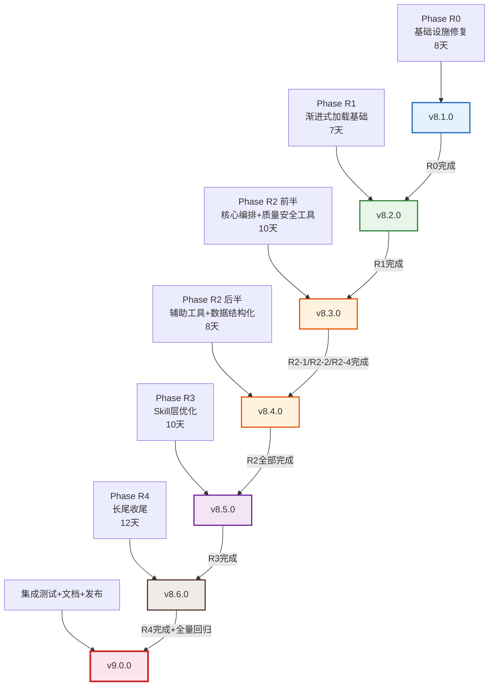
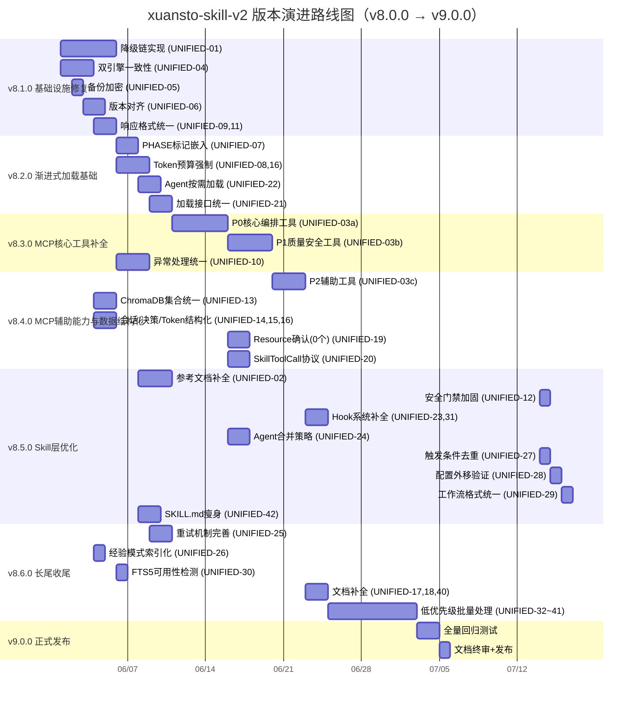
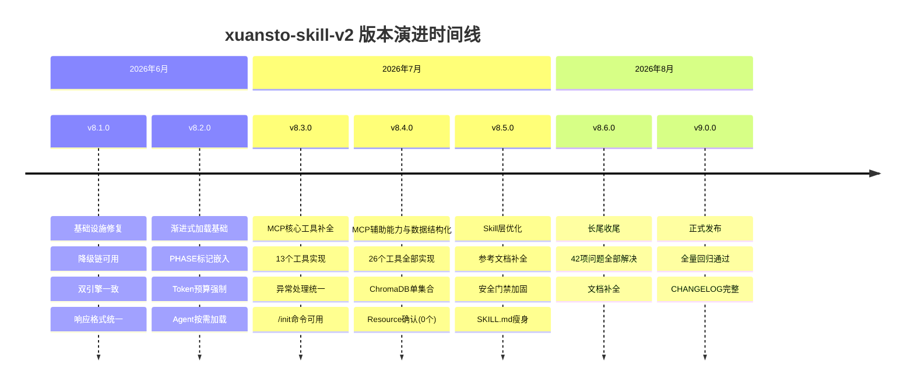
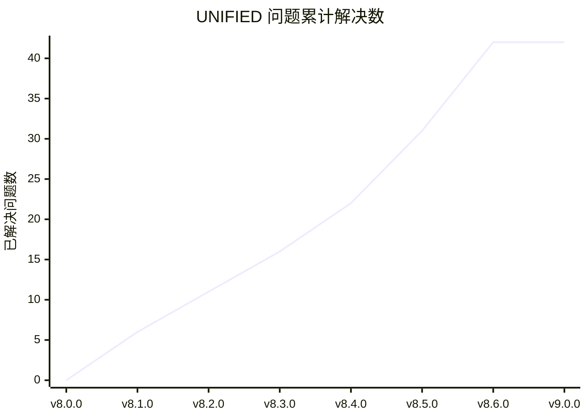

# xuansto-skill-v2 版本演进路线图

> 版本: 1.0 | 编写日期: 2026-05-24 | 编码: UTF-8 | 行尾: LF
> 当前版本: v8.0.0 | 目标版本: v9.0.0

---

## 目录

1. [版本号定义规则](#1-版本号定义规则)
2. [重构阶段与版本映射](#2-重构阶段与版本映射)
3. [版本路线图总览](#3-版本路线图总览)
4. [各版本详细规划](#4-各版本详细规划)
5. [版本时间线](#5-版本时间线)
6. [风险与缓解](#6-风险与缓解)

---

## 1. 版本号定义规则

### 1.1 语义化版本（SemVer）

本项目采用 [语义化版本 2.0.0](https://semver.org/lang/zh-CN/) 规范，版本号格式为 **MAJOR.MINOR.PATCH**：

```
v9.0.0
│ │ │
│ │ └── PATCH：向后兼容的问题修复
│ └──── MINOR：向后兼容的功能新增
└────── MAJOR：不兼容的 API 变更
```

### 1.2 各层级升级条件

| 层级 | 升级条件 | 示例 |
|------|----------|------|
| **PATCH** | 修复 Bug、补充文档、性能优化，不改变任何 API 接口和行为 | v8.1.0 → v8.1.1：修复降级脚本路径解析错误 |
| **MINOR** | 新增 MCP 工具、新增命令、新增 Agent、新增配置项，所有变更向后兼容 | v8.1.0 → v8.2.0：新增 PHASE 标记和渐进式加载机制 |
| **MAJOR** | 破坏性变更：API 接口不兼容、配置格式升级、Phase 编号体系变更、删除已废弃功能 | v8.x → v9.0.0：统一响应格式（破坏旧客户端解析） |

### 1.3 特殊版本标记

| 标记 | 含义 | 示例 |
|------|------|------|
| `-alpha.N` | 内部开发测试版，API 随时可能变更 | v8.3.0-alpha.1 |
| `-beta.N` | 功能冻结，仅修复缺陷，公开测试 | v8.3.0-beta.1 |
| `-rc.N` | 发布候选，除非发现阻断性问题否则即成为正式版 | v9.0.0-rc.1 |

### 1.4 版本号与问题清单关联

每个版本必须明确关联其解决的 UNIFIED-xx 问题编号，在 CHANGELOG.md 中记录对应关系：

```
## v8.1.0 (2026-06-XX)
### 修复
- UNIFIED-01: 降级链断裂修复
- UNIFIED-04: 双引擎一致性保障
- UNIFIED-05: 备份加密默认启用
- UNIFIED-06: 版本对齐
- UNIFIED-09: 响应格式统一
- UNIFIED-11: 工具数声明不一致修正
```

---

## 2. 重构阶段与版本映射

### 2.1 映射关系

| 重构阶段 | 版本号 | 阶段名称 | 预估工期 | 解决问题数 |
|----------|--------|----------|----------|-----------|
| Phase R0 | **v8.1.0** | 基础设施修复 | 8 天 | 6 项 |
| Phase R1 | **v8.2.0** | 渐进式加载基础 | 7 天 | 5 项 |
| Phase R2 前半 | **v8.3.0** | MCP 核心工具补全 | 10 天 | 5 项 |
| Phase R2 后半 | **v8.4.0** | MCP 辅助能力与数据结构化 | 8 天 | 6 项 |
| Phase R3 | **v8.5.0** | Skill 层优化 | 10 天 | 9 项 |
| Phase R4 | **v8.6.0** | 长尾收尾 | 12 天 | 11 项 |
| — | **v9.0.0** | 正式发布 | 3 天 | — |

### 2.2 映射依据



### 2.3 版本间依赖关系

| 版本 | 前置依赖 | 依赖原因 |
|------|----------|----------|
| v8.1.0 | 无 | 基础设施修复，独立进行 |
| v8.2.0 | v8.1.0 | 渐进式加载依赖降级链和响应格式统一 |
| v8.3.0 | v8.1.0, v8.2.0 | MCP 工具依赖降级链、PHASE 标记、Token 预算 |
| v8.4.0 | v8.3.0 | 辅助工具依赖核心工具框架 |
| v8.5.0 | v8.2.0 | Skill 层优化依赖渐进式加载基础 |
| v8.6.0 | v8.4.0, v8.5.0 | 长尾收尾依赖 MCP 和 Skill 层均稳定 |
| v9.0.0 | v8.6.0 | 全量回归通过后发布 |

---

## 3. 版本路线图总览

### 3.1 问题覆盖矩阵

| 版本 | P0 紧急 | P1 高 | P2 中 | P3 低 | 合计 |
|------|---------|-------|-------|-------|------|
| v8.1.0 | UNIFIED-01, 04 | UNIFIED-05, 06, 09, 11 | — | — | 6 |
| v8.2.0 | — | UNIFIED-07, 08, 16 | UNIFIED-21, 22 | — | 5 |
| v8.3.0 | UNIFIED-03(部分) | UNIFIED-10 | — | — | 5 |
| v8.4.0 | UNIFIED-03(剩余) | UNIFIED-13, 14, 15 | UNIFIED-17, 18, 19, 20 | — | 6 |
| v8.5.0 | UNIFIED-02 | UNIFIED-12 | UNIFIED-23, 24, 27, 28, 29, 31, 42 | — | 9 |
| v8.6.0 | — | — | UNIFIED-25, 26, 30 | UNIFIED-32~41 | 11 |
| **合计** | **4** | **12** | **15** | **11** | **42** |

### 3.2 版本演进甘特图



### 3.3 关键里程碑

| 里程碑 | 版本 | 预计日期 | 标志性成果 |
|--------|------|----------|-----------|
| M1: 降级可用 | v8.1.0 | 2026-06-09 | MCP 不可用时系统不再瘫痪 |
| M2: 渐进加载 | v8.2.0 | 2026-06-18 | Phase 0 Token ≤2K，骨架加载 ≤500ms |
| M3: 编排可用 | v8.3.0 | 2026-06-30 | /init /plan /implement 等核心命令可执行 |
| M4: 数据可靠 | v8.4.0 | 2026-07-09 | 双引擎一致率 ≥99.9%，会话/决策可查询 |
| M5: Skill 精简 | v8.5.0 | 2026-07-21 | SKILL.md ≤500 行，安全门禁不可绕过 |
| M6: 全面就绪 | v8.6.0 | 2026-08-04 | 42 项问题全部解决 |
| M7: 正式发布 | v9.0.0 | 2026-08-07 | 全量回归通过，CHANGELOG 完整 |

---

## 4. 各版本详细规划

### 4.0 v8.0.0 — 当前基线

> 当前版本 | MCP Server 版本: 4.0.0 | API 版本: 3.0.0

#### 当前状态

| 指标 | 值 |
|------|-----|
| MCP 工具总数 | 26（mcp_server.py 11 + skill_tools.py 15） |
| MCP Resource 数量 | 0（无 @mcp.resource() 装饰器） |
| MCP Server 版本 | 4.0.0 |
| API 版本 | 3.0.0 |

#### 根目录结构

```
.gitattributes
.github/
docs/plan/
.gitignore
...
```

---

### 4.1 v8.1.0 — 基础设施修复

> 重构阶段: Phase R0 | 预估工期: 8 天 | 前置依赖: 无

#### 目标

修复系统最底层的基础设施缺陷，确保降级链可用、数据一致、响应统一，为后续所有阶段奠定可靠基础。

#### 主要变更

| 子任务 | 变更内容 | 涉及文件 |
|--------|----------|----------|
| R0-1: 降级链实现 | `degradation.py` 实际调用 `scripts/` 脚本，返回与 MCP 相同 JSON 结构 | `degradation.py`, `scripts/*.py` |
| R0-2: 双引擎一致性 | 双写确认机制 + 定时对账 + 不一致自动修复 | `db_engine.py`, `vector_engine.py` |
| R0-3: 备份加密 | 默认启用 AES-256 加密，密钥自动生成 | `backup.py` |
| R0-4: 版本对齐 | SKILL.md 声明 `mcp_server_min_version`（≥4.0.0），MCP Server 声明 `skill_min_version`；API 版本 3.0.0 | `SKILL.md`, `mcp_server.py` |
| R0-5: 响应格式统一 | 统一 `make_response`/`make_error_response` 契约，SKILL.md 工具数更新为 26 | `mcp_server.py`, `api_routes.py`, `SKILL.md` |

#### 关联问题编号

| 编号 | 优先级 | 说明 |
|------|--------|------|
| UNIFIED-01 | P0 | 降级链断裂：MCP→脚本→内联三级降级未实际实现 |
| UNIFIED-04 | P0 | 双引擎一致性风险：SQLite 与 ChromaDB 无事务保证 |
| UNIFIED-05 | P1 | 备份无加密默认 |
| UNIFIED-06 | P1 | Skill 与 MCP Server 版本不一致 |
| UNIFIED-09 | P1 | MCP/HTTP 响应格式不统一 |
| UNIFIED-11 | P1 | MCP 工具数量声明不一致 |

#### 验收标准

1. MCP Server 停止后，所有 26 个工具可降级到脚本执行，降级检测→脚本调用→结果包装全流程 ≤5s
2. SQLite 写入成功后标记 pending，ChromaDB 写入成功后标记 ready，自动修复成功率 ≥95%
3. 新建备份默认加密，备份元数据标记 `encrypted=true`
4. `server_health` 返回版本兼容性检查结果
5. MCP Tool 和 HTTP 端点使用相同 JSON Schema，错误响应包含 `code/message/details/retryable`
6. SKILL.md 工具数更新为 26

---

### 4.2 v8.2.0 — 渐进式加载基础

> 重构阶段: Phase R1 | 预估工期: 7 天 | 前置依赖: v8.1.0

#### 目标

建立渐进式加载的核心机制，包括 PHASE 标记、Token 预算强制、Agent 按需加载和加载接口统一，使 Skill 触发时 Token 消耗从 ~8K 降至 ≤2K。

#### 主要变更

| 子任务 | 变更内容 | 涉及文件 |
|--------|----------|----------|
| R1-1: PHASE 标记嵌入 | SKILL.md 包含 `<!-- PHASE_0_START -->` ~ `<!-- PHASE_3_END -->` 标记 | `SKILL.md` |
| R1-2: Token 预算强制 | 超 80% 自动触发 `context_compress`，超 95% 强制降级 Phase，预算状态持久化到 SQLite | `configs/default.yaml`, `constraints.yaml`, `token_budget.py` |
| R1-3: Agent 按需加载 | Phase 0 不加载 Agent，Phase 1 加载 13 个核心 Agent，Phase 2 加载完整 57 个 | `agents/registry.yaml`, `agents/*/*.md` |
| R1-4: 加载接口统一 | status/preload/cache/clear_cache/loading_progress 5 个 action 全部可用 | `resource_load_status.py`, `constraints.yaml` |

#### 关联问题编号

| 编号 | 优先级 | 说明 |
|------|--------|------|
| UNIFIED-07 | P1 | PHASE 标记未嵌入 SKILL.md |
| UNIFIED-08 | P1 | Token 预算无运行时强制机制 |
| UNIFIED-16 | P1 | Token 预算状态无持久化 |
| UNIFIED-21 | P2 | 渐进式加载接口分散 |
| UNIFIED-22 | P2 | Agent 定义文件全量加载 |

#### 验收标准

1. 4 对 PHASE 标记正确嵌入，Phase 0 内容 ≤2K Token
2. 超 80% 自动触发 `context_compress`，超 95% 强制降级 Phase
3. 预算状态持久化，会话恢复后不丢失
4. Phase 0 不加载任何 Agent 定义，Phase 1 加载 13 个核心 Agent（≤150 Token/Agent）
5. status/preload/cache/clear_cache/loading_progress 5 个 action 全部可用
6. Phase 切换时发送 `notifications/tools/list_changed`
7. Skill 触发时 Token ≤2K（当前 ~8K）

---

### 4.3 v8.3.0 — MCP 核心工具补全

> 重构阶段: Phase R2 前半 | 预估工期: 10 天 | 前置依赖: v8.1.0, v8.2.0

#### 目标

实现最关键的 MCP 编排工具和质量安全工具，使 `/init`、`/plan`、`/implement` 等核心命令可通过 MCP 协议执行，同时统一异常处理机制。

#### 主要变更

| 子任务 | 变更内容 | 涉及文件 |
|--------|----------|----------|
| R2-1: P0 核心编排工具 | 实现 `skill_analyze`、`quality_gate_check`、`session_manage`、`workflow_dispatch`、`project_init` 5 个工具 | `mcp_server.py`, `scripts/*.py` |
| R2-2: P1 质量安全工具 | 实现 `spec_drift_detect`、`security_scan`、`code_simplify`、`agent_status`、`resource_load_status`、`context_compress`、`token_budget`、`knowledge_inject` 8 个工具 | `mcp_server.py`, `scripts/*.py` |
| R2-4: 异常处理统一 | 统一异常分类 + 降级协调器 | `degradation.py`, `mcp_server.py` |

#### 关联问题编号

| 编号 | 优先级 | 说明 |
|------|--------|------|
| UNIFIED-03 | P0 | MCP 工具实现严重不足（R2-1/R2-2 部分） |
| UNIFIED-10 | P1 | 异常处理分散，缺乏统一协调 |
| UNIFIED-01 | P0 | 降级链（R2-1/R2-2 依赖降级链验证） |
| UNIFIED-09 | P1 | 响应格式（R2-1/R2-2 使用统一格式） |
| UNIFIED-08 | P1 | Token 预算（R2-2 中 `token_budget` 工具） |

#### 验收标准

1. 13 个工具（5 编排 + 8 质量安全）通过 MCP 协议可调用
2. 参数校验符合 JSON Schema（`additionalProperties: false`）
3. 降级到脚本时返回相同结构，`degraded=true`
4. 错误码→HTTP 状态码映射表完整
5. 降级协调器统一检测→执行→恢复流程
6. `isError` 标记正确区分协议错误与工具执行错误
7. `/init` 命令可通过 MCP 工具链完整执行

---

### 4.4 v8.4.0 — MCP 辅助能力与数据结构化

> 重构阶段: Phase R2 后半 | 预估工期: 8 天 | 前置依赖: v8.3.0

#### 目标

补全剩余 MCP 辅助工具，解决数据存储层问题，实现 SkillToolCall 协议，使 MCP 层功能完整。

#### 主要变更

| 子任务 | 变更内容 | 涉及文件 |
|--------|----------|----------|
| R2-3: P2 辅助工具 | 实现 `hook_manage`、`server_health`、`decision_log`、`agent_manage`、`metrics_report` 5 个工具 | `mcp_server.py`, `scripts/*.py` |
| R2-5: ChromaDB 集合统一 | 单集合 + 元数据 `embedding_tier` 标记 | `vector_engine.py` |
| R2-6: 会话/决策/Token 结构化存储 | SQLite `session_states`、`decision_logs`、`token_budget_states` 表 | `db_engine.py` |
| R2-7: Resource 确认 | 确认 MCP Resource 数量为 0，当前无需暴露 | `mcp_server.py` |
| R2-8: SkillToolCall 协议 | Skill→MCP Tool 调用时序规范 + 参数传递规则 | `commands/routes.yaml`, `constraints.yaml` |

#### 关联问题编号

| 编号 | 优先级 | 说明 |
|------|--------|------|
| UNIFIED-03 | P0 | MCP 工具实现严重不足（R2-3 部分，补全最后 5 个工具） |
| UNIFIED-13 | P1 | ChromaDB 集合分裂 |
| UNIFIED-14 | P1 | 会话状态无结构化存储 |
| UNIFIED-15 | P1 | 决策日志无持久化 |
| UNIFIED-17 | P2 | server_health 文档缺失 |
| UNIFIED-18 | P2 | knowledge_search 缺少 inject/precipitate 文档 |
| UNIFIED-19 | P2 | Resource 数量为 0，无需暴露 |
| UNIFIED-20 | P2 | Skill↔MCP Server 缺乏显式调用协议 |

#### 验收标准

1. 全部 26 个 MCP 工具实现完毕，通过 MCP 协议可调用
2. 迁移后仅存在 `knowledge` 集合，元数据包含 `embedding_tier: "api"/"local"`
3. 迁移脚本从 Markdown 解析到 SQLite，原文件保留为 `.migrated`
4. `list_resources` 返回 0 个 Resource URI（当前无 @mcp.resource() 装饰器）
5. 定义链式调用参数传递规则、超时（30s/Tool, 120s/链）、重试策略（retryable 最多 2 次）
6. MCP 工具总数 = 26，与 `mcp-tools.md` 文档一致

---

### 4.5 v8.5.0 — Skill 层优化

> 重构阶段: Phase R3 | 预估工期: 10 天 | 前置依赖: v8.2.0

#### 目标

优化 Skill 声明层，补全参考文档、加固安全门禁、补全 Hook 系统、实现 Agent 合并策略，并将 SKILL.md 瘦身至 ≤500 行。

#### 主要变更

| 子任务 | 变更内容 | 涉及文件 |
|--------|----------|----------|
| R3-1: 参考文档补全 | `references/` 关键文档补全 + SKILL.md 参考表更新 | `references/*.md`, `SKILL.md` |
| R3-2: 安全门禁加固 | `security_hard_gates` 不受 `approval_timeout` 限制 | `configs/default.yaml` |
| R3-3: Hook 系统补全 | 全部 14 个 Hook 完整实现 + hooks.json 与 hook_manage 职责明确 | `hooks/hooks.json`, `hook_engine.py` |
| R3-4: Agent 合并策略 | 运行时评估 + 自动激活合并策略 | `configs/default.yaml`, `agent_merge.py` |
| R3-5: 触发条件去重 | 废弃 `triggers.yaml`，SKILL.md 使用单一来源 | `triggers.yaml`, `SKILL.md` |
| R3-6: 配置外移验证 | 验证 `.skill-config.yaml` 是否存在，不存在则回迁 | `configs/default.yaml` |
| R3-7: 工作流格式统一 | YAML 为机器执行版本，MD 为人类可读版本，建立自动生成流程 | `workflows/*.md`, `workflows/_yaml/*.yaml` |
| R3-8: SKILL.md 瘦身 | 详细步骤外移到 `references/`，SKILL.md 保留概要和索引 | `SKILL.md`, `references/*.md` |

#### 关联问题编号

| 编号 | 优先级 | 说明 |
|------|--------|------|
| UNIFIED-02 | P0 | 参考文档不完整 |
| UNIFIED-12 | P1 | 安全硬门禁在 autonomous 模式下可能被绕过 |
| UNIFIED-23 | P2 | Hook 系统仅 security-block 有实际实现 |
| UNIFIED-24 | P2 | Agent 合并策略无运行时调度逻辑 |
| UNIFIED-27 | P2 | 触发条件三处冗余 |
| UNIFIED-28 | P2 | loop/planning_files 配置外移状态不明 |
| UNIFIED-29 | P2 | 工作流 YAML 与 MD 可能不一致 |
| UNIFIED-31 | P2 | Hook 系统与 MCP 工具 hook_manage 职责重叠 |
| UNIFIED-42 | P3 | SKILL.md 行数可能超 500 行 |

#### 验收标准

1. `quality-gates.md`、`agent-registry.md` 等关键文档迁移完成，SKILL.md 外部参考表列出所有可用文档
2. 生产部署/密钥轮换/破坏性 DDL 始终等待人工确认，超时不自动放行
3. strict 配置下 14 个 Hook 全部生效，Hook 执行失败不阻塞主流程
4. `project_scale < medium` 时自动合并安全测试 Agent，合并后 Token 消耗降低 ≥30%
5. `triggers.yaml` 标记为 deprecated，SKILL.md 使用单一来源
6. YAML→MD 自动生成脚本，CI 中校验 YAML 与 MD 一致性
7. SKILL.md ≤500 行，Phase 0 内容 ≤2K Token，外移内容通过 `{{include:}}` 可访问

---

### 4.6 v8.6.0 — 长尾收尾

> 重构阶段: Phase R4 | 预估工期: 12 天 | 前置依赖: v8.4.0, v8.5.0

#### 目标

处理所有剩余中低优先级问题，完善重试机制、索引化经验模式、补全文档，批量处理低优先级问题，确保 42 项统一问题全部解决。

#### 主要变更

| 子任务 | 变更内容 | 涉及文件 |
|--------|----------|----------|
| R4-1: 重试机制完善 | 分层重试：同步重试 + 异步重试 | `mcp_server.py`, `api_routes.py` |
| R4-2: 经验模式索引化 | SQLite `experience_patterns` 表 | `db_engine.py`, `.knowledge/experience/patterns/*.json` |
| R4-3: FTS5 可用性检测 | 降级脚本中检测 FTS5 可用性，不可用时直接降级到关键词匹配 | `hybrid_search.py`, `scripts/*.py` |
| R4-4: 文档补全 | `mcp-tools.md` 包含全部 26 个工具文档 + CHANGELOG.md | `references/mcp-tools.md`, `CHANGELOG.md` |
| R4-5: 低优先级批量处理 | Prompt 模板、工具列表动态更新、Resource 订阅、语义化版本、配置合并、Schema 回滚、评估框架、v1 归档 | 多文件 |

#### 关联问题编号

| 编号 | 优先级 | 说明 |
|------|--------|------|
| UNIFIED-25 | P2 | 重试机制不完整 |
| UNIFIED-26 | P2 | 经验模式文件无索引 |
| UNIFIED-30 | P2 | knowledge_search 降级链中 SQLite FTS5 依赖未声明 |
| UNIFIED-32 | P3 | Prompt 模板未实现 |
| UNIFIED-33 | P3 | 工具列表静态（listChanged: False） |
| UNIFIED-34 | P3 | 无 Resource 订阅机制 |
| UNIFIED-35 | P3 | 版本管理缺乏语义化策略 |
| UNIFIED-36 | P3 | 配置分散 |
| UNIFIED-37 | P3 | resource_state.json 格式兼容 |
| UNIFIED-38 | P3 | Schema 迁移无回滚 |
| UNIFIED-39 | P3 | 评估框架不完整 |
| UNIFIED-40 | P3 | CHANGELOG.md 缺失 |
| UNIFIED-41 | P3 | v1 与 v2 重复文件 |

#### 验收标准

1. 版本冲突最多 3 次立即重试，可重试服务错误最多 2 次指数退避，嵌入失败后台异步重试
2. 经验模式按错误类型/置信度/状态可查询
3. FTS5 不可用时自动跳过 `bm25_only` 级别，日志记录降级原因
4. `mcp-tools.md` 包含全部 26 个工具文档，CHANGELOG.md 记录 v8.0.0 → v8.6.0 变更
5. 各低优先级问题独立验收
6. 42 项 UNIFIED 问题全部标记为已解决

---

### 4.7 v9.0.0 — 正式发布

> 预估工期: 3 天 | 前置依赖: v8.6.0

#### 目标

完成全量回归测试、文档终审和正式发布，标志着从 v8.0.0 到 v9.0.0 重构的完成。

#### 主要变更

| 变更内容 | 说明 |
|----------|------|
| 全量回归测试 | 单元测试 + 集成测试 + E2E 测试 + 降级测试全部通过 |
| 性能指标验证 | Skill 触发 Token ≤2K，全流程 Token ≤30K，骨架加载 ≤500ms |
| 文档终审 | SKILL.md、MIGRATION.md、CHANGELOG.md、mcp-tools.md 全部更新 |
| 版本号升级 | 所有模块版本号统一升级到 v9.0.0 |
| MIGRATION.md 更新 | 记录 v8 → v9 的迁移步骤和破坏性变更 |

#### 破坏性变更（MAJOR 升级原因）

| 变更 | 影响 | 迁移方式 |
|------|------|----------|
| 统一响应格式 | 旧客户端解析 MCP TextContent(JSON) 的代码需适配 | 使用新 JSON Schema |
| Phase 编号体系 | Phase 0-3 加载阶段与 v1 的 Phase 0-8 工作流阶段含义不同 | 参考 MIGRATION.md |
| 26 个 MCP 工具 | 从 10 个扩展到 26 个，旧版 MCP Server 不兼容 | 升级 xuansto-mcp-server ≥4.0.0 |
| ChromaDB 单集合 | 双集合迁移到单集合 | 运行迁移脚本 |
| 会话存储格式 | Markdown → SQLite | 运行迁移脚本，原文件保留为 `.migrated` |
| 备份默认加密 | 旧备份需手动解密 | 设置 `KNOWLEDGE_BACKUP_KEY` |

#### 关联问题编号

本版本不直接解决新的 UNIFIED 问题，而是确保 v8.1.0~v8.6.0 解决的所有问题通过回归验证。

#### 验收标准

1. 单元测试通过率 100%，代码覆盖率 ≥80%
2. 集成测试通过率 100%，降级测试通过率 ≥90%
3. E2E 测试通过率 ≥95%
4. 数据一致性（SQLite/ChromaDB 不一致率 <0.1%）
5. Skill 触发 Token ≤2K，单命令执行 Token ≤5K，全流程 Token ≤30K
6. CHANGELOG.md 完整记录 v8.0.0 → v9.0.0 所有变更
7. MIGRATION.md 包含 v8 → v9 迁移指南

---

## 5. 版本时间线

### 5.1 版本发布时间线



### 5.2 各版本问题解决进度



### 5.3 各优先级问题解决分布

| 版本 | P0 累计 | P1 累计 | P2 累计 | P3 累计 | 总计 |
|------|---------|---------|---------|---------|------|
| v8.0.0 | 0/4 | 0/12 | 0/15 | 0/11 | 0/42 |
| v8.1.0 | 2/4 | 4/12 | 0/15 | 0/11 | 6/42 |
| v8.2.0 | 2/4 | 7/12 | 2/15 | 0/11 | 11/42 |
| v8.3.0 | 3/4 | 8/12 | 2/15 | 0/11 | 16/42 |
| v8.4.0 | 4/4 | 11/12 | 6/15 | 0/11 | 22/42 |
| v8.5.0 | 4/4 | 12/12 | 13/15 | 1/11 | 31/42 |
| v8.6.0 | 4/4 | 12/12 | 15/15 | 11/11 | 42/42 |
| v9.0.0 | 4/4 | 12/12 | 15/15 | 11/11 | 42/42 |

---

## 6. 风险与缓解

### 6.1 风险矩阵

| 风险 | 影响版本 | 概率 | 影响 | 缓解措施 |
|------|----------|------|------|----------|
| MCP Server 升级不兼容 | v8.3.0, v8.4.0 | 中 | 高 | v8.1.0 已实现版本对齐和兼容性检查 |
| ChromaDB 迁移数据丢失 | v8.4.0 | 低 | 高 | 迁移前自动备份，原集合保留 7 天 |
| Token 预算强制导致功能降级 | v8.2.0 | 中 | 中 | 预算阈值可配置，默认值经过压测验证 |
| 26 个工具降级脚本维护成本 | v8.3.0~v8.4.0 | 高 | 中 | 脚本自动生成框架，从 MCP 工具定义自动生成降级脚本 |
| SKILL.md 瘦身后信息丢失 | v8.5.0 | 低 | 中 | 外移内容通过 `{{include:}}` 可访问 |
| R2 阶段工期超预期 | v8.3.0, v8.4.0 | 高 | 高 | R2 拆分为两个版本，P0 编排工具优先，P2 辅助工具可延后 |

### 6.2 回退策略

| 版本 | 回退条件 | 回退方式 |
|------|----------|----------|
| v8.1.0 | 降级链验证失败 | 回退到 v8.0.0，降级链功能标记为 experimental |
| v8.2.0 | Phase 0 Token >3K | 回退到 v8.1.0，渐进式加载标记为 opt-in |
| v8.3.0 | 核心命令执行失败率 >5% | 回退到 v8.2.0，核心工具标记为 beta |
| v8.4.0 | 数据迁移不一致率 >1% | 回退到 v8.3.0，保留旧集合不迁移 |
| v8.5.0 | 安全门禁测试未通过 | 仅回退 R3-2，其余变更保留 |
| v8.6.0 | 低优先级变更引入回归 | 按子任务粒度回退 |
| v9.0.0 | E2E 测试通过率 <95% | 延期发布，修复后重新 rc |

### 6.3 质量门禁

每个版本发布前必须通过以下门禁：

| 门禁 | 阈值 | 阻断级别 |
|------|------|----------|
| 单元测试通过率 | 100% | BLOCK |
| 代码覆盖率 | ≥80% | BLOCK |
| MCP Tool Schema 校验 | 100% | BLOCK |
| Lint 错误数 | 0 | BLOCK |
| 集成测试通过率 | 100% | BLOCK |
| 降级测试通过率 | ≥90% | WARN |
| E2E 测试通过率 | ≥95% | WARN |
| 数据一致性 | <0.1% | WARN |

---

> 文档结束 | 生成时间: 2026-05-24 | 版本路线: v8.0.0 → v8.1.0 → v8.2.0 → v8.3.0 → v8.4.0 → v8.5.0 → v8.6.0 → v9.0.0 | 统一问题 42 项全覆盖
