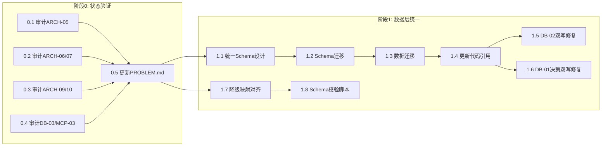
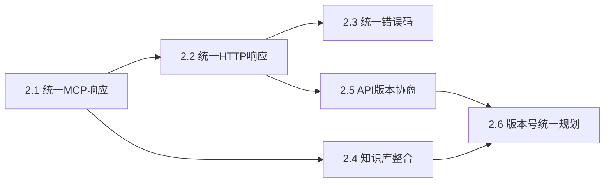
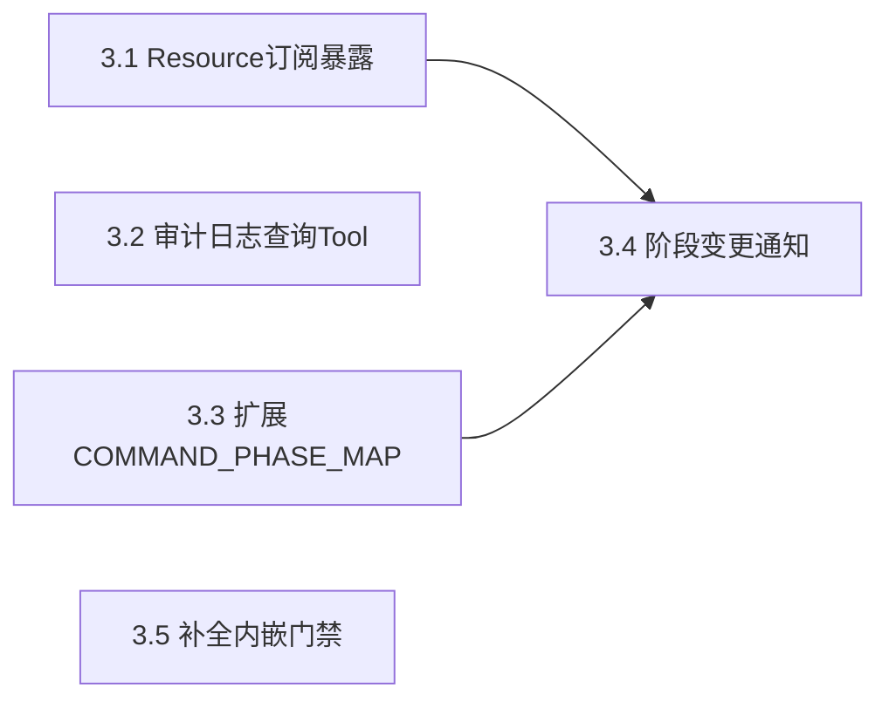
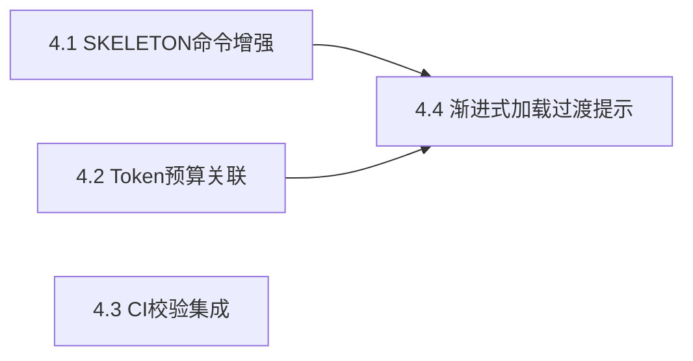
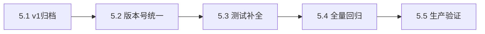
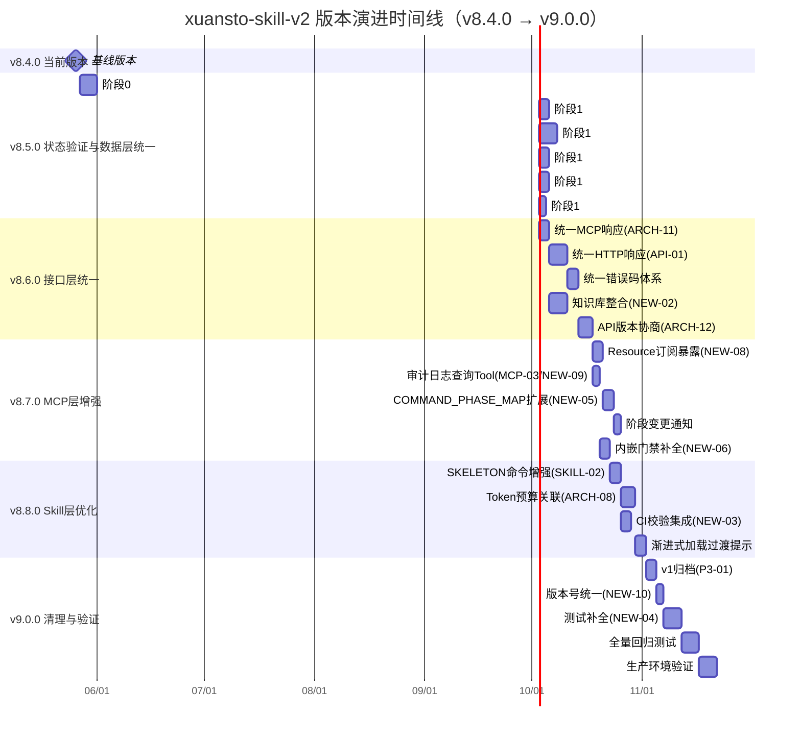
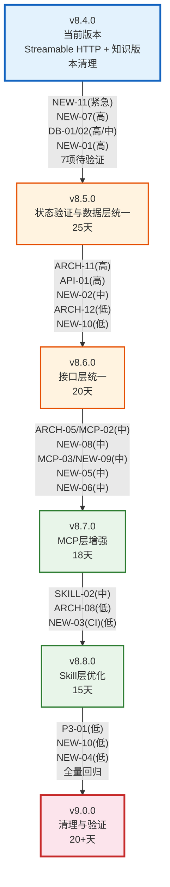
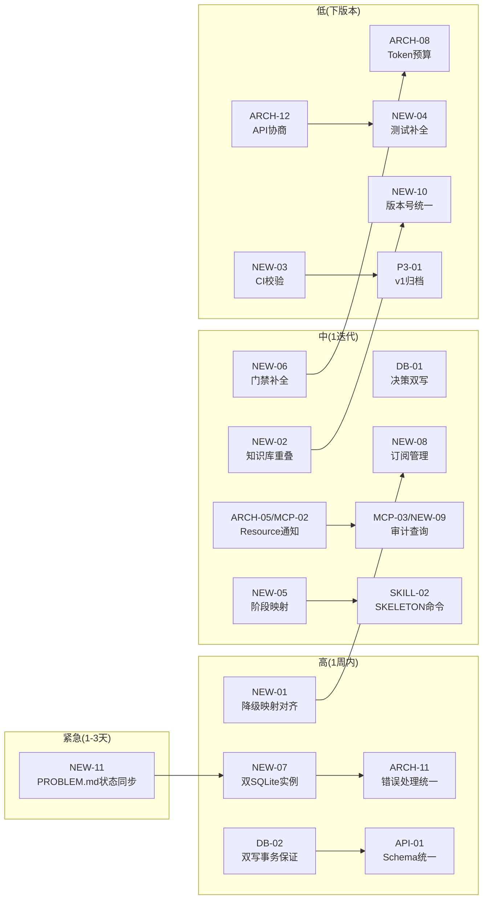

# xuansto-skill-v2 版本演进路线图

> 版本: 2.0 | 编写日期: 2026-05-26 | 编码: UTF-8 | 行尾: LF
> 当前版本: V_CURRENT=8.4.0 | 目标版本: V_NEXT_MAJOR=9.0.0
> 数据来源: REFACTOR_PLAN.md (6阶段重构) + PROBLEM.md (17项未修复) + CHANGELOG.md (8.0.0~8.4.0)

---

## 目录

1. [版本号定义规则](#1-版本号定义规则)
2. [当前状态总览](#2-当前状态总览)
3. [版本演进路线](#3-版本演进路线)
4. [版本时间线](#4-版本时间线)
5. [版本依赖关系](#5-版本依赖关系)
6. [问题关闭路线图](#6-问题关闭路线图)

---

## 1. 版本号定义规则

### 1.1 语义化版本（SemVer）

本项目采用 [语义化版本 2.0.0](https://semver.org/lang/zh-CN/) 规范，版本号格式为 **MAJOR.MINOR.PATCH**：

```
v8.4.0
│ │ │
│ │ └── PATCH：向后兼容的问题修复
│ └──── MINOR：向后兼容的功能新增
└────── MAJOR：不兼容的 API 变更
```

### 1.2 各层级升级条件

| 层级 | 升级条件 | 示例 |
|------|----------|------|
| **PATCH** | 修复 Bug、补充文档、性能优化，不改变任何 API 接口和行为 | v8.4.0 → v8.4.1：修复 PROBLEM.md 状态与代码不同步 |
| **MINOR** | 新增 MCP 工具、新增命令、新增 Agent、新增配置项，所有变更向后兼容 | v8.4.0 → v8.5.0：合并双 SQLite 实例、统一错误处理 |
| **MAJOR** | 破坏性变更：API 接口不兼容、配置格式升级、架构范式变更、删除已废弃功能 | v8.x → v9.0.0：统一数据库架构导致 API 变更、v1 归档 |

### 1.3 特殊版本标记

| 标记 | 含义 | 示例 |
|------|------|------|
| `-alpha.N` | 内部开发测试版，API 随时可能变更 | v8.5.0-alpha.1 |
| `-beta.N` | 功能冻结，仅修复缺陷，公开测试 | v8.5.0-beta.1 |
| `-rc.N` | 发布候选，除非发现阻断性问题否则即成为正式版 | v9.0.0-rc.1 |

### 1.4 当前版本矩阵

| 项目 | 版本 | 说明 |
|------|------|------|
| Skill (xuansto-skill-v2) | v8.4.0 | 当前基线版本 |
| MCP Server (xuansto-mcp-server) | v3.0.0 | MCP API 版本 |
| Knowledge Server HTTP API | v2.0.0 | 知识库 HTTP 接口版本 |
| MCP API | v3.0.0 | MCP 协议 API 版本 |

### 1.5 版本号统一目标

当前 MCP Server (v3.0.0) 与 Knowledge Server HTTP API (v2.0.0) 使用独立版本号，客户端无法统一判断兼容性（NEW-10）。v9.0.0 将统一为单一版本号体系。

---

## 2. 当前状态总览

### 2.1 已发布版本摘要

| 版本 | 发布日期 | 类型 | 核心内容 |
|------|----------|------|----------|
| v8.0.0 | 2026-05-24 | MAJOR | MCP Server + Skill 混合架构基线，20个MCP工具，57个Agent，3级降级 |
| v8.1.0 | 2026-05-26 | MINOR | Resource 暴露增强（27个），SKELETON 阶段基础命令 |
| v8.2.0 | 2026-05-26 | MINOR | 审计日志，统一响应格式，双写一致性（DB-01/02） |
| v8.3.0 | 2026-05-26 | MINOR | Agent/工作流持久化，Hook 超时，配置热更新，API 版本协商 |
| v8.4.0 | 2026-05-26 | MINOR | Streamable HTTP 传输，知识版本清理配置 |

### 2.2 未修复问题统计

> 以下统计基于 PROBLEM.md（17项）+ REFACTOR_PLAN.md 新发现（11项），去重后共 22 项独立问题

| 影响域 | 总数 | ⚠️待验证 | 未实现 | 已缓解 |
|--------|------|----------|--------|--------|
| 架构(ARCH) | 8 | 5 | 2 | 0 |
| 数据(DB) | 3 | 1 | 2 | 0 |
| MCP | 4 | 1 | 3 | 0 |
| Skill | 3 | 0 | 3 | 0 |
| API | 3 | 0 | 3 | 0 |
| 测试 | 1 | 0 | 1 | 0 |
| 管理 | 1 | 0 | 1 | 0 |
| **合计** | **23** | **7** | **15** | **1** |

### 2.3 ⚠️ 待验证问题说明

以下 7 个问题在代码中已有实现痕迹，但 PROBLEM.md 仍标记为未修复，需代码审计确认实际完成度：

| 编号 | 描述 | 代码证据 | 验证版本 |
|------|------|----------|----------|
| ARCH-05/MCP-02 | Resource 注册但订阅未暴露 | skill_resources.py 25+ Resource 已注册 | v8.5.0 |
| ARCH-06 | Agent 持久化 | agent_states 表 + agent_manage.py CRUD + load_on_startup | v8.5.0 |
| ARCH-07 | 工作流持久化 | workflow_states 表 + workflow_dispatch.py + load_on_startup | v8.5.0 |
| ARCH-09 | Hook 超时保护 | DEFAULT_HOOK_TIMEOUT_SECONDS=30.0 + asyncio.wait_for | v8.5.0 |
| ARCH-10 | 配置热更新 | watchfiles/SIGHUP/轮询三种热更新机制 | v8.5.0 |
| DB-03 | 版本历史清理 | cleanup_knowledge_versions(keep_last_n=10) | v8.5.0 |
| MCP-03 | 审计日志查询 | audit_logger.py 已实现记录，仅通过 Resource 暴露 | v8.5.0 |

---

## 3. 版本演进路线

### 3.1 v8.4.0 — 当前版本

> 状态: 已发布 | 类型: MINOR

#### 目标

Streamable HTTP 传输支持，知识版本清理配置化，为后续重构奠定基线。

#### 主要变更

| 维度 | 内容 |
|------|------|
| 传输层 | Streamable HTTP 传输支持（XUANSTO_TRANSPORT/XUANSTO_HOST/XUANSTO_PORT） |
| 数据层 | 知识条目版本历史清理配置项（KNOWLEDGE_VERSION_CLEANUP_KEEP_LAST_N） |
| 配置 | mcp-config.json 新增 HTTP 配置项 |

#### 遗留问题概览

22 项未修复问题 + 7 项待验证问题，详见 [2.2 未修复问题统计](#22-未修复问题统计)。

---

### 3.2 v8.5.0 — 状态验证与数据层统一

> 状态: 计划中 | 类型: MINOR | 预估工期: 25 天 | 前置依赖: 无
> 对应 REFACTOR_PLAN.md: 阶段0（状态验证）+ 阶段1（数据层统一）

#### 目标

1. 确认 7 个"待验证"问题的实际代码状态，更新 PROBLEM.md 使其与代码一致
2. 合并双 SQLite 实例（xuansto.db + knowledge.db），消除 knowledge_entries 重复定义
3. 修复双写一致性（DB-01/DB-02），建立对账与自动重试机制
4. 对齐降级映射（NEW-01），确保 constraints.yaml 为唯一权威源

#### 主要变更

| 步骤 | 问题 ID | 变更内容 | 涉及文件 |
|------|---------|----------|----------|
| 0.1 | ARCH-05/MCP-02 | 审计 Resource 注册清单 + 订阅机制状态，确认 25+ Resource 已注册 | `resources/skill_resources.py` |
| 0.2 | ARCH-06, ARCH-07 | 审计 Agent/工作流持久化完整性，确认 agent_states/workflow_states 表 + load_on_startup | `database.py`, `agent_manage.py`, `workflow_dispatch.py` |
| 0.3 | ARCH-09, ARCH-10 | 审计 Hook 超时保护 + 配置热更新机制 | `hook_engine.py`, `config.py` |
| 0.4 | DB-03, MCP-03 | 审计版本清理 + 审计日志记录逻辑 | `database.py`, `audit_logger.py` |
| 0.5 | NEW-11 | 更新 PROBLEM.md，使 6 个问题状态与代码实际一致 | `PROBLEM.md` |
| 1.1 | NEW-07 | 设计统一 Schema：合并 xuansto.db(14表) + knowledge.db(9表) | `database.py`, `db_engine.py` |
| 1.2 | NEW-07 | 实现 Schema 迁移（migration_v13.py），xuansto.db 包含所有 22+ 表 | `database.py` |
| 1.3 | NEW-07 | 实现数据迁移，knowledge.db 数据迁入 xuansto.db | 迁移脚本 |
| 1.4 | NEW-07 | 更新代码引用，所有知识操作指向 xuansto.db | `db_engine.py`, `database.py` |
| 1.5 | DB-02 | 修复 ChromaDB/SQLite 双写一致性：自动重试 3 次 + sync_status 追踪 | `database.py`, `knowledge_inject.py` |
| 1.6 | DB-01 | 修复决策双写一致性：SQLite 为主存储 + 文件系统备份可选 | `decision_log.py`, `database.py` |
| 1.7 | NEW-01 | 对齐降级映射：constraints.yaml 补全 6 个缺失映射（20 vs 14） | `degradation.py`, `constraints.yaml` |
| 1.8 | NEW-03 | spec-locks Schema 校验脚本实现（为后续 CI 集成做准备） | `scripts/validate_schemas.py` |

#### 关联问题

| 问题 ID | 描述 | 优先级 | 影响域 | 类型 |
|---------|------|--------|--------|------|
| NEW-11 | PROBLEM.md 状态与代码不同步 | **紧急** | 管理 | 状态验证 |
| ARCH-05/MCP-02 | Resource 注册但订阅未暴露 | 中 | 架构/MCP | 状态验证 |
| ARCH-06 | Agent 持久化（待验证） | 低 | 架构 | 状态验证 |
| ARCH-07 | 工作流持久化（待验证） | 低 | 架构 | 状态验证 |
| ARCH-09 | Hook 超时保护（待验证） | 低 | 架构 | 状态验证 |
| ARCH-10 | 配置热更新（待验证） | 低 | 架构 | 状态验证 |
| DB-03 | 版本历史清理（待验证） | 低 | 数据 | 状态验证 |
| MCP-03 | 审计日志查询（待验证） | 中 | MCP | 状态验证 |
| NEW-07 | 双 SQLite 实例问题 | **高** | 数据 | 实现 |
| DB-02 | ChromaDB/SQLite 双写无事务保证 | **高** | 数据 | 实现 |
| DB-01 | 决策记录双写一致性风险 | 中 | 数据 | 实现 |
| NEW-01 | 降级映射数量不一致（20 vs 14） | **高** | 架构/MCP | 实现 |
| NEW-03 | spec-locks 未在 CI 中强制校验 | 低 | 架构/CI | 实现 |

#### 受影响文件

| 文件 | 变更类型 |
|------|----------|
| `PROBLEM.md` | 更新（状态同步） |
| `xuansto-mcp-server/src/xuansto_mcp/core/database.py` | 修改（Schema 合并 + 迁移 + 双写增强） |
| `scripts/knowledge_server/db_engine.py` | 废弃（合并到 database.py） |
| `xuansto-mcp-server/src/xuansto_mcp/core/degradation.py` | 修改（降级映射对齐） |
| `.trae/skills/xuansto-skill-v2/constraints.yaml` | 修改（补全 6 个降级映射） |
| `xuansto-mcp-server/src/xuansto_mcp/tools/decision_log.py` | 修改（双写事务保证） |
| `xuansto-mcp-server/src/xuansto_mcp/tools/knowledge_inject.py` | 修改（双写增强） |
| `scripts/validate_schemas.py` | 新增（Schema 校验脚本） |

#### 依赖关系



#### 验收标准

1. PROBLEM.md 中 7 个待验证问题状态与代码实际一致（NEW-11 关闭）
2. xuansto.db 包含所有 22+ 表，knowledge.db 可安全删除（NEW-07 关闭）
3. 数据迁移前后条目数 100% 一致，FTS5 索引完整
4. ChromaDB 写入失败自动重试 3 次，sync_status='failed' 可追踪（DB-02 关闭）
5. 决策写入 SQLite 后确认持久化，文件系统备份可选（DB-01 关闭）
6. constraints.yaml 包含 20 个工具的完整降级声明，与 degradation.py 一致（NEW-01 关闭）
7. Schema 校验脚本可验证 Tool/API/Skill 定义与 spec-locks 一致（NEW-03 关闭）
8. 全量回归测试通过，已修复问题不回退

---

### 3.3 v8.6.0 — 接口层统一

> 状态: 计划中 | 类型: MINOR | 预估工期: 20 天 | 前置依赖: v8.5.0
> 对应 REFACTOR_PLAN.md: 阶段2（接口层统一）

#### 目标

1. 统一 MCP Tool 与 HTTP API 响应格式，消除 status:"success" vs status:"ok" 差异
2. 统一错误码体系，建立 MCP 错误码与 HTTP 状态码的明确映射
3. 解决知识库 HTTP 服务与 MCP Server 功能重叠问题（NEW-02）
4. 完善 API 版本协商机制（ARCH-12）

#### 主要变更

| 步骤 | 问题 ID | 变更内容 | 涉及文件 |
|------|---------|----------|----------|
| 2.1 | ARCH-11 | 统一 MCP Tool 响应格式：所有 Tool 返回 `{status, data, metadata}`，排查 20 个 Tool 返回字符串的边缘情况 | `errors.py`, `tools/*.py` |
| 2.2 | API-01 | 统一 HTTP API 响应格式：HTTP API 返回 `{status, data, error, metadata}`，与 MCP 格式对齐，status 值统一为 `ok`/`error` | `api.py`, `api_routes.py` |
| 2.3 | ARCH-11, API-01 | 统一错误码体系：合并 MCP 错误码（ERR_VALIDATION 等）与 HTTP 错误码（BAD_REQUEST 等），建立双向映射 | `errors.py`, `api_routes.py` |
| 2.4 | NEW-02 | 知识库 HTTP 服务整合：评估 knowledge_server/ 与 MCP knowledge_search 工具的重叠，统一为 MCP 优先 + HTTP 兼容层 | `knowledge_server/*`, `tools/knowledge_search.py` |
| 2.5 | ARCH-12 | API 版本协商完善：实现完整协商逻辑 + 客户端自动适配 + 不兼容时优雅降级 | `server_health.py`, `config.py` |
| 2.6 | NEW-10 | 版本号统一规划：制定 MCP Server 与 Knowledge Server 统一版本号方案 | `__init__.py`, `server.py` |

#### 关联问题

| 问题 ID | 描述 | 优先级 | 影响域 | 类型 |
|---------|------|--------|--------|------|
| ARCH-11 | 错误处理不统一 | **高** | 架构/MCP | 实现 |
| API-01 | HTTP/MCP 两套接口无统一 Schema | **高** | API | 实现 |
| NEW-02 | 知识库 HTTP 服务与 MCP Server 功能重叠 | 中 | 架构 | 实现 |
| ARCH-12 | API 版本协商机制不完整 | 低 | 架构/API | 实现 |
| NEW-10 | MCP 与 KB 版本号不一致 | 低 | API | 规划 |

#### 受影响文件

| 文件 | 变更类型 |
|------|----------|
| `xuansto-mcp-server/src/xuansto_mcp/core/errors.py` | 修改（统一错误码） |
| `xuansto-mcp-server/src/xuansto_mcp/tools/*.py` | 修改（20 个工具返回格式） |
| `scripts/knowledge_server/api.py` | 修改（响应格式统一） |
| `scripts/knowledge_server/api_routes.py` | 修改（响应格式统一） |
| `xuansto-mcp-server/src/xuansto_mcp/tools/server_health.py` | 修改（版本协商增强） |
| `scripts/knowledge_server/*` | 修改（功能重叠整合） |

#### 依赖关系



#### 验收标准

1. 所有 20 个 MCP Tool 统一返回 JSON 格式 `{status, data, metadata}`，无返回字符串的边缘情况（ARCH-11 关闭）
2. HTTP API 与 MCP 调用相同工具返回相同 JSON 结构，status 值统一（API-01 关闭）
3. MCP 错误码与 HTTP 状态码有明确双向映射表，文档化（ARCH-11/API-01 关闭）
4. 知识库 HTTP 服务与 MCP Server 功能重叠有明确整合方案并实施（NEW-02 关闭）
5. API 版本协商逻辑完整，版本不匹配时返回降级建议（ARCH-12 关闭）
6. 版本号统一方案已制定并获得团队认可（NEW-10 关闭或转为 v9.0.0 任务）
7. 降级响应格式与正常响应格式一致，degraded 字段标记降级状态

---

### 3.4 v8.7.0 — MCP 层增强

> 状态: 计划中 | 类型: MINOR | 预估工期: 18 天 | 前置依赖: v8.6.0
> 对应 REFACTOR_PLAN.md: 阶段3（MCP 层增强）

#### 目标

1. 暴露 Resource 订阅管理为 MCP Tool，使 Host 端可主动订阅变更通知
2. 增加审计日志查询 Tool 接口，支持按条件查询
3. 扩展 COMMAND_PHASE_MAP 覆盖全部 31 个命令
4. 补全内嵌质量门禁至 54 项，确保降级模式下门禁检查准确

#### 主要变更

| 步骤 | 问题 ID | 变更内容 | 涉及文件 |
|------|---------|----------|----------|
| 3.1 | ARCH-05/MCP-02, NEW-08 | 暴露 Resource 订阅管理：新增 `resource_subscribe`/`resource_unsubscribe` Tool，Host 端可主动订阅变更 | `skill_resources.py`, `tools/` 新增 |
| 3.2 | MCP-03, NEW-09 | 增加审计日志查询 Tool：新增 `audit_query` Tool，支持按 tool_name/date/limit 条件查询 | `audit_logger.py`, `tools/audit_query.py` 新增 |
| 3.3 | NEW-05 | 扩展 COMMAND_PHASE_MAP：从 6 个命令扩展到 31 个命令，每个命令都有明确的阶段推进映射 | `progressive_loader.py` |
| 3.4 | NEW-05 | 实现阶段变更通知：Phase 变更时通过 MCP `notifications/resources/updated` 推送通知 | `notifications.py`, `resource_load_status.py` |
| 3.5 | NEW-06 | 补全内嵌质量门禁：`_shared.py` 中 `_QUALITY_GATES` 从 13 项扩展到 54 项，与 references/quality-gates.md 一致 | `tools/_shared.py` |

#### 关联问题

| 问题 ID | 描述 | 优先级 | 影响域 | 类型 |
|---------|------|--------|--------|------|
| ARCH-05/MCP-02 | Resource 变更通知不可达 | 中 | 架构/MCP | 实现 |
| NEW-08 | Resource 订阅管理未暴露为 Tool | 中 | MCP | 实现 |
| MCP-03 | 审计日志缺少 Tool 查询接口 | 中 | MCP | 实现 |
| NEW-09 | 审计日志查询缺少 MCP Tool 接口 | 中 | MCP | 实现 |
| NEW-05 | COMMAND_PHASE_MAP 仅覆盖 6 个命令 | 中 | Skill | 实现 |
| NEW-06 | 内嵌门禁仅 13 项 vs 声明 54 项 | 中 | Skill/数据 | 实现 |

#### 受影响文件

| 文件 | 变更类型 |
|------|----------|
| `xuansto-mcp-server/src/xuansto_mcp/resources/skill_resources.py` | 修改（暴露订阅管理） |
| `xuansto-mcp-server/src/xuansto_mcp/tools/audit_query.py` | 新增（审计查询 Tool） |
| `xuansto-mcp-server/src/xuansto_mcp/core/audit_logger.py` | 修改（查询接口） |
| `scripts/knowledge_server/progressive_loader.py` | 修改（扩展 COMMAND_PHASE_MAP） |
| `scripts/knowledge_server/tools/_shared.py` | 修改（补全 54 项门禁） |
| `xuansto-mcp-server/src/xuansto_mcp/tools/resource_load_status.py` | 修改（阶段变更通知） |

#### 依赖关系



#### 验收标准

1. Host 端可通过 `resource_subscribe`/`resource_unsubscribe` Tool 管理订阅（ARCH-05/MCP-02/NEW-08 关闭）
2. Resource 内容变更时订阅客户端收到 `notifications/resources/updated` 通知
3. `audit_query` Tool 支持按 tool_name/date/limit 条件查询审计记录（MCP-03/NEW-09 关闭）
4. COMMAND_PHASE_MAP 覆盖全部 31 个命令，每个命令有明确的目标阶段（NEW-05 关闭）
5. Phase 变更时 Host 端收到 MCP 通知，延迟 ≤ 1s
6. `_QUALITY_GATES` 包含 54 项完整门禁，降级模式下所有门禁可检查（NEW-06 关闭）
7. 新增 Tool 注册到 TOOL_REGISTRY，降级映射同步更新

---

### 3.8 v8.8.0 — Skill 层优化

> 状态: 计划中 | 类型: MINOR | 预估工期: 15 天 | 前置依赖: v8.7.0
> 对应 REFACTOR_PLAN.md: 阶段4（Skill 层优化）

#### 目标

1. 增强 SKELETON 阶段可用命令，改善用户首次交互体验
2. 建立 Token 预算与加载阶段的完整关联，实现阶段推进自动调整预算
3. 实现 spec-locks CI 强制校验，防止 API 契约被意外破坏
4. 完善渐进式加载过渡动画与用户提示

#### 主要变更

| 步骤 | 问题 ID | 变更内容 | 涉及文件 |
|------|---------|----------|----------|
| 4.1 | SKILL-02 | SKELETON 命令增强：确认 `/status`、`/help`、`/budget` 在 Phase 0 可用，增加 `/agent-status`、`/decision` 查询命令 | `SKILL.md`, `constraints.yaml`, `resource_load_status.py` |
| 4.2 | ARCH-08 | Token 预算与阶段关联：阶段推进时自动调整 `phase_allocations`，预算超限触发阶段降级 | `token_budget.py`, `progressive_loader.py` |
| 4.3 | NEW-03 | spec-locks CI 校验集成：PR 提交时自动校验 API 契约一致性 | `.github/workflows/ci.yml`, `scripts/validate_schemas.py` |
| 4.4 | — | 渐进式加载过渡提示：阶段转换时向用户提供清晰的提示信息（加载中 + 就绪） | `resource_load_status.py`, `SKILL.md` |

#### 关联问题

| 问题 ID | 描述 | 优先级 | 影响域 | 类型 |
|---------|------|--------|--------|------|
| SKILL-02 | SKELETON 阶段无可用命令 | 中 | Skill | 实现 |
| ARCH-08 | Token 预算与加载阶段未关联 | 低 | 架构/Skill | 实现 |
| NEW-03 | spec-locks 未在 CI 中强制校验 | 低 | 架构/CI | 实现 |

#### 受影响文件

| 文件 | 变更类型 |
|------|----------|
| `.trae/skills/xuansto-skill-v2/SKILL.md` | 修改（SKELETON 命令 + 过渡提示） |
| `.trae/skills/xuansto-skill-v2/constraints.yaml` | 修改（SKELETON 可用命令） |
| `xuansto-mcp-server/src/xuansto_mcp/tools/token_budget.py` | 修改（阶段关联） |
| `scripts/knowledge_server/progressive_loader.py` | 修改（预算联动） |
| `xuansto-mcp-server/src/xuansto_mcp/tools/resource_load_status.py` | 修改（过渡提示） |
| `.github/workflows/ci.yml` | 修改（Schema 校验步骤） |

#### 依赖关系



#### 验收标准

1. Phase 0 用户可执行 `/status`、`/help`、`/budget`、`/agent-status`、`/decision` 且不触发阶段推进（SKILL-02 关闭）
2. 阶段推进时 `phase_allocations` 自动更新，Token 预算与 LoadPhase 正确关联（ARCH-08 关闭）
3. Token 使用率 ≥ 80% 触发降级提示，≥ 95% 触发阶段降级
4. PR 提交时自动校验 Tool/API/Skill Schema 与 spec-locks 一致，不一致则阻止合并（NEW-03 关闭）
5. 阶段转换时用户收到加载中提示 + 就绪提示，提示内容与转换方向匹配
6. Phase 0 加载时间 ≤ 500ms，Phase 0→1 推进时间 ≤ 2s

---

### 3.9 v9.0.0 — 清理与验证（MAJOR）

> 状态: 远期规划 | 类型: MAJOR | 预估工期: 20+ 天 | 前置依赖: v8.8.0
> 对应 REFACTOR_PLAN.md: 阶段5（清理与验证）

#### 目标

1. 归档 v1 代码，确立 v2 为唯一维护版本
2. 统一 MCP Server 与 Knowledge Server 版本号
3. 补全测试覆盖，确保生产就绪
4. 全量回归验证，关闭所有遗留问题

#### 主要变更

| 步骤 | 问题 ID | 变更内容 | 涉及文件 |
|------|---------|----------|----------|
| 5.1 | P3-01 | v1 文件归档：v1 文件移至 `archived/` 目录或添加 `.deprecated` 标记，v2 为唯一版本 | `agents/`, `commands/`, `workflows/` |
| 5.2 | NEW-10 | 版本号统一：MCP Server 和 KB HTTP API 使用同一版本号 | `__init__.py`, `server.py` |
| 5.3 | NEW-04 | 测试补全：为 config_manage/metrics_report 等工具补充专项测试 | `tests/` |
| 5.4 | — | 全量回归测试：100% 通过率，新增测试覆盖新功能 | `tests/` |
| 5.5 | — | 生产环境部署验证 | — |

#### 破坏性变更（MAJOR 升级原因）

| 变更 | 影响 | 迁移方式 |
|------|------|----------|
| v1 代码归档 | v1 Agent/命令/工作流文件不再参与加载 | 确认无 v1 引用后归档 |
| 版本号统一 | Knowledge Server HTTP API 版本从 v2.0.0 变更为与 MCP Server 一致 | 客户端需适配新版本号 |
| 数据库架构变更 | xuansto.db 为唯一数据库，knowledge.db 不再存在 | 运行迁移脚本（v8.5.0 已实现） |
| API 契约锁定 | spec-locks 成为强制校验，API 变更需显式更新锁文件 | PR 流程增加 Schema 校验步骤 |

#### 关联问题

| 问题 ID | 描述 | 优先级 | 影响域 | 类型 |
|---------|------|--------|--------|------|
| P3-01 | v1 与 v2 存在重复文件 | 低 | 架构 | 实现 |
| NEW-10 | MCP 与 KB 版本号不一致 | 低 | API | 实现 |
| NEW-04 | 部分工具缺少专项测试 | 低 | 测试 | 实现 |

#### 受影响文件

| 文件 | 变更类型 |
|------|----------|
| `agents/` | 修改（v1 标记 archived） |
| `commands/` | 修改（v1 标记 archived） |
| `workflows/` | 修改（v1 标记 archived） |
| `xuansto-mcp-server/src/xuansto_mcp/__init__.py` | 修改（版本号统一） |
| `scripts/knowledge_server/server.py` | 修改（版本号统一） |
| `tests/` | 新增（专项测试） |
| `.github/workflows/ci.yml` | 修改（全量回归步骤） |

#### 依赖关系



#### 验收标准

1. 无 v1 文件残留在加载路径中，v1 全部标记为 archived（P3-01 关闭）
2. MCP Server 和 KB HTTP API 使用同一版本号（NEW-10 关闭）
3. config_manage/metrics_report 等工具有专项测试覆盖（NEW-04 关闭）
4. 全量回归测试 100% 通过率
5. 22 项问题全部关闭（15 未实现 + 7 待验证）
6. 生产环境部署验证通过
7. CHANGELOG.md 更新至 v9.0.0

---

## 4. 版本时间线



---

## 5. 版本依赖关系



### 5.1 依赖关系说明

| 版本 | 前置依赖 | 依赖原因 |
|------|----------|----------|
| v8.5.0 | v8.4.0 | 状态验证基于当前基线，数据层统一是后续所有接口变更的基础 |
| v8.6.0 | v8.5.0 | 接口层统一依赖数据层合并完成（统一数据库连接后才能统一响应格式） |
| v8.7.0 | v8.6.0 | MCP 层增强依赖接口层统一（Resource 订阅和审计查询需要统一响应格式） |
| v8.8.0 | v8.7.0 | Skill 层优化依赖 MCP 层增强（阶段推进映射和门禁补全需要 MCP 层稳定） |
| v9.0.0 | v8.8.0 | MAJOR 版本依赖所有 MINOR 版本优化完成，确保清理基线稳定 |

### 5.2 关键影响链路

#### 链路1：双 SQLite → 数据一致性 → 接口统一

```
NEW-07(双SQLite) → DB-02(双写一致性) → API-01(响应格式统一)
```

v8.5.0 合并数据库是 v8.6.0 接口统一的前置条件。数据库不统一，响应格式无法统一。

#### 链路2：降级映射 → 错误处理 → 审计查询

```
NEW-01(降级映射) → ARCH-11(错误处理) → MCP-03/NEW-09(审计查询)
```

v8.5.0 对齐降级映射后，v8.6.0 才能统一错误处理格式，v8.7.0 才能基于统一格式实现审计查询。

#### 链路3：阶段推进 → Token 预算 → 用户体验

```
NEW-05(COMMAND_PHASE_MAP) → ARCH-08(Token预算) → SKILL-02(SKELETON命令)
```

v8.7.0 扩展阶段映射后，v8.8.0 才能建立完整的 Token 预算关联和 SKELETON 命令增强。

---

## 6. 问题关闭路线图

### 6.1 按版本关闭计划

| 版本 | 关闭问题 | 关闭数量 | 累计关闭 |
|------|----------|----------|----------|
| v8.0.0~8.4.0 | P0-01, P0-02, P1-01~P1-06, P2-01, P2-02, SKILL-01, SKILL-03, API-02 | 13 | 13 |
| v8.5.0 | NEW-11, ARCH-05/MCP-02(验证), ARCH-06(验证), ARCH-07(验证), ARCH-09(验证), ARCH-10(验证), DB-03(验证), MCP-03(验证), NEW-07, DB-02, DB-01, NEW-01, NEW-03(脚本) | 13 | 26 |
| v8.6.0 | ARCH-11, API-01, NEW-02, ARCH-12, NEW-10(规划) | 5 | 31 |
| v8.7.0 | NEW-08, MCP-03/NEW-09(Tool接口), NEW-05, NEW-06 | 4 | 35 |
| v8.8.0 | SKILL-02, ARCH-08, NEW-03(CI集成) | 3 | 38 |
| v9.0.0 | P3-01, NEW-10(实施), NEW-04 | 3 | 41 |

> 注：部分问题编号在不同文档中有重叠（如 ARCH-05/MCP-02），按独立问题计数为 22+11-去重 = 约 22 项核心问题。

### 6.2 按优先级关闭顺序



### 6.3 风险与缓解

| 风险 | 影响版本 | 缓解措施 |
|------|----------|----------|
| 数据迁移失败（knowledge.db → xuansto.db） | v8.5.0 | 迁移前备份，Schema 验证 + 数据条目数校验 + FTS5 索引验证，失败自动回滚 |
| 待验证问题实际未完成 | v8.5.0 | 代码审计优先，未完成项降级为"未实现"并纳入后续版本 |
| 知识库 HTTP 服务整合导致 HTTP 客户端不兼容 | v8.6.0 | 保留 HTTP 兼容层，MCP 优先 + HTTP 透传，渐进式废弃 |
| COMMAND_PHASE_MAP 扩展影响现有阶段推进逻辑 | v8.7.0 | 新增映射仅影响未覆盖的 25 个命令，已有 6 个映射不变 |
| v1 归档遗漏引用 | v9.0.0 | 全局搜索 v1 引用，归档前确认无残留加载路径 |

---

> 文档结束 | 生成时间: 2026-05-26 | 版本路线: v8.4.0 → v8.5.0 → v8.6.0 → v8.7.0 → v8.8.0 → v9.0.0
