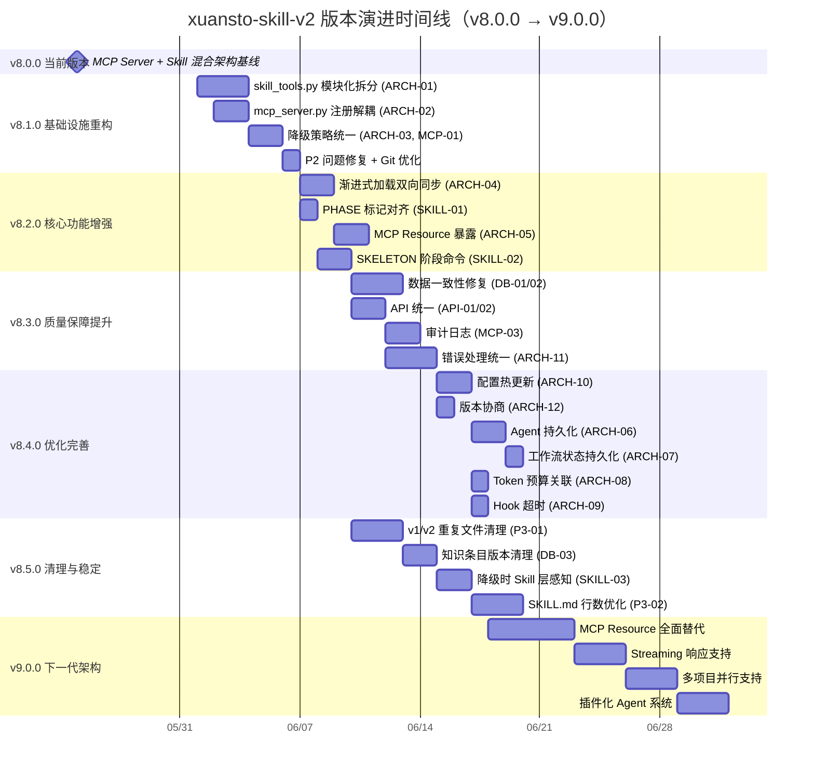
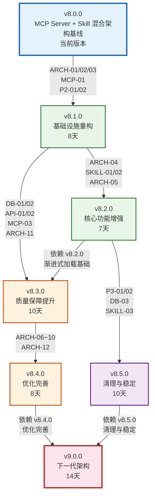

# xuansto-skill-v2 版本演进路线图

> 版本: 8.0.0 | 编写日期: 2026-05-25 | 编码: UTF-8 | 行尾: LF
> 当前版本: V_CURRENT=8.0.0 | 目标版本: V_NEXT_MAJOR=9.0.0

---

## 目录

1. [版本号定义规则](#1-版本号定义规则)
2. [版本演进路线](#2-版本演进路线)
3. [版本时间线](#3-版本时间线)
4. [版本依赖关系](#4-版本依赖关系)

---

## 1. 版本号定义规则

### 1.1 语义化版本（SemVer）

本项目采用 [语义化版本 2.0.0](https://semver.org/lang/zh-CN/) 规范，版本号格式为 **MAJOR.MINOR.PATCH**：

```
v9.0.0
│ │ │
│ │ └── PATCH：向后兼容的问题修复
│ └──── MINOR：向后兼容的功能新增
└────── MAJOR：不兼容的 API 变更
```

### 1.2 各层级升级条件

| 层级 | 升级条件 | 示例 |
|------|----------|------|
| **PATCH** | 修复 Bug、补充文档、性能优化，不改变任何 API 接口和行为 | v8.1.0 → v8.1.1：修复降级脚本路径解析错误 |
| **MINOR** | 新增 MCP 工具、新增命令、新增 Agent、新增配置项，所有变更向后兼容 | v8.1.0 → v8.2.0：新增渐进式加载双向同步机制 |
| **MAJOR** | 破坏性变更：API 接口不兼容、配置格式升级、架构范式变更、删除已废弃功能 | v8.x → v9.0.0：MCP Resource 全面替代部分 Tool |

### 1.3 特殊版本标记

| 标记 | 含义 | 示例 |
|------|------|------|
| `-alpha.N` | 内部开发测试版，API 随时可能变更 | v8.3.0-alpha.1 |
| `-beta.N` | 功能冻结，仅修复缺陷，公开测试 | v8.3.0-beta.1 |
| `-rc.N` | 发布候选，除非发现阻断性问题否则即成为正式版 | v9.0.0-rc.1 |

---

## 2. 版本演进路线

### 2.1 v8.0.0 — 当前版本

> 状态: 已发布 | 类型: MAJOR

#### 目标

MCP Server + Skill 混合架构基线，确立多 Agent 自主开发编排引擎的核心架构。

#### 主要变更

| 维度 | 内容 |
|------|------|
| MCP 工具 | 26 个 MCP 工具（mcp_server.py 11 + skill_tools.py 15） |
| Agent 体系 | 57 个 Agent / 13 层编排 |
| 质量门禁 | 54 项质量门禁 |
| 命令系统 | 31 个命令 |
| 渐进式加载 | 4 阶段加载（SKELETON → CORE → EXTENDED → FULL） |
| 降级策略 | 3 级降级（MCP → 脚本 → 内联） |

#### 已知问题

| 编号 | 类别 | 说明 |
|------|------|------|
| P2-01 | 流程 | 缺少 evals 评估框架 |
| P2-02 | 流程 | 缺少 CHANGELOG |
| ARCH-01 | 架构 | skill_tools.py 单文件过大，需模块化拆分 |
| ARCH-02 | 架构 | mcp_server.py 注册逻辑耦合，需解耦 |
| ARCH-03 | 架构 | 降级策略分散，需统一 |
| ARCH-04 | 架构 | 渐进式加载缺乏双向同步 |
| ARCH-05 | 架构 | MCP Resource 未暴露 |
| ARCH-06 | 架构 | Agent 无持久化机制 |
| ARCH-07 | 架构 | 工作流状态无持久化 |
| ARCH-08 | 架构 | Token 预算与 Phase 无关联 |
| ARCH-09 | 架构 | Hook 缺乏超时控制 |
| ARCH-10 | 架构 | 配置无热更新能力 |
| ARCH-11 | 架构 | 错误处理分散不统一 |
| ARCH-12 | 架构 | 缺乏版本协商机制 |
| DB-01 | 数据 | 数据一致性风险 |
| DB-02 | 数据 | 双写事务保证缺失 |
| DB-03 | 数据 | 知识条目版本无清理策略 |
| MCP-01 | MCP | MCPToolFallback 映射硬编码 |
| MCP-02 | MCP | MCP 工具注册缺乏分类 |
| MCP-03 | MCP | 缺乏审计日志 |
| SKILL-01 | Skill | PHASE 标记与加载阶段不对齐 |
| SKILL-02 | Skill | SKELETON 阶段无可用命令 |
| SKILL-03 | Skill | 降级时 Skill 层无感知 |
| API-01 | API | HTTP 与 MCP 接口 Schema 不统一 |
| API-02 | API | API 版本协商缺失 |

#### 验收标准

1. MCP Server 可正常启动并响应 `initialize` 请求
2. 基本命令（`/init`、`/status`、`/plan`）可用
3. 26 个 MCP 工具可通过 MCP 协议调用

---

### 2.2 v8.1.0 — 基础设施重构

> 状态: 计划中 | 类型: MINOR | 预估工期: 8 天 | 前置依赖: 无

#### 目标

重构基础设施，解决架构层面的核心耦合问题，建立模块化、可扩展的代码组织结构。

#### 主要变更

| 子任务 | 变更内容 | 涉及文件 |
|--------|----------|----------|
| ARCH-01 | skill_tools.py 模块化拆分，拆为 16 个独立工具模块 | `tools/*.py` |
| ARCH-02 | mcp_server.py 注册解耦，工具自注册机制 | `mcp_server.py`, `tools/*.py` |
| ARCH-03 | 降级策略统一，MCPToolFallback 从 YAML 读取映射 | `degradation.py`, `configs/fallback.yaml` |
| MCP-01 | MCPToolFallback 映射从硬编码迁移到 YAML 配置 | `configs/fallback.yaml` |
| P2-01 | 补全 evals 评估框架 | `evals/` |
| P2-02 | 创建 CHANGELOG.md | `CHANGELOG.md` |
| Git 基础设施优化 | 优化 Git 工作流和分支策略 | `.github/` |

#### 关联问题

ARCH-01, ARCH-02, ARCH-03, MCP-01, P2-01, P2-02

#### 验收标准

1. `tools/` 目录包含 16 个工具模块，每个模块独立可测试
2. MCPToolFallback 从 YAML 配置文件读取映射关系，不再硬编码
3. `evals/` 目录包含完整评估框架
4. `CHANGELOG.md` 存在并记录 v8.0.0 基线

---

### 2.3 v8.2.0 — 核心功能增强

> 状态: 计划中 | 类型: MINOR | 预估工期: 7 天 | 前置依赖: v8.1.0

#### 目标

增强核心功能，实现渐进式加载的双向同步、PHASE 标记对齐、MCP Resource 暴露，以及 SKELETON 阶段可用命令。

#### 主要变更

| 子任务 | 变更内容 | 涉及文件 |
|--------|----------|----------|
| ARCH-04 | 渐进式加载双向同步，命令执行时自动推进加载阶段 | `resource_load_status.py`, `constraints.yaml` |
| SKILL-01 | PHASE 标记对齐，SKILL.md 标记与加载阶段一一对应 | `SKILL.md` |
| ARCH-05 | MCP Resource 暴露，实现 3 个 `@mcp.resource()` 装饰器 | `mcp_server.py` |
| SKILL-02 | SKELETON 阶段命令，Phase 0 提供最小可用命令集 | `commands/`, `routes.yaml` |

#### 关联问题

ARCH-04, SKILL-01, ARCH-05, SKILL-02

#### 验收标准

1. 命令执行时自动推进加载阶段，无需手动切换
2. PHASE 标记与加载阶段严格对齐，无偏移
3. 3 个 Resource 可通过 MCP 协议访问（`list_resources` 返回 3 个 URI）
4. SKELETON 阶段有可用命令，用户无需等待全量加载

---

### 2.4 v8.3.0 — 质量保障提升

> 状态: 计划中 | 类型: MINOR | 预估工期: 10 天 | 前置依赖: v8.1.0, v8.2.0

#### 目标

提升质量保障能力，修复数据一致性问题、统一 API 接口、增加审计日志、统一错误处理。

#### 主要变更

| 子任务 | 变更内容 | 涉及文件 |
|--------|----------|----------|
| DB-01 | 数据一致性修复，双写确认机制 | `db_engine.py`, `vector_engine.py` |
| DB-02 | 双写事务保证，SQLite 写入成功后标记 pending，ChromaDB 写入成功后标记 ready | `db_engine.py` |
| API-01 | HTTP 与 MCP 接口 Schema 统一，使用相同 JSON Schema | `mcp_server.py`, `api_routes.py` |
| API-02 | API 版本协商，`server_health` 返回版本兼容性检查 | `mcp_server.py` |
| MCP-03 | 审计日志，工具调用全链路记录 | `audit.py`, `mcp_server.py` |
| ARCH-11 | 错误处理统一，统一异常分类 + 降级协调器 | `degradation.py`, `mcp_server.py` |

#### 关联问题

DB-01, DB-02, API-01, API-02, MCP-03, ARCH-11

#### 验收标准

1. 双写事务保证，SQLite 与 ChromaDB 不一致率 <0.1%
2. HTTP 与 MCP 接口使用统一 JSON Schema，错误响应包含 `code/message/details/retryable`
3. 工具调用有审计日志，记录调用时间、参数、结果、耗时

---

### 2.5 v8.4.0 — 优化完善

> 状态: 计划中 | 类型: MINOR | 预估工期: 8 天 | 前置依赖: v8.3.0

#### 目标

优化系统运行时能力，实现配置热更新、版本协商、Agent 持久化、工作流状态持久化、Token 预算关联和 Hook 超时控制。

#### 主要变更

| 子任务 | 变更内容 | 涉及文件 |
|--------|----------|----------|
| ARCH-10 | 配置热更新，运行时修改配置无需重启 | `configs/default.yaml`, `config_watcher.py` |
| ARCH-12 | 版本协商，客户端与服务端 API 版本协商机制 | `mcp_server.py` |
| ARCH-06 | Agent 持久化，Agent 状态可持久化到 SQLite | `db_engine.py`, `agents/` |
| ARCH-07 | 工作流状态持久化，工作流执行状态可持久化 | `db_engine.py`, `workflows/` |
| ARCH-08 | Token 预算关联，Token 预算与 Phase 加载阶段关联 | `token_budget.py`, `constraints.yaml` |
| ARCH-09 | Hook 超时，Hook 执行超时控制 | `hooks/hooks.json`, `hook_engine.py` |

#### 关联问题

ARCH-06, ARCH-07, ARCH-08, ARCH-09, ARCH-10, ARCH-12

#### 验收标准

1. 配置变更无需重启，运行时自动生效
2. API 版本协商可用，不兼容版本返回明确错误
3. Agent 状态可持久化，会话恢复后不丢失
4. 工作流状态可持久化，中断后可恢复执行
5. Token 预算与 Phase 关联，超预算自动降级
6. Hook 执行超时可控，超时不阻塞主流程

---

### 2.6 v8.5.0 — 清理与稳定

> 状态: 计划中 | 类型: MINOR | 预估工期: 10 天 | 前置依赖: v8.2.0

#### 目标

清理遗留问题，处理 v1/v2 重复文件、知识条目版本清理、降级时 Skill 层感知、SKILL.md 行数优化。

#### 主要变更

| 子任务 | 变更内容 | 涉及文件 |
|--------|----------|----------|
| P3-01 | v1/v2 重复文件清理，v1 标记 archived | `agents/`, `references/`, `scripts/` |
| DB-03 | 知识条目版本清理策略，自动归档超期版本 | `db_engine.py`, `knowledge_server/` |
| SKILL-03 | 降级时 Skill 层感知，降级事件通知 Skill 层 | `degradation.py`, `SKILL.md` |
| P3-02 | SKILL.md 行数优化，详细步骤外移到 `references/` | `SKILL.md`, `references/` |

#### 关联问题

P3-01, P3-02, DB-03, SKILL-03

#### 验收标准

1. v1 标记 archived，不再参与加载和索引
2. 版本历史有清理策略，超期条目自动归档
3. 降级时 Skill 层可感知，SKILL.md 包含降级通知标记
4. SKILL.md 行数 ≤500 行，Phase 0 内容 ≤2K Token

---

### 2.7 v9.0.0 — 下一大版本

> 状态: 远期规划 | 类型: MAJOR | 预估工期: 14 天 | 前置依赖: v8.4.0, v8.5.0

#### 目标

下一代架构，实现 MCP Resource 优先架构、流式响应、多项目并行支持和插件化 Agent 系统。

#### 主要变更

| 子任务 | 变更内容 |
|--------|----------|
| MCP Resource 全面替代部分 Tool | 将查询类 Tool 迁移为 Resource，Tool 仅保留写操作 |
| Streaming 响应支持 | MCP 协议流式响应，长任务实时反馈 |
| 多项目并行支持 | 项目隔离，多项目同时运行互不干扰 |
| 插件化 Agent 系统 | Agent 可插拔注册，第三方 Agent 可扩展 |

#### 破坏性变更（MAJOR 升级原因）

| 变更 | 影响 | 迁移方式 |
|------|------|----------|
| Resource 优先架构 | 查询类 Tool 接口变更，旧客户端需适配 | 使用 Resource 替代 Tool 查询 |
| 流式响应格式 | 响应格式从同步变更为流式 | 客户端需支持 SSE/Streamable HTTP |
| 多项目隔离 | 单项目配置格式变更 | 迁移到多项目配置格式 |
| 插件化 Agent | Agent 注册接口变更 | 使用新插件注册协议 |

#### 验收标准

1. Resource 优先架构，查询操作通过 Resource 执行，写操作通过 Tool 执行
2. 流式响应可用，长任务（>5s）自动切换为流式
3. 多项目隔离，项目间数据、配置、状态完全隔离
4. 第三方 Agent 可通过插件协议注册并运行

---

## 3. 版本时间线



---

## 4. 版本依赖关系



### 4.1 依赖关系说明

| 版本 | 前置依赖 | 依赖原因 |
|------|----------|----------|
| v8.1.0 | 无 | 基础设施重构，独立进行 |
| v8.2.0 | v8.1.0 | 渐进式加载依赖模块化拆分后的工具结构 |
| v8.3.0 | v8.1.0, v8.2.0 | 数据一致性依赖降级策略统一；API 统一依赖渐进式加载基础 |
| v8.4.0 | v8.3.0 | 持久化机制依赖统一错误处理和审计日志 |
| v8.5.0 | v8.2.0 | 清理工作依赖渐进式加载和 PHASE 标记对齐 |
| v9.0.0 | v8.4.0, v8.5.0 | 下一代架构依赖优化完善和清理稳定均完成 |

---

> 文档结束 | 生成时间: 2026-05-25 | 版本路线: v8.0.0 → v8.1.0 → v8.2.0 → v8.3.0 → v8.4.0 → v8.5.0 → v9.0.0
