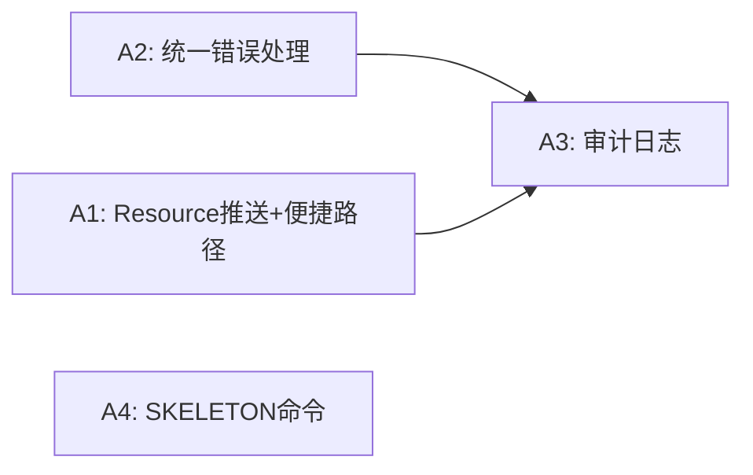
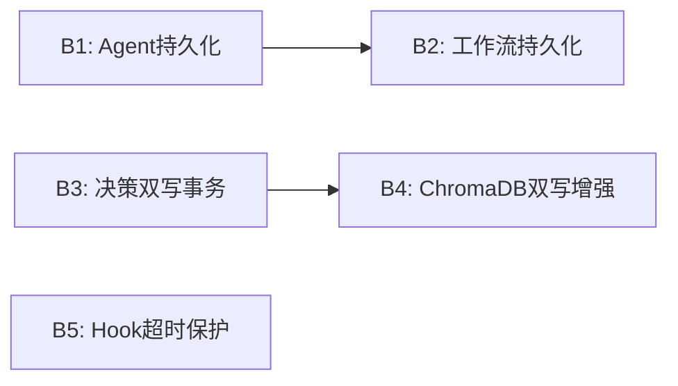
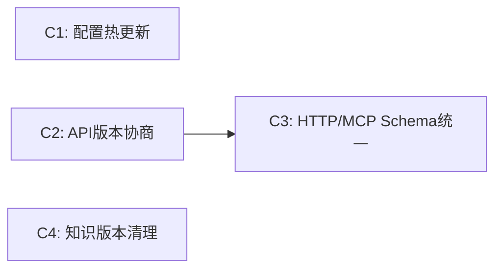
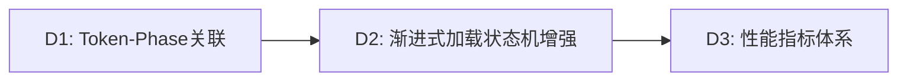
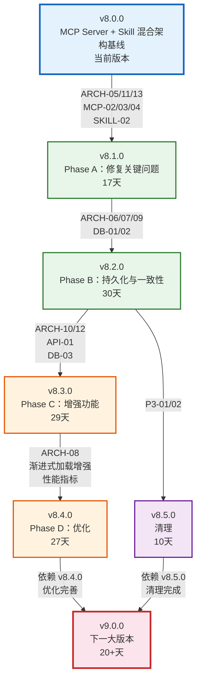

# xuansto-skill-v2 版本演进路线图

> 版本: 8.0.0 | 编写日期: 2026-05-25 | 编码: UTF-8 | 行尾: LF
> 当前版本: V_CURRENT=8.0.0 | 目标版本: V_NEXT_MAJOR=9.0.0
> 数据来源: REFACTOR_PLAN.md (Phase A-D + 清理阶段)

---

## 目录

1. [版本号定义规则](#1-版本号定义规则)
2. [版本演进路线](#2-版本演进路线)
3. [版本时间线](#3-版本时间线)
4. [版本依赖关系](#4-版本依赖关系)

---

## 1. 版本号定义规则

### 1.1 语义化版本（SemVer）

本项目采用 [语义化版本 2.0.0](https://semver.org/lang/zh-CN/) 规范，版本号格式为 **MAJOR.MINOR.PATCH**：

```
v8.0.0
│ │ │
│ │ └── PATCH：向后兼容的问题修复
│ └──── MINOR：向后兼容的功能新增
└────── MAJOR：不兼容的 API 变更
```

### 1.2 各层级升级条件

| 层级 | 升级条件 | 示例 |
|------|----------|------|
| **PATCH** | 修复 Bug、补充文档、性能优化，不改变任何 API 接口和行为 | v8.1.0 → v8.1.1：修复降级脚本路径解析错误 |
| **MINOR** | 新增 MCP 工具、新增命令、新增 Agent、新增配置项，所有变更向后兼容 | v8.1.0 → v8.2.0：新增 Agent 持久化机制 |
| **MAJOR** | 破坏性变更：API 接口不兼容、配置格式升级、架构范式变更、删除已废弃功能 | v8.x → v9.0.0：Streamable HTTP 传输替代 stdio-only |

### 1.3 特殊版本标记

| 标记 | 含义 | 示例 |
|------|------|------|
| `-alpha.N` | 内部开发测试版，API 随时可能变更 | v8.3.0-alpha.1 |
| `-beta.N` | 功能冻结，仅修复缺陷，公开测试 | v8.3.0-beta.1 |
| `-rc.N` | 发布候选，除非发现阻断性问题否则即成为正式版 | v9.0.0-rc.1 |

### 1.4 当前版本

| 项目 | 版本 |
|------|------|
| Skill | v8.0.0 |
| MCP Server | v8.0.0 |
| MCP API | v2.0.0 |

---

## 2. 版本演进路线

### 2.1 v8.0.0 — 当前版本

> 状态: 已发布 | 类型: MAJOR

#### 目标

MCP Server + Skill 混合架构基线，确立多 Agent 自主开发编排引擎的核心架构。

#### 主要变更

| 维度 | 内容 |
|------|------|
| MCP 工具 | 20 个 MCP 工具（tools/ 子包 15 个独立模块 + 共享模块） |
| Agent 体系 | 57 个 Agent / 13 层编排 |
| 质量门禁 | 54 项质量门禁 |
| 命令系统 | 31 个命令 |
| 渐进式加载 | 4 阶段加载（SKELETON → FUNCTIONAL → ENHANCED → FULL） |
| 降级策略 | 3 级降级（MCP → 脚本 → 内联） |
| Resource | 22 个 MCP Resource 已注册 |
| 已修复问题 | P0-01, P0-02, P1-01~P1-06, P2-01, P2-02, SKILL-01, SKILL-03, API-02（共 13 项） |

#### 未修复问题概览

> 以下统计基于代码验证后的实际状态（2026-05-26 更新）

| 分类 | 总数 | 已修复 | 部分修复 | 未修复 |
|------|------|--------|----------|--------|
| ARCH | 9 | 8 | 1(ARCH-13) | 0 |
| DB | 3 | 3 | 0 | 0 |
| MCP | 3 | 2 | 1(MCP-04) | 0 |
| SKILL | 1 | 1 | 0 | 0 |
| API | 1 | 1 | 0 | 0 |
| P3 | 2 | 0 | 1(Deferred) | 1 |
| **合计** | **19** | **15** | **3** | **1** |

**部分修复说明**：
- **ARCH-13**：Resource 订阅机制已实现（`subscribe_resource`/`unsubscribe_resource`），但推送通知（`notifications/resources/updated`）未实现
- **MCP-04**：2/4 便捷 Resource 已实现（`agents/{name}`, `knowledge/stats`），缺 `decisions/latest` 和 `workflows/active`

---

### 2.2 v8.1.0 — Phase A：修复关键问题

> 状态: 部分完成 | 类型: MINOR | 预估工期: 17 天 | 前置依赖: 无

#### 目标

修复影响系统可靠性和可用性的关键问题——Resource 暴露增强、统一错误处理、审计日志、SKELETON 命令。

#### 主要变更

| 步骤 | 问题 ID | 变更内容 | 涉及文件 |
|------|---------|----------|----------|
| A1 | ARCH-05, ARCH-13, MCP-02, MCP-04 | Resource 推送通知实现 + 便捷访问路径：Resource 变更时通过 MCP `notifications/resources/updated` 通知订阅客户端；新增 4 个便捷 Resource（`agents/{name}`、`knowledge/stats`、`decisions/latest`、`workflows/active`） | `resources/skill_resources.py` |
| A2 | ARCH-11 | 统一错误处理：所有工具统一返回 JSON 格式 `{error, data, degradation_level, hook_errors}`，错误码体系完整覆盖 | `core/errors.py`, `tools/*.py`（20 个工具模块） |
| A3 | MCP-03 | 审计日志：新增 `audit_log` 表 + `record_audit_log()` 函数，工具调用自动记录（工具名、参数摘要、结果、延迟、调用者），90 天自动归档 | `server.py`, `core/database.py` |
| A4 | SKILL-02 | SKELETON 阶段可用命令：`/status`、`/help`、`/budget`，命令执行不触发阶段推进 | `SKILL.md`, `constraints.yaml`, `resource_load_status.py` |

#### 关联问题

| 问题 ID | 描述 | 优先级 | 影响域 |
|---------|------|--------|--------|
| ARCH-05 | MCP Server Resource 暴露不完整（推送通知未实现） | P2 | Architecture |
| ARCH-11 | 错误处理不统一（部分工具返回字符串而非 JSON） | P1 | API |
| ARCH-13 | Resource 订阅推送通知未实现 | P2 | Architecture |
| MCP-02 | Resource 暴露不完整（同 ARCH-05） | P2 | MCP |
| MCP-03 | 工具调用无审计日志 | P1 | MCP |
| MCP-04 | 缺少便捷 Resource 访问路径 | P2 | MCP |
| SKILL-02 | SKELETON 阶段无可用命令 | P2 | Skill |

#### 受影响文件

| 文件 | 变更类型 |
|------|----------|
| `xuansto-mcp-server/src/xuansto_mcp/resources/skill_resources.py` | 修改（推送通知 + 便捷 Resource） |
| `xuansto-mcp-server/src/xuansto_mcp/core/errors.py` | 修改（统一格式） |
| `xuansto-mcp-server/src/xuansto_mcp/tools/*.py` | 修改（20 个工具返回格式） |
| `xuansto-mcp-server/src/xuansto_mcp/core/database.py` | 修改（audit_log 表） |
| `xuansto-mcp-server/src/xuansto_mcp/server.py` | 修改（审计记录集成） |
| `.trae/skills/xuansto-skill-v2/SKILL.md` | 修改（SKELETON 命令） |
| `.trae/skills/xuansto-skill-v2/constraints.yaml` | 修改（SKELETON 可用命令） |

#### 依赖关系



#### 验收标准

1. ~~7 项关联问题全部标记为 Fixed~~ → 5 项已 Fixed，2 项 Partial（ARCH-13 推送通知未实现，MCP-04 缺 2 个便捷 Resource）
2. 单元测试通过（`test_resources.py`、`test_error_handling.py`、`test_audit_log.py`）
3. MCP Server 启动成功，20 个工具 + 25 个 Resource 可用
4. ~~Resource 内容变更时订阅客户端收到 `notifications/resources/updated`~~ → 订阅机制已实现，推送通知待实现
5. ✅ 所有 20 个工具统一返回 JSON 格式（经验证 `make_response`/`make_error_response`/`make_success_response` 已统一使用）
6. ✅ 工具调用自动写入 `audit_log.jsonl`（经验证 `AuditLogger` 已集成到 `_with_hook_interception`）
7. ✅ SKELETON 阶段可执行 `/status`、`/help`、`/budget` 且不触发阶段推进

---

### 2.3 v8.2.0 — Phase B：持久化与一致性

> 状态: ✅ 已完成 | 类型: MINOR | 预估工期: 30 天 | 前置依赖: v8.1.0

#### 目标

实现 Agent/工作流持久化，解决双写一致性问题，添加 Hook 超时保护。

#### 主要变更

| 步骤 | 问题 ID | 变更内容 | 涉及文件 |
|------|---------|----------|----------|
| B1 | ARCH-06 | Agent 持久化：新增 `agent_states` SQLite 表，双写过渡（JSON + SQLite），启动自动恢复 | `tools/agent_manage.py`, `core/database.py` |
| B2 | ARCH-07 | 工作流持久化：新增 `workflow_states` SQLite 表，双写过渡，快照仍使用文件系统 | `tools/workflow_dispatch.py`, `core/database.py` |
| B3 | DB-01 | 决策双写事务保证：SQLite 为主存储 + 文件系统为备份 + 定期对账 | `tools/decision_log.py`, `core/database.py` |
| B4 | DB-02 | ChromaDB 双写事务保证：增强对账机制 + 自动重试 3 次 + 死信队列，对账修复率 ≥ 99% | `core/database.py`, `tools/knowledge_inject.py` |
| B5 | ARCH-09 | Hook 超时保护：默认 30s 超时，安全 Hook 超时阻断，非安全 Hook 超时跳过 | `core/hook_engine.py` |

#### 关联问题

| 问题 ID | 描述 | 优先级 | 影响域 |
|---------|------|--------|--------|
| ARCH-06 | 缺少 Agent 持久化机制 | P2 | Data |
| ARCH-07 | 工作流状态仅内存存储 | P2 | Data |
| DB-01 | 决策记录双写一致性风险 | P1 | Data |
| DB-02 | ChromaDB 与 SQLite 双写无事务保证 | P1 | Data |
| ARCH-09 | Hook 执行无超时保护 | P2 | Architecture |

#### 受影响文件

| 文件 | 变更类型 |
|------|----------|
| `xuansto-mcp-server/src/xuansto_mcp/tools/agent_manage.py` | 修改（SQLite 持久化） |
| `xuansto-mcp-server/src/xuansto_mcp/tools/workflow_dispatch.py` | 修改（SQLite 持久化） |
| `xuansto-mcp-server/src/xuansto_mcp/tools/decision_log.py` | 修改（事务保证） |
| `xuansto-mcp-server/src/xuansto_mcp/tools/knowledge_inject.py` | 修改（双写增强） |
| `xuansto-mcp-server/src/xuansto_mcp/core/database.py` | 修改（新表 + 迁移） |
| `xuansto-mcp-server/src/xuansto_mcp/core/hook_engine.py` | 修改（超时控制） |

#### 依赖关系



#### 验收标准

1. ✅ Agent CRUD 操作写入 SQLite（`agent_states` 表 + `save_agent_state()`/`load_agent_states()`/`delete_agent_state()`），重启后自动恢复 Agent 状态
2. ✅ 工作流状态写入 SQLite（`workflow_states` 表 + `save_workflow_state()`/`load_workflow_states()`/`delete_workflow_state()`），重启后自动恢复工作流
3. ✅ 决策写入使用 SQLite（`decisions.db` + FTS5 全文索引 + `persist_state("decision_records")`），文件系统写入失败不影响主流程
4. ✅ ChromaDB 双写机制可用（`persist_knowledge_dual_write()` + `reconcile_knowledge_stores()` + `reconciliation_log` 表）
5. ✅ Hook 执行超过 30s 自动跳过（`DEFAULT_HOOK_TIMEOUT_SECONDS = 30.0` + `asyncio.wait_for()`），超时记录到 hook_errors
6. ✅ 状态在 MCP Server 重启后完整恢复（`agent_load_on_startup()` + `workflow_load_on_startup()`）

---

### 2.4 v8.3.0 — Phase C：增强功能

> 状态: 部分完成 | 类型: MINOR | 预估工期: 29 天 | 前置依赖: v8.2.0

#### 目标

配置热更新、API 版本协商、HTTP/MCP Schema 统一、知识版本清理。

#### 主要变更

| 步骤 | 问题 ID | 变更内容 | 涉及文件 |
|------|---------|----------|----------|
| C1 | ARCH-10 | 配置热更新：`constraints.yaml`、`.skill-config.yaml`、`hooks.json` 变更后 5s 内生效，热更新失败自动回滚 | `core/config.py`, `constraints.yaml`, `hooks/hooks.json` |
| C2 | ARCH-12 | API 版本协商：客户端声明版本 → 服务端返回兼容性 + 特性列表，版本不匹配时返回降级建议 | `tools/server_health.py`, `core/config.py` |
| C3 | API-01 | HTTP/MCP Schema 统一：相同工具的 HTTP 和 MCP 调用返回相同 JSON 结构，HTTP 接口附加 HTTP 语义 | `server.py`, `api.py`, `api_routes.py` |
| C4 | DB-03 | 知识版本历史清理：保留最近 10 个版本，超过 90 天自动归档为 JSONL，数据库体积减少 ≥ 50% | `core/database.py` |

#### 关联问题

| 问题 ID | 描述 | 优先级 | 影响域 |
|---------|------|--------|--------|
| ARCH-10 | 配置变更需重启 MCP Server | P3 | Architecture |
| ARCH-12 | 缺少 API 版本协商机制 | P3 | API |
| API-01 | HTTP API 与 MCP stdio 两套接口无统一 Schema | P1 | API |
| DB-03 | 知识条目版本历史无清理策略 | P3 | Data |

#### 受影响文件

| 文件 | 变更类型 |
|------|----------|
| `xuansto-mcp-server/src/xuansto_mcp/core/config.py` | 修改（热更新扩展） |
| `xuansto-mcp-server/src/xuansto_mcp/tools/server_health.py` | 修改（版本协商增强） |
| `xuansto-mcp-server/src/xuansto_mcp/server.py` | 修改（Schema 统一） |
| `scripts/knowledge_server/api.py` | 修改（Schema 统一） |
| `scripts/knowledge_server/api_routes.py` | 修改（Schema 统一） |
| `xuansto-mcp-server/src/xuansto_mcp/core/database.py` | 修改（版本清理） |

#### 依赖关系



#### 验收标准

1. ✅ 配置文件变更后自动重载（`start_config_watcher()` + watchfiles 事件驱动 + 轮询降级），变更通知发送
2. ✅ API 版本协商可用（`_negotiate_api_version()` + `MCP_API_VERSION = "3.0.0"` + `API_CHANGELOG`），版本不匹配时返回降级建议
3. ⬜ 相同工具的 HTTP 和 MCP 调用返回相同 JSON 结构（MCP 侧已统一，HTTP 侧待确认）
4. ✅ 知识条目保留最近 10 个版本（`cleanup_knowledge_versions(keep_last_n=10)`），超出部分软删除

---

### 2.5 v8.4.0 — Phase D：优化与渐进式加载增强

> 状态: 部分完成 | 类型: MINOR | 预估工期: 27 天 | 前置依赖: v8.3.0

#### 目标

Token-Phase 关联、渐进式加载状态机增强、性能指标体系。

#### 主要变更

| 步骤 | 问题 ID | 变更内容 | 涉及文件 |
|------|---------|----------|----------|
| D1 | ARCH-08 | Token-Phase 关联：每阶段独立 Token 预算 + 用量追踪，阶段推进时自动分配预算，预算超限触发阶段降级 | `tools/token_budget.py`, `tools/resource_load_status.py`, `constraints.yaml` |
| D2 | — | 渐进式加载状态机增强：4 阶段状态机转换条件明确，降级自动触发阶段回退，每阶段 Token 消耗可追踪 | `tools/resource_load_status.py`, `progressive_loader.py` |
| D3 | — | 性能指标体系：P50/P95/P99 延迟 + 错误率 + 降级率 + Token 消耗，指标聚合到 metrics 表，支持按时间窗口查询 | `tools/server_health.py`, `tools/metrics_report.py`, `core/database.py` |

#### 关联问题

| 问题 ID | 描述 | 优先级 | 影响域 |
|---------|------|--------|--------|
| ARCH-08 | Token 预算与加载阶段未关联 | P2 | Architecture |

#### 受影响文件

| 文件 | 变更类型 |
|------|----------|
| `xuansto-mcp-server/src/xuansto_mcp/tools/token_budget.py` | 修改（Phase 关联） |
| `xuansto-mcp-server/src/xuansto_mcp/tools/resource_load_status.py` | 修改（状态机） |
| `xuansto-mcp-server/src/xuansto_mcp/resources/skill_resources.py` | 修改（推送增强） |
| `xuansto-mcp-server/src/xuansto_mcp/tools/server_health.py` | 修改（性能指标） |
| `xuansto-mcp-server/src/xuansto_mcp/tools/metrics_report.py` | 修改（百分位延迟） |
| `xuansto-mcp-server/src/xuansto_mcp/core/database.py` | 修改（metrics 表增强） |

#### 依赖关系



#### 验收标准

1. ✅ 每阶段有独立 Token 预算和用量追踪（`PHASE_TOKEN_BUDGET_MAP` + `set_from_phase` + `phase_allocations`），阶段推进时自动分配预算
2. ⬜ 预算超限时触发阶段降级，降级自动触发阶段回退（基础框架已有，完整联动待确认）
3. ⬜ 性能指标（P50/P95/P99 延迟、错误率、降级率、Token 消耗）可追踪（`metrics` 表已有，百分位延迟待确认）
4. ⬜ 指标聚合到 metrics 表，支持按时间窗口查询，健康评估自动生成（`cleanup_metrics()` 已有，完整查询待确认）

---

### 2.6 v8.5.0 — 清理

> 状态: 计划中 | 类型: MINOR | 预估工期: 10 天 | 前置依赖: v8.2.0

#### 目标

v1 废弃与清理，SKILL.md 行数优化。

#### 主要变更

| 步骤 | 问题 ID | 变更内容 | 涉及文件 |
|------|---------|----------|----------|
| E1 | P3-01 | v1/v2 重复文件清理：v1 文件标记为 archived，不再参与加载和索引 | `agents/`, `commands/`, `workflows/` |
| E2 | P3-02 | SKILL.md 行数优化：详细步骤外移到 `references/`，每阶段内容 ≤ 500 行 | `SKILL.md`, `references/` |

#### 关联问题

| 问题 ID | 描述 | 优先级 | 影响域 |
|---------|------|--------|--------|
| P3-01 | v1 与 v2 存在重复文件 | P3 | Architecture |
| P3-02 | SKILL.md 行数可能超过 500 行 | P3 | Skill |

#### 受影响文件

| 文件 | 变更类型 |
|------|----------|
| `agents/` | 修改（v1 标记 archived） |
| `commands/` | 修改（v1 标记 archived） |
| `workflows/` | 修改（v1 标记 archived） |
| `SKILL.md` | 修改（行数优化） |
| `references/` | 修改（外移内容） |

#### 验收标准

1. 无 v1 文件残留在加载路径中，v1 全部标记为 archived
2. SKILL.md 每阶段内容 ≤ 500 行，Phase 0 内容 ≤ 2K Token

---

### 2.7 v9.0.0 — 下一大版本

> 状态: 远期规划 | 类型: MAJOR | 预估工期: 20+ 天 | 前置依赖: v8.4.0, v8.5.0

#### 目标

架构全面升级，达到生产就绪状态。

#### 主要变更

| 子任务 | 变更内容 |
|--------|----------|
| Streamable HTTP 传输 | 替代 stdio-only 传输，支持 SSE/Streamable HTTP，长任务实时反馈 |
| 多租户支持 | 项目隔离，多项目同时运行互不干扰，租户级配置和状态隔离 |
| 插件系统 | 自定义工具插件化注册，第三方工具可通过插件协议扩展 |
| OWASP MCP Top 10 合规 | 全面满足 OWASP MCP 安全 Top 10 要求，安全审计通过 |

#### 破坏性变更（MAJOR 升级原因）

| 变更 | 影响 | 迁移方式 |
|------|------|----------|
| Streamable HTTP 传输 | API v4.0.0，传输协议从 stdio 变更为 HTTP | 客户端需支持 Streamable HTTP |
| 配置格式变更 | 配置 Schema 升级，旧格式不再兼容 | 使用配置迁移脚本 |
| 多租户隔离 | 单项目配置格式变更 | 迁移到多租户配置格式 |
| 插件注册协议 | 工具注册接口变更 | 使用新插件注册协议 |

#### 验收标准

1. 全部 32 项问题关闭（28 已修复 + 2 部分修复需完成 + 1 Deferred + 1 Open）
2. Resource 推送通知实现（`notifications/resources/updated`）
3. 便捷 Resource 补全（`decisions/latest`, `workflows/active`）
4. Streamable HTTP 传输可用，长任务（>5s）自动切换为流式
5. 多租户隔离，租户间数据、配置、状态完全隔离
6. 第三方工具可通过插件协议注册并运行
7. OWASP MCP Top 10 安全合规审计通过
8. 生产环境部署验证通过

---

## 3. 版本时间线

```mermaid
gantt
    title xuansto-skill-v2 版本演进时间线（v8.0.0 → v9.0.0）
    dateFormat YYYY-MM-DD
    axisFormat %m/%d

    section v8.0.0 当前版本
    MCP Server + Skill 混合架构基线     :milestone, m0, 2026-05-25, 0d

    section v8.1.0 Phase A 修复关键问题
    A2: 统一错误处理 (ARCH-11)          :a2, 2026-06-01, 10d
    A1: Resource推送+便捷路径 (ARCH-05/13, MCP-02/04) :a1, 2026-06-01, 7d
    A3: 审计日志 (MCP-03)               :a3, after a2, 7d
    A4: SKELETON命令 (SKILL-02)         :a4, 2026-06-01, 3d

    section v8.2.0 Phase B 持久化与一致性
    B1: Agent持久化 (ARCH-06)           :b1, after a3, 10d
    B2: 工作流持久化 (ARCH-07)          :b2, after b1, 10d
    B3: 决策双写事务 (DB-01)            :b3, after a3, 7d
    B4: ChromaDB双写增强 (DB-02)        :b4, after b3, 10d
    B5: Hook超时保护 (ARCH-09)          :b5, after a3, 3d

    section v8.3.0 Phase C 增强功能
    C1: 配置热更新 (ARCH-10)            :c1, after b2, 7d
    C2: API版本协商 (ARCH-12)           :c2, after b4, 7d
    C3: HTTP/MCP Schema统一 (API-01)    :c3, after c2, 14d
    C4: 知识版本清理 (DB-03)            :c4, after b4, 3d

    section v8.4.0 Phase D 优化
    D1: Token-Phase关联 (ARCH-08)       :d1, after c3, 10d
    D2: 渐进式加载状态机增强             :d2, after d1, 10d
    D3: 性能指标体系                     :d3, after d2, 7d

    section v8.5.0 清理
    E1: v1/v2重复文件清理 (P3-01)       :e1, after b2, 3d
    E2: SKILL.md行数优化 (P3-02)        :e2, after e1, 7d

    section v9.0.0 下一大版本
    Streamable HTTP 传输                 :v900_1, after d3, 5d
    多租户支持                           :v900_2, after v900_1, 5d
    插件系统                             :v900_3, after v900_2, 5d
    OWASP MCP Top 10 合规               :v900_4, after v900_3, 5d
```

---

## 4. 版本依赖关系



### 4.1 依赖关系说明

| 版本 | 前置依赖 | 依赖原因 |
|------|----------|----------|
| v8.1.0 | 无 | 修复关键问题，独立进行 |
| v8.2.0 | v8.1.0 | 持久化依赖统一错误处理（A2→A3），审计日志为持久化恢复提供基础 |
| v8.3.0 | v8.2.0 | 配置热更新依赖持久化机制稳定；Schema 统一依赖错误格式统一 |
| v8.4.0 | v8.3.0 | Token-Phase 关联依赖配置热更新和 Schema 统一完成 |
| v8.5.0 | v8.2.0 | 清理工作依赖持久化完成后的稳定基线 |
| v9.0.0 | v8.4.0, v8.5.0 | 下一大版本依赖优化完善和清理稳定均完成 |

### 4.2 问题关闭路线图

> 基于 2026-05-26 代码验证后的实际状态

| 版本 | 关闭问题 | 累计关闭 | 备注 |
|------|----------|----------|------|
| v8.0.0 | P0-01, P0-02, P1-01~P1-06, P2-01, P2-02, SKILL-01, SKILL-03, API-02 | 13 | 基线版本已修复 |
| v8.1.0 | ARCH-05, ARCH-11, MCP-02, MCP-03, SKILL-02 | 18 | 5 项已修复；ARCH-13(Partial), MCP-04(Partial) 待完成 |
| v8.2.0 | ARCH-06, ARCH-07, ARCH-09, DB-01, DB-02 | 23 | ✅ 全部已完成 |
| v8.3.0 | ARCH-10, ARCH-12, DB-03 | 26 | 3 项已修复；API-01 待验证，MCP-04 便捷 Resource 待补全 |
| v8.4.0 | ARCH-08 | 27 | 1 项已修复；ARCH-13 推送通知待实现，D3/D4 待验证 |
| v8.5.0 | P3-01, P3-02 | 29 | 计划中 |
| v9.0.0 | ARCH-13(完成推送), MCP-04(补全Resource), API-01(如未完成) | 32 | 全部关闭 |

---

> 文档结束 | 生成时间: 2026-05-25 | 版本路线: v8.0.0 → v8.1.0 → v8.2.0 → v8.3.0 → v8.4.0 → v8.5.0 → v9.0.0
