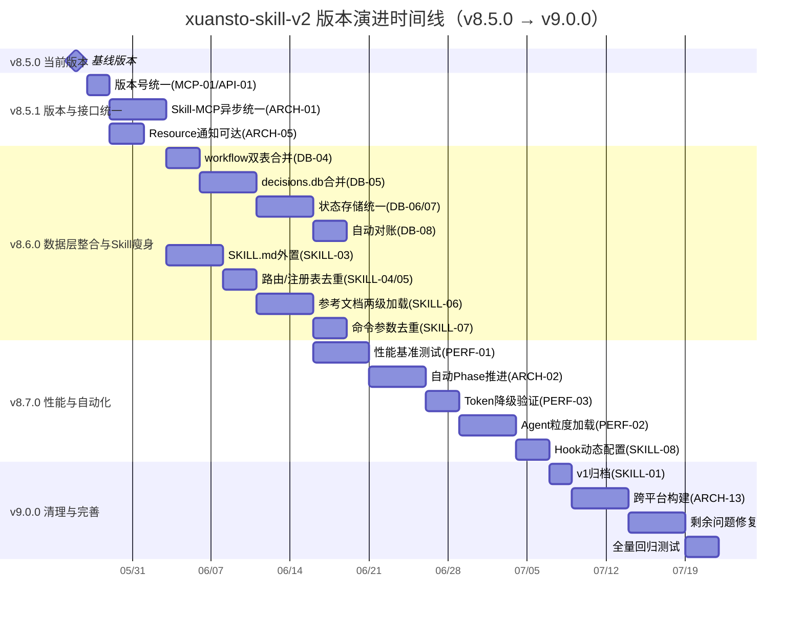
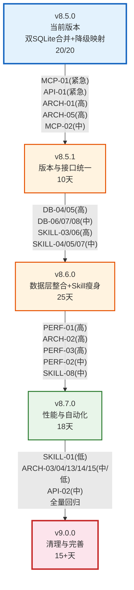
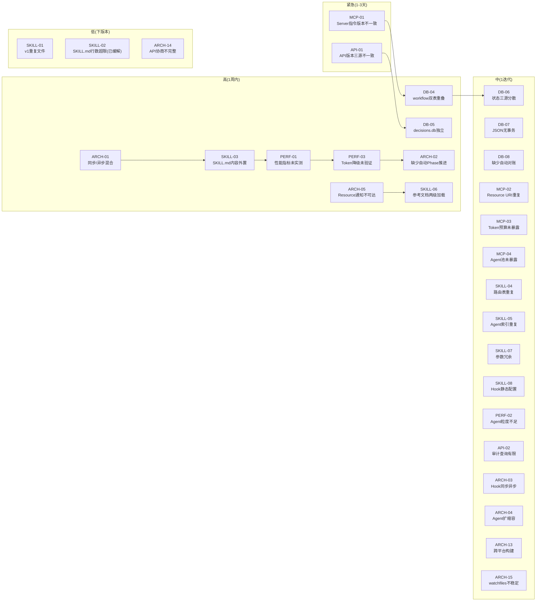

# xuansto-skill-v2 版本演进路线图

> 版本: 3.0 | 编写日期: 2026-05-26 | 编码: UTF-8 | 行尾: LF
> 当前版本: V_CURRENT=8.5.0 | 目标版本: V_NEXT_MAJOR=9.0.0
> 数据来源: REFACTOR_PLAN.md v2.0 (30项Open/Mitigated问题) + PROBLEM.md (35项已修复归档) + CHANGELOG.md (8.0.0~8.5.0)

---

## 目录

1. [版本号定义规则](#1-版本号定义规则)
2. [当前状态总览](#2-当前状态总览)
3. [版本演进路线](#3-版本演进路线)
4. [版本时间线](#4-版本时间线)
5. [版本依赖关系](#5-版本依赖关系)
6. [问题关闭路线图](#6-问题关闭路线图)

---

## 1. 版本号定义规则

### 1.1 语义化版本（SemVer）

本项目采用 [语义化版本 2.0.0](https://semver.org/lang/zh-CN/) 规范，版本号格式为 **MAJOR.MINOR.PATCH**：

```
v8.5.0
│ │ │
│ │ └── PATCH：向后兼容的问题修复
│ └──── MINOR：向后兼容的功能新增
└────── MAJOR：不兼容的 API 变更
```

### 1.2 各层级升级条件

| 层级 | 升级条件 | 示例 |
|------|----------|------|
| **PATCH** | 修复 Bug、补充文档、性能优化，不改变任何 API 接口和行为 | v8.5.0 → v8.5.1：修复版本号不一致(MCP-01/API-01) |
| **MINOR** | 新增 MCP 工具、新增命令、新增 Agent、新增配置项，所有变更向后兼容 | v8.5.0 → v8.6.0：数据层整合、Skill层瘦身 |
| **MAJOR** | 破坏性变更：API 接口不兼容、配置格式升级、架构范式变更、删除已废弃功能 | v8.x → v9.0.0：v1归档、版本号统一、API契约锁定 |

### 1.3 特殊版本标记

| 标记 | 含义 | 示例 |
|------|------|------|
| `-alpha.N` | 内部开发测试版，API 随时可能变更 | v8.6.0-alpha.1 |
| `-beta.N` | 功能冻结，仅修复缺陷，公开测试 | v8.6.0-beta.1 |
| `-rc.N` | 发布候选，除非发现阻断性问题否则即成为正式版 | v9.0.0-rc.1 |

### 1.4 当前版本矩阵

| 项目 | 版本 | 说明 |
|------|------|------|
| Skill (xuansto-skill-v2) | v8.5.0 | 当前基线版本 |
| MCP Server (xuansto-mcp-server) | v8.5.0 | pyproject.toml 版本 |
| Server 指令版本 | v8.4.0 ⚠️ | server.py 中不一致，需修复(MCP-01) |
| MCP API 版本 | v3.0.0 | config.py 中定义 |
| API 文档版本 | v2.5.0 ⚠️ | docs/api.md 中不一致，需修复(API-01) |

### 1.5 版本号统一目标

当前 Server 指令版本(8.4.0)、MCP API 版本(3.0.0)、API 文档版本(2.5.0) 使用不一致版本号，客户端无法统一判断兼容性（MCP-01/API-01）。v8.5.1 将统一版本号，v9.0.0 将建立单一版本号体系。

---

## 2. 当前状态总览

### 2.1 已发布版本摘要

| 版本 | 发布日期 | 类型 | 核心内容 |
|------|----------|------|----------|
| v8.0.0 | 2026-05-24 | MAJOR | MCP Server + Skill 混合架构基线，20个MCP工具，57个Agent，3级降级 |
| v8.1.0 | 2026-05-26 | MINOR | Resource 暴露增强（27个），SKELETON 阶段基础命令 |
| v8.2.0 | 2026-05-26 | MINOR | 审计日志，统一响应格式，双写一致性（DB-01/02） |
| v8.3.0 | 2026-05-26 | MINOR | Agent/工作流持久化，Hook 超时，配置热更新，API 版本协商 |
| v8.4.0 | 2026-05-26 | MINOR | Streamable HTTP 传输，知识版本清理配置 |
| v8.5.0 | 2026-05-26 | MINOR | 双SQLite合并，降级映射20/20，54门禁完整，32命令映射，Schema验证 |

### 2.2 未修复问题统计

> 以下统计基于 REFACTOR_PLAN.md v2.0（30项Open/Mitigated问题），35项已修复问题归档至附录A

| 影响域 | 总数 | Open | Mitigated | P1 | P2 | P3 |
|--------|------|------|-----------|----|----|-----|
| 架构(ARCH) | 8 | 8 | 0 | 2 | 4 | 1 |
| 数据(DB) | 5 | 5 | 0 | 2 | 3 | 0 |
| MCP | 4 | 4 | 0 | 1 | 3 | 0 |
| Skill | 8 | 7 | 1 | 2 | 4 | 2 |
| API | 2 | 2 | 0 | 1 | 1 | 0 |
| 性能(PERF) | 3 | 3 | 0 | 2 | 1 | 0 |
| **合计** | **30** | **29** | **1** | **10** | **16** | **3** |

### 2.3 紧急/高优先级问题清单

| 编号 | 优先级 | 描述 | 影响域 |
|------|--------|------|--------|
| MCP-01 | 紧急 | Server指令版本(8.4.0)与pyproject.toml(8.5.0)不一致 | MCP |
| API-01 | 紧急 | API版本号三源不一致(2.5.0/8.5.0/3.0.0) | API |
| DB-04 | 高 | workflow_instances与workflow_states表结构重叠 | 数据 |
| DB-05 | 高 | decisions.db仍独立于xuansto.db | 数据 |
| ARCH-01 | 高 | Skill-MCP通信同步/异步混合 | 架构 |
| ARCH-02 | 高 | 渐进式加载缺少自动Phase推进 | 架构 |
| ARCH-05 | 高 | MCP Resource变更通知不可达 | 架构/MCP |
| SKILL-03 | 高 | SKILL.md PHASE_2/3内容应外置 | Skill |
| SKILL-06 | 高 | 参考文档全量加载，缺两级加载 | Skill |
| PERF-01 | 高 | 性能指标未实测 | 性能 |
| PERF-03 | 高 | Token自动降级缺乏端到端验证 | 性能 |

---

## 3. 版本演进路线

### 3.1 v8.5.0 — 当前版本

> 状态: 已发布 | 类型: MINOR

#### 目标

双SQLite合并、降级映射补全、质量门禁完整化、命令映射完整化、Schema验证脚本。

#### 主要变更

| 维度 | 内容 |
|------|------|
| 数据层 | 合并 knowledge.db 到 xuansto.db（NEW-07），统一为22+表 |
| 降级映射 | constraints.yaml 补全至20/20完整映射（NEW-01） |
| 质量门禁 | 内嵌门禁扩展至54项完整覆盖（NEW-06） |
| 命令映射 | COMMAND_PHASE_MAP扩展至32个命令完整覆盖（NEW-05） |
| Schema验证 | validate_schemas.py 脚本实现（NEW-03） |
| 状态同步 | PROBLEM.md 状态与代码实际一致（35项已修复归档） |

#### 已修复问题

v8.5.0 及之前版本共修复 35 项问题，详见 REFACTOR_PLAN.md 附录A。

---

### 3.2 v8.5.1 — 版本与接口统一

> 状态: 计划中 | 类型: PATCH | 预估工期: 10 天 | 前置依赖: 无
> 对应 REFACTOR_PLAN.md: 阶段1（版本与接口统一）

#### 目标

1. 统一版本号：修复 Server 指令版本(8.4.0)与 pyproject.toml(8.5.0)不一致（MCP-01）
2. 统一 API 版本号：消除三源不一致（API-01）
3. Skill-MCP 通信异步统一（ARCH-01）
4. Resource 通知可达（ARCH-05）
5. Resource URI 去重（MCP-02）

#### 主要变更

| 步骤 | 问题 ID | 变更内容 | 涉及文件 |
|------|---------|----------|----------|
| 1.1 | MCP-01, API-01 | 统一版本号：server.py 指令版本更新为8.5.0；API文档版本对齐 | `server.py`, `pyproject.toml`, `config.py`, `docs/api.md` |
| 1.2 | ARCH-01 | Skill-MCP异步统一：所有Tool调用统一为async，同步降级脚本用asyncio.to_thread包装 | `server.py`, `tools/*.py` |
| 1.3 | ARCH-05 | Resource通知可达：resource_subscribe Tool在server.py注册；Phase变更时调用notify_subscribers | `resource_subscribe.py`, `resource_load_status.py` |
| 1.4 | MCP-02 | Resource URI去重：合并重复URI（config/skill vs skill/config等） | `skill_resources.py` |

#### 关联问题

| 问题 ID | 描述 | 优先级 | 影响域 |
|---------|------|--------|--------|
| MCP-01 | Server指令版本与pyproject.toml不一致 | **紧急** | MCP |
| API-01 | API版本号三源不一致 | **紧急** | API |
| ARCH-01 | Skill-MCP通信同步/异步混合 | **高** | 架构 |
| ARCH-05 | MCP Resource变更通知不可达 | **高** | 架构/MCP |
| MCP-02 | Resource URI重复 | **中** | MCP |

#### 验收标准

1. server.py 指令版本=8.5.0，与 pyproject.toml 一致（MCP-01 关闭）
2. API版本号统一，server_health(version) 返回一致版本（API-01 关闭）
3. 22个Tool全部使用async def（ARCH-01 关闭）
4. Host端可通过resource_subscribe订阅变更，Phase变更时收到通知（ARCH-05 关闭）
5. 重复Resource URI已合并（MCP-02 关闭）

---

### 3.3 v8.6.0 — 数据层整合与Skill瘦身

> 状态: 计划中 | 类型: MINOR | 预估工期: 25 天 | 前置依赖: v8.5.1
> 对应 REFACTOR_PLAN.md: 阶段2（数据层整合）+ 阶段3（Skill层瘦身）

#### 目标

1. 合并 workflow 双表，消除数据冗余（DB-04）
2. 合并 decisions.db 到 xuansto.db（DB-05）
3. 统一状态存储：SQLite为唯一权威源（DB-06/07）
4. 实现自动对账（DB-08）
5. SKILL.md 内容外置，减少体积（SKILL-03）
6. 路由/注册表去重（SKILL-04/05）
7. 参考文档两级加载（SKILL-06）
8. 命令参数去重（SKILL-07）

#### 主要变更

| 步骤 | 问题 ID | 变更内容 | 涉及文件 |
|------|---------|----------|----------|
| 2.1 | DB-04 | 合并workflow双表：workflow_instances数据迁入workflow_states | `database.py` |
| 2.2 | DB-05 | 合并decisions.db：decisions表和decisions_fts迁移到xuansto.db | `decision_log.py`, `database.py` |
| 2.3 | DB-06, DB-07 | 统一状态存储：SQLite为唯一权威源，JSON仅备份 | `agent_manage.py`, `workflow_dispatch.py` |
| 2.4 | DB-08 | 实现自动定时对账（默认每小时） | `database.py`, `degradation.py` |
| 3.1 | SKILL-03 | SKILL.md内容外置：PHASE_2/3仅保留引用URI | `SKILL.md`, `references/` |
| 3.2 | SKILL-04, SKILL-05 | 路由/注册表去重：SKILL.md仅保留入口说明 | `routes.yaml`, `registry.yaml`, `SKILL.md` |
| 3.3 | SKILL-06 | 参考文档两级加载：摘要(≤200Token)→完整(≤5000Token) | `references/summary/`, `resource_load_status.py` |
| 3.4 | SKILL-07 | 命令参数去重：直接引用MCP工具Schema | `commands/*.md` |

#### 关联问题

| 问题 ID | 描述 | 优先级 | 影响域 |
|---------|------|--------|--------|
| DB-04 | workflow双表结构重叠 | **高** | 数据 |
| DB-05 | decisions.db独立于xuansto.db | **高** | 数据 |
| DB-06 | Agent/Workflow状态三源分散 | **中** | 数据 |
| DB-07 | JSON状态文件无事务保证 | **中** | 数据 |
| DB-08 | 知识库缺少自动定时对账 | **中** | 数据 |
| SKILL-03 | SKILL.md PHASE_2/3内容应外置 | **高** | Skill |
| SKILL-04 | routes.yaml与SKILL.md路由表重复 | **中** | Skill |
| SKILL-05 | registry.yaml与SKILL.md Agent索引重复 | **中** | Skill |
| SKILL-06 | 参考文档全量加载，缺两级加载 | **高** | Skill |
| SKILL-07 | commands/*.md参数与MCP工具参数冗余 | **中** | Skill |

#### 验收标准

1. workflow_instances数据迁移完成，所有查询指向workflow_states（DB-04 关闭）
2. decisions.db数据迁移到xuansto.db，FTS5索引重建（DB-05 关闭）
3. Agent/Workflow启动从SQLite恢复，JSON仅备份（DB-06/07 关闭）
4. 自动对账每小时执行，失败条目自动重试（DB-08 关闭）
5. SKILL.md总行数≤150行（SKILL-03 关闭）
6. 参考文档摘要版生成，Phase 2加载摘要，按需加载完整（SKILL-06 关闭）

---

### 3.4 v8.7.0 — 性能与自动化

> 状态: 计划中 | 类型: MINOR | 预估工期: 18 天 | 前置依赖: v8.6.0
> 对应 REFACTOR_PLAN.md: 阶段4（性能与自动化）

#### 目标

1. 建立性能基准测试，实测Token消耗和加载时间（PERF-01）
2. 实现基于Token消耗的自动Phase推进（ARCH-02）
3. Token降级端到端验证（PERF-03）
4. Agent粒度按需加载（PERF-02）
5. Hook动态配置（SKILL-08）

#### 主要变更

| 步骤 | 问题 ID | 变更内容 | 涉及文件 |
|------|---------|----------|----------|
| 4.1 | PERF-01 | 性能基准测试：实测各Phase Token消耗和加载时间 | 全局 |
| 4.2 | ARCH-02 | 自动Phase推进：基于Token消耗和命令执行的自动推进 | `resource_load_status.py`, `token_budget.py` |
| 4.3 | PERF-03 | Token降级端到端验证：80%压缩+95%降级完整验证 | `token_budget.py`, `resource_load_status.py` |
| 4.4 | PERF-02 | Agent粒度加载：按需加载单个Agent定义 | `resource_load_status.py`, `SKILL.md` |
| 4.5 | SKILL-08 | Hook动态配置：Hook配置与加载阶段联动 | `hooks.json`, `hook_manage.py` |

#### 关联问题

| 问题 ID | 描述 | 优先级 | 影响域 |
|---------|------|--------|--------|
| PERF-01 | 性能指标未实测 | **高** | 性能 |
| ARCH-02 | 渐进式加载缺少自动Phase推进 | **高** | 架构 |
| PERF-03 | Token自动降级缺乏端到端验证 | **高** | 性能 |
| PERF-02 | Agent按需加载粒度不足 | **中** | 性能 |
| SKILL-08 | hooks.json静态配置无法根据Phase调整 | **中** | Skill |

#### 验收标准

1. Phase 0≤2K/Phase 1≤5K/Phase 2≤10K/Phase 3≤20K 实测确认（PERF-01 关闭）
2. 命令执行后自动检查并推进Phase，无需手动preload（ARCH-02 关闭）
3. Token≥80%触发压缩，≥95%触发降级，端到端验证通过（PERF-03 关闭）
4. Phase 2仅加载当前Phase所需Agent，其他按需加载（PERF-02 关闭）
5. SKELETON阶段自动启用minimal Hook配置（SKILL-08 关闭）

---

### 3.5 v9.0.0 — 清理与完善（MAJOR）

> 状态: 远期规划 | 类型: MAJOR | 预估工期: 15+ 天 | 前置依赖: v8.7.0
> 对应 REFACTOR_PLAN.md: 阶段5（清理与完善）

#### 目标

1. 归档 v1 代码，确立 v2 为唯一维护版本（SKILL-01）
2. 跨平台构建支持（ARCH-13）
3. API版本协商完善（ARCH-14）
4. 配置热重载稳定性增强（ARCH-15）
5. 审计日志查询能力增强（API-02）
6. Agent自动扩缩容（ARCH-04）
7. Hook系统异步统一（ARCH-03）
8. 全量回归验证，关闭所有遗留问题

#### 主要变更

| 步骤 | 问题 ID | 变更内容 | 涉及文件 |
|------|---------|----------|----------|
| 5.1 | SKILL-01 | v1文件归档：v1目录移至archived/ | `.trae/skills/` |
| 5.2 | ARCH-13 | 跨平台构建：新增macOS/Linux构建脚本 | `scripts/build-desktop.sh` |
| 5.3 | ARCH-14 | API版本协商完善：版本特定行为分支 | `server_health.py` |
| 5.4 | ARCH-15 | 配置热重载稳定性：增强Windows下watchfiles | `config.py` |
| 5.5 | API-02 | 审计日志查询增强：支持复杂过滤 | `audit_query.py` |
| 5.6 | ARCH-04 | Agent自动扩缩容：动态调整实例上限 | `agent_manage.py` |
| 5.7 | ARCH-03 | Hook系统异步统一 | `hook_engine.py`, `hook_manage.py` |
| 5.8 | — | 全量回归测试 | `tests/` |

#### 破坏性变更（MAJOR 升级原因）

| 变更 | 影响 | 迁移方式 |
|------|------|----------|
| v1 代码归档 | v1 Agent/命令/工作流文件不再参与加载 | 确认无 v1 引用后归档 |
| 数据库架构变更 | xuansto.db 为唯一数据库，decisions.db 不再存在 | 运行迁移脚本（v8.6.0 已实现） |
| API 契约锁定 | spec-locks 成为强制校验，API 变更需显式更新锁文件 | PR 流程增加 Schema 校验步骤 |

#### 关联问题

| 问题 ID | 描述 | 优先级 | 影响域 |
|---------|------|--------|--------|
| SKILL-01 | v1与v2存在重复文件 | **低** | Skill |
| ARCH-13 | 桌面构建仅Windows PowerShell | **中** | 架构 |
| ARCH-14 | API版本协商缺版本特定行为分支 | **低** | 架构 |
| ARCH-15 | watchfiles在Windows下可能不稳定 | **中** | 架构 |
| API-02 | 审计日志查询能力有限 | **中** | API |
| ARCH-04 | Agent管理缺少自动扩缩容 | **中** | 架构 |
| ARCH-03 | Hook系统同步+异步混合 | **中** | 架构 |

#### 验收标准

1. 无 v1 文件残留在加载路径中（SKILL-01 关闭）
2. 跨平台构建脚本覆盖 Windows/macOS/Linux（ARCH-13 关闭）
3. 30项问题全部关闭
4. 全量回归测试 100% 通过率
5. CHANGELOG.md 更新至 v9.0.0

---

## 4. 版本时间线



---

## 5. 版本依赖关系



### 5.1 依赖关系说明

| 版本 | 前置依赖 | 依赖原因 |
|------|----------|----------|
| v8.5.1 | v8.5.0 | 版本号统一基于当前基线，接口统一是后续数据层变更的基础 |
| v8.6.0 | v8.5.1 | 数据层整合依赖接口统一（异步统一后才能安全迁移数据库）；Skill瘦身依赖Resource通知可达 |
| v8.7.0 | v8.6.0 | 性能测试依赖Skill瘦身完成（SKILL.md外置后Token消耗才可准确测量） |
| v9.0.0 | v8.7.0 | MAJOR 版本依赖所有 MINOR 版本优化完成，确保清理基线稳定 |

### 5.2 关键影响链路

#### 链路1：版本不一致 → 客户端兼容性风险

```
MCP-01(Server指令8.4.0) → API-01(API版本三源不一致) → 客户端无法判断兼容性
```

v8.5.1 统一版本号是所有后续接口变更的前置条件。

#### 链路2：数据冗余 → 一致性风险

```
DB-04(workflow双表) → DB-06(三源状态分散) → DB-05(decisions.db独立) → 跨库关联断裂
```

v8.6.0 数据层整合消除冗余，统一SQLite为唯一权威源。

#### 链路3：Skill层膨胀 → Token效率风险

```
SKILL-03(SKILL.md内容未外置) → SKILL-06(参考文档全量加载) → PERF-01(Token消耗未实测) → PERF-03(Token降级未验证)
```

v8.6.0 Skill瘦身 + v8.7.0 性能验证 完整解决此链路。

---

## 6. 问题关闭路线图

### 6.1 按版本关闭计划

| 版本 | 关闭问题 | 关闭数量 | 累计关闭 |
|------|----------|----------|----------|
| v8.0.0~8.5.0 | P0-01/02, P1-01~06, P2-01/02, ARCH-05~12, DB-01~03, MCP-02/03, SKILL-01~03, API-01/02, NEW-01~09 | 35 | 35 |
| v8.5.1 | MCP-01, API-01, ARCH-01, ARCH-05, MCP-02 | 5 | 40 |
| v8.6.0 | DB-04, DB-05, DB-06, DB-07, DB-08, SKILL-03, SKILL-04, SKILL-05, SKILL-06, SKILL-07 | 10 | 50 |
| v8.7.0 | PERF-01, PERF-02, PERF-03, ARCH-02, SKILL-08 | 5 | 55 |
| v9.0.0 | SKILL-01, ARCH-03, ARCH-04, ARCH-13, ARCH-14, ARCH-15, API-02 | 7 | 62 |

> 注：部分问题编号在不同文档中有重叠（如 ARCH-05 在 PROBLEM.md 和 REFACTOR_PLAN.md 中含义不同），按 REFACTOR_PLAN.md v2.0 编号体系计数为 30 项核心问题。

### 6.2 按优先级关闭顺序



### 6.3 风险与缓解

| 风险 | 影响版本 | 缓解措施 |
|------|----------|----------|
| 版本号统一导致客户端兼容性判断变更 | v8.5.1 | server_health 版本协商已实现，统一后协商逻辑不变 |
| decisions.db 迁移失败 | v8.6.0 | 迁移前备份，Schema 验证 + 数据条目数校验 + FTS5 索引验证，失败自动回滚 |
| SKILL.md 外置导致 Phase 加载异常 | v8.6.0 | 外置后保留 PHASE 标记结构，仅替换内容为引用 URI；全量回归测试 |
| 参考文档两级加载增加维护成本 | v8.6.0 | 摘要版自动从完整版生成，不手动维护双份 |
| 性能基准测试结果与目标差距大 | v8.7.0 | 基准测试先于优化执行，根据实测数据调整目标值或优化方案 |
| v1 归档遗漏引用 | v9.0.0 | 全局搜索 v1 引用，归档前确认无残留加载路径 |

---

> 文档结束 | 生成时间: 2026-05-26 | 版本路线: v8.5.0 → v8.5.1 → v8.6.0 → v8.7.0 → v9.0.0
