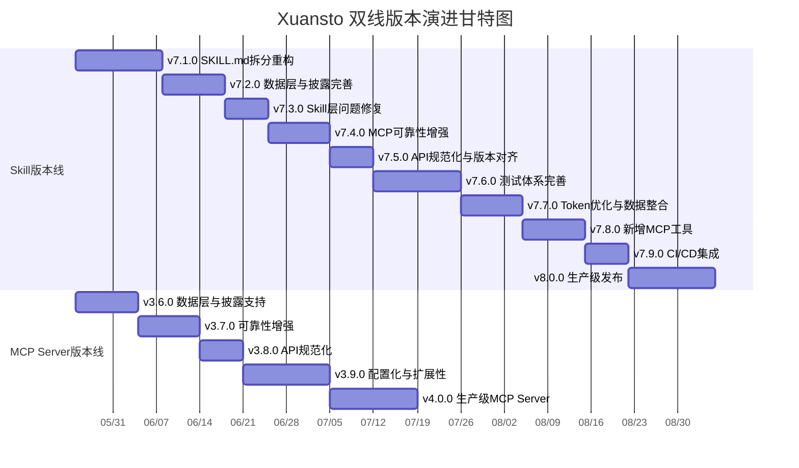
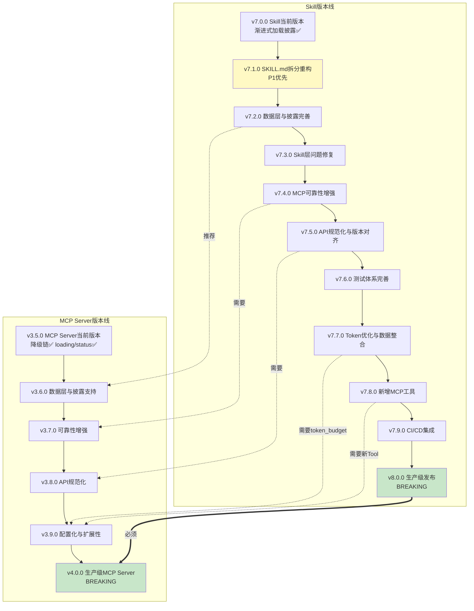

# Xuansto 双线版本演进文档

> 版本: 4.0.0 | 生成日期: 2026-05-22
> 覆盖范围: Skill v7.0.0 → v7.1.0~v7.9.0 → v8.0.0 | MCP Server v3.5.0 → v3.6.0~v3.9.0 → v4.0.0
> 基于: REFACTOR_PLAN.md / ARCHITECTURE.md / SKILL_REVIEW.md / MCP_REVIEW.md / SKILL.md / pyproject.toml / CHANGELOG.md
> 术语规范: 渐进式加载披露（Progressive Loading Disclosure），使用"披露"而非"特效"

---

## 1. 当前版本状态 (v7.0.0 Skill + v3.5.0 MCP Server)

### 1.1 Skill功能快照

| 维度 | 数量 | 说明 |
|------|------|------|
| Agents | 57 | 13层编排：编排3 + 产品4 + 设计4 + 工程6 + 跨平台5 + 数据3 + 测试10 + 安全3 + DevOps4 + 质量7 + 文档2 + 知识3 + 监控3 |
| Commands | 27 | /init, /clarify, /plan, /spec, /design, /implement, /test, /review, /fix, /accept, /deploy, /build-desktop, /release-desktop, /refactor, /audit, /agent-status, /learn, /brainstorm, /execute-plan, /design-system, /simplify, /loop, /cancel-loop, /build, /status, /rollback, /sprint |
| Workflows | 15 | brainstorming, sdd-tdd-full/medium/fast, security-audit, bug-fix, desktop-build, flutter-desktop, cross-platform, ui-ux, webapp-testing, subagent-driven, acceptance, ai-pentest, performance-test |
| Quality Gates | 54 | 覆盖Phase 0-8 + 跨阶段门禁，含内嵌检查(36项)和脚本检查 |
| MCP Tools | 13 | skill_analyze, knowledge_search, quality_gate_check, spec_drift_detect, security_scan, code_simplify, session_manage, workflow_dispatch, agent_status, hook_manage, resource_load_status, context_compress, server_health |
| MCP Resources | 7 | xuansto://config/skill, xuansto://references/quality-gates, xuansto://references/agent-registry, xuansto://references/workflow-phases, xuansto://templates/{name}, xuansto://sessions/latest, xuansto://loading/status |
| 渐进式加载披露 | 4级 | SKELETON → FUNCTIONAL → ENHANCED → FULL，含LoadPhase状态机、功能可用性披露、资源优先级(P0-P3) |

### 1.2 MCP Server功能快照

| 维度 | 数量/版本 | 说明 |
|------|-----------|------|
| MCP Tools | 13 | 13个原子工具，Pydantic v2 Schema校验，extra="forbid" |
| MCP Resources | 7 | 7个只读URI资源，含路径遍历防护(templates) |
| API版本 | 1.0.0 | 统一响应格式 `{error, api_version, data, degradation_level}` |
| 降级架构 | 3级 | MCP Tool → Python脚本(`run_script_fallback`) → 内嵌Fallback(`_inline_*`函数) |
| Hook拦截 | Pre/Post | `_with_hook_interception`包装所有Tool，Pre可阻断，Post不阻断 |
| 配置热重载 | ✓ | Windows 5s轮询 / Unix SIGHUP信号，`config.py`自动重载 |
| CLI工具 | ✓ | `xuansto-cli health/start/stop/status`，Server生命周期管理 |
| 知识检索 | 3级降级 | ChromaDB语义搜索 → SQLite FTS5 BM25 → keyword_fallback |
| 持久化 | 5个JSON | workflow_states/agent_instances/gate_cache/tool_metrics/degradation_stats + current.json |
| 服务器版本 | v3.5.0 | 当前生产版本，pyproject.toml `version = "3.5.0"` |

### 1.3 已知问题清单

#### 已修复问题（12项）

| 编号 | 描述 | 严重度 | 影响端 | 修复确认来源 |
|------|------|--------|--------|-------------|
| M-01 | ✅ degradation.py降级链实际调用脚本（`run_script_fallback`），而非占位响应 | 高 | MCP | FALLBACK_MAP 13个Tool均有实际脚本调用 |
| M-03 | ✅ `xuansto://loading/status` Resource已实现，返回含`available_functions`的JSON | 高 | MCP/披露 | skill_resources.py `loading_status()` |
| M-04 | ✅ `ResourceLoadStatusInput`新增`priority`(critical/normal/background)和`batch_mode`(bool)参数 | 高 | MCP/数据 | schemas.py |
| S-01 | ✅ SKILL.md包含渐进式加载披露指令章节（4级加载阶段定义） | 高 | Skill/披露 | SKILL.md L66-L108 |
| S-02 | ✅ SKILL.md包含资源优先级定义（P0-P3） | 中 | Skill/披露 | SKILL.md L86-L92 |
| S-03 | ✅ SKILL.md包含加载状态查询机制（`xuansto://loading/status`） | 中 | Skill/披露 | SKILL.md L83-L84 |
| S-04 | ✅ 资源加载优先级定义完整（P0必须/P1重要/P2增强/P3可选 + 释放顺序） | 中 | Skill/数据 | SKILL.md L86-L92; progressive-loading.md §4 |
| S-05 | ✅ 降级加载策略完整（MCP→脚本→内嵌 + 低精度→高精度） | 中 | Skill/MCP | progressive-loading.md §6 |
| E-01 | ✅ 渐进式加载披露框架完整实现（4级加载 + 状态机 + 触发矩阵 + 披露策略） | 高 | 披露 | progressive-loading.md §1-§9; SKILL.md L66-L108 |
| I-03 | ✅ `references/mcp-tools.md` 13个工具参数定义与`schemas.py`完全一致 | 中 | 披露 | 交叉验证schemas.py与mcp-tools.md |
| I-04 | ✅ MCP Resources数量声明一致（7个，含`xuansto://loading/status`） | 低 | 披露 | SKILL.md与skill_resources.py一致 |
| I-05 | ✅ 版本兼容性声明（SKILL.md声明最低兼容xuansto-mcp-server >= 3.5.0） | 低 | 披露 | SKILL.md L40-L43 |

**已修复统计**：12项（高4 / 中5 / 低3）

#### 待修复问题

##### P1 — 阻塞级问题（3项）

| 编号 | 描述 | 影响端 | 来源 |
|------|------|--------|------|
| A-01 | SKILL.md膨胀至~416行，同时承载触发条件、命令路由表、27命令详细步骤、降级策略、Agent索引、加载阶段定义等6类职责，Token消耗~10K | Skill | ARCHITECTURE §7.1, SKILL_REVIEW §5.2 |
| A-02 | 数据镜像冗余：Skill层agents/(57个)与MCP层data/agents/(57个)完全镜像；scripts/(89+)与data/scripts/(89+)完全镜像；5个JSON持久化文件分散存储，无事务保证 | 数据 | ARCHITECTURE §7.1, REFACTOR_PLAN §2.2 |
| A-03 | 命令步骤重复：SKILL.md中27命令的详细步骤(L213-L378)与commands/*.md文件内容完全重复，内嵌步骤占~2500 Token | Skill | SKILL_REVIEW §5.2 |

##### P2 — 高优先级问题（9项）

| 编号 | 描述 | 影响端 | 来源 |
|------|------|--------|------|
| D-01 | 并发写入无事务保证：5个JSON文件使用threading.Lock+atomic_write，仅进程级锁有效，多进程场景下数据可能丢失 | 数据 | REFACTOR_PLAN §2.4 |
| D-02 | 持久化文件分散无索引：5个JSON文件全量加载到内存后O(n)过滤，无索引查询能力；工作流快照gzip压缩文件无限增长风险 | 数据 | REFACTOR_PLAN §1.2 |
| D-05 | 降级策略双源定义：SKILL.md降级表(L141-L148)和degradation.py FALLBACK_MAP需手动同步；session_manage降级脚本描述不一致 | Skill/MCP | ARCHITECTURE §7.1, SKILL_REVIEW §5.2 |
| M-07 | MCP Resource URI降级路径缺失：7个Resource中5个无文件系统降级路径，MCP不可用时无法访问 | MCP/API | SKILL_REVIEW §5.2, REFACTOR_PLAN §2.6 |
| M-09 | Hook拦截与降级脚本映射不一致：config.py定义16个Hook脚本映射，但degradation.py hook_manage_fallback仅硬编码3个Hook脚本，其余13个Hook降级时直接返回空列表 | MCP | API_SPECIFICATION §1.1.10, MCP_REVIEW §1.5 |
| S-07 | 门禁别名映射冗余：quality-gates.md中存在大量"已合并至"的别名映射，54项门禁中部分ID已废弃但仍保留别名 | Skill | SKILL_REVIEW §5.2 |
| S-10 | 工作流命名不完整：sdd-tdd-medium/fast工作流缺乏详细步骤说明 | Skill | SKILL_REVIEW §5.2 |
| E-02 | API响应格式不统一：quality_gate_check返回`{gates_checked, gates_passed, results}`但API规范定义`{checks, summary}`；degradation_level字段位置不一致 | API | MCP_REVIEW §1.6, API_SPECIFICATION §4.1 |
| E-03 | 缺乏API版本协商机制：MCP_API_VERSION="1.0.0"仅作为响应字段返回，无客户端版本声明和服务器版本校验 | API | API_SPECIFICATION §4.2 |

##### P3 — 中低优先级问题（11项）

| 编号 | 描述 | 影响端 | 来源 |
|------|------|--------|------|
| D-03 | resource_state.json双格式兼容：需同时兼容旧格式(纯列表)和新格式(带版本号对象)，增加维护成本 | 数据 | REFACTOR_PLAN §1.3 |
| D-04 | 缓存失效检测粒度粗：gate_cache.json通过SHA256哈希校验，任何文件变更都导致整个缓存失效，无法增量更新 | 数据 | REFACTOR_PLAN §1.3 |
| M-02 | 内嵌逻辑代码分散：~800行内嵌降级逻辑(_inline_*函数)分布在8个tool文件中，degradation.py反向引用tool模块，形成循环依赖风险 | MCP | ARCHITECTURE §7.1 |
| M-05 | 配置热重载平台差异：Windows使用5秒轮询，Unix使用SIGHUP信号，两种机制行为不一致 | MCP | ARCHITECTURE §8.2 |
| M-06 | server_health无参数校验Schema：唯一无Pydantic Schema的Tool，与其他12个Tool的参数校验模式不一致 | MCP | API_SPECIFICATION §1.1.13 |
| M-08 | 降级脚本路径不一致：部分MCP工具的降级脚本路径在SKILL.md和mcp-tools.md中描述不一致 | MCP/Skill | SKILL_REVIEW §5.2 |
| S-06 | Agent frontmatter字段不一致：57个Agent定义文件中frontmatter字段不统一，部分缺少必要字段 | Skill | SKILL_REVIEW §5.2 |
| S-08 | Token预算目标缺乏实测数据：progressive-loading.md中性能目标"当前值"仍为全量加载的估算值 | 披露 | SKILL_REVIEW §5.2 |
| S-09 | /loop命令降级策略过长：/loop调用全部13个MCP工具，降级脚本列表过长，应按Phase分批降级 | Skill | SKILL_REVIEW §5.2 |
| E-04 | 缺乏重试机制：当前无显式重试机制，降级即视为最终策略，INTERNAL_ERROR等可恢复错误应支持指数退避重试 | API | API_SPECIFICATION §5.3 |
| I-01 | stdio传输限制远程调用：MCP Server仅支持stdio传输，不支持HTTP/SSE，限制远程调用和分布式部署 | 架构 | ARCHITECTURE §8.2 |

#### 问题统计

| 类别 | 已修复 | P1 | P2 | P3 | 合计 |
|------|--------|----|----|----|------|
| 架构(A) | 0 | 3 | 0 | 0 | 3 |
| 数据(D) | 0 | 0 | 2 | 2 | 4 |
| MCP(M) | 3 | 0 | 2 | 4 | 9 |
| Skill(S) | 5 | 0 | 2 | 3 | 10 |
| 披露(E) | 1 | 0 | 2 | 1 | 4 |
| API(I) | 3 | 0 | 1 | 0 | 4 |
| **合计** | **12** | **3** | **9** | **11** | **35** |

> 注：原46项问题中，12项已修复，部分问题经REFACTOR_PLAN.md重新审查后合并或重新分类，当前待修复23项(P1-3/P2-9/P3-11)。

### 1.4 架构现状

**MCP+Skill混合架构已建立，P0问题已全部修复**：

| 维度 | 当前状态 | 核心矛盾 |
|------|----------|----------|
| Skill层 | SKILL.md全量加载(~416行/~10K Token)，承载触发+路由+索引+约束+映射+步骤 | 职责过重，Token浪费严重(A-01, A-03) |
| 执行层 | 13个MCP Tool + 89+降级脚本 + 3级降级链 | 降级链已贯通✅，但Hook降级覆盖仅3/16(M-09) |
| 资源层 | 7个MCP Resource + 参考文档 + 57 Agent定义 + 渐进式加载披露✅ | 披露框架已实现✅，但Resource降级路径缺失(M-07) |
| 数据层 | 5个JSON文件分散存储，无事务保证 | 并发写入风险(D-01)，文件碎片化(D-02) |
| 降级层 | FALLBACK_MAP 13个Tool均有实际脚本调用✅ | 降级策略双源定义(D-05)，路径不一致(M-08) |
| 版本管理 | Skill v7.0.0 与 MCP Server v3.5.0 独立维护 | 版本兼容性声明已有✅，但API版本协商未实现(E-03) |
| 测试体系 | 4个验证脚本 + 知识服务测试 | 覆盖率极低，无系统测试 |

---

## 2. Skill版本演进路线图 (v7.0.0 → v7.1.0~v7.9.0 → v8.0.0)

### v7.1.0 — SKILL.md拆分重构

| 维度 | 内容 |
|------|------|
| **核心变更** | SKILL.md从~416行精简为~120行元数据文件，命令步骤提取到commands/*.md，降级表引用degradation.py，Agent索引改用MCP Resource |
| **新增功能** | commands/routing.yaml(命令路由独立定义)、5个MCP Resource文件系统降级路径声明 |
| **移除功能** | SKILL.md内嵌27命令详细步骤(L213-L378)、SKILL.md降级模式功能范围表(L47-L65)、SKILL.md Agent角色索引表(L379-L397) |
| **与v7.0.0差异** | SKILL.md从全量加载改为按需加载，Token消耗从~10K降至~3K(-70%)；commands/*.md成为唯一命令步骤权威源；降级策略单一来源: degradation.py |

**详细说明**：

1. **创建commands/routing.yaml**
   - 将SKILL.md命令路由表(L180-L211)提取为YAML格式
   - 27命令的MCP工具调用链 + 降级策略映射
   - 估算~120行

2. **删除SKILL.md内嵌命令步骤**
   - 移除L213-L378命令详细步骤（~165行），替换为"详见commands/{cmd}.md"引用
   - 立即降低~2500 Token消耗
   - 逐命令验证27个commands/*.md文件完整性

3. **降级策略统一到degradation.py**
   - 将SKILL.md降级模式功能范围表(L47-L65)替换为引用degradation.py
   - 降级策略单一来源: degradation.py + .xuansto-config.yaml

4. **Agent索引改用MCP Resource**
   - 将SKILL.md Agent索引表(L379-L397)替换为MCP Resource引用
   - Agent索引单一来源: xuansto://references/agent-registry

5. **为5个MCP Resource添加文件系统降级路径声明**
   - xuansto://references/quality-gates → references/quality-gates.md
   - xuansto://references/agent-registry → references/agent-registry.md
   - xuansto://references/workflow-phases → references/workflow-phases.md
   - xuansto://templates/{name} → templates/{name}.md
   - xuansto://sessions/latest → sessions/session-*.md

**验收标准**：
- SKILL.md行数 ≤ 150行
- SKILL.md Token消耗 ≤ 3K（实测）
- 27个commands/*.md文件均存在且内容完整
- commands/routing.yaml可被YAML解析器正确解析
- 所有MCP Resource有降级路径声明
- 27命令仍可通过路由表正确触发

**解决的问题**：A-01, A-03

**对应MCP Server版本**：≥v3.5.0（Skill层重构，无需MCP Server变更）

---

### v7.2.0 — 数据层与披露完善

| 维度 | 内容 |
|------|------|
| **核心变更** | 并发写入事务保证、持久化文件索引优化、API响应格式统一、API版本协商机制 |
| **新增功能** | SQLite WAL模式状态库(xuansto_state.db)、统一API响应格式、API版本协商、Token消耗实测报告 |
| **移除功能** | 旧版resource_state.json纯列表格式（自动迁移） |
| **与v7.1.0差异** | 数据层从JSON文件迁移到SQLite，API层规范化，渐进式加载披露从框架深化为数据层完善 |

**详细说明**：

1. **并发写入事务保证(D-01)**
   - 引入SQLite WAL模式状态库: xuansto_state.db
   - 创建core/persistence.py，封装SQLite连接管理(WAL模式+busy_timeout)
   - 迁移5个JSON文件到9张SQLite表
   - 启动时自动检测并迁移JSON数据到SQLite，保留.json.bak备份
   - SQLite不可用时自动降级到JSON读取
   - 并发写入测试: 10个线程同时写入workflow_instances无数据丢失

2. **持久化文件索引优化(D-02)**
   - SQLite表建立索引: workflow_instances按status索引、gate_cache按project_path+gate_id索引
   - 查询性能: workflow_instances按status索引查询 < 1ms
   - 工作流快照TTL+数量双重清理策略(已有，验证有效性)

3. **API响应格式统一(E-02)**
   - 统一13个Tool的响应格式为 `{error, api_version, data, degradation_level}`
   - degradation_level字段始终在响应顶层
   - quality_gate_check返回 `{checks, summary, cache_info}` 而非旧格式 `{gates_checked, gates_passed, results}`
   - 修复部分Tool返回裸dict而非标准结构的问题

4. **API版本协商机制(E-03)**
   - 客户端可在首次连接时声明支持的API版本
   - server_health新增`api_versions`字段，声明支持的版本范围
   - 版本不匹配时返回明确错误码
   - API_VERSION从1.0.0升级到1.1.0

5. **Token消耗实测**
   - 测量渐进式加载后的实际Token消耗
   - 场景: Skill触发时(骨架) ≤ 2K / 单命令执行(功能) ≤ 5K / 全流程(9 Phase) ≤ 30K / Agent调度(单次) ≤ 150
   - 生成Token消耗实测报告，更新性能目标中的"当前值"

**验收标准**：
- xuansto_state.db包含9张表且Schema正确
- 启动时自动检测并迁移JSON数据到SQLite
- 迁移后原JSON文件备份为.json.bak
- SQLite不可用时自动降级到JSON读取
- 13个Tool返回值均为 `{error, api_version, data, degradation_level}` 标准结构
- degradation_level字段始终在响应顶层
- API版本协商机制工作，版本不匹配返回明确错误
- Token消耗实测报告覆盖4个场景

**解决的问题**：D-01, D-02, E-02, E-03

**对应MCP Server版本**：≥v3.6.0（需要MCP Server支持SQLite持久化、API响应格式统一和版本协商）

---

### v7.3.0 — Skill层问题修复

| 维度 | 内容 |
|------|------|
| **核心变更** | Agent frontmatter统一、门禁别名清理、/loop降级策略优化、降级脚本路径统一 |
| **新增功能** | 降级路径自动校验、/loop分步降级策略、Agent frontmatter validator强制执行 |
| **移除功能** | 废弃门禁别名 |
| **与v7.2.0差异** | Skill层一致性和可靠性提升，降级策略更健壮 |

**详细说明**：

1. **Agent frontmatter统一(S-06)**
   - 统一57个Agent定义文件的frontmatter字段
   - 必需字段: name, layer, phase, capabilities, priority
   - 可选字段: description, dependencies, degradation
   - agent-frontmatter-validator.py从建议性改为强制执行(CI阻断)

2. **门禁别名清理(S-07)**
   - 移除quality-gates.md中"已合并至"的废弃别名
   - 保留最终门禁名称，更新所有引用
   - 确保仅保留当前有效的54项门禁ID

3. **/loop降级策略优化(S-09)**
   - 将/loop命令的13个MCP工具降级改为分步降级策略
   - 按Phase分组: Phase 0-2核心工具(必须降级) → Phase 3-5辅助工具(可选降级) → Phase 6-8增强工具(可跳过)
   - 降级失败时记录部分降级报告，而非全部失败

4. **降级脚本路径统一(S-10 → M-08)**
   - 对比SKILL.md、mcp-tools.md和degradation.py FALLBACK_MAP中的降级脚本路径
   - 统一为与degradation.py FALLBACK_MAP一致的路径
   - session_manage降级路径统一: init-session.py / session-catchup.py / session-persist.py（三级）
   - 添加CI校验: 自动对比路径一致性

**验收标准**：
- 57个Agent定义文件frontmatter字段统一
- agent-frontmatter-validator.py在CI中强制执行
- quality-gates.md无已废弃别名
- /loop命令降级策略支持分步降级和部分降级报告
- SKILL.md与mcp-tools.md与degradation.py降级脚本路径100%一致

**解决的问题**：S-06, S-07, S-09, S-10

**对应MCP Server版本**：≥v3.6.0（降级路径校验需要MCP Server配合）

---

### v7.4.0 — MCP可靠性增强

| 维度 | 内容 |
|------|------|
| **核心变更** | 重试机制、MCP通知机制改进、工作流定义补齐 |
| **新增功能** | Tool调用重试(指数退避)、加载进度轮询优化、sdd-tdd-medium/fast完整定义 |
| **移除功能** | 无 |
| **与v7.3.0差异** | MCP协议层可靠性提升，工作流定义完整 |

**详细说明**：

1. **重试机制(E-04 → M-09)**
   - 对INTERNAL_ERROR等可恢复错误实现自动重试
   - 重试策略: 最多3次，指数退避(1s/2s/4s)
   - 重试后仍失败则触发降级链
   - 可配置: 哪些错误码可重试、最大重试次数
   - 不可恢复错误(VALIDATION_ERROR, NOT_FOUND)不重试

2. **MCP通知机制改进(M-07)**
   - 当前限制: stdio传输不支持Server→Client主动通知
   - 短期方案: 优化客户端轮询`loading_progress`的频率和效率
   - 中期方案: 评估迁移到SSE/Streamable HTTP传输
   - 长期方案: 等待MCP协议支持Server→Client通知
   - batch_mode下注册progressToken，每资源加载完成推送notifications/progress

3. **sdd-tdd-medium/fast工作流补齐(S-10)**
   - 从sdd-tdd-full裁剪生成medium和fast变体
   - medium: 6 Phase，跳过部分质量门禁，保留核心门禁
   - fast: 3 Phase，仅保留P0门禁，快速推进
   - 3种工作流均有完整YAML frontmatter和Phase定义

4. **Hook降级覆盖补全(M-09)**
   - 补全hook_manage降级: 16个Hook全部有降级路径
   - Hook降级覆盖率从3/16提升到16/16
   - 将降级脚本映射从config.py硬编码迁移到.xuansto-config.yaml

**验收标准**：
- INTERNAL_ERROR自动重试最多3次，指数退避
- 重试后仍失败正确触发降级链
- 客户端轮询效率优化（减少无效轮询50%+）
- medium/fast工作流定义完整，有YAML frontmatter
- 16个Hook均有降级路径(脚本或内嵌逻辑)

**解决的问题**：M-07, M-09, S-10

**对应MCP Server版本**：≥v3.7.0（需要MCP Server重试机制、Hook降级补全和通知优化）

---

### v7.5.0 — API规范化与版本对齐

| 维度 | 内容 |
|------|------|
| **核心变更** | API版本协商深化、server_health修正、降级脚本路径统一到配置文件 |
| **新增功能** | 结构化错误码体系、i18n消息、降级脚本映射配置化 |
| **移除功能** | 无 |
| **与v7.4.0差异** | API层规范化，降级策略配置化，错误处理体系完善 |

**详细说明**：

1. **API版本协商深化(I-01 → E-03扩展)**
   - 客户端必须在首次连接时声明支持的API版本
   - server_health新增`api_versions`字段，声明支持的版本范围
   - 版本不匹配时返回`XUAN_5000 API_VERSION_MISMATCH`错误
   - 评估SSE/Streamable HTTP传输迁移可行性

2. **server_health修正(I-02)**
   - 修正`resources_count`为7（含`xuansto://loading/status`）
   - 新增字段: `api_versions`、`uptime_seconds`、`total_requests`、`degradation_rate`
   - 为server_health添加Pydantic Schema (ServerHealthInput)

3. **降级脚本路径统一到配置文件(M-08)**
   - 将降级脚本映射从config.py硬编码迁移到.xuansto-config.yaml
   - SKILL.md/degradation.py均从配置读取降级脚本路径
   - 降级路径变更只需修改配置文件，无需同步3处代码

4. **结构化错误码和i18n**
   - 定义结构化错误码体系: XUAN_1xxx(通用) / XUAN_2xxx(MCP) / XUAN_3xxx(资源) / XUAN_4xxx(知识库)
   - 错误响应格式升级: `error`字段从字符串升级为结构化对象
   - i18n消息文件: `locales/en.json`、`locales/zh-CN.json`

**兼容性矩阵更新**：

| Skill版本 | MCP Server版本 | API版本 | 状态 |
|-----------|---------------|---------|------|
| v7.0.0 | ≥3.5.0 | 1.0.0 | 当前 |
| v7.1.0~v7.4.0 | ≥3.5.0 | 1.0.0 | 开发中 |
| v7.5.0 | ≥3.8.0 | 1.2.0 | 本版本 |
| v8.0.0 | ≥4.0.0 | 2.0.0 | 目标 |

**验收标准**：
- API版本协商机制工作，版本不匹配返回明确错误
- server_health返回resources_count=7
- 结构化错误码覆盖所有Tool响应
- i18n中英文消息文件完整
- 降级脚本映射从.xuansto-config.yaml读取
- server_health有Pydantic Schema

**解决的问题**：I-01, I-02, M-08

**对应MCP Server版本**：≥v3.8.0（需要MCP Server API版本协商、server_health修正和错误码体系）

---

### v7.6.0 — 测试体系完善

| 维度 | 内容 |
|------|------|
| **核心变更** | 单元测试、集成测试、端到端测试体系建立 |
| **新增功能** | 测试覆盖率报告、回归测试套件、性能基准测试 |
| **移除功能** | 无 |
| **与v7.5.0差异** | 质量保障体系建立，所有变更可验证 |

**详细说明**：

1. **MCP Tool单元测试**
   - 每个Tool的每个action至少1个正向+1个异常测试
   - 覆盖13个MCP Tool的全部action
   - 状态管理CRUD测试: 会话/工作流/Agent/资源
   - Pydantic Schema校验测试: 13个Model的字段类型/默认值/范围校验/extra="forbid"
   - 降级链测试: 13个降级函数的脚本降级/内嵌降级/错误处理
   - SQLite持久化层测试: 9张表的CRUD/事务/WAL并发/迁移

2. **集成测试**
   - Skill触发→MCP Tool调用→结果返回的完整链路
   - MCP Tool→Hook拦截→Pre-Hook阻断/通过→Post-Hook副作用
   - MCP Tool→降级链: MCP不可用→脚本降级→内嵌降级
   - MCP Resource→Skill层: Resource URI读取→内容注入Skill上下文
   - Phase推进→资源预加载联动
   - 渐进式加载流程: SKELETON→FUNCTIONAL→ENHANCED→FULL

3. **端到端测试**
   - `/init`: 项目结构创建+INIT-COMPLETE门禁通过
   - `/sprint`: 6阶段自动推进+SPRINT-COMPLETE门禁
   - `/review`: 审查报告+门禁结果
   - `/audit`: 安全扫描报告+AI-PENTEST门禁
   - 降级场景: 断开MCP Server→脚本降级执行
   - 会话恢复: 进程重启后`/status`恢复上次会话状态
   - 自主循环: `/loop` 9阶段完整执行

4. **回归测试基线**
   - 记录27个命令在当前版本的输出格式和关键字段
   - 记录13个Tool的标准响应结构
   - 记录当前降级行为基线
   - 记录当前Token消耗和响应延迟基线

**验收标准**：
- 13个MCP Tool均有单元测试
- Skill-MCP协议联动有集成测试
- 渐进式加载披露流程有端到端测试
- 新旧行为对比有回归测试
- 测试覆盖率≥80%

**解决的问题**：所有问题均需测试验证

**对应MCP Server版本**：≥v3.8.0（测试体系不依赖MCP Server新功能）

---

### v7.7.0 — Token优化与数据整合

| 维度 | 内容 |
|------|------|
| **核心变更** | Token预算管理、数据镜像消除准备、文件碎片化治理、resource_load_status增强 |
| **新增功能** | Token预算驱动的动态加载、上下文压缩策略优化、统一状态管理器设计、Agent按Phase加载 |
| **移除功能** | 无 |
| **与v7.6.0差异** | Token消耗降低目标75%，数据层整合方案设计 |

**详细说明**：

1. **Token预算管理**
   - Token < 50%: 全量加载当前Phase
   - Token 50-80%: 仅加载当前Phase + 下一Phase预加载
   - Token 80-95%: 仅加载当前Phase核心 + context_compress
   - Token > 95%: 仅保留核心约束 + 当前命令 + context_compress(strategy=semantic)

2. **Agent按Phase加载**
   - Phase 0-1: 仅加载编排+产品层Agent摘要
   - Phase 2-4: 追加加载设计+工程层Agent
   - Phase 5-7: 追加加载测试+安全+质量层Agent
   - Phase 8: 追加加载DevOps层Agent
   - 每次Agent调度Token增量≤150

3. **数据镜像消除准备(A-02)**
   - 评估data/与.trae/skills/之间的文件差异
   - 设计SKILL_ROOT环境变量统一资源定位方案
   - MCP Server通过SKILL_ROOT动态定位资源
   - 为v8.0.0完全消除数据镜像做准备

4. **文件碎片化治理(D-05)**
   - 设计统一状态管理器，替代分散的JSON文件
   - 会话/工作流/Agent/指标统一存储到SQLite
   - 向后兼容: 旧格式文件自动迁移
   - 降级策略双源定义统一到degradation.py + 配置文件

5. **resource_load_status增强(E-04)**
   - status操作返回`available_functions`字段
   - 与`xuansto://loading/status` Resource返回内容对齐
   - 新增Token预算追踪: loading/status增加estimated_total_tokens和token_budget_remaining

**Token消耗目标**：

| 指标 | 当前值(全量) | 目标值(渐进式) | 降低比例 |
|------|-------------|---------------|----------|
| Skill触发时Token | ~10,000 | ≤2,000 | 80% |
| 单命令执行Token | ~15,000 | ≤5,000 | 67% |
| 全流程Token(9 Phase) | ~84,000 | ≤30,000 | 64% |
| Agent调度Token(单次) | ~500/Agent | ≤150/Agent | 70% |

**验收标准**：
- Skill触发时Token消耗≤2K
- 单命令执行Token消耗≤5K
- Agent调度Token增量≤150/Agent
- Token预算驱动的动态加载正常工作
- 数据镜像消除方案设计完成
- resource_load_status status操作返回available_functions

**解决的问题**：A-02(准备), D-05, E-04

**对应MCP Server版本**：≥v3.9.0（Token预算管理需要token_budget Tool，v3.9.0提供）

---

### v7.8.0 — 新增MCP工具

| 维度 | 内容 |
|------|------|
| **核心变更** | decision_log、token_budget、project_init工具集成 |
| **新增功能** | 决策日志管理、Token预算控制、项目初始化 |
| **移除功能** | 无 |
| **与v7.7.0差异** | MCP工具从13个扩展到16个，Skill命令路由表更新 |

**详细说明**：

1. **decision_log工具**
   - `record`: 记录决策（决策内容、理由、影响范围、决策者），格式: ADR-NNN 简述
   - `list`: 列出决策（按阶段、时间范围过滤）
   - `export`: 导出决策日志（Markdown/JSON格式）
   - `query`: 按条件查询决策记录
   - 降级: → scripts/decision-logger.py → 内嵌JSON文件写入

2. **token_budget工具**
   - `status`: 查询当前Token预算和使用情况
   - `set_budget`: 设置Token预算上限
   - `track`: 记录Token消耗
   - `recommend`: 基于当前使用率推荐压缩策略
   - `history`: 查看消耗历史
   - 降级: → scripts/token-budget-guard.py → 内嵌估算

3. **project_init工具**
   - `init`: 完整初始化（创建项目骨架、生成配置、初始化工作目录）
   - `detect`: 检测技术栈（React/Vue/Svelte/Electron/Tauri/Python）
   - `scaffold`: 生成骨架（基于模板）
   - `validate`: 验证项目结构完整性
   - 降级: → scripts/project-initializer.py → 内嵌基础结构创建

4. **SKILL.md命令路由表更新**
   - /init路由增加project_init调用
   - /sprint路由增加token_budget调用
   - /plan路由增加decision_log调用

**验收标准**：
- 3个新MCP Tool注册成功，server_health返回tools_count=16
- 每个新Tool的每个action有单元测试
- 降级链完整（MCP→脚本→内嵌）
- SKILL.md命令路由表更新

**解决的问题**：M-02(部分), M-05(部分)

**对应MCP Server版本**：≥v3.9.0（新工具由v3.9.0提供）

---

### v7.9.0 — CI/CD集成

| 维度 | 内容 |
|------|------|
| **核心变更** | 自动化检查、规范锁、部署验证 |
| **新增功能** | CI流水线(5阶段)、Schema校验、兼容性测试、规范锁 |
| **移除功能** | 无 |
| **与v7.8.0差异** | 持续集成体系建立，所有变更自动化验证 |

**详细说明**：

1. **CI流水线（5阶段）**

   ```
   Stage 1: Lint+格式 → Stage 2: Schema校验 → Stage 3: 单元测试 → Stage 4: 集成测试 → Stage 5: 端到端验证
   ```

   - Stage 1: ruff(Python) + yamllint(YAML) + markdownlint(MD) + jsonlint(JSON)
   - Stage 2: Pydantic Model验证 + SKILL.md frontmatter验证 + Agent frontmatter验证 + 工作流YAML Schema验证
   - Stage 3: pytest覆盖率≥80%
   - Stage 4: MCP Tool注册/Resource访问/降级链验证
   - Stage 5: 27命令输出基线对比/Token计数

2. **规范锁**
   - Skill定义格式锁定: SKILL.md frontmatter必须包含name/version/triggers/requires
   - SKILL.md行数≤150行
   - API契约版本锁定: MCP API版本遵循SemVer
   - Tool参数Schema: `additionalProperties: false`
   - 响应格式: `{error, api_version, data, degradation_level}`

3. **兼容性测试**
   - Skill版本 vs MCP Server版本矩阵测试
   - 新增Resource不修改现有Resource URI
   - 新增Tool参数给默认值，不破坏现有调用

4. **部署验证**
   - MCP Server启动: `xuansto-cli health`
   - Tool注册完整性: `server_health().tools_count == 16`
   - Resource可访问性: 逐个读取7+个Resource
   - 降级链可用性: 模拟MCP不可用→脚本降级
   - 知识库健康: ChromaDB+SQLite FTS5可用性

**验收标准**：
- CI流水线5阶段全部通过
- Schema校验覆盖所有配置文件
- 兼容性矩阵测试通过
- 部署验证自动化

**解决的问题**：D-03, D-04

**对应MCP Server版本**：≥v3.9.0（CI/CD验证需要稳定MCP Server版本）

---

### v8.0.0 — 生产级发布 (BREAKING)

| 维度 | 内容 |
|------|------|
| **核心变更** | 全部P1问题修复、渐进式加载披露完整实现、数据镜像消除、v1废弃 |
| **新增功能** | 数据镜像消除(SKILL_ROOT)、生产级稳定性、完整渐进式加载披露 |
| **移除功能** | v1 deprecated标记清理、data/目录镜像依赖、旧版resource_state.json格式 |
| **与v7.9.0差异** | 从开发版升级为生产版，消除技术债务，BREAKING变更 |
| **BREAKING** | v1完全废弃，data/镜像消除，API v2.0.0 |

**详细说明**：

1. **全部P1问题修复**
   - 3个P1问题(A-01, A-02, A-03)在v7.1.0~v7.7.0中已修复
   - 遗留P2/P3问题评估并处理

2. **数据镜像消除(A-02完成)**
   - 统一由Skill层管理数据
   - MCP Server通过SKILL_ROOT环境变量动态定位资源
   - 消除data/与.trae/skills/xuansto-skill-v2/之间的数据镜像
   - 路径解析优先级: SKILL_ROOT环境变量 → --skill-root CLI参数 → 默认路径

3. **渐进式加载披露完整实现**

   | 加载阶段 | 名称 | 加载内容 | 预估Token |
   |----------|------|----------|-----------|
   | Level 0 | 骨架(Skeleton) | 核心约束 + 命令概要 + Agent索引 | ~2K |
   | Level 1 | 功能(Functional) | 命令详细步骤 + 工作流Phase + MCP工具参数 | ~3K |
   | Level 2 | 增强(Enhanced) | 参考文档 + 模板 + 知识库索引 + Agent详细定义 | ~5K |
   | Level 3 | 完整(Full) | 全部资源 + 脚本集 + 披露资源 + 评估配置 | ~10K |

4. **v1完全废弃**
   - 移除v1 Skill的所有deprecated标记
   - 仅支持v2+MCP Server组合
   - 迁移指南文档

5. **生产级稳定性**
   - 测试覆盖率>80%
   - 所有降级链验证通过
   - 性能指标达标
   - CI/CD流水线稳定运行

**验收标准**：
- 全部P1问题修复率100%
- 渐进式加载披露4级层次完整实现
- 测试覆盖率>80%
- Token消耗目标达成（触发≤2K，单命令≤5K）
- 数据镜像完全消除
- v1完全废弃，无向后兼容负担

**解决的问题**：A-02(完成), 所有遗留P2/P3问题评估处理

**对应MCP Server版本**：≥v4.0.0（必须，BREAKING变更需要MCP Server v4.0.0配合）

---

## 3. MCP Server版本演进路线图 (v3.5.0 → v3.6.0~v3.9.0 → v4.0.0)

### v3.6.0 — 数据层与披露支持

| 维度 | 内容 |
|------|------|
| **核心变更** | SQLite持久化层、resource_state.json格式统一、DisclosureTransition实现、Resource降级路径 |
| **新增功能** | xuansto_state.db(9张表)、core/persistence.py、披露过渡状态、Resource文件系统降级、resource_state.json格式迁移 |
| **移除功能** | 无（旧格式自动迁移） |
| **与v3.5.0差异** | 数据层从JSON文件迁移到SQLite，披露细节完善，Resource降级路径补全 |

**详细说明**：

1. **SQLite持久化层(D-01, D-02)**
   - 创建core/persistence.py，封装SQLite连接管理(WAL模式+busy_timeout)
   - 创建xuansto_state.db Schema(9张表): workflow_instances, agent_instances, gate_cache, tool_metrics, degradation_stats, session_states, resource_states, patterns, workflow_snapshots
   - 迁移5个tool模块的读写逻辑到SQLite
   - 启动迁移逻辑: 检测JSON文件→导入SQLite→备份JSON→删除原文件
   - JSON降级读取: SQLite不可用时回退到JSON文件
   - threading.Lock替换为SQLite内置锁

2. **resource_state.json格式统一(D-01)**
   - 统一写入为字典格式:
     ```json
     {
       "version": 2,
       "loaded_resources": {
         "resource_a": { "uri": "xuansto://config/skill", "phase": "skeleton", "status": "loaded", "load_time_ms": 23, "priority": "critical", "loaded_at": "2026-05-22T10:30:00Z" }
       },
       "progressive_state": { "current_phase": "functional", "loading_progress": { "skeleton": 1.0, "functional": 0.75, "enhanced": 0.0, "full": 0.0 } }
     }
     ```
   - 旧格式: `["resource_a", "resource_b"]`（纯字符串列表）
   - 自动迁移: 检测到version字段缺失时，自动将旧格式升级为新格式
   - 迁移前自动备份旧文件

3. **DisclosureTransition实现(D-02)**
   - 在`xuansto://loading/status` Resource中添加过渡状态字段
   - 过渡类型: idle | phase_advance | resource_refresh | degradation | recovery
   - 每次Phase转换返回DisclosureTransition(新旧功能对比)

4. **MCP Resource降级路径(E-03)**

   | URI | 降级文件路径 |
   |-----|-------------|
   | `xuansto://config/skill` | `{SKILL_ROOT}/.skill-config.yaml` |
   | `xuansto://references/quality-gates` | `{SKILL_ROOT}/references/quality-gates.md` |
   | `xuansto://references/agent-registry` | `{SKILL_ROOT}/references/agent-registry.md` |
   | `xuansto://references/workflow-phases` | `{SKILL_ROOT}/references/workflow-phases.md` |
   | `xuansto://templates/{name}` | `{SKILL_ROOT}/templates/{name}.md` |
   | `xuansto://sessions/latest` | `{WORK_DIR}/sessions/` (最新session文件) |
   | `xuansto://loading/status` | `{WORK_DIR}/resource_state.json` |

**验收标准**：
- xuansto_state.db包含9张表且Schema正确
- 启动时自动检测并迁移JSON数据到SQLite
- 迁移后原JSON文件备份为.json.bak
- SQLite不可用时自动降级到JSON读取
- 并发写入测试: 10个线程同时写入workflow_instances无数据丢失
- 查询性能: workflow_instances按status索引查询 < 1ms
- resource_state.json统一为字典格式，旧格式自动迁移
- DisclosureTransition在阶段切换时正确返回过渡状态
- 7个Resource URI均有文件系统降级路径

**解决的问题**：D-01, D-02, E-03

**对应Skill版本**：v7.2.0（Skill层数据层与披露完善）

**API版本**：1.1.0（Resource响应格式增强，向后兼容）

---

### v3.7.0 — 可靠性增强

| 维度 | 内容 |
|------|------|
| **核心变更** | Tool调用重试机制、通知机制优化、Hook降级覆盖补全、降级路径校验 |
| **新增功能** | 自动重试(指数退避)、轮询效率优化、Hook降级覆盖16/16、降级路径一致性校验 |
| **移除功能** | 无 |
| **与v3.6.0差异** | MCP协议层可靠性提升，Hook降级完整覆盖 |

**详细说明**：

1. **Tool调用重试机制(E-04)**
   - 对INTERNAL_ERROR等可恢复错误实现自动重试
   - 重试策略: 最多3次，指数退避(1s/2s/4s)
   - 重试后仍失败则触发降级链
   - 可配置: 哪些错误码可重试、最大重试次数
   - 不可恢复错误(VALIDATION_ERROR, NOT_FOUND)不重试

2. **通知机制优化(M-07)**
   - 短期: 优化`loading_progress`轮询效率，减少无效轮询50%+
   - batch_mode下注册progressToken，每资源加载完成推送notifications/progress
   - 评估SSE/Streamable HTTP传输迁移可行性
   - 降级处理: Host不支持notifications时，仍可通过Resource查询获取进度

3. **Hook降级覆盖补全(M-09)**
   - 补全hook_manage降级: 16个Hook全部有降级路径
   - Hook降级覆盖率从3/16提升到16/16
   - 将降级脚本映射从config.py硬编码迁移到.xuansto-config.yaml
   - 提取8个tool文件中的_inline_*函数到core/inline_fallbacks.py，消除循环依赖

4. **降级路径一致性校验(S-10)**
   - 新增`skill_analyze` action: `validate_degradation_paths`
   - 对比FALLBACK_MAP与SKILL.md/mcp-tools.md中的降级路径
   - 不一致时返回警告

**验收标准**：
- INTERNAL_ERROR自动重试最多3次
- 重试后仍失败正确触发降级链
- 轮询效率优化（减少无效轮询50%+）
- 16个Hook均有降级路径(脚本或内嵌逻辑)
- 降级路径一致性校验通过
- core/inline_fallbacks.py独立模块，无循环依赖

**解决的问题**：M-07, M-09, S-10

**对应Skill版本**：v7.3.0~v7.4.0（Skill层降级路径统一和可靠性增强）

**API版本**：1.1.0（无API变更，内部实现改进）

---

### v3.8.0 — API规范化

| 维度 | 内容 |
|------|------|
| **核心变更** | API版本协商、结构化错误码、server_health修正、降级脚本映射配置化 |
| **新增功能** | API版本协商机制、错误码体系(XUAN_xxxx)、i18n消息、降级脚本映射配置化 |
| **移除功能** | 无 |
| **与v3.7.0差异** | API层规范化，错误处理体系完善 |

**详细说明**：

1. **API版本协商机制(I-01)**
   - server_health新增`api_versions`字段，声明支持的API版本范围
   - 客户端可在首次连接时声明支持的API版本
   - 版本不匹配时返回`XUAN_5000 API_VERSION_MISMATCH`错误

2. **server_health修正(I-02)**
   - 修正`resources_count`为7（含`xuansto://loading/status`）
   - 新增字段: `api_versions`、`uptime_seconds`、`total_requests`、`degradation_rate`
   - 为server_health添加Pydantic Schema (ServerHealthInput)

3. **结构化错误码和国际化(M-08)**
   - 定义结构化错误码体系:
     ```python
     class ErrorCode(str, Enum):
         INTERNAL_ERROR = "XUAN_1000"
         INVALID_PARAMS = "XUAN_1001"
         NOT_FOUND = "XUAN_1002"
         MCP_UNAVAILABLE = "XUAN_2000"
         MCP_TIMEOUT = "XUAN_2001"
         MCP_DEGRADED = "XUAN_2002"
         RESOURCE_NOT_LOADED = "XUAN_3000"
         RESOURCE_LOAD_FAILED = "XUAN_3001"
         KB_QUERY_FAILED = "XUAN_4000"
         API_VERSION_MISMATCH = "XUAN_5000"
     ```
   - 错误响应格式:
     ```json
     {
       "error": { "code": "XUAN_3001", "message": "Resource load failed", "detail": "...", "i18n_key": "error.resource.load_failed" },
       "api_version": "1.2.0",
       "data": null,
       "degradation_level": null
     }
     ```
   - i18n消息文件: `locales/en.json`、`locales/zh-CN.json`

4. **降级脚本映射配置化(M-08)**
   - 从config.py硬编码迁移到.xuansto-config.yaml
   - 降级脚本映射配置化，SKILL.md/degradation.py均从配置读取
   - 降级路径变更只需修改配置文件

**验收标准**：
- API版本协商机制工作，版本不匹配返回明确错误
- server_health返回resources_count=7
- 结构化错误码覆盖所有Tool响应
- i18n中英文消息文件完整
- 降级脚本映射从.xuansto-config.yaml读取
- server_health有Pydantic Schema

**解决的问题**：I-01, I-02, M-08

**对应Skill版本**：v7.5.0（Skill层API规范化与版本对齐）

**API版本**：1.2.0（新增API版本协商 + 结构化错误码，向后兼容）

---

### v3.9.0 — 配置化与扩展性

| 维度 | 内容 |
|------|------|
| **核心变更** | 降级策略配置化、Hook插件化、配置热重载事件驱动、新增3个MCP Tool |
| **新增功能** | 降级策略动态注册、Hook插件注册、事件驱动重载、decision_log/token_budget/project_init工具 |
| **移除功能** | 无 |
| **与v3.8.0差异** | MCP Tools从13个扩展到16个，架构可扩展性提升 |

**详细说明**：

1. **降级策略配置化(M-02)**
   - 从FALLBACK_MAP硬编码改为配置化动态注册
   - 新增`xuansto-cli register-fallback`: 注册降级函数
   - .xuansto-config.yaml中配置降级策略
   - 配置校验+默认降级策略，配置错误时回退到内置策略

2. **Hook系统插件化(M-05)**
   - 从`_with_hook_interception`包装改为插件式注册
   - Hook引擎独立模块:
     ```python
     class HookEngine:
         async def execute_pre_hooks(self, tool_name: str, params: dict) -> HookResult
         async def execute_post_hooks(self, tool_name: str, result: dict) -> dict
         async def register_hook(self, hook_config: HookConfig) -> str
     ```
   - Hook执行统计: 每个Hook的调用次数、平均耗时、阻断率

3. **配置热重载事件驱动(M-06)**
   - 从线程轮询(5s)升级为文件系统Watcher
   - 变更事件触发配置重载，无需轮询
   - 事件总线: `config.changed` / `resource.loaded` / `phase.advanced`

4. **decision_log工具**

   | Action | 参数 | 说明 | 降级路径 |
   |--------|------|------|----------|
   | `record` | title, context, decision, alternatives, consequences, phase, workflow_id | 记录决策 | → scripts/decision-logger.py → 内嵌JSON写入 |
   | `list` | phase, workflow_id, since, until | 列出决策 | → scripts/decision-logger.py → 内嵌文件读取 |
   | `export` | format(markdown/json), since, until, phase | 导出决策日志 | → scripts/decision-logger.py → 内嵌格式化输出 |
   | `query` | query_text, phase, since, until | 查询决策 | → scripts/decision-logger.py → 内嵌搜索 |

5. **token_budget工具**

   | Action | 参数 | 说明 | 降级路径 |
   |--------|------|------|----------|
   | `status` | 无 | 查询当前Token预算和使用情况 | → scripts/token-budget-guard.py → 内嵌估算 |
   | `set_budget` | total_budget, window_type | 设置Token预算上限 | → scripts/token-budget-guard.py → 内嵌配置 |
   | `track` | tool_name, tokens_used, tokens_returned | 记录Token消耗 | → scripts/token-budget-guard.py → 内嵌统计 |
   | `recommend` | phase | 推荐压缩策略 | → scripts/token-budget-guard.py → 内嵌规则 |
   | `history` | 无 | 查看消耗历史 | → scripts/token-budget-guard.py → 内嵌统计 |

6. **project_init工具**

   | Action | 参数 | 说明 | 降级路径 |
   |--------|------|------|----------|
   | `init` | project_path, template, project_name, features, workflow | 完整初始化 | → scripts/project-initializer.py → 内嵌基础结构 |
   | `detect` | project_path | 检测技术栈 | → scripts/project-initializer.py → 内嵌特征检测 |
   | `scaffold` | project_path, template, project_name | 生成骨架 | → scripts/project-initializer.py → 内嵌模板 |
   | `validate` | project_path | 验证项目结构完整性 | → scripts/project-initializer.py → 内嵌检查 |

**验收标准**：
- 3个新MCP Tool注册成功，server_health返回tools_count=16
- 降级策略可通过配置动态注册
- Hook引擎独立运行，Pre/Post Hook正确拦截
- 配置热重载为事件驱动，无需轮询
- 所有新Tool的3级降级链完整

**解决的问题**：M-02, M-05, M-06

**对应Skill版本**：v7.5.0~v7.8.0（Skill v7.5.0版本对齐，v7.7.0 Token优化，v7.8.0新工具集成）

**API版本**：1.3.0（新增3个Tool + 配置化架构，向后兼容）

---

### v4.0.0 — 生产级MCP Server (BREAKING)

| 维度 | 内容 |
|------|------|
| **核心变更** | API版本2.0.0、SKILL_ROOT环境变量支持、独立Hook引擎、可插拔搜索引擎、事件驱动配置重载 |
| **新增功能** | SKILL_ROOT动态定位、Hook引擎独立化、知识库搜索引擎插件化、事件驱动架构、4个新Resource |
| **移除功能** | data/目录镜像依赖、v1兼容模式、旧版resource_state.json格式(v1) |
| **与v3.9.0差异** | 从开发版升级为生产版，消除技术债务，架构升级 |
| **BREAKING** | API 2.0.0，data/镜像消除，v1格式不再支持 |

**详细说明**：

1. **API版本2.0.0**
   - Breaking变更清单:
     - 移除data/目录镜像依赖，所有资源通过SKILL_ROOT定位
     - 移除v1格式resource_state.json支持（v3.6.0已提供迁移）
     - Tool响应格式增强: `error`字段从字符串升级为结构化对象
     - server_health响应结构重组: 新增`capabilities`、`endpoints`字段
   - 版本协商: 客户端必须在首次连接时声明支持的API版本
   - 不兼容处理: API版本不匹配时返回`XUAN_5000 API_VERSION_MISMATCH`错误

2. **SKILL_ROOT环境变量支持**
   - 新增`SKILL_ROOT`环境变量: MCP Server通过此变量动态定位Skill资源目录
   - 路径解析优先级:
     1. `SKILL_ROOT`环境变量（推荐）
     2. `--skill-root` CLI参数
     3. 当前工作目录下的`.trae/skills/xuansto-skill-v2/`
     4. 降级: `data/`目录（仅v4.0.0兼容期，v4.1.0移除）
   - 消除data/镜像: MCP Server不再依赖data/目录，所有资源通过SKILL_ROOT定位
   - 资源路径映射:
     ```
     SKILL_ROOT/references/ → xuansto://references/*
     SKILL_ROOT/templates/  → xuansto://templates/*
     SKILL_ROOT/agents/     → xuansto://references/agent-registry
     SKILL_ROOT/config/     → xuansto://config/*
     ```

3. **独立Hook引擎**
   - 从workflow_dispatch中解耦Hook拦截逻辑
   - Hook引擎独立模块:
     ```python
     class HookEngine:
         async def execute_pre_hooks(self, tool_name: str, params: dict) -> HookResult
         async def execute_post_hooks(self, tool_name: str, result: dict) -> dict
         async def register_hook(self, hook_config: HookConfig) -> str
         async def unregister_hook(self, hook_id: str) -> bool
     ```
   - Hook配置热重载: `xuansto://hooks/definitions` Resource变更时自动重载
   - Hook执行统计: 每个Hook的调用次数、平均耗时、阻断率

4. **可插拔搜索引擎**
   - 知识库搜索引擎插件化接口:
     ```python
     class SearchEngine(Protocol):
         async def index(self, documents: list[Document]) -> int
         async def search(self, query: str, top_k: int, filters: dict) -> list[SearchResult]
         async def delete(self, doc_ids: list[str]) -> int
         async def health_check(self) -> HealthStatus
     ```
   - 内置引擎: ChromaDB（向量搜索）+ SQLite FTS5（全文搜索）
   - 插件注册: `xuansto-cli register-engine --name <name> --module <python_module>`

5. **事件驱动配置重载**
   - 从轮询式热重载升级为事件驱动
   - 文件系统Watcher监控skill.yaml变更
   - 事件总线:
     ```python
     class EventBus:
         async def publish(self, event: Event) -> None
         async def subscribe(self, event_type: str, handler: EventHandler) -> str
         async def unsubscribe(self, subscription_id: str) -> None
     ```
   - 内置事件类型: `config.changed` / `resource.loaded` / `phase.advanced` / `hook.triggered` / `degradation.occurred`

6. **新增4个Resource**

   | URI模式 | 内容类型 | 描述 | 数据源 |
   |---------|----------|------|--------|
   | `xuansto://config/gate-scripts` | JSON | 门禁-脚本映射配置 | GATE_SCRIPTS_MAP |
   | `xuansto://config/hook-scripts` | JSON | Hook-脚本映射配置 | HOOK_SCRIPTS_MAP |
   | `xuansto://config/phase-gates` | JSON | 阶段-门禁映射配置 | QUALITY_GATES_PHASE_MAP |
   | `xuansto://decisions/latest` | Markdown | 最新决策日志 | WORK_DIR/decisions/ |

**验收标准**：
- API版本2.0.0正确执行，版本协商机制工作
- SKILL_ROOT环境变量动态定位资源，data/目录不再被引用
- Hook引擎独立运行，Pre/Post Hook正确拦截
- 可插拔搜索引擎: ChromaDB+FTS5作为默认引擎，插件注册机制工作
- 事件驱动配置重载: skill.yaml变更后自动重载，无需轮询
- 结构化错误码覆盖所有Tool响应，i18n中英文完整
- v1格式resource_state.json不再支持，迁移工具在v3.6.0~v3.9.0期间可用
- 所有16个Tool + 11个Resource在v4.0.0下正常工作
- 3级降级链完整贯通
- 测试覆盖率>80%

**解决的问题**：A-02(完成), 所有遗留架构问题

**对应Skill版本**：v8.0.0（Skill v8.0.0 BREAKING变更，必须配合MCP Server v4.0.0）

**API版本**：2.0.0（BREAKING: 结构化错误、data/镜像消除、v1格式移除）

---

## 4. 版本对应关系表

| Skill版本 | MCP Server版本 | API版本 | 兼容性 | 说明 |
|-----------|---------------|---------|--------|------|
| v7.0.0 | ≥3.5.0 | 1.0.0 | ✓ | 当前版本，渐进式加载披露框架已实现✅ |
| v7.1.0 | ≥3.5.0 | 1.0.0 | ✓ | Skill层拆分重构，MCP Server无变更 |
| v7.2.0 | ≥3.5.0 | 1.0.0 | ✓(降级) | 缺少SQLite持久化、API响应格式统一和版本协商 |
| v7.2.0 | ≥3.6.0 | 1.1.0 | ✓(推荐) | 数据层与披露完善 |
| v7.3.0 | ≥3.6.0 | 1.1.0 | ✓ | Skill层问题修复 |
| v7.4.0 | ≥3.6.0 | 1.1.0 | ✓(降级) | 缺少重试机制和Hook降级补全 |
| v7.4.0 | ≥3.7.0 | 1.1.0 | ✓(推荐) | MCP可靠性增强 |
| v7.5.0 | ≥3.7.0 | 1.1.0 | ✓(降级) | 缺少API版本协商和错误码体系 |
| v7.5.0 | ≥3.8.0 | 1.2.0 | ✓(推荐) | API规范化与版本对齐 |
| v7.6.0 | ≥3.8.0 | 1.2.0 | ✓ | 测试体系，依赖稳定MCP Server |
| v7.7.0 | ≥3.8.0 | 1.2.0 | ✓(降级) | 缺少token_budget Tool |
| v7.7.0 | ≥3.9.0 | 1.3.0 | ✓(推荐) | Token优化，需要token_budget Tool |
| v7.8.0 | ≥3.9.0 | 1.3.0 | ✓ | 新增3个MCP Tool |
| v7.9.0 | ≥3.9.0 | 1.3.0 | ✓ | CI/CD，依赖稳定MCP Server |
| v8.0.0 | ≥3.9.0 | 1.3.0 | ✗(不兼容) | 缺少SKILL_ROOT、结构化错误码等 |
| v8.0.0 | ≥4.0.0 | 2.0.0 | ✓(必须) | BREAKING变更，必须配合v4.0.0 |

**兼容性规则**：
- **✓**: 完全兼容，所有功能可用
- **✓(推荐)**: 推荐组合，功能完整
- **✓(降级)**: 可运行但部分功能降级，缺少新MCP Server特性
- **✗(不兼容)**: 不可运行，存在Breaking变更

---

## 5. 双线版本依赖关系图





**双线依赖关系说明**：

| Skill版本 | 依赖MCP Server版本 | 依赖类型 | 依赖原因 |
|-----------|-------------------|----------|----------|
| v7.1.0 | ≥v3.5.0 | 弱依赖 | Skill层重构，MCP Server无变更也可运行 |
| v7.2.0 | ≥v3.6.0 | 推荐依赖 | 需要SQLite持久化、API响应格式统一和版本协商 |
| v7.3.0 | ≥v3.6.0 | 弱依赖 | Skill层问题修复，不依赖MCP Server新功能 |
| v7.4.0 | ≥v3.7.0 | 推荐依赖 | 需要重试机制和Hook降级补全 |
| v7.5.0 | ≥v3.8.0 | 强依赖 | 需要API版本协商和错误码体系 |
| v7.6.0 | ≥v3.8.0 | 弱依赖 | 测试体系不依赖MCP Server新功能 |
| v7.7.0 | ≥v3.9.0 | 强依赖 | 需要token_budget Tool |
| v7.8.0 | ≥v3.9.0 | 强依赖 | 需要decision_log/token_budget/project_init Tool |
| v7.9.0 | ≥v3.9.0 | 弱依赖 | CI/CD验证需要稳定MCP Server |
| v8.0.0 | ≥v4.0.0 | 必须依赖 | BREAKING变更，必须配合v4.0.0 |

---

## 6. 风险与缓解

### 6.1 Skill版本风险

#### v7.1.0 风险

| 风险 | 概率 | 影响 | 缓解措施 |
|------|------|------|----------|
| SKILL.md拆分后触发条件失效 | 中 | 高 | 保留旧版SKILL.md作为回退，新版本并行验证，27命令逐个回归测试 |
| Trae IDE无法识别分散的配置文件 | 中 | 高 | 先验证Trae IDE对多文件Skill的支持，不支持时保留单文件方案 |
| 废弃内嵌步骤后渐进式加载无法正确读取commands/ | 低 | 高 | 逐命令验证commands/文件可访问性，保留回退机制 |

#### v7.2.0 风险

| 风险 | 概率 | 影响 | 缓解措施 |
|------|------|------|----------|
| SQLite迁移破坏现有数据 | 中 | 高 | 迁移前自动备份旧文件(.json.bak)，迁移失败时回退到JSON读取 |
| API响应格式统一破坏现有调用方 | 中 | 高 | API版本协商机制保护，v1.0.0客户端仍可获取旧格式 |
| resource_state.json格式迁移破坏旧数据 | 低 | 高 | 迁移前自动备份旧文件，迁移失败时回退到旧格式 |

#### v7.3.0 风险

| 风险 | 概率 | 影响 | 缓解措施 |
|------|------|------|----------|
| 降级路径统一后部分脚本路径变更 | 中 | 中 | 统一前逐个验证新路径可用性，保留旧路径别名 |
| /loop分步降级策略设计复杂 | 中 | 中 | 按优先级分组，核心工具必须降级，辅助工具可选 |
| Agent frontmatter统一工作量大(57文件) | 中 | 低 | 自动化脚本批量修改，CI校验确保一致性 |

#### v7.4.0 风险

| 风险 | 概率 | 影响 | 缓解措施 |
|------|------|------|----------|
| 重试机制增加响应延迟 | 中 | 中 | 仅对可恢复错误重试，设置合理超时 |
| SSE传输迁移工作量大 | 高 | 中 | 短期保持轮询方案，中期评估SSE迁移 |
| Hook降级补全引入新脚本依赖 | 低 | 中 | 新降级脚本遵循现有模式，复用core/inline_fallbacks.py |

#### v7.5.0 风险

| 风险 | 概率 | 影响 | 缓解措施 |
|------|------|------|----------|
| API版本协商机制复杂 | 中 | 中 | 默认使用最新API版本，协商失败时返回明确错误码 |
| 错误码体系设计不完整 | 低 | 中 | 优先覆盖P1/P2相关错误码，其他逐步补齐 |
| 降级脚本映射配置化引入运行时错误 | 中 | 中 | 配置校验+默认降级策略，配置错误时回退到内置策略 |

#### v7.6.0 风险

| 风险 | 概率 | 影响 | 缓解措施 |
|------|------|------|----------|
| 测试覆盖率目标80%难以达成 | 中 | 中 | 分阶段提升覆盖率，优先覆盖P1/P2相关模块 |
| 回归测试基线不准确 | 低 | 中 | 多次运行取平均值，人工审核关键基线 |
| 端到端测试环境搭建复杂 | 中 | 中 | 使用Docker容器化测试环境，Mock外部依赖 |

#### v7.7.0 风险

| 风险 | 概率 | 影响 | 缓解措施 |
|------|------|------|----------|
| Token消耗目标未达成 | 中 | 中 | 分阶段优化，每Phase验证Token消耗；保留全量加载作为回退 |
| 上下文压缩丢失关键信息 | 中 | 高 | 语义压缩保留关键约束和当前命令，无损压缩优先 |
| 数据镜像消除方案设计不完整 | 中 | 中 | v7.7.0仅设计方案，v8.0.0实施，预留充分验证时间 |

#### v7.8.0 风险

| 风险 | 概率 | 影响 | 缓解措施 |
|------|------|------|----------|
| 新增Tool增加维护负担 | 低 | 中 | 新Tool遵循现有Tool架构模式，复用降级框架 |
| 新Tool与现有Tool职责重叠 | 低 | 低 | 严格审查新Tool的职责边界，确保原子化 |

#### v7.9.0 风险

| 风险 | 概率 | 影响 | 缓解措施 |
|------|------|------|----------|
| CI流水线执行时间过长 | 中 | 低 | 分阶段并行执行，Stage 1-2快速失败 |
| 规范锁过于严格阻碍迭代 | 低 | 中 | 规范锁可配置，开发期宽松，发布期严格 |

#### v8.0.0 风险

| 风险 | 概率 | 影响 | 缓解措施 |
|------|------|------|----------|
| v1废弃导致用户迁移困难 | 中 | 高 | 提供迁移指南，v7.9.0仍支持v1兼容模式，v8.0.0给予迁移宽限期 |
| 数据镜像消除导致路径依赖断裂 | 中 | 高 | SKILL_ROOT环境变量动态定位，降级时仍可查找data/目录 |
| 生产级稳定性不达标 | 低 | 高 | v7.9.0 CI/CD已验证，v8.0.0仅做最终确认和文档完善 |
| BREAKING变更影响范围超预期 | 中 | 高 | Beta版本先行，收集反馈，逐步推进BREAKING变更 |

### 6.2 MCP Server版本风险

#### v3.6.0 风险

| 风险 | 概率 | 影响 | 缓解措施 |
|------|------|------|----------|
| SQLite迁移破坏现有数据 | 中 | 高 | 迁移前自动备份旧文件(.json.bak)，迁移失败时回退到JSON读取 |
| SQLite WAL在NFS上不可靠 | 低 | 中 | 当前仅本地文件系统，NFS场景文档说明限制 |
| DisclosureTransition状态管理复杂 | 中 | 中 | 初始版本仅实现核心过渡状态(idle/phase_advance)，后续版本扩展 |

#### v3.7.0 风险

| 风险 | 概率 | 影响 | 缓解措施 |
|------|------|------|----------|
| 重试机制增加Server响应时间 | 中 | 中 | 仅对可恢复错误重试，设置合理超时和最大重试次数 |
| 轮询优化效果有限 | 中 | 低 | 短期优化轮询频率，中期评估SSE迁移 |
| inline_fallbacks提取引入回归 | 中 | 中 | 提取后逐Tool验证降级链，回归测试覆盖 |

#### v3.8.0 风险

| 风险 | 概率 | 影响 | 缓解措施 |
|------|------|------|----------|
| API版本协商机制复杂 | 中 | 中 | 默认使用最新API版本，协商失败时返回明确错误码 |
| 错误码i18n消息不完整 | 中 | 低 | 优先覆盖P1/P2相关错误码，其他逐步补齐 |
| 降级脚本映射配置化引入运行时错误 | 中 | 中 | 配置校验+默认降级策略，配置错误时回退到内置策略 |

#### v3.9.0 风险

| 风险 | 概率 | 影响 | 缓解措施 |
|------|------|------|----------|
| 3个新Tool增加Server内存占用 | 低 | 中 | 新Tool按需加载，未使用时不占用内存 |
| 降级策略配置化引入运行时错误 | 中 | 中 | 配置校验+默认降级策略，配置错误时回退到内置策略 |
| Hook插件化性能回退 | 中 | 中 | Hook引擎异步执行，性能基准测试对比v3.8.0 |
| 事件驱动架构引入复杂性 | 低 | 中 | 事件总线可选启用，默认仍使用直接调用模式 |

#### v4.0.0 风险

| 风险 | 概率 | 影响 | 缓解措施 |
|------|------|------|----------|
| API 2.0.0 Breaking变更导致客户端不兼容 | 高 | 高 | 提供API 1.x兼容模式(有限期)，迁移指南，版本协商机制 |
| SKILL_ROOT未设置导致资源定位失败 | 中 | 高 | 多级路径回退机制，启动时检查并发出警告 |
| 独立Hook引擎性能回退 | 中 | 中 | Hook引擎异步执行，性能基准测试对比v3.9.0 |
| 可插拔搜索引擎接口设计不合理 | 中 | 中 | 参考现有搜索引擎API设计，提供2+内置引擎验证接口 |
| data/镜像消除后旧部署无法升级 | 中 | 高 | v3.6.0~v3.9.0期间提供迁移工具和文档，v4.0.0 Beta期宽限 |

---

## 7. 附录

### 附录A: 版本→问题映射总表

#### 已修复问题（无需版本分配）

| 编号 | 描述 | 修复确认 |
|------|------|----------|
| M-01 | degradation.py降级链实际调用脚本 | ✅ v3.5.0 |
| M-03 | xuansto://loading/status Resource已实现 | ✅ v3.5.0 |
| M-04 | resource_load_status参数完整性(priority/batch_mode) | ✅ v3.5.0 |
| S-01 | SKILL.md渐进式加载披露指令 | ✅ v7.0.0 |
| S-02 | SKILL.md资源优先级定义 | ✅ v7.0.0 |
| S-03 | SKILL.md加载状态查询机制 | ✅ v7.0.0 |
| S-04 | 资源加载优先级定义完整 | ✅ v7.0.0 |
| S-05 | 降级加载策略完整 | ✅ v7.0.0 |
| E-01 | 渐进式加载披露框架完整实现 | ✅ v7.0.0 |
| I-03 | mcp-tools.md完整性 | ✅ v7.0.0 |
| I-04 | MCP Resources数量声明一致 | ✅ v7.0.0 |
| I-05 | 版本兼容性声明 | ✅ v7.0.0 |

#### Skill版本问题映射

| 版本 | 解决的问题 | 数量 |
|------|-----------|------|
| v7.1.0 | A-01, A-03 | 2 |
| v7.2.0 | D-01, D-02, E-02, E-03 | 4 |
| v7.3.0 | S-06, S-07, S-09, S-10 | 4 |
| v7.4.0 | M-07, M-09, S-10 | 3 |
| v7.5.0 | I-01, I-02, M-08 | 3 |
| v7.6.0 | 所有问题验证 | 验证 |
| v7.7.0 | A-02(准备), D-05, E-04 | 3 |
| v7.8.0 | M-02(部分), M-05(部分) | 2 |
| v7.9.0 | D-03, D-04 | 2 |
| v8.0.0 | A-02(完成), 遗留P2/P3评估 | 1+评估 |

#### MCP Server版本问题映射

| 版本 | 解决的问题 | 数量 |
|------|-----------|------|
| v3.6.0 | D-01, D-02, E-03 | 3 |
| v3.7.0 | M-07, M-09, S-10, E-04 | 4 |
| v3.8.0 | I-01, I-02, M-08 | 3 |
| v3.9.0 | M-02, M-05, M-06 | 3 |
| v4.0.0 | A-02(完成), 架构债务清理 | 1+清理 |

### 附录B: 关键指标演进

#### Skill关键指标

| 指标 | v7.0.0 | v7.1.0 | v7.5.0 | v7.7.0 | v8.0.0 |
|------|--------|--------|--------|--------|--------|
| SKILL.md行数 | ~416 | ≤150 | ≤120 | ≤100 | ≤100 |
| 触发时Token | ~10,000 | ~3,000 | ~3,000 | ≤2,000 | ≤2,000 |
| 单命令Token | ~15,000 | ~10,000 | ~8,000 | ≤5,000 | ≤5,000 |
| 降级链可用性 | 完整✅ | 完整✅ | 完整✅ | 完整✅ | 完整✅ |
| 渐进式加载披露 | 框架✅ | 框架✅ | 数据层完善 | 完整 | 完整 |
| 测试覆盖率 | <10% | <10% | ≥50% | ≥80% | >80% |
| 数据镜像 | 200+文件 | 200+文件 | 200+文件 | 200+文件 | 0 |
| v1兼容 | 支持 | 支持 | 支持 | 支持 | 废弃 |
| Hook降级覆盖 | 3/16 | 3/16 | 16/16 | 16/16 | 16/16 |

#### MCP Server关键指标

| 指标 | v3.5.0 | v3.6.0 | v3.7.0 | v3.8.0 | v3.9.0 | v4.0.0 |
|------|--------|--------|--------|--------|--------|--------|
| MCP Tools | 13 | 13 | 13 | 13 | 16 | 16 |
| MCP Resources | 7 | 7 | 7 | 7 | 7 | 11 |
| API版本 | 1.0.0 | 1.1.0 | 1.1.0 | 1.2.0 | 1.3.0 | 2.0.0 |
| 降级链可用性 | 可执行✅ | 可执行✅ | 可执行✅ | 可执行✅ | 可执行✅ | 可执行✅ |
| loading/status Resource | ✓✅ | ✓✅ | ✓✅ | ✓✅ | ✓✅ | ✓✅ |
| 加载进度追踪 | LoadPhase+Progress✅ | +DisclosureTransition | +DisclosureTransition | +DisclosureTransition | +DisclosureTransition | +DisclosureTransition |
| 重试机制 | 无 | 无 | ✓ | ✓ | ✓ | ✓ |
| 错误码体系 | 字符串 | 字符串 | 字符串 | 结构化+i18n | 结构化+i18n | 结构化+i18n |
| Hook引擎 | 内嵌 | 内嵌 | 内嵌 | 内嵌 | 独立 | 独立 |
| 降级策略 | 硬编码 | 硬编码 | 硬编码 | 硬编码 | 配置化 | 配置化 |
| 配置重载 | 轮询(5s) | 轮询 | 轮询 | 轮询 | 事件驱动 | 事件驱动 |
| 搜索引擎 | 固定(ChromaDB+FTS5) | 固定 | 固定 | 固定 | 固定 | 可插拔 |
| 持久化 | 5个JSON | SQLite+JSON降级 | SQLite+JSON降级 | SQLite+JSON降级 | SQLite+JSON降级 | SQLite |
| data/镜像依赖 | ✓ | ✓ | ✓ | ✓ | ✓ | ✗(SKILL_ROOT) |
| 测试覆盖率 | <10% | <10% | ≥30% | ≥50% | ≥70% | >80% |

### 附录C: API版本演进

| Skill版本 | MCP Server版本 | MCP API版本 | 关键API变更 |
|-----------|---------------|-------------|-------------|
| v7.0.0 | ≥3.5.0 | 1.0.0 | 初始版本（渐进式加载披露框架✅、降级链✅、loading/status✅） |
| v7.1.0 | ≥3.5.0 | 1.0.0 | 无API变更(Skill层重构) |
| v7.2.0 | ≥3.6.0 | 1.1.0 | SQLite持久化层、resource_state.json格式升级、DisclosureTransition、Resource降级路径、API响应格式统一、API版本协商 |
| v7.3.0 | ≥3.6.0 | 1.1.0 | 无新增API变更(Skill层问题修复) |
| v7.4.0 | ≥3.7.0 | 1.1.0 | 重试机制(内部实现)、Hook降级覆盖补全、通知优化 |
| v7.5.0 | ≥3.8.0 | 1.2.0 | API版本协商深化、结构化错误码+i18n、server_health修正、降级脚本映射配置化 |
| v7.6.0 | ≥3.8.0 | 1.2.0 | 无API变更(测试体系) |
| v7.7.0 | ≥3.9.0 | 1.3.0 | Token预算管理、数据镜像消除方案、resource_load_status增强 |
| v7.8.0 | ≥3.9.0 | 1.3.0 | 新增3个MCP Tool(decision_log/token_budget/project_init) |
| v7.9.0 | ≥3.9.0 | 1.3.0 | 无API变更(CI/CD) |
| v8.0.0 | ≥4.0.0 | 2.0.0 | BREAKING: 结构化错误码、SKILL_ROOT支持、data/镜像消除、独立Hook引擎、可插拔搜索引擎、事件驱动配置重载、4个新Resource |
