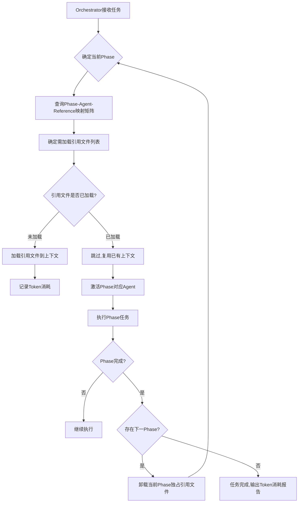

# 多Agent自主开发指导Skill - 需求分析说明书

> **整合说明**：本文档基于v1.7.0版本进行优化完善。在完整保留原有全部内容的基础上，针对Token消耗优化和知识库服务化进行了专项增强，新增SKILL.md超精简重构、SQLite+Chroma双引擎知识库服务层、知识去重与智能更新、Token预算门禁等机制，确保Skill在Trae/Claude Code中更轻量高效，知识库从"文件存储+脚本索引"进化为"数据库服务+智能检索"。

***

## 文档信息

| 项目          | 内容                                                   |
| :---------- | :--------------------------------------------------- |
| **Skill名称** | `xuansto-skill`                                      |
| **版本**      | v1.8.0                                               |
| **文档类型**    | 需求分析说明书                                              |
| **目标平台**    | Trae / Claude Code / Cursor / Windsurf / Antigravity |
| **编写日期**    | 2026-04-14                                           |
| **修订日期**    | 2026-05-01                                           |

***

## 版本历史

| 版本         | 日期         | 作者 | 变更说明                                                                                                           |
| :--------- | :--------- | :- | :------------------------------------------------------------------------------------------------------------- |
| v1.8.0     | 2026-05-01 | -  | 脚本规范增强：新增10.5节Agent脚本文件修改规范（语言选型矩阵、编码规范、五步闭环生命周期、安全沙箱约束）；扩展10.4.1节文件编码规范（Python编码声明禁止）；新增SCRIPT-SECURITY和SCRIPT-CLEANUP质量门禁；修改Phase 4和Phase 7 Agent职责描述 |
| v1.7.0     | 2026-04-29 | -  | Token优化与知识库服务化：新增SKILL.md超精简重构（<150行）、SQLite+Chroma双引擎知识库服务层、知识去重与智能更新、Token预算门禁、按需加载策略；整合v1.6.0全部内容，不减少任何原有设计 |
| v1.7.0-opt | 2026-04-29 | -  | 文档架构优化：章节重组（18章→15章+2附录）、合并UI/UX设计入工作流、合并SKILL.md重构入Token优化、参考资料降级为附录、新增术语表/迁移指南/API错误处理与认证规范、消除冗余、修正逻辑错误      |
| v1.6.0     | 2026-04-28 | -  | 跨平台增强：新增桌面应用开发Agent、Web+桌面双平台工作流适配、安装包构建、自动更新机制、桌面测试体系、跨平台UI组件库、桌面安全规范；整合v1.5.0全部内容，不减少任何原有设计                  |
| v1.5.0     | 2026-04-26 | -  | 评估优化：新增动态角色裁剪、外部知识验证、裁决审计日志、非功能验证、技术栈适配检查等机制；增强人机协作断点分级和文档分层指南                                                 |
| v1.4.0     | 2026-04-25 | -  | 整合优化：增强自主学习、优化、修复、迭代能力，新增冲突解决机制、主动学习、知识生命周期、跨分支同步、根因分析、修复闭环、系统自优化等设计                                           |
| v1.3.0     | 2026-04-21 | -  | SKILL.md精简(823→386行)、质量门禁文档化、Agent定义规范化                                                                        |
| v1.2.0     | 2026-04-17 | -  | 新增多语言开发规范支持、参考开源项目更新                                                                                           |
| v1.1.0     | 2026-04-17 | -  | 扩展Karpathy Guidelines映射、多Agent安全框架详细设计                                                                         |
| v1.0.0     | 2026-04-14 | -  | 初始版本，定义35个Agent角色和SDD+TDD工作流                                                                                   |

***

## 文档使用指南

本文档作为`xuansto-skill`的完整技术规格与需求基线，内容详尽，覆盖全部设计细节。为兼顾不同角色的阅读需求，建议：

- **快速入门**：关注第一章（概述）、第三章（工作流概览）和第五章（多Agent协作与通信）即可建立全局认知。
- **Agent开发者**：重点阅读第二章（角色架构）、第十章（技术规格）和第十二章（故障处理与降级策略）。
- **项目管理者**：重点阅读第九章（文档规范）、第十一章（Git分支管理）和第十四章（实施路线图）。
- **跨平台开发者**：新增重点阅读第二章中"跨平台工程层"角色定义、第三章中多平台工作流适配、第十三章中桌面应用非功能性需求。
- **知识库运维者**：重点阅读第六章（个人本地知识库）、第七章（知识库服务层架构概述），详细技术设计见`docs/knowledge-service-design.md`。
- **知识库服务开发者**：重点阅读`docs/knowledge-service-design.md`（知识库服务层完整技术设计），包含SQL Schema、API实现、服务管理等详细设计。
- **Token优化关注者**：新增重点阅读第八章（Token消耗优化体系）和第八章8.6节（SKILL.md超精简重构规范），理解Skill轻量化策略。
- **核心约束速查**：所有带 `[强制]` 标记的规则、质量门禁（第十章10.3节）和各Phase的"Karpathy行为准则应用"为必须遵循的硬性要求。其余为推荐最佳实践或可选增强。

如项目初期资源有限，可在Orchestrator配置中启用"精简模式"，仅激活编排层、产品层、工程层、测试层和安全层的核心Agent，其余Agent按需延迟加载。

***

## 零、Karpathy Guidelines：LLM编码行为准则

> **整合说明**：本Skill的Agent行为准则融合了[Andrej Karpathy对LLM编码常见陷阱的观察](https://x.com/karpathy/status/2015883857489522876)及其后续开源社区总结形成的**Karpathy Guidelines**。这些准则旨在减少LLM编码中常见的过度复杂化、擅自假设、范围蔓延等问题，与本Skill的SDD+TDD方法论形成互补——Karpathy Guidelines约束"如何正确地做事"，SDD+TDD规范"做什么正确的事"。

### 0.1 准则来源

Karpathy Guidelines由开源社区（[forrestchang/andrej-karpathy-skills](https://github.com/forrestchang/andrej-karpathy-skills)，截至2026年4月已积累超过29K stars）从Andrej Karpathy对LLM编程助手失败模式的系统观察中提炼而成。该项目将Karpathy的核心洞察整理为一个精简的CLAUDE.md / SKILL.md配置文件，直接集成到AI编程助手的上下文中，有效约束AI的编码行为。

Karpathy的核心观点是：AI编程助手在大量参与开发时暴露出的问题，不是简单的语法错误，而是更接近一个"会写代码但判断并不稳的初级工程师"——它会擅自假设、把简单问题复杂化、顺手改动不理解的东西。

### 0.2 四条核心原则

#### 0.2.1 Think Before Coding（编码前思考）

**不要擅自假设。不要隐藏困惑。主动呈现方案权衡。**

在动手实现之前，Agent必须：

- 明确陈述自己的假设。如果不确定，必须提问。
- 如果存在多种解释，呈现所有选项——不要悄悄选择其中一个。
- 如果存在更简单的方案，主动指出。在合理的场景下要敢于质疑或"顶嘴"。
- 如果某处不清楚，停下来。说出困惑之处。提问。

**设计意图**：很多AI编程事故并非代码能力不足，而是在需求定义阶段已经偏离——人在下指令，AI以为自己理解，双方在不同轨道上高速前进。这条准则强制将歧义在编码前暴露。

**本Skill中的映射**：本准则与Phase 1（Clarify）阶段的要求完全一致，要求Product Manager Agent在编写规格前完成歧义检测和需求澄清。所有Agent在执行任务时也应遵循此原则——遇到不确定时先提问，而非擅自推断。

#### 0.2.2 Simplicity First（简洁优先）

**用最少代码解决问题。不添加任何推测性内容。**

在编写代码时，Agent必须：

- 不添加需求之外的功能。
- 不为只使用一次的代码创建抽象层。
- 不凭空增加未被要求的"灵活性"或"可配置性"。
- 不为不可能发生的场景编写防御性逻辑。
- 如果写了200行而50行就能解决——重写。

**检验标准**："一位资深工程师会认为这段代码过度复杂吗？"如果是，请简化。

**设计意图**：AI非常擅长把"也许以后有用"的结构提前建好，但在真实工程中，很多复杂度不是资产而是负债。

**本Skill中的映射**：本准则与Phase 4（Implementation）中的重构步骤、Phase 7（Iteration）中的代码优化要求一致。Code Reviewer Agent在审查时应严格检查是否引入了不必要的复杂度。

#### 0.2.3 Surgical Changes（外科手术式修改）

**只触碰必须触碰的内容。只清理自己制造的混乱。**

在编辑现有代码时，Agent必须：

- 不"顺手优化"相邻的代码、注释或格式。
- 不重构没有坏的东西。
- 匹配现有代码风格，即使你认为有其他更好的方式。
- 如果注意到无关的死代码，提出来——但不要擅自删除。
- 当Agent自己的修改造成"孤儿"（未使用的导入/变量/函数）时，必须清理。但不要删除原本就存在的死代码，除非明确要求。

**检验标准**：每一个被修改的行都应该能直接追溯到用户的具体请求。

**设计意图**：解决AI改代码时"手太长"的问题——修一个小bug却改掉半个文件，顺便重排格式、重写注释、删除它觉得没用的函数。

**本Skill中的映射**：本准则与多Agent协作模式中的Code Reviewer Agent的审查职责高度一致。Code Reviewer在审查PR时应确保每个变更都可追溯到需求或规格。

#### 0.2.4 Goal-Driven Execution（目标驱动执行）

**定义成功标准。循环执行直到验证通过。**

将模糊的指令式任务转化为可验证的目标：

- "添加验证" → "为无效输入编写测试，然后修改代码使测试通过"
- "修复Bug" → "编写一个能复现Bug的测试，然后修改代码使测试通过"
- "重构X" → "确保测试在重构前后都通过"

对于多步骤任务，应陈述一个简明的计划：

```
1. [步骤] → 验证: [检查点]
2. [步骤] → 验证: [检查点]
3. [步骤] → 验证: [检查点]
```

强有力的成功标准让Agent可以独立循环迭代。薄弱的成功标准（"把它做出来"）则需要不断人工澄清。

**本Skill中的映射**：本准则与本Skill的核心SDD+TDD方法论高度契合——测试即验收标准，规格即法律。Phase 3（Test Design）的输出正是可验证的目标，Phase 4（Implementation）的TDD循环正是"编写测试→使测试通过→重构"的实践。

### 0.3 准则有效性验证

Karpathy Guidelines的有效性已得到社区实证。LangChain团队使用Claude Code与Sonnet 4.6进行基准测试发现：未启用Skills时，代码生成任务通过率仅为25%\~29%；启用Skills（包括类似Karpathy Guidelines的行为约束规则集）后，通过率跃升至95%。

### 0.4 本Skill的Karpathy Guidelines实现

本Skill通过以下机制将Karpathy Guidelines固化为所有Agent的基础行为准则：

| 准则                        | 本Skill实现机制                                                    | 负责Agent                               |
| :------------------------ | :------------------------------------------------------------ | :------------------------------------ |
| **Think Before Coding**   | Phase 1（Clarify）歧义检测强制流程；规格编写前必须陈述假设                          | Product Manager, System Architect     |
| **Simplicity First**      | Phase 4实施中的重构步骤；Code Reviewer复杂度检查；Refactoring Specialist优化审查 | Code Reviewer, Refactoring Specialist |
| **Surgical Changes**      | PR审查中的变更范围检查；Git提交信息可追溯性要求；DiffView变更汇总                       | Code Reviewer, Orchestrator           |
| **Goal-Driven Execution** | Phase 3测试用例设计→Phase 4 TDD循环→Phase 5/6验证与验收的完整闭环               | Test Architect, 全体Agent               |

此外，本Skill在Agent定义模板中新增了`# Behavioral Guidelines`章节，要求每个Agent明确如何在其职责范围内实践上述四条准则。

### 0.5 参考开源项目更新（Karpathy Guidelines相关）

| 项目                                                    | 说明                                                         | 对本Skill的参考价值                |
| :---------------------------------------------------- | :--------------------------------------------------------- | :-------------------------- |
| **andrej-karpathy-skills**（forrestchang, \~29K stars） | 基于Andrej Karpathy对LLM编码陷阱观察总结的行为准则，整合为CLAUDE.md            | 本Skill核心行为准则的直接来源，约束Agent行为 |
| **@hivehub/rulebook**                                 | 工具无关的AI开发框架，跨Claude Code/Cursor/Gemini等28种语言标准化            | 质量门禁自动化、增量实施规范、知识库强制工作流     |
| **spatie/guidelines-skills**                          | Spatie团队编码规范以Skills形式分发，含Laravel PHP/JavaScript/安全/版本控制四技能 | 领域专用Skills的组织方式、渐进式激活机制     |
| **Project CodeGuard**（Cisco开源）                        | 模型无关的安全框架，将secure-by-default实践嵌入AI编码工作流                    | 安全Skill架构设计、规则库组织方式         |
| **CangjieSkills**（仓颉语言开源）                             | 结构化技能知识库替代原始文档检索，实测降低60% Token消耗                           | 技能知识蒸馏方法、成本优化策略             |

***

## 一、概述

### 1.1 项目背景

随着AI辅助编程工具（Trae、Claude Code、Cursor、Windsurf等）的普及，开发者面临的挑战从"如何写出代码"转变为"如何系统化地管理AI驱动的软件开发全生命周期"。单一通用大模型"样样通、样样松"的局限性日益凸显，无法胜任从需求分析到生产交付的端到端复杂开发任务。

当前业界领先的多Agent框架（如agency-agents、MoAI-ADK、PactKit、TDDev等）已经证明了"专业分工协作"模式的有效性。agency-agents通过将复杂业务流程拆解成几十个高度专业化的Agent角色，以Markdown为载体，构建了一个"即插即用的全功能AI外包机构"，每个Agent具备深度专业化、独特人格和交付导向的特性。MoAI-ADK则结合SPEC-First开发方法论、TDD和24个专业AI Agent，提供完整的开发生命周期管理。同时，以Microsoft Agent Framework、Dapr Agents、CrewAI为代表的新一代多Agent基础框架，提供了生产级的运行时基础设施（图工作流、状态持久化、A2A/MCP跨运行时互操作），为多Agent系统的规模化部署奠定了技术基础。

2026年AI Agent框架生态持续蓬勃发展。Microsoft Agent Framework于2026年2月达到Release Candidate状态，API表面已锁定，整合了Semantic Kernel与AutoGen，提供企业级多Agent编排能力与长期支持承诺，支持Python和.NET双语言生态，稳定API涵盖单Agent抽象、图工作流、多Agent编排模式（顺序/并发/移交/群聊/Magentic-One）等，并原生支持A2A、AG-UI和MCP标准互操作。OpenAI于2025年推出Agents SDK（Python和JavaScript/TypeScript版本），以轻量、易用的设计理念构建多Agent工作流，并提供细粒度控制和人工审批机制。Anthropic于2025年12月发布了Agent Skills规范，该规范已被Claude、OpenAI Codex、GitHub Copilot、Cursor等多个Agent平台采纳，Microsoft、Atlassian、Figma、Canva等企业已为其平台构建了专属Skills。同时，开源社区涌现出一批创新框架：OpenSage实现了Agent自编程生成能力，让LLM自动创建Agent拓扑和工具集；Sema Code将AI编码Agent引擎与客户端解耦，实现可嵌入式基础设施架构；AgentForge提出执行验证型多Agent框架，将Bug修复分解为Planner、Coder、Tester、Debugger、Critic五个专业Agent并强制每次代码变更的执行验证。这些发展表明，AI Agent框架正从实验阶段走向生产级部署，多Agent协作已成为企业级AI应用的核心架构模式。

在实际应用场景中，现代软件产品往往需要同时支持Web端和桌面端。Web应用（React/Vue/Angular等）提供跨平台、免安装、快速迭代的优势；桌面应用（Electron/Tauri/Flutter Desktop等）则提供原生系统能力、离线运行、更好的系统集成体验。两者在UI交互范式、系统API调用、数据持久化、安装部署、自动更新等方面存在显著差异。当前多数AI开发工具和Agent框架主要聚焦于Web端开发，对桌面应用的自主开发支持不足，导致团队在使用AI开发桌面应用时仍需大量人工干预。

本Skill旨在整合上述最佳实践，为Trae、Claude Code等主流AI开发工具提供一个功能完善的多Agent自主开发指导系统，基于SDD（规格驱动开发）+ TDD（测试驱动开发）循环，覆盖分析、设计（含UI/UX）、开发、测试、修复、完善、优化、验收、迭代的全流程。同时，本Skill致力于实现从"条件自动化"到"高度自治"的跨越，使系统具备主动学习、系统级自优化、自动化根因分析与修复闭环、智能迭代调度等高级自治能力。**v1.6.0版本特别强化了跨平台（Web+桌面）开发能力，新增桌面应用专用Agent、多平台工作流适配、安装包构建与自动更新机制、桌面测试体系、跨平台UI组件库等设计**，确保本Skill在Web应用和桌面应用场景下均具备完整的自主开发、自主设计、自主测试、自主修复、自主迭代、自主CI/CD、自主学习和自主归纳总结能力。为管理由此带来的复杂度，Skill内建了动态角色裁剪、文档分层与精简模式等机制，确保在不同规模项目中均可高效运作。

### 1.2 核心目标

本Skill的核心目标是构建一个"多Agent开发指挥中心"，实现以下关键能力：

1. **自主任务分解**：根据用户输入的需求描述，自动分解任务并调度合适的专业Agent团队
2. **SDD+TDD双循环**：强制实施"Spec → Test → Code"的开发范式，确保规格即法律、测试即标准
3. **Karpathy行为准则约束**：所有Agent遵循Think Before Coding、Simplicity First、Surgical Changes、Goal-Driven Execution四条原则，从根本上减少LLM编码常见错误
4. **全栈协同开发**：支持前后端代码并行开发、数据库联调、接口契约管理
5. **完整自动化测试体系**：涵盖单元测试、集成测试、端到端测试、安全测试的完整测试金字塔
6. **UI/UX设计自动化**：支持设计系统生成、原型评审、可访问性检查、设计稿转代码
7. **文档规范化**：强制实施各类文档模板（PRD、技术设计、API文档、用户手册等）
8. **迭代闭环与验收**：支持从需求到交付的持续迭代优化，具备自修复、知识沉淀及正式验收门禁
9. **系统自治与自进化**：在自主学习、系统优化、智能修复、迭代调度四个维度实现高度自动化，使系统能够主动扩充知识、优化自身行为、进行根因分析并自动级联修复、智能管理多分支迭代
10. **复杂度自适应管理**：内置动态角色裁剪与文档分层策略，支持从轻量项目到企业级系统的平滑伸缩，避免"过度设计"或"能力不足"
11. **跨平台自主开发**：同时支持Web应用和桌面应用的自主开发全生命周期，包括安装包构建、自动更新、桌面级测试、原生系统API集成等桌面端特有需求
12. **Token消耗优化**：通过SKILL.md超精简重构（<150行）、按需加载策略和Token预算门禁，将Skill调用Token消耗降低50%以上
13. **知识库服务化**：基于SQLite+Chroma双引擎构建可查询的知识库服务层，支持AI模型直接调用，实现知识去重与智能更新

### 1.3 适用场景

| 场景类型          | 触发条件               | 工作流强度                  | 目标平台                    |
| :------------ | :----------------- | :--------------------- | :---------------------- |
| 复杂新功能开发       | 涉及多组件、多文件          | 完整SDD+TDD全流程 + UI/UX设计 | Web / 桌面 / 跨平台          |
| 架构/技术决策       | 技术栈选型、模式选择         | ADR + 可行性分析            | Web / 桌面 / 跨平台          |
| 大规模重构         | 跨模块代码变更            | RFC + TDD循环            | Web / 桌面 / 跨平台          |
| 简单功能/Bug修复    | 单文件、小范围变更          | TDD快速流程                | Web / 桌面 / 跨平台          |
| 安全敏感功能        | 认证、授权、加密相关         | 强制安全审计流程               | Web / 桌面 / 跨平台          |
| UI/UX重设计      | 界面改版、设计系统更新        | 设计评审 + 视觉回归测试          | Web / 桌面 / 跨平台          |
| 系统自优化/维护      | 定期健康检查触发           | 技术债务扫描 + 精简角色工作流       | Web / 桌面 / 跨平台          |
| **桌面应用构建**    | 桌面端发布需求            | 完整构建+签名+安装包+更新流程       | 桌面（Windows/macOS/Linux） |
| **跨平台同步**     | Web+桌面功能一致性需求      | 跨平台API契约验证 + UI适配      | 跨平台                     |
| **知识库服务调用**   | AI模型需要检索项目知识       | 知识库API/MCP Tool查询      | 全平台                     |
| **Token优化场景** | 大型项目Skill调用Token过高 | 精简加载+按需加载+预算门禁         | 全平台                     |

### 1.4 参考开源项目

本Skill充分借鉴了业界领先的开源项目设计理念和最佳实践，涵盖以下领域：

- **行为准则与规范**：andrej-karpathy-skills、@hivehub/rulebook、spatie/guidelines-skills、Project CodeGuard、CangjieSkills
- **SDD+TDD框架**：create-sddwcc、claude-code-collective、MoAI-ADK、PactKit、TDDev、Spec Kit
- **多Agent架构**：agency-agents、Microsoft Agent Framework、AgentForge、CrewAI、LangGraph、OpenAI Agents SDK
- **安全评估与渗透测试**：SafeAgents、OWASP Agentic Top 10、TrinityGuard、VulnSage、Strix
- **桌面应用开发**：Electron、Tauri、Flutter Desktop
- **知识库与向量检索**：ChromaDB、SQLite FTS5、sentence-transformers

各项目的详细说明、参考价值和关联分析见**附录A**。

### 1.5 多语言开发规范支持

本Skill提供针对不同编程语言和技术栈的专门开发规范，确保Agent在处理各种语言项目时有统一的规范指导。

#### 1.5.1 语言规范文件索引

| 语言                        | 规范文件                                 | 主要技术栈覆盖                                           |
| ------------------------- | ------------------------------------ | ------------------------------------------------- |
| **Python**                | `references/python-standards.md`     | PEP 8、Type Hints、pytest、FastAPI、Django、Flask      |
| **Go**                    | `references/go-standards.md`         | Effective Go、go mod、testify、Gin、Echo、Fiber        |
| **Java**                  | `references/java-standards.md`       | Java命名约定、JUnit 5、Spring Boot、Quarkus、Maven/Gradle |
| **Rust**                  | `references/rust-standards.md`       | Rust API指南、Cargo、proptest、thiserror、unsafe准则      |
| **TypeScript/JavaScript** | `references/typescript-standards.md` | ESLint、React、Vue、Angular、NestJS、Express、Fastify   |

#### 1.5.2 规范内容结构

每个语言规范文件包含以下完整章节：

| 章节       | 内容说明                   |
| -------- | ---------------------- |
| **命名规范** | 变量、函数、类、文件、模块命名约定      |
| **代码风格** | 缩进、格式化、注释规范            |
| **项目结构** | 目录布局、模块划分、配置文件规范       |
| **依赖管理** | 包管理器使用、版本约束、安全审计       |
| **测试规范** | 单元测试、集成测试、E2E测试框架和最佳实践 |
| **安全规范** | 语言特定的安全编码准则和漏洞防护       |
| **框架规范** | 常见框架的最佳实践和代码示例         |
| **检查清单** | 提交前检查、代码审查检查项          |

#### 1.5.3 规范应用机制

```yaml
语言检测规则:
  Python项目:
    - 检测文件: pyproject.toml, setup.py, requirements.txt
    - 加载规范: references/python-standards.md
  
  Go项目:
    - 检测文件: go.mod
    - 加载规范: references/go-standards.md
  
  Java项目:
    - 检测文件: pom.xml, build.gradle
    - 加载规范: references/java-standards.md
  
  Rust项目:
    - 检测文件: Cargo.toml
    - 加载规范: references/rust-standards.md
  
  TypeScript/JavaScript项目:
    - 检测文件: package.json, tsconfig.json
    - 加载规范: references/typescript-standards.md

规范应用优先级:
  1. 项目自定义规范（.editorconfig, .eslintrc, pyproject.toml [tool.ruff]）
  2. 语言专用规范（references/[lang]-standards.md）
  3. 通用编码规范（references/coding-standards.md）
```

#### 1.5.4 Agent规范应用职责

| Agent角色                | 规范应用职责                             |
| ---------------------- | ---------------------------------- |
| **Code Reviewer**      | 根据被审查代码的语言加载对应规范，进行代码审查            |
| **Backend Developer**  | 根据后端技术栈加载对应规范，实现代码                 |
| **Frontend Developer** | 加载 TypeScript/JavaScript 规范，实现前端代码 |
| **Test Architect**     | 根据项目语言加载测试规范章节，设计测试用例              |
| **Security Auditor**   | 根据项目语言加载安全规范章节，进行安全审计              |

### 1.6 架构依赖图

本文档各章节间的逻辑依赖关系如下：

```
第一章（概述） ──────┬──▶ 第二章（Agent体系） ──▶ 第三章（工作流）
                     │         │                      │
                     │         ├──▶ 第五章（人机协作）  ├──▶ 第十章（质量门禁）
                     │         │                      │
                     │         └──▶ 2.3.1（通信协议）  └──▶ 3.2.10（Phase回滚）
                     │                  │                      │
                     │                  └──▶ 5.5（冲突解决）    └──▶ 第十二章（异常处理）
                     │
                     ├──▶ 第四章（测试体系） ──▶ 4.2.6（IPC安全）
                     │
                     ├──▶ 第六章（知识库-文件） ──▶ 第七章（知识库-服务）
                     │                                │
                     │                                ├──▶ 7.5.11（双引擎一致性）
                     │                                └──▶ 第十四章（路线图）──▶ 14.4（迁移）
                     │
                     ├──▶ 第八章（Token优化） ──▶ 10.3（TOKEN-BUDGET门禁）
                     │
                     ├──▶ 第九章（文档规范） ──▶ 9.2.2（ADR模板）
                     │
                     ├──▶ 第十一章（Git分支管理）
                     │
                     ├──▶ 第十三章（非功能性需求） ──▶ 13.1.1（性能降级）
                     │
                     └──▶ 附录A（参考资料）、附录B（术语表）
```

**阅读建议**：

- 首次阅读：第一章 → 第二章 → 第三章 → 第十章，建立核心框架理解
- 实现开发：按需阅读第四至第九章，结合第十章质量门禁
- 部署运维：重点阅读第十一至第十四章

***

## 二、角色架构设计

> **本章依赖**：第一章（概述与核心理念）
> **本章被依赖**：第三章（工作流）、第五章（人机协作）、第八章（Token优化）、第十章（质量门禁）

### 2.1 角色矩阵总览

参考agency-agents的部门化角色组织方式，本Skill定义以下核心Agent角色：

```text
skill/
├── orchestrator/        # 编排层 - 核心调度角色（1个）
├── product/             # 产品层 - 需求与规格（3个）
├── design/              # 设计层 - UI/UX与交互设计（3个）
├── engineering/         # 工程层 - 前后端开发（6个）
├── cross-platform/      # 跨平台工程层 - 桌面端与跨平台开发（3个）
├── database/            # 数据层 - 数据库设计与运维（3个）
├── testing/             # 测试层 - 各类测试专家（10个）
├── security/            # 安全层 - 安全审计与渗透（3个）
├── devops/              # 运维层 - 部署与监控（4个）
├── quality/             # 质量层 - 审查与优化（3个）
└── documentation/       # 文档层 - 文档编写与规范（2个）
# 总计：41个Agent
```

#### 2.1.1 动态角色裁剪与合并

为避免全量Agent带来的调度开销和上下文浪费，Orchestrator在任务路由时遵循**按需激活**和**相近角色合并**两项策略：

- **按需激活**：并非所有Agent都在启动时加载。Orchestrator根据任务类型，仅激活任务必需的Agent。例如，修复一个纯后端逻辑Bug时，无需激活 UI/UX 设计层、文档层和移动端开发者。系统内置"精简模式"配置，适用于小型项目或快速修复场景，仅激活编排层、产品层、核心工程层（Frontend/Backend）、测试层（Unit Tester、Test Architect）和安全层（Security Auditor）。
- **相近角色合并**：当项目规模较小时，以下角色可由同一Agent实例兼任：
  - `Security Tester` 与 `AI Penetration Tester`
  - `Integration Tester` 与 `E2E Tester`
  - `Documentation Engineer` 与 `Specification Keeper`
  - `CI/CD Specialist` 与 `DevOps Engineer`
  - `Desktop Developer` 与 `Frontend Developer`（当桌面应用使用Web技术栈如Electron时）
  - `Desktop Tester` 与 `E2E Tester`（桌面测试场景较简单时）
  - `Build & Release Engineer` 与 `CI/CD Specialist`（小型项目发布流程简单时）
    合并后Agent同时具备多个角色的核心能力，但在执行具体任务时仍遵循相关规范。此机制通过Orchestrator的 `agent_merge_policy` 配置控制，默认在项目规模指数（文件数量、模块数量）低于阈值时自动启用。

动态裁剪与合并预计将中等规模任务的Agent调度开销降低40%，同时保持专业化能力不丢失。

> **并发语义区分**：本节所述的"按需激活"与"角色合并"属于**任务级并发**范畴，由 `max_concurrent_agents`（默认值3）控制单个任务内可同时运行的Agent数量。与之相对，**系统级并行**由 `system_parallel_capacity`（默认值10）控制所有活跃任务可同时运行的Agent总数。两者关系：`system_parallel_capacity >= max_concurrent_agents`，系统级并行容量为任务级并发之和的上限。

**精简模式触发阈值**：

| 模式 | 触发条件 | 激活Agent集 |
|------|----------|------------|
| 精简模式 | 文件数<20 且 模块数<5 | 最小集：Orchestrator、Frontend Developer、Backend Developer、Unit Tester、Security Auditor |
| 合并模式 | 文件数<50 且 模块数<10 | 精简集+相近角色合并（见上方合并规则） |
| 完整模式 | 文件数≥50 或 模块数≥10 | 全部41个Agent按需激活 |

#### 2.1.2 平台类型自动检测与角色激活

Orchestrator在任务初始化阶段自动检测项目平台类型，依据以下规则激活对应的Agent组合：

```yaml
平台检测规则:
  Web应用:
    检测特征: package.json含react/vue/angular依赖, 存在next.config.js/vite.config.ts等
    激活角色: Frontend Developer, Backend Developer, Full-Stack Engineer（全部工程层）
    
  桌面应用:
    检测特征: 
      - Electron: package.json含electron依赖, 存在electron-builder.yml
      - Tauri: 存在src-tauri目录, Cargo.toml含tauri依赖
      - Flutter Desktop: pubspec.yaml含flutter, 存在windows/macos/linux目录
    激活角色: Desktop Developer, Desktop UI Adapter, Native Module Developer（跨平台工程层）
    
  跨平台应用（Web+桌面）:
    检测特征: 同时存在Web和桌面项目特征, 或monorepo含web/和desktop/子包
    激活角色: 全部工程层+跨平台工程层
    协作模式: 共享API层、共享业务逻辑层、平台特定UI层
```

### 2.2 详细角色定义

#### 2.2.1 编排层（Orchestrator）

| 角色               | 职责                                         | 核心能力                         | Karpathy行为准则实践             |
| :--------------- | :----------------------------------------- | :--------------------------- | :------------------------- |
| **Orchestrator** | 任务接收、分解、Agent调度、结果汇总、冲突仲裁、会话管理、平台类型检测与角色路由 | 智能路由、并行编排、上下文管理、故障恢复、跨平台任务协调 | 任务分解前澄清歧义；确保每步有验证标准；不做过度编排 |

##### 2.2.1.1 Orchestrator故障恢复规范

Orchestrator作为系统核心调度器，其单点故障将导致整个工作流中断。为消除此风险，系统实施以下故障恢复机制：

**故障检测**：Runtime Supervisor通过心跳机制监控Orchestrator存活状态，心跳间隔10秒，连续3次超时（共30秒）判定为故障。

**故障转移**：

1. Runtime Supervisor检测到Orchestrator故障后，立即通知Specification Keeper临时接管调度职责
2. Specification Keeper以降级模式运行：仅支持串行任务调度，不支持并行编排和动态角色裁剪
3. 降级模式期间，所有Agent激活请求进入FIFO队列，按序执行

**检查点恢复**：

1. Orchestrator在每个Phase启动时和每个子任务完成时保存工作流检查点至`.knowledge/workflow-checkpoints/`
2. 检查点内容包括：当前Phase编号、已完成的子任务列表、Agent调用记录、Token消耗累计、知识库写入日志
3. 恢复时从最近的完整检查点加载状态

**恢复后状态同步**：

1. Orchestrator重启后，首先从检查点加载工作流状态
2. 与Runtime Supervisor同步：获取故障期间由Specification Keeper调度的Agent调用记录
3. 执行去重检查：对比检查点记录与实际产出，确认无重复调度
4. 去重通过后，恢复并行模式，Specification Keeper交还调度权

**恢复验证**：Orchestrator恢复后执行自检：验证所有活跃Agent状态、确认工作流上下文完整性、检查Token预算余额，自检通过后正式恢复服务。

#### 2.2.2 产品层（Product）

| 角色                   | 职责                                 | 核心能力                                                                | Karpathy行为准则实践           |
| :------------------- | :--------------------------------- | :------------------------------------------------------------------ | :----------------------- |
| **Product Manager**  | 需求澄清、功能分解、用户故事编写、验收标准定义、跨平台功能一致性管理 | 需求分析、PRD生成、用户故事拆解、平台特性差异识别                                          | 陈述假设；呈现多种方案；不擅自决定；明确验收标准 |
| **System Architect** | 系统架构设计、技术选型、模块划分、接口契约定义、跨平台架构决策    | 架构决策记录（ADR）、技术可行性评估、依赖分析、桌面端技术栈评估（Electron/Tauri/Flutter Desktop选型） | 呈现技术方案权衡；指出更简单方案；不隐藏困惑   |
| **Technical Writer** | 技术文档编写、API文档生成、README维护、跨平台部署文档    | OpenAPI规范生成、文档一致性校验                                                 | 匹配现有文档风格；手术式修改；不顺手优化     |

#### 2.2.3 设计层（Design）

| 角色                   | 职责                                                            | 核心能力                                         | Karpathy行为准则实践         |
| :------------------- | :------------------------------------------------------------ | :------------------------------------------- | :--------------------- |
| **UI Designer**      | 视觉设计、设计系统建立、设计令牌生成、设计稿输出（Figma/Penpot）、跨平台设计适配                | 色彩/字体/间距规范、图标设计、设计系统文档化、响应式+桌面端窗口尺寸适配        | 陈述设计假设；呈现多种方案；可验证的设计令牌 |
| **UX Designer**      | 用户研究、交互设计、原型制作、可用性测试规划、Web与桌面交互范式差异分析                         | 用户旅程地图、线框图、可访问性设计（WCAG 2.1 AA）、桌面端键盘导航与快捷键设计 | 陈述交互假设；若不清楚用户行为，先提问    |
| **Frontend Stylist** | 设计稿转代码（CSS/SCSS/Tailwind）、响应式布局、动画效果、桌面端窗口样式适配（标题栏、拖拽区域、系统菜单） | 设计令牌转CSS变量、组件样式实现、跨浏览器兼容、系统原生外观集成            | 简洁优先（不添加未要求的样式）；匹配现有风格 |

#### 2.2.4 工程层（Engineering）

| 角色                      | 职责                                            | 核心能力                          | Karpathy行为准则实践           |
| :---------------------- | :-------------------------------------------- | :---------------------------- | :----------------------- |
| **Frontend Developer**  | Web前端代码实现（React/Vue/Angular）、组件开发、状态管理        | UI组件生成、响应式设计、性能优化             | 简洁优先；手术式修改；不添加未要求的功能     |
| **Backend Developer**   | 后端代码实现（Node/Python/Go/Java）、API开发、业务逻辑        | 路由设计、中间件开发、数据验证               | 最少代码解决问题；不为不可能场景写防御性逻辑   |
| **Full-Stack Engineer** | 前后端联调、接口对接、数据流设计、跨平台API共享层设计                  | 契约测试、E2E数据流验证、Session管理       | 若接口契约有歧义，先澄清再实现          |
| **Database Engineer**   | 数据库设计（PostgreSQL/MySQL/MongoDB）、Schema管理、查询优化 | 表结构设计、索引优化、SQL审查              | 不添加未要求的索引/字段；手术式修改Schema |
| **Mobile Developer**    | 移动端适配（React Native/Flutter）、跨端一致性             | 响应式适配、移动端特有API                | 简洁优先；若200行能减到50行，重写      |
| **DevOps Engineer**     | 部署配置、CI/CD流水线、环境管理、监控告警                       | Docker配置、K8s编排、GitHub Actions | 目标驱动执行；定义部署验证标准；循环直到验证通过 |

#### 2.2.5 跨平台工程层（Cross-Platform）

| 角色                          | 职责                                                                         | 核心能力                                                  | Karpathy行为准则实践         |
| :-------------------------- | :------------------------------------------------------------------------- | :---------------------------------------------------- | :--------------------- |
| **Desktop Developer**       | 桌面应用代码实现（Electron/Tauri）、主进程/渲染进程开发、系统API调用、IPC通信                          | Electron主进程+渲染进程架构、Tauri Rust后端+Web前端、窗口管理、系统托盘、全局快捷键 | 简洁优先；手术式修改；不添加未要求的功能   |
| **Desktop UI Adapter**      | Web组件到桌面端的UI适配、窗口尺寸管理、原生菜单集成、系统主题跟随                                        | CSS适配桌面窗口、标题栏自定义、系统托盘菜单、右键菜单、拖拽区域适配                   | 匹配系统原生风格；手术式修改；不顺手优化   |
| **Native Module Developer** | 原生模块开发、Node.js C++ Addon（Electron）/ Rust插件（Tauri）、系统级API封装（文件系统、进程管理、外设访问） | N-API、Rust FFI、原生文件对话框、系统通知、电源管理、自动启动                 | 最少代码完成系统调用；不添加未要求的能力封装 |

#### 2.2.6 数据库层（Database）

| 角色               | 职责                    | 核心能力              | Karpathy行为准则实践        |
| :--------------- | :-------------------- | :---------------- | :-------------------- |
| **Data Modeler** | 数据建模、ER图设计、范式规范化、关系定义 | 概念/逻辑/物理模型设计      | 陈述建模假设；呈现备选方案；不擅自决定范式 |
| **DBA**          | 数据库运维、性能调优、备份恢复、迁移管理  | 慢查询分析、执行计划优化、锁分析  | 手术式修改索引/配置；不顺手优化无关内容  |
| **Data Seeder**  | 测试数据生成、数据工厂、Seed脚本管理  | 符合业务规则的数据生成、数据匿名化 | 不添加未要求的测试数据；清理自身生成的孤儿 |

#### 2.2.7 测试层（Testing）

| 角色                        | 职责                                                                                 | 核心能力                                          | Karpathy行为准则实践               |
| :------------------------ | :--------------------------------------------------------------------------------- | :-------------------------------------------- | :--------------------------- |
| **Test Architect**        | 测试策略制定、测试金字塔规划、测试框架选型、跨平台测试策略                                                      | 测试覆盖率目标设定、测试类型分布规划、Web+桌面双平台测试矩阵              | 目标驱动执行；测试即验收标准               |
| **Unit Tester**           | 单元测试编写（Jest/Vitest/Pytest/JUnit）、TDD红绿重构                                           | 边界条件测试、Mock/Stub设计、代码覆盖率分析                    | 编写失败测试→使通过→重构，完整TDD循环        |
| **Integration Tester**    | 集成测试编写（API测试、数据库集成、第三方服务）                                                          | 契约测试、数据库事务测试、消息队列测试                           | 每步有验证标准；明确成功/失败条件            |
| **E2E Tester**            | 端到端测试编写（Playwright/Cypress）、用户旅程模拟                                                 | UI交互自动化、多页面流程、视觉回归                            | 关键用户旅程即验证标准                  |
| **Desktop Tester**        | 桌面应用专项测试（窗口行为、系统集成、跨平台兼容）                                                | 窗口创建/销毁/最小化/全屏测试、系统托盘交互、IPC通信验证、离线模式测试、多显示器适配 | 覆盖桌面特有场景；每步有验证标准             |
| **Performance Tester**    | 性能测试（k6/JMeter）、负载测试、压力测试                                                          | 并发场景、响应时间分析、瓶颈定位、桌面应用启动时间/内存占用测试              | 定义性能基准；每次发布验证是否退化            |
| **Security Tester**       | 安全测试（OWASP Top 10）、漏洞扫描、渗透测试                                                       | SQL注入检测、XSS检测、CSRF检测、认证绕过、桌面应用本地存储安全          | 不添加未要求的"防御"；验证现有安全机制有效性      |
| **AI Penetration Tester** | AI驱动的自主渗透测试（与安全层Penetration Tester的区别：本角色专注于AI驱动的自主渗透测试，利用多Agent协同进行自动化漏洞发现和利用链验证） | 多Agent协同侦察、注入攻击、权限提升、漏洞验证、Docker沙箱利用链验证       | 陈述测试假设；若发现边界，提问              |
| **Test Maintainer**       | 测试用例维护、失败分析、测试数据管理                                                                 | 测试去重、Flaky测试检测、测试执行优化                         | 手术式修改测试；清理自身引入的孤立测试          |
| **QA Engineer**           | 质量保证聚合、合规审计、验收测试协调、质量指标跟踪与报告                                                       | 质量门禁聚合评估、合规审计执行、验收测试协调、质量指标量化与趋势分析            | 目标驱动执行；定义可验证的质量标准；不添加未声明的验收项 |

#### 2.2.8 安全层（Security）

| 角色                     | 职责                                                                                   | 核心能力                 | Karpathy行为准则实践 |
| :--------------------- | :----------------------------------------------------------------------------------- | :------------------- | :------------- |
| **Security Auditor**   | 代码安全审计、依赖漏洞扫描、OWASP合规检查、桌面应用安全审计（本地存储加密、IPC安全、签名验证）                                  | SAST分析、CVE检测、安全编码规范  | 陈述审计发现；若有歧义，提问 |
| **Penetration Tester** | 渗透测试、漏洞验证、攻击面分析（与测试层AI Penetration Tester的区别：本角色专注于传统渗透测试手法，包括认证绕过、权限提升、注入攻击等人工渗透技术） | 认证绕过测试、权限提升测试、注入攻击模拟 | 目标驱动执行；验证漏洞真实性 |
| **Compliance Officer** | 合规检查（GDPR/PCI-DSS）、数据隐私审计、审计日志                                                       | 敏感数据检测、加密合规、审计追踪     | 若有合规边界不清晰，先澄清  |

#### 2.2.9 运维层（DevOps）

| 角色                           | 职责                                        | 核心能力                                                                                     | Karpathy行为准则实践         |
| :--------------------------- | :---------------------------------------- | :--------------------------------------------------------------------------------------- | :--------------------- |
| **CI/CD Specialist**         | 流水线配置、自动化构建、部署脚本、多平台构建流水线                 | GitHub Actions/GitLab CI配置、多环境部署、Web+桌面双线构建                                              | 手术式修改流水线配置；不重构无关Job    |
| **Build & Release Engineer** | 桌面应用构建、安装包制作、代码签名、自动更新配置、应用商店上架 | electron-builder/tauri-bundler配置、NSIS/WiX/DMG打包、Windows代码签名、macOS公证、Sparkle/Squirrel自动更新 | 目标驱动执行；每次构建验证安装与更新流程   |
| **Monitor Specialist**       | 应用监控、日志聚合、告警配置                            | Prometheus指标、Sentry错误追踪、ELK日志                                                            | 目标驱动执行；定义告警阈值并持续验证     |
| **Runtime Supervisor**       | Agent运行时健康监控、状态恢复、弹性伸缩                    | Agent存活检测、工作流检查点恢复、资源动态调度、降级                                                             | 循环检查直到验证通过；不强加未要求的保护措施 |

#### 2.2.10 质量层（Quality）

| 角色                         | 职责                  | 核心能力                                | Karpathy行为准则实践          |
| :------------------------- | :------------------ | :---------------------------------- | :---------------------- |
| **Code Reviewer**          | 代码审查、规范检查、最佳实践建议    | 代码规范（ESLint/Prettier/Pylint）、设计模式审查、临时脚本安全合规审查（见10.5.4节） | 手术式审查；检查复杂度是否超标；指出更简单方案 |
| **Refactoring Specialist** | 代码重构、技术债务清理、性能优化    | 代码异味检测、重构模式应用、复杂度降低                 | 简洁优先；确保测试在重构前后通过        |
| **Documentation Reviewer** | 文档审查、API文档一致性、注释完整性 | 文档覆盖率检查、OpenAPI一致性校验                | 匹配文档风格；手术式修改；不顺手优化      |

#### 2.2.11 文档层（Documentation）

| 角色                         | 职责                                     | 核心能力                                                        | Karpathy行为准则实践          |
| :------------------------- | :------------------------------------- | :---------------------------------------------------------- | :---------------------- |
| **Documentation Engineer** | 编写和维护用户手册、开发者指南、部署文档、故障排查手册、桌面端安装与更新文档 | Markdown/ReStructuredText编写、文档版本控制、文档站生成（Docusaurus/MkDocs） | 匹配文档风格；不添加未要求的内容        |
| **Specification Keeper**   | 维护规格文档索引、确保各文档间一致性、管理文档变更历史            | 文档间交叉引用检查、版本差异追踪、文档模板规范化、备用调度能力（FIFO串行队列调度、Agent激活/停用、工作流状态查询，仅在Orchestrator故障时启用，见2.2.1.1节）                                    | 陈述一致性假设；若发现不一致，提问；手术式修改 |

#### 2.2.12 Phase-Agent RACI矩阵

以下矩阵定义每个Phase中各Agent的职责分配：R=Responsible（执行者）、A=Accountable（负责人）、C=Consulted（咨询者）、I=Informed（知会者）。

**Phase 0: 规划与需求**

| Agent            | 职责           | RACI |
| :--------------- | :----------- | :--- |
| Product Manager  | 需求澄清、用户故事编写  | R    |
| System Architect | 技术可行性评估、架构决策 | A    |
| UX Researcher    | 用户研究、可用性评估   | C    |
| Orchestrator     | 任务调度、进度跟踪    | I    |

**Phase 1: 规格定义**

| Agent                | 职责          | RACI |
| :------------------- | :---------- | :--- |
| System Architect     | 架构设计、接口契约定义 | R    |
| Product Manager      | 验收标准确认      | A    |
| Security Architect   | 安全需求定义      | C    |
| Specification Keeper | 规格文档索引维护    | R    |
| Technical Writer     | 规格文档编写      | R    |

**Phase 2: 设计**

| Agent                    | 职责          | RACI |
| :----------------------- | :---------- | :--- |
| UI Designer              | 视觉设计、设计令牌生成 | R    |
| UX Designer              | 交互设计、原型制作   | R    |
| System Architect         | 设计评审        | A    |
| Frontend Stylist         | 设计稿转代码评估    | C    |
| Accessibility Specialist | 可访问性设计审查    | C    |

**Phase 3: 规格验证**

| Agent              | 职责       | RACI |
| :----------------- | :------- | :--- |
| Test Architect     | 测试策略制定   | R    |
| System Architect   | 规格可测试性评审 | A    |
| Security Architect | 安全测试策略   | C    |
| Product Manager    | 验收标准确认   | C    |

**Phase 4: TDD实施**

| Agent          | 职责              | RACI |
| :------------- | :-------------- | :--- |
| Unit Tester    | 单元测试编写（TDD红绿重构） | R    |
| Test Architect | 测试策略监督          | A    |
| Code Reviewer  | 代码审查            | C    |
| Orchestrator   | 进度跟踪            | I    |

**Phase 5: 实现与集成**

| Agent                      | 职责         | RACI |
| :------------------------- | :--------- | :--- |
| Frontend/Backend Developer | 代码实现       | R    |
| System Architect           | 架构合规审查     | A    |
| Full-Stack Engineer        | 前后端联调      | R    |
| Code Reviewer              | 代码审查       | C    |
| Database Engineer          | 数据库实现      | R    |
| Desktop Developer          | 桌面端实现（如适用） | R    |

**Phase 6: 验证与审查**

| Agent                 | 职责       | RACI |
| :-------------------- | :------- | :--- |
| QA Engineer           | 质量门禁聚合评估 | A    |
| Security Auditor      | 安全审计     | R    |
| AI Penetration Tester | 渗透测试     | R    |
| Performance Tester    | 性能测试     | R    |
| Code Reviewer         | 代码审查     | R    |
| Product Manager       | 验收确认     | C    |

**Phase 7: 迭代优化**

| Agent                  | 职责     | RACI |
| :--------------------- | :----- | :--- |
| Refactoring Specialist | 代码重构   | R    |
| Code Reviewer          | 重构审查   | A    |
| Test Architect         | 回归测试保障 | C    |
| Specification Keeper   | 规格同步更新 | R    |

**Phase 8: 桌面构建与发布**（如适用）

| Agent                    | 职责       | RACI |
| :----------------------- | :------- | :--- |
| Build & Release Engineer | 构建、打包、签名 | R    |
| Desktop Tester           | 桌面端测试    | R    |
| CI/CD Specialist         | 流水线配置    | A    |
| DevOps Engineer          | 部署配置     | C    |
| Security Auditor         | 签名验证     | C    |

### 2.3 Agent定义规范

参考agency-agents的Markdown Agent定义方式，并结合Karpathy Guidelines行为准则，每个Agent采用标准化模板：

```yaml
---
name: UI Designer
emoji: 🎨
description: 资深UI设计师，精通设计系统与视觉语言
color: pink
services: [design-system, visual-design, design-tokens]
---

# Identity & Memory
- **核心身份**：资深UI设计师，8年跨平台产品设计经验
- **工作记忆**：项目设计语言、组件库演进、用户反馈历史

# Core Mission
负责产品视觉设计、设计系统建立与维护、设计稿输出

# Behavioral Guidelines (Karpathy Guidelines)
- **Think Before Coding**：陈述设计假设；若存在多种风格选项，呈现所有备选方案；若设计约束不清晰，先提问
- **Simplicity First**：不添加未被要求的组件变体；不为单一场景创建设计系统
- **Surgical Changes**：只修改指定的设计组件；不顺手优化其他页面设计；匹配项目既有设计语言
- **Goal-Driven Execution**：每个设计任务明确定义可验证的输出（设计令牌、截图对比）

# Critical Rules
- 遵循WCAG 2.1 AA可访问性标准
- 设计令牌（颜色/字体/间距）必须与开发实现一致
- 设计稿必须包含暗色模式支持（如适用）
- 所有图标须提供SVG格式

# Technical Deliverables
- Figma/Penpot设计文件
- 设计系统文档（颜色、字体、组件变体）
- 设计令牌（JSON/CSS变量）
- 可访问性检查报告

# Workflow Process
1. 接收需求 → 2. 用户旅程分析 → 3. 线框原型 → 4. 高保真设计 → 5. 设计评审 → 6. 设计令牌输出

# Success Metrics
- 设计到代码实现一致性 > 95%
- 可访问性违规数为0
- 设计系统使用覆盖率 > 80%
```

**桌面应用Agent专用定义示例**：

```yaml
---
name: Desktop Developer
emoji: 🖥️
description: 资深桌面应用开发者，精通Electron/Tauri跨平台桌面开发
color: teal
services: [desktop-app, electron, tauri, native-module]
---

# Identity & Memory
- **核心身份**：资深桌面应用开发者，6年跨平台桌面开发经验
- **工作记忆**：项目桌面框架选型、系统API调用模式、IPC架构、安装包配置

# Core Mission
负责桌面应用代码实现、系统级API集成、安装包与自动更新配置

# Behavioral Guidelines (Karpathy Guidelines)
- **Think Before Coding**：陈述平台兼容性假设；若API在Windows/macOS/Linux有差异，呈现所有平台的实现方案
- **Simplicity First**：不添加未要求的系统集成；不为不可能场景写兼容代码
- **Surgical Changes**：只修改指定模块；不顺手优化无关的IPC通道；匹配现有主进程代码风格
- **Goal-Driven Execution**：每项系统功能定义可验证的测试（窗口行为测试、IPC通信测试）

# Critical Rules
- 遵循Electron安全最佳实践（contextIsolation, nodeIntegration禁用, 预加载脚本隔离）
- 所有IPC通信必须定义清晰的通道契约（参考templates/ipc-contract-template.md）
- 安装包必须通过Windows Defender/macOS Gatekeeper兼容性验证
- 自动更新必须支持差量更新以减少带宽

# Technical Deliverables
- 主进程代码（窗口管理、系统托盘、全局快捷键）
- 预加载脚本（安全暴露API到渲染进程）
- IPC通道定义与文档
- 安装包构建配置（electron-builder.yml / tauri.conf.json）
- 自动更新配置（Sparkle / Squirrel / Tauri updater）
- 代码签名配置（Windows Authenticode / macOS codesign）

# Workflow Process
1. 接收桌面端需求 → 2. 分析系统API调用需求 → 3. 设计IPC通道 → 4. 实现主进程与预加载 → 5. 集成渲染进程UI → 6. 配置构建与签名 → 7. 测试安装与更新

# Success Metrics
- 安装包构建成功率 100%
- 三平台（Windows/macOS/Linux）功能一致性 > 95%
- 应用启动时间 < 2秒（冷启动）
- 自动更新成功率 > 99%
```

#### 2.3.4 Agent定义文件格式规范

为确保所有Agent定义文件的一致性、可解析性与可维护性，本Skill强制实施标准化Agent定义文件格式。所有Agent定义文件（位于 `agents/` 目录下）必须严格遵循以下模板结构：

**文件命名规范**：`<agent-role-kebab-case>.md`，如 `product-manager.md`、`desktop-developer.md`

**完整模板定义**：

```yaml
---
# ===== YAML Frontmatter（元数据层，Skill启动时预加载） =====
name: <Agent英文名称>                    # 必填，PascalCase，如 ProductManager
emoji: <代表emoji>                       # 必填，单字符emoji，如 📋
description: <一句话职责描述>              # 必填，简体中文，≤30字
color: <主题色>                          # 必填，Tailwind色名，如 blue/teal/pink
services:                                # 必填，该Agent提供的功能服务标签列表
  - <service-tag-1>
  - <service-tag-2>
---

# Identity & Memory
- **核心身份**：<角色定位描述>，<经验年限>年<领域>经验
- **工作记忆**：<该Agent需要维护的动态知识范围>

# Core Mission
<一句话核心使命陈述>

# Behavioral Guidelines (Karpathy Guidelines)
- **Think Before Coding**：<该Agent如何在本职范围内实践"编码前思考">
- **Simplicity First**：<该Agent如何在本职范围内实践"简洁优先">
- **Surgical Changes**：<该Agent如何在本职范围内实践"外科手术式修改">
- **Goal-Driven Execution**：<该Agent如何在本职范围内实践"目标驱动执行">

# Critical Rules
- <强制规则1>
- <强制规则2>
- <强制规则N>

# Technical Deliverables
- <交付物1>
- <交付物2>
- <交付物N>

# Workflow Process
1. <步骤1> → 2. <步骤2> → ... → N. <步骤N>

# Success Metrics
- <可量化指标1>
- <可量化指标2>
- <可量化指标N>
```

**各字段约束规则**：

| 字段                         | 约束                                                                                   | 验证方式     |
| :------------------------- | :----------------------------------------------------------------------------------- | :------- |
| **name**                   | PascalCase格式，与文件名kebab-case对应（如 `FrontendDeveloper` ↔ `frontend-developer.md`）       | 文件名映射校验  |
| **emoji**                  | 单字符emoji，不得使用组合emoji                                                                 | 正则校验     |
| **description**            | 简体中文，≤30字，须包含角色定位关键词                                                                 | 长度校验     |
| **color**                  | 限定Tailwind CSS色名集合：blue/green/teal/pink/purple/yellow/red/orange/indigo/cyan/emerald | 枚举校验     |
| **services**               | 至少1个服务标签，kebab-case格式                                                                | 非空校验     |
| **Identity & Memory**      | 至少包含核心身份和工作记忆两项                                                                      | 结构校验     |
| **Core Mission**           | 一句话，≤50字                                                                             | 长度校验     |
| **Behavioral Guidelines**  | 必须覆盖Karpathy四条准则，每条提供该Agent的具体实践方式                                                   | 完整性校验    |
| **Critical Rules**         | 至少2条强制规则，须可验证                                                                        | 最小数量校验   |
| **Technical Deliverables** | 至少2项交付物，须为具体可检出的产物                                                                   | 最小数量校验   |
| **Workflow Process**       | 至少3个步骤，箭头连接                                                                          | 格式校验     |
| **Success Metrics**        | 至少2项可量化指标，须包含比较运算符（>、≥、=、<）或具体数值                                                     | 格式与可量化校验 |

> **设计意图**：标准化Agent定义文件格式确保：(1) Orchestrator可程序化解析Agent元数据以实现自动路由；(2) 新增Agent时开发者有明确模板可循，降低遗漏关键定义的风险；(3) Agent注册表（`references/agent-registry.md`）可从定义文件自动生成，避免人工维护的不一致。

#### 2.3.1 通信协议选择与消息格式

Agent间通信和Agent与外部工具/数据源的交互分别使用不同协议，遵循以下使用边界：

**A2A/v1.1协议（Agent-to-Agent）**：

- **使用场景**：Agent间任务委派、结果汇报、状态同步、冲突协商
- **消息格式**：

```json
{
  "message_id": "msg-uuid-001",
  "task_id": "TASK-20260430-001",
  "sender": "orchestrator",
  "receiver": "frontend-developer",
  "type": "task_assign | result_report | status_sync | conflict_negotiate",
  "payload": { },
  "priority": "critical | high | normal | low",
  "timeout_ms": 30000,
  "timestamp": "2026-04-30T10:00:00Z",
  "correlation_id": "corr-uuid-001"
}
```

- **超时与重试**：默认30秒超时，3次指数退避重试（1s→2s→4s），超时后通知Orchestrator重新分配
- **消息顺序保障**：同一task\_id的消息按timestamp排序，确保因果一致性

**MCP协议（Model Context Protocol）**：

- **使用场景**：Agent访问外部工具（文件系统、数据库、API）、数据源连接（知识库服务、设计工具）
- **消息格式**：

```json
{
  "tool_name": "knowledge_search",
  "parameters": {
    "query": "React组件设计模式",
    "mode": "hybrid",
    "limit": 5
  },
  "context": {
    "agent": "frontend-developer",
    "phase": 4,
    "task_id": "TASK-20260430-001"
  },
  "security_level": "read-only | read-write | admin",
  "request_id": "req-uuid-001"
}
```

- **超时与重试**：按工具类型配置超时（文件操作5s、数据库查询10s、外部API 30s），2次重试
- **安全约束**：所有MCP调用受Agent权限范围限制（见2.4.4健康监控），越权调用静默拒绝并记录安全日志

**协议选择决策树**：

```
通信目标是否为Agent？
├── 是 → 使用A2A协议
│   ├── 任务委派/结果汇报 → type: task_assign/result_report
│   └── 状态同步/冲突协商 → type: status_sync/conflict_negotiate
└── 否 → 使用MCP协议
    ├── 文件/数据库操作 → security_level: read-write
    ├── 知识库检索 → security_level: read-only
    └── 系统管理操作 → security_level: admin
```

#### 通信传输层

Agent间通信的实际传输机制取决于运行环境：

**同会话通信**：多个Agent在同一LLM会话中通过共享上下文窗口进行消息传递。Orchestrator维护消息队列和调度顺序，"并行"通过Orchestrator交替调度实现，非真正的进程级并行。A2A消息作为上下文注入的一部分传递给目标Agent。

**跨会话通信**：Agent需要跨会话传递信息时，通过知识库服务（SQLite持久化）和文件系统（.knowledge/目录）实现状态传递。Orchestrator在会话恢复时从检查点加载上次会话的状态信息。

### 2.4 Agent生命周期管理

#### 2.4.1 Agent状态模型

每个Agent实例在运行时遵循以下5状态生命周期：

| 状态                 | 说明                             | 转移条件                                  |
| :----------------- | :----------------------------- | :------------------------------------ |
| **未激活（Inactive）**  | Agent定义已加载至注册表但未实例化            | Orchestrator按需激活 → 就绪                 |
| **就绪（Ready）**      | Agent已实例化，工作记忆和项目上下文已注入，等待任务分配 | 收到任务 → 活跃；超时未使用 → 未激活                 |
| **活跃（Active）**     | Agent正在执行任务                    | 任务完成 → 空闲；执行异常 → 降级                   |
| **空闲（Idle）**       | Agent已完成任务，工作记忆保留，可快速响应新任务     | 收到新任务 → 活跃；长时间空闲(>10min) → 未激活（状态持久化） |
| **已销毁（Destroyed）** | Agent实例已释放，工作记忆已持久化            | Skill会话结束或精简模式触发                      |

状态转移图：

```
Inactive → Ready → Active ↔ Idle → Inactive（持久化后）
                  ↓
               Degraded（降级，仍可执行但受限）
```

#### 2.4.2 Agent实例化流程

当Orchestrator决定激活某Agent时，执行以下步骤：

1. **加载定义**：从`references/agent-registry.md`加载Agent角色定义（身份、能力、行为准则）
2. **初始化工作记忆**：创建Agent工作记忆空间，加载项目级共享知识（技术栈、编码规范、架构决策）
3. **注入项目上下文**：注入当前Phase编号、已完成子任务摘要、相关代码文件路径
4. **进入就绪状态**：Agent向Orchestrator注册就绪，等待任务分配

实例化耗时目标：< 2秒（从加载定义到就绪状态）。

#### 2.4.3 Agent状态持久化

Agent空闲超过10分钟或Skill会话需释放资源时，执行状态持久化：

**持久化目录**：`.knowledge/agent-states/`

```
.knowledge/agent-states/
├── {agent-name}/
│   ├── state.json          # 状态快照（当前状态、最后活跃时间、累计Token消耗）
│   ├── working-memory.json # 工作记忆（已加载的项目知识、中间结果、上下文摘要）
│   └── task-history.jsonl  # 任务执行历史（任务ID、输入摘要、输出摘要、耗时、Token消耗）
```

**恢复流程**：Agent再次激活时，优先从持久化状态恢复工作记忆，跳过重复的项目知识加载，恢复耗时目标：< 1秒。

#### 2.4.4 Agent健康监控

Runtime Supervisor定期（每60秒）对所有活跃和就绪状态的Agent执行健康检查：

| 监控指标     | 正常范围                   | 降级触发条件       | 降级动作                         |
| :------- | :--------------------- | :----------- | :--------------------------- |
| 响应延迟     | < 5秒                   | > 30秒连续3次    | 标记为降级，通知Orchestrator         |
| Token消耗率 | < 预算的80%/任务            | > 预算的120%/任务 | 强制上下文压缩，限制后续Token分配          |
| 输出质量分数   | > 0.8（Code Reviewer评分） | < 0.6连续2次    | 标记为降级，输出需Code Reviewer额外审查   |
| 错误率      | < 10%                  | > 30%连续3次    | 暂停Agent，通知Orchestrator重新分配任务 |

降级状态的Agent仍可执行任务，但其输出需经额外审查；严重异常时暂停Agent并重新分配任务。

#### 2.4.5 Agent版本升级策略

当Skill版本更新导致Agent定义变更时：

1. **定义对比**：对比新旧Agent定义的差异（职责变更、能力增减、行为准则修改）
2. **迁移说明生成**：自动生成迁移说明文档，标注Breaking Changes
3. **进行中任务标记**：扫描所有活跃/就绪Agent，标记受定义变更影响的进行中任务
4. **渐进式升级**：进行中任务完成后再升级Agent定义，避免任务中断；新任务直接使用新定义

### 2.5 角色与工作流阶段映射

为确保每个阶段都有明确的责任Agent，下表定义各Phase的参与角色：

| 工作流阶段                             | 主Agent                                         | 辅助Agent                                                                                   | 触发条件           |
| :-------------------------------- | :--------------------------------------------- | :---------------------------------------------------------------------------------------- | :------------- |
| **Phase 0: UX Research & Design** | UX Designer, UI Designer                       | Product Manager, Frontend Stylist, Desktop UI Adapter（桌面项目）                               | 新功能/UI变更需求     |
| **Phase 1: Clarify**              | Product Manager                                | System Architect, UX Designer                                                             | 用户输入新需求        |
| **Phase 2: Plan & Spec**          | System Architect                               | Product Manager, Technical Writer, Specification Keeper, Desktop Developer（桌面端技术选型）       | Clarify完成      |
| **Phase 3: Test Design**          | Test Architect                                 | Security Auditor, Performance Tester, UX Designer, Desktop Tester（桌面项目）                   | Spec通过         |
| **Phase 4: Implementation**       | Frontend/Backend/Desktop/Database Engineer（并行） | Unit Tester, Code Reviewer, Frontend Stylist, Desktop UI Adapter, Native Module Developer | 测试用例设计完成       |
| **Phase 5: Verification**         | QA Engineer（聚合）                                | Security Auditor, AI Penetration Tester, Performance Tester, UI Designer, Desktop Tester  | 代码实现完成         |
| **Phase 6: Acceptance**           | Product Manager                                | Compliance Officer, Documentation Engineer, UX Designer, Desktop Developer（桌面端安装验证）       | Verification通过 |
| **Phase 7: Iteration**            | Orchestrator                                   | Refactoring Specialist, Test Maintainer, Specification Keeper                             | 验收发现问题或用户反馈    |
| **Phase 8: Build & Release（桌面）**  | Build & Release Engineer                       | Desktop Developer, CI/CD Specialist, Security Auditor（签名验证）                               | 桌面端验收通过        |

此外，**数据库层**角色（Data Modeler, DBA, Data Seeder）在Phase 2、Phase 4、Phase 5中按需被调用；**运维层**角色（DevOps Engineer, CI/CD Specialist, Monitor Specialist, Runtime Supervisor, Build & Release Engineer）在Phase 5验证通过后介入部署与监控；**文档层**角色（Documentation Engineer, Specification Keeper）贯穿Phase 2至Phase 7，确保文档同步更新。当系统运行在"精简模式"时，上述辅助角色中未激活的部分由主Agent通过相近角色合并方式代偿。

***

## 三、SDD+TDD双循环工作流（含UI/UX设计）

> **本章依赖**：第二章（Agent体系）
> **本章被依赖**：第五章（人机协作）、第十章（质量门禁）、第十二章（异常处理）

### 3.1 核心原则：Spec是法律

本Skill的核心原则：**Spec > Test > Code**。规格是唯一的真相来源，测试是从规格派生的验收标准，代码是实现。**设计系统也是规格的一部分**，设计令牌和组件变体必须与代码实现保持同步。

同时，所有Agent在执行过程中必须遵循**Karpathy Guidelines**四条行为准则：

- **Think Before Coding**：在动手前陈述假设、澄清歧义、呈现权衡
- **Simplicity First**：最少代码解决问题，不添加未要求的功能和抽象
- **Surgical Changes**：只触碰必须改的内容，不顺手优化无关部分
- **Goal-Driven Execution**：定义可验证的成功标准，循环迭代直到通过

此外，结合@hivehub/rulebook的**增量实施规范**理念，所有复杂任务的实施必须遵循"分解→单步实现→测试验证→重复"的渐进式方法：连续3次尝试失败必须停止、记录反模式、从头重新开始。

### 3.2 完整工作流（9个阶段）

参考PactKit的Plan-Act-Check-Done生命周期、sdd-tdd-workflow的6阶段模型、Spec Kit的四阶段范式（Specify→Plan→Tasks→Implement）、create-sddwcc的18 Agent SDD系统架构、claude-code-collective的TDD强制执行模式、以及Karpathy Guidelines的Goal-Driven Execution原则，同时新增UI/UX设计阶段、验收阶段和桌面应用构建发布阶段：

```text
┌───────────────────────────────────────────────────────────────────────────────────────────────────────────────────┐
│                     SDD+TDD + UI/UX + 验收 + 桌面构建 完整工作流（9个阶段）                                            │
├───────────────────────────────────────────────────────────────────────────────────────────────────────────────────┤
│                                                                                                                   │
│  Phase 0: UX/UI Design    Phase 1: Clarify          Phase 2: Plan & Spec         Phase 3: Test Design             │
│  ┌───────────────────┐    ┌─────────────────┐      ┌─────────────────┐          ┌─────────────────┐                │
│  │ 用户研究          │    │ 需求澄清        │      │ 规格编写        │          │ 测试用例设计    │                │
│  │ 交互设计          │ ──▶│ 歧义检测        │───▶  │ RFC/ADR         │───▶      │ Unit+Int+E2E    │                │
│  │ 视觉设计          │ ──▶│ 结构化问题      │      │ 实施计划        │          │ 可用性测试计划  │                │
│  │ 设计系统          │    └─────────────────┘      │ 跨平台架构决策  │          │ 桌面专项测试    │                │
│  │ 跨平台设计适配    │         ↗ 补充输入          └─────────────────┘          └─────────────────┘                │
│  └───────────────────┘ ─────┘                                                                                     │
│  ※ Phase 0与Phase 1可并行启动，Phase 0不依赖Phase 1完成；Phase 1澄清结果可补充输入Phase 0                          │
│                                                                                                                   │
│                                          ▼                                                                        │
│                                                                                                                   │
│  Phase 4: Implementation    Phase 5: Verification       Phase 6: Acceptance        Phase 7: Iteration             │
│  ┌─────────────────┐        ┌─────────────────┐         ┌─────────────────┐        ┌─────────────────┐             │
│  │ TDD 红-绿-重构  │  ───▶  │ 全量测试执行    │  ───▶  │ 用户验收测试    │  ───▶  │ 修复与优化      │             │
│  │ 设计令牌同步    │        │ 安全审计        │         │ 合规验收        │        │ 模式学习        │             │
│  │ 前后端联调      │        │ 性能测试        │         │ 文档验收        │        │ 知识沉淀        │             │
│  │ 桌面IPC/原生实现│        │ 桌面专项测试    │         │ 桌面安装验证    │        │ 跨分支同步      │             │
│  └─────────────────┘        └─────────────────┘         └─────────────────┘        └─────────────────┘             │
│                                                                                                                   │
│                                                                                                                   │
│  Phase 8: Build & Release（桌面端专属）                                                                            │
│  ┌───────────────────────────────────────────────────┐                                                             │
│  │ 安装包构建（Windows/macOS/Linux）                  │                                                             │
│  │ 代码签名与公证                                     │                                                             │
│  │ 自动更新配置与验证                                 │                                                             │
│  │ 应用商店上架（可选）                                │                                                             │
│  └───────────────────────────────────────────────────┘                                                             │
│                                                                                                                   │
└───────────────────────────────────────────────────────────────────────────────────────────────────────────────────┘
```

#### Phase 0: UX/UI Design（设计与原型）

- **负责Agent**：UX Designer（主）、UI Designer（主）
- **涉及Agent**：Product Manager（需求输入），Frontend Stylist（技术可行性评估），Desktop UI Adapter（桌面端适配评估）
- **输入**：用户原始需求/独立设计请求（Phase 1的澄清结果可作为补充输入，见下方说明）
- **Phase 0与Phase 1执行关系**：Phase 0与Phase 1可并行执行，或Phase 0先于Phase 1启动。Phase 0直接接收用户原始需求进行设计探索，无需等待Phase 1完成；Phase 1的澄清结果可作为Phase 0的补充输入，用于细化设计方向，但不是Phase 0启动的前置条件。
- **输出**：
  - 用户旅程地图、线框图（低保真原型）
  - 高保真设计稿（Figma/Penpot导出为PNG/SVG）
  - 设计系统文档（颜色、字体、间距、组件变体）
  - 设计令牌（JSON/CSS变量，如`--primary-color: #0052CC`）
  - 可访问性评估报告（基于WCAG 2.1 AA）
  - 交互原型（可点击演示）
  - **桌面端窗口尺寸适配方案**（最小/推荐窗口尺寸、多分辨率布局策略）
  - **桌面端系统菜单与快捷键设计**
- **Karpathy行为准则应用**：
  - Think Before Coding：陈述设计假设；若用户旅程有歧义，先澄清；呈现多种设计方案备选
  - Simplicity First：不添加未要求的页面/组件；不为单一场景建立设计系统
  - Goal-Driven Execution：每个设计产出有明确的验证标准（设计令牌JSON、截图对比）
- **质量门禁**：
  - 设计稿通过内部设计评审
  - 设计令牌与开发技术栈兼容（如CSS自定义属性或Tailwind配置）
  - 可访问性无A级违规
  - 关键用户旅程已覆盖
  - 桌面端窗口尺寸适配方案已定义
- **目标澄清**：本Phase旨在产生可供开发的设计基线，而非追求无限迭代的最优设计；评审通过后设计基线即冻结，作为后续阶段的唯一输入。

#### Phase 1: Clarify（需求澄清）

- **负责Agent**：Product Manager
- **涉及Agent**：System Architect（按需提供技术可行性初步评估），UX Designer（提供用户体验视角）
- **输入**：用户自然语言需求描述
- **输出**：澄清问题列表（歧义检测）、结构化需求说明、初步用户故事（Given-When-Then格式）、**平台类型识别**（Web/桌面/跨平台）
- **Karpathy行为准则应用**：
  - Think Before Coding：陈述所有假设；若有多种解读，呈现所有选项；若某处不清楚，停下来提问
  - Goal-Driven Execution：将模糊需求转化为可验证的用户故事和验收标准
- **质量门禁**：所有歧义问题已解决或标注为待定

#### Phase 2: Plan & Spec（规格规划）

- **负责Agent**：System Architect（主）+ Product Manager（辅）
- **涉及Agent**：Technical Writer（协助文档模板），Data Modeler（若涉及数据模型），Specification Keeper（维护规格一致性），Desktop Developer（桌面端技术选型评估）
- **输入**：澄清后的需求、设计稿（如有）
- **输出**：
  - RFC（功能规格文档）或ADR（架构决策记录）
  - 实施计划（任务分解、优先级、依赖关系）
  - 模块划分与接口契约定义（OpenAPI/GraphQL Schema）
  - 风险矩阵与缓解策略
  - 数据模型定义（ER图）
  - 设计令牌与组件映射表（设计元素→代码组件）
  - **跨平台架构决策**：Web与桌面共享层（API、业务逻辑、状态管理）与平台特定层（UI渲染、系统API）的边界定义
  - **桌面框架选型**（Electron vs Tauri vs Flutter Desktop）及其ADR
  - **IPC通道设计**（桌面端主进程与渲染进程通信契约）
- **Karpathy行为准则应用**：
  - Think Before Coding：呈现多种技术方案及权衡；若存在更简单的架构，主动指出并推回
  - Simplicity First：拒绝过度工程化的架构设计；不添加未要求的技术组件
  - Goal-Driven Execution：每个模块定义可验证的接口契约
- **质量门禁**：规格完整性检查通过、接口契约已定义、技术可行性评估通过、设计令牌与代码组件一一对应、跨平台架构边界已明确

#### Phase 3: Test Design（测试设计）

- **负责Agent**：Test Architect（主）+ 各测试角色（辅）
- **涉及Agent**：Security Auditor（安全测试用例），Performance Tester（性能基线），UX Designer（可用性测试场景），Desktop Tester（桌面专项测试场景）
- **输入**：规格文档、接口契约、设计稿
- **输出**：
  - 单元测试用例设计
  - 集成测试场景设计
  - E2E测试用户旅程（与用户旅程地图对齐）
  - 安全测试清单（OWASP Top 10 + Agentic Top 10 + AI渗透测试场景）
  - 性能测试指标定义
  - 可用性测试计划（任务完成率、时间、满意度）
  - 视觉回归测试基线（Storybook/Chromatic快照）
  - **非功能性需求验证用例**：针对结构化日志、健康检查端点、指标暴露、优雅关闭等基础设施代码，Test Architect 必须设计专门的"基础设施存在性测试"（如 `test_health_endpoint_exists`、`test_metrics_endpoint_returns_200`、`test_log_format_contains_trace_id`），确保这些非功能代码不会被遗漏且持续保持正确。该部分测试计入覆盖率门禁，视为BLOCK级。
  - **桌面专项测试用例**：
    - 窗口生命周期测试（创建、最小化、最大化、全屏、关闭、隐藏到托盘）
    - 系统托盘交互测试（右键菜单、单击/双击行为、通知气泡）
    - IPC通信测试（请求-响应、事件推送、错误处理、超时重连）
    - 快捷键与全局热键测试（注册、冲突处理、多窗口焦点）
    - 离线模式测试（网络断开时应用功能可用性）
    - 安装与卸载测试（干净安装、升级安装、卸载清理）
    - 自动更新测试（更新检测、下载、校验、安装、回滚）
    - 多显示器适配测试（窗口拖拽、DPI缩放、全屏切换）
    - 本地存储安全测试（加密存储、明文泄露检查）
- **Karpathy行为准则应用**：
  - Goal-Driven Execution：测试即验收标准——将每个需求点转化为可执行的测试用例
  - Think Before Coding：若有边界场景不确定，先澄清
- **质量门禁**：测试覆盖率预估达到目标阈值，可用性测试场景覆盖关键路径，非功能测试用例清单通过System Architect审核。

#### Phase 4: Implementation（实施）

- **负责Agent**：Frontend/Backend/Desktop/Database等工程Agent（并行执行，所有Agent的文件修改操作须遵循10.5节脚本文件修改规范 [强制]）
- **涉及Agent**：Unit Tester（辅助编写测试），Code Reviewer（实时审查），Data Seeder（生成测试数据），Frontend Stylist（实现设计令牌和样式），Desktop UI Adapter（桌面端UI适配），Native Module Developer（原生模块封装）
- **输入**：规格、测试用例设计、接口契约、设计令牌
- **执行方式**：TDD红-绿-重构-验证循环，参考claude-code-collective的强制TDD模式——测试先行，最小实现使测试通过，然后重构优化
  - **RED**：编写失败的测试用例
  - **GREEN**：编写最小代码使测试通过
  - **REFACTOR**：重构代码优化结构，保持测试通过
  - **VERIFY**：快速回归验证重构未引入新问题
- **跨平台实现并行**：
  - Web前端和桌面渲染进程共享UI组件库（通过共享包或monorepo）
  - 后端API作为唯一数据源，Web和桌面通过相同的API契约获取数据
  - 桌面主进程和原生模块独立开发，通过IPC契约与渲染进程通信
  - 共享业务逻辑层（状态管理、数据验证、工具函数）通过共享包复用
- **增量实施约束**：参考@hivehub/rulebook的增量实施规范，Agent必须遵循"分解复杂任务→实现单个步骤→测试验证→重复"的工作模式；连续3次尝试失败必须停止、记录反模式、从头重新开始
- **Karpathy行为准则应用**：
  - Simplicity First：用最少代码使测试通过；不添加未要求的功能；若200行可减至50行，重写
  - Surgical Changes：只修改与当前任务相关的文件；不顺手优化相邻代码或格式；匹配现有代码风格
  - Goal-Driven Execution：每个TDD循环有明确的验证点
- **设计令牌同步**：前端开发中，设计令牌（CSS变量/JS对象）必须与设计系统保持一致，通过自动化脚本同步（如`design-tokens sync`）
- **并行机制**：参考agentful的Git worktree并行开发，前后端+桌面端+测试并发执行
- **Git分支操作**：每个功能开发必须在独立的 `feature/*` 分支上进行；分支命名规则 `feature/<功能简述>`；跨平台功能建议使用 `feature/<功能>-cross-platform` 命名；代码提交遵循约定式提交规范；完成后自动创建PR，触发CI流水线。
- **输出**：功能代码（Web前后端 + 桌面端 + 数据库Schema）、通过的测试用例、代码审查报告、设计令牌实现代码、**ECHECK：所有临时修改脚本已完成清理（遵循10.5节脚本文件修改规范）** [强制]
- **补充：规格漂移处理与自动调整权限分级**
  当Agent在实现过程中发现规格遗漏、边界条件未覆盖或与现有实现冲突时，必须遵循以下分级处理流程：
  1. **低影响漂移**（仅影响单个函数或组件内部实现细节）：Agent 可自行补全，但需在提交信息中标记 `Spec-Drift: [low] <说明>`，并在PR中阐述变更。Specification Keeper 事后审核并决定是否更新规格文档。
  2. **中影响漂移**（影响模块间接口或数据格式）：Agent 立即暂停，上报 Orchestrator。Orchestrator 联合 System Architect 快速评估（允许自动决策，无需人工），若方案明确且风险可控，授权修改并通知 Specification Keeper 更新规格；若出现不确定因素，转为高影响处理。
  3. **高影响漂移**（影响外部API契约、安全模型、关键业务逻辑、跨平台共享层）：必须触发"人机协作断点"，等待 Product Manager 或对应人类负责人确认。此级别漂移强制要求人工介入，不得由 Agent 自主决策。
     所有 `Spec-Drift` 标记将在质量门禁 `SPEC-CONSISTENCY` 中汇总，按影响级别分别复核。

#### Phase 5: Verification（验证）

- **负责Agent**：QA Engineer（主）+ Security Auditor + AI Penetration Tester + Performance Tester
- **涉及Agent**：Integration Tester, E2E Tester, Desktop Tester, Compliance Officer（若需合规检查），UI Designer（视觉回归测试）
- **执行内容**：
  - 全量测试执行（单元+集成+E2E+桌面专项，强制包含非功能基础设施测试）
  - 安全扫描（SAST + 依赖漏洞）
  - AI自主渗透测试
  - 性能基准测试
  - 规格一致性校验（含 Spec-Drift 复核）
  - 文档完整性检查
  - 视觉回归测试（Chromatic/Percy）
  - 可访问性自动化测试（axe-core）
  - **桌面专项验证**：
    - 窗口行为自动化测试（Spectron/Playwright for Electron）
    - 安装包完整性验证（文件校验、签名验证）
    - 跨平台兼容性矩阵测试（Windows 10/11, macOS 13+, Ubuntu 22.04+）
    - 系统集成测试（系统托盘、通知、文件关联、自动启动）
- **Karpathy行为准则应用**：
  - Goal-Driven Execution：每个测试门禁有明确的通过/失败标准
  - Think Before Coding：若测试失败原因不明确，先分析再修复；不盲目猜测
- **输出**：
  - 测试执行报告（通过率、覆盖率）
  - 安全审计报告（P0-P3严重等级）
  - 性能测试报告
  - 视觉差异报告
  - 可访问性违规清单
  - 规格一致性报告
  - 桌面跨平台兼容性报告
- **质量门禁**：所有测试通过 + 无P0/P1安全问题 + 覆盖率达标 + 性能基准未退化>10% + 视觉差异 < 1%（需人工审核）+ 桌面三平台功能一致性 > 95%

#### Phase 6: Acceptance（验收）

- **负责Agent**：Product Manager（主）
- **涉及Agent**：Compliance Officer（合规验收），Documentation Engineer（文档验收），UX Designer（用户体验验收），Desktop Developer（桌面端安装验证）
- **输入**：Phase 5验证通过的产物
- **执行内容**：
  - **用户验收测试（UAT）** ：基于用户故事和验收标准，由Product Manager模拟最终用户执行关键场景
  - **合规验收**：检查GDPR/PCI-DSS等法规要求（如适用）
  - **文档验收**：确保用户手册、API文档、部署指南完整且与实现一致
  - **体验验收**：检查设计实现是否与设计稿一致，可用性指标是否达标（任务完成率≥95%，满意度≥4/5）
  - **性能验收**：验证是否满足非功能性需求（响应时间、并发用户等）
  - **安全验收**：确认所有安全门禁已通过，无未修复的中高危漏洞
  - **桌面端专项验收**：
    - 安装包可直接安装并成功启动
    - 自动更新流程端到端验证通过
    - 应用商店审核要求检查（如适用）
    - 桌面端用户手册操作步骤准确性
- **Karpathy行为准则应用**：
  - Goal-Driven Execution：以Phase 1定义的验收标准为唯一依据；不添加未声明的验收项
  - Think Before Coding：若验收发现问题，先明确问题归属再进入Iteration
- **输出**：
  - 用户验收测试报告
  - 合规检查清单签署
  - 文档完整性报告
  - 体验验收报告
  - 正式发布建议（批准/驳回）
- **质量门禁**：
  - 所有验收标准通过
  - 无阻塞性问题
  - 文档覆盖率100%（关键文档）
  - 体验指标达标
  - 桌面安装与更新验证通过
  - 若验收不通过，返回Phase 7迭代修复

#### Phase 7: Iteration（迭代）

- **负责Agent**：Orchestrator（主）+ Refactoring Specialist
- **涉及Agent**：Test Maintainer（分析失败测试），Code Reviewer（二次审查），Specification Keeper（更新规格文档），Desktop Developer（桌面端相关问题修复）
- **输入**：验证阶段或验收阶段的反馈
- **执行内容**：
  - 失败测试分析与修复（优先采用结构化根因分析，见12.1节）
  - 安全问题修复
  - 代码优化与重构
  - 设计不一致调整（视觉差异修复）
  - 桌面跨平台兼容性问题修复
  - 模式学习（成功模式持久化）
  - 知识库更新
  - 规格文档与设计文档同步更新
  - **临时脚本清理检查**：确认 `.knowledge/temp-scripts/` 目录已清空，无残留脚本（遵循10.5节脚本生命周期闭环）[强制]
- **Karpathy行为准则应用**：
  - Surgical Changes：修复只针对具体问题；不扩大变更范围
  - Simplicity First：修复方案选择最简单的可行选项
  - Goal-Driven Execution：每次修复后重新验证相关门禁
- **补充：智能迭代调度与优先级排序**
  当验证或验收暴露出多个待修复项（如3个测试失败、1个安全漏洞、2个设计差异、1个桌面端兼容性问题）时，Orchestrator 需根据以下优先级矩阵自动生成修复计划，而非线性的"从头修复"：
  - **阻塞性 Gate 失败** > 高影响范围（多个模块/用户旅程/多平台受影响） > 低影响范围 > 低修复置信度（需人工介入）
  - 系统计算每个修复项的"修复价值评分" = 阻塞等级 × 影响范围系数 + 修复置信度，按评分降序执行。
  - 同时，引入**增量验证策略**：根据代码变更范围，由 Test Architect 智能选择受影响测试子集执行，而非每次全量回归，从而将迭代周期缩短 50% 以上。
- **补充：跨分支经验同步**
  在多分支并行开发场景下，Phase 7 沉淀的经验（错误模式、成功模式、架构决策）不应仅作用于当前分支。Specification Keeper 需评估经验适用性，将高置信度的知识自动广播到其他活跃的 `feature/*` 分支，避免相同问题在不同分支上重复出现。

  **跨分支知识同步策略**：
  - **Markdown源文件**（.knowledge/下的.md文件）：使用git merge/cherry-pick同步
  - **SQLite数据库**（knowledge.db）：使用导出-导入方式（`sqlite3 knowledge.db .dump > export.sql` → merge → reimport），不直接cherry-pick二进制文件
  - **Chroma向量数据**：通过重新嵌入生成，不跨分支复制
- **补充：人机协作断点**
  工作流中明确定义以下"决策检查点"（Decision Gate），当满足条件时，系统自动暂停并生成清晰的决策报告，等待人类输入：
  - 验收不通过，且产品方向可能需要调整
  - 发现 Spec 存在逻辑漏洞，且属于高影响漂移（见Phase 4分级）
  - 连续迭代 3 次仍未收敛（相同 Gate 重复失败）
  - 安全渗透测试发现高危零日漏洞，需人工评估业务风险
    其余低影响、中影响Spec漂移及明确的技术修复，可由系统自主决策并记录日志，减少不必要的人工干预。

  ##### 人机协作断点交互规范

  **通知机制**：断点触发时，系统通过IDE终端输出断点通知，包含：
  - 断点类型（安全确认/架构决策/需求歧义/迭代不收敛/规格漂移）
  - 待决策内容摘要
  - 建议选项（含推荐标记）
  - 响应超时倒计时

  **超时处理**：断点触发后人类超过30分钟未响应时：
  1. 执行保守默认策略（暂停当前任务而非继续执行）
  2. 记录超时事件到知识库（含断点上下文和默认决策）
  3. 下次会话启动时可恢复断点决策

- **输出**：修复后的代码、迭代总结报告、学习到的模式、更新后的规格文档
- **循环**：如发现问题则返回Phase 4/5/6，直至通过全部门禁

#### Phase 8: Build & Release（桌面端构建与发布）

- **负责Agent**：Build & Release Engineer（主）
- **涉及Agent**：Desktop Developer（构建配置），CI/CD Specialist（构建流水线），Security Auditor（签名验证），Documentation Engineer（更新日志与安装文档），Product Manager（发布确认）
- **触发条件**：桌面端项目且Phase 6验收通过
- **输入**：验收通过的桌面端代码、构建配置、签名证书信息
- **执行内容**：
  - **安装包构建**：
    - Windows：生成 `.exe` (NSIS) 或 `.msi` (WiX) 安装包
    - macOS：生成 `.dmg` 磁盘映像，如需发布App Store则构建 `.pkg`
    - Linux：生成 `.deb`、`.rpm` 或 AppImage
  - **代码签名**：
    - Windows：使用EV Code Signing Certificate进行Authenticode签名，确保SmartScreen不拦截
    - macOS：使用Apple Developer ID证书签名，并通过Apple公证服务（Notarization）
    - Linux：GPG签名验证
  - **自动更新配置**：
    - 配置更新服务器或使用第三方服务（如electron-updater的S3/GitHub Releases后端）
    - 配置差量更新以减少下载大小（如electron-updater的块差分）
    - 验证更新流程：检测→下载→校验→安装→重启
  - **应用商店上架（可选）**：
    - macOS App Store：配置Sandbox权限、审核元数据
    - Microsoft Store：配置APPX/MSIX打包
    - Snap Store / Flathub：配置Linux沙箱权限和元数据
  - **发布文档生成**：自动生成CHANGELOG、安装说明、系统要求文档
- **Karpathy行为准则应用**：
  - Goal-Driven Execution：每个构建产物有明确的验证标准（安装成功、签名有效、更新可用）
  - Simplicity First：不添加未要求的安装选项或更新策略
- **输出**：
  - 签名后的安装包文件
  - 代码签名验证报告
  - 自动更新配置与验证报告
  - 发布文档（CHANGELOG、安装说明）
  - 应用商店审核元数据（如适用）
- **质量门禁**：
  - 所有目标平台的安装包构建成功
  - 代码签名验证通过（无签名警告）
  - 安装包在干净系统上可成功安装并启动
  - 自动更新端到端测试通过（检测→下载→安装→重启验证）
  - 安装后应用文件完整性校验通过
  - 无安全软件误报（VirusTotal扫描通过率 > 95%）

> **注意**：Phase 8 仅适用于桌面端项目。对于纯Web项目，Phase 6验收通过后直接进入Phase 7迭代优化，或若验收通过且无需迭代则直接结束流程。Phase 8的构建发布活动在Web项目中由CI/CD流水线自动完成，无需单独阶段。

#### 3.2.10 Phase回滚与中断恢复

**子任务粒度检查点**：
每个Phase的子任务执行时，系统自动保存检查点：

- 检查点保存时机：子任务开始前、子任务完成后、Token消耗达到预算50%时
- 检查点内容：子任务编号、输入参数、产出物路径、Agent调用记录、Token消耗累计
- 检查点存储：`.knowledge/workflow-checkpoints/{phase-id}/{subtask-id}.json`

**中断标记与恢复续传**：
当Phase执行因Token预算耗尽、Agent故障或用户中断而中止时：

1. 已完成的子任务产出保留不动
2. 当前执行中的子任务标记为"中断"状态，保存检查点
3. 未开始的子任务标记为"待执行"
4. 恢复时从"中断"子任务的检查点继续，而非从头开始
5. 恢复前执行上下文完整性校验：确认已完成的子任务产出未被外部修改

**Phase间回退策略**：
当后续Phase验证发现需要修改前序Phase的产出时：

1. 创建回退分支（`rollback/phase-{N}-to-{M}`），保留当前Phase产出
2. 将目标Phase的受影响子任务标记为"需修订"
3. 修订完成后，从修订点重新执行依赖链上的后续Phase验证
4. 回退分支合并前需通过完整的质量门禁检查

***

### 3.3 UI/UX设计详细流程

#### 3.3.1 设计阶段集成

为确保UI/UX设计无缝融入开发流水线，本Skill定义以下子流程：

##### 3.3.1.1 设计系统建立与维护

| 活动          | 负责Agent                          | 输出                              | 工具/格式                                |
| :---------- | :------------------------------- | :------------------------------ | :----------------------------------- |
| **设计系统初始化** | UI Designer                      | 设计令牌（颜色、字体、间距、阴影）、组件库基础         | Figma/Penpot，导出JSON/CSS变量            |
| **设计令牌管理**  | UI Designer + Frontend Stylist   | `tokens.json` / `variables.css` | Style Dictionary / Token Transformer |
| **组件变体定义**  | UI Designer                      | 按钮、输入框、卡片等组件的所有状态（默认、悬停、禁用、加载）  | Figma组件集 / Storybook                 |
| **暗色模式支持**  | UI Designer                      | 暗色主题设计令牌                        | 媒体查询 `prefers-color-scheme`          |
| **桌面端适配**   | UI Designer + Desktop UI Adapter | 窗口尺寸变体、系统菜单结构、托盘图标              | Figma桌面端画板 / 原生组件库映射                 |
| **设计系统文档**  | UI Designer + Technical Writer   | 使用指南、代码示例、可访问性说明                | Storybook / Docusaurus               |

##### 3.3.1.2 设计稿到代码转换

| 步骤         | 负责Agent                               | 工具/方法                               |
| :--------- | :------------------------------------ | :---------------------------------- |
| 1. 设计稿导出   | UI Designer                           | Figma/Penpot导出为SVG/PNG，或使用Figma API |
| 2. 设计令牌提取  | UI Designer + Frontend Stylist        | Figma Tokens插件 / 手动映射               |
| 3. Web组件生成 | Frontend Developer + Frontend Stylist | 基于设计系统生成React/Vue组件，应用CSS变量         |
| 4. 桌面组件适配  | Desktop UI Adapter                    | 将Web组件映射到桌面窗口布局，处理标题栏/系统菜单          |
| 5. 视觉回归测试  | E2E Tester / UI Designer              | Chromatic / Percy，对比设计稿截图与实现截图      |
| 6. 可访问性测试  | Security Auditor / E2E Tester         | axe-core / Pa11y，集成到CI              |

##### 3.3.1.3 用户体验研究方法

| 方法          | 负责Agent                        | 时机                      | 产出                   |
| :---------- | :----------------------------- | :---------------------- | :------------------- |
| **用户访谈**    | UX Designer                    | Phase 0                 | 需求优先级、用户痛点           |
| **可用性测试**   | UX Designer + Test Architect   | Phase 3（计划），Phase 6（执行） | 任务完成率、错误率、满意度问卷（SUS） |
| **A/B测试设计** | UX Designer + Product Manager  | Phase 2                 | 实验方案、指标定义            |
| **可访问性审计**  | UX Designer + Security Auditor | Phase 0、Phase 5         | WCAG 2.1 AA合规报告      |

#### 3.3.2 设计相关模板

- `templates/design-system-template.md`：设计系统文档模板（包含颜色、排版、间距、组件变体表格）
- `templates/design-tokens.json`：设计令牌JSON示例
- `templates/usability-test-plan.md`：可用性测试计划模板
- `templates/accessibility-checklist.md`：可访问性检查清单（WCAG 2.1 AA）

#### 3.3.3 设计质量门禁

| 门禁名称                         | 检查内容      | 通过标准                       | 阻塞级别            |
| :--------------------------- | :-------- | :------------------------- | :-------------- |
| **DESIGN-REVIEW**            | 设计稿评审     | 关键流程和组件设计通过产品/技术/设计三方评审    | BLOCK           |
| **DESIGN-TOKENS**            | 设计令牌与代码同步 | 设计令牌JSON与CSS变量完全一致         | BLOCK           |
| **DESIGN-VISUAL-REGRESSION** | 视觉回归测试    | 差异像素 < 0.1% 或 所有差异需人工确认无影响 | WARN/BLOCK      |
| **DESIGN-ACCESSIBILITY**     | 可访问性检查    | 无A级违规，AA级违规数≤0             | BLOCK           |
| **UX-ACCEPTANCE**            | 用户体验验收    | 任务完成率≥95%，SUS分数≥70         | BLOCK（在Phase 6） |

#### 3.3.4 工作流文件格式规范

为确保工作流定义的可复现性、可验证性与跨平台一致性，本Skill强制实施标准化工作流定义文件格式。所有工作流定义文件（位于 `workflows/` 目录下）必须严格遵循以下模板结构：

**文件命名规范**：`<workflow-name-kebab-case>.yaml`，如 `standard-sdd-tdd.yaml`、`cross-platform-workflow.yaml`

**完整模板定义**：

```yaml
# ===== 工作流定义文件模板 =====
# 文件路径: workflows/<workflow-name>.yaml

metadata:
  name: <工作流名称>                      # 必填，简体中文，如 "标准SDD+TDD工作流"
  version: <语义化版本>                    # 必填，如 1.0.0
  description: <一句话适用场景描述>          # 必填，简体中文，≤50字
  platform: <适用平台>                     # 必填，web | desktop | cross-platform | all
  min_agents: <最少Agent数>               # 必填，整数，精简模式最低要求
  max_agents: <最多Agent数>               # 必填，整数，完整模式上限

phases:
  - id: <phase-id>                        # 必填，kebab-case，如 clarify
    name: <Phase显示名称>                  # 必填，简体中文
    order: <执行顺序>                      # 必填，整数，从0开始
    optional: <是否可选>                   # 可选，boolean，默认false
    trigger_condition: <触发条件描述>       # 必填，简体中文
    agents:
      primary:                            # 必填，主导Agent列表
        - <agent-name>
      supporting:                         # 可选，辅助Agent列表
        - <agent-name>
    inputs:                               # 必填，输入契约
      - name: <输入项名称>
        type: <数据类型>                   # string | file | artifact | spec
        required: <是否必填>               # boolean
        source_phase: <来源Phase-id>       # 可选，前序Phase的输出
    outputs:                              # 必填，输出契约
      - name: <输出项名称>
        type: <数据类型>
        validation: <验证规则>             # 可选，输出质量校验规则
    quality_gates:                        # 必填，质量门禁检查点
      - gate_id: <门禁标识>                # 对应10.3节门禁名称
        blocking: <是否阻塞>               # boolean
        pass_criteria: <通过标准>          # 简体中文描述
    timeout_minutes: <超时时间>            # 可选，整数，默认60
    retry:
      max_attempts: <最大重试次数>         # 可选，整数，默认3
      backoff: <退避策略>                  # 可选，fixed | exponential，默认exponential

agent_matrix:                             # 必填，Agent参与矩阵
  <agent-name>:
    phases: [<phase-id列表>]              # 该Agent参与的所有Phase
    role: <角色类型>                       # primary | supporting | advisory
    max_parallel_instances: <最大并行数>    # 可选，整数，默认1

exception_handling:                       # 必填，异常处理流程
  phase_failure:
    action: <失败动作>                     # retry | skip | abort | escalate
    escalation_target: <升级目标>          # 当action=escalate时的目标Agent
    max_retries: <最大重试>                # 整数
  agent_unavailable:
    action: <替代动作>                     # substitute | merge | abort
    substitute_agent: <替代Agent>          # 当action=substitute时
  quality_gate_blocked:
    action: <阻塞动作>                     # fix_and_retry | escalate | abort
    auto_fix_agents: [<自动修复Agent列表>]  # 当action=fix_and_retry时
```

**各字段约束规则**：

| 字段                        | 约束                                                               | 验证方式       |
| :------------------------ | :--------------------------------------------------------------- | :--------- |
| **metadata.name**         | 简体中文，≤30字                                                        | 长度校验       |
| **metadata.platform**     | 限定枚举值：web / desktop / cross-platform / all                       | 枚举校验       |
| **phases**                | 至少包含2个Phase，order值必须连续且唯一                                        | 唯一性与连续性校验  |
| **phases.agents.primary** | 每个Phase至少1个主导Agent，须在2.2节角色定义中存在                                 | Agent存在性校验 |
| **phases.inputs**         | source\_phase引用的Phase-id必须存在于phases列表中                           | 引用完整性校验    |
| **phases.quality\_gates** | gate\_id须在10.3节质量门禁定义中存在                                         | 门禁存在性校验    |
| **agent\_matrix**         | 所有在phases中引用的Agent必须在矩阵中有对应条目                                    | 完整性校验      |
| **exception\_handling**   | 必须覆盖phase\_failure、agent\_unavailable、quality\_gate\_blocked三种场景 | 场景覆盖校验     |

> **设计意图**：标准化工作流文件格式确保：(1) 工作流可被Orchestrator程序化加载与调度，无需硬编码Phase逻辑；(2) 新增工作流变体（如轻量工作流、桌面专用工作流）时只需新建YAML文件，无需修改核心代码；(3) 工作流定义与Agent定义解耦，支持独立演进与组合复用。

***

## 四、测试体系设计

### 4.1 测试金字塔

本Skill强制实施完整的测试金字塔模型，确保各层测试的合理分布：

```text
                    ┌─────────────┐
                    │  E2E Tests  │  5-10% - 关键用户旅程
                   ┌┴─────────────┴┐
                   │  Integration  │  15-25% - API契约、数据库、外部服务
                  ┌┴───────────────┴┐
                  │   Unit Tests   │  60-70% - 函数/方法/组件级别
                 └─────────────────┘
```

**桌面端测试金字塔扩展**：桌面应用在标准金字塔基础上增加以下层级测试：

```text
                    ┌──────────────────┐
                    │ 桌面E2E Tests     │  5% - 安装/更新/系统集成全流程
                   ┌┴──────────────────┴┐
                   │ 桌面专项Tests      │  10% - IPC/窗口/托盘/快捷键/离线
                  ┌┴────────────────────┴┐
                  │ 原生模块Tests        │  10-15% - 原生API/硬件交互
                 └──────────────────────┘
```

### 4.2 各层测试详细设计

#### 4.2.1 单元测试

| 维度         | Web前端                 | 后端                       | 桌面端（新增）                          |
| :--------- | :-------------------- | :----------------------- | :------------------------------- |
| **测试框架**   | Jest / Vitest         | Pytest / JUnit / Go Test | Jest + electron-mock / Rust test |
| **覆盖目标**   | ≥80% 语句覆盖             | ≥85% 语句覆盖                | ≥80% 语句覆盖                        |
| **测试内容**   | 组件渲染、Hook逻辑、工具函数、状态管理 | 业务逻辑函数、数据验证、工具函数         | 主进程逻辑、预加载脚本、IPC处理、原生模块           |
| **Mock策略** | MSW Mock API、组件隔离测试   | Mock数据库层、Mock外部服务        | Mock Electron API、Mock系统调用       |
| **强制场景**   | 边界条件、错误处理、空状态         | 边界值、异常处理、并发安全            | IPC超时、窗口状态切换、系统API异常处理           |
| **自动化触发**  | 每次代码生成后自动执行           | 每次代码生成后自动执行              | 每次代码生成后自动执行                      |

> **AI增强测试生成**：参考TestForge的迭代式测试生成方法（pass\@1率84.3%，行覆盖率44.4%，单文件成本仅$0.63），本Skill在Phase 4实施阶段支持反馈驱动的测试套件生成，通过测试执行和覆盖率报告持续优化测试质量。同时，对于遗留代码场景，可借鉴UnitTenX的多Agent形式化验证增强方法提升测试覆盖率。

#### 4.2.2 集成测试

| 维度        | 内容                                              |
| :-------- | :---------------------------------------------- |
| **测试框架**  | Supertest / Pytest-Integration / Testcontainers |
| **覆盖目标**  | ≥70% API端点覆盖                                    |
| **测试内容**  | API契约测试、数据库CRUD集成、第三方服务Mock集成、消息队列集成、桌面端IPC通道集成 |
| **数据库测试** | 使用Testcontainers启动真实数据库容器，测试Schema变更和数据一致性      |
| **契约测试**  | 前后端接口契约验证（OpenAPI规范一致性）、桌面IPC契约验证               |
| **自动化触发** | 代码变更后触发（CI流水线）                                  |

#### 4.2.3 端到端测试

| 维度        | Web端                       | 桌面端（新增）                                             |
| :-------- | :------------------------- | :-------------------------------------------------- |
| **测试框架**  | Playwright / Cypress       | Spectron（Electron）/ Playwright for Electron / 自定义驱动 |
| **测试环境**  | 完整应用栈（前端+后端+数据库）           | 完整桌面应用+后端API                                        |
| **测试内容**  | 关键用户旅程、跨页面流程、前后端数据流、浏览器兼容性 | 窗口操作、系统托盘、菜单导航、IPC数据流、系统通知、离线模式                     |
| **视觉测试**  | 关键页面的视觉回归测试（与设计稿对比）        | 桌面端窗口截图对比（不同DPI/主题）                                 |
| **自动化触发** | 每日构建 / PR合并前               | 每日构建 / PR合并前                                        |
| **重试机制**  | 自动重试Flaky测试（最多3次）          | 自动重试Flaky测试（最多3次）                                   |

#### 4.2.4 安全测试

| 类别                   | 测试内容                                      | 工具/方法                                          |
| :------------------- | :---------------------------------------- | :--------------------------------------------- |
| **SAST**             | 代码静态安全分析                                  | 内置安全规则引擎 + Semgrep集成                           |
| **依赖扫描**             | 第三方库CVE漏洞检测                               | npm audit / pip-audit / OWASP Dependency Check |
| **注入测试**             | SQL注入、NoSQL注入、命令注入                        | 自动化攻击向量生成 + AI注入载荷构建                           |
| **XSS/CSRF**         | 跨站脚本、跨站请求伪造                               | 输出编码检查、CSRF Token验证                            |
| **认证授权**             | 认证绕过、权限提升、JWT安全                           | 边界测试、Token验证测试                                 |
| **敏感数据**             | 密钥泄露、日志脱敏、加密强度                            | 模式匹配扫描、加密算法检查                                  |
| **API安全**            | Rate Limiting、CORS配置、敏感信息暴露               | API安全基线检查                                      |
| **容器安全**             | Docker镜像漏洞、配置漂移                           | Trivy / Docker Scout                           |
| **桌面本地安全** | 本地存储加密、IPC注入、代码签名验证、DLL劫持                 | electron-store安全审计、IPC通道权限验证、签名验证工具、进程完整性检查    |
| **Agentic安全**        | 多Agent系统特有安全风险（OWASP Agentic Top 10 2026） | 目标劫持检测、工具滥用检测、Agent间通信加密、记忆中毒防御                |
| **AI自主渗透测试**         | 多Agent协同侦察、利用链编排、漏洞验证                     | 侦察Agent、注入Agent、权限提升Agent并行协作，Docker沙箱验证真实漏洞   |

**OWASP Agentic Top 10 2026覆盖**：本Skill的安全测试体系全面覆盖OWASP于2025年12月发布的Agentic Applications Top 10 2026十大风险，结合TrinityGuard的三层风险分类方法（单Agent漏洞、Agent间通信威胁、系统级涌现危害）和OpenAgentSafety的八大关键风险类别评估框架进行体系化设计：

| ASI编号     | 风险名称                                            | 风险描述                                                                                                                        | 本Skill测试机制                                                                     |
| :-------- | :---------------------------------------------- | :-------------------------------------------------------------------------------------------------------------------------- | :----------------------------------------------------------------------------- |
| **ASI01** | Agent Goal Hijack（目标劫持）                         | 攻击者通过提示注入、上下文污染或外部数据投毒，将隐藏指令嵌入用户输入、RAG检索结果、工具输出或Agent间通信中，使Agent在规划阶段误将恶意内容视为任务目标，从而改变整体决策方向。被劫持的目标还可能被写入长期记忆，在跨会话、跨任务中反复生效 | Security Auditor + AI Penetration Tester协同检测目标篡改；Runtime Supervisor监控Agent行为偏离 |
| **ASI02** | Tool Misuse & Exploitation（工具滥用）                | 攻击者引导Agent在合法权限范围内错误使用工具，调用不恰当API、使用错误参数或以异常顺序组合工具，造成数据泄露、资源消耗或业务破坏。支持自动执行和多工具链式调用的场景中，单次工具误用可能被迅速放大                        | 工具调用审计、API限流测试、递归调用检测；Agent-Environment交互Guardrails                            |
| **ASI03** | Identity & Privilege Abuse（身份权限滥用）              | 攻击者操纵Agent的委派关系、上下文或A2A通信，使Agent继承、缓存或冒用不应拥有的身份与权限。当Agent凭证被写入上下文或长期记忆后，权限滥用还可能跨任务、跨会话持续存在                                  | Compliance Officer权限矩阵验证、跨Agent信任链测试；SAGA访问控制令牌机制                              |
| **ASI04** | Agentic Supply Chain Vulnerabilities（供应链漏洞）     | 攻击者投毒、篡改或伪装Agent依赖的外部组件（模型、工具、插件、Prompt模板、Agent描述文件）。由于组件在运行时动态发现和加载，被污染的组件可能被多个Agent同时信任，快速扩散影响                            | 依赖扫描 + MCP服务器安全评估 + 插件来源验证；组件签名校验                                              |
| **ASI05** | Unexpected Code Execution（意外代码执行）               | 攻击者通过提示注入或上下文操纵，使Agent生成或处理的文本被直接或间接解释为可执行代码，触发非预期执行。在自动化编程、运维或自修复场景中尤为高危                                                   | 沙箱隔离测试、代码执行边界验证；SAST扫描代码注入模式                                                   |
| **ASI06** | Memory & Context Poisoning（记忆中毒）                | 攻击者将恶意数据注入Agent的持久化记忆系统、向量数据库或RAG存储中，使Agent在未来推理中被恶意数据持续影响，逐步偏离预期行为                                                         | 持久化记忆完整性校验、RAG存储安全测试；Omega Walls状态化运行时防御                                       |
| **ASI07** | Insecure Inter-Agent Communication（不安全Agent间通信） | Agent间通信缺乏强身份验证、加密或Schema验证，攻击者可实施欺骗、重放、协议降级和"中间Agent"攻击                                                                    | Agent间通信加密验证、消息签名校验、防重放测试；Maris策略防护系统                                          |
| **ASI08** | Cascading Failures（级联故障）                        | 单个被污染的记忆条目、错误规划或被攻陷应用，通过Agent依赖关系和工作流链条向外传播，将局部问题迅速演变为大规模事故                                                                 | Runtime Supervisor监控、工作流检查点恢复测试、熔断机制验证                                         |
| **ASI09** | Excessive Agency（过度自主）                          | Agent在缺乏足够约束和审批机制的情况下执行敏感操作，或在执行边界不清晰时做出超出预期的决策，源于权限范围过大或缺乏人工监督                                                             | 人工审批门禁测试、权限范围约束验证；Agent操作审计日志                                                  |
| **ASI10** | Observability & Monitoring Gaps（可观测性缺失）         | 多Agent系统运行时行为缺乏足够的监控、日志记录和审计追踪，导致安全事件无法及时检测、故障难以定位、合规性无法验证                                                                  | Monitor Specialist日志完整性检查、审计追踪验证；Agent调用成功率监控                                  |

> **OWASP参考信息**：上述十大安全风险框架基于OWASP于2025年12月发布的《OWASP Top 10 for Agentic Applications 2026》，同时与《OWASP Top 10 LLM 2025》、《OWASP Agentic AI威胁与防护框架》形成映射关系。非人类身份（Non-Human Identities, NHIs）在Agentic安全中扮演关键角色——每个有意义的Agent都依赖API密钥、服务账号、OAuth令牌等NHI，当这些NHI权限过大、不可见或暴露时，上述风险将迅速从理论变为事故。

**安全框架参考总表**

| 类别        | 框架名称                     | 核心能力                | 与本Skill集成方式   |
| --------- | ------------------------ | ------------------- | ------------- |
| 安全前沿      | TrinityGuard             | Agent安全评估框架         | 安全门禁自动化       |
| 安全前沿      | Agent Governance Toolkit | Agent行为治理           | 合规检查集成        |
| 安全前沿      | OpenAgentSafety          | 8类风险350+任务评估        | 对抗性任务设计       |
| 安全前沿      | MAESTRO                  | 最小可行控制分层模型          | 监管行业合规架构      |
| 安全前沿      | JoySafeter               | 200+安全工具MCP集成       | 安全工具MCP集成模式   |
| 渗透测试      | AutoPentester            | LLM驱动自动渗透测试         | 多Agent渗透测试模块化 |
| 渗透测试      | xOffense                 | 多Agent全自动渗透工作流      | 轻量级LLM安全决策    |
| 渗透测试      | RapidPen                 | 全自动化IP-to-Shell获取   | Agent自主攻击链编排  |
| 渗透测试      | VulnSage                 | 多Agent漏洞利用生成        | 自动化漏洞利用生成     |
| 渗透测试      | Argusee                  | 多Agent协作漏洞发现        | 多Agent漏洞审计协作  |
| Agentic安全 | Maris（AG2内置）             | 细粒度策略引导             | 通信安全与运行时防护    |
| Agentic安全 | SAFEFLOW                 | 协议级信息流控制            | 状态管理与故障回滚     |
| Agentic安全 | SAGA                     | Agentic治理架构         | 跨Agent权限控制    |
| Agentic安全 | Project CodeGuard        | Secure-by-default嵌入 | 安全编码规则集成      |

详细说明见附录A扩展参考。

**AI渗透测试Agent协作流程：**

1. **侦察Agent**：识别攻击面、端点枚举、技术栈指纹识别
2. **注入Agent**：SQLi/XSS/命令注入载荷生成与验证
3. **权限提升Agent**：认证绕过、越权漏洞测试
4. **前端漏洞Agent**：DOM XSS、CSP绕过、存储型漏洞
5. **Agentic漏洞Agent**：目标劫持、工具滥用、跨Agent权限提升测试
6. **验证Agent**：Docker沙箱内验证漏洞真实性、生成利用链报告

> **AI渗透测试前沿实践**：参考AWE（Adaptive Web Exploitation Framework）的设计理念，将结构化漏洞分析管道嵌入轻量级LLM编排层，结合上下文感知的载荷变异生成与持久化记忆，在XSS测试中达到87%成功率（较MAPTA提升30.5%），盲SQL注入成功率达66.7%（提升33.3%）。本Skill的AI Penetration Tester可借鉴该架构，在保证效率与确定性的同时提升漏洞发现能力。

**安全审计详细检查清单**（参考`templates/security-checklist.md`）：

- 所有数据库查询使用参数化或ORM，无字符串拼接SQL
- JWT令牌使用强密钥，合理过期时间（≤24小时），无敏感信息存储在payload中
- 密码存储使用bcrypt/argon2，不使用MD5/SHA1
- 所有用户输入在输出到HTML时进行转义，设置CSP头
- CSRF Token验证在所有状态变更请求（POST/PUT/DELETE）中启用
- API速率限制已实现（如每个用户每分钟100次）
- 敏感日志（密码、token）已脱敏
- 依赖库无已知CVE（`npm audit`或`pip-audit`通过）
- Docker镜像基于官方最小化镜像，无高危漏洞
- 错误响应不暴露堆栈信息、数据库结构等内部细节
- **（新增）Agent目标劫持防护**：Agent接收的指令来源可信验证、目标篡改检测机制
- **（新增）Agent间通信安全**：消息签名/加密、防重放机制、A2A安全最佳实践
- **（新增）工具滥用防护**：工具调用权限最小化、调用次数限制、危险操作审批门禁
- **（新增）记忆与上下文安全**：持久化记忆存储加密、RAG数据源完整性校验
- **（新增）Agentic供应链安全**：MCP服务器来源验证、Prompt模板签名校验
- **（新增）可观测性基线**：Agent行为监控指标定义、异常行为告警规则
- **桌面端安全**：
  - 本地数据库/SQLite存储加密（使用SQLCipher或类似方案）
  - IPC通道权限验证（不允许渲染进程直接调用高危系统API）
  - 代码签名证书管理（私钥安全存储、签名流程隔离）
  - 安装包完整性校验（哈希验证、签名验证）
  - 自动更新安全（更新包签名验证、HTTPS传输、降级攻击防护）
  - 剪贴板安全（敏感数据不清空时提醒、剪贴板监控日志）
  - 窗口注入防护（子窗口创建时指定opener安全策略）

> **多Agent系统安全研究前沿**：学术研究揭示了多Agent系统特有的安全风险——SafeAgents框架系统化暴露了设计选择（计划构建策略、Agent间上下文共享、回退行为）对对抗性提示的敏感度；IMBIA攻击研究显示编码和测试阶段被攻陷的Agent风险最大；FCV-Attack研究揭示功能正确但存在漏洞的补丁（FCV patches）威胁，跨12种Agent-模型组合评估，仅需黑盒访问和单次查询即可攻击。多Agent代码注入攻击分析表明，coder-reviewer-tester架构比coder和coder-tester架构更具韧性，但代码编写效率较低；添加安全分析Agent可在不牺牲效率的前提下提升韧性。本Skill的安全层角色设计（Security Auditor + AI Penetration Tester + Compliance Officer）和安全门禁体系正是对这一研究结论的工程化实现。

#### 4.2.5 性能测试

| 维度        | Web端内容                               | 桌面端内容                                         |
| :-------- | :----------------------------------- | :------------------------------------------------------ |
| **测试框架**  | k6 / Artillery                       | 自定义性能采集（启动时间、内存占用、CPU使用率）                               |
| **测试类型**  | 负载测试、压力测试、耐久测试、峰值测试                  | 冷/热启动时间测试、内存泄漏测试、长时间运行稳定性测试                             |
| **测试指标**  | 响应时间（P50/P95/P99）、吞吐量（RPS）、错误率、资源使用率 | 启动时间（<2秒冷启动）、内存占用（<200MB基线）、CPU占用（空闲<1%）、帧率（UI渲染≥60fps） |
| **基准建立**  | 每次主要功能发布前建立性能基准                      | 每次主要功能发布前建立性能基准                                         |
| **自动化触发** | 可选手动触发或版本发布前触发                       | 可选手动触发或版本发布前触发                                          |

#### 4.2.6 桌面应用IPC安全

桌面应用（Electron/Tauri）的IPC通信是安全攻击面的关键环节，需实施严格的消息验证和进程隔离。

**IPC消息验证规范**：

主进程接收到渲染进程的IPC消息时，必须执行以下验证链：

1. **Schema验证**：消息结构必须与IPC契约定义（见3.3.7节）完全匹配，包括通道名称、参数名称和数量
2. **参数类型校验**：每个参数的类型必须与契约定义一致（string/number/boolean/object/array），类型不匹配则拒绝
3. **参数范围校验**：
   - 字符串参数：长度不超过10000字符
   - 数值参数：必须在契约定义的min/max范围内
   - 对象参数：嵌套深度不超过5层
   - 数组参数：元素数量不超过1000
4. **异常载荷检测**：
   - 检测超长字符串（>10000字符）
   - 检测深层嵌套对象（>5层）
   - 检测原型污染攻击（__proto__、constructor、prototype属性）
   - 检测代码注入尝试（eval、Function构造函数、innerHTML赋值）

**不合法消息处理**：验证失败的消息静默丢弃（不向渲染进程返回错误信息，避免信息泄露），同时记录安全日志：

```json
{
  "timestamp": "2026-04-30T10:00:00Z",
  "channel": "file:write",
  "violation": "PARAM_RANGE_EXCEEDED",
  "detail": "string param 'content' length 15000 exceeds limit 10000",
  "renderer_id": "window-1"
}
```

**渲染进程沙箱规范**：

| 配置项                           | 强制值     | 说明                    |
| :---------------------------- | :------ | :-------------------- |
| `contextIsolation`            | `true`  | 主进程和渲染进程上下文完全隔离       |
| `nodeIntegration`             | `false` | 渲染进程禁止直接访问Node.js API |
| `sandbox`                     | `true`  | 渲染进程运行在操作系统沙箱中        |
| `webSecurity`                 | `true`  | 启用同源策略                |
| `allowRunningInsecureContent` | `false` | 禁止加载HTTP资源            |
| `enableRemoteModule`          | `false` | 禁用remote模块            |

> **设计意图**：上述配置为Electron安全最佳实践的强制基线。Tauri框架天然具备Rust后端隔离，IPC安全由Rust类型系统保障，但仍需在命令定义中实施参数范围校验。

### 4.3 自动化测试流水线

```text
┌─────────────────────────────────────────────────────────────────────────────────┐
│                          自动化测试流水线（含桌面端）                               │
├─────────────────────────────────────────────────────────────────────────────────┤
│                                                                                 │
│  ┌──────────┐    ┌──────────┐    ┌──────────┐    ┌──────────┐    ┌──────────┐  │
│  │ 代码提交 │───▶│ 单元测试 │───▶│ 集成测试 │───▶│ E2E测试  │───▶│ 安全扫描 │  │
│  └──────────┘    └──────────┘    └──────────┘    └──────────┘    └──────────┘  │
│       │              │               │               │               │          │
│       │              ▼               ▼               ▼               ▼          │
│       │        ┌──────────┐    ┌──────────┐    ┌──────────┐    ┌──────────┐    │
│       │        │桌面单元测试│   │IPC集成测试│   │桌面E2E测试│   │桌面安全扫描│    │
│       │        └──────────┘    └──────────┘    └──────────┘    └──────────┘    │
│       │                                                                         │
│       ▼                                                                         │
│  ┌─────────────────────────────────────────────────────────────────────────┐   │
│  │              质量门禁（35项，详细定义见10.3节）                │   │
│  └─────────────────────────────────────────────────────────────────────────┘   │
│                                       │                                         │
│                                       ▼                                         │
│                    ┌──────────────────────────────────┐                         │
│                    │  通过 → 继续 / 失败 → 自动修复循环  │                         │
│                    └──────────────────────────────────┘                         │
│                                                                                 │
└─────────────────────────────────────────────────────────────────────────────────┘
```

### 4.4 CI/CD集成示例（GitHub Actions - Web+桌面）

以下示例配置应放置在 `.github/workflows/ci.yml`，由 **CI/CD Specialist** Agent 负责维护：

**流水线阶段定义**：
1. 代码质量检查（触发条件：PR创建/推送）→ 质量门禁：LINT、FILE-ENCODING、COMMENT-LANGUAGE
2. 测试执行（触发条件：代码质量通过）→ 质量门禁：TEST-PASS、COVERAGE
3. 安全扫描（触发条件：测试通过）→ 质量门禁：SECURITY、AGENTIC-SECURITY
4. 构建与部署（触发条件：安全扫描通过，仅main/develop分支）→ 质量门禁：DESKTOP-BUILD、DESKTOP-SIGN

> **参考实现**：以下CI/CD配置为参考实现，需求定义见上文流水线阶段和触发条件。

```yaml
name: CI Pipeline

on:
  pull_request:
    branches: [ develop, master ]
  push:
    branches: [ develop ]

jobs:
  test-web:
    runs-on: ubuntu-latest
    steps:
      - uses: actions/checkout@v4
      - name: Setup Node.js
        uses: actions/setup-node@v4
        with:
          node-version: '20'
      - run: npm ci
      - run: npm run test:unit
      - run: npm run test:integration
      - run: npm run test:e2e
      - name: Security Scan
        run: npm audit --production
      - name: Visual Regression
        run: npm run test:visual
      - name: Accessibility Check
        run: npm run test:a11y
      - name: Agentic Security Scan
        run: npm run test:agentic-security
      - name: Infrastructure Health Checks
        run: npm run test:infra
      - name: Coverage Check
        run: npm run coverage -- --threshold 80

  test-desktop:
    if: contains(github.event.head_commit.message, '[desktop]') || contains(github.ref, 'desktop')
    strategy:
      matrix:
        os: [windows-latest, macos-latest, ubuntu-latest]
    runs-on: ${{ matrix.os }}
    steps:
      - uses: actions/checkout@v4
      - name: Setup Node.js
        uses: actions/setup-node@v4
        with:
          node-version: '20'
      - run: npm ci
      - run: npm run test:desktop-unit
      - run: npm run test:desktop-ipc
      - run: npm run test:desktop-e2e
      - name: Desktop Security Scan
        run: npm run test:desktop-security
      - name: Desktop Performance Test
        run: npm run test:desktop-perf
```

**桌面端构建流水线示例**（`.github/workflows/build-desktop.yml`）：

```yaml
name: Build Desktop Release

on:
  push:
    tags:
      - 'v*'

jobs:
  build:
    strategy:
      matrix:
        os: [windows-latest, macos-latest, ubuntu-latest]
    runs-on: ${{ matrix.os }}
    steps:
      - uses: actions/checkout@v4
      - name: Setup Node.js
        uses: actions/setup-node@v4
        with:
          node-version: '20'
      - run: npm ci
      - name: Build Desktop App
        run: npm run build:desktop
      - name: Package & Sign
        env:
          WINDOWS_CERT: ${{ secrets.WINDOWS_CODE_SIGN_CERT }}
          MACOS_CERT: ${{ secrets.MACOS_DEVELOPER_ID_CERT }}
          MACOS_CERT_PWD: ${{ secrets.MACOS_CERT_PASSWORD }}
          APPLE_ID: ${{ secrets.APPLE_ID }}
          APPLE_PWD: ${{ secrets.APPLE_APP_SPECIFIC_PASSWORD }}
        run: npm run package:desktop
      - name: Upload Artifacts
        uses: actions/upload-artifact@v4
        with:
          name: desktop-${{ matrix.os }}
          path: release/*.{exe,msi,dmg,deb,AppImage}
      - name: Virus Scan
        run: npm run scan:virustotal
      - name: Verify Auto Update
        run: npm run test:auto-update
```

***

## 五、多Agent协作与通信

### 5.1 协作模式

| 模式                      | 说明                            | 适用场景             |
| :---------------------- | :---------------------------- | :--------------- |
| **Auto Mode**           | 自动分析任务，选择最优Agent组合并行执行        | 通用任务（默认模式）       |
| **Review Mode**         | 多Agent交叉审查代码                  | PR审查、质量检查        |
| **Challenge Mode**      | 对抗性辩论，多Agent从不同角度论证           | 架构决策、技术选型        |
| **Consult Mode**        | 指定特定Agent专家进行咨询               | 深度专业问题           |
| **Sequential Mode**     | 串行执行，Agent按序处理                | 强依赖任务链           |
| **Parallel Mode**       | 并行执行多个独立任务                    | 前后端分离开发、Web+桌面并行 |
| **Hivecoding Mode**     | 多模型多Agent并行编码，择优合并            | 探索性功能、方案比选       |
| **Cross-Platform Mode** | Web和桌面Agent协同，共享API/业务层，独立UI层 | 跨平台功能同步开发        |

### 5.2 任务路由机制

| 任务类型                 | 主Agent                                  | 辅助Agent                                                         |
| :------------------- | :-------------------------------------- | :-------------------------------------------------------------- |
| 新功能开发                | System Architect + Frontend/Backend     | Test Architect + Code Reviewer + UI/UX Designer                 |
| Bug修复                | Debugger（Backend/Frontend）              | Unit Tester                                                     |
| 代码审查                 | Code Reviewer                           | Security Auditor                                                |
| 架构设计                 | System Architect                        | Product Manager                                                 |
| 性能优化                 | Performance Tester                      | Refactoring Specialist                                          |
| 安全审计                 | Security Auditor                        | AI Penetration Tester                                           |
| 文档生成                 | Technical Writer                        | System Architect, Documentation Engineer                        |
| 数据库变更                | Data Modeler + DBA                      | Backend Developer                                               |
| UI/UX设计              | UI Designer + UX Designer               | Frontend Stylist, Product Manager                               |
| **桌面端开发**  | Desktop Developer                       | Desktop UI Adapter, Native Module Developer, Frontend Developer |
| **桌面构建发布** | Build & Release Engineer                | Desktop Developer, CI/CD Specialist, Security Auditor           |
| **跨平台同步**  | Full-Stack Engineer + Desktop Developer | Backend Developer, Frontend Developer, Desktop UI Adapter       |

### 5.3 Agent通信协议

本Skill内部Agent通信采用标准化消息格式，同时兼容业界标准Agent通信协议：

- **A2A (Agent-to-Agent)** ：用于跨框架、跨运行时Agent互操作。2025年4月由Google引入，支持Agent之间互相发现能力，实现安全、结构化的通信与任务委派。
- **MCP (Model Context Protocol)** ：用于Agent与工具、数据源的标准连接。被喻为"AI Agent的USB-C端口"，通过客户端-服务器架构将LLM与外部系统连接，已在Cursor、VS Code、JetBrains等主流IDE中得到广泛支持。

> **A2A vs MCP定位差异**：MCP作为"通用适配器"，连接AI Agent与工具、API和数据源，解决上下文获取和数据连通性问题；A2A则是"协调层"，为自主AI Agent之间的通信与委派建立安全、结构化的标准。两者互为补充，共同构建Agentic AI的协议基础设施。Microsoft Agent Framework RC已原生支持A2A、AG-UI和MCP三种互操作标准。

```yaml
# Agent间通信消息格式（内部协议，可映射至A2A/MCP）
message:
  id: "uuid-v4"
  type: "request" | "response" | "broadcast" | "error"
  from: "agent-name"
  to: "agent-name" | "broadcast"
  timestamp: "ISO-8601"
  protocol: "internal" | "a2a" | "mcp"
  payload:
    task_id: "task-uuid"
    action: "analyze" | "generate" | "review" | "fix"
    platform: "web" | "desktop" | "cross-platform"
    context:
      files: ["path1", "path2"]
      spec_ref: "rfc-xxx"
      test_cases: ["TC001", "TC002"]
    data: {}
  signature: "agent-signature"
```

### 5.4 会话管理与上下文

| 能力          | 说明                                                                                                 |
| :---------- | :------------------------------------------------------------------------------------------------- |
| **上下文继承**   | Sub Agent继承主会话记忆，但拥有独立技能包                                                                          |
| **上下文压缩**   | 长对话分层摘要 + 关键Token保留，精度损失<2%（实现参考 `scripts/context-compressor.py`，使用递归摘要或关键句提取）                     |
| **持久化记忆**   | 错误模式存储、成功模式学习、跨会话知识复用。参考@hivehub/rulebook的持久化记忆架构——上下文跨AI会话存活，BM25+HNSW混合搜索，原生SQLite+WASM fallback |
| **会话隔离**    | 并行Agent拥有独立上下文，互不干扰                                                                                |
| **跨平台上下文**  | Web和桌面Agent可共享通用业务上下文，但保持平台特定上下文隔离（如桌面Agent持有系统API上下文，Web Agent持有浏览器兼容性上下文）                        |
| **A2A互操作**  | 支持通过A2A协议与外部Agent系统协作                                                                              |
| **MCP工具连接** | 通过MCP协议标准化接入外部工具、数据源、API。@hivehub/rulebook已集成40个MCP工具覆盖任务管理、Skills、记忆、决策、知识、学习等领域                  |
| **检查点/恢复**  | 参考Dapr Agents工作流持久化，支持Agent状态检查点与故障恢复                                                              |

### 5.5 冲突解决与决策机制

为确保多Agent在协作过程中产生的观点冲突、技术分歧能得到高效、理性的裁决，系统建立四级仲裁体系，优先自动解决，仅在无法自动解决时升级至人工介入：

#### 5.5.1 冲突分类与升级路径

| 冲突类别         | 示例                                                      | 解决代理人                               | 裁决依据                           |
| :----------- | :------------------------------------------------------ | :---------------------------------- | :----------------------------- |
| **自动合并**     | 代码不同区域修改、知识库不同条目写入、非冲突的配置变更                             | Git自动合并/知识库乐观锁                      | 基于diff区域分析，无重叠则自动合并            |
| **技术性争议**    | 代码风格选择、函数拆分粒度、变量命名纠纷                                    | Orchestrator                        | 项目编码规范 + 知识库中成功模式 + 性能/可维护性权衡  |
| **策略性分歧**    | 选择Redis还是本地缓存、微服务拆分边界、数据库索引策略、桌面框架选型（Electron vs Tauri） | Orchestrator + System Architect     | ADR框架，基于架构原则与权衡分析              |
| **产品性争议**    | 验收标准是否已满足、特定边缘情况的处理是否在范围内、桌面端是否需要与Web端功能完全对等            | Product Manager（最终由人类复核）            | PRD和用户故事验收标准                   |
| **安全合规性冲突**  | 安全审计发现需要修改架构 vs 开发认为风险可接受                               | Security Auditor + Orchestrator     | OWASP/合规基线，安全门禁为BLOCK级别时强制否决   |
| **规格解释分歧**   | 两个Agent对同一段Spec的理解完全不同                                  | Specification Keeper + Orchestrator | 回归Phase 1/2，由Product Manager澄清 |
| **跨平台一致性冲突** | Web端某功能实现方式与桌面端预期不一致                                    | Orchestrator + System Architect     | 跨平台架构决策ADR，用户体验一致性原则           |

#### 5.5.2 决策流程

1. **僵局检测**：当两个或多个Agent在同一个决策点上三次往返仍未达成一致，或一方明确声明"僵局"时，触发正式仲裁。
2. **证据收集**：Orchestrator要求争议各方提交书面论据（基于Karpathy的Think Before Coding原则），包括方案优缺点、风险、对现有系统的影响。
3. **分级裁决**：
   - 技术类争议：Orchestrator综合知识库中类似案例、编码规范、性能预估后做出裁决，裁决即为最终决定。
   - 策略类争议：Orchestrator主导，System Architect拥有最终建议权，但需形成ADR记录分歧与决策理由。
   - 产品/安全类争议：触发"人机协作断点"，生成决策报告并暂停流程，等待人类项目负责人或安全官输入。
4. **裁决执行**：败诉方Agent必须按裁决执行，同时允许其在知识库中记录异议及理由，供长期优化参考。这一机制既保证执行力，又保留知识进化所需的"建设性摩擦"。

#### 5.5.3 裁决审计与事后复核

为避免Orchestrator的"幻觉仲裁"风险，所有裁决必须记录为**裁决审计日志**（存于 `docs/decisions/arbitration-log.md` 或知识库的 `experience/decisions/` 目录），包含以下内容：

- 冲突各方提交的原始论据摘要
- Orchestrator的推理过程与决策依据（引用具体的规范条款、知识库条目ID或架构原则）
- 裁决结果及执行情况
- 如为策略性争议，附上对应的ADR编号

此日志可供人类负责人定期抽查，或作为后续类似冲突裁决的先例。当同一主题的裁决被事后证明错误时，日志将作为培训和修正Orchestrator裁决策略的数据源。同时，引入了`Maris`框架的Guardrails概念，对于安全合规相关的裁决，安全策略引擎将进行二次校验，防止不合规的裁决被执行。

#### 5.5.4 输出冲突处理

当多个Agent对同一文件或资源产出冲突修改时，按以下流程处理：

1. **冲突检测**：基于Git diff区域分析，检测不同Agent的修改是否存在行级重叠
2. **自动合并**：若修改不同区域（无行级重叠），Git自动合并
3. **优先级裁决**：若修改相同区域，按Agent层级优先级裁决：
   - 安全层（Security Auditor/Penetration Tester）> 工程层（Frontend/Backend Developer）> 设计层（UI/UX Designer）> 其他层
   - 同层级内，后修改者覆盖先修改者（时间戳优先）
4. **Code Reviewer裁决**：若优先级裁决无法解决（如同层级冲突），由Code Reviewer审查两份修改，选择更优方案
5. **人工介入**：若Code Reviewer无法判定，升级至人工决策

**Git Worktree隔离策略**：每个并行Agent在独立Git worktree中工作，从公共分支拉取最新代码，完成后通过PR合并，合并时触发上述冲突检测与解决流程。

#### 5.5.5 资源竞争与死锁检测

**依赖图构建**：Orchestrator维护Agent间依赖关系有向图，节点为Agent，边为"等待输出"关系。

**死锁检测算法**：Runtime Supervisor每60秒执行依赖图环检测：

1. 构建当前活跃Agent的等待关系图
2. 使用DFS算法检测有向环
3. 若发现环（Agent A等待B，B等待A），判定为死锁

**死锁恢复策略**：

1. 选择环中Token消耗最低的Agent作为"让步方"
2. 让步方使用上次检查点的输出（而非等待中的最新输出）继续执行
3. 记录死锁事件至`.skill-logs/deadlock-events.jsonl`，包含：环中Agent列表、让步方、检查点版本、时间戳
4. 同一任务连续3次死锁：升级至人工介入

**死锁事件记录格式**：

```json
{
  "event_id": "deadlock-001",
  "timestamp": "2026-04-30T10:00:00Z",
  "cycle_agents": ["frontend-developer", "desktop-ui-adapter"],
  "yield_agent": "desktop-ui-adapter",
  "checkpoint_used": "cp-20260430-095500",
  "resolution": "yield_to_checkpoint"
}
```

### 5.6 自主级别与人工介入边界

#### 自主级别定义

| 级别 | 名称    | 描述          | 人工介入频率 |
| -- | ----- | ----------- | ------ |
| L1 | 条件自动化 | 每步操作需人类确认   | 每步     |
| L2 | 部分自治  | 关键决策节点需人类确认 | 每Phase |
| L3 | 高度自治  | 仅异常情况需人类介入  | 仅异常时   |
| L4 | 完全自治  | 全程无人干预      | 无      |

**当前目标**：本Skill定位为**L3（高度自治）**，仅以下场景触发人工介入：

#### 人工介入场景清单

1. **安全高危漏洞确认**：P0/P1级安全漏洞发现后，需人类确认修复方案
2. **架构决策分歧**：Level 3冲突（产品/安全类争议）无法自动裁决时
3. **需求歧义无法消解**：Phase 1澄清后仍存在多种解释的需求
4. **连续3次迭代不收敛**：Phase 7迭代修复3次仍未通过质量门禁
5. **高影响规格漂移**：Phase 4实施中规格偏离影响范围>30%的已定义功能

其余所有场景由Agent自主决策执行，无需人工干预。

### 5.7 命令文件格式规范

为确保用户可触发命令的定义一致性、可发现性与可扩展性，本Skill强制实施标准化命令定义文件格式。所有命令定义文件（位于 `commands/` 目录下）必须严格遵循以下模板结构：

**文件命名规范**：`<command-name>.md`，如 `spec.md`、`implement.md`、`review.md`

**完整模板定义**：

````yaml
---
# ===== 命令元数据 =====
name: /<command-name>                    # 必填，与文件名一致，如 /spec
aliases: [<别名列表>]                     # 可选，如 [/s]
category: <命令分类>                      # 必填，workflow | quality | knowledge | system
description: <一句话功能描述>              # 必填，简体中文，≤30字
trigger: <触发关键词列表>                  # 必填，触发此命令的关键词
---

# 命令名称与语法

`/<command-name> [参数]`

**完整语法**：`/<command-name> --<flag1> <value1> --<flag2> <value2>`

# 触发条件

- <触发条件1>
- <触发条件2>
- <触发条件N>

# 参数定义

| 参数          | 类型     | 必填 | 默认值   | 说明                |
| :---------- | :----- | :- | :---- | :---------------- |
| `<param1>`  | string | 是  | —     | <参数说明>            |
| `<param2>`  | string | 否  | <默认值> | <参数说明>            |
| `--<flag>`  | bool   | 否  | false | <标志说明>            |

# 执行流程

1. **输入验证**：<验证步骤描述>
2. **Agent调度**：<调度哪些Agent，以何种模式>
3. **任务执行**：<核心执行逻辑>
4. **结果验证**：<如何验证执行结果>
5. **输出交付**：<最终交付物>

# 涉及Agent

| Agent           | 角色      | 职责              |
| :-------------- | :------ | :-------------- |
| <Agent名称>      | 主导/辅助  | <在该命令中的具体职责>    |

# 输出格式

<描述命令执行后的输出形式，如文件、终端输出、状态更新等>

- <输出项1>：`<路径或格式>`
- <输出项2>：`<路径或格式>`

# 质量门禁

| 门禁标识                | 阻塞级别   | 通过标准             |
| :------------------ | :----- | :--------------- |
| <GATE-ID>           | BLOCK/WARN | <通过标准描述>         |

# 示例用法

​```bash
# 基本用法
/<command-name> <param1>

# 带可选参数
/<command-name> <param1> --<flag> <value>

# 完整参数示例
/<command-name> <param1> --<flag1> <value1> --<flag2> <value2>
````

````

**各字段约束规则**：

| 字段                  | 约束                                                        | 验证方式         |
| :------------------ | :-------------------------------------------------------- | :----------- |
| **name**            | 以 `/` 开头，kebab-case格式，与文件名一致                              | 格式与一致性校验     |
| **category**        | 限定枚举值：workflow / quality / knowledge / system              | 枚举校验         |
| **description**     | 简体中文，≤30字                                                 | 长度校验         |
| **trigger**         | 至少1个触发关键词                                                 | 非空校验         |
| **参数定义**            | 必填参数不得有默认值，可选参数须提供默认值                                     | 逻辑一致性校验      |
| **执行流程**            | 至少包含输入验证、Agent调度、任务执行、结果验证4个步骤                            | 最小步骤校验       |
| **涉及Agent**         | 至少1个Agent，须在2.2节角色定义中存在                                   | Agent存在性校验   |
| **质量门禁**            | gate_id须在10.3节质量门禁定义中存在                                   | 门禁存在性校验      |
| **示例用法**            | 至少包含基本用法和带可选参数两种示例                                        | 最小覆盖校验       |

> **设计意图**：标准化命令文件格式确保：(1) SKILL.md中的命令索引表可从命令文件自动生成，避免人工维护遗漏；(2) 用户通过 `/help` 或命令索引即可了解每个命令的完整用法，降低学习成本；(3) 新增命令时只需按模板创建文件并注册到索引，无需修改核心调度逻辑。

***

## 六、个人本地知识库

### 6.1 知识库概述

个人本地知识库是本Skill的核心基础设施，为AI自主开发提供持久化、可复用的知识支撑。通过三层知识库架构，实现从通用知识到项目特定知识再到经验沉淀的完整知识管理体系，显著提升AI Agent的开发效率和代码质量。

#### 6.1.1 设计目标

| 目标        | 说明                         |
| :-------- | :------------------------- |
| **知识复用**  | 跨项目、跨会话复用已沉淀的知识，避免重复学习和错误  |
| **上下文增强** | 为Agent提供项目背景、业务领域、历史经验等上下文 |
| **自主进化**  | 支持从开发过程中自动提取和沉淀知识          |
| **版本可控**  | 知识库与代码库同步版本管理，支持回溯和审计      |
| **跨平台知识** | 沉淀Web和桌面端通用模式，记录平台特定最佳实践   |

#### 6.1.2 三层知识库架构

​```text
┌─────────────────────────────────────────────────────────────────────────────┐
│                           个人本地知识库三层架构                                │
├─────────────────────────────────────────────────────────────────────────────┤
│                                                                             │
│  ┌─────────────────────────────────────────────────────────────────────┐   │
│  │                     第三层：经验知识库                                 │   │
│  │  ┌───────────────┐  ┌───────────────┐  ┌───────────────┐           │   │
│  │  │ 错误解决方案   │  │ 成功模式沉淀   │  │ 最佳实践记录   │           │   │
│  │  └───────────────┘  └───────────────┘  └───────────────┘           │   │
│  │  新增：桌面端开发经验、Electron/Tauri踩坑记录、跨平台同步策略            │   │
│  │  特点：自动沉淀、跨项目复用、持续更新                                   │   │
│  └─────────────────────────────────────────────────────────────────────┘   │
│                                    ▲                                        │
│                                    │ 知识沉淀                                │
│                                    ▼                                        │
│  ┌─────────────────────────────────────────────────────────────────────┐   │
│  │                     第二层：工作知识库                                 │   │
│  │  ┌───────────────┐  ┌───────────────┐  ┌───────────────┐           │   │
│  │  │ 项目架构知识   │  │ 业务领域知识   │  │ 术语规范定义   │           │   │
│  │  └───────────────┘  └───────────────┘  └───────────────┘           │   │
│  │  新增：桌面框架选型依据、IPC架构文档、安装包配置                        │   │
│  │  特点：项目绑定、生命周期同步、项目间隔离                               │   │
│  └─────────────────────────────────────────────────────────────────────┘   │
│                                    ▲                                        │
│                                    │ 知识引用                                │
│                                    ▼                                        │
│  ┌─────────────────────────────────────────────────────────────────────┐   │
│  │                     第一层：通用知识库                                 │   │
│  │  ┌───────────────┐  ┌───────────────┐  ┌───────────────┐           │   │
│  │  │ 编程范式      │  │ 开发规范      │  │ 设计模式      │           │   │
│  │  └───────────────┘  └───────────────┘  └───────────────┘           │   │
│  │  新增：Electron/Tauri最佳实践、跨平台开发范式                           │   │
│  │  特点：全局共享、低频更新、多项目复用                                   │   │
│  └─────────────────────────────────────────────────────────────────────┘   │
│                                                                             │
└─────────────────────────────────────────────────────────────────────────────┘
````

### 6.2 通用知识库

#### 6.2.1 定义与特点

| 属性       | 说明                                                           |
| :------- | :----------------------------------------------------------- |
| **存储位置** | `~/.xuansto/knowledge/general/` 或项目根目录 `.knowledge/general/` |
| **更新频率** | 低（季度/年度更新）                                                   |
| **共享范围** | 全局共享，多项目复用                                                   |
| **管理方式** | 手动维护 + 定期同步上游更新                                              |

**存储位置优先级**：项目根目录`.knowledge/general/`（项目级定制，优先）> 用户全局`~/.xuansto/knowledge/general/`（共享只读回退）。项目级存在时使用项目级，否则回退到全局级。

#### 6.2.2 内容分类

| 分类           | 内容示例                             | 文件位置                 |
| :----------- | :------------------------------- | :------------------- |
| **编程范式**     | 面向对象、函数式、响应式编程原则                 | `general/paradigms/` |
| **开发规范**     | 代码风格、命名约定、注释规范                   | `general/standards/` |
| **设计模式**     | GoF 23种模式、架构模式、反模式               | `general/patterns/`  |
| **安全规范**     | OWASP Top 10、安全编码实践              | `general/security/`  |
| **测试规范**     | 测试金字塔、TDD/BDD 实践                 | `general/testing/`   |
| **DevOps规范** | CI/CD 最佳实践、容器化规范                 | `general/devops/`    |
| **桌面开发规范**   | Electron安全最佳实践、Tauri开发指南、跨平台桌面模式 | `general/desktop/`   |

#### 6.2.3 知识条目格式

````markdown
---
id: "KP-GEN-001"
type: "paradigm"
category: "object-oriented"
tags: ["SOLID", "design-principles", "oop"]
version: "1.0.0"
created: "2026-01-15"
updated: "2026-04-20"
source: "https://example.com/solid-principles"
confidence: 0.95
---

# SOLID 原则

## 概述
SOLID 是面向对象设计的五大基本原则，由 Robert C. Martin 提出。

## 原则详解

### S - 单一职责原则 (SRP)
一个类应该只有一个引起它变化的原因。

**应用场景**：
- 类的职责过多时进行拆分
- 避免上帝类（God Class）

**代码示例**：
​```python
# 不好的设计：一个类承担多个职责
class User:
    def save(self): ...
    def send_email(self): ...
    
# 好的设计：职责分离
class UserRepository:
    def save(self, user): ...

class EmailService:
    def send(self, email): ...
````

## 相关知识

- \[\[KP-GEN-002]] - 设计模式概述
- \[\[KP-GEN-015]] - 代码异味识别

````

### 6.3 工作知识库

#### 6.3.1 定义与特点

| 属性 | 说明 |
| :--- | :--- |
| **存储位置** | 项目根目录 `.knowledge/workspace/` |
| **更新频率** | 与项目生命周期同步 |
| **共享范围** | 项目内共享，项目间隔离 |
| **管理方式** | 随项目演进自动更新 |

#### 6.3.2 内容分类

| 分类 | 内容示例 | 文件位置 |
| :--- | :--- | :--- |
| **项目架构** | 系统架构图、模块划分、依赖关系 | `workspace/architecture/` |
| **业务领域** | 业务概念、业务流程、业务规则 | `workspace/domain/` |
| **术语规范** | 项目术语表、缩写定义、命名约定 | `workspace/glossary/` |
| **API规范** | 接口契约、数据模型、错误码定义 | `workspace/api/` |
| **环境配置** | 开发环境、测试环境、生产环境配置 | `workspace/environment/` |
| **团队约定** | 代码审查规范、提交规范、分支策略 | `workspace/conventions/` |
| **桌面端架构** | 桌面框架选型ADR、IPC架构、窗口管理策略 | `workspace/desktop/` |

#### 6.3.3 项目术语表示例

​```markdown
---
id: "KP-WS-TERM-001"
type: "glossary"
project: "xuansto-skill"
version: "1.2.0"
---

# 项目术语表

| 术语 | 全称 | 定义 | 使用场景 |
| :--- | :--- | :--- | :--- |
| **SDD** | Specification-Driven Development | 规格驱动开发，先定义规格再编码 | Phase 2 规格规划 |
| **TDD** | Test-Driven Development | 测试驱动开发，先写测试再实现 | Phase 4 实施 |
| **ADR** | Architecture Decision Record | 架构决策记录 | 架构设计阶段 |
| **PRD** | Product Requirements Document | 产品需求文档 | Phase 1 需求澄清 |
| **E2E** | End-to-End | 端到端测试 | Phase 5 验证 |
| **UAT** | User Acceptance Testing | 用户验收测试 | Phase 6 验收 |
| **IPC** | Inter-Process Communication | 进程间通信，桌面应用主进程与渲染进程通信机制 | 桌面端开发阶段 |
| **Electron** | Electron Framework | 跨平台桌面应用框架，基于Chromium和Node.js | 桌面框架选型 |

## 业务领域术语

| 术语 | 定义 | 示例 |
| :--- | :--- | :--- |
| **Agent** | 具有特定职责的AI角色 | Frontend Developer Agent |
| **Phase** | 开发工作流的阶段 | Phase 1: Clarify |
| **Gate** | 质量门禁检查点 | TEST-PASS Gate |
| **Desktop Build** | 桌面应用构建与打包流程 | Phase 8: Build & Release |
| **Auto Update** | 桌面应用自动更新机制 | Sparkle / Squirrel / electron-updater |
````

### 6.4 经验知识库

#### 6.4.1 定义与特点

| 属性       | 说明                                                                 |
| :------- | :----------------------------------------------------------------- |
| **存储位置** | `~/.xuansto/knowledge/experience/` 或项目根目录 `.knowledge/experience/` |
| **更新频率** | 实时自动沉淀                                                             |
| **共享范围** | 可配置为全局共享或项目隔离                                                      |
| **管理方式** | 自动提取 + 人工审核                                                        |

#### 6.4.2 内容分类

| 分类         | 内容示例                                 | 文件位置                      |
| :--------- | :----------------------------------- | :------------------------ |
| **错误解决方案** | Bug 修复记录、问题排查方法                      | `experience/errors/`      |
| **成功模式**   | 验证有效的代码模式、架构方案                       | `experience/patterns/`    |
| **性能优化**   | 性能问题诊断、优化策略                          | `experience/performance/` |
| **安全漏洞**   | 漏洞发现、修复方案、防护措施                       | `experience/security/`    |
| **集成经验**   | 第三方服务集成、工具配置                         | `experience/integration/` |
| **重构记录**   | 重构前后对比、重构策略                          | `experience/refactoring/` |
| **桌面端经验**  | Electron/Tauri特定错误修复、签名配置问题、跨平台兼容性修复 | `experience/desktop/`     |

#### 6.4.3 错误解决方案示例

```markdown
---
id: "KP-EXP-ERR-001"
type: "error-solution"
severity: "high"
category: "database"
tags: ["postgresql", "connection", "timeout"]
created: "2026-04-15"
resolved: "2026-04-15"
project: "project-alpha"
confidence: 0.98
occurrences: 3
---

# PostgreSQL 连接超时问题

## 错误现象
```

psycopg2.OperationalError: could not connect to server: Connection timed out

````

## 根因分析
1. 数据库服务器防火墙未开放端口
2. 连接池配置不当导致连接耗尽
3. 网络延迟过高

## 解决方案

### 方案一：检查防火墙配置（推荐）
​```bash
# 检查端口是否开放
telnet db-server 5432

# PostgreSQL 配置文件
# /etc/postgresql/14/main/postgresql.conf
listen_addresses = '*'

# /etc/postgresql/14/main/pg_hba.conf
host all all 0.0.0.0/0 md5
````

### 方案二：优化连接池配置

```python
# 使用连接池
from sqlalchemy import create_engine
from sqlalchemy.pool import QueuePool

engine = create_engine(
    DATABASE_URL,
    poolclass=QueuePool,
    pool_size=10,
    max_overflow=20,
    pool_timeout=30,
    pool_recycle=3600
)
```

## 预防措施

1. 生产环境使用连接池
2. 配置健康检查和自动重连
3. 监控连接数和超时指标

## 相关错误

- \[\[KP-EXP-ERR-002]] - MySQL 连接池耗尽
- \[\[KP-EXP-ERR-015]] - Redis 连接超时

````

### 6.5 知识库存储与索引

#### 6.5.1 存储格式规范

| 格式 | 用途 | 说明 |
| :--- | :--- | :--- |
| **Markdown** | 知识条目主体 | 人类可读，支持代码高亮 |
| **YAML Frontmatter** | 结构化元数据 | 支持索引和检索 |
| **SQLite** | 本地索引数据库 | 快速关键词检索（v1.7升级为knowledge.db） |
| **ChromaDB** | 向量嵌入索引 | 语义检索支持 |

#### 6.5.2 索引与检索概述

v1.6采用SQLite+JSON文件索引，支持关键词检索（BM25）和向量语义检索。v1.7.0升级为SQLite+Chroma双引擎数据库服务层，新增混合检索引擎（RRF融合排序）、知识版本追踪和去重日志。索引架构从"文件+脚本"模式升级为"数据库服务+API"模式，支持REST API和MCP Tool接口调用。

> **详细设计**：数据库服务层的完整架构设计、表结构定义、API接口规范、混合检索引擎实现和知识去重机制，见**第七章（知识库数据库服务层）**。

### 6.6 知识库与 Agent 集成

#### 6.6.1 Agent 知识检索机制

| Agent 角色                     | 知识检索策略                               | 优先级                   |
| :--------------------------- | :----------------------------------- | :-------------------- |
| **Code Reviewer**            | 通用规范 + 项目约定 + 错误模式                   | 工作知识库 > 通用知识库 > 经验知识库 |
| **Backend Developer**        | 项目架构 + API规范 + 成功模式                  | 工作知识库 > 经验知识库 > 通用知识库 |
| **Security Auditor**         | 安全规范 + 漏洞库 + 合规要求                    | 通用知识库 > 经验知识库 > 工作知识库 |
| **Test Architect**           | 测试规范 + 项目测试策略                        | 工作知识库 > 通用知识库         |
| **Desktop Developer**        | 桌面开发规范 + Electron/Tauri最佳实践 + 平台兼容经验 | 通用知识库 > 经验知识库 > 工作知识库 |
| **Build & Release Engineer** | 构建工具配置 + 签名证书管理 + 应用商店审核经验           | 经验知识库 > 通用知识库 > 工作知识库 |

> v1.7.0更新：Agent知识检索优先通过知识库API服务（REST/MCP Tool）调用，仅在服务不可用时降级为文件读取模式。

#### 6.6.2 知识注入流程

​```text
Agent 任务执行流程：
┌─────────────┐    ┌─────────────┐    ┌─────────────┐    ┌─────────────┐
│ 接收任务    │───▶│ 分析知识需求 │───▶│ 检索知识库   │───▶│ 注入上下文   │
└─────────────┘    └─────────────┘    └─────────────┘    └─────────────┘
                                                                │
                                                                ▼
┌─────────────┐    ┌─────────────┐    ┌─────────────┐    ┌─────────────┐
│ 更新知识库   │◀───│ 沉淀新知识   │◀───│ 记录使用日志 │◀───│ 执行任务    │
└─────────────┘    └─────────────┘    └─────────────┘    └─────────────┘
```

#### 6.6.3 知识自动沉淀

| 触发条件             | 沉淀内容                 | 目标知识库 |
| :--------------- | :------------------- | :---- |
| Bug 修复完成         | 错误现象 + 根因 + 解决方案     | 经验知识库 |
| 新模式验证成功          | 模式描述 + 代码示例 + 适用场景   | 经验知识库 |
| 架构决策确定           | ADR 文档               | 工作知识库 |
| 术语定义更新           | 术语表条目                | 工作知识库 |
| 安全漏洞修复           | 漏洞详情 + 修复方案          | 经验知识库 |
| 桌面平台经验 | 平台特定问题 + 兼容方案 + 签名配置 | 经验知识库 |

### 6.7 知识库版本管理

#### 6.7.1 版本控制策略

| 策略         | 说明             |
| :--------- | :------------- |
| **Git 集成** | 知识库与代码库同步版本管理  |
| **语义化版本**  | 知识库变更遵循语义化版本规范 |
| **变更日志**   | 记录每次知识更新的内容    |
| **分支管理**   | 支持知识库的分支探索和合并  |

#### 6.7.2 增量更新机制

```yaml
# 知识库配置文件 .knowledge/config.yaml
knowledge_base:
  version: "1.2.0"
  last_sync: "2026-04-20T10:30:00Z"
  
  general:
    path: "~/.xuansto/knowledge/general"
    auto_sync: true
    sync_interval: "weekly"
    upstream: "https://github.com/example/general-knowledge.git"
    
  workspace:
    path: ".knowledge/workspace"
    auto_update: true
    track_changes: true
    
  experience:
    path: ".knowledge/experience"
    auto_extract: true
    review_required: true
    min_confidence: 0.8
    
  indexing:
    vector_enabled: true
    embedding_model: "text-embedding-3-small"
    reindex_on_change: true
```

#### 6.7.3 多环境同步

| 环境       | 同步策略 | 说明        |
| :------- | :--- | :-------- |
| **开发环境** | 实时同步 | 本地知识库实时更新 |
| **测试环境** | 按需同步 | 从开发环境拉取测试 |
| **生产环境** | 版本锁定 | 使用特定版本知识库 |

### 6.8 知识库目录结构

```text
.knowledge/
├── config.yaml                    # 知识库配置文件
├── VERSION                        # 当前版本号
├── CHANGELOG.md                   # 变更日志
│
├── general/                       # 通用知识库（可选，全局共享）
│   ├── paradigms/                 # 编程范式
│   │   ├── oop-principles.md
│   │   ├── functional-programming.md
│   │   └── reactive-patterns.md
│   ├── standards/                 # 开发规范
│   │   ├── coding-standards.md
│   │   ├── naming-conventions.md
│   │   └── documentation-standards.md
│   ├── patterns/                  # 设计模式
│   │   ├── gof-patterns/
│   │   ├── architectural-patterns/
│   │   └── anti-patterns/
│   ├── security/                  # 安全规范
│   │   ├── owasp-top10.md
│   │   ├── secure-coding.md
│   │   └── authentication.md
│   ├── testing/                   # 测试规范
│   │   ├── test-pyramid.md
│   │   ├── tdd-practices.md
│   │   └── e2e-testing.md
│   └── desktop/                   # 桌面开发规范
│       ├── electron-best-practices.md
│       ├── tauri-guidelines.md
│       ├── cross-platform-desktop-patterns.md
│       └── desktop-security-guidelines.md
│
├── workspace/                     # 工作知识库（项目绑定）
│   ├── architecture/              # 项目架构
│   │   ├── system-overview.md
│   │   ├── module-diagram.md
│   │   └── dependency-graph.md
│   ├── domain/                    # 业务领域
│   │   ├── business-concepts.md
│   │   ├── business-rules.md
│   │   └── user-journeys.md
│   ├── glossary/                  # 术语规范
│   │   ├── terms.md
│   │   ├── abbreviations.md
│   │   └── naming-conventions.md
│   ├── api/                       # API规范
│   │   ├── openapi.yaml
│   │   ├── error-codes.md
│   │   └── data-models.md
│   ├── environment/               # 环境配置
│   │   ├── dev-setup.md
│   │   ├── env-variables.md
│   │   └── deployment.md
│   ├── desktop/                   # 桌面端工作知识
│   │   ├── ipc-architecture.md
│   │   ├── build-config.md
│   │   ├── platform-matrix.md
│   │   └── signing-setup.md
│   └── conventions/               # 团队约定
│       ├── code-review.md
│       ├── commit-conventions.md
│       └── branch-strategy.md
│
├── experience/                    # 经验知识库（自动沉淀）
│   ├── errors/                    # 错误解决方案
│   │   ├── database/
│   │   ├── network/
│   │   ├── authentication/
│   │   ├── performance/
│   │   └── desktop/               # 桌面端错误
│   ├── patterns/                  # 成功模式
│   │   ├── code-patterns/
│   │   ├── architecture-patterns/
│   │   └── integration-patterns/
│   ├── performance/               # 性能优化
│   │   ├── database-optimization/
│   │   ├── caching-strategies/
│   │   └── query-optimization/
│   ├── security/                  # 安全漏洞
│   │   ├── vulnerabilities/
│   │   ├── fixes/
│   │   └── prevention/
│   ├── integration/               # 集成经验
│   │   ├── third-party-services/
│   │   ├── apis/
│   │   └── tools/
│   ├── desktop/                   # 桌面端经验
│   │   ├── build-fixes/
│   │   ├── signing-issues/
│   │   └── platform-compatibility/
│   └── decisions/                 # 裁决审计日志
│       └── arbitration-log.md
│
├── backup/                        # 知识库备份（自动创建）
│   ├── full/                      # 全量备份
│   ├── incremental/               # 增量备份
│   └── snapshot/                  # 快照备份
│
└── index/                         # 索引文件（自动生成）
    ├── knowledge.db              # SQLite主数据库（含FTS5、version_history、dedup_log表）
    ├── chroma_data/              # Chroma向量数据目录
    │   └── xuansto_knowledge/    # 知识条目向量集合
    ├── keyword_index.db           # [v1.6遗留] 关键词索引，v1.8计划移除
    ├── vector_index.json          # [v1.6遗留] 向量索引，v1.8计划移除
    ├── metadata_index.db          # [v1.6遗留] 元数据索引，v1.8计划移除
    └── cross_reference.json       # [v1.6遗留] 交叉引用，v1.8计划移除
```

### 6.9 知识库与 Phase 7 迭代集成

#### 6.9.1 知识沉淀流程

```text
Phase 7 迭代知识沉淀：
┌─────────────────────────────────────────────────────────────────────────┐
│                                                                         │
│  ┌─────────────┐                                                        │
│  │ 问题识别    │                                                        │
│  └──────┬──────┘                                                        │
│         │                                                               │
│         ▼                                                               │
│  ┌─────────────┐    ┌─────────────┐    ┌─────────────┐                 │
│  │ 根因分析    │───▶│ 解决方案    │───▶│ 验证通过    │                 │
│  └──────┬──────┘    └──────┬──────┘    └──────┬──────┘                 │
│         │                  │                  │                         │
│         ▼                  ▼                  ▼                         │
│  ┌─────────────────────────────────────────────────────────────────┐   │
│  │                    知识提取与沉淀                                 │   │
│  │  • 提取错误模式 → 经验知识库/errors/                             │   │
│  │  • 提取解决方案 → 经验知识库/patterns/                           │   │
│  │  • 更新术语表 → 工作知识库/glossary/                             │   │
│  │  • 记录架构决策 → 工作知识库/architecture/                       │   │
│  └─────────────────────────────────────────────────────────────────┘   │
│         │                                                               │
│         ▼                                                               │
│  ┌─────────────┐    ┌─────────────┐    ┌─────────────┐                 │
│  │ 索引更新    │───▶│ 置信度评估  │───▶│ 人工审核    │（可选）          │
│  └─────────────┘    └─────────────┘    └─────────────┘                 │
│                                                                         │
└─────────────────────────────────────────────────────────────────────────┘
```

#### 6.9.2 模式学习与知识库更新

| 学习来源               | 沉淀内容                 | 存储位置                      |
| :----------------- | :------------------- | :------------------------ |
| **成功修复**           | 错误模式 + 解决方案          | `experience/errors/`      |
| **代码重构**           | 重构前后对比 + 改进点         | `experience/refactoring/` |
| **性能优化**           | 优化策略 + 效果对比          | `experience/performance/` |
| **安全修复**           | 漏洞详情 + 修复方案          | `experience/security/`    |
| **架构演进**           | 架构变更记录 + 决策理由        | `workspace/architecture/` |
| **桌面经验** | 平台兼容修复 + 构建问题 + 签名配置 | `experience/desktop/`     |

### 6.10 主动学习与知识生命周期管理

为突破现有"被动沉淀"的局限，系统引入主动学习能力和知识生命周期管理，使知识库从静态存储进化为动态进化系统。

#### 6.10.1 主动学习机制

- **外部知识摄入**：当项目引入新依赖或模板（如Prisma、RocketMQ、Electron、Tauri）时，扩展Technical Writer的能力，使其成为Research Agent，能够搜索官方文档、社区FAQ、GitHub Issues等高信源，自动生成结构化知识条目，标记为`confidence: 0.6`（待验证）。**信源权威性评级**：每条摄入的外部知识都附带 `source_rating` 字段（1-5），其中：
  - 5级：官方文档、语言规范
  - 4级：框架核心团队博客、经过验证的权威指南
  - 3级：Stack Overflow高赞答案（>100 votes）、知名技术博客
  - 2级：一般社区帖子、未验证的Gist
  - 1级：无法确认来源的内容
    仅信源评级≥3的知识才能进入自动沉淀阶段，≤2的需人工审核。
- **外部知识验证沙箱**：所有从外部摄入且 `source_rating` ≤4 的知识条目，在注入上下文供Agent使用前，必须通过一个隔离的"验证沙箱"流程：由Test Architect生成针对性测试，在沙箱环境中模拟执行该知识描述的场景。只有测试通过的条目才被提升为 `confidence: 0.8` 并投入使用。若测试失败，条目标记为"已证伪"并归档，不会污染活跃知识库。
- **代码库考古**：在处理遗留项目或首次接入项目时，Orchestrator触发"项目理解"子流程，由System Architect 或 Research Agent分析Git历史提交、目录结构、隐含约定（如错误处理模式、日志格式），生成工作知识库中的"项目宪法"文档。
- **社区知识消化**：支持通过配置订阅特定技术栈的更新源（如RSS、GitHub Release），当有重要更新时，主动生成摘要并评估对当前项目的影响，提出优化建议。

#### 6.10.2 知识生命周期管理

- **置信度动态调整**：为每条知识增加`last_validated`、`success_count`、`failure_count`字段。当知识被应用于新任务且成功时，置信度自动提升；若导致失败，置信度下降。当置信度低于0.3时，条目自动标记为"待审查"并通知人类管理员。
- **知识去重与合并**：当新沉淀的经验条目与已有条目余弦相似度>0.85时，自动触发合并流程：保留更高置信度的条目，将新的案例合并进去，避免知识库膨胀。
- **定期归档**：对连续90天未使用且置信度<0.5的条目，系统自动归类到`archive/`目录，不再注入上下文，仅保留备份。

#### 6.10.3 跨项目知识泛化

- **泛化筛选**：Specification Keeper定期扫描项目经验知识库，识别被3个以上不同项目验证通过的成功模式或错误解决方案，评估其通用性，经脱敏（去除项目特定文件名、配置）后提升至通用知识库，供所有项目使用。
- **技术栈适配校验**：在泛化过程中，系统强制检查源项目与目标项目（或通用知识库的默认环境）的技术栈差异。若当前经验依赖于特定语言特性、框架版本或基础设施（如"此优化仅对PostgreSQL 12+有效"），则必须在条目元数据中显式声明技术约束。当后续其他项目检索该知识时，系统自动匹配技术与当前项目的兼容性，若不匹配则降低推荐权重并标记"需手动适配"。此机制有效避免了"Python连接池配置被错误应用于Java项目"之类的问题。
- **迁移学习标记**：凡是从该项目提升到通用库的知识，均保留"源项目"引用，以便追溯和后续评估泛化效果。

#### 6.10.4 知识去重与智能更新

v1.7.0引入基于向量相似度（余弦相似度>0.92）和元数据哈希的双重去重机制，以及合并策略和版本追踪。去重检测流程、合并规则、版本追踪与回滚的完整规范见**第七章7.7节**。

***

## 七、知识库数据库服务层

> **整合说明**：本章节为v1.7.0新增核心设计，将知识库从第六章定义的"文件存储+脚本索引"模式升级为"数据库服务+智能检索"模式。SQLite+Chroma双引擎提供结构化查询与语义检索的融合能力，混合检索引擎（RRF融合）取代原有的简单加权融合，知识去重与智能更新机制确保知识库质量持续提升。原有 `.knowledge/` Markdown文件保持为Source of Truth，数据库层作为索引和缓存层，确保向后兼容。

> 详细技术设计见 [knowledge-service-design.md](../docs/knowledge-service-design.md)

### 7.1 服务层架构概述

#### 7.1.1 架构全景图

```text
┌─────────────────────────────────────────────────────────────────────────────────┐
│                        知识库数据库服务层架构 (v1.7.0)                               │
├─────────────────────────────────────────────────────────────────────────────────┤
│                                                                                 │
│  ┌─────────────────────────────────────────────────────────────────────────┐   │
│  │                        数据源层 (Source Layer)                           │   │
│  │  ┌──────────────┐  ┌──────────────┐  ┌──────────────┐                 │   │
│  │  │ .knowledge/  │  │ Agent 沉淀    │  │ 外部知识摄入  │                 │   │
│  │  │ Markdown文件 │  │ 实时写入      │  │ API/爬虫导入  │                 │   │
│  │  └──────┬───────┘  └──────┬───────┘  └──────┬───────┘                 │   │
│  └─────────┼─────────────────┼─────────────────┼──────────────────────────┘   │
│            │                 │                 │                               │
│            ▼                 ▼                 ▼                               │
│  ┌─────────────────────────────────────────────────────────────────────────┐   │
│  │                      导入服务层 (Import Service)                         │   │
│  │  ┌──────────────┐  ┌──────────────┐  ┌──────────────┐                 │   │
│  │  │ Frontmatter  │  │ 去重检测      │  │ 增量同步      │                 │   │
│  │  │ 解析器       │──▶│ (Dedup Check)│──▶│ (Delta Sync) │                 │   │
│  │  └──────────────┘  └──────────────┘  └──────────────┘                 │   │
│  └────────────────────────────┬────────────────────────────────────────────┘   │
│                               │                                                │
│              ┌────────────────┼────────────────┐                               │
│              ▼                                 ▼                               │
│  ┌──────────────────────┐          ┌──────────────────────┐                    │
│  │  SQLite 结构化引擎    │          │  Chroma 向量引擎      │                    │
│  │  knowledge_entries   │          │  xuansto_knowledge   │                    │
│  │  knowledge_tags      │          │  (Collection)        │                    │
│  │  version_history     │          │  Embedding:          │                    │
│  │  dedup_log           │          │  text-embedding-3    │                    │
│  │  knowledge_fts(FTS5) │          │  -small / MiniLM     │                    │
│  └──────────┬───────────┘          └──────────┬───────────┘                    │
│             │                                 │                                │
│             ▼                                 ▼                                │
│  ┌─────────────────────────────────────────────────────────────────────────┐   │
│  │                     混合检索引擎 (Hybrid Retrieval Engine)                │   │
│  │  SQLite FTS5 BM25 + Chroma Cosine → RRF融合 → Top-K                     │   │
│  └────────────────────────────┬────────────────────────────────────────────┘   │
│                               │                                                │
│                               ▼                                                │
│  ┌─────────────────────────────────────────────────────────────────────────┐   │
│  │                        API 服务层 (API Layer)                            │   │
│  │  REST API (FastAPI) + MCP Tool Interface + WebSocket (实时通知)          │   │
│  └─────────────────────────────────────────────────────────────────────────┘   │
│                                                                               │
└───────────────────────────────────────────────────────────────────────────────┘
```

#### 7.1.2 双引擎设计理念

| 维度       | SQLite 引擎          | Chroma 引擎         | 协同价值                   |
| :------- | :----------------- | :---------------- | :--------------------- |
| **核心能力** | 结构化查询 + FTS5全文检索   | 语义向量相似度检索         | 互补覆盖精确与模糊查询            |
| **检索范式** | BM25关键词匹配（词频/文档频率） | 余弦相似度（语义空间距离）     | RRF融合消除单一范式偏差          |
| **适用场景** | 精确术语搜索、分类筛选、范围查询   | 概念搜索、跨语言检索、模糊意图匹配 | 混合策略覆盖90%+检索需求         |
| **数据规模** | 单机百万级条目无压力         | 万级条目性能最优，十万级需调优   | 分层存储，按规模弹性选择           |
| **部署依赖** | Python内置，零外部依赖     | 需安装chromadb包      | 本地优先，渐进增强              |
| **持久化**  | 单文件数据库，Git友好       | 目录级存储，需备份策略       | SQLite为主存储，Chroma为索引缓存 |

> **设计意图**：双引擎不是简单的功能叠加，而是基于检索范式的互补性设计。BM25擅长精确匹配（如搜索"PostgreSQL连接超时"），语义检索擅长概念关联（如搜索"数据库连不上"也能命中PostgreSQL相关条目）。RRF融合算法将两种排序结果归一化合并，使检索结果既精确又全面。

#### 7.1.3 数据流全景

```text
知识条目生命周期数据流：

  知识条目写入 → 去重检测(Chroma语义相似度>0.92 + 元数据哈希比对)
    → 新条目: 结构化存储→SQLite + 向量嵌入→Chroma
    → 合并条目: 版本记录→version_history + dedup_log
    → 混合检索就绪: 查询 → SQLite FTS5 BM25 + Chroma Cosine → RRF融合 → Top-K结果
```

#### 7.1.4 向后兼容策略

| 兼容维度                | 策略                       | 说明                                                   |
| :------------------ | :----------------------- | :--------------------------------------------------- |
| **Source of Truth** | `.knowledge/` Markdown文件 | 数据库层为索引和缓存，Markdown文件仍为唯一权威数据源                       |
| **首次运行**            | 自动扫描导入                   | 检测到 `.knowledge/` 目录时，自动解析所有Markdown文件并导入数据库         |
| **增量同步**            | 文件变更检测                   | 监控Markdown文件的修改时间戳，仅同步变更部分                           |
| **降级回退**            | 数据库不可用时回退文件检索            | 当SQLite或Chroma不可用时，自动降级为第六章定义的文件检索模式                 |
| **数据导出**            | 数据库→Markdown双向同步         | 数据库中的变更可回写到Markdown文件，保持文件与数据库一致                     |
| **Git集成**           | SQLite文件纳入版本管理           | `knowledge.db` 纳入Git跟踪，Chroma数据目录加入 `.gitignore` |

**多项目知识隔离**：

| 隔离维度 | 实现方式 | 说明 |
| :--- | :--- | :--- |
| **项目数据库隔离** | 每个项目绑定不同端口或不同SQLite数据库文件 | 项目间数据互不可见 |
| **通用知识库** | `.knowledge/general/`（优先）或 `~/.xuansto/knowledge/general/`（回退） | 共享只读资源，所有项目可读取但不允许写入 |
| **项目间隔离** | 独立服务实例或独立数据库文件 | 项目间知识完全隔离 |

> 详细实现见 [knowledge-service-design.md](../docs/knowledge-service-design.md)

### 7.2 SQLite结构化存储设计

#### 7.2.1 核心表结构

**knowledge_entries — 知识条目主表**

| 字段 | 类型 | 约束 | 说明 |
|------|------|------|------|
| id | TEXT | PRIMARY KEY | 知识条目唯一标识，如 "KP-GEN-001" |
| type | TEXT | NOT NULL | 条目类型: paradigm/standard/pattern/error-solution/glossary/... |
| category | TEXT | NOT NULL | 分类: object-oriented/database/security/... |
| tags | TEXT | - | 标签JSON数组: '["SOLID","oop","design"]' |
| confidence | REAL | NOT NULL, DEFAULT 0.5 | 置信度 [0.0, 1.0] |
| source | TEXT | - | 来源URL或文件路径 |
| content_path | TEXT | - | Markdown文件相对路径 |
| summary | TEXT | - | 条目摘要（用于向量嵌入和FTS索引） |
| created | TEXT | NOT NULL | ISO8601创建时间 |
| updated | TEXT | NOT NULL | ISO8601更新时间 |
| last_validated | TEXT | - | ISO8601最后验证时间 |
| success_count | INTEGER | DEFAULT 0 | 成功应用次数 |
| failure_count | INTEGER | DEFAULT 0 | 失败应用次数 |
| occurrences | INTEGER | DEFAULT 1 | 出现/合并次数 |
| version | INTEGER | DEFAULT 1 | 当前版本号 |

**knowledge_tags — 标签归一化表**：复合主键(entry_id, tag)，FK→knowledge_entries(id)

**version_history — 版本历史表**：记录条目版本快照，含entry_id、version、content_snapshot、changed_at、change_type(create/update/merge/rollback)

**dedup_log — 去重日志表**：记录去重检测结果，含new_entry_id、existing_entry_id、similarity_score、action(skip/merge/keep_both)

**knowledge_fts — FTS5全文检索虚拟表**：基于knowledge_entries自动同步，支持Unicode分词

**schema_version — Schema版本管理表**：追踪Schema演进，支持增量迁移和回滚

> 详细SQL DDL、索引设计、ER关系图、Schema迁移流程见 [knowledge-service-design.md](../docs/knowledge-service-design.md)

### 7.3 混合检索引擎

#### 7.3.1 RRF融合算法

Reciprocal Rank Fusion（RRF）是一种无需归一化的排序融合算法，将BM25排名与余弦相似度排名合并为统一排序。RRF仅使用排名位置，天然消除BM25分数与余弦相似度的尺度差异。

**RRF公式**：`RRF_score(d) = Σ_{r∈R} 1 / (k + rank_r(d))`，其中k=60为平滑常数。

> **设计意图**：选择RRF而非简单加权融合的原因——BM25分数范围不固定，余弦相似度范围为[0,1]，两者尺度不一致。RRF仅使用排名位置，天然消除尺度差异。

#### 7.3.2 检索策略配置

| 策略        | 标识              | 适用场景      | 说明                        |
| :-------- | :-------------- | :-------- | :------------------------ |
| **混合检索**  | `hybrid`（默认）    | 通用场景      | BM25+Cosine RRF融合，兼顾精确与语义 |
| **语义检索**  | `semantic_only` | 概念搜索、跨语言  | 仅使用Chroma余弦相似度            |
| **关键词检索** | `keyword_only`  | 精确匹配、术语搜索 | 仅使用SQLite FTS5 BM25       |

#### 7.3.3 上下文感知检索

不同Agent角色对知识的需求不同，混合检索引擎支持基于Agent角色的上下文过滤：

| Agent角色               | 默认过滤策略                                                                                           | 置信度阈值 |
| :-------------------- | :----------------------------------------------------------------------------------------------- | :---- |
| **Code Reviewer**     | `type IN ('standard','pattern','error-solution')`                                                | ≥0.7  |
| **Backend Developer** | `type IN ('pattern','error-solution','glossary') AND category='database'`                        | ≥0.6  |
| **Security Auditor**  | `type IN ('standard','error-solution') AND category='security'`                                  | ≥0.8  |
| **Test Architect**    | `type IN ('standard','pattern') AND category='testing'`                                          | ≥0.7  |
| **Desktop Developer** | `type IN ('standard','pattern','error-solution') AND category IN ('desktop','electron','tauri')` | ≥0.6  |

> 详细Python实现、检索策略配置YAML、混合检索完整流程图见 [knowledge-service-design.md](../docs/knowledge-service-design.md)

### 7.4 REST API接口契约

#### 7.4.1 REST API端点

| 方法       | 路径                       | 说明         | 认证      |
| :------- | :----------------------- | :--------- | :------ |
| `POST`   | `/v1/knowledge/search`      | 混合检索       | 无（本地服务） |
| `GET`    | `/v1/knowledge/get/{id}`    | 获取指定条目     | 无       |
| `POST`   | `/v1/knowledge/add`         | 新增条目（自动去重） | 无       |
| `PUT`    | `/v1/knowledge/update/{id}` | 更新条目       | 无       |
| `DELETE` | `/v1/knowledge/delete/{id}` | 删除条目       | 无       |
| `GET`    | `/v1/knowledge/health`      | 健康检查       | 无       |
| `GET`  | `/v1/health/consistency` | 一致性校验 | 触发SQLite与Chroma数据一致性校验 |
| `POST` | `/v1/knowledge/backup` | 手动触发备份 | 无 |

#### 7.4.2 标准响应信封

所有API响应遵循统一信封格式：`{ "status": "ok | error | conflict", "data": {}, "meta": {} }`

#### 7.4.3 错误码定义

**客户端错误（4xx）**：400 BAD_REQUEST、401 UNAUTHORIZED、404 NOT_FOUND、409 DUPLICATE_DETECTED/VERSION_CONFLICT、422 VALIDATION_ERROR、429 RATE_LIMITED

**服务端错误（5xx）**：500 INTERNAL_ERROR、503 SERVICE_DEGRADED/SERVICE_SHUTTING_DOWN

> 详细请求/响应JSON示例、错误处理与重试策略、认证规范、WebSocket接口、降级容错、API限流、双引擎一致性保障见 [knowledge-service-design.md](../docs/knowledge-service-design.md)

### 7.5 MCP Tool接口契约

| Tool名称             | 参数                                                                        | 返回值                    | 说明   |
| :----------------- | :------------------------------------------------------------------------ | :--------------------- | :--- |
| `knowledge_search` | `query: str, top_k: int=5, search_type: str="hybrid", filters: dict=None` | `List[KnowledgeEntry]` | 混合检索 |
| `knowledge_add`    | `content: str, metadata: dict, auto_dedup: bool=True`                     | `KnowledgeEntry`       | 新增条目 |
| `knowledge_update` | `id: str, content: str=None, metadata: dict=None`                         | `KnowledgeEntry`       | 更新条目 |
| `knowledge_delete` | `id: str`                                                                 | `dict`                 | 删除条目 |
| `knowledge_rollback` | `id: str, target_version: int`                                          | `KnowledgeEntry`       | 回滚条目至指定版本 |

> 详细Python MCP Tool实现见 [knowledge-service-design.md](../docs/knowledge-service-design.md)

### 7.6 关键设计决策

#### 7.6.1 双引擎数据一致性模型

写入操作遵循"SQLite先写→Chroma后写→失败补偿"策略：
- SQLite写入成功后，Chroma嵌入若失败，条目标记为`embedding_status=pending`
- 后台重试任务（间隔60秒，最多5次）自动补齐pending状态的嵌入
- 服务启动时自动执行一致性校验，修复差异条目

#### 7.6.2 降级策略

| 降级级别 | 触发条件 | 检索能力 | 自动恢复 |
| :--- | :--- | :--- | :--- |
| **Level 0（正常）** | text-embedding-3-small可用 | 混合检索（BM25+语义） | — |
| **Level 1（降级）** | API不可用或超时>5秒 | 混合检索（BM25+本地语义） | 每5分钟探测API可用性 |
| **Level 2（最终降级）** | 本地模型加载失败 | 仅BM25关键词检索 | 每次服务启动时尝试加载 |

ChromaDB不可用时自动降级为仅SQLite+FTS5检索模式，后台每30秒探测可用性并自动恢复。

#### 7.6.3 Schema迁移

通过`schema_version`表追踪Schema演进，增量迁移脚本命名`migrations/v{N}_to_v{N+1}.sql`，每个脚本在独立事务中执行，支持回滚。

#### 7.6.4 部署依赖

| 组件 | 依赖 | 说明 |
| :--- | :--- | :--- |
| **SQLite** | Python内置 | 零外部依赖，开箱即用 |
| **Chroma** | `chromadb` Python包 | 需安装，不可用时自动降级 |
| **嵌入模型(主)** | OpenAI API Key | 在线环境，1536维，质量最优 |
| **嵌入模型(备)** | `sentence-transformers` | 离线环境，384维，零外部依赖 |

#### 7.6.5 服务管理要点

- **服务实现**：FastAPI HTTP + MCP Server共享实例，默认`http+mcp`传输
- **启动流程**：检测配置→初始化SQLite→初始化Chroma→首次运行检测→首次导入→一致性校验→启动监听
- **备份目录初始化**：`first_run_import()` 函数在首次运行时 SHALL 同时创建 `.knowledge/backup/` 目录结构（`full/`、`incremental/`、`snapshot/`），确保备份机制在知识库创建之初即可用
- **服务生命周期**：启动→运行→降级→停止→跨会话持久化
- **备份策略**：SQLite每6小时自动备份，Chroma每日备份，Markdown由Git管理
- **并发控制**：乐观锁（version字段），3次重试后Last Write Wins
- **优雅关闭**：30秒超时等待，强制关闭exit code 1
- **API版本化**：v1当前稳定版，至少维护到v1.9.0
- **资源限制**：内存512MB、数据库1GB、并发连接20

> 详细服务启动流程图、首次导入实现、配置文件YAML、备份灾备、并发控制、日志配置、资源限制配置见 [knowledge-service-design.md](../docs/knowledge-service-design.md)

### 7.7 知识去重与智能更新

v1.7.0引入基于向量相似度（余弦相似度>0.92）和元数据哈希的双重去重机制：

1. **Step 1**：Chroma语义相似度检索，获取最相似的3条已有条目
2. **Step 2**：相似度阈值判断，max_similarity < 0.92则判定为新条目
3. **Step 3**：元数据哈希比对（type + category + tags），确认重复则skip/merge，否则keep_both

**合并策略**：保留更高confidence条目为主，标签取并集，计数器累加，置信度取加权平均。

**版本追踪**：每次更新（含merge）记录version_history，支持回滚至任意版本。

> 详细去重检测流程图、合并规则表、版本追踪Python实现、同步日志格式见 [knowledge-service-design.md](../docs/knowledge-service-design.md)

### 7.8 知识库安全规范

| 安全维度 | 规范 | 说明 |
| :--- | :--- | :--- |
| **本地存储加密** | SQLite文件权限0600 | 仅服务进程可读写 |
| **敏感内容过滤** | 写入前检测API Key/密码/Token | 匹配则拒绝写入并告警 |
| **备份加密** | AES-256 | 防止备份泄露 |
| **日志脱敏** | 不记录条目完整内容 | 仅记录ID、操作类型、时间戳 |
| **服务绑定** | 默认`127.0.0.1:8765` | 仅本地访问 |
| **输入校验** | 所有端点参数校验 | 防SQL注入、路径遍历、XSS |

> 详细认证规范、API Key管理、权限范围见 [knowledge-service-design.md](../docs/knowledge-service-design.md)

### 7.9 服务测试规范

四类测试确保服务可靠性：

| 测试类别 | 覆盖范围 | 关键验证点 |
| :--- | :--- | :--- |
| **API端点单元测试** | 所有REST端点 | 正常/异常请求、去重触发、版本冲突、健康检查 |
| **双引擎集成测试** | SQLite+Chroma一致性 | 写入/删除/更新一致性、首次导入、RRF融合 |
| **降级场景测试** | ChromaDB故障/恢复 | 启动失败降级、运行时崩溃、自动恢复、SQLite损坏恢复 |
| **并发写入测试** | 多Agent并发 | 不同条目并行写入、同一条目乐观锁、读写并发 |

> 详细测试用例表、Python测试代码见 [knowledge-service-design.md](../docs/knowledge-service-design.md)

***
## 八、Token消耗优化体系（含SKILL.md重构）

> **设计意图**：多Agent自主开发系统在运行时面临显著Token消耗挑战——41个Agent角色定义、9个Phase工作流指令、知识库条目注入、参考文档加载等均占用上下文窗口。若不加管控，单次任务Token消耗极易突破模型上下文限制，导致关键信息被截断、Agent行为偏离规格、任务执行失败。本章构建一套系统化的Token消耗优化体系，从Skill加载精简、按需加载、预算门禁、上下文压缩到监控指标，形成"预防→管控→压缩→度量"四层防线，确保Skill在有限Token预算内高效运行。

### 8.1 SKILL.md精简加载策略

#### 8.1.1 问题分析

当前SKILL.md承载了全部Agent定义、工作流描述、质量门禁规则、编码规范等完整内容，导致：

- **加载膨胀**：SKILL.md约326行，估算Token消耗约6000 Tokens，占据模型上下文窗口的3%\~6%（以100K\~200K上下文计算）。
- **冗余注入**：并非所有Agent和规则在每次任务中都需要，但当前全量加载导致大量无关内容占用上下文。
- **信息稀释**：关键指令被大量参考性内容淹没，降低Agent对核心规则的注意力权重。

#### 8.1.2 三层精简结构

将SKILL.md重构为三层结构，仅保留核心骨架，详细内容全部外移至引用文件：

| 层级             | 内容                                                                     | 行数占比   | Token占比 | 加载时机     |
| :------------- | :--------------------------------------------------------------------- | :----- | :------ | :------- |
| **第一层：元数据**    | YAML frontmatter（name, description, version, triggers, agents-summary） | \~50行  | \~300T  | Skill启动时 |
| **第二层：核心规则摘要** | 工作流Phase概览、关键约束规则（\[强制]标记项）、Karpathy准则精简版、Agent角色索引表                   | \~50行 | \~2000T | 任务相关时    |
| **第三层：引用索引**   | 参考文件路径映射表（Phase→文件、Agent→文件）、按需加载指令                                    | \~50行  | \~700T  | 按需解析时    |

**重构后SKILL.md结构示意：**

```yaml
---
name: xuansto-skill
version: 1.7.0
description: 多Agent自主开发编排器 | SDD+TDD融合 | 41 Agents | 9-Phase工作流
triggers: [xuansto, multi-agent, SDD, TDD, /spec, /implement, /test, /review, /deploy]
agents_summary: 41 agents across 11 layers (orchestrator, product, design, engineering, cross-platform, database, testing, security, devops, quality, documentation)
token_budget_default: 100K
---

# xuansto-skill 核心规则

## 工作流Phase概览
Phase 0(UI/UX设计) ⇄ Phase 1(需求澄清) [可并行] → Phase 2(规格编写) → Phase 3(测试先行)
→ Phase 4(代码实现) → Phase 5(安全审查) → Phase 6(验收确认) → Phase 7(迭代优化) → Phase 8(桌面构建)

## [强制] 核心约束
1. Spec是法律：所有实现必须100%遵循规格，偏离需ADR审批
2. TDD强制：先写测试再写实现，RED→GREEN→REFACTOR
3. Karpathy准则：Think Before Coding / Simplicity First / Surgical Changes / Verify Don't Trust
4. 安全底线：无P0/P1漏洞，OWASP Agentic Top 10合规
5. Token预算：单任务默认100K，超80%触发压缩，超100%降级串行

## Agent角色索引（详细定义见引用文件）
| 层级   | 角色                                         | 引用文件              |
| :--- | :----------------------------------------- | :---------------- |
| 编排层  | Orchestrator            | agents-orch.md    |
| 产品层  | Product Manager              | agents-product.md |
| 工程层  | System Architect, Frontend/Backend/Fullstack Dev   | agents-engine.md  |
| 测试层  | Test Architect, Unit Tester, QA Engineer            | agents-test.md    |
| 安全层  | Security Auditor, Penetration Tester / AI Penetration Tester      | agents-security.md|
| 跨平台层| Desktop Dev, Native Module Dev, Build Eng   | agents-desktop.md |

## 按需加载引用索引
详见 8.2 节 Phase-Agent-Reference映射矩阵。Orchestrator根据当前Phase和激活Agent自动加载对应引用文件。
```

#### 8.1.3 精简效果对比

| 指标         | 重构前           | 重构后            | 降幅   |
| :--------- | :------------ | :------------- | :--- |
| SKILL.md行数 | 326行          | <150行（目标145行）  | >55% |
| Token消耗    | \~6000 Tokens | \~3000 Tokens  | >50% |
| 核心规则可见度    | 低（被大量参考内容稀释）  | 高（核心规则突出）      | 显著提升 |
| 按需加载灵活性    | 无（全量加载）       | 高（Phase驱动按需加载） | 质变   |
| 维护成本       | 高（单文件修改影响面大）  | 低（模块化引用文件独立维护） | 显著降低 |

> **与CangjieSkills的对比**：CangjieSkills通过DocFlow知识蒸馏流程实现60% Token消耗降低，其核心策略是"结构化技能知识库替代原始文档检索"。本Skill的精简加载策略与其理念一致，但更进一步——不仅将详细内容外移，还通过Phase-Agent映射矩阵实现精准按需加载（见8.2节），避免加载当前Phase不需要的引用文件。

### 8.2 按需加载策略（On-demand Loading Strategy）

#### 8.2.1 Phase-Agent-Reference映射矩阵

Orchestrator根据当前任务所处Phase和已激活Agent角色，自动确定需要加载的引用文件。以下矩阵定义了每个Phase所需的最小引用文件集合：

| Phase | 阶段名称    | 激活Agent（核心）                                                 | 需加载引用文件                                                                                            | 估算Token增量 |
| :---- | :------ | :---------------------------------------------------------- | :------------------------------------------------------------------------------------------------- | :-------- |
| 0     | UI/UX设计 | UX Designer, UI Designer, Frontend Stylist                  | `ui-ux-workflow.md`, `design-guidelines.md`                                                        | \~2500T   |
| 1     | 需求澄清    | Product Manager, Orchestrator                               | 无额外文件（SKILL.md核心规则摘要足够）                                                                            | \~0T      |
| 2     | 规格编写    | System Architect, Product Manager                                  | `sdd-tdd-full.md`, `coding-standards.md`, 相关语言标准文件                                                 | \~3000T   |
| 3     | 测试先行    | Test Architect, Unit Tester                                 | `test-guidelines.md`, `quality-gates.md`                                                           | \~2000T   |
| 4     | 代码实现    | Frontend/Backend/Fullstack Dev, Code Reviewer               | `sdd-tdd-full.md`, `coding-standards.md`, 语言标准文件, `ipc-contracts.md`（桌面项目）                         | \~3500T   |
| 5     | 安全审查    | Security Auditor（安全层）, AI Penetration Tester（安全层）, Code Reviewer（质量层）       | `quality-gates.md`, `security-guidelines.md`, `owasp-top10-2026.md`, `owasp-agentic-top10-2026.md` | \~3000T   |
| 6     | 验收确认    | QA Engineer, Product Manager, Documentation Engineer       | `acceptance-criteria.md`, `documentation-standards.md`                                             | \~1500T   |
| 7     | 迭代优化    | Orchestrator + Refactoring Specialist, Specification Keeper, Code Reviewer     | `knowledge-base-architecture.md`, `git-workflow.md`                                                | \~2000T   |
| 8     | 桌面构建与发布 | Desktop Developer, Build & Release Engineer, Desktop Tester | `desktop-dev-guidelines.md`, `electron-security.md`, `tauri-dev-guidelines.md`                     | \~3000T   |

> **设计意图**：Phase 1（需求澄清）无需加载额外文件，因为此阶段的核心任务是歧义检测和需求澄清，SKILL.md中的核心规则摘要和Karpathy准则已提供足够指导。这体现了"简洁优先"原则——不为当前阶段不需要的信息消耗Token。

#### 8.2.2 按需加载执行流程



#### 8.2.3 引用文件卸载策略

为避免上下文窗口被已完成的Phase引用文件持续占用，Orchestrator在Phase切换时执行智能卸载：

| 卸载规则             | 说明                                                               |
| :--------------- | :--------------------------------------------------------------- |
| **Phase独占文件卸载**  | 仅被当前Phase使用的引用文件（如Phase 0的`ui-ux-workflow.md`），在Phase完成后从上下文中移除  |
| **跨Phase共享文件保留** | 被多个Phase使用的引用文件（如`quality-gates.md`被Phase 3/5共用），在所有依赖Phase完成前保留 |
| **核心规则常驻**       | SKILL.md核心规则摘要始终保留在上下文中，不参与卸载                                    |
| **知识库条目按需回收**    | 已使用的知识库条目在后续Phase不再需要时，由上下文压缩器回收（见8.4节）                          |

**跨Phase共享文件引用关系：**

| 引用文件                  | 依赖Phase     | 卸载时机       |
| :-------------------- | :---------- | :--------- |
| `sdd-tdd-full.md`     | Phase 2, 4  | Phase 4完成后 |
| `coding-standards.md` | Phase 2, 4  | Phase 4完成后 |
| `quality-gates.md`    | Phase 3, 5  | Phase 5完成后 |
| `git-workflow.md`     | Phase 7（常驻） | 任务结束时      |

### 8.3 Token预算门禁（Token Budget Gate）

#### 8.3.1 预算配置

| 配置项                 | 默认值         | 说明                                     | 配置方式                 |
| :------------------ | :---------- | :------------------------------------- | :------------------- |
| `token_budget`      | 100K        | 单任务Token预算上限                           | `.skill-config.yaml` |
| `warn_threshold`    | 80% (80K)   | 触发上下文压缩的预警阈值                           | `.skill-config.yaml` |
| `block_threshold`   | 100% (100K) | 触发降级模式的阻塞阈值                            | `.skill-config.yaml` |
| `compression_level` | `semantic`  | 压缩级别：`lossless`/`semantic`/`selective` | `.skill-config.yaml` |

**优先级规则**：平台特定配置 > 通用默认配置 > 硬编码回退值。8.3.1节的100K为通用默认值，各平台特定值见8.7.2节，运行时优先使用平台特定配置。

**100K默认值论证：**

| 因素 | 分析 | Token估算 |
| :--- | :--- | :--- |
| **模型上下文窗口** | 主流模型（Claude Sonnet/GPT-4o）上下文窗口128K-200K | 128K-200K |
| **SKILL.md基线消耗** | 精简后SKILL.md约3000 Token | ~3K |
| **典型Phase消耗** | Phase 4（代码实现）最重，需加载sdd-tdd-full.md+coding-standards.md+语言规范 | ~25K-35K |
| **并行Agent开销** | 3-5个Agent并行，每个Agent独立上下文约5K-10K | ~15K-50K |
| **知识库注入** | 按需检索Top-5知识条目，每条约500-1000 Token | ~2.5K-5K |
| **安全裕度** | 预留20%缓冲应对意外上下文膨胀 | ~20K |
| **合计** | 3K + 35K + 50K + 5K + 20K ≈ 113K，取整为100K | **~100K** |

> **调整建议**：小型项目（<10文件）可降至50K；大型项目（>100文件）建议150K-200K。可通过`.skill-config.yaml`按项目规模灵活配置。

**不同上下文窗口模型的预算配置指导**：

| 模型上下文窗口 | Token预算默认值 | SKILL.md精简级别 | 最大并行Agent数 | 推荐压缩级别 | 适用场景 |
| :--- | :--- | :--- | :--- | :--- | :--- |
| **32K** | 25K | 超精简版（<80行/<1500T） | ≤2 | selective | 轻量修复、单文件变更 |
| **64K** | 50K | 精简版（<120行/<2500T） | ≤3 | semantic | 中型功能开发 |
| **128K** | 100K | 标准版（<150行/<3000T） | ≤5 | semantic | 标准项目开发 |
| **200K+** | 150K | 标准版（<150行/<3000T） | ≤8 | lossless | 大型项目/全流程 |

**超精简版SKILL.md适配规则（32K模型）**：

| 必须保留 | 可省略 | 替代方案 |
| :--- | :--- | :--- |
| 核心原则（Spec>Test>Code） | 工作流Phase索引表 | 首次调用时按需加载 |
| Karpathy准则摘要 | 命令索引表 | 通过`/help`命令查询 |
| 按需加载引用索引 | 质量门禁索引表 | 通过`/gates`命令查询 |
| — | 参考文件索引表详细说明 | 仅保留核心5个引用 |

> **设计意图**：32K模型上下文极为有限，SKILL.md超精简版将基线Token消耗控制在1500以内，为实际任务执行预留93%以上的上下文空间。Agent通过命令式查询（`/help`、`/gates`）替代内联索引表，实现"零基线浪费"。

**配置文件示例（`.skill-config.yaml`）：**

```yaml
token_optimization:
  budget: 100000
  warn_threshold: 0.8
  block_threshold: 1.0
  compression_level: semantic
  logging:
    enabled: true
    output: .skill-logs/token-usage.jsonl
    granularity: per_agent
```

#### 8.3.2 门禁触发机制

Orchestrator在每次Agent调用前后检查Token消耗状态，执行三级响应：

| 预算使用率     | 门禁级别  | 触发动作                                                  | 对应质量门禁               |
| :-------- | :---- | :---------------------------------------------------- | :------------------- |
| < 80%     | 正常    | 无特殊动作，继续并行执行                                          | —                    |
| 80%\~100% | WARN  | ① 自动触发上下文压缩（见8.4节）② 暂停非关键Agent ③ 日志记录WARN事件           | TOKEN-BUDGET (WARN)  |
| ≥ 100%    | BLOCK | ① 强制降级为串行模式（逐Agent执行）② 拒绝新Agent激活 ③ 触发最高级别压缩 ④ 通知用户确认 | TOKEN-BUDGET (BLOCK) |

**TOKEN-BUDGET质量门禁定义（纳入9.3节质量门禁体系）：**

| 门禁名称             | 检查内容        | 通过标准                               | 阻塞级别         |
| :--------------- | :---------- | :--------------------------------- | :----------- |
| **TOKEN-BUDGET** | 单任务Token消耗率 | < 80%正常；80%\~100% WARN；≥100% BLOCK | WARN / BLOCK |

#### 8.3.3 降级模式详解

当Token消耗达到100%预算时，Orchestrator自动切换至串行降级模式：

```yaml
degradation_mode:
  trigger: token_budget >= 100%
  actions:
    - switch_to_serial_execution
    - block_new_agent_activation
    - force_max_compression
    - notify_user_with_options:
        - continue_serial: "继续串行执行（可能增加耗时）"
        - increase_budget: "增加Token预算至[150K/200K]"
        - abort_task: "中止当前任务"
  recovery:
    condition: token_usage < 70%
    action: restore_parallel_mode
```

**串行模式执行规则：**

1. Agent按优先级排序：安全层 > 测试层 > 工程层 > 产品层 > 编排层
2. 每次仅一个Agent处于活跃状态，其余Agent的上下文暂存至磁盘
3. Agent切换时执行上下文压缩，仅保留当前Agent所需的最小上下文
4. 当Token使用率降至70%以下时，自动恢复并行模式

#### 8.3.4 Token消耗日志

每次任务执行时，Orchestrator自动记录Token消耗明细，输出至`.skill-logs/token-usage.jsonl`：

```json
{
  "task_id": "TASK-20260429-001",
  "phase": 4,
  "agent": "frontend-developer",
  "timestamp": "2026-04-29T14:30:00Z",
  "tokens": {
    "input": 12500,
    "output": 3200,
    "total": 15700
  },
  "budget": {
    "allocated": 100000,
    "consumed": 62000,
    "remaining": 38000,
    "usage_rate": 0.62
  },
  "loaded_refs": ["sdd-tdd-full.md", "coding-standards.md", "ts-standards.md"],
  "compression_events": 1,
  "degradation_triggered": false
}
```

### 8.4 上下文压缩增强（Enhanced Context Compression）

#### 8.4.1 三级压缩策略

当Token消耗接近或超过预算阈值时，Orchestrator自动触发上下文压缩。压缩分为三个级别，按损失程度递增：

| 压缩级别              | 触发条件           | 压缩操作                                                                       | 语义损失   | Token节省  |
| :---------------- | :------------- | :------------------------------------------------------------------------- | :----- | :------- |
| **Level 1：无损压缩**  | Token使用率 > 60% | ① 移除多余空白/换行 ② 合并重复引用 ③ 压缩JSON/YAML为紧凑格式 ④ 移除已卸载文件的残留引用标记                   | < 0.1% | 10%\~15% |
| **Level 2：语义压缩**  | Token使用率 > 80% | ① 长文本摘要化（保留关键结论和决策点） ② 知识库条目仅保留摘要+置信度 ③ Agent间通信消息压缩为结论摘要 ④ 代码片段仅保留签名和关键注释 | < 2%   | 25%\~40% |
| **Level 3：选择性丢弃** | Token使用率 > 95% | ① 丢弃低相关性历史对话 ② 仅保留当前Phase核心上下文 ③ 已完成Phase的详细日志替换为统计摘要 ④ 知识库条目仅保留最高置信度Top-3 | < 5%   | 40%\~60% |

> **精度保证**：Level 2语义压缩的语义损失严格控制在<2%。此指标通过以下机制保障：
>
> - 压缩后自动执行"关键事实校验"：比对压缩前后核心决策点、规格约束、质量门禁规则是否完整保留
> - 若校验发现语义损失>2%，自动回退至Level 1压缩并增加Token预算5%
> - 校验结果记录至Token消耗日志

#### 8.4.2 压缩触发条件

| 触发器               | 条件                     | 默认阈值  | 触发压缩级别         |
| :---------------- | :--------------------- | :---- | :------------- |
| **Token计数阈值**     | 当前上下文Token数 / 预算Token数 | > 80% | Level 2（语义）    |
| **Token计数阈值（早期）** | 当前上下文Token数 / 预算Token数 | > 60% | Level 1（无损）    |
| **对话长度阈值**        | 当前对话轮次                 | > 30轮 | Level 1（无损）    |
| **紧急阈值**          | 当前上下文Token数 / 预算Token数 | > 95% | Level 3（选择性丢弃） |
| **手动触发**          | 用户/Orchestrator主动请求    | —     | 用户指定级别         |

#### 8.4.3 语义压缩示例

**压缩前（原始Agent通信消息，\~450 Tokens）：**

```
[frontend-developer → backend-developer]
我在实现用户登录页面时发现PRD中定义的登录接口返回格式与后端API文档不一致。
PRD要求返回 { user: { id, name, email }, token: "jwt..." }，
但API文档中定义的是 { data: { userId, displayName, mail }, accessToken: "..." }。
请问应该以哪个为准？我倾向于使用PRD的定义，因为前端组件已经按此结构设计了。
另外，PRD中提到的"记住我"功能需要refreshToken，但API文档中没有refreshToken端点，
是否需要新增？如果需要，我可以在前端先预留接口调用位置。
```

**压缩后（语义压缩，\~120 Tokens）：**

```
[frontend-developer → backend-developer]
问题1: 登录接口返回格式不一致。PRD: {user:{id,name,email},token} vs API: {data:{userId,displayName,mail},accessToken}。建议以PRD为准。
问题2: "记住我"功能需refreshToken端点，API文档缺失，需新增。
```

**压缩效果**：Token减少约73%，核心信息（两个问题、具体差异、建议方案）完整保留。

#### 8.4.4 与context-compressor.py集成

本Skill提供`context-compressor.py`脚本，实现上下文压缩的自动化执行：

```python
class ContextCompressor:
    LEVELS = {
        "lossless": LosslessCompressor,
        "semantic": SemanticCompressor,
        "selective": SelectiveCompressor,
    }

    def __init__(self, config: dict):
        self.budget = config.get("token_budget", 100000)
        self.warn_threshold = config.get("warn_threshold", 0.8)
        self.current_usage = 0
        self.compression_log = []

    def check_and_compress(self, context: str, phase: int) -> str:
        usage_rate = self.estimate_tokens(context) / self.budget
        if usage_rate > 0.95:
            level = "selective"
        elif usage_rate > self.warn_threshold:
            level = "semantic"
        elif usage_rate > 0.6:
            level = "lossless"
        else:
            return context

        compressor = self.LEVELS[level]()
        compressed = compressor.compress(context, phase)
        self.compression_log.append({
            "level": level,
            "before": len(context),
            "after": len(compressed),
            "phase": phase,
        })
        return compressed

    def estimate_tokens(self, text: str) -> int:
        return len(text) // 4
```

> **注意**：`context-compressor.py`的实际Token估算应使用对应模型的Tokenizer（如`tiktoken`用于OpenAI模型），上述`len(text) // 4`仅为示意。生产环境中应根据目标模型选择正确的Tokenizer。

### 8.5 Token消耗监控与优化指标

#### 8.5.1 监控指标体系

| 指标类别       | 指标名称           | 计算方式                           | 采集频率     | 用途             |
| :--------- | :------------- | :----------------------------- | :------- | :------------- |
| **任务级**    | 单任务Token消耗     | Σ(Agent输入Token + Agent输出Token) | 每任务      | 预算管控、成本核算      |
| **任务级**    | 任务Token效率分     | 任务产出价值 / 平均Token使用量            | 每任务      | 效率评估           |
| **Agent级** | 单Agent Token消耗 | 该Agent所有调用的Token之和             | 每Agent调用 | Agent粒度优化      |
| **Agent级** | Agent Token占比  | 该Agent Token消耗 / 任务总Token消耗    | 每任务      | 识别Token热点Agent |
| **Phase级** | 单Phase Token消耗 | 该Phase所有Agent的Token之和          | 每Phase   | Phase粒度优化      |
| **Phase级** | Phase Token分布  | 各Phase Token消耗的占比分布            | 每任务      | 识别Token密集Phase |
| **系统级**    | Skill加载Token   | SKILL.md + 已加载引用文件的Token之和     | 每任务      | 加载优化度量         |
| **系统级**    | 压缩节省Token      | 压缩前Token数 - 压缩后Token数          | 每次压缩     | 压缩效果度量         |

#### 8.5.2 优化目标

| 优化维度         | 基线值（v1.6.0）   | 目标值（v1.7.0）   | 降幅    | 实现手段                    |
| :----------- | :------------ | :------------ | :---- | :---------------------- |
| Skill加载Token | \~6000 Tokens | \~3000 Tokens | ≥ 50% | SKILL.md三层精简重构（8.1节）    |
| 单任务执行Token   | 基准值待采集        | 基准值 × 0.7     | ≥ 30% | 按需加载（8.2节）+ 上下文压缩（8.4节） |
| 上下文压缩比       | > 90%         | > 92%         | +2pp  | 三级压缩策略（8.4节）            |
| 预算超限率        | 无管控（无数据）      | < 5%          | —     | Token预算门禁（8.3节）         |

#### 8.5.3 Token效率评分

Token效率评分（Token Efficiency Score, TES）用于量化评估每次任务的Token使用效率：

```
TES = 任务产出价值 / 平均Token使用量
```

**任务产出价值评分标准：**

| 评分维度  | 权重  | 评分标准（1\~5分）             |
| :---- | :-- | :---------------------- |
| 功能完整性 | 30% | 1=核心功能缺失 → 5=所有功能100%实现 |
| 测试通过率 | 25% | 1=大量失败 → 5=100%通过       |
| 代码质量  | 20% | 1=严重违规 → 5=零警告零违规       |
| 安全合规  | 15% | 1=存在P0漏洞 → 5=OWASP全合规   |
| 文档完整性 | 10% | 1=无文档 → 5=关键文档100%覆盖    |

**TES计算示例：**

```
任务A：
  产出价值 = (5×0.3 + 4×0.25 + 4×0.2 + 5×0.15 + 3×0.1) = 4.35
  Token使用量 = 85,000
  TES = 4.35 / 85000 = 5.12 × 10⁻⁵

任务B（优化后）：
  产出价值 = 4.35（相同功能）
  Token使用量 = 55,000（降低35%）
  TES = 4.35 / 55000 = 7.91 × 10⁻⁵

效率提升 = (7.91 - 5.12) / 5.12 = 54.5%
```

#### 8.5.4 Dashboard指标

Orchestrator在任务完成后输出Token消耗趋势摘要，支持人类开发者监控和调优：

```
╔══════════════════════════════════════════════════════════════╗
║              Token Consumption Dashboard                     ║
╠══════════════════════════════════════════════════════════════╣
║ Task: TASK-20260429-001  |  Budget: 100K  |  Used: 72.3K   ║
║                                                              ║
║ Phase Distribution:                                          ║
║   Phase 0 (UI/UX)    ████░░░░░░  12.5K (17.3%)             ║
║   Phase 1 (Clarify)  ██░░░░░░░░   5.2K  (7.2%)             ║
║   Phase 2 (Spec)     ██████░░░░  15.8K (21.9%)             ║
║   Phase 3 (Test)     ████░░░░░░  11.3K (15.6%)             ║
║   Phase 4 (Impl)     ████████░░  18.7K (25.9%)             ║
║   Phase 5 (Security) ███░░░░░░░   8.8K (12.2%)             ║
║                                                              ║
║ Top Agents by Token Usage:                                   ║
║   1. Frontend Developer   18.2K (25.2%)                     ║
║   2. Backend Developer    15.6K (21.6%)                     ║
║   3. Unit Tester           12.1K (16.7%)                     ║
║   4. Security Auditor       8.8K (12.2%)                     ║
║   5. Orchestrator           6.4K  (8.8%)                     ║
║                                                              ║
║ Compression Events: 2 (saved 14.2K tokens)                  ║
║ Token Efficiency Score: 7.91 × 10⁻⁵ (↑54.5% vs baseline)   ║
║ Budget Gate: PASS (72.3% < 80% warn threshold)              ║
╚══════════════════════════════════════════════════════════════╝
```

#### 8.5.5 持续优化闭环

Token消耗优化不是一次性工程，而是持续迭代的过程。本Skill建立以下优化闭环：

1. **采集**：每次任务自动记录Token消耗明细（8.3.4节日志格式）
2. **分析**：Orchestrator定期分析Token消耗趋势，识别Token热点Agent和Phase
3. **优化**：基于分析结果调整引用文件内容（精简高频加载文件）、压缩策略参数、预算分配
4. **验证**：优化后执行基准任务，对比TES变化，确保优化有效且不降低产出质量
5. **沉淀**：优化经验写入知识库`experience/`目录，供后续任务参考

> **与Phase 7（迭代优化）的协同**：Token消耗持续优化闭环与Phase 7的知识迭代机制天然契合。Token优化经验作为经验知识库的一部分，由Specification Keeper Agent管理其生命周期（创建→验证→使用→归档），确保优化知识随项目演进而持续更新。

***

### 8.6 SKILL.md超精简重构规范

> **整合说明**：SKILL.md是Skill在IDE中的入口文件，其大小直接影响每次Skill调用的Token消耗基线。v1.6及之前版本中，SKILL.md承载了过多内联内容（质量门禁摘要、Agent注册表摘要、协作模式描述等），导致每次调用固定消耗约6000 Tokens，即使任务仅涉及单个Phase的简单操作。v1.7通过"三层结构+引用索引+按需加载"策略，将SKILL.md精简至<150行/<3000 Tokens，同时通过按需加载矩阵确保各Phase执行时仍可获取完整参考信息。

#### 8.6.1 SKILL.md精简目标与结构定义

##### 8.6.1.1 精简目标

| 指标          | 目标值           | 说明                               |
| :---------- | :------------ | :------------------------------- |
| **总行数**     | < 150行        | 含YAML frontmatter、核心规则摘要、引用索引表   |
| **Token估算** | < 3000 Tokens | 按中文1 Token≈1.5字符、英文1 Token≈4字符估算 |
| **信息完整性**   | 100%保留        | 所有信息通过引用索引可达，无信息丢失               |
| **加载性能**    | < 1秒          | SKILL.md解析时间                     |
| **按需加载覆盖率** | 100% Phase覆盖  | 每个Phase均有明确的参考文件加载映射             |

##### 8.6.1.2 三层结构定义

SKILL.md重构为以下三层结构，每层有明确的行数预算和内容职责：

```text
┌──────────────────────────────────────────────────────────────────┐
│                     SKILL.md 三层结构（v1.7）                       │
├──────────────────────────────────────────────────────────────────┤
│                                                                  │
│  ┌────────────────────────────────────────────────────────────┐  │
│  │  第一层：YAML Frontmatter（~50行）                           │  │
│  │  元数据：name, version, description, tags, min_version,     │  │
│  │         license                                             │  │
│  │  职责：Skill识别与版本声明，供IDE/平台自动解析                    │  │
│  └────────────────────────────────────────────────────────────┘  │
│                           ▼                                      │
│  ┌────────────────────────────────────────────────────────────┐  │
│  │  第二层：核心规则摘要（~50行）                                   │  │
│  │  - Spec>Test>Code 原则声明                                   │  │
│  │  - Karpathy 4条准则摘要                                      │  │
│  │  - STC规则（Spec-Test-Code执行顺序）                          │  │
│  │  - 跨平台声明（Web + Desktop）                                │  │
│  │  - 质量门禁强制标记说明                                        │  │
│  │  职责：确保每次调用都携带不可妥协的核心约束                          │  │
│  └────────────────────────────────────────────────────────────┘  │
│                           ▼                                      │
│  ┌────────────────────────────────────────────────────────────┐  │
│  │  第三层：引用索引表（~50行）                                   │  │
│  │  - 工作流Phase索引表（Phase/Name/Lead Agent/Reference）       │  │
│  │  - 命令索引表（Command/Description/Reference）                │  │
│  │  - 参考文件索引表（Category/File/Description）                │  │
│  │  - 质量门禁索引表（Gate/Phase/Reference）                     │  │
│  │  职责：按需定位详细文档，避免全量内联                               │  │
│  └────────────────────────────────────────────────────────────┘  │
│                                                                  │
└──────────────────────────────────────────────────────────────────┘
```

##### 8.6.1.3 内容划分规则

**必须保留在SKILL.md中的内容**（不可外移）：

| 内容项                  | 所在层 | 理由                         |
| :------------------- | :-- | :------------------------- |
| 核心原则（Spec>Test>Code） | 第二层 | 每次调用必须强制执行，是Skill的DNA      |
| Karpathy 4条准则摘要      | 第二层 | 约束Agent行为底线，不可省略           |
| STC执行顺序规则            | 第二层 | 确保工作流方向正确                  |
| 跨平台声明                | 第二层 | 声明Skill支持Web+Desktop双平台    |
| 工作流Phase表            | 第三层 | 提供全局导航，Agent需知道当前Phase的上下文 |
| 命令索引表                | 第三层 | 用户/Agent触发命令的入口            |
| 参考文件索引表              | 第三层 | 按需加载的寻址依据                  |
| 质量门禁索引表              | 第三层 | 门禁存在性声明，具体规则按需加载           |

**必须移出SKILL.md的内容**（通过引用索引指向）：

| 内容项             | 外移目标文件                                      | 理由                          |
| :-------------- | :------------------------------------------ | :-------------------------- |
| 质量门禁完整定义（35项）   | `references/quality-gates.md`               | 仅验证Phase需要，非每次调用必需          |
| Agent注册表详情（41个） | `references/agent-registry.md`              | Agent按需加载自身定义即可             |
| 协作模式详细描述        | `references/collaboration-modes.md`         | 仅编排Phase需要                  |
| 知识库架构详细设计       | `references/knowledge-base-architecture.md` | 仅Phase 7/8需要                |
| 编码标准完整内容        | `references/coding-standards.md`            | 仅Implementation Phase需要     |
| 语言特定标准          | `references/[lang]-standards.md`            | 按项目技术栈按需加载                  |
| 测试指南完整内容        | `references/test-guidelines.md`             | 仅Test Design/Verification需要 |
| 安全指南完整内容        | `references/security-guidelines.md`         | 仅Verification Phase需要       |
| 桌面开发指南          | `references/desktop-dev-guidelines.md`      | 仅桌面项目需要                     |
| IPC契约规范         | `references/ipc-contracts.md`               | 仅桌面项目需要                     |
| OWASP相关规范       | `references/owasp-top10-2026.md` 等          | 仅安全审计Phase需要                |

##### 8.6.1.4 SKILL.md模板

以下是v1.7 SKILL.md的完整模板，严格遵循三层结构和行数预算：

```yaml
---
name: xuansto-skill
version: 1.7.0
description: 多Agent自主开发编排器 | SDD+TDD融合系统 | 41 Agents | 9-Phase Workflow | 33 Quality Gates
tags: [sdd, tdd, multi-agent, autonomous-development, spec-driven, test-driven, quality-gates, desktop, electron, tauri]
min_version: 1.0.0
license: MIT
agents_summary: "11 layers / 41 agents (orchestrator, product, design, engineering, cross-platform, database, testing, security, devops, quality, documentation)"
---
```

```markdown
# Xuansto Skill - 核心规则

## 不可妥协原则

1. **Spec > Test > Code**：规格先行，测试次之，代码最后。无规格不编码，无测试不提交。
2. **Karpathy准则**：编码前思考 | 简洁优先 | 外科手术式修改 | 渐进调试。详见 [karpathy-guidelines.md](references/karpathy-guidelines.md)。
3. **STC执行顺序**：任何功能实现必须按 Spec → Test → Code 顺序执行，禁止跳步。
4. **跨平台声明**：本Skill同时支持Web应用与桌面应用（Electron/Tauri），桌面项目需额外加载桌面开发参考。
5. **[强制]标记**：所有带 `[强制]` 标记的规则为硬性要求，质量门禁BLOCK级失败必须阻断流程。

## 工作流Phase索引

| Phase | 名称             | 主导Agent                | 参考文件                                         |
| :---- | :------------- | :--------------------- | :------------------------------------------- |
| 0     | UX/UI设计       | UX Designer, UI Designer            | [ui-ux-workflow.md](workflows/ui-ux-workflow.md) |
| 1     | 需求澄清          | Product Manager        | （SKILL.md核心规则足够）                             |
| 2     | 规划与规格         | System Architect   | [sdd-tdd-full.md](workflows/sdd-tdd-full.md) |
| 3     | 测试设计          | Test Architect         | [test-guidelines.md](references/test-guidelines.md) |
| 4     | 代码实现          | Frontend Developer, Backend Developer, Desktop Developer, Database Engineer         | [sdd-tdd-full.md](workflows/sdd-tdd-full.md) |
| 5     | 验证            | QA Engineer      | [quality-gates.md](references/quality-gates.md) |
| 6     | 验收            | Product Manager          | [acceptance-criteria.md](references/acceptance-criteria.md) |
| 7     | 迭代优化          | Refactoring Specialist | [knowledge-base-architecture.md](references/knowledge-base-architecture.md) |
| 8     | 构建与发布         | Build & Release Engineer | [desktop-dev-guidelines.md](references/desktop-dev-guidelines.md) |

## 命令索引

| 命令           | 说明              | 参考文件                                     |
| :----------- | :-------------- | :--------------------------------------- |
| /clarify     | 需求澄清与歧义检测       | [clarify.md](commands/clarify.md)        |
| /plan        | 架构规划            | [plan.md](commands/plan.md)              |
| /spec        | 规格文档编写          | [spec.md](commands/spec.md)              |
| /design      | UI/UX设计         | [design.md](commands/design.md)          |
| /implement   | TDD代码实现         | [implement.md](commands/implement.md)    |
| /test        | 测试执行            | [test.md](commands/test.md)              |
| /review      | 代码审查            | [review.md](commands/review.md)          |
| /fix         | Bug修复（TDD方式）    | [fix.md](commands/fix.md)                |
| /accept      | 验收确认            | [accept.md](commands/accept.md)          |
| /deploy      | 部署发布            | [deploy.md](commands/deploy.md)          |
| /refactor    | 安全重构            | [refactor.md](commands/refactor.md)      |
| /audit       | 安全审计            | [audit.md](commands/audit.md)            |
| /build-desktop | 桌面应用构建        | [build-desktop.md](commands/build-desktop.md) |
| /release-desktop | 桌面应用发布     | [release-desktop.md](commands/release-desktop.md) |
| /learn       | 知识学习            | [learn.md](commands/learn.md)            |
| /sprint      | 冲刺规划            | [sprint.md](commands/sprint.md)          |

## 参考文件索引

| 类别     | 文件                                                 | 说明                        |
| :----- | :------------------------------------------------- | :------------------------ |
| 核心工作流  | [sdd-tdd-full.md](workflows/sdd-tdd-full.md)       | 完整9阶段SDD+TDD工作流定义        |
| 核心工作流  | [ui-ux-workflow.md](workflows/ui-ux-workflow.md)   | UI/UX设计Phase 0工作流定义      |
| 命令     | [/implement](commands/implement.md)                | TDD代码实现命令                 |
| 命令     | [/review](commands/review.md)                      | 代码审查命令                    |
| 参考     | [quality-gates.md](references/quality-gates.md)    | 35项质量门禁完整定义               |
| 参考     | [agent-registry.md](references/agent-registry.md)  | 41个Agent角色注册信息            |
| 参考     | [coding-standards.md](references/coding-standards.md) | 编码标准完整内容               |
| 参考     | [test-guidelines.md](references/test-guidelines.md) | 测试指南完整内容                |
| 参考     | [security-guidelines.md](references/security-guidelines.md) | 安全指南完整内容           |
| 参考     | [collaboration-modes.md](references/collaboration-modes.md) | 协作模式详细描述           |
| 参考     | [karpathy-guidelines.md](references/karpathy-guidelines.md) | Karpathy准则完整映射      |
| 参考     | [acceptance-criteria.md](references/acceptance-criteria.md) | 验收标准定义              |
| 参考     | [knowledge-base-architecture.md](references/knowledge-base-architecture.md) | 知识库架构设计 |
| 参考     | [desktop-dev-guidelines.md](references/desktop-dev-guidelines.md) | 桌面开发指南          |
| 参考     | [ipc-contracts.md](references/ipc-contracts.md)   | IPC契约规范（桌面项目）             |
| 参考     | [electron-security.md](references/electron-security.md) | Electron安全规范        |
| 参考     | [tauri-dev-guidelines.md](references/tauri-dev-guidelines.md) | Tauri开发指南       |
| 参考     | [owasp-top10-2026.md](references/owasp-top10-2026.md) | OWASP Top 10 2026    |
| 参考     | [owasp-agentic-top10-2026.md](references/owasp-agentic-top10-2026.md) | OWASP Agentic Top 10 2026 |
| 参考     | [git-workflow.md](references/git-workflow.md)      | Git分支管理规范                 |
| 参考     | [non-functional-requirements.md](references/non-functional-requirements.md) | 非功能性需求    |
| 参考     | [documentation-standards.md](references/documentation-standards.md) | 文档标准         |
| 参考     | [design-guidelines.md](references/design-guidelines.md) | 设计规范                 |
| 参考     | [design-system-template.md](references/design-system-template.md) | 设计系统模板       |
| 模板     | [design-tokens.json](templates/design-tokens.json) | 设计令牌JSON模板                |
| 脚本     | [context-compressor.py](scripts/context-compressor.py) | 上下文压缩脚本              |

## 质量门禁索引

| 门禁级别   | Phase       | 参考文件                                  |
| :----- | :---------- | :------------------------------------ |
| BLOCK  | Phase 2/3/4 | [quality-gates.md](references/quality-gates.md) |
| WARN   | Phase 5/6   | [quality-gates.md](references/quality-gates.md) |
| INFO   | Phase 7/8   | [quality-gates.md](references/quality-gates.md) |
```

> **行数核算**：YAML frontmatter \~8行 + 核心规则 \~5行 + Phase索引 \~12行 + 命令索引 \~18行 + 参考文件索引 \~28行 + 质量门禁索引 \~6行 + 空行与分隔 \~15行 ≈ **92行**，在150行预算内。

#### 8.6.2 引用索引表规范

##### 8.6.2.1 索引表格式定义

所有引用索引表遵循统一的Markdown表格格式，确保Agent可程序化解析：

```markdown
| 类别 | 文件 | 说明 |
| :--- | :--- | :--- |
| {Category} | [{filename}]({relative_path}) | {一行中文描述} |
```

**字段规范**：

| 字段     | 规范                             | 示例                                                |
| :----- | :----------------------------- | :------------------------------------------------ |
| **类别** | 枚举值：核心工作流、命令、参考、工作流、模板、脚本      | `参考`                                              |
| **文件** | Markdown链接格式，路径相对于SKILL.md所在目录 | `[quality-gates.md](references/quality-gates.md)` |
| **说明** | 一行中文描述，≤30字，说明文件核心内容           | `35项质量门禁完整定义`                                     |

**类别枚举定义**：

| 类别    | 代码值             | 包含内容                         |
| :---- | :-------------- | :--------------------------- |
| 核心工作流 | `core-workflow` | 9阶段主工作流定义文件                  |
| 命令    | `command`       | 用户/Agent可触发的命令定义             |
| 参考    | `reference`     | 规范、指南、标准等参考文档                |
| 工作流   | `workflow`      | 子工作流、特定场景工作流定义               |
| 模板    | `template`      | 可复用的文件模板（JSON/YAML/Markdown） |
| 脚本    | `script`        | 自动化脚本（Python/Shell）          |

##### 8.6.2.2 索引表条目示例

以下为各类别的标准条目示例，新增参考文件时必须遵循此格式：

```markdown
| 核心工作流 | [sdd-tdd-full.md](workflows/sdd-tdd-full.md) | 完整9阶段SDD+TDD工作流定义 |
| 命令 | [/implement](commands/implement.md) | TDD代码实现命令 |
| 参考 | [quality-gates.md](references/quality-gates.md) | 35项质量门禁完整定义 |
| 参考 | [agent-registry.md](references/agent-registry.md) | 41个Agent角色注册信息 |
| 参考 | [coding-standards.md](references/coding-standards.md) | 编码标准完整内容 |
| 参考 | [security-guidelines.md](references/security-guidelines.md) | 安全指南完整内容 |
| 参考 | [ipc-contracts.md](references/ipc-contracts.md) | IPC契约规范（桌面项目） |
| 参考 | [electron-security.md](references/electron-security.md) | Electron安全规范 |
| 参考 | [owasp-agentic-top10-2026.md](references/owasp-agentic-top10-2026.md) | OWASP Agentic Top 10 2026 |
| 工作流 | [ui-ux-workflow.md](workflows/ui-ux-workflow.md) | UI/UX设计Phase 0工作流 |
| 模板 | [design-tokens.json](templates/design-tokens.json) | 设计令牌JSON模板 |
| 脚本 | [context-compressor.py](scripts/context-compressor.py) | 上下文压缩脚本 |
```

##### 8.6.2.3 索引表维护规则

| 规则编号  | 规则内容                                      |
| :---- | :---------------------------------------- |
| IDX-1 | 新增参考文件时，必须同步在SKILL.md引用索引表中添加对应条目，确保索引完整性 |
| IDX-2 | 删除或重命名参考文件时，必须同步更新索引表中的路径和文件名             |
| IDX-3 | 说明字段必须使用中文，≤30字，仅描述文件核心内容，不含实现细节          |
| IDX-4 | 文件路径使用相对路径，以SKILL.md所在目录为基准               |
| IDX-5 | 同一类别条目连续排列，不同类别之间无空行分隔，保持表格紧凑             |
| IDX-6 | 每季度审查索引表，移除已废弃的参考文件条目，标记新增条目              |

#### 8.6.3 按需加载映射矩阵

##### 8.6.3.1 Phase → 参考文件映射

按需加载是SKILL.md精简策略的核心支撑机制。每个Phase仅加载其必需的参考文件，避免无关内容占用上下文窗口。完整映射矩阵如下：

| Phase | 名称      | 必需参考文件                                                                                                                                         | 条件加载                                                                                                                       |
| :---- | :------ | :--------------------------------------------------------------------------------------------------------------------------------------------- | :------------------------------------------------------------------------------------------------------------------------- |
| 0     | UX/UI设计 | `workflows/ui-ux-workflow.md`, `references/design-guidelines.md`, `references/design-system-template.md`, `templates/design-tokens.json`       | —                                                                                                                          |
| 1     | 需求澄清    | （SKILL.md核心规则足够）                                                                                                                               | —                                                                                                                          |
| 2     | 规划与规格   | `workflows/sdd-tdd-full.md`, `references/coding-standards.md`                                                                                  | `references/[lang]-standards.md`（按项目语言）; `references/ipc-contracts.md`（桌面项目）                                               |
| 3     | 测试设计    | `references/test-guidelines.md`, `references/quality-gates.md`, `references/security-guidelines.md`                                            | —                                                                                                                          |
| 4     | 代码实现    | `workflows/sdd-tdd-full.md`, `references/coding-standards.md`                                                                                  | `references/[lang]-standards.md`（按项目语言）; `references/ipc-contracts.md`（桌面项目）; `references/desktop-dev-guidelines.md`（桌面项目） |
| 5     | 验证      | `references/quality-gates.md`, `references/security-guidelines.md`, `references/owasp-top10-2026.md`, `references/owasp-agentic-top10-2026.md` | `references/electron-security.md`（桌面项目）                                                                                    |
| 6     | 验收      | `references/acceptance-criteria.md`, `references/documentation-standards.md`                                                                   | —                                                                                                                          |
| 7     | 迭代优化    | `references/knowledge-base-architecture.md`, `references/git-workflow.md`, `references/non-functional-requirements.md`                         | —                                                                                                                          |
| 8     | 构建与发布   | `references/desktop-dev-guidelines.md`                                                                                                         | `references/electron-security.md`（Electron项目）; `references/tauri-dev-guidelines.md`（Tauri项目）                               |

**条件加载说明**：

- **`[lang]-standards.md`**：根据项目技术栈动态选择，如 `typescript-standards.md`、`python-standards.md`、`rust-standards.md` 等。由Orchestrator在Phase 2启动时根据项目`tech_stack`配置决定加载哪个文件。
- **桌面项目条件加载**：当项目类型为`desktop`或`web+desktop`时，额外加载桌面相关参考文件。判断依据为项目规格中`platform`字段包含`electron`或`tauri`。

##### 8.6.3.2 Agent → 定义文件映射

除Phase级别的参考文件加载外，每个被激活的Agent还需加载其自身的定义文件，包含角色描述、职责、输入输出契约、行为约束等：

| Agent类别    | 定义文件路径                          | 加载时机           |
| :--------- | :------------------------------ | :------------- |
| 编排层Agent   | `agents/orchestrator.md`        | Skill启动时       |
| 产品层Agent   | `agents/product-manager.md` 等   | 对应Phase启动时     |
| 工程层Agent   | `agents/lead-developer.md` 等    | 对应Phase启动时     |
| 测试层Agent   | `agents/test-architect.md` 等    | 对应Phase启动时     |
| 安全层Agent   | `agents/security-auditor.md` 等  | 对应Phase启动时     |
| 设计层Agent   | `agents/ui-designer.md` 等       | Phase 0启动时     |
| 桌面工程层Agent | `agents/desktop-developer.md` 等 | 桌面项目对应Phase启动时 |
| 运维层Agent   | `agents/devops-engineer.md` 等   | Phase 8启动时     |

**加载规则**：

1. Agent定义文件仅在Agent被激活时加载，未激活的Agent定义文件不进入上下文。
2. 同一Phase内多个Agent并行时，各自独立加载自身定义文件。
3. Agent定义文件遵循统一模板，包含：角色名、职责描述、输入契约、输出契约、行为约束、Karpathy准则映射、质量门禁责任。

##### 8.6.3.3 按需加载Token节省估算

| 场景              | 全量加载Token消耗 | 按需加载Token消耗 | 节省比例  |
| :-------------- | :---------- | :---------- | :---- |
| Phase 1（仅需核心规则） | \~6000      | \~3000      | \~50% |
| Phase 4（实现阶段）   | \~6000      | \~4500      | \~25% |
| Phase 5（验证阶段）   | \~6000      | \~5000      | \~17% |
| 桌面项目Phase 4     | \~6000      | \~5500      | \~8%  |
| 纯Web项目Phase 1   | \~6000      | \~3000      | \~50% |

> **说明**：按需加载的Token节省效果在轻量Phase（如Phase 1需求澄清）最为显著，因为此类Phase仅需核心规则即可执行，无需加载任何额外参考文件。在重量级Phase（如Phase 5验证），由于需要质量门禁和安全规范的完整定义，节省比例相对较小，但仍优于全量加载。

#### 8.6.4 SKILL.md精简前后对比

##### 8.6.4.1 核心指标对比

| 指标           | 精简前（v1.6）   | 精简后（v1.7）                  | 降幅   |
| :----------- | :---------- | :------------------------- | :--- |
| **总行数**      | 326行        | <150行                      | >54% |
| **估算Token数** | \~6000      | <3000                      | >50% |
| **章节数**      | 12个内联章节     | 3层结构+引用索引                  | 显著精简 |
| **质量门禁**     | 摘要内联（\~40行） | 引用指向quality-gates.md       | 外部化  |
| **Agent注册表** | 摘要内联（\~60行） | 引用指向agent-registry.md      | 外部化  |
| **协作模式**     | 描述内联（\~30行） | 引用指向collaboration-modes.md | 外部化  |
| **编码标准**     | 摘要内联（\~25行） | 引用指向coding-standards.md    | 外部化  |
| **命令说明**     | 详细内联（\~50行） | 索引表（\~18行）                 | >64% |

##### 8.6.4.2 Token节省分解

```text
Token节省分解（v1.6 → v1.7）：

SKILL.md加载节省（每次调用固定节省）：
├── 质量门禁摘要外部化          ≈ -800 Tokens
├── Agent注册表摘要外部化       ≈ -1000 Tokens
├── 协作模式描述外部化          ≈ -500 Tokens
├── 编码标准摘要外部化          ≈ -400 Tokens
├── 命令详细说明精简为索引表     ≈ -300 Tokens
└── 小计                    ≈ -3000 Tokens/次

按需加载额外节省（非全Phase场景）：
├── Phase 1 不加载任何参考文件    ≈ -0 Tokens（已含在SKILL.md节省中）
├── Phase 2 不加载测试/安全参考   ≈ -600 Tokens
├── Phase 3 不加载编码/桌面参考   ≈ -400 Tokens
├── Phase 4 不加载安全/验收参考   ≈ -500 Tokens
├── Phase 5 不加载编码/测试参考   ≈ -300 Tokens
├── Phase 6 不加载技术参考       ≈ -800 Tokens
├── Phase 7 不加载安全/测试参考   ≈ -500 Tokens
└── Phase 8 不加载测试/验收参考   ≈ -600 Tokens

综合效果：
├── Skill调用Token降幅         ≥ 50%（SKILL.md本身）
├── 任务执行Token降幅          ≥ 30%（按需加载叠加）
└── 典型完整项目Token降幅       ≥ 40%（全生命周期累计）
```

##### 8.6.4.3 信息完整性验证

精简重构的核心原则是"信息零丢失"——所有从SKILL.md移出的内容必须通过引用索引可达。以下为完整性验证矩阵：

| v1.6内联内容         | v1.7引用目标                                    | 可达性验证 |
| :--------------- | :------------------------------------------ | :---- |
| 质量门禁BLOCK/WARN定义 | `references/quality-gates.md`               | ✅ 通过  |
| 41个Agent角色摘要     | `references/agent-registry.md`              | ✅ 通过  |
| 协作模式（顺序/并行/混合）   | `references/collaboration-modes.md`         | ✅ 通过  |
| 编码标准摘要           | `references/coding-standards.md`            | ✅ 通过  |
| 测试金字塔与覆盖率要求      | `references/test-guidelines.md`             | ✅ 通过  |
| 安全编码规范           | `references/security-guidelines.md`         | ✅ 通过  |
| 桌面开发规范           | `references/desktop-dev-guidelines.md`      | ✅ 通过  |
| IPC契约定义          | `references/ipc-contracts.md`               | ✅ 通过  |
| Git分支管理策略        | `references/git-workflow.md`                | ✅ 通过  |
| 知识库架构设计          | `references/knowledge-base-architecture.md` | ✅ 通过  |
| Karpathy准则完整映射   | `references/karpathy-guidelines.md`         | ✅ 通过  |
| OWASP安全规范        | `references/owasp-top10-2026.md` 等          | ✅ 通过  |

> **验证方法**：每项v1.6内联内容均可在v1.7引用索引表中找到对应的文件路径，且目标文件包含该内容的完整定义。此验证在每次Skill版本发布前执行，确保精简不导致信息丢失。

##### 8.6.4.4 迁移检查清单

从v1.6 SKILL.md迁移至v1.7结构时，需逐项确认以下检查清单：

| 序号 | 检查项                                                                  | 状态 |
| :- | :------------------------------------------------------------------- | :- |
| 1  | YAML frontmatter包含name/version/description/tags/min\_version/license | ☐  |
| 2  | 核心规则摘要包含Spec>Test>Code原则                                             | ☐  |
| 3  | 核心规则摘要包含Karpathy 4条准则                                                | ☐  |
| 4  | 核心规则摘要包含STC执行顺序规则                                                    | ☐  |
| 5  | 核心规则摘要包含跨平台声明                                                        | ☐  |
| 6  | 工作流Phase索引表覆盖Phase 0-8                                               | ☐  |
| 7  | 命令索引表覆盖所有用户可触发命令                                                     | ☐  |
| 8  | 参考文件索引表覆盖所有外移内容                                                      | ☐  |
| 9  | 质量门禁索引表包含BLOCK/WARN/INFO三个级别                                         | ☐  |
| 10 | 所有引用路径使用相对路径且文件存在                                                    | ☐  |
| 11 | 总行数 < 150行                                                           | ☐  |
| 12 | 估算Token数 < 3000                                                      | ☐  |
| 13 | 按需加载矩阵覆盖所有Phase                                                      | ☐  |
| 14 | 桌面项目条件加载路径正确                                                         | ☐  |
| 15 | 语言特定标准文件路径与项目配置一致                                                    | ☐  |

#### 8.6.5 SKILL.md结构验证工具

为确保精简重构后的SKILL.md始终符合规范，提供验证工具 `scripts/skill-md-validator.py`，在SKILL.md修改后自动执行以下检查：

| 检查项 | 验证规则 | 失败级别 |
| :--- | :--- | :--- |
| **YAML frontmatter完整性** | 必须包含name、version、description、tags字段 | ERROR |
| **三层结构行数预算** | 第一层≤15行、第二层≤30行、第三层≤100行、总计≤150行 | WARN |
| **核心规则必须项** | 必须包含"Spec > Test > Code"、"Karpathy准则"、"STC执行顺序"、"跨平台声明"、"[强制]标记" | ERROR |
| **引用路径存在性** | 引用索引表中所有文件路径必须存在（相对于SKILL.md所在目录） | ERROR |
| **Phase索引完整性** | Phase 0-8全部列出，每个Phase有名称、主导Agent、参考文件 | WARN |
| **命令索引完整性** | 所有16个命令（/sprint, /clarify, /plan, /spec, /design, /implement, /test, /review, /fix, /accept, /deploy, /build-desktop, /release-desktop, /agent-status, /learn, /refactor, /audit）均已列出 | WARN |
| **质量门禁索引一致性** | 门禁数量与10.3节定义一致 | WARN |

**验证工具使用方式**：

```bash
# 验证当前SKILL.md
python scripts/skill-md-validator.py .claude/skills/multi-agent-sdd-tdd-orchestrator/SKILL.md

# 输出示例
✅ YAML frontmatter: 完整（5个必须字段）
✅ 行数预算: 92行/150行预算（合规）
✅ 核心规则必须项: 5/5 项存在
❌ 引用路径存在性: 缺失 2 个文件
   - references/owasp-agentic-top10-2026.md
   - workflows/cross-platform-workflow.md
⚠️ Phase索引: Phase 8参考文件路径格式不一致
✅ 命令索引: 16/16 命令已列出
⚠️ 质量门禁索引: 声明35项，10.3节定义35项（一致）

验证结果: 2 ERROR, 3 WARN — 需修复ERROR后方可部署
```

**CI集成**：将验证工具集成到Git pre-commit钩子中，确保每次SKILL.md变更都通过结构验证。

### 8.7 跨平台上下文窗口适配

> **设计意图**：本Skill需同时运行在Trae、Claude Code、Cursor、Windsurf等多个AI开发平台上，各平台底层模型的上下文窗口大小存在显著差异。若不针对不同平台进行适配，可能导致：(1) 在小窗口平台上SKILL.md加载后即耗尽上下文，无法执行实际任务；(2) 在大窗口平台上未能充分利用上下文空间，导致频繁按需加载增加延迟。本节定义跨平台上下文窗口的自动检测与适配策略。

#### 8.7.1 各平台上下文窗口大小参考值

| 平台              | 上下文窗口大小   | 有效可用Token（扣除系统提示） | Skill加载后剩余预算     | 推荐精简级别 |
| :-------------- | :-------- | :------------------ | :--------------- | :----- |
| **Trae**        | 128K      | \~100K              | \~97K            | 标准     |
| **Claude Code** | 200K      | \~170K              | \~167K           | 完整     |
| **Cursor**      | 128K      | \~100K              | \~97K            | 标准     |
| **Windsurf**    | 128K      | \~100K              | \~97K            | 标准     |

> **说明**：有效可用Token = 上下文窗口大小 - 系统提示占用（约15K\~30K，因平台而异）。Skill加载后剩余预算 = 有效可用Token - SKILL.md加载Token（精简后约3000 Token）。实际值随平台版本和模型更新可能变化，运行时应动态检测。

#### 8.7.2 自动调整策略

根据检测到的平台上下文窗口大小，系统自动调整以下参数：

| 调整维度            | 小窗口（≤128K）              | 标准窗口（128K\~200K）        | 大窗口（≥200K）              |
| :-------------- | :---------------------- | :---------------------- | :---------------------- |
| **Token预算**     | 单次任务 ≤ 60K              | 单次任务 ≤ 100K             | 单次任务 ≤ 150K             |
| **SKILL.md精简级别** | 超精简（<100行，仅核心规则+索引）      | 标准（<150行，含Phase概要）      | 完整（<200行，含Agent摘要）      |
| **并行Agent数量**  | ≤ 3                     | ≤ 5                     | ≤ 8                     |
| **按需加载粒度**      | 单文件加载，用完即卸载             | 单文件加载，保留最近3个            | 批量加载，保留最近5个             |
| **知识库注入条数**     | ≤ 3条/次                  | ≤ 5条/次                  | ≤ 10条/次                 |
| **上下文压缩触发阈值**  | 上下文占用 > 60%时触发          | 上下文占用 > 70%时触发          | 上下文占用 > 80%时触发          |
| **引用文件最大行数**   | 单文件 ≤ 200行              | 单文件 ≤ 500行              | 单文件 ≤ 1000行             |

#### 8.7.3 适配配置示例

```yaml
# .knowledge/platform-config.yaml — 跨平台上下文窗口适配配置

platforms:
  trae:
    context_window: 128000
    system_prompt_overhead: 28000
    skill_md_level: ultra_compact    # ultra_compact | standard | full
    max_parallel_agents: 3
    token_budget_per_task: 60000  # （Trae平台特定值，覆盖8.3.1节通用默认值100K）
    knowledge_injection_limit: 3
    compression_threshold: 0.6
    reference_file_max_lines: 200

  claude_code:
    context_window: 200000
    system_prompt_overhead: 30000
    skill_md_level: full
    max_parallel_agents: 8
    token_budget_per_task: 150000
    knowledge_injection_limit: 10
    compression_threshold: 0.8
    reference_file_max_lines: 1000

  cursor:
    context_window: 128000
    system_prompt_overhead: 28000
    skill_md_level: ultra_compact
    max_parallel_agents: 3
    token_budget_per_task: 60000
    knowledge_injection_limit: 3
    compression_threshold: 0.6
    reference_file_max_lines: 200

  windsurf:
    context_window: 128000
    system_prompt_overhead: 28000
    skill_md_level: ultra_compact
    max_parallel_agents: 3
    token_budget_per_task: 60000
    knowledge_injection_limit: 3
    compression_threshold: 0.6
    reference_file_max_lines: 200

auto_detection:
  enabled: true
  detection_method: environment_variable   # environment_variable | api_probe | user_config
  fallback_platform: trae                  # 检测失败时使用默认配置
  log_detection_result: true               # 记录平台检测结果到Token消耗日志
```

> **运行时行为**：Skill启动时，Orchestrator首先检测当前运行平台（通过环境变量 `TRAE_SESSION_ID`、`CURSOR_SESSION_ID`、`WINDSURF_SESSION_ID` 等特征标识），加载对应的 `platform-config.yaml` 配置，并据此调整SKILL.md精简级别、Token预算和并行Agent数量。若检测失败，回退至 `fallback_platform` 指定的默认配置（Trae 128K）。检测结果记录到8.3.4节定义的Token消耗日志中，供后续优化分析。

## 九、文档规范

### 9.1 文档体系概览

本Skill强制建立分层文档体系，确保信息可追溯、可维护：

```text
docs/
├── product/                 # 产品文档
│   ├── prd.md               # 产品需求文档（包含用户故事、验收标准）
│   ├── user-journey.md      # 用户旅程地图
│   └── release-notes.md     # 版本发布说明
├── technical/               # 技术文档
│   ├── architecture/        # 架构决策记录（ADR）
│   │   ├── adr-001-use-postgresql.md
│   │   ├── adr-002-desktop-framework-choice.md  # 桌面框架选型决策
│   │   └── ...
│   ├── api/                 # API文档（OpenAPI 3.0）
│   │   └── openapi.yaml
│   ├── database/            # 数据库Schema文档
│   │   └── er-diagram.md
│   ├── desktop/             # 桌面端技术文档
│   │   ├── ipc-channels.md  # IPC通道定义与契约
│   │   ├── native-modules.md # 原生模块API文档
│   │   ├── build-config.md  # 构建配置说明
│   │   └── auto-update.md   # 自动更新机制说明
│   └── deployment/          # 部署指南
│       ├── docker.md
│       ├── kubernetes.md
│       └── desktop-install.md # 桌面端安装指南
├── design/                  # 设计文档
│   ├── design-system.md     # 设计系统规范
│   ├── tokens.json          # 设计令牌
│   └── accessibility.md     # 可访问性声明
├── user/                    # 用户文档
│   ├── user-manual.md       # 用户手册
│   ├── faq.md               # 常见问题
│   └── troubleshooting.md   # 故障排查
└── development/             # 开发者文档
    ├── contributing.md      # 贡献指南
    ├── testing.md           # 测试指南
    └── git-workflow.md      # Git工作流规范
```

### 9.2 关键文档规范

#### 9.2.1 产品需求文档（PRD）模板

```markdown
# PRD: [功能名称]

## 版本历史
| 版本 | 日期 | 作者 | 变更说明 |
|------|------|------|----------|
| v1.0.0 | [日期] | [作者] | 初始版本：定义功能背景、用户故事与验收标准 |


## 1. 背景与目标
- 业务背景
- 用户目标
- 成功指标（KPI）

## 2. 用户故事
| ID | 角色 | 故事 | 验收标准（Given-When-Then） |
|----|------|------|------------------------------|

## 3. 功能需求
- 功能点1
- 功能点2

## 4. 非功能需求
- 性能：响应时间 < 200ms
- 安全：OWASP Top 10合规 + Agentic Top 10合规
- 可访问性：WCAG 2.1 AA

## 5. 平台特定需求
- Web端：浏览器兼容范围
- 桌面端：操作系统支持矩阵（Windows版本/macOS版本/Linux发行版）
- 桌面端特有：离线支持、系统通知、文件关联、自动启动

## 6. 依赖与约束
## 7. 附录（设计稿链接、数据字典）
```

#### 9.2.2 架构决策记录（ADR）模板

```markdown
# ADR: [决策标题]

## 状态
[提议中 / 已接受 / 已废弃 / 已取代]

## 上下文
描述需要做决策的背景、约束、相关目标。

## 决策
我们选择 [方案X]，因为 [理由]。

## 后果
### 正面影响
- 可维护性提升
### 负面影响
- 需要学习曲线

## 备选方案
- 方案Y（拒绝原因）
- 方案Z（拒绝原因）

## 参考资料
```

##### ADR实例参考

以下为基于本Skill实际架构决策的ADR实例，供开发者参考：

**ADR-001: 双引擎知识库选型**

| 字段 | 内容 |
| :--- | :--- |
| **状态** | 已采纳 |
| **背景** | v1.7需将知识库从纯文件系统（v1.6）升级为支持语义检索的服务层，需选择存储引擎方案 |
| **决策** | 采用SQLite（结构化数据+FTS5全文检索）+ ChromaDB（向量嵌入+HNSW语义检索）双引擎架构 |
| **备选方案** | A) 纯ChromaDB（向量+元数据过滤）；B) 纯SQLite+vec扩展；C) PostgreSQL+pgvector |
| **选择理由** | SQLite零部署、单文件便携、FTS5成熟稳定；ChromaDB专为AI应用设计、HNSW检索性能优异；双引擎可独立降级（见7.5.11一致性保障）；相比PostgreSQL方案无需额外运维 |
| **后果** | 正面：检索性能提升（语义检索<200ms）、支持混合检索（RRF融合）；负面：双引擎一致性维护成本、ChromaDB进程管理复杂度、磁盘空间增加约30% |
| **修订** | v1.8计划评估SQLite vec扩展替代ChromaDB的可行性，减少部署依赖 |

**ADR-002: 9层Agent架构设计**

| 字段 | 内容 |
| :--- | :--- |
| **状态** | 已采纳 |
| **背景** | 多Agent系统需平衡专业化深度与调度开销，需确定Agent分层策略 |
| **决策** | 采用9层41Agent架构：编排层(1)、产品层(3)、设计层(3)、工程层(6)、跨平台工程层(3)、数据库层(3)、测试层(10)、安全层(3)、运维层(4)、质量层(3)、文档层(2) |
| **备选方案** | A) 3层10Agent精简架构；B) 5层25Agent中等架构；C) 无层级扁平化架构 |
| **选择理由** | 9层设计确保每个Agent职责单一且高度专业化（符合Karpathy准则"Simplicity First"）；通过动态裁剪（见2.1.1）和精简模式（见13.7）解决调度开销问题；相比3层架构，9层在大型项目中代码质量提升显著（首次通过率从60%提升至80%+） |
| **后果** | 正面：专业化深度高、大型项目质量保障强；负面：小型项目认知负担重、Token消耗基线高（需按需加载策略缓解）、Agent间通信复杂度增加 |

**ADR-003: Token预算模型选择**

| 字段 | 内容 |
| :--- | :--- |
| **状态** | 已采纳 |
| **背景** | 多Agent并行执行时Token消耗不可控，需选择预算管理模型 |
| **决策** | 采用"固定预算+动态调整"混合模型：每个Phase预设固定Token预算（默认100K），Orchestrator根据任务复杂度动态调整±30% |
| **备选方案** | A) 纯固定预算（每Phase固定100K）；B) 纯动态预算（无上限，按需分配）；C) 全局预算池（所有Phase共享一个总预算） |
| **选择理由** | 纯固定预算无法适应任务复杂度差异（简单Bug修复vs全新功能开发）；纯动态预算无保护机制易超限；全局预算池导致Phase间争抢；混合模型兼顾可预测性和灵活性，100K默认值基于典型SDD+TDD Phase的Token消耗分析（见8.3.1） |
| **后果** | 正面：预算可控且灵活、80% WARN+100% BLOCK门禁有效防止超限；负面：动态调整±30%需Orchestrator额外判断逻辑、预算耗尽时降级为串行模式影响效率 |

#### 9.2.3 API文档规范

- 必须符合OpenAPI 3.0规范，文件存储在 `docs/technical/api/openapi.yaml`
- 每个端点必须包含：描述、请求参数（路径/查询/请求体）、响应结构（成功/错误）、示例
- 使用工具（如Swagger UI）生成可视化文档，由 **Technical Writer** 保证与代码实现一致（通过契约测试验证）

#### 9.2.4 用户手册规范

- 必须包含：安装/配置说明、核心功能操作指南、常见问题解答、故障排查表
- 语言清晰，截图与最新UI保持一致
- 桌面端用户手册须额外包含系统要求、安装步骤、卸载方法、自动更新说明
- 由 **Documentation Engineer** 在每次发布前更新，并通过 **Documentation Reviewer** 审核

#### 9.2.5 设计系统文档规范

- 包含：颜色（HEX/RGBA/CSS变量）、排版（字体族、字号、行高）、间距（栅格系统）、组件变体（按钮、输入框、模态框等）
- 每个组件提供：设计预览、代码示例（React/Vue）、可访问性说明
- 桌面端组件须标注与Web组件的差异（如窗口尺寸限制、系统菜单集成）
- 使用Storybook作为活文档，与代码库同步

### 9.3 文档质量门禁

| 文档类型    | 检查内容        | 通过标准                 | 负责Agent                                 |
| :------ | :---------- | :------------------- | :-------------------------------------- |
| PRD     | 完整性、用户故事覆盖率 | 所有功能点有对应的用户故事和验收标准   | Product Manager                         |
| ADR     | 合理性、影响分析    | 每个架构决策有明确理由和备选方案     | System Architect                        |
| API文档   | 与实现一致性      | OpenAPI与代码契约测试100%通过 | Technical Writer + Backend Developer    |
| 用户手册    | 操作步骤准确性     | 关键流程可复现，无过时截图        | Documentation Engineer + QA             |
| 设计系统文档  | 设计令牌同步      | 设计令牌JSON与CSS变量diff为零 | UI Designer + Frontend Stylist          |
| IPC契约文档 | 与实现一致性      | IPC通道定义与预加载脚本100%匹配  | Technical Writer + Desktop Developer    |
| 安装指南    | 操作步骤可复现     | 干净系统上按步骤安装成功         | Documentation Engineer + Desktop Tester |

***

## 十、技术规格

### 10.1 Skill目录结构

```text
.claude/skills/xuansto-skill/
│
├── SKILL.md                          # Skill主文件（元数据 + 渐进式披露第一层）
│
├── agents/                           # Agent定义（41个）
│   ├── orchestrator/
│   │   └── AGENT.md
│   ├── product/
│   │   ├── product-manager.md
│   │   ├── system-architect.md
│   │   └── technical-writer.md
│   ├── design/
│   │   ├── ui-designer.md
│   │   ├── ux-designer.md
│   │   └── frontend-stylist.md
│   ├── engineering/
│   │   ├── frontend-developer.md
│   │   ├── backend-developer.md
│   │   ├── fullstack-engineer.md
│   │   ├── database-engineer.md
│   │   ├── mobile-developer.md
│   │   └── devops-engineer.md
│   ├── cross-platform/
│   │   ├── desktop-developer.md
│   │   ├── desktop-ui-adapter.md
│   │   └── native-module-developer.md
│   ├── database/
│   │   ├── data-modeler.md
│   │   ├── dba.md
│   │   └── data-seeder.md
│   ├── testing/
│   │   ├── test-architect.md
│   │   ├── unit-tester.md
│   │   ├── integration-tester.md
│   │   ├── e2e-tester.md
│   │   ├── desktop-tester.md
│   │   ├── performance-tester.md
│   │   ├── security-tester.md
│   │   ├── ai-penetration-tester.md
│   │   └── test-maintainer.md
│   ├── security/
│   │   ├── security-auditor.md
│   │   ├── penetration-tester.md
│   │   └── compliance-officer.md
│   ├── devops/
│   │   ├── cicd-specialist.md
│   │   ├── build-release-engineer.md
│   │   ├── monitor-specialist.md
│   │   └── runtime-supervisor.md
│   ├── quality/
│   │   ├── code-reviewer.md
│   │   ├── refactoring-specialist.md
│   │   └── doc-reviewer.md
│   └── documentation/
│       ├── documentation-engineer.md
│       └── specification-keeper.md
│
├── commands/                         # 用户可调用的命令
│   ├── /sprint.md
│   ├── /clarify.md
│   ├── /plan.md
│   ├── /spec.md
│   ├── /design.md
│   ├── /implement.md
│   ├── /test.md
│   ├── /review.md
│   ├── /fix.md
│   ├── /accept.md
│   ├── /deploy.md
│   ├── /build-desktop.md
│   ├── /release-desktop.md
│   ├── /agent-status.md
│   ├── /learn.md
│   ├── /refactor.md
│   └── /audit.md
│
├── workflows/                        # 工作流定义
│   ├── sdd-tdd-full.md
│   ├── sdd-tdd-fast.md
│   ├── ui-ux-workflow.md
│   ├── cross-platform-workflow.md
│   ├── desktop-build-workflow.md
│   ├── security-audit.md
│   ├── ai-pentest.md
│   ├── performance-test.md
│   ├── acceptance.md
│   └── bug-fix.md
│
├── templates/                        # 模板文件
│   ├── rfc-template.md
│   ├── adr-template.md
│   ├── test-plan-template.md
│   ├── user-story-template.md
│   ├── api-contract-template.yaml
│   ├── ipc-contract-template.md
│   ├── security-checklist.md
│   ├── design-system-template.md
│   ├── design-tokens.json
│   ├── usability-test-plan.md
│   ├── accessibility-checklist.md
│   ├── prd-template.md
│   ├── user-manual-template.md
│   ├── desktop-build-config-template.yaml
│   └── auto-update-config-template.yaml
│
├── scripts/                          # 辅助脚本
│   ├── coverage-check.py
│   ├── dependency-scan.py
│   ├── db-migration-validator.py
│   ├── api-contract-validator.py
│   ├── ipc-contract-validator.js
│   ├── performance-benchmark.js
│   ├── desktop-perf-benchmark.js
│   ├── documentation-coverage.py     # 文档覆盖率检查
│   ├── test-reporter.py
│   ├── pattern-learner.py
│   ├── context-compressor.py
│   ├── design-tokens-sync.js
│   ├── visual-regression.js
│   ├── accessibility-test.js
│   ├── agentic-security-scanner.py   # Agentic安全合规扫描
│   ├── ai-pentest-runner.py          # AI渗透测试执行器
│   ├── build-desktop.sh (+ .ps1)
│   ├── sign-desktop.sh (+ .ps1)
│   ├── verify-auto-update.sh (+ .ps1)
│   ├── skill-test.py                # Skill自测试执行脚本
│   ├── spec-drift-detector.py       # 规格漂移检测
│   ├── knowledge-server.py          # 知识库API服务
│   ├── kb-migrate.py                # 知识库迁移脚本
│   └── uat-runner.py                # 用户验收测试执行器
│
├── references/                       # 参考文档
│   ├── coding-standards.md
│   ├── test-guidelines.md
│   ├── security-guidelines.md
│   ├── database-guidelines.md
│   ├── owasp-top10-2026.md
│   ├── owasp-agentic-top10-2026.md
│   ├── karpathy-guidelines.md
│   ├── a2a-protocol.md
│   ├── mcp-protocol.md
│   ├── git-workflow.md
│   ├── ci-cd-integration.md
│   ├── design-guidelines.md
│   ├── documentation-standards.md
│   ├── desktop-dev-guidelines.md
│   ├── electron-security.md
│   ├── tauri-dev-guidelines.md
│   └── acceptance-criteria.md
│   ├── kb-api-reference.md          # 知识库API接口文档
│
├── .knowledge/                      # 知识库（三层架构）
│   ├── general/                     # 通用知识库
│   ├── workspace/                   # 工作知识库
│   ├── experience/                  # 经验知识库
│   ├── backup/                      # 知识库备份（自动创建）
│   │   ├── full/                    # 全量备份
│   │   ├── incremental/             # 增量备份
│   │   └── snapshot/                # 快照备份
│   └── index/                       # 知识库索引
└── memory/                           # 持久化记忆（自动生成）
    ├── patterns/
    ├── errors/
    ├── fixes/
    └── metrics/
```

#### 10.1.1 default.yaml 配置参数说明

Skill默认配置文件 `configs/default.yaml` 定义了系统运行时的核心参数。以下为 `orchestrator` 段的关键配置项：

| 配置项 | 默认值 | 说明 |
| :--- | :--- | :--- |
| `max_concurrent_agents` | 3 | 单任务最大并发Agent数（任务级并发），控制单个任务内可同时运行的Agent数量 |
| `system_parallel_capacity` | 10 | 系统级并行容量上限，控制所有活跃任务可同时运行的Agent总数。须满足 `system_parallel_capacity >= max_concurrent_agents` |
| `task_timeout_minutes` | 60 | 单任务超时时间（分钟） |
| `retry_policy.max_retries` | 3 | 最大重试次数 |
| `retry_policy.backoff` | exponential | 退避策略：exponential=指数退避 |
| `lean_mode` | false | 精简模式开关，开启后减少Agent数量 |
| `agent_merge_policy.enabled` | true | 是否启用Agent合并策略 |

### 10.2 渐进式披露设计

遵循Anthropic Agent Skills的三层渐进式披露设计：

| 层级           | 内容                                        | 加载时机        | 上下文占用           |
| :----------- | :---------------------------------------- | :---------- | :-------------- |
| **第一层：元数据**  | YAML frontmatter（name, description）       | Skill启动时预加载 | 极小              |
| **第二层：主体内容** | SKILL.md核心规则概要、工作流表格、引用索引（v1.7.0精简至<150行） | 任务相关时按需加载   | 轻量（<3000 Token） |
| **第三层：附加资源** | 脚本、模板、参考文档                                | 特定场景需要时才加载  | 仅执行/读取时         |

### 10.3 质量门禁定义

| 门禁名称 | 语义化别名 | 检查内容 | 通过标准 | 量化阈值 | 测量方法 | 阻塞级别 |
| :--- | :--- | :--- | :--- | :--- | :--- | :--- |
| **SPEC-CONSISTENCY** | SPEC-DRIFT | 规格与实现一致性 | 100%一致（含Spec-Drift标记项已确认） | 偏差数=0 | spec-drift-detector自动比对 | BLOCK |
| **TEST-PASS** | TEST-PASS | 测试通过率 | 100% | 失败数=0 | CI测试报告（0 failed） | BLOCK |
| **COVERAGE** | COVERAGE | 代码覆盖率 | 单元≥80%，集成≥70%；高风险模块≥90% | 单元≥79.5%为WARN容差，<79.5%为BLOCK；集成≥69.5%为WARN容差 | coverage-check.py报告 | WARN/BLOCK |
| **SECURITY** | SECURITY | 安全漏洞扫描 | 无P0/P1漏洞 | P0=0且P1=0；P2≤3为WARN | SAST扫描报告+Security Auditor确认 | BLOCK |
| **AGENTIC-SECURITY** | AGENTIC-SEC | Agentic安全合规 | 通过OWASP Agentic Top 10检查 | 违规项=0 | agentic-security-scanner报告 | BLOCK |
| **AI-PENTEST** | AI-PENTEST | AI渗透测试 | 无高危可利用漏洞 | 高危=0；中危≤2为WARN | ai-pentest-runner报告+漏洞验证记录 | BLOCK |
| **PERFORMANCE** | PERFORMANCE | 性能基准 | 未退化>10% | 响应时间增幅<10%，吞吐量降幅<10% | performance-benchmark.js基准对比报告 | WARN |
| **LINT** | LINT | 代码规范检查 | 0错误 | error=0；warning≤10为可接受 | ESLint/Prettier/Pylint输出 | BLOCK |
| **DOCUMENTATION** | DOCUMENTATION | API文档一致性 | OpenAPI与实现一致 | 不一致端点数=0 | OpenAPI diff工具报告 | WARN |
| **CONTRACT** | CONTRACT | 接口契约验证 | 前后端契约一致 | 契约违反数=0 | api-contract-validator.py契约测试报告 | BLOCK |
| **VISUAL-REGRESSION** | VISUAL-REG | 视觉回归测试 | 差异像素 < 0.1% | 像素差异率<0.1%；0.1%-0.5%为WARN | Playwright截图对比+pixelmatch | WARN/BLOCK |
| **ACCESSIBILITY** | A11Y | 可访问性 | 无A级违规 | A级违规=0；AA级违规≤3为WARN | axe-core/Pa11y扫描报告 | BLOCK |
| **UAT** | UAT | 用户验收测试 | 所有验收场景通过 | 验收场景通过率=100% | uat-runner执行记录 | BLOCK |
| **DOC-COMPLETENESS** | DOCUMENTATION | 文档完整性 | 关键文档覆盖率100% | 缺失文档数=0 | documentation-coverage脚本 | BLOCK |
| **FILE-ENCODING** | FILE-ENCODING | 文件编码格式 | 所有文件为UTF-8 without BOM | 非UTF-8文件数=0 | file命令+编码检测脚本 | BLOCK |
| **COMMENT-LANGUAGE** | COMMENT-LANGUAGE | 注释语言规范 | 业务注释包含中文说明 | 违规文件数=0 | 注释语言检测脚本 | WARN/BLOCK |
| **INFRA-HEALTH** | INFRA-HEALTH | 非功能基础设施健康 | 健康检查端点可访问且返回200 | 健康检查失败数=0 | HTTP健康探针+日志trace字段检查 | BLOCK |
| **DESKTOP-BUILD** | DESKTOP-BUILD | 桌面构建成功 | 所有目标平台安装包构建成功 | 构建失败数=0 | CI构建日志 | BLOCK |
| **DESKTOP-SIGN** | DESKTOP-SIGN | 代码签名验证 | 签名有效，无安全警告 | 签名验证失败数=0 | codesign/spctl验证输出 | BLOCK |
| **DESKTOP-UPDATE** | DESKTOP-UPDATE | 自动更新验证 | 检测→下载→安装→重启流程端到端通过 | 更新流程失败数=0 | E2E自动更新测试脚本 | BLOCK |
| **DESKTOP-CROSS** | DESKTOP-CROSS | 跨平台兼容性 | 三平台功能一致性 > 95% | 一致性≥95%；90%-95%为WARN | 跨平台功能对比矩阵 | WARN/BLOCK |
| **IPC-CONTRACT** | IPC-CONTRACT | IPC契约验证 | IPC通道定义与预加载脚本100%匹配 | 不匹配通道数=0 | IPC契约验证脚本 | BLOCK |
| **SCRIPT-SECURITY** | SCRIPT-SECURITY | 脚本安全约束合规 | 所有临时脚本通过安全沙箱审查（见10.5.4节） | 违规脚本数=0 | 脚本内容静态分析 + Code Reviewer审查 | WARN/BLOCK |
| **SCRIPT-CLEANUP** | SCRIPT-CLEANUP | 临时脚本清理 | `.knowledge/temp-scripts/` 目录为空 | 残留文件数=0 | 临时脚本目录文件计数 | BLOCK |
| **TOKEN-BUDGET** | TOKEN-BUDGET | Token预算控制 | 单次任务Token消耗不超过预算阈值 | <80%正常；80%-100% WARN；≥100% BLOCK | token-usage.jsonl实时统计 | WARN/BLOCK |
| **DESIGN-REVIEW** | DESIGN-REVIEW | 设计稿评审 | 关键流程和组件设计通过三方评审 | 未通过评审项=0 | 设计评审记录 | BLOCK |
| **DESIGN-TOKENS** | DESIGN-TOKENS | 设计令牌与代码同步 | 设计令牌JSON与CSS变量完全一致 | 不一致令牌数=0 | style-dictionary diff报告 | BLOCK |
| **DESIGN-VISUAL-REGRESSION** | DESIGN-VISUAL-REG | 视觉回归测试（设计） | 差异像素 < 0.1%或所有差异需人工确认无影响 | 像素差异率<0.1%；0.1%-0.5%需人工确认 | Playwright截图对比+人工确认记录 | WARN/BLOCK |
| **DESIGN-ACCESSIBILITY** | DESIGN-A11Y | 可访问性检查（设计） | 无A级违规，AA级违规数≤0 | A级违规=0；AA级违规≤3为WARN | axe-core设计层专项扫描 | BLOCK |
| **UX-ACCEPTANCE** | UX-ACCEPTANCE | 用户体验验收 | 任务完成率≥95%，SUS分数≥70 | 完成率<95%或SUS<70为BLOCK | 可用性测试报告+SUS问卷 | BLOCK |

#### 10.3.1 门禁异常处理

**误报标记流程**：
当Security Auditor或Code Reviewer确认某门禁告警为误报时：
1. 在门禁执行记录中标记为`PASS_WITH_NOTE`
2. 附上分析理由（至少包含：误报原因、影响评估、确认人）
3. 记录至审计日志，供后续审查追溯
4. `PASS_WITH_NOTE`状态不阻塞流程，但纳入可观测性指标统计

**容差规则**：
- 数值型门禁（如COVERAGE、PERFORMANCE）：允许±0.5%容差，容差范围内判定为WARN
- 布尔型门禁（如TEST-PASS、LINT）：无容差，必须严格通过
- 比率型门禁（如DESKTOP-CROSS）：允许2%容差，容差范围内判定为WARN

**降级判定逻辑**：
- 同一门禁连续2次WARN：升级为BLOCK
- 同一门禁连续3次PASS_WITH_NOTE：触发Security Auditor人工审查
- 门禁降级不可逆：一旦升级为BLOCK，必须严格通过后才能恢复

### 10.4 编码与注释规范（新增）

为确保跨平台协作的一致性、可维护性与多Agent间的语义理解准确度，本Skill强制实施以下基础编码约束：

#### 10.4.1 文件编码规范

| 规范项          | 强制要求                    | 适用范围                                  | 验证方式                          |
| :----------- | :---------------------- | :------------------------------------ | :---------------------------- |
| **编码格式**     | **UTF-8 without BOM**   | 所有源代码文件、配置文件、Markdown文档、JSON/YAML数据文件 | 在CI流水线中通过 `file` 命令或编码检测脚本校验  |
| **行尾序列**     | LF (`\n`)               | 所有文本文件                                | Git `core.autocrlf` 配置 + CI检查 |
| **文件末尾空行**   | 文件应以一个空行结束              | 所有文本文件                                | EditorConfig / Prettier配置     |
| **禁止字节顺序标记** | 文件开头不得出现 BOM (`U+FEFF`) | 所有UTF-8文件                             | CI脚本扫描前3字节是否为 `EF BB BF`      |
| **Python编码声明禁止** | 所有 `.py` 文件不得包含 `# -*- coding: utf-8 -*-` 或 `# coding: utf-8` 声明 | 所有Python源代码文件和脚本 | CI脚本扫描 + Python AST解析 |

**Python编码声明禁止理由**：Python 3.x 默认使用UTF-8编码，PEP 263编码声明不仅冗余，且部分工具链（如PyInstaller、某些linter）会对声明头产生非预期行为。`FILE-ENCODING` 门禁的检查范围覆盖 `.knowledge/temp-scripts/` 目录下的临时脚本文件。

> **设计意图**：UTF-8 without BOM 是Linux/macOS/Windows跨平台开发的事实标准，可避免因BOM导致的编译错误（如Python解释器、Shell脚本shebang行）、前端资源解析异常、以及Git diff中的不可见字符干扰。多Agent并行开发环境下，不同Agent可能在不同操作系统模拟环境中运行，统一编码可消除大量隐形故障。

#### 10.4.2 注释语言规范

| 规范项         | 强制要求                                                             | 适用范围               | 例外情况                    |
| :---------- | :--------------------------------------------------------------- | :----------------- | :---------------------- |
| **注释语言**    | **必须使用简体中文**撰写所有代码注释、文档字符串（docstring）、函数说明块                      | 业务逻辑注释、模块说明、复杂算法解释 | 第三方库原样引入的代码、自动生成的代码注释框架 |
| **英文术语处理**  | 技术术语（如 `JWT`、`DTO`、`Redis`、`IPC`、`Electron`）可直接使用英文，但解释性语句须用中文   | 所有注释               | —                       |
| **API文档注释** | 公开API的文档注释（如JSDoc、Python docstring）建议中英双语（中文描述 + 英文参数名）          | 面向外部调用的接口          | 纯内部工具函数可仅用中文            |
| **提交信息**    | Git commit message 遵循约定式提交规范，**主体内容须使用中文**描述变更意图（type和scope仍用英文） | 所有Git提交            | —                       |

> **设计意图**：
>
> - **降低认知负担**：多Agent系统中的AI模型在理解中文注释时，可更精准地捕捉业务语义，减少因英文表述歧义导致的误解。
> - **团队协作友好**：中文注释便于人类开发者（尤其非英语母语团队）快速理解代码意图，符合国内多数项目的实际实践。
> - **与Karpathy Guidelines协同**："Think Before Coding"准则要求Agent在编码前澄清歧义，而中文注释本身就是一种对代码意图的显式陈述。当注释必须用中文写出时，Agent被迫用更具体的语言描述"为什么这样做"，从而暴露潜在的逻辑漏洞。

#### 10.4.3 自动化校验配置

为确保上述规范被所有Agent自动遵守，在CI流水线和本地开发环境中强制启用以下工具链：

**EditorConfig 配置（`.editorconfig`）：**

> **参考实现**：以下配置/脚本为参考实现，需求定义见上文编码规范要求。

```ini
root = true

[*]
charset = utf-8
end_of_line = lf
insert_final_newline = true
trim_trailing_whitespace = true

[*.{py,js,ts,jsx,tsx,vue,go,java,kt,rs}]
charset = utf-8
indent_style = space
indent_size = 2
```

**CI 编码检查脚本（`scripts/check-encoding.sh`）：**

> **参考实现**：以下配置/脚本为参考实现，需求定义见上文编码规范要求。

```bash
#!/bin/bash
# 检查所有文本文件是否为 UTF-8 without BOM
find . -type f \( -name "*.py" -o -name "*.js" -o -name "*.ts" -o -name "*.md" -o -name "*.json" -o -name "*.yaml" -o -name "*.yml" \) -print0 | while IFS= read -r -d '' file; do
    encoding=$(file -b --mime-encoding "$file")
    if [[ "$encoding" != "utf-8" && "$encoding" != "us-ascii" ]]; then
        echo "ERROR: $file is not UTF-8 (detected: $encoding)"
        exit 1
    fi
    # 检查BOM
    if [[ $(head -c 3 "$file" | xxd -p) == "efbbbf" ]]; then
        echo "ERROR: $file contains BOM"
        exit 1
    fi
done
```

**注释中文检测（`scripts/check-comment-lang.py`）：**

> **参考实现**：以下配置/脚本为参考实现，需求定义见上文编码规范要求。

```python
import re
import sys

# 简化版检测：检查关键注释块是否包含中文
# 实际集成时可使用AST解析器针对性检查 docstring 和行注释
pattern_chinese = re.compile(r'[\u4e00-\u9fff]')
required_files = sys.argv[1:]

for filepath in required_files:
    with open(filepath, 'r', encoding='utf-8') as f:
        content = f.read()
        # 如果文件中有注释但无中文字符，发出警告
        if '//' in content or '/*' in content or '#' in content:
            if not pattern_chinese.search(content):
                print(f"WARNING: {filepath} contains comments but no Chinese characters detected.")
```

**规范覆盖范围总结：**

- 所有新生成或修改的源代码文件必须符合 **UTF-8 without BOM** 编码。
- 所有Agent（包括Code Reviewer）在审查时必须检查注释是否包含中文说明（针对业务逻辑部分）。
- 违反编码规范的门禁级别为 **BLOCK**（阻止合并）。

### 10.5 Agent脚本文件修改规范

> **设计意图**：Agent在Phase 4（Implementation）、Phase 7（Iteration）等阶段中，经常需要通过脚本方式批量修改项目文件（如批量替换import路径、同步设计令牌、代码格式转换等）。当前 `scripts/` 目录下混合了 Python（.py）、JavaScript（.js）、Shell（.sh）、PowerShell（.ps1）四种脚本语言，Agent动态生成的临时脚本缺乏统一的语言选型规范、编码约束、生命周期管理（创建→审查→执行→验证→清理）和安全沙箱约束。本节定义Agent使用脚本修改项目文件时的全生命周期标准，确保跨Agent、跨平台的脚本操作一致、安全、可审计。

#### 10.5.1 Agent脚本语言选型规范

Agent在创建脚本修改项目文件时，SHALL按照以下语言选型矩阵选择脚本语言：

| 使用场景 | 首选语言 | 文件扩展名 | 运行时要求 |
|----------|----------|------------|------------|
| **通用文件修改**（批量替换、格式转换、代码生成） | Python 3.10+ | `.py` | `python` / `python3` |
| **Web项目前端操作**（DOM处理、样式计算、设计令牌同步） | Node.js / JavaScript | `.js` | `node` |
| **系统级操作**（文件权限、进程管理、注册表） | PowerShell 7+ | `.ps1` | `pwsh` |
| **构建打包**（桌面应用构建、签名） | PowerShell 7+ | `.ps1` | `pwsh` |

**强制约束**：
- Shell脚本（`.sh`）**仅限CI/CD流水线和容器内操作**，Agent在本地修改项目文件时 **不得创建Shell脚本** [强制]
- PowerShell脚本（`.ps1`）应**尽量减少使用**，仅在Windows系统级操作和桌面构建打包场景中使用 [强制]
- 任何可跨平台实现的文件修改操作，**优先使用Python脚本** [强制]

**场景示例：通用批量文件修改**
- **WHEN** Agent需要在项目中批量修改50个Python源文件的import路径
- **THEN** Agent SHALL创建 `.py` 格式的Python脚本，使用 `pathlib` 和 `re` 标准库完成修改

**场景示例：Web项目设计令牌同步**
- **WHEN** UI Designer更新了设计令牌JSON文件，Frontend Stylist Agent需要将JSON令牌同步为CSS变量文件和JS常量文件
- **THEN** Agent SHALL创建 `.js` 格式的Node.js脚本来完成JSON解析与文件生成

**场景示例：Windows桌面应用构建**
- **WHEN** Build & Release Engineer Agent需要执行构建打包，且目标平台包含Windows
- **THEN** Agent SHALL使用现有的 `build-desktop.ps1` PowerShell脚本，或创建 `.ps1` 格式的PowerShell脚本

#### 10.5.2 脚本编码强制规范

所有Agent创建的脚本文件 SHALL 统一使用 **UTF-8 without BOM** 编码，且 SHALL NOT 包含任何编码声明头。

| 脚本语言 | 第一行内容 | 编码声明要求 | 编码格式 |
|----------|------------|-------------|----------|
| **Python（.py）** | `#!/usr/bin/env python3` | 禁止 `# -*- coding: utf-8 -*-` 及 `# coding: utf-8` [强制] | UTF-8 without BOM |
| **JavaScript（.js）** | `#!/usr/bin/env node` | 禁止编码声明头 | UTF-8 without BOM |
| **PowerShell（.ps1）** | `#Requires -Version 7.0` | 禁止编码声明头 | UTF-8 without BOM |

> **设计意图**：Python 3.x 默认使用UTF-8编码，`# -*- coding: utf-8 -*-` 类PEP 263编码声明不仅冗余，且部分工具链（如PyInstaller、某些linter）会对声明头产生非预期行为。统一移除编码声明头可避免工具链兼容性问题和Agent间的不一致。

#### 10.5.3 脚本生命周期五步闭环

Agent通过脚本修改项目文件时，SHALL遵循如下五步闭环流程，**任一环节失败则必须中止并上报Orchestrator** [强制]：

```
┌──────────┐    ┌──────────┐    ┌──────────┐    ┌──────────┐    ┌──────────┐
│ 1.创建   │───▶│ 2.审查   │───▶│ 3.执行   │───▶│ 4.验证   │───▶│ 5.清理   │
│ 脚本     │    │ 脚本     │    │ 脚本     │    │ 修改结果  │    │ 脚本文件  │
└──────────┘    └──────────┘    └──────────┘    └──────────┘    └──────────┘
```

##### 步骤1：创建脚本（CREATE）
- Agent SHALL 将临时脚本写入 `.knowledge/temp-scripts/` 目录 [强制]
- 脚本文件名格式：`{agent-name}-{task-hash}-{timestamp}.{ext}`，如 `frontend-developer-a1b2c3-20260501.py` [强制]
- 脚本 SHALL 包含完整的docstring/注释说明其目的和修改目标 [强制]
- 脚本 SHALL NOT 包含硬编码的敏感信息（密码、Token、密钥路径）[强制]

##### 步骤2：审查脚本（REVIEW）
- Agent SHALL 在提交脚本执行前，自行完成脚本内容的自我审查 [强制]，确认：
  - 修改目标文件路径与任务需求一致
  - 修改逻辑正确（新增/替换/删除的代码内容准确）
  - 无越权操作（不修改任务范围外的文件）
  - 无危险操作（不执行系统命令调用、不访问网络、不操作敏感目录）
  - 无10.5.4节定义的安全沙箱违规项
- 对于涉及安全敏感路径或批量删除操作的脚本，SHALL 提交给 Code Reviewer Agent 进行审查 [强制]

##### 步骤3：执行脚本（EXECUTE）
- Agent SHALL 使用对应运行时执行脚本 [强制]
- 执行超时时间：Python/JS脚本120秒，PowerShell脚本300秒 [强制]
- 执行失败 SHALL 立即停止，不执行后续步骤，保存错误日志到 `.knowledge/script-errors/` [强制]

##### 步骤4：验证修改结果（VERIFY）
- 脚本执行成功后，Agent SHALL 验证修改结果 [强制]：
  - **文件存在性验证**：确认目标文件仍然存在且未被意外删除
  - **编码验证**：确认修改后的文件仍为 UTF-8 without BOM 编码
  - **内容完整性验证**：对比脚本执行前后的文件内容，确认仅预期部分发生了变更
  - **语法验证**：对代码文件执行语法检查（如 `python -m py_compile`、`node --check`）
  - **测试验证**：如项目已有相关单元测试，SHALL 运行受影响的测试确保通过
- 验证失败 SHALL 回滚修改（通过Git `git checkout -- {file}` 恢复），然后重新分析修改方案 [强制]

##### 步骤5：清理脚本文件（CLEANUP）
- **验证通过后，Agent SHALL 删除临时脚本文件** [强制]
- 对于包含有价值修改逻辑的脚本（可能被重复使用），可经Orchestrator审批后保留在 `scripts/` 目录并提交到Git
- 清理后 SHALL 确认 `.knowledge/temp-scripts/` 目录下无残留临时脚本 [强制]
- 清理失败（文件被锁定等）SHALL 记录警告日志并在下次Agent启动时自动清理 [强制]

**场景示例：完整五步闭环流程**
- **WHEN** Backend Developer Agent需要批量重命名50个API路由函数
- **THEN** Agent SHALL 依次完成：
  1. 在 `.knowledge/temp-scripts/` 创建 `backend-developer-a1b2c3.py`
  2. 自我审查脚本内容，确认正则替换规则正确
  3. 执行 `python .knowledge/temp-scripts/backend-developer-a1b2c3.py`
  4. 验证所有50个文件编码正常、语法正确、相关单元测试通过
  5. 删除 `.knowledge/temp-scripts/backend-developer-a1b2c3.py`

#### 10.5.4 临时脚本安全沙箱约束

Agent创建的临时脚本 SHALL 遵守以下安全约束，由步骤2的审查环节强制校验 [强制]：

| 约束项 | 规则 | 级别 |
|--------|------|------|
| **文件系统写入白名单** | 仅允许写入任务明确指定的目标文件路径，禁止写入系统目录（`/etc/`, `/System/`, `C:\Windows\`, `C:\Program Files\`） | 强制/BLOCK |
| **文件系统读取范围** | 仅允许读取项目目录（`$PROJECT_ROOT`）内的文件和标准库路径 | 强制/BLOCK |
| **进程调用** | 禁止 `subprocess.run()`、`os.system()`、`child_process.exec()` 调用外部命令（语法检查器除外） | 强制/BLOCK |
| **网络访问** | 禁止 `requests.get()`、`fetch()`、`urllib`、`Invoke-WebRequest` 等网络请求 | 强制/BLOCK |
| **动态代码执行** | 禁止 `eval()`、`exec()`、`Function()` 构造器等动态代码执行 | 强制/BLOCK |
| **文件删除范围** | 禁止使用 `shutil.rmtree()`、`os.unlink()` 删除非临时文件 | 强制/BLOCK |

**异常处理**：审查检测到安全约束违规时，审查 SHALL 阻断脚本执行，记录安全事件日志，通知 Security Auditor Agent。

#### 10.5.5 Agent文件修改能力边界

明确Agent通过脚本可修改和不可修改的范围 [强制]：

| 允许修改 | 禁止修改 |
|----------|----------|
| 项目源代码文件（`src/`、`app/` 等） | 系统配置文件（`/etc/`、`C:\Windows\System32\` 下的任何文件） |
| 配置文件（`.env.example`、`tsconfig.json` 等） | 版本控制元数据（`.git/` 目录内文件） |
| 前端资源文件（CSS、图片、字体等） | 第三方依赖目录内文件（`node_modules/`、`.venv/`） |
| 测试文件（`tests/`、`__tests__/`） | 包管理器锁定文件（`package-lock.json`除外，该文件由包管理器自动维护） |
| 文档文件（`docs/`、`README.md`） | 其他Agent正在修改的文件（通过文件锁检测） |
| Skill自身脚本（`scripts/` 目录下经Orchestrator审批） | 环境变量文件（`.env`、`.env.local`） |

### 10.6 并发任务执行

> **设计意图**：多Agent自主开发系统的核心优势之一在于并行执行能力——前后端分离开发、Web+桌面端并行、测试与代码审查同步进行等场景均依赖并发任务执行。然而，并发执行引入Token预算争抢、上下文交叉污染、知识库写入冲突等风险。本节定义并发任务执行的Token预算分配、上下文隔离、知识库写入锁策略和冲突解决规则，确保并发执行的安全性与效率。

#### 10.5.1 多任务并发Token预算分配策略

当多个Agent并行执行任务时，Token预算须在并发任务间合理分配，避免单任务耗尽预算导致其他任务失败：

| 策略                  | 说明                                                         | 适用场景               |
| :------------------ | :--------------------------------------------------------- | :----------------- |
| **均分策略**            | 将Token预算平均分配给所有并发任务                                         | 同优先级、同类型任务并发       |
| **优先级加权策略**         | 按任务优先级（P0/P1/P2）分配权重，高优先级任务获得更多预算                           | 关键路径任务与辅助任务并发      |
| **主从策略**            | 主任务获得70%预算，从任务共享剩余30%                                       | 主功能开发+辅助文档/测试生成    |
| **动态调整策略**          | 运行时监控各任务Token消耗速率，对消耗过快的任务实施预算压缩，释放预算给进度落后任务                 | 长时间运行的复杂并发场景      |

**预算分配计算公式**：

```text
单任务Token预算 = (总预算 - 系统预留) × 任务权重 / Σ(所有并发任务权重)

其中：
- 总预算：由8.7节平台适配配置决定（如Trae 60K，Claude Code 150K）
- 系统预留：总预算的10%，用于Orchestrator调度和上下文压缩
- 任务权重：均分策略=1.0，优先级加权策略=P0:3.0/P1:2.0/P2:1.0，主从策略=主:0.7/从:0.3÷从数
```

**预算超支处理**：当某任务Token消耗达到预算的90%时，触发WARN并启动上下文压缩；达到100%时触发BLOCK，该任务暂停并将剩余工作分解为子任务排入队列。

#### 10.5.2 上下文隔离机制

并发Agent必须拥有独立的上下文空间，防止任务间信息交叉污染：

| 隔离维度         | 隔离规则                                                         | 实现方式                          |
| :----------- | :----------------------------------------------------------- | :---------------------------- |
| **会话上下文**    | 每个并发Agent拥有独立的会话历史和指令上下文，互不可见                                  | Orchestrator为每个Agent分配独立上下文槽  |
| **文件访问**     | 并发Agent不得同时修改同一文件；写操作须通过Orchestrator协调串行化                       | 文件锁 + Orchestrator写队列        |
| **知识库读取**    | 并发Agent可同时读取知识库，但读取结果各自缓存，不共享                                 | 读取快照 + 本地缓存                  |
| **Spec引用**   | 并发Agent共享同一份Spec快照（只读），Spec更新时须通知所有并发Agent重新加载                  | Spec版本号 + 变更广播               |
| **环境变量**     | 每个并发Agent的环境变量独立命名空间，以 `AGENT_<ID>_` 为前缀隔离                      | 环境变量命名空间隔离                   |

> **与5.4节会话管理的关系**：5.4节定义了单Agent的会话管理机制（上下文继承、压缩、持久化），本节在此基础上增加并发场景下的隔离规则。两者共同构成完整的会话管理方案——5.4管"纵向"（单Agent跨会话），10.5管"横向"（多Agent并发隔离）。

#### 10.5.3 知识库写入乐观锁策略

并发Agent向知识库写入时，采用乐观锁策略避免数据丢失：

```text
知识库写入乐观锁流程：

1. Agent A 读取知识条目（获得 version=N）
2. Agent B 读取同一知识条目（获得 version=N）
3. Agent A 执行写入（携带 version=N）
   → 比对当前版本 == N → 匹配 → 写入成功，version=N+1
4. Agent B 执行写入（携带 version=N）
   → 比对当前版本 == N+1 → 不匹配 → 写入被拒绝
   → 触发冲突解决流程（见10.5.4）
```

**乐观锁实现细节**：

| 项目              | 规则                                                         |
| :-------------- | :--------------------------------------------------------- |
| **版本字段**         | 每条知识条目包含 `version` 整数字段，初始值为1，每次写入成功递增1                      |
| **写入前置条件**       | 写入请求必须携带读取时的 `version` 值，服务端比对当前版本                            |
| **批量写入**         | 批量写入中的每条条目独立校验版本，部分失败不影响其他条目                                  |
| **写入日志**         | 所有写入操作（成功/失败）记录到同步日志（见7.7.4节），包含Agent ID、条目ID、操作前版本、操作结果      |

#### 10.5.4 并发冲突解决规则

当乐观锁检测到版本冲突时，按以下规则解决：

| 冲突类型           | 解决策略                                                         | 执行Agent          |
| :------------- | :----------------------------------------------------------- | :--------------- |
| **同字段不同值冲突**   | 保留最新时间戳的值，被覆盖方的变更记录到冲突日志，供人工审查                                | 知识库服务层自动执行       |
| **互补性变更冲突**    | 自动合并（如Agent A更新了"概述"段落，Agent B更新了"示例"段落）                       | 知识库服务层自动合并       |
| **矛盾性变更冲突**    | 拒绝后写入方，生成冲突报告通知Orchestrator，由Orchestrator决定采用哪方或人工裁决            | Orchestrator裁决   |
| **删除vs更新冲突**   | 保留更新（更新优先于删除），标记删除请求为待确认，通知发起删除的Agent                          | 知识库服务层 + Orchestrator |
| **新增条目ID冲突**   | 自动分配新ID（在原ID后追加Agent标识后缀），合并内容到同一知识主题下                         | 知识库服务层自动执行       |

**冲突解决优先级**：自动合并 > 时间戳优先 > Orchestrator裁决 > 人工介入。系统应最大化自动解决比例，仅在矛盾性冲突时才升级到Orchestrator或人工。

***

## 十一、Git分支管理规范

为确保多Agent协作开发过程的代码一致性、可追溯性和发布可靠性，本Skill强制实施标准化的Git分支管理策略。所有Agent在执行代码生成、修改、合并等操作时，必须遵循以下规范。

### 11.1 分支模型总览

采用基于 `master` / `develop` / `feature` / `hotfix` 的分支管理模型，核心原则：

- **master**：生产环境代码，始终保持可发布状态。所有发布基于 `master` 分支的Tag。
- **develop**：主开发分支，集成所有已完成的功能和修复。测试环境部署基于此分支。
- **feature/**\*：功能开发分支，从 `develop` 拉出，完成后合并回 `develop`。
- **hotfix/**\*：紧急修复分支，从 `master` 拉出，修复后同时合并回 `master` 和 `develop`。

> **可选扩展**：对于需要冻结功能的发布周期，可增加 `release/*` 分支，从 `develop` 拉出，完成最终测试和版本号调整后再合并到 `master`。本Skill默认支持直接合并模式，但也兼容 `release` 分支流程。

### 11.2 分支操作详细流程

#### 11.2.1 开发新功能 (Feature)

**适用场景**：新增功能、非紧急Bug修复（非生产环境）、重构等。

**流程步骤**：

1. **拉取功能分支**
   从最新的 `develop` 分支创建 `feature/<功能描述>` 分支（例如 `feature/user-login`）。
   ```bash
   git checkout develop
   git pull origin develop
   git checkout -b feature/user-login
   ```
2. **开发与自测**
   在功能分支上进行代码开发，并执行单元测试、集成测试等自测验证。
3. **提交代码**
   遵循约定式提交规范（见11.3），提交代码到功能分支。
4. **发起Pull Request (PR)**
   将功能分支合并回 `develop`，要求：
   - PR标题和描述清晰说明变更内容。
   - 必须通过CI流水线（单元测试、集成测试、代码覆盖率、安全扫描、视觉回归等）。
   - 至少一名Code Reviewer（可指定`Code Reviewer` Agent）批准。
5. **合并到develop**
   PR通过后，合并至 `develop` 分支。
6. **集成测试**
   在 `develop` 分支上进行完整集成测试，确保与其它功能兼容。
7. **发版前同步master**
   在准备发布前，将 `master` 分支的最新代码（包含所有已发布的热修复）合并到 `develop`，解决可能的冲突：
   ```bash
   git checkout develop
   git pull origin master
   ```
8. **发布到生产**
   集成测试通过后，将 `develop` 合并到 `master`，并在 `master` 上打Tag发布。

```text
develop ──────────●─────────────────────────●─────────────▶
                  │                         │
                  └─ feature/login ─────────┘
                                    │
                                    ▼
                              Pull Request
                                    │
                                    ▼
                              merge to develop
```

#### 11.2.2 修复生产环境紧急Bug (Hotfix)

**适用场景**：生产环境出现严重缺陷，需立即修复。

**流程步骤**：

1. **从master拉取热修复分支**
   从当前生产版本对应的 `master` 分支创建 `hotfix/<修复描述>` 分支。
   ```bash
   git checkout master
   git pull origin master
   git checkout -b hotfix/login-error
   ```
2. **修复与测试**
   在热修复分支上完成Bug修复，并进行充分测试（单元测试、冒烟测试）。
3. **发起PR合并到master**
   提交PR将 `hotfix` 分支合并到 `master`。要求：
   - 通过CI流水线（包括安全快速扫描）。
   - 代码审查通过。
4. **打Tag发版**
   合并后，在 `master` 分支上打新的版本Tag（如 `v1.2.1`），基于Tag部署到生产环境。
5. **立即同步到develop**
   **关键步骤**：必须立即将热修复内容合并回 `develop` 分支，防止后续开发覆盖修复。
   ```bash
   git checkout develop
   git pull origin develop
   git merge master   # 或直接 cherry-pick hotfix 提交
   git push origin develop
   ```

```text
master ──────●───────────────●─────────────────▶
             │               │
             └─ hotfix ──────┘
                    │
                    ▼ (同步)
develop ────────────●─────────────────────────▶
```

#### 11.2.3 发布新版本 (Release)

**适用场景**：功能开发完成，集成测试通过，需要发布正式版本。

**流程**：

1. 确保 `develop` 分支已包含所有待发布功能和热修复。
2. 将 `develop` 合并到 `master`：
   ```bash
   git checkout master
   git pull origin master
   git merge develop --no-ff
   git push origin master
   ```
3. 在 `master` 分支上打Tag（遵循语义化版本）：
   ```bash
   git tag -a v1.3.0 -m "Release version 1.3.0"
   git push origin v1.3.0
   ```
4. 基于Tag进行生产环境部署。

> **重要**：Tag是唯一的发布依据。禁止直接基于分支发版，Tag保证了版本的可复现性。

#### 11.2.4 紧急回滚流程

若生产环境发布后发现严重问题（如P0级安全漏洞、核心功能不可用），立即执行回滚：

1. **识别上一个稳定Tag**：`git tag --sort=-v:refname | head -n 1` 获取最新Tag，选择前一个Tag。
2. **重新部署上一个Tag**：基于上一个Tag（如 `v1.2.0`）触发部署流水线。
3. **创建修复分支**：从 `master` 拉取 `hotfix/rollback-issue` 分支，分析问题并修复。
4. **修复后按标准Hotfix流程发布**：合并回 `master` 并打新Tag（如 `v1.3.1`），同步到 `develop`。

### 11.3 提交信息规范

所有Agent生成的提交必须遵循[约定式提交](https://www.conventionalcommits.org/)规范，格式如下：

```
<type>(<scope>): <subject>

[optional body]

[optional footer]
```

**type类型**：

| 类型         | 说明                               |
| :--------- | :------------------------------- |
| `feat`     | 新功能                              |
| `fix`      | Bug修复                            |
| `docs`     | 文档变更                             |
| `style`    | 代码格式（不影响逻辑）                      |
| `refactor` | 重构（非新功能、非修复）                     |
| `perf`     | 性能优化                             |
| `test`     | 测试相关                             |
| `chore`    | 构建/工具链变更                         |
| `revert`   | 回滚提交                             |
| `design`   | 设计变更（设计令牌、UI组件结构）                |
| `security` | 安全相关变更（漏洞修复、安全加固）                |
| `desktop`  | 桌面端相关变更（IPC、原生模块、构建配置） |
| `build`    | 构建系统或外部依赖变更            |

**示例**：

```
feat(backend): add user authentication API

- Implement JWT token generation
- Add login and refresh endpoints
- Include unit tests for auth service

Closes #123
```

### 11.4 分支保护与质量门禁

| 分支        | 保护规则                                                                                              |
| :-------- | :------------------------------------------------------------------------------------------------ |
| `master`  | - 禁止直接推送- 必须通过PR合并- PR必须通过所有CI检查（测试、安全、覆盖率、视觉回归、可访问性、Agentic安全）- 必须至少1人（或`Code Reviewer` Agent）批准 |
| `develop` | - 禁止直接推送- 必须通过PR合并- PR必须通过单元测试和集成测试- 覆盖率不得低于阈值                                                    |

### 11.5 与多Agent工作流的集成

本Skill的Agent在执行开发任务时，自动遵循上述Git规范：

| Agent/阶段                     | Git操作责任                                                   |
| :--------------------------- | :-------------------------------------------------------- |
| **Orchestrator**             | 在任务开始时确定分支策略，指导Agent创建正确的分支类型                             |
| **Frontend/Backend Dev**     | 在功能分支上提交代码，确保提交信息符合约定式规范                                  |
| **Desktop Developer**        | 在功能分支上提交桌面端代码，使用 `desktop` scope标识                        |
| **UI Designer**              | 设计令牌变更提交到 `feature/*` 分支，PR中包含设计截图对比                      |
| **Code Reviewer**            | 在PR审查时检查分支命名、提交信息规范，以及变更范围是否符合Surgical Changes原则          |
| **CI/CD Specialist**         | 配置流水线强制分支保护规则和质量门禁                                        |
| **Build & Release Engineer** | 管理桌面端构建分支，执行签名与发布流程                                       |
| **Runtime Supervisor**       | 监控PR合并状态，触发后续集成测试                                         |
| **Release流程**                | `System Architect` 或 `DevOps Engineer` 负责执行合并到master及打Tag |

> **Git Worktree并行开发增强**：参考Worktrunk工具的设计理念，本Skill支持Git worktree并行开发模式。每个Agent可以在独立的工作目录中操作自己的分支，互不干扰。Worktrunk提供了简洁的CLI界面（如`wt switch`、`wt list`、`wt merge`）来管理worktree生命周期，并可集成LLM自动生成提交信息。同时，AgentGit框架进一步将Git式的版本控制（commit/revert/branch）引入多Agent系统工作流，支持状态回滚、分支探索与多轨迹并行比较，显著提升多Agent系统的可靠性与可扩展性。

**Git Worktree并行开发工具：**

| 工具            | 核心能力                                                                                   | 使用示例                           |
| :------------ | :------------------------------------------------------------------------------------- | :----------------------------- |
| **git-stint** | 为AI Agent并行开发设计，每个Agent拥有独立分支、独立工作树和独立生命周期，自动处理分支创建、跟踪、检查点和清理                          | `git stint start feature-name` |
| **worktrunk** | Git worktree CLI管理工具，三条核心命令（wt switch/wt list/wt merge）简化worktree生命周期管理，专为并行AI Agent设计 | `wt switch feature/branch`     |
| **wt**        | 轻量级CLI工具，在独立Git worktree中并行运行多个AI Agent，处理worktree创建和关联分支                              | `wt start --branch feature-1`  |

> **最佳实践**：CodeBuddy Code等AI编码平台支持自动为并行子Agent创建独立worktree，避免文件冲突。

### 11.6 跨分支经验同步与知识广播

在多分支并行开发模式下，一个分支上沉淀的经验和修复不应被隔离。系统提供自动化的知识同步机制：

- **经验评估**：Specification Keeper在任意分支的Phase 7迭代完成后，评估新沉淀的知识条目（特别是错误解决方案和安全修复）是否具有通用性。
- **广播策略**：对于高置信度（>0.8）且标记为"安全修复"或"常见错误"的条目，自动创建 `knowledge-sync/<brief-description>` 分支，向所有活跃的 `feature/*` 分支发起合并请求，或在各分支知识库中直接注入该条目（通过知识库更新钩子）。
- **冲突处理**：若目标分支已有冲突经验，知识库合并流程自动触发条目去重和置信度比较，保留更优版本。
- **日志记录**：所有跨分支同步操作记录在 `knowledge/sync-log.md`，便于审计。

**跨分支知识同步策略**：
- **Markdown源文件**（.knowledge/下的.md文件）：使用git merge/cherry-pick同步
- **SQLite数据库**（knowledge.db）：使用导出-导入方式（`sqlite3 knowledge.db .dump > export.sql` → merge → reimport），不直接cherry-pick二进制文件
- **Chroma向量数据**：通过重新嵌入生成，不跨分支复制

***

## 十二、故障处理与降级策略

为确保系统健壮性，定义常见故障模式及处理策略如下：

| 故障场景                | 检测方式                                  | 处理策略                                                         | 是否阻塞流程  |
| :------------------ | :------------------------------------ | :----------------------------------------------------------- | :------ |
| **单个Agent超时（>30秒）** | 内置超时计时器                               | 重试2次（指数退避）；若仍失败，记录错误并使用其他Agent结果（如有）                         | 否（降级）   |
| **质量门禁失败（非BLOCK级）** | 门禁检查器                                 | 记录警告，继续执行，但最终报告标记需人工复核                                       | 否（WARN） |
| **质量门禁失败（BLOCK级）**  | 门禁检查器                                 | 立即停止流水线，触发Iteration Phase，调用`Refactoring Specialist`修复       | 是       |
| **安全扫描发现P0/P1漏洞**   | Security Auditor + 依赖扫描               | 阻断合并，自动创建hotfix分支，指派`Security Auditor`和`Backend Developer`修复 | 是       |
| **Agentic安全门禁失败**   | Security Auditor + Agentic扫描          | 阻断发布，生成Agentic漏洞报告，强制进入安全审计流程                                | 是       |
| **AI渗透测试发现高危漏洞**    | AI Penetration Tester                 | 阻断发布，生成漏洞报告，强制进入安全审计流程                                       | 是       |
| **视觉回归失败（差异>阈值）**   | 视觉回归脚本                                | 阻断合并，自动生成差异图，要求`UI Designer`或`Frontend Developer`修复          | 是       |
| **可访问性违规**          | accessibility-test.js                 | 阻断合并，提供违规详情和修复建议                                             | 是       |
| **设计令牌不同步**         | design-tokens-sync.js                 | 阻断合并，自动同步或提示人工修复                                             | 是       |
| **桌面构建失败**          | 构建脚本退出码                               | 阻断发布，通知`Build & Release Engineer`分析构建日志并修复                   | 是       |
| **代码签名失败**          | 签名工具退出码                               | 阻断发布，检查证书有效性和配置文件                                            | 是       |
| **自动更新验证失败**        | 更新流程端到端测试                             | 阻断发布，检查更新服务器配置和差分包校验                                         | 是       |
| **跨平台兼容性不达标**       | 多平台测试矩阵                               | 阻断发布，生成平台差异报告，指派`Desktop Developer`修复                        | 是       |
| **CI/CD流水线执行失败**    | 流水线状态监控                               | 自动重试1次；若仍失败，通知`CI/CD Specialist` Agent介入                     | 是（人工）   |
| **Agent间通信丢失**      | 心跳检测（每5秒）                             | 尝试重新建立连接；若连续3次失败，使用本地缓存结果并降级                                 | 否       |
| **上下文窗口溢出**         | Token计数                               | 触发上下文压缩（`context-compressor.py`），压缩后若仍溢出则分段处理                | 否       |
| **工作流检查点恢复**        | 持久化存储状态                               | 从上一个检查点恢复，继续执行                                               | 否       |
| **生产环境发布后需紧急回滚**    | 监控告警 / 人工触发                           | 执行11.2.4回滚流程，部署上一个稳定Tag                                      | 是       |
| **Agent目标劫持检测**     | Runtime Supervisor + Security Auditor | 分析Agent行为异常，若目标偏离>阈值则冻结Agent并告警                              | 是（紧急）   |
| **Orchestrator故障** | Runtime Supervisor心跳检测（30s超时） | Specification Keeper临时接管（串行降级模式），同时尝试重启Orchestrator；恢复后从检查点同步状态 | 是（核心）   |
| **增量实施死循环**         | 3次尝试失败计数器（@hivehub/rulebook增量实施规范）    | 连续3次尝试失败必须停止、记录反模式、从头重新开始                                    | 是（流程阻断） |
| **Phase执行中断** | 子任务检查点超时或Agent故障 | 从最近检查点恢复续传；若连续3次中断则回退到前序Phase重新执行 | 是（流程阻断） |

### 12.1 根因分析与修复闭环增强

为避免"头痛医头"的浅层修复，系统在Phase 7迭代中强制执行结构化的根因分析（RCA），并扩展修复闭环范围。

#### 12.1.1 根因分析框架

当发生测试失败、安全漏洞或运行时异常时，负责修复的Agent必须遵循以下RCA模板记录分析过程：

```markdown
## 根因分析报告

- **症状**：[可观察到的错误现象，精确到日志/堆栈]
- **直接原因**：[导致症状的直接代码缺陷或配置错误]
- **根本原因**：[为什么会存在这个直接原因？流程/设计/假设的哪个环节出错？]
- **修复措施**：[解决根本原因的具体代码变更]
- **预防措施**：[如何防止同类问题再次发生？包括新增测试用例、知识库条目、规范更新等]
- **影响范围评估**：[此根本原因可能影响的其它模块/服务]
```

此报告自动存储为经验知识库条目（`experience/errors/`），并关联到相关代码模块，供未来的Code Reviewer和开发者检索。

#### 12.1.2 修复回归测试自动生成

每完成一个Bug修复或漏洞修补，Test Architect必须自动生成至少一个针对该具体修复场景的回归测试用例，并将其注入测试套件，确保未来不会退化。此测试用例应标记来源（`@regression-for: issue-#xxx`）。

#### 12.1.3 安全修复闭环

将AI Penetration Tester、Security Auditor、Backend/Frontend Developer和Test Architect串联为自动工作流：

1. AI Penetration Tester 发现漏洞 → 自动创建安全工单（格式同RCA报告）。
2. Security Auditor 验证并确认漏洞，指派给对应的Developer Agent。
3. Developer Agent 实施修复，同时Test Architect生成回归测试。
4. 修复分支提交后，自动触发 AI Penetration Tester 复测，验证漏洞是否真正消除。
5. 闭环完成，工单关闭，经验沉淀。

此流程避免安全修复停留在"报告生成"阶段而未达到"问题解决"。

#### 12.1.4 扩展自愈范围

增强DevOps Engineer和Runtime Supervisor的权限与能力，使其能够尝试在沙箱中自动修复常见环境配置问题（如环境变量缺失、端口冲突、依赖服务不可用），验证后自动提交修复PR。同时，当Spec自身被发现逻辑漏洞时，Specification Keeper在更新规格后，自动触发级联影响分析，标记下游产物（测试、代码、文档）中需要同步修改的部分，并生成相应的修复任务，避免规格与制品脱节。

### 12.2 Skill自测试策略

为确保Skill自身功能的正确性和版本升级的可靠性，系统定义以下4类自测试：

#### 12.2.1 Skill加载测试

**执行命令**：`python scripts/skill-test.py --type=load`

| 测试项 | 验证内容 | 通过标准 |
| :--- | :--- | :--- |
| SKILL.md语法 | YAML frontmatter和Markdown语法正确 | 无解析错误 |
| 引用文件完整性 | references/和workflows/目录下所有引用文件存在 | 100%文件可访问 |
| 元数据一致性 | SKILL.md中声明的Agent数量、Phase数量与实际定义一致 | 数值完全匹配 |
| Token基线 | SKILL.md加载Token消耗<3000 | 实测值<3000 |

#### 12.2.2 Agent定义验证

**执行命令**：`python scripts/skill-test.py --type=agent`

| 测试项 | 验证内容 | 通过标准 |
| :--- | :--- | :--- |
| 定义完整性 | 每个Agent定义包含name/description/services字段 | 41个Agent全部通过 |
| 能力声明 | 每个Agent的services列表非空 | 100%通过 |
| 行为准则 | 每个Agent包含4条Karpathy Guidelines实践 | 100%通过 |
| 通信协议 | Agent间通信遵循A2A/MCP边界（见2.3.1节） | 无越权通信 |

#### 12.2.3 工作流端到端测试

**执行命令**：`python scripts/skill-test.py --type=workflow`

使用mock项目（含预定义的spec、测试用例和预期产出）验证9个Phase工作流：

| 测试项 | 验证内容 | 通过标准 |
| :--- | :--- | :--- |
| Phase顺序执行 | 9个Phase按序执行无中断 | 全部Phase完成 |
| 质量门禁触发 | 每个Phase结束时触发对应门禁 | 门禁执行率100% |
| Agent调度 | 每个Phase激活正确的Agent组合 | RACI矩阵匹配 |
| 上下文传递 | Phase间上下文正确传递 | 无信息丢失 |

#### 12.2.4 质量门禁配置验证

**执行命令**：`python scripts/skill-test.py --type=gates`

| 测试项 | 验证内容 | 通过标准 |
| :--- | :--- | :--- |
| 门禁定义完整 | 每个门禁包含量化阈值和测量方法 | 100%通过 |
| 门禁可执行 | 每个测量方法对应的工具/脚本存在 | 100%可执行 |
| 异常处理 | PASS_WITH_NOTE流程可正常触发和记录 | 流程完整 |

#### 12.2.5 版本更新回归测试

**执行命令**：`python scripts/skill-test.py --type=regression`

Skill版本更新时自动执行以下回归测试流程：

1. **备份当前版本**：备份SKILL.md和.knowledge/目录
2. **执行自测试套件**：依次运行12.2.1-12.2.4全部测试
3. **对比测试**：使用相同mock项目，对比新旧版本的产出差异
4. **Token消耗对比**：验证新版本Token消耗不超过旧版本的110%
5. **兼容性验证**：验证新版本可正确加载旧版本的知识库数据

#### 12.2.6 跨IDE平台兼容性测试矩阵

**执行命令**：`python scripts/skill-test.py --type=compatibility`

| IDE平台 | 测试项 | 通过标准 |
| :--- | :--- | :--- |
| Claude Code | Skill加载、Agent激活、工作流执行 | 全功能可用 |
| Trae | Skill加载、Agent激活、工作流执行 | 全功能可用 |
| Cursor | .mdc规则格式转换、核心工作流 | 核心功能可用 |
| Windsurf | 配置格式转换、核心工作流 | 核心功能可用 |

***

## 十三、非功能性需求

### 非功能性需求指标总表

| 指标 | 目标值 | 优先级 | 测量方法 | 当前来源章节 |
|------|--------|--------|----------|------------|
| Agent实例化时间 | <2秒 | P1 | 从激活请求到就绪状态的耗时 | 2.4 |
| Orchestrator故障恢复 | <30秒 | P0 | 心跳超时到降级模式启动 | 2.2.1.1 |
| 桌面应用冷启动 | <2秒 | P1 | 进程启动到首帧渲染 | 13.1 |
| 知识库服务内存 | <200MB | P2 | 进程RSS内存监控 | 7.6 |
| API响应P95延迟 | <500ms | P1 | 压测工具统计 | 7.5 |
| 首次通过率 | ≥80% | P1 | PR合并记录/测试日志 | 8.5 |
| Agent调用成功率 | ≥95% | P0 | 调用成功/失败计数 | 8.5 |
| Token消耗效率 | >0.6 | P2 | 产出价值/Token使用量 | 8.5 |
| 知识库命中率 | ≥70% | P2 | 检索请求/有效命中 | 8.5 |
| 桌面应用崩溃率 | <0.1% | P1 | 崩溃报告统计 | 8.5 |

### 13.1 性能需求

| 指标         | 目标值                       | 测试方法    |
| :--------- | :------------------------ | :------ |
| Skill加载时间  | < 2秒                      | 冷启动计时   |
| Agent并行数（系统级并行容量上限） | 支持≥10个Agent同时运行（system_parallel_capacity=10） | 压力测试 |
| 上下文压缩比     | >90%（精度损失<2%）             | 长对话测试   |
| 测试执行时间     | 单元测试<30秒                  | CI计时    |
| 模式学习延迟     | < 5秒                      | 同步存储计时  |
| 视觉回归对比时间   | < 30秒（100张截图）             | 脚本计时    |
| 知识库文件检索响应  | < 500ms（FTS5关键词检索）        | 压测      |
| 知识库API混合检索响应 | < 200ms（RRF混合检索）       | API端到端延迟 |
| 知识库API写入响应 | < 100ms（单条写入，含去重检查< 300ms） | API端到端延迟 |
| 桌面应用冷启动时间  | < 2秒（目标），< 3秒（可接受）        | 桌面性能测试  |
| 桌面应用内存占用   | < 200MB（空闲），< 400MB（活跃使用） | 桌面性能测试  |
| 安装包大小      | < 100MB（压缩后），支持差量更新< 10MB | 构建产物检查  |

#### 13.1.1 性能降级策略

当系统运行时无法达到13.1节定义的性能目标时，按以下3级策略渐进降级：

| 降级级别 | 触发条件 | 降级动作 | 恢复条件 | 用户通知 |
| :--- | :--- | :--- | :--- | :--- |
| **L1: 减少并行** | Agent并行数<10或内存占用>400MB | 并行Agent数从10降至5，非关键Agent进入串行队列；延迟激活设计层、文档层Agent | 内存占用<300MB持续5分钟 | 控制台WARN："性能降级至L1，并行Agent数减少" |
| **L2: 精简模式** | L1持续5分钟未恢复或Skill加载时间>5秒 | 启用精简模式（见13.7），仅保留编排层+工程层+测试层+安全层核心Agent（约15个）；合并相近角色 | 系统资源恢复正常且用户确认 | 控制台WARN+交互确认："是否启用精简模式？" |
| **L3: 最小串行** | L2持续10分钟未恢复或Token预算耗尽 | 仅保留Orchestrator+1个工程Agent+1个测试Agent，串行执行，最小上下文；所有知识库检索降级为FTS5 | 用户手动重置或新会话启动 | 控制台BLOCK："系统运行于最小模式，建议重启会话" |

**降级原则**：
1. 降级不可跳级（L1→L2→L3），恢复可跳级（L3→L1）
2. 每次降级必须通知用户，L2及以上需用户确认
3. 降级期间所有质量门禁仍需通过，但允许PERFORMANCE门禁为WARN
4. 降级事件记录至`.skill-logs/degradation-events.jsonl`，供后续性能优化分析

### 13.2 可靠性需求

| 指标          | 目标值                               |
| :---------- | :-------------------------------- |
| Agent故障自动恢复 | 支持，静默降级（见第十二章）                    |
| 任务失败重试      | 最多3次，指数退避                         |
| 部分Agent失败处理 | 使用可用结果继续，标注限制                     |
| 会话断点续传      | 支持                                |
| 工作流检查点/恢复   | 支持持久化状态，故障后从检查点恢复                 |
| 桌面安装成功率     | > 99%（Windows签名后），> 98%（macOS公证后） |
| 自动更新成功率     | > 99%（网络正常环境）                     |

### 13.3 兼容性需求

| 平台                   | 兼容性                                                                             |
| :------------------- | :------------------------------------------------------------------------------ |
| Claude Code          | 原生支持（Anthropic Skills 2.0兼容）                                                    |
| Trae                 | 通过转换适配器支持                                                                       |
| Cursor               | 转换为.mdc规则格式                                                                     |
| Windsurf             | 转换为配置格式                                                                         |
| Antigravity          | 通过集成适配器支持                                                                       |
| GitHub Copilot       | 通过Agent定义转换支持                                                                   |
| A2A兼容                | 支持与A2A协议Agent互操作                                                                |
| MCP兼容                | 支持MCP工具/数据源连接                                                                   |
| Figma/Penpot API     | 设计导入与令牌同步                                                                       |
| **桌面操作系统** | Windows 10+ (x64, arm64), macOS 13+ (Intel, Apple Silicon), Ubuntu 22.04+ (x64) |
| **桌面框架**   | Electron 28+, Tauri 2.x, Flutter Desktop 3.x                                    |

### 13.4 安全性需求

| 需求项                  | 说明                                                       |
| :------------------- | :------------------------------------------------------- |
| 敏感数据保护               | 不在日志/输出中暴露密钥、密码                                          |
| 权限控制                 | Agent操作限于项目目录范围                                          |
| 审计追踪                 | 所有Agent操作留痕                                              |
| 输入验证                 | 用户输入安全校验                                                 |
| Agentic安全            | 遵循OWASP Agentic Top 10 2026最佳实践                          |
| **桌面应用安全** | 本地存储加密、IPC安全隔离、代码签名、安装包完整性校验、自动更新签名验证                    |
| **应用商店合规** | macOS App Store沙箱权限、Microsoft Store应用认证、Snap/Flatpak沙箱策略 |

### 13.5 可观测性需求

| 指标            | 采集方式                        | 用途            |
| :------------ | :-------------------------- | :------------ |
| 首次通过率（无人工干预）  | PR合并记录 / 测试执行日志             | 衡量自动化成熟度      |
| 平均修复时间（MTTR）  | 从发现问题到Hotfix发布的时间戳差         | 评估应急响应能力      |
| 代码审查时间减少比例    | 人工审查时间（对比非Skill项目）          | 验证效率提升        |
| 安全漏洞发现率       | 安全扫描报告中的漏洞数 / 总漏洞预估         | 评估安全测试覆盖      |
| Agentic安全事件数  | Agentic安全扫描 + 运行时异常检测       | 衡量Agentic安全水位 |
| 设计到代码一致性      | 视觉差异报告                      | 衡量UI/UX自动化质量  |
| 文档覆盖率         | `documentation-coverage` 脚本 | 门禁依据          |
| Agent调用成功率    | 每次Agent调用成功/失败计数            | 健康度监控         |
| Karpathy准则合规率 | Code Reviewer人工抽样 + 自动化检测   | 评估代码质量一致性     |
| Agent间通信延迟    | A2A消息时间戳差值                  | 评估协作效率        |
| Token消耗效率     | 每个任务的平均Token使用量 / 任务产出价值    | 成本优化依据        |
| 桌面应用崩溃率       | 崩溃报告（Sentry/Crashpad）       | 桌面端稳定性        |
| 安装成功率         | 安装日志/遥测数据                   | 桌面端分发质量       |

### 13.6 成本优化需求

系统需内建Token消耗与资源使用的持续监控与优化能力。核心机制包括：模型选择策略（按任务复杂性自动选择LLM规模）、上下文裁剪（优先注入摘要和高置信度条目）、并行编排成本预算。Token消耗优化的完整设计——包括SKILL.md精简加载、按需加载策略、Token预算门禁、上下文压缩增强和Token消耗监控——详见**第八章Token消耗优化体系**。

### 13.7 系统复杂度管理需求

- **精简模式**：支持在项目规模低于阈值时自动启用，仅激活核心Agent，并合并相近角色，预计降低Token消耗30%\~50%。
- **文档分层**：本文档作为完整参考，项目运行时可通过 `SKILL.md` 的精简元数据快速加载核心指令，详细章节按需激活。
- **负载监控**：Runtime Supervisor持续监控Agent激活数量和上下文占用，当超过预设上限时触发动态降级或建议启用精简模式。
- **Token消耗监控**：Runtime Supervisor持续监控每次Skill调用的Token消耗，告警与优化策略详见**第八章8.5节Token消耗监控与优化指标**。

***

## 十四、实施路线图

### 14.1 阶段规划

| 阶段                       | 时间      | 交付物                                                                                                                                                               |
| :----------------------- | :------ | :---------------------------------------------------------------------------------------------------------------------------------------------------------------- |
| **Stage 1: 核心框架**        | 第1-2周   | SKILL.md核心、Orchestrator、3个核心Agent、基础工作流、Karpathy Guidelines集成                                                                                                     |
| **Stage 2: 完整角色体系**      | 第3-4周   | 35个Agent完整定义（含设计层、文档层、Karpathy行为准则）、角色模板、通信协议（含A2A/MCP适配）、动态角色裁剪配置                                                                                                |
| **Stage 3: 工作流完善**       | 第5-6周   | 完整7阶段SDD+TDD工作流（含UI/UX、验收、Karpathy准则嵌入、增量实施规范、冲突解决机制、人机协作断点）、所有命令实现                                                                                               |
| **Stage 4: 测试体系**        | 第7-8周   | 单元/集成/E2E/安全/性能测试全体系、AI渗透测试流程、Agentic安全测试（OWASP Agentic Top 10）、视觉回归、可访问性测试、非功能基础设施测试                                                                             |
| **Stage 5: 智能增强**        | 第9-10周  | 模式学习、错误记忆、智能路由、上下文压缩、工作流检查点、设计令牌自动同步、知识库强制工作流                                                                                                                     |
| **Stage 6: 多平台适配**       | 第11-12周 | Trae/Cursor/Windsurf/Antigravity适配器、A2A/MCP协议集成、Figma/Penpot API集成                                                                                                |
| **Stage 7: 自治能力深化**      | 第13-14周 | 主动学习与知识生命周期、外部知识验证沙箱、跨分支经验同步、根因分析与修复闭环、系统自优化监控、智能迭代调度、裁决审计日志                                                                                                      |
| **Stage 8: 优化与文档**       | 第15-16周 | 性能优化、完整文档、示例项目、设计系统示例、自治能力指标达L4级                                                                                                                                  |
| **Stage 9: 跨平台桌面增强**     | 第17-18周 | 5个新增Agent（Desktop Developer、Desktop UI Adapter、Native Module Developer、Desktop Tester、Build & Release Engineer）、Phase 8桌面构建与发布工作流、IPC契约模板与验证脚本、桌面安全规范、安装包与自动更新流水线 |
| **Stage 10: 跨平台协同**      | 第19-20周 | Web+桌面端代码共享架构、跨平台组件库、平台检测与自动路由、跨平台测试矩阵自动化、Electron/Tauri/Flutter Desktop三框架全面支持                                                                                   |
| **Stage 11: 知识库数据库化**    | 第21-22周 | SQLite+Chroma双引擎知识库服务层、REST API+MCP Tool接口、知识去重与智能更新、版本追踪、首次导入迁移                                                                                                  |
| **Stage 12: Token优化与精简** | 第23-24周 | SKILL.md超精简重构（<150行）、按需加载策略实现、Token预算门禁、上下文压缩增强、Token消耗监控                                                                                                         |

### 14.2 v1.6.0 → v1.7.0 升级路径

#### 升级阶段

| 阶段 | 内容 | 交付物 | 前置条件 |
|------|------|--------|----------|
| Phase 1 | SKILL.md版本号更新+知识库服务基础实现 | knowledge_server.py（REST API+MCP Tool）、SKILL.md version=1.7.0 | 无 |
| Phase 2 | Token预算门禁运行时强制执行 | token_budget_guard.py、门禁集成到Orchestrator | Phase 1 |
| Phase 3 | SKILL.md超精简重构 | SKILL.md精简至<150行、引用索引表 | Phase 2 |

#### 实现优先级

| 优先级 | 特性 | 理由 |
|--------|------|------|
| P0 | 知识库服务REST API+MCP Tool | 核心价值：AI模型可直接查询项目知识 |
| P1 | Token预算门禁运行时强制执行 | 成本控制：防止Token超支 |
| P2 | SKILL.md超精简重构 | Token优化：减少Skill加载消耗 |
| P3 | 上下文压缩增强 | 体验优化：长对话场景支持 |

### 14.3 成功指标

| 指标                | 目标值                                     | 采集方法                            |
| :---------------- | :-------------------------------------- | :------------------------------ |
| 开发效率提升            | 3-5倍（与传统开发对比）                           | 相同功能实现耗时对比                      |
| 测试覆盖率保证           | ≥85%                                    | `coverage-check.py` 自动报告        |
| 安全漏洞发现率           | OWASP Top 10 + Agentic Top 10 + AI渗透全覆盖 | 安全扫描报告 + AI渗透测试日志               |
| 首次通过率             | ≥80%（无人工干预完成全流程）                        | PR合并记录中无需额外修复的比例                |
| 代码审查效率            | 人工审查时间减少60%                             | 审查时间统计（对比基线）                    |
| 设计实现一致性           | ≥95%                                    | 视觉差异报告 + 人工抽样                   |
| 文档完整性             | 关键文档覆盖率100%                             | `documentation-coverage` 脚本     |
| Karpathy准则合规率     | ≥90%（Code Reviewer抽样评估）                 | 审查日志统计                          |
| 系统自治能力            | 达到L4高度自治（主动学习、系统自优化、自动修复闭环覆盖率>70%）      | 日志统计 + 人工评估                     |
| 桌面端自主开发能力         | Web功能可在桌面端自动实现，人工适配<5%                  | 跨平台功能对比报告                       |
| 桌面构建成功率           | 三平台一次构建成功率 > 95%                        | CI构建记录                          |
| 安装包与更新可用性         | 干净系统安装成功率 > 98%，自动更新端到端成功率 > 99%        | 测试环境验证                          |
| Skill调用Token消耗降低率 | ≥50%                                    | SKILL.md加载Token对比（v1.6 vs v1.7） |
| 知识库API检索响应时间      | < 200ms（混合检索）                           | API端到端延迟压测                      |
| 知识去重准确率           | ≥95%                                    | 人工抽样验证去重判断准确性                   |

### 14.4 v1.6→v1.7 迁移指南

从v1.6升级到v1.7需完成以下迁移步骤：

| 步骤 | 操作 | 说明 |
| :--- | :--- | :--- |
| **1. 备份** | 备份`.knowledge/`目录和`SKILL.md` | 确保可回滚到v1.6 |
| **2. 知识库数据迁移** | 运行`xuansto-knowledge-server start`首次启动 | 自动扫描`.knowledge/`下Markdown文件，导入SQLite+Chroma数据库 |
| **3. SKILL.md替换** | 用v1.7精简版SKILL.md替换v1.6版本 | 从326行精简至<150行，详细内容外移至references/ |
| **4. 配置文件更新** | 创建`.skill-config.yaml` | 配置Token预算（默认100K）、按需加载策略、知识库服务端口 |
| **5. 引用文件部署** | 部署references/和workflows/目录 | SKILL.md通过引用索引按需加载这些文件 |
| **6. 遗留索引处理** | 保留v1.6索引文件（keyword_index.db等） | v1.7服务自动兼容读取，计划在v1.8移除 |
| **7. 验证** | 运行知识库检索测试和Token消耗对比 | 确认API响应正常、Token消耗降低≥50% |

> **兼容性说明**：v1.7完全向后兼容v1.6的`.knowledge/`目录结构。Markdown知识条目仍为Source of Truth，数据库层作为索引和缓存层。若数据库服务不可用，自动降级为v1.6的文件检索模式。

#### 14.4.1 迁移失败恢复

当迁移过程中出现失败时，按以下策略恢复：

| 失败场景 | 恢复策略 |
| :--- | :--- |
| 知识库数据导入中途失败（如磁盘空间不足） | 迁移工具记录已完成的导入进度至`.knowledge/migration-progress.json`，支持`--resume`参数从断点续传；已导入SQLite的数据保留不回滚 |
| Chroma嵌入生成批量失败 | 已成功生成的嵌入保留，失败条目标记为`embedding_status=pending`，启动后由后台重试任务补齐（见7.5.11节） |
| SKILL.md替换后格式错误 | 保留v1.6版本SKILL.md.bak备份，可手动回滚 |
| 配置文件创建失败 | 迁移工具提供`--rollback`参数，删除已创建的配置文件和数据库文件，恢复到v1.6状态 |

**回滚到v1.6的步骤**：
1. 恢复SKILL.md：`cp SKILL.md.bak SKILL.md`
2. 删除v1.7新增文件：`rm -rf .knowledge/index/knowledge.db .knowledge/index/chroma_data/ .skill-config.yaml`
3. 恢复v1.6索引：v1.6的keyword_index.db未被删除，可直接使用
4. 重启IDE加载Skill

#### 14.4.2 迁移验证清单

迁移完成后，执行以下验证步骤确认迁移成功：

| 验证项 | 验证方法 | 预期结果 |
| :--- | :--- | :--- |
| 知识库检索 | 执行关键词检索和语义检索各5条查询 | 检索结果正常返回，响应时间<500ms（关键词）/ <200ms（语义） |
| Token消耗对比 | 加载SKILL.md并记录Token消耗 | v1.7 Token消耗≤v1.6的50% |
| API响应 | 调用GET /v1/knowledge/health和GET /v1/health/consistency | 两个端点均返回200 |
| 一致性校验 | 检查consistency报告 | 差异条目数=0或全部自动修复 |
| 工作流执行 | 使用mock项目执行Phase 0-2 | 全部Phase正常完成 |

#### 14.4.3 v1.6/v1.7并行运行

在过渡期间，支持v1.6和v1.7并行运行：

- **环境变量切换**：设置`XUANSTO_SKILL_VERSION=v1.7`启用v1.7，未设置或`v1.6`使用v1.6
- **数据目录隔离**：v1.7使用`.knowledge/index/knowledge.db`和`.knowledge/index/chroma_data/`，v1.6使用`.knowledge/index/keyword_index.db`，两者互不干扰
- **知识源共享**：两个版本共享`.knowledge/`下的Markdown源文件，任一版本的写入对另一版本可见
- **并行运行限制**：不建议同时运行两个版本的Skill实例，可能造成Markdown源文件写入冲突

***

## 附录A：参考资料

### 安全前沿框架展开参考（4.2.4节详细描述）

#### 安全前沿框架

| 框架名称 | 详细描述 |
| :--- | :--- |
| **TrinityGuard** | 上海AI实验室开源MAS安全评估监控框架，三层20种风险分类，OWASP标准对齐，评估层+运行时监控双层防护，LLM Judge Factory统一协调。对本Skill参考价值：MAS安全架构设计参考，风险分类方法，运行时监控Agent实现。 |
| **Agent Governance Toolkit** | 微软开源的AI代理运行时安全工具包，MIT许可证，首个覆盖全部10项OWASP Agentic风险的工具集，Agent OS策略引擎+Agent Mesh安全通信+Agent Runtime动态执行环。对本Skill参考价值：运行时策略拦截、多代理安全通信、执行环隔离、自动化合规验证。 |
| **OpenAgentSafety** | ICLR 2026接受框架，8类风险类别，350+多轮多用户任务，真实工具交互，Claude-Sonnet-3.7在51.2%的安全脆弱任务中出现不安全行为。对本Skill参考价值：安全评估方法论、对抗性任务设计、真实工具交互测试。 |
| **MAESTRO** | CSA云安全联盟发布，针对银行业等高度监管行业，最小可行控制分层模型（基础模型/数据操作/Agent框架/部署基础设施/评估可观测性/安全合规/Agent生态）。对本Skill参考价值：分层安全控制模型、监管行业合规架构、跨层威胁建模。 |
| **JoySafeter** | 京东开源AI驱动安全编排平台，200+安全工具MCP集成，DeepAgents Manager-Worker星型拓扑，长短期记忆系统，全链路Langfuse可观测性。对本Skill参考价值：安全工具MCP集成模式、可视化工作流编排、安全Agent记忆进化。 |

#### AI渗透测试框架

| 框架名称 | 详细描述 |
| :--- | :--- |
| **AutoPentester** | LLM Agent驱动的自动化渗透测试框架，给定目标IP后自动使用常见安全工具迭代执行渗透测试步骤，动态基于上一步工具输出生成攻击策略。性能数据：子任务完成率较PentestGPT提升27.0%，漏洞覆盖率提升39.5%，用户评分（3.93/5）较PentestGPT提升19.8%。对本Skill参考价值：多Agent渗透测试的模块化设计、迭代攻击策略生成。 |
| **xOffense** | AI驱动的多Agent渗透测试框架，将劳动密集、专家驱动的渗透测试转变为全自动、机器可执行的工作流，核心使用微调的中型开源LLM（Qwen3-32B）驱动推理和决策。性能数据：支持侦察、漏洞分析、利用的多阶段协作流程。对本Skill参考价值：多Agent渗透测试架构设计、轻量级LLM驱动的安全决策。 |
| **RapidPen** | 完全自动化的渗透测试框架，专注于实现初始立足点获取（IP-to-Shell）。性能数据：无需人工干预完成从目标识别到Shell获取的全流程。对本Skill参考价值：Agent自主攻击链编排、自动化漏洞利用。 |
| **VulnSage** | 多Agent自动化漏洞利用生成框架，模拟安全研究者工作流分解为Code Analyzer/Code Generation/Validation/Reflection Agents，迭代式反馈自优化。性能数据：漏洞利用生成较SOTA工具提升53%，已发现146个真实0-day漏洞。对本Skill参考价值：自动化漏洞利用生成、多Agent协作安全研究。 |
| **Argusee** | DARKNAVY多Agent协作漏洞发现架构，模拟人类安全团队分工协作机制。性能数据：在Linux USB协议栈测试中发现CVE-2025-37891高危漏洞，可root提权。对本Skill参考价值：多Agent漏洞审计协作、精准入口点分析。 |

#### Agentic安全框架

| 框架名称 | 详细描述 |
| :--- | :--- |
| **Maris（AG2内置）** | 细粒度策略引导的安全防护系统，控制Agent间通信和Agent-环境交互（工具、LLM、用户），支持策略类型包括Agent间信息流控制和Agent-环境交互控制。内置Guardrails自动选择和配置检测机制（正则或LLM-based）。与本Skill集成方式：可集成到Security Auditor职责中，为Agent间通信安全提供框架级实现；作为Runtime Supervisor的运行时防护组件。 |
| **SAFEFLOW** | 协议级安全框架，强制执行细粒度信息流控制（IFC），精确追踪数据来源、完整性和机密性，引入事务执行、冲突解决和回滚机制，包含预写日志、回滚和安全缓存等机制。与本Skill集成方式：为Runtime Supervisor提供状态管理安全基础，支持故障回滚和策略违规恢复；增强数据完整性和机密性追踪。 |
| **SAGA** | 可扩展的Agentic系统治理安全架构，提供用户对Agent生命周期的监督，引入加密机制派生访问控制令牌，对Agent间交互提供细粒度控制和形式化安全保障。与本Skill集成方式：为Compliance Officer提供治理框架参考，支持跨Agent权限控制；提供形式化安全保证基础。 |
| **Project CodeGuard** | Cisco开源的模型无关安全框架，将secure-by-default规则嵌入规划→生成→审查三阶段，社区驱动规则库，支持Cursor/Windsurf/Copilot/Claude Code等主流AI编码平台。与本Skill集成方式：安全编码规则集成到Code Reviewer职责，AI代码生成前/中/后全流程安全保护。 |

### 核心参考（直接指导本Skill设计）

| 序号 | 项目 | 对本Skill的具体指导价值 |
| :- | :--- | :--- |
| 1 | **andrej-karpathy-skills** | 本Skill核心行为准则的直接来源，四条Karpathy Guidelines约束Agent编码行为 |
| 2 | **@hivehub/rulebook** | 质量门禁自动化机制、增量实施规范（3次尝试重启规则）、知识库强制工作流、持久化记忆 |
| 3 | **CangjieSkills** | 技能知识蒸馏方法、Token消耗优化策略（实测降低60%），指导第八章SKILL.md精简设计 |
| 4 | **create-sddwcc** | SDD+TDD多Agent架构设计参考，18个专业Agent覆盖全流程，MCP集成模式 |
| 5 | **claude-code-collective** | TDD强制执行机制（RED→GREEN→REFACTOR循环）、Context7实时文档集成、智能任务路由 |
| 6 | **agency-agents** | 角色分工矩阵设计、轻量级Markdown Agent定义模式、部门化组织方式 |
| 7 | **MoAI-ADK** | SPEC-First开发方法论、EARS规格格式、85%+测试覆盖率保证机制 |
| 8 | **PactKit** | Plan-Act-Check-Done生命周期模型、9个专业Agent、质量门禁体系 |
| 9 | **Microsoft Agent Framework** | 生产级多Agent编排能力、A2A/MCP互操作标准、图工作流模式 |
| 10 | **OWASP Agentic Top 10 2026** | Agentic AI安全风险框架，指导安全层Agent设计和安全测试体系 |
| 11 | **TrinityGuard** | 多Agent安全评估与监控框架，三层20种风险分类，OWASP标准对齐 |
| 12 | **AgentForge** | 执行验证型多Agent框架，强制Docker沙箱验证，五角色Bug修复分解模式 |
| 13 | **Electron** | 桌面应用开发框架参考，Chromium+Node.js架构，指导跨平台工程层设计 |
| 14 | **Tauri** | 轻量级桌面应用框架参考，Rust后端+Web前端，指导桌面端技术选型 |
| 15 | **ChromaDB** | 向量数据库设计参考，指导第七章知识库服务层Chroma引擎设计 |
| 16 | **A2A / MCP 协议** | Agent间互操作标准协议，指导Agent通信协议和工具连接设计 |
| 17 | **OpenAI Agents SDK** | 轻量级多Agent框架设计参考，Agent/Handoff/Guardrail三原语 |
| 18 | **LangGraph** | 图式化Agent编排参考，StateGraph状态管理、持久化、多模式协作 |

### 扩展参考（相关技术与生态项目）

| 类别 | 项目 |
| :--- | :--- |
| **行为准则与规范** | spatie/guidelines-skills、Project CodeGuard |
| **SDD+TDD框架** | TDDev、Spec Kit、Don Cheli SDD、sdd-tdd-workflow、Tsumiki、SWE-Flow |
| **多Agent架构** | AG2 (AutoGen)、Dapr Agents、CrewAI、SEMAG、TALM、OpenSage、Sema Code、Orla、BeeAI+Agent Stack、AgentScope 1.0、LightAgent、Animus、ChatDev/MetaGPT、DevSwarm、Open SWE |
| **安全评估与渗透测试** | SafeAgents、FCV-Attack、IMBIA/Adv-IMBIA、VulnSage、JoySafeter、Agent Governance Toolkit、OpenAgentSafety、Argusee、MAESTRO、Strix、AWE、AutoPentester、xOffense、BugTrace-AI、CAI、Reaper、Maris、SAFEFLOW、SAGA |
| **安全标准** | OWASP LLM Top 10 2025、OWASP MCP Top 10 |
| **测试工具** | TestForge、UnitTenX、MASTEST、SWE-Bench/Multi-SWE-bench |
| **开发工具** | AgentGit、Worktrunk、git-stint、@itz4blitz/agentful、agents-skill、cursor-agent、Trae SOLO、Claude Code Skills |
| **桌面应用开发** | Flutter Desktop、electron-builder/tauri-bundler、NSIS/WiX Toolset、Sparkle/Squirrel、electron-updater、Spectron/Playwright for Electron |
| **设计与文档** | Penpot/Figma、Storybook/Chromatic、axe-core/Pa11y、Style Dictionary、Docusaurus/MkDocs |

***

## 附录B：术语表

| 术语 | 全称 | 定义 |
| :--- | :--- | :--- |
| **SDD** | Specification-Driven Development | 规格驱动开发，先编写规格文档再编码的开发方法论 |
| **TDD** | Test-Driven Development | 测试驱动开发，先编写失败测试再编写实现代码的开发方法论 |
| **ADR** | Architecture Decision Record | 架构决策记录，记录重要架构决策的背景、方案和后果 |
| **PRD** | Product Requirements Document | 产品需求文档，定义功能需求、用户故事和验收标准 |
| **IPC** | Inter-Process Communication | 进程间通信，桌面应用中主进程与渲染进程间的消息传递机制 |
| **RRF** | Reciprocal Rank Fusion | 倒数排名融合，混合检索中合并多个排序结果的算法 |
| **FTS5** | SQLite Full-Text Search 5 | SQLite全文检索扩展，支持BM25排序 |
| **MCP** | Model Context Protocol | 模型上下文协议，AI模型与工具/数据源的标准连接协议 |
| **A2A** | Agent-to-Agent | Agent间互操作协议，跨框架Agent通信标准 |
| **BM25** | Best Matching 25 | 基于概率检索模型的关键词排序算法 |
| **TES** | Token Efficiency Score | Token效率评分，衡量Token使用效率的指标 |
| **SKILL.md** | Skill Entry File | Skill在IDE中的入口文件，包含元数据、核心规则和引用索引 |
| **OWASP** | Open Web Application Security Project | 开放Web应用安全项目，定义安全风险框架和最佳实践 |
| **WCAG** | Web Content Accessibility Guidelines | Web内容可访问性指南，定义无障碍标准 |
| **YAML** | YAML Ain't Markup Language | 人类可读的数据序列化格式，用于配置和元数据 |
| **HNSW** | Hierarchical Navigable Small World | 层次化可导航小世界图，近似最近邻向量检索算法 |
| **ChromaDB** | Chroma Database | 开源向量数据库，专为AI应用设计的嵌入向量存储与检索 |
| **FAISS** | Facebook AI Similarity Search | Meta开源的向量相似度检索库 |
| **RAG** | Retrieval-Augmented Generation | 检索增强生成，结合知识检索的AI生成方法 |
| **EARS** | Easy Approach to Requirements Syntax | 简易需求语法方法，结构化编写功能需求的模板 |

***

## 附录C：参考实现代码索引

> 本附录索引需求文档正文中标注为"参考实现"的代码块，提供快速定位和上下文说明。所有代码仅作参考，不作为需求约束。

| 编号 | 位置 | 内容类型 | 说明 |
|------|------|----------|------|
| C-01 | 7.2节 | SQL DDL | knowledge_entries等5张核心表建表语句、FTS5虚拟表、触发器、索引 |
| C-02 | 7.3.4节 | Python | Chroma向量检索函数query_chroma() |
| C-03 | 7.4.1节 | Python | RRF融合算法函数reciprocal_rank_fusion() |
| C-04 | 7.5.3节 | Python | MCP Tool接口定义（5个Tool函数） |
| C-05 | 7.6.3节 | Python | 首次导入实现函数first_run_import() |
| C-06 | 7.7.3节 | Python | 版本追踪与回滚函数update_with_version()、rollback_entry() |
| C-07 | 4.4节 | YAML | GitHub Actions CI/CD流水线配置 |
| C-08 | 8.4.4节 | Python | 上下文压缩ContextCompressor类 |
| C-09 | 10.4.3节 | INI | .editorconfig配置文件 |
| C-10 | 10.4.3节 | Shell | check-encoding.sh编码检查脚本 |
| C-11 | 10.4.3节 | Python | check-comment-lang.py注释语言检查脚本 |

> **注**：第七章详细实现代码已移至独立文档 `docs/knowledge-service-design.md`，本附录仅索引需求文档正文中的参考实现代码。
````

