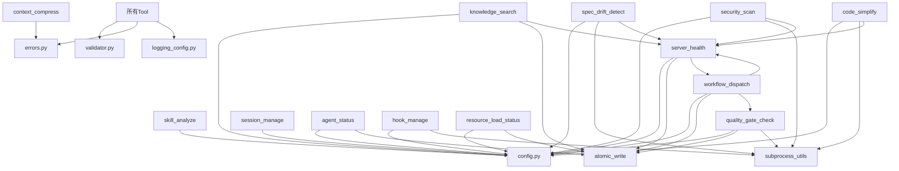

# Xuansto MCP Server v3.4.1 API规格文档

> 版本: 3.4.1 | 更新日期: 2026-05-21 | 状态: Beta

## 1. 工具完整JSON Schema

### 1.1 skill_analyze

```json
{
    "name": "skill_analyze",
    "description": "分析技能项目结构，提取YAML元数据、目录结构、Agent注册表、脚本依赖和验证问题。返回结构化分析结果，支持basic和full两种深度模式。",
    "annotations": {
        "readOnlyHint": true,
        "destructiveHint": false,
        "idempotentHint": true,
        "openWorldHint": false
    },
    "input": {
        "type": "object",
        "properties": {
            "skill_path": {"type": "string", "description": "技能根目录路径"},
            "include_scripts": {"type": "boolean", "default": true, "description": "是否分析scripts目录"},
            "include_agents": {"type": "boolean", "default": true, "description": "是否分析agents目录"},
            "depth": {"type": "string", "default": "basic", "enum": ["basic", "full"], "description": "分析深度"}
        },
        "required": ["skill_path"]
    },
    "output": {
        "error": false,
        "data": {
            "metadata": {"type": "object"},
            "structure": {"root": "str", "exists": "bool", "directories": [], "files_count": "int"},
            "agents": [{"name": "str", "layer": "str"}],
            "dependencies": {"total_scripts": "int", "by_type": {}},
            "issues": [{"type": "str", "file": "str", "severity": "str"}],
            "project_scale": {"enum": ["small", "medium", "large"]},
            "recommended_workflow": "str",
            "scale_details": {"file_count": "int", "loc_count": "int", "scale": "str", "recommended_workflow": "str", "workflow_phases": "int"}
        }
    }
}
```

### 1.2 knowledge_search

```json
{
    "name": "knowledge_search",
    "description": "三层知识库（通用/工作区/经验）混合检索引擎。支持语义搜索(ChromaDB)、关键词搜索(SQLite FTS5)和混合模式，自动降级。同时支持inject注入知识和precipitate经验沉淀。",
    "annotations": {
        "readOnlyHint": false,
        "destructiveHint": false,
        "idempotentHint": false,
        "openWorldHint": true
    },
    "input": {
        "type": "object",
        "properties": {
            "action": {"type": "string", "default": "retrieve", "enum": ["retrieve", "inject", "precipitate"]},
            "query": {"type": ["string", "null"], "description": "搜索查询文本"},
            "top_k": {"type": "integer", "default": 5, "minimum": 1, "maximum": 50},
            "search_type": {"type": "string", "default": "hybrid", "enum": ["hybrid", "semantic_only", "keyword_only"]},
            "scope": {"type": ["string", "null"], "enum": ["general", "workspace", "experience", null]},
            "min_confidence": {"type": "number", "default": 0.0, "minimum": 0.0, "maximum": 1.0},
            "content": {"type": ["string", "null"], "description": "注入的知识内容(inject时使用)"},
            "knowledge_type": {"type": "string", "default": "general", "enum": ["general", "workspace", "experience"]},
            "metadata": {"type": ["object", "null"], "description": "附加元数据(inject时使用)"},
            "pattern_ids": {"type": ["array", "null"], "items": {"type": "string"}, "description": "模式ID列表(precipitate时使用)"}
        },
        "required": []
    },
    "output_retrieve": {
        "error": false,
        "degradation_level": "chromadb|sqlite_fts5|keyword_fallback",
        "data": {
            "results": [{"source": "str", "content": "str", "match_type": "str", "relevance": "float"}],
            "total": "int",
            "strategy": "str"
        }
    },
    "output_inject": {
        "error": false,
        "data": {
            "injected_id": "str",
            "path": "str",
            "knowledge_type": "str",
            "indexed": "bool",
            "chroma_indexed": "bool"
        }
    },
    "output_precipitate": {
        "error": false,
        "data": {
            "precipitated_id": "str",
            "path": "str",
            "patterns_analyzed": "int",
            "themes_found": "int"
        }
    }
}
```

### 1.3 quality_gate_check

```json
{
    "name": "quality_gate_check",
    "description": "执行54项质量门禁检查，支持按门禁ID或开发阶段(0-8)过滤。自动映射门禁到检查脚本，返回PASS/FAIL/SKIP状态和详细结果。",
    "annotations": {
        "readOnlyHint": true,
        "destructiveHint": false,
        "idempotentHint": true,
        "openWorldHint": false
    },
    "input": {
        "type": "object",
        "properties": {
            "gate_ids": {"type": ["array", "null"], "items": {"type": "string"}, "description": "要检查的门禁ID列表"},
            "phase": {"type": ["string", "null"], "description": "按阶段过滤门禁(0-8)"},
            "project_path": {"type": "string", "default": "."},
            "severity_filter": {"type": "string", "default": "all", "enum": ["all", "BLOCK", "WARN"]},
            "force_refresh": {"type": "boolean", "default": false}
        },
        "required": []
    },
    "output": {
        "error": false,
        "data": {
            "checks": [{"gate_id": "str", "status": "PASS|FAIL|SKIP|ERROR", "source": "str", "details": {}}],
            "summary": {"total": "int", "passed": "int", "failed": "int", "skipped": "int", "blocked": "bool"},
            "cache_info": {"hit": "bool", "hit_count": "int", "miss_count": "int", "cache_age_seconds": "float"}
        }
    }
}
```

### 1.4 spec_drift_detect

```json
{
    "name": "spec_drift_detect",
    "description": "检测规格文档(spec)与代码实现(src)之间的偏差。扫描规格目录中的任务定义，对比源代码中的实际实现，报告缺失、过期或不一致的规格项。",
    "annotations": {
        "readOnlyHint": true,
        "destructiveHint": false,
        "idempotentHint": true,
        "openWorldHint": false
    },
    "input": {
        "type": "object",
        "properties": {
            "spec_dir": {"type": "string", "default": ".trae/specs"},
            "src_dir": {"type": "string", "default": "."}
        },
        "required": []
    },
    "output": {
        "error": false,
        "degradation_level": "script|inline",
        "data": {
            "total_specs": "int",
            "total_pending_tasks": "int",
            "drifts": [{"task": "str", "spec_file": "str", "has_implementation": "bool", "potential_files": []}],
            "implementation_rate": "float",
            "analysis_level": "ast|keyword_match|none",
            "interface_coverage": "float"
        }
    }
}
```

### 1.5 security_scan

```json
{
    "name": "security_scan",
    "description": "安全扫描引擎：OWASP Agentic Top 10检查 + 依赖漏洞扫描。支持严重级别过滤(critical/high/medium/low)，返回分类漏洞列表和修复建议。",
    "annotations": {
        "readOnlyHint": true,
        "destructiveHint": false,
        "idempotentHint": false,
        "openWorldHint": true
    },
    "input": {
        "type": "object",
        "properties": {
            "target": {"type": "string", "default": "."},
            "severity_threshold": {"type": "string", "default": "medium", "enum": ["critical", "high", "medium", "low"]},
            "include_agentic": {"type": "boolean", "default": true},
            "include_dependency": {"type": "boolean", "default": true}
        },
        "required": []
    },
    "output": {
        "error": false,
        "degradation_level": "none|inline",
        "data": {
            "agentic_scan": {
                "vulnerabilities": [{"type": "str", "severity": "str", "file": "str", "line": "int", "cwe_id": "str", "remediation": "str"}],
                "total": "int",
                "by_severity": {"critical": "int", "high": "int", "medium": "int", "low": "int"},
                "security_score": "int(0-100)"
            },
            "dependency_scan": {
                "dependencies": [{"name": "str", "version": "str", "status": "str", "reason": "str"}],
                "total": "int",
                "vulnerable_count": "int"
            }
        }
    }
}
```

### 1.6 code_simplify

```json
{
    "name": "code_simplify",
    "description": "代码简化分析：检测死代码、深层嵌套、过长函数和重复代码。支持文件/目录/最近修改三种扫描范围，返回简化建议和重复代码报告。",
    "annotations": {
        "readOnlyHint": true,
        "destructiveHint": false,
        "idempotentHint": true,
        "openWorldHint": false
    },
    "input": {
        "type": "object",
        "properties": {
            "target": {"type": "string", "description": "目标文件或目录路径"},
            "scope": {"type": "string", "default": "recent", "enum": ["file", "dir", "recent"]},
            "include_dedup": {"type": "boolean", "default": true}
        },
        "required": ["target"]
    },
    "output": {
        "error": false,
        "degradation_level": "full|inline|partial",
        "data": {
            "simplification": {
                "suggestions": [{"type": "str", "file": "str", "line": "int", "description": "str", "severity": "str"}],
                "total": "int",
                "by_type": {"long_function": "int", "deep_nesting": "int", "unused_import": "int", "dead_code": "int"},
                "quality_score": "int(0-100)",
                "analysis_level": "ast|text_level"
            },
            "deduplication": {
                "duplicates": [{"hash": "str", "count": "int", "files": [], "preview": "str"}],
                "total_groups": "int",
                "total_duplicate_lines": "int"
            }
        }
    }
}
```

### 1.7 session_manage

```json
{
    "name": "session_manage",
    "description": "会话状态管理：保存/加载/列出会话记录，检测重复错误模式，验证经验模式，追踪/恢复会话状态。",
    "annotations": {
        "readOnlyHint": false,
        "destructiveHint": false,
        "idempotentHint": false,
        "openWorldHint": false
    },
    "input": {
        "type": "object",
        "properties": {
            "action": {"type": "string", "enum": ["save", "load", "list", "detect", "verify", "track", "restore"]},
            "completed_tasks": {"type": ["array", "null"], "items": {"type": "string"}},
            "pending_tasks": {"type": ["array", "null"], "items": {"type": "string"}},
            "decisions": {"type": ["array", "null"], "items": {"type": "string"}},
            "experience": {"type": ["array", "null"], "items": {"type": "string"}},
            "error_log": {"type": ["array", "null"], "items": {"type": "string"}},
            "pattern_path": {"type": ["string", "null"]},
            "success": {"type": "boolean", "default": true},
            "current_phase": {"type": ["integer", "null"]},
            "current_task": {"type": ["string", "null"]}
        },
        "required": ["action"]
    },
    "output_save": {"error": false, "data": {"path": "str", "filename": "str"}},
    "output_load": {"error": false, "data": {"content": "str|null", "filename": "str"}},
    "output_list": {"error": false, "data": {"sessions": [], "total": "int"}},
    "output_detect": {"error": false, "data": {"patterns": [], "total_detected": "int"}},
    "output_verify": {"error": false, "data": {"verified": "bool", "updated_confidence": "float", "status": "str"}},
    "output_track": {"error": false, "data": {"current_phase": "int", "current_task": "str", "decisions": [], "completed_phases": []}},
    "output_restore": {"error": false, "data": {"current_phase": "int", "decisions": [], "last_session": "str|null"}}
}
```

### 1.8 workflow_dispatch

```json
{
    "name": "workflow_dispatch",
    "description": "工作流调度：启动/查询/中止/阶段推进工作流执行。支持sdd-tdd-full/medium/fast等15种工作流，返回工作流实例ID和当前状态。",
    "annotations": {
        "readOnlyHint": false,
        "destructiveHint": false,
        "idempotentHint": false,
        "openWorldHint": false
    },
    "input": {
        "type": "object",
        "properties": {
            "action": {"type": "string", "enum": ["start", "status", "abort", "phase", "recover", "snapshots"]},
            "workflow": {"type": ["string", "null"], "description": "工作流名称(start时使用)"},
            "project_path": {"type": "string", "default": "."},
            "workflow_id": {"type": ["string", "null"], "description": "工作流实例ID"},
            "phase_action": {"type": ["string", "null"], "enum": ["advance", "current", null]},
            "snapshot_phase": {"type": ["integer", "null"], "description": "恢复到指定阶段快照"}
        },
        "required": ["action"]
    },
    "output_start": {"error": false, "data": {"workflow_id": "str", "workflow": "str", "status": "running", "current_phase": 0}},
    "output_status": {"error": false, "data": {"workflow_id": "str", "status": "str", "current_phase": "int"}},
    "output_abort": {"error": false, "data": {"workflow_id": "str", "status": "aborted"}},
    "output_phase_advance": {"error": false, "data": {"workflow_id": "str", "advanced": "bool", "gates_passed": "bool", "gates_checked": []}},
    "output_recover": {"error": false, "data": {"workflow_id": "str", "recovered_phase": "int", "snapshot_time": "str"}},
    "output_snapshots": {"error": false, "data": {"snapshots": [], "total": "int"}}
}
```

### 1.9 agent_status

```json
{
    "name": "agent_status",
    "description": "Agent状态查询：列出全部57个Agent、按Phase查询活跃Agent、查询单个Agent详情、调度Agent(schedule规划中)。",
    "annotations": {
        "readOnlyHint": true,
        "destructiveHint": false,
        "idempotentHint": true,
        "openWorldHint": false
    },
    "input": {
        "type": "object",
        "properties": {
            "action": {"type": "string", "enum": ["list", "by_phase", "detail", "create", "match", "assign", "instance_status", "destroy", "schedule"]},
            "phase": {"type": ["integer", "null"], "minimum": 0, "maximum": 8},
            "agent_name": {"type": ["string", "null"]},
            "agent_type": {"type": ["string", "null"]},
            "capabilities": {"type": ["array", "null"], "items": {"type": "string"}},
            "agent_id": {"type": ["string", "null"]},
            "task": {"type": ["string", "null"]}
        },
        "required": ["action"]
    },
    "output_list": {"error": false, "data": {"agents": [], "total": "int"}},
    "output_by_phase": {"error": false, "data": {"phase": "int", "agents": [], "total": "int"}},
    "output_detail": {"error": false, "data": {"name": "str", "file": "str", "content_length": "int"}},
    "output_create": {"error": false, "data": {"agent_id": "str", "agent_type": "str", "capabilities": [], "status": "idle"}},
    "output_match": {"error": false, "data": {"required_capabilities": [], "matches": [], "total": "int"}},
    "output_assign": {"error": false, "data": {"agent_id": "str", "task": "str", "status": "busy"}}
}
```

### 1.10 hook_manage

```json
{
    "name": "hook_manage",
    "description": "Hook管理：列出指定profile的Hook配置，执行指定Hook。支持minimal/standard/strict三种配置级别，16个Hook。",
    "annotations": {
        "readOnlyHint": false,
        "destructiveHint": false,
        "idempotentHint": false,
        "openWorldHint": false
    },
    "input": {
        "type": "object",
        "properties": {
            "action": {"type": "string", "enum": ["list", "execute"]},
            "profile": {"type": "string", "default": "standard", "enum": ["minimal", "standard", "strict"]},
            "hook_name": {"type": ["string", "null"]},
            "context": {"type": ["object", "null"]}
        },
        "required": ["action"]
    },
    "output_list": {"error": false, "data": {"profile": "str", "hooks": [{"name": "str", "has_script": "bool", "has_inline_logic": "bool"}], "total": "int"}},
    "output_execute": {"error": false, "data": {"hook": "str", "status": "pass|block|warn|executed|skipped", "message": "str", "details": {}}}
}
```

### 1.11 resource_load_status

```json
{
    "name": "resource_load_status",
    "description": "渐进式加载状态管理：查询指定Phase的资源加载状态，预加载指定Phase的资源。",
    "annotations": {
        "readOnlyHint": true,
        "destructiveHint": false,
        "idempotentHint": true,
        "openWorldHint": false
    },
    "input": {
        "type": "object",
        "properties": {
            "action": {"type": "string", "enum": ["status", "preload", "cache", "clear_cache"]},
            "phase": {"type": ["integer", "null"], "minimum": 0, "maximum": 8},
            "resource_ids": {"type": ["array", "null"], "items": {"type": "string"}},
            "resource_uris": {"type": ["array", "null"], "items": {"type": "string"}}
        },
        "required": ["action"]
    },
    "output_status": {"error": false, "data": {"resources": [{"id": "str", "type": "str", "path": "str", "status": "loaded|available|missing|stale|expired"}], "total": "int", "loaded": "int", "stale": "int", "expired": "int"}},
    "output_preload": {"error": false, "data": {"phase": "int", "preloaded": [], "total": "int"}},
    "output_cache": {"error": false, "data": {"cached_uris": [], "cache_size": "int", "total_entries": "int", "expired_entries": "int", "stale_entries": "int"}},
    "output_clear_cache": {"error": false, "data": {"cleared_entries": "int", "expired_entries": "int"}}
}
```

### 1.12 context_compress

```json
{
    "name": "context_compress",
    "description": "上下文压缩：支持semantic(语义保留)/selective(选择性采样)/lossless(无损截断)三种策略。保留指定章节，压缩其余内容至目标Token数。",
    "annotations": {
        "readOnlyHint": true,
        "destructiveHint": false,
        "idempotentHint": true,
        "openWorldHint": false
    },
    "input": {
        "type": "object",
        "properties": {
            "content": {"type": "string", "description": "待压缩的文本内容"},
            "strategy": {"type": "string", "default": "semantic", "enum": ["semantic", "selective", "lossless"]},
            "target_tokens": {"type": "integer", "default": 2000, "minimum": 100, "maximum": 50000},
            "preserve_sections": {"type": ["array", "null"], "items": {"type": "string"}}
        },
        "required": ["content"]
    },
    "output": {
        "error": false,
        "data": {
            "compressed": "str",
            "original_tokens": "int",
            "compressed_tokens": "int",
            "compression_ratio": "float",
            "strategy": "str"
        }
    }
}
```

### 1.13 server_health

```json
{
    "name": "server_health",
    "description": "MCP Server 健康检查：返回服务器状态、版本、运行时间、配置路径和工具统计。",
    "annotations": {
        "readOnlyHint": true,
        "destructiveHint": false,
        "idempotentHint": true,
        "openWorldHint": false
    },
    "input": {
        "type": "object",
        "properties": {},
        "required": []
    },
    "output": {
        "error": false,
        "data": {
            "status": "healthy",
            "version": "3.4.1",
            "uptime_seconds": "float",
            "tools_count": "int",
            "resources_count": "int",
            "active_workflows": "int",
            "snapshot_cleanup": {"workflows_checked": "int", "total_deleted": "int", "total_remaining": "int"},
            "degradation_stats": {"tool_name": "int"},
            "performance_metrics": {"tool_name": {"call_count": "int", "error_count": "int", "error_rate": "float", "latency_p50_ms": "float", "latency_p95_ms": "float", "latency_p99_ms": "float"}},
            "services": {"chromadb": {"available": "bool", "latency_ms": "float"}},
            "config": {"data_dir": "str", "skill_root": "str", "work_dir": "str"}
        }
    }
}
```

## 2. 接口依赖拓扑



## 3. 重构后API设计

### 3.1 目标改进

| 改进项 | 当前 | 目标 |
|--------|------|------|
| 统一错误码 | 分散在各工具 | 集中在errors.py |
| 版本化API | 无版本 | v1前缀 |
| 批量操作 | 逐个调用 | 批量门禁检查 |
| 流式响应 | 一次性返回 | 大结果分页 |
| 事件通知 | 无 | 工具完成通知 |

### 3.2 建议新增API

| API | 描述 | 优先级 |
|-----|------|--------|
| batch_gate_check | 批量门禁检查(多项目) | 中 |
| knowledge_sync | 知识库同步(增量) | 中 |
| agent_schedule | Agent自动调度 | 高 |
| token_budget_status | Token预算状态查询 | 高 |
| workflow_template_list | 工作流模板列表 | 低 |

## 4. 契约规格

### 4.1 请求契约

| 规则 | 描述 |
|------|------|
| Content-Type | application/json |
| 参数校验 | Pydantic模型 strict模式 |
| 额外字段 | 拒绝 (extra="forbid") |
| 默认值 | 所有可选参数有默认值 |
| 类型强制 | Pydantic自动类型转换 |

### 4.2 响应契约

```json
{
    "error": false,
    "data": {},
    "degradation_level": "chromadb|sqlite_fts5|keyword_fallback|inline|none"
}
```

```json
{
    "error": true,
    "code": "ERROR_CODE",
    "message": "错误描述",
    "details": {}
}
```

### 4.3 错误码体系

| 错误码 | HTTP等价 | 描述 |
|--------|----------|------|
| PATH_NOT_FOUND | 404 | 路径不存在 |
| SCRIPT_EXECUTION_ERROR | 500 | 脚本执行失败 |
| DEGRADATION | 503 | 服务降级 |
| VALIDATION_ERROR | 400 | 参数校验失败 |
| TOOL_NOT_FOUND | 404 | 工具不存在 |
| INVALID_JSON | 400 | JSON解析失败 |
| EXECUTION_ERROR | 500 | 执行错误 |
| TIMEOUT | 408 | 执行超时 |
| SCRIPT_NOT_FOUND | 404 | 脚本不存在 |
| PYTHON_NOT_FOUND | 500 | Python解释器未找到 |
| YAML_PARSE_ERROR | 400 | YAML解析失败 |
| WORKFLOW_NOT_FOUND | 404 | 工作流不存在 |
| RECOVER_FAILED | 500 | 快照恢复失败 |
| NOT_FOUND | 404 | 资源不存在 |
| AGENT_BUSY | 409 | Agent忙碌 |

## 5. 错误处理与重试策略

### 5.1 当前错误处理

| 层级 | 处理方式 | 示例 |
|------|----------|------|
| Pydantic校验 | 返回VALIDATION_ERROR | validate_input() |
| 路径检查 | 返回PATH_NOT_FOUND | PathNotFoundError |
| 脚本执行 | 降级到inline | run_script() → _inline_*() |
| ChromaDB不可用 | 降级到SQLite | _chromadb_search() → None |
| SQLite不可用 | 降级到keyword | _sqlite_search() → None |
| Hook异常 | 记录错误继续执行 | hook_errors列表 |
| 工具异常 | 记录指标并抛出 | record_tool_call(failed) + raise |

### 5.2 建议重试策略

| 场景 | 策略 | 最大重试 | 退避 |
|------|------|----------|------|
| ChromaDB连接失败 | 指数退避 | 3 | 1s, 2s, 4s |
| SQLite锁冲突 | 固定间隔 | 3 | 0.1s |
| 脚本执行超时 | 不重试(降级) | 0 | - |
| 文件写入冲突 | 固定间隔 | 2 | 0.5s |
| 网络请求(知识库服务) | 指数退避 | 3 | 1s, 2s, 4s |
