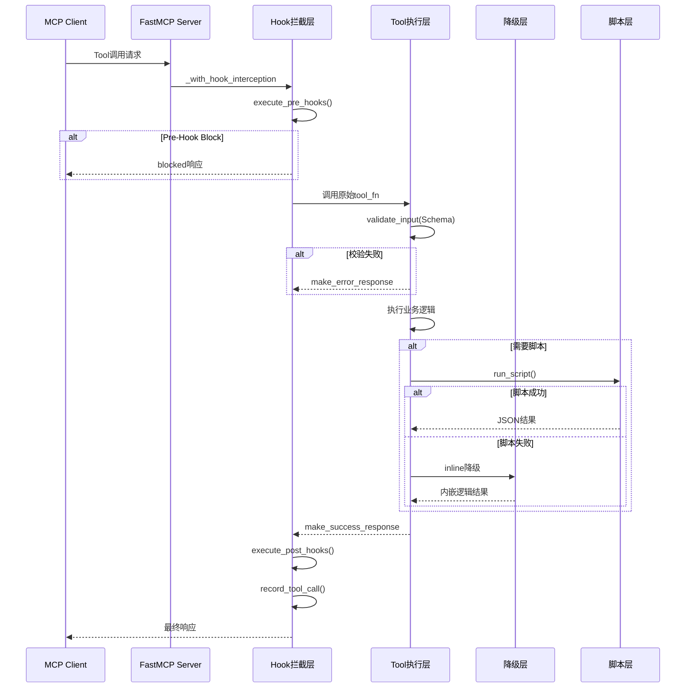
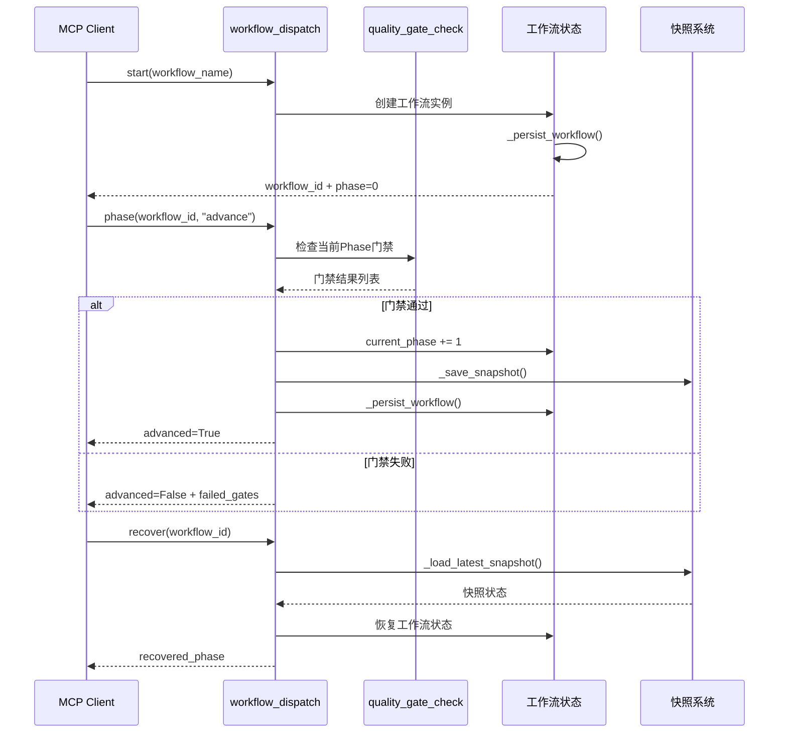
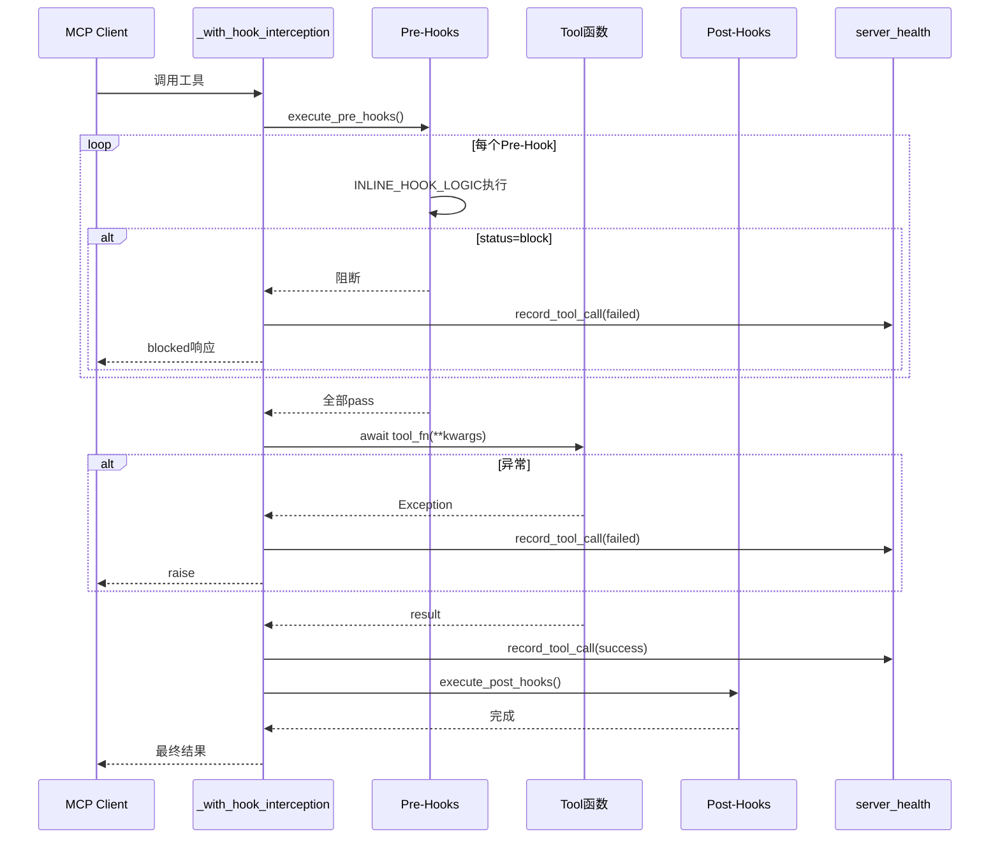

# Xuansto MCP Server v3.4.1 架构文档

> 版本: 3.4.1 | 更新日期: 2026-05-21 | 状态: Beta

## 1. 项目概述

Xuansto MCP Server 是一个基于 MCP (Model Context Protocol) 的多Agent自主开发编排引擎。它通过13个原子化工具和6个资源端点，为AI Agent提供SDD+TDD融合的全生命周期开发支持，涵盖需求分析、架构设计、测试先行、代码实现、质量门禁、安全扫描、持续重构和部署交付9个阶段。

### 核心定位

| 维度 | 描述 |
|------|------|
| 协议层 | MCP Server (stdio transport) |
| 工具数 | 13 Tools + 6 Resources |
| Agent数 | 57个预定义Agent (9层) |
| 门禁数 | 60个质量门禁ID |
| 工作流 | 9阶段 SDD-TDD 融合流程 |
| 降级链 | 3级降级 (script → inline → keyword) |

## 2. 目录结构

```
xuansto-mcp-server/
├── src/xuansto_mcp/
│   ├── __init__.py              # 版本号 3.4.1
│   ├── server.py                # MCP Server 入口 + Hook拦截 + 启动流程
│   ├── cli.py                   # CLI工具 (health/invoke/gate/workflow/session/agent)
│   ├── core/
│   │   ├── __init__.py          # atomic_write() 原子写入工具
│   │   ├── config.py            # 配置管理 + 路径常量 + 配置热重载
│   │   ├── degradation.py       # 13工具降级映射表 FALLBACK_MAP
│   │   ├── errors.py            # 异常体系 + 响应构造
│   │   ├── logging_config.py    # 日志配置
│   │   ├── subprocess_utils.py  # 子进程脚本执行
│   │   └── validator.py         # Pydantic参数校验
│   ├── models/
│   │   ├── __init__.py
│   │   └── schemas.py           # 13个Pydantic输入模型
│   ├── tools/
│   │   ├── __init__.py          # 工具模块导出
│   │   ├── skill_analyze.py     # 技能结构分析
│   │   ├── knowledge_search.py  # 三层知识库混合检索
│   │   ├── quality_gate_check.py# 60项质量门禁检查
│   │   ├── spec_drift_detect.py # 规格偏差检测
│   │   ├── security_scan.py     # OWASP安全扫描
│   │   ├── code_simplify.py     # 代码简化分析
│   │   ├── session_manage.py    # 会话状态管理
│   │   ├── workflow_dispatch.py # 工作流调度
│   │   ├── agent_status.py      # Agent状态管理
│   │   ├── hook_manage.py       # Hook管理 + 拦截逻辑
│   │   ├── resource_load_status.py # 渐进式资源加载
│   │   ├── context_compress.py  # 上下文压缩
│   │   └── server_health.py     # 健康检查 + 性能指标
│   ├── resources/
│   │   ├── __init__.py
│   │   └── skill_resources.py   # 6个MCP Resource定义
│   └── data/
│       ├── .skill-config.yaml   # Skill配置 (token预算/降级/加载策略)
│       ├── .xuansto-config.yaml # 运行时配置覆盖
│       ├── agents/              # 57个Agent定义 (12分类)
│       ├── hooks/
│       │   └── hooks.json       # Hook配置 (3 profile × 5 生命周期)
│       ├── knowledge/           # 三层知识库
│       │   ├── general/         # 通用知识
│       │   ├── workspace/       # 工作区知识
│       │   └── experience/      # 经验沉淀
│       ├── references/          # 100+参考文档
│       │   └── agent-details/   # 57个Agent详情
│       └── scripts/             # 60+辅助脚本
│           ├── knowledge_server/ # 知识库服务子模块
│           ├── verification/    # 验证脚本
│           └── workflow-tools/  # 工作流工具
├── pyproject.toml
└── .github/workflows/ci.yml
```

## 3. 开发与设计原则

| 原则 | 描述 | 体现 |
|------|------|------|
| 原子化工具 | 每个Tool单一职责，可独立降级 | 13个独立Tool模块 |
| 三级降级 | script → inline → keyword_fallback | FALLBACK_MAP + degradation.py |
| 原子写入 | 所有文件写入使用atomic_write防止损坏 | core/__init__.py (N31) |
| 线程安全 | 共享状态使用Lock保护 | _config_lock, _workflows_lock, _agents_lock, _cache_lock, _metrics_lock |
| Pydantic校验 | 所有输入参数使用Pydantic模型验证 | 13个Input Schema |
| 渐进式加载 | 按Phase加载资源，避免一次性全量 | resource_load_status + PHASE_RESOURCE_MAP |
| Hook拦截 | Pre/Post Hook拦截工具调用 | _with_hook_interception + INLINE_HOOK_LOGIC |
| 配置热重载 | 运行时配置变更自动生效 | _config_watcher + SIGHUP |

## 4. 当前架构层次

### 4.1 四层架构

```
┌─────────────────────────────────────────────────┐
│                 Skill Layer                      │
│  SKILL.md + .skill-config.yaml + Agent定义       │
│  触发条件 / 参数 / 提示词 / 脚本映射              │
├─────────────────────────────────────────────────┤
│               Execution Layer                    │
│  13 Tools + 6 Resources + Hook拦截              │
│  工作流调度 / 质量门禁 / 降级链                   │
├─────────────────────────────────────────────────┤
│               Resource Layer                     │
│  知识库(3层) + 参考文档(100+) + 脚本(60+)        │
│  SQLite FTS5 + ChromaDB + 文件系统               │
├─────────────────────────────────────────────────┤
│              Dependency Layer                    │
│  MCP SDK + Pydantic + PyYAML + ChromaDB(opt)    │
│  subprocess + threading + sqlite3               │
└─────────────────────────────────────────────────┘
```

### 4.2 各层职责

| 层次 | 职责 | 关键文件 |
|------|------|----------|
| Skill Layer | 定义技能触发条件、Agent能力、工作流模板 | data/agents/, data/.skill-config.yaml, data/references/ |
| Execution Layer | 工具注册、参数校验、降级执行、Hook拦截 | tools/*.py, server.py, core/degradation.py |
| Resource Layer | 知识检索、参考文档加载、脚本执行 | data/knowledge/, data/scripts/, data/references/ |
| Dependency Layer | MCP协议通信、数据校验、持久化 | mcp SDK, pydantic, sqlite3, chromadb |

## 5. 调用流程图

### 5.1 主调用流程



### 5.2 工作流调度流程



### 5.3 Hook拦截流程



## 6. 目标架构 (MCP Server + 渐进式加载)

```
┌──────────────────────────────────────────────────────────┐
│                    MCP Server (stdio)                     │
├──────────────────────────────────────────────────────────┤
│  Tool Registry (13 Tools)                                │
│  ┌──────────┐ ┌──────────┐ ┌──────────┐ ┌──────────┐   │
│  │skill_    │ │knowledge_│ │quality_  │ │spec_     │   │
│  │analyze   │ │search    │ │gate_check│ │drift     │   │
│  └──────────┘ └──────────┘ └──────────┘ └──────────┘   │
│  ┌──────────┐ ┌──────────┐ ┌──────────┐ ┌──────────┐   │
│  │security_ │ │code_     │ │session_  │ │workflow_ │   │
│  │scan      │ │simplify  │ │manage    │ │dispatch  │   │
│  └──────────┘ └──────────┘ └──────────┘ └──────────┘   │
│  ┌──────────┐ ┌──────────┐ ┌──────────┐ ┌──────────┐   │
│  │agent_    │ │hook_     │ │resource_ │ │context_  │   │
│  │status    │ │manage    │ │load      │ │compress  │   │
│  └──────────┘ └──────────┘ └──────────┘ └──────────┘   │
│  ┌──────────┐                                           │
│  │server_   │                                           │
│  │health    │                                           │
│  └──────────┘                                           │
├──────────────────────────────────────────────────────────┤
│  Resource Registry (6 Resources)                         │
│  xuansto://config/skill                                  │
│  xuansto://references/quality-gates                      │
│  xuansto://references/agent-registry                     │
│  xuansto://references/workflow-phases                    │
│  xuansto://templates/{name}                              │
│  xuansto://sessions/latest                               │
├──────────────────────────────────────────────────────────┤
│  Progressive Loading Engine                              │
│  Phase 0 → Phase 8 按需加载资源                           │
│  TTL缓存 + Hash校验 + 自动过期清理                        │
├──────────────────────────────────────────────────────────┤
│  Degradation Chain                                       │
│  Script → Inline → Keyword Fallback                      │
│  ChromaDB → SQLite FTS5 → File Scan                      │
├──────────────────────────────────────────────────────────┤
│  Hook Interception Layer                                 │
│  Pre-Hook (security-block, token-budget, ...)            │
│  Post-Hook (auto-format, decision-log, ...)              │
└──────────────────────────────────────────────────────────┘
```

## 7. 架构差异分析

### 7.1 已完成项 (25项 ✅)

| 编号 | 描述 | v3.4.1实现 |
|------|------|-----------|
| N1 | MCP Server基础架构 | FastMCP + stdio transport |
| N2 | 13个原子化工具 | tools/*.py 独立模块 |
| N3 | Pydantic参数校验 | 13个Input Schema + validate_input() |
| N4 | 三级降级链 | FALLBACK_MAP + inline逻辑 |
| N5 | Hook拦截系统 | _with_hook_interception + INLINE_HOOK_LOGIC |
| N8 | 工作流调度 | workflow_dispatch + 9阶段 + 快照恢复 |
| N9 | 质量门禁系统 | 60个门禁ID + INLINE_CHECKS + 缓存 |
| N10 | 知识库三层检索 | ChromaDB → SQLite FTS5 → keyword |
| N11 | Agent状态管理 | 57个Agent + create/match/assign/destroy |
| N12 | 会话持久化 | session_manage + current.json + restore |
| N17 | CLI工具 | health/invoke/gate/workflow/session/agent |
| N18 | 配置热重载 | _config_watcher + SIGHUP |
| N19 | 资源渐进式加载 | PHASE_RESOURCE_MAP + TTL缓存 |
| N20 | 上下文压缩 | semantic/selective/lossless三种策略 |
| N21 | 健康检查+指标 | server_health + 性能指标 + 降级统计 |
| N24 | 原子写入工具 | atomic_write() (N31扩展到7处) |
| N25 | 错误体系 | XuanstoMCPError + 4个子类 + make_*_response |
| N27 | 门禁缓存 | file_hash_cache + gate_cache.json |
| N28 | 快照清理 | TTL + max_snapshots + _cleanup_snapshots() |
| N31 | write_text→atomic_write | 7处替换 (knowledge_search/workflow/agent/resource/health/quality_gate) |
| N32 | SQLite连接try/finally | _ensure_knowledge_index() + _sqlite_search() |
| N33 | CLI使用_REGISTERED_TOOL_NAMES | cli.py不再依赖mcp._tool_manager._tools |
| N34 | keyword搜索1MB限制 | _MAX_KEYWORD_FILE_BYTES = 1MB |
| N35 | config reload线程锁 | _config_lock = threading.Lock() |

### 7.2 待完成项 (10项)

| 编号 | 描述 | 优先级 | 影响范围 | 风险 |
|------|------|--------|----------|------|
| N6 | 工具间依赖解耦 | 高 | tools/ 全部 | 当前存在循环import (spec_drift→server_health) |
| N7 | 统一事件总线 | 中 | 全局 | 工具间通信依赖直接import |
| N13 | 知识库服务独立部署 | 中 | knowledge_server/ | 当前嵌入data/scripts/ |
| N14 | Agent调度引擎 | 高 | agent_status.py | schedule操作仅返回planned |
| N15 | Token预算执行器 | 高 | hook_manage.py | token-budget-check无脚本无inline |
| N16 | 模型路由实现 | 中 | config.py | model_routing仅配置未实现 |
| N23 | 测试覆盖 | 高 | tests/ | 当前无测试文件 |
| N26 | CI/CD流水线完善 | 中 | .github/ | ci.yml存在但待完善 |
| N29 | 资源URI标准化 | 低 | resources/ | 当前5个固定URI + 1个模板 |
| N30 | 多项目隔离 | 中 | config.py | WORK_DIR全局共享 |

## 8. 风险与约束

### 8.1 技术风险

| 风险 | 等级 | 描述 | 缓解措施 |
|------|------|------|----------|
| 循环依赖 | 高 | spec_drift_detect→server_health, security_scan→server_health | N6解耦 |
| 全局状态 | 中 | _ACTIVE_WORKFLOWS, _AGENT_INSTANCES等全局字典 | 线程Lock保护 |
| ChromaDB可选 | 中 | 语义搜索降级为FTS5 | 三级降级链 |
| subprocess超时 | 低 | 脚本执行默认30-120s超时 | timeout参数控制 |
| 文件锁竞争 | 低 | atomic_write使用os.replace | 原子操作无竞争 |

### 8.2 约束

| 约束 | 描述 |
|------|------|
| Python >= 3.10 | 使用 `from __future__ import annotations` 和 `X \| Y` 语法 |
| stdio transport | MCP通信仅支持stdio，不支持SSE |
| 单进程 | 无多进程/分布式支持 |
| 文件系统依赖 | 知识库/会话/工作流状态均存储在文件系统 |
| ChromaDB可选 | 语义搜索需要额外安装chromadb |

### 8.3 性能约束

| 指标 | 当前值 | 目标 |
|------|--------|------|
| 门禁缓存命中 | 文件哈希比对 | 增量比对 |
| 资源缓存TTL | 3600s | 可配置 |
| 指标持久化间隔 | 60s / 100次调用 | 可配置 |
| 快照最大数 | 20/workflow | 可配置 |
| 关键词搜索文件限制 | 1MB/文件 | N34 |
