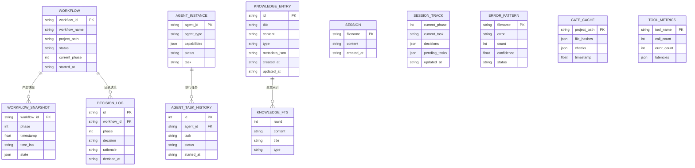

# Xuansto MCP Server v3.4.1 数据库设计文档

> 版本: 3.4.1 | 更新日期: 2026-05-21 | 状态: Beta

## 1. 当前数据存储分析

Xuansto MCP Server 使用四种存储方式：内存、文件系统、SQLite和ChromaDB。

| 存储类型 | 用途 | 持久性 | 并发安全 |
|----------|------|--------|----------|
| 内存 (dict) | 运行时状态缓存 | 进程重启丢失 | threading.Lock |
| 文件系统 (JSON/MD/YAML) | 配置/会话/工作流/快照 | 持久 | atomic_write |
| SQLite (FTS5) | 知识库索引 + 全文搜索 | 持久 | try/finally连接管理 |
| ChromaDB | 语义向量搜索 | 持久 | PersistentClient |

## 2. 持久化数据实体

### 2.1 完整实体清单

| # | 实体名 | 存储方式 | 路径 | 格式 | 典型大小 |
|---|--------|----------|------|------|----------|
| 1 | Skill配置 | 文件 | data/.skill-config.yaml | YAML | ~4KB |
| 2 | 运行时配置覆盖 | 文件 | data/.xuansto-config.yaml | YAML | ~0.2KB |
| 3 | Hook配置 | 文件 | data/hooks/hooks.json | JSON | ~5KB |
| 4 | 知识库SQLite | SQLite | data/knowledge/index/knowledge.db | SQLite+FTS5 | 1-50MB |
| 5 | 知识库ChromaDB | ChromaDB | data/knowledge/index/chroma_db/ | 向量数据库 | 10-200MB |
| 6 | 通用知识文档 | 文件 | data/knowledge/general/**/*.md | Markdown | 0.5-5KB/文件 |
| 7 | 工作区知识文档 | 文件 | data/knowledge/workspace/**/*.md | Markdown | 1-10KB/文件 |
| 8 | 经验沉淀文档 | 文件 | data/knowledge/experience/**/*.md | Markdown | 0.5-5KB/文件 |
| 9 | 注入知识文档 | 文件 | data/knowledge/{type}/injected-*.md | Markdown+YAML Frontmatter | 0.5-10KB |
| 10 | 沉淀经验文档 | 文件 | data/knowledge/experience/precipitated-*.md | Markdown | 1-10KB |
| 11 | 会话记录 | 文件 | .xuansto/sessions/session-*.md | Markdown | 1-20KB |
| 12 | 会话追踪状态 | 文件 | .xuansto/sessions/current.json | JSON | 0.5-2KB |
| 13 | 错误模式 | 文件 | .xuansto/patterns/pattern-*.json | JSON | 0.2-1KB |
| 14 | 工作流实例 | 文件 | .xuansto/workflows/{workflow_id}.json | JSON | 1-10KB |
| 15 | 工作流活跃状态 | 文件 | .xuansto/workflow_states.json | JSON | 1-50KB |
| 16 | 工作流快照 | 文件 | {project}/.xuansto/workflow_snapshots/{wf}_phase{n}_{ts}.json | JSON | 2-20KB |
| 17 | Agent实例 | 文件 | .xuansto/agent_instances.json | JSON | 1-50KB |
| 18 | 门禁缓存 | 文件 | {project}/.xuansto/gate_cache.json | JSON | 10-500KB |
| 19 | 文件哈希缓存 | 文件 | data/.xuansto/file_hashes.json | JSON | 50KB-5MB |
| 20 | 工具性能指标 | 文件 | .xuansto/tool_metrics.json | JSON | 1-20KB |
| 21 | 降级统计 | 文件 | .xuansto/degradation_stats.json | JSON | 0.2-2KB |
| 22 | 资源加载状态 | 文件 | .xuansto/resource_state.json | JSON | 0.5-2KB |

### 2.2 内存数据实体

| # | 实体名 | 变量名 | 所在模块 | 生命周期 |
|---|--------|--------|----------|----------|
| 1 | 注册工具名列表 | `_REGISTERED_TOOL_NAMES` | server.py | 进程级 |
| 2 | 工具注册表 | `_TOOL_REGISTRY` | server.py | 进程级 |
| 3 | 活跃工作流 | `_ACTIVE_WORKFLOWS` | workflow_dispatch.py | 进程级+持久化 |
| 4 | Agent实例 | `_AGENT_INSTANCES` | agent_status.py | 进程级+持久化 |
| 5 | 工具指标 | `_TOOL_METRICS` | server_health.py | 进程级+持久化 |
| 6 | 降级计数 | `_DEGRADATION_COUNTS` | server_health.py | 进程级+持久化 |
| 7 | 资源缓存 | `_RESOURCE_CACHE` | resource_load_status.py | 进程级+TTL |
| 8 | 已加载资源 | `_loaded_resources` | resource_load_status.py | 进程级+持久化 |
| 9 | 文件哈希缓存 | `_file_hash_cache` | quality_gate_check.py | 进程级+持久化 |
| 10 | 文件mtime缓存 | `_file_mtime_cache` | quality_gate_check.py | 进程级+持久化 |
| 11 | 恢复的会话状态 | `_RESTORED_STATE` | session_manage.py | 进程级 |

## 3. 数据结构示例

### 3.1 SQLite 知识库表结构

```sql
CREATE TABLE knowledge_entries (
    id TEXT PRIMARY KEY,
    title TEXT NOT NULL,
    content TEXT NOT NULL,
    type TEXT NOT NULL DEFAULT 'general',
    metadata_json TEXT DEFAULT '{}',
    created_at TEXT NOT NULL,
    updated_at TEXT NOT NULL
);

CREATE VIRTUAL TABLE knowledge_fts
    USING fts5(
        content, title, type,
        content=knowledge_entries,
        content_rowid=rowid,
        tokenize='unicode61'
    );

CREATE TRIGGER knowledge_ai AFTER INSERT ON knowledge_entries BEGIN
    INSERT INTO knowledge_fts(rowid, content, title, type)
        VALUES (new.rowid, new.content, new.title, new.type);
END;

CREATE TRIGGER knowledge_ad AFTER DELETE ON knowledge_entries BEGIN
    INSERT INTO knowledge_fts(knowledge_fts, rowid, content, title, type)
        VALUES('delete', old.rowid, old.content, old.title, old.type);
END;

CREATE TRIGGER knowledge_au AFTER UPDATE ON knowledge_entries BEGIN
    INSERT INTO knowledge_fts(knowledge_fts, rowid, content, title, type)
        VALUES('delete', old.rowid, old.content, old.title, old.type);
    INSERT INTO knowledge_fts(rowid, content, title, type)
        VALUES (new.rowid, new.content, new.title, new.type);
END;
```

### 3.2 工作流实例 JSON

```json
{
    "workflow_id": "wf-a1b2c3d4",
    "workflow": "sdd-tdd-full",
    "project_path": "/path/to/project",
    "status": "running",
    "current_phase": 4,
    "started_at": "2026-05-21T09:00:00+00:00",
    "completed_phases": [0, 1, 2, 3],
    "phase_definitions": [
        {"id": 0, "name": "初始化", "gates": ["DESIGN-SYSTEM-COMPLETE"]},
        {"id": 1, "name": "需求分析", "gates": ["BRAINSTORM-COMPLETE"]}
    ]
}
```

### 3.3 工作流快照 JSON

```json
{
    "workflow_id": "wf-a1b2c3d4",
    "phase": 4,
    "timestamp": 1716278400.0,
    "time_iso": "2026-05-21T10:00:00",
    "state": {
        "workflow_id": "wf-a1b2c3d4",
        "workflow": "sdd-tdd-full",
        "current_phase": 4,
        "status": "running",
        "completed_phases": [0, 1, 2, 3]
    }
}
```

### 3.4 Agent实例 JSON

```json
{
    "agent-abc12345": {
        "agent_id": "agent-abc12345",
        "agent_type": "backend-developer",
        "capabilities": ["python", "api-design", "database"],
        "status": "busy",
        "task": "实现用户认证模块",
        "created_at": 1716278400.0,
        "history": [
            {"action": "assign", "task": "实现用户认证模块", "timestamp": 1716278500.0}
        ]
    }
}
```

### 3.5 门禁缓存 JSON

```json
{
    "file_hashes": {
        "src/main.py": "sha256:abc123...",
        "src/utils.py": "sha256:def456..."
    },
    "checks": [
        {
            "gate_id": "GATE-007",
            "status": "PASS",
            "source": "inline",
            "details": {"message": "未发现编码问题", "files_scanned": 42}
        }
    ],
    "timestamp": 1716278400.0
}
```

### 3.6 会话追踪状态 JSON

```json
{
    "current_phase": 4,
    "current_task": "实现用户认证API",
    "decisions": ["使用JWT认证", "密码bcrypt加密"],
    "pending_tasks": ["编写单元测试", "API文档"],
    "completed_phases": [0, 1, 2, 3],
    "timestamp": "2026-05-21T09:00:00",
    "updated_at": "2026-05-21T10:30:00"
}
```

### 3.7 错误模式 JSON

```json
{
    "error": "ModuleNotFoundError: No module named 'chromadb'",
    "count": 3,
    "confidence": 0.40,
    "status": "draft",
    "created_at": "2026-05-21T10:00:00",
    "verified": false
}
```

### 3.8 注入知识 Markdown

```markdown
---
type: injected
knowledge_type: general
injected_at: 20260521T100000Z
metadata: {"source": "user", "priority": "high"}
---
用户提供的知识内容...
```

### 3.9 工具性能指标 JSON

```json
{
    "knowledge_search": {
        "call_count": 150,
        "error_count": 3,
        "latencies": [45.2, 52.1, 38.7, ...]
    },
    "quality_gate_check": {
        "call_count": 80,
        "error_count": 0,
        "latencies": [1200.5, 980.3, ...]
    }
}
```

## 4. 数据生命周期

### 4.1 CRUD时序

| 实体 | Create | Read | Update | Delete | 触发条件 |
|------|--------|------|--------|--------|----------|
| knowledge_entries | inject操作 | retrieve操作 | inject(upsert) | 无 | knowledge_search |
| knowledge_fts | 触发器自动 | MATCH查询 | 触发器自动 | 触发器自动 | knowledge_search |
| session-*.md | save操作 | load操作 | 无 | _cleanup_old_sessions(max=10) | session_manage |
| current.json | track操作 | restore操作 | track操作 | 无 | session_manage |
| pattern-*.json | detect操作 | verify操作 | verify操作 | 无 | session_manage |
| workflow实例 | start操作 | status操作 | advance/recover | abort | workflow_dispatch |
| workflow_states.json | 首次persist | load_on_startup | 每次状态变更 | 无 | workflow_dispatch |
| workflow快照 | advance成功后 | recover操作 | 无 | _cleanup_snapshots(TTL+max) | workflow_dispatch |
| agent_instances.json | create操作 | list/match | assign/destroy | destroy | agent_status |
| gate_cache.json | 首次检查 | 后续检查 | 文件变更时 | force_refresh | quality_gate_check |
| file_hashes.json | 首次哈希计算 | 缓存命中 | 文件变更 | force_refresh | quality_gate_check |
| tool_metrics.json | 首次工具调用 | server_health | 每次工具调用 | 无 | record_tool_call |
| degradation_stats.json | 首次降级 | server_health | 每次降级 | ChromaDB恢复时清零 | track_degradation |
| resource_state.json | 首次preload | status操作 | preload操作 | 无 | resource_load_status |
| _RESOURCE_CACHE | preload操作 | cache操作 | TTL过期重建 | clear_cache | resource_load_status |

### 4.2 启动加载顺序

```
1. setup_logging()
2. start_config_watcher()        → 加载.xuansto-config.yaml
3. restore_on_startup()          → 加载sessions/current.json → _RESTORED_STATE
4. workflow_load_on_startup()    → 加载workflows/*.json → _ACTIVE_WORKFLOWS
5. agent_load_on_startup()       → 加载agent_instances.json → _AGENT_INSTANCES
6. health_load_on_startup()      → 加载tool_metrics.json + degradation_stats.json
7. mcp.run(transport="stdio")    → 启动MCP服务
```

## 5. 重构后数据模型设计

### 5.1 目标数据架构

```
┌─────────────────────────────────────────────┐
│              统一数据访问层 (DAL)             │
├──────────┬──────────┬──────────┬────────────┤
│ SQLite   │ ChromaDB │ 文件系统  │ 内存缓存    │
│ 知识索引  │ 向量索引  │ 配置/会话 │ 运行时状态  │
└──────────┴──────────┴──────────┴────────────┘
```

### 5.2 建议新增实体

| 实体 | 存储方式 | 描述 |
|------|----------|------|
| decision_log | SQLite | 决策日志结构化存储 |
| tool_call_log | SQLite | 工具调用审计日志 |
| agent_task_history | SQLite | Agent任务执行历史 |
| config_history | 文件 | 配置变更历史 |
| knowledge_sync_log | SQLite | 知识库同步记录 |

### 5.3 建议Schema迁移

```sql
-- 决策日志表
CREATE TABLE decision_log (
    id TEXT PRIMARY KEY,
    workflow_id TEXT,
    phase INTEGER,
    decision TEXT NOT NULL,
    rationale TEXT,
    decided_at TEXT NOT NULL,
    decided_by TEXT,
    FOREIGN KEY (workflow_id) REFERENCES workflows(workflow_id)
);

-- 工具调用日志表
CREATE TABLE tool_call_log (
    id INTEGER PRIMARY KEY AUTOINCREMENT,
    tool_name TEXT NOT NULL,
    latency_ms REAL,
    success BOOLEAN,
    degradation_level TEXT,
    called_at TEXT NOT NULL,
    error_message TEXT
);

-- Agent任务历史表
CREATE TABLE agent_task_history (
    id INTEGER PRIMARY KEY AUTOINCREMENT,
    agent_id TEXT NOT NULL,
    task TEXT NOT NULL,
    status TEXT NOT NULL,
    started_at TEXT,
    completed_at TEXT,
    result_summary TEXT
);
```

## 6. 实体关系图



## 7. 迁移策略

### 7.1 迁移原则

1. **向后兼容**: 新Schema不破坏现有数据
2. **渐进迁移**: 逐步从文件系统迁移到SQLite
3. **双写期**: 迁移期间同时写入新旧存储
4. **回滚能力**: 保留旧数据直到迁移验证完成

### 7.2 迁移步骤

| 阶段 | 操作 | 风险 |
|------|------|------|
| Phase 1 | 新增SQLite表 (decision_log, tool_call_log) | 低 |
| Phase 2 | workflow_states.json → SQLite workflows表 | 中 |
| Phase 3 | agent_instances.json → SQLite agents表 | 中 |
| Phase 4 | gate_cache.json → SQLite gate_cache表 | 中 |
| Phase 5 | tool_metrics.json → SQLite metrics表 | 低 |
| Phase 6 | session文件 → SQLite sessions表 | 中 |

### 7.3 数据一致性保障

| 机制 | 描述 |
|------|------|
| atomic_write | 所有文件写入原子操作 |
| try/finally | SQLite连接确保关闭 (N32) |
| threading.Lock | 共享状态并发保护 |
| Hash校验 | 门禁缓存文件变更检测 |
| TTL过期 | 资源缓存自动失效 |
