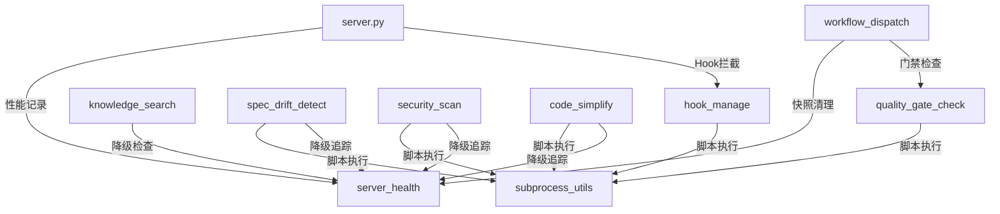

# Xuansto MCP Server v3.4.1 MCP分析文档

> 版本: 3.4.1 | 更新日期: 2026-05-21 | 状态: Beta

## 1. 工具总览

### 1.1 13个工具定义

| # | 工具名 | 只读 | 破坏性 | 幂等 | 开放世界 | 降级级数 | 线程安全 |
|---|--------|------|--------|------|----------|----------|----------|
| 1 | skill_analyze | ✅ | ❌ | ✅ | ❌ | 2 (script→inline) | ✅ 无状态 |
| 2 | knowledge_search | ❌ | ❌ | ❌ | ✅ | 3 (chromadb→sqlite→keyword) | ⚠️ SQLite连接非池化 |
| 3 | quality_gate_check | ✅ | ❌ | ✅ | ❌ | 2 (script→inline) | ⚠️ 全局哈希缓存 |
| 4 | spec_drift_detect | ✅ | ❌ | ✅ | ❌ | 2 (script→inline) | ✅ 无状态 |
| 5 | security_scan | ✅ | ❌ | ❌ | ✅ | 2 (script→inline) | ✅ 无状态 |
| 6 | code_simplify | ✅ | ❌ | ✅ | ❌ | 2 (script→inline) | ✅ 无状态 |
| 7 | session_manage | ❌ | ❌ | ❌ | ❌ | 2 (script→inline) | ⚠️ 文件写入无锁 |
| 8 | workflow_dispatch | ❌ | ❌ | ❌ | ❌ | 2 (script→inline) | ✅ _workflows_lock |
| 9 | agent_status | ✅ | ❌ | ✅ | ❌ | 2 (script→inline) | ✅ _agents_lock |
| 10 | hook_manage | ❌ | ❌ | ❌ | ❌ | 1 (inline only) | ✅ 无状态 |
| 11 | resource_load_status | ✅ | ❌ | ✅ | ❌ | 1 (inline only) | ✅ _cache_lock |
| 12 | context_compress | ✅ | ❌ | ✅ | ❌ | 1 (inline only) | ✅ 无状态 |
| 13 | server_health | ✅ | ❌ | ✅ | ❌ | 1 (inline only) | ✅ _metrics_lock |

### 1.2 6个资源定义

| # | URI | 类型 | 参数 | 描述 |
|---|-----|------|------|------|
| 1 | `xuansto://config/skill` | 静态 | 无 | Skill配置文件(.skill-config.yaml) |
| 2 | `xuansto://references/quality-gates` | 静态 | 无 | 质量门禁参考文档 |
| 3 | `xuansto://references/agent-registry` | 静态 | 无 | Agent注册表 |
| 4 | `xuansto://references/workflow-phases` | 静态 | 无 | 工作流阶段定义 |
| 5 | `xuansto://templates/{name}` | 模板 | name: str | 模板文件(路径遍历保护) |
| 6 | `xuansto://sessions/latest` | 动态 | 无 | 最新会话记录 |

## 2. 质量门禁ID完整清单 (60个)

### 2.1 按Phase分组

| Phase | 门禁ID | 有内嵌检查 | 有脚本 |
|-------|--------|-----------|--------|
| 0 | DESIGN-SYSTEM-COMPLETE | ✅ | ❌ |
| 0 | ANTI-PATTERN-CHECK | ✅ | ❌ |
| 0 | DESIGN-REVIEW-PRODUCT | ✅ | ❌ |
| 0 | DESIGN-REVIEW-TECH | ✅ | ❌ |
| 0 | DESIGN-REVIEW-DESIGN | ✅ | ❌ |
| 1 | BRAINSTORM-COMPLETE | ✅ | ❌ |
| 1 | GATE-001 | ✅ | ❌ |
| 1 | GATE-002 | ✅ | ❌ |
| 2 | PLAN-ATOMIC | ✅ | ❌ |
| 2 | GATE-003 | ✅ | ❌ |
| 2 | GATE-004 | ✅ | ❌ |
| 3 | TEST-FIRST | ❌ | ❌ |
| 4 | SUBAGENT-REVIEW | ✅ | ❌ |
| 4 | REVIEW-CONFIDENCE | ✅ | ❌ |
| 4 | GATE-007 | ✅ | ✅ check-encoding.py |
| 4 | TEST-PASS | ✅ | ✅ coverage-check.py |
| 4 | GATE-009 | ✅ | ❌ |
| 4 | FILE-ENCODING | ✅ | ✅ check-encoding.py |
| 4 | COMMENT-LANGUAGE | ✅ | ✅ check-comment-lang.py |
| 4 | SCRIPT-SECURITY | ✅ | ✅ script-security-scanner.py |
| 5 | PLAYWRIGHT-E2E-PASS | ✅ | ❌ |
| 5 | GATE-011 | ✅ | ❌ |
| 5 | GATE-012 | ✅ | ❌ |
| 5 | AI-PENTEST | ✅ | ❌ |
| 5 | SPEC-CONSISTENCY | ✅ | ❌ |
| 6 | GATE-013 | ✅ | ❌ |
| 6 | GATE-014 | ✅ | ❌ |
| 6 | INFRA-HEALTH | ✅ | ❌ |
| 6 | UX-ACCEPTANCE | ✅ | ❌ |
| 7 | SIMPLIFICATION-BEHAVIOR | ✅ | ❌ |
| 7 | CHESTERTON-FENCE | ✅ | ❌ |
| 7 | GATE-015 | ✅ | ❌ |
| 8 | DESKTOP-BUILD | ✅ | ❌ |
| 8 | DESKTOP-SIGN | ✅ | ❌ |
| 8 | DESKTOP-UPDATE | ✅ | ❌ |
| 8 | DESKTOP-CROSS | ✅ | ❌ |
| 8 | IPC-CONTRACT | ✅ | ❌ |

### 2.2 仅声明无内嵌检查的门禁 (23个)

| 门禁ID | Phase | 状态 |
|--------|-------|------|
| DESIGN-TOKENS | 0 | SKIP - 需外部脚本 |
| SPEC-ATOMIC | 2 | SKIP - 需外部脚本 |
| MULTI-PERSPECTIVE-COVERAGE | 4 | SKIP - 需外部脚本 |
| TDD-RED | 4 | SKIP - 需外部脚本 |
| TDD-GREEN | 4 | SKIP - 需外部脚本 |
| TDD-REFACTOR | 4 | SKIP - 需外部脚本 |
| EXECUTION-VERIFY | 4 | SKIP - 需外部脚本 |
| SCRIPT-CLEANUP | 4 | SKIP - 需外部脚本 |
| TOKEN-BUDGET | 4 | SKIP - 需外部脚本 |
| AGENTIC-SECURITY | 5 | SKIP - 需外部脚本 |
| VISUAL-REGRESSION | 5 | SKIP - 需外部脚本 |
| RENDER-CHECK | 5 | SKIP - 需外部脚本 |
| ACCESSIBILITY | 5 | SKIP - 需外部脚本 |
| PERFORMANCE | 5 | SKIP - 需外部脚本 |
| SECURITY-FIX-CLOSED | 5 | SKIP - 需外部脚本 |
| DOD-CHECK | 6 | SKIP - 需外部脚本 |
| DOC-COMPLETENESS | 7 | SKIP - 需外部脚本 |
| ITERATION-BUDGET | 8 | SKIP - 需外部脚本 |
| SESSION-RECOVERY | 8 | SKIP - 需外部脚本 |
| BUILD-SUCCESS | 8 | SKIP - 需外部脚本 |
| ROLLBACK-SAFETY | 8 | SKIP - 需外部脚本 |
| INIT-COMPLETE | 8 | SKIP - 需外部脚本 |
| STATUS-HEALTHY | 8 | SKIP - 需外部脚本 |

## 3. 三级降级链详解

### 3.1 降级架构

```
Level 0: 完整功能 (脚本 + 内嵌逻辑)
    ↓ 脚本不存在或执行失败
Level 1: 内嵌降级 (inline逻辑)
    ↓ 内嵌逻辑不可用
Level 2: 关键词降级 (keyword_fallback)
```

### 3.2 各工具降级路径

| 工具 | Level 0 | Level 1 | Level 2 |
|------|---------|---------|---------|
| knowledge_search | ChromaDB语义搜索 | SQLite FTS5 BM25 | 文件关键词扫描 |
| quality_gate_check | 外部脚本执行 | INLINE_CHECKS | SKIP |
| spec_drift_detect | spec-drift-detector.py | _inline_spec_drift | - |
| security_scan | agentic-security-scanner.py + dependency-scan.py | _inline_agentic_scan + _inline_dependency_scan | - |
| code_simplify | code-simplifier.py + deduplication-detector.py | _inline_simplify + _inline_dedup | - |
| session_manage | session-persist.py | 内存操作 | - |
| workflow_dispatch | project-initializer.py | 内存工作流 | - |
| skill_analyze | skill-test.py | 内嵌分析 | - |
| agent_status | skill-test.py | 内嵌Agent列表 | - |
| hook_manage | 对应Hook脚本 | INLINE_HOOK_LOGIC | - |
| resource_load_status | - | 文件系统读取 | - |
| context_compress | context-compressor.py | 内嵌压缩算法 | - |
| server_health | - | 内嵌健康检查 | - |

### 3.3 降级追踪机制

```python
# server_health.py
_DEGRADATION_COUNTS: dict[str, int] = {}  # 工具名 → 降级次数
_CHROMADB_DEGRADATION_KEY = "chromadb_unavailable"

# 降级时调用
track_degradation(tool_name)  # 增加计数 + 可能触发持久化

# ChromaDB恢复时
_DEGRADATION_COUNTS[_CHROMADB_DEGRADATION_KEY] = 0  # 清零

# knowledge_search检查ChromaDB降级
if _DEGRADATION_COUNTS.get(_CHROMADB_DEGRADATION_KEY, 0) > 0:
    # 跳过语义搜索，直接走FTS5
```

## 4. 线程安全状态

### 4.1 锁使用清单

| 锁变量 | 所在模块 | 保护对象 | 类型 |
|--------|----------|----------|------|
| `_config_lock` | config.py | GATE_SCRIPTS_MAP, QUALITY_GATES_PHASE_MAP, HOOK_SCRIPTS_MAP | threading.Lock |
| `_workflows_lock` | workflow_dispatch.py | _ACTIVE_WORKFLOWS | threading.Lock |
| `_agents_lock` | agent_status.py | _AGENT_INSTANCES | threading.Lock |
| `_cache_lock` | resource_load_status.py | _RESOURCE_CACHE, _loaded_resources | threading.Lock |
| `_metrics_lock` | server_health.py | _TOOL_METRICS, _DEGRADATION_COUNTS | threading.Lock |
| `_persist_lock` | server_health.py | 指标持久化文件写入 | threading.Lock |

### 4.2 未受保护的状态

| 状态 | 所在模块 | 风险 | 建议 |
|------|----------|------|------|
| _RESTORED_STATE | session_manage.py | 低(启动后只读) | 可接受 |
| _file_hash_cache | quality_gate_check.py | 中(并发写入) | 需加锁 |
| _file_mtime_cache | quality_gate_check.py | 中(并发写入) | 需加锁 |
| session文件写入 | session_manage.py | 中(并发覆盖) | 需加锁 |
| current.json写入 | session_manage.py | 中(并发覆盖) | 需加锁 |

## 5. 渐进式加载与MCP关系

### 5.1 资源加载策略

| Phase | 预加载资源 | 类型 |
|-------|-----------|------|
| 0 | skill-config, agent-registry, quality-gates | config + reference |
| 1 | knowledge-general, brainstorm-workflow | knowledge + workflow |
| 2 | knowledge-patterns, sdd-tdd-full | knowledge + workflow |
| 3 | test-guidelines | reference |
| 4 | coding-standards, karpathy-guidelines | reference |
| 5 | security-guidelines, owasp-top10 | reference |
| 6 | acceptance-criteria | reference |
| 7 | simplification-rules | reference |
| 8 | desktop-guidelines, ipc-contracts | reference |

### 5.2 缓存机制

| 参数 | 值 | 描述 |
|------|-----|------|
| TTL | 3600s | 缓存有效期 |
| 最大条目 | 100 | _CACHE_MAX_ENTRIES |
| 最大资源大小 | 10MB | _MAX_RESOURCE_SIZE_BYTES |
| 最大单文件 | 1MB | _MAX_SINGLE_FILE_BYTES |
| 失效检测 | Hash比对 | _compute_path_hash() |
| 清理策略 | LRU + TTL过期 | _cleanup_cache() |

### 5.3 MCP Resource与Tool的协作

```
MCP Resource (只读)          MCP Tool (读写)
─────────────────           ────────────────
xuansto://config/skill  ←→  skill_analyze (读取配置)
xuansto://references/*  ←→  quality_gate_check (门禁定义)
xuansto://sessions/latest ←→ session_manage (会话记录)
xuansto://templates/*   ←→  workflow_dispatch (工作流模板)
```

## 6. Skill层交互协议

### 6.1 SKILL.md → Tool映射

| SKILL.md触发条件 | 调用Tool | 参数映射 |
|-----------------|----------|----------|
| 分析技能结构 | skill_analyze | skill_path → 项目路径 |
| 搜索知识 | knowledge_search | query → 搜索词, scope → 范围 |
| 检查质量门禁 | quality_gate_check | phase → 当前阶段 |
| 检测规格偏差 | spec_drift_detect | spec_dir, src_dir |
| 安全扫描 | security_scan | target → 目标路径 |
| 简化代码 | code_simplify | target → 目标路径 |
| 保存/恢复会话 | session_manage | action → save/restore |
| 启动工作流 | workflow_dispatch | action → start, workflow → 名称 |
| 查询Agent | agent_status | action → list/by_phase |
| 执行Hook | hook_manage | action → execute, hook_name |
| 检查资源状态 | resource_load_status | action → status/preload |
| 压缩上下文 | context_compress | content, strategy |
| 健康检查 | server_health | 无参数 |

### 6.2 工具间调用关系



### 6.3 循环依赖问题

当前存在以下循环/交叉依赖：

| 源 | 目标 | 类型 | 严重性 |
|----|------|------|--------|
| spec_drift_detect.py | server_health.py (track_degradation) | 延迟import | 中 |
| security_scan.py | server_health.py (track_degradation) | 延迟import | 中 |
| code_simplify.py | server_health.py (track_degradation) | 延迟import | 中 |
| server_health.py | workflow_dispatch.py (_load_all_workflows, _cleanup_all_snapshots) | 延迟import | 中 |
| workflow_dispatch.py | quality_gate_check.py (INLINE_CHECKS) | 顶层import | 低 |

**缓解措施**: 所有循环依赖均使用函数内延迟import (`from .server_health import track_degradation`)，避免模块级循环。
