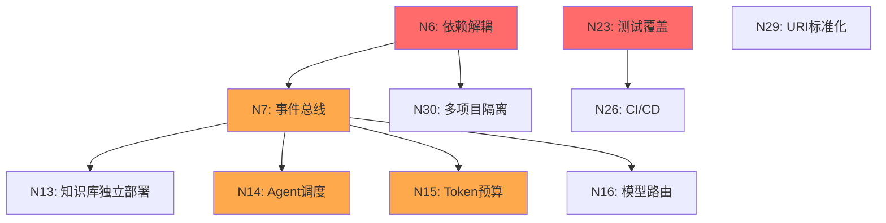
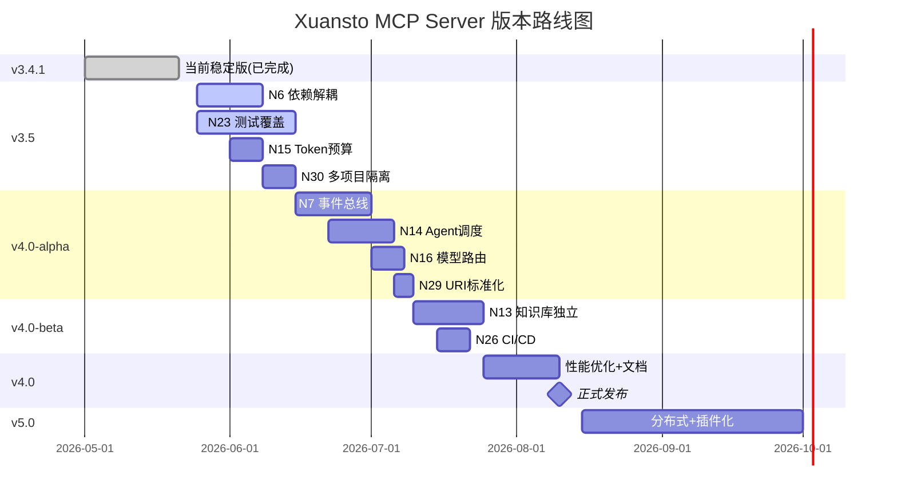

# Xuansto MCP Server v3.4.1 重构计划

> 版本: 3.4.1 | 更新日期: 2026-05-21 | 状态: Beta

## 1. 已完成项 (25项 ✅)

| 编号 | 描述 | 完成版本 | 验证方式 |
|------|------|----------|----------|
| N1 | MCP Server基础架构 (FastMCP + stdio) | v3.0 | server.py运行 |
| N2 | 13个原子化工具独立模块 | v3.0 | tools/*.py |
| N3 | Pydantic参数校验 (13个Input Schema) | v3.0 | models/schemas.py |
| N4 | 三级降级链 (FALLBACK_MAP) | v3.0 | core/degradation.py |
| N5 | Hook拦截系统 (_with_hook_interception) | v3.0 | server.py |
| N8 | 工作流调度 (9阶段 + 快照恢复) | v3.1 | workflow_dispatch.py |
| N9 | 质量门禁系统 (60个ID + INLINE_CHECKS) | v3.1 | quality_gate_check.py |
| N10 | 知识库三层检索 (ChromaDB→FTS5→keyword) | v3.1 | knowledge_search.py |
| N11 | Agent状态管理 (57 Agent + CRUD) | v3.2 | agent_status.py |
| N12 | 会话持久化 (save/load/track/restore) | v3.2 | session_manage.py |
| N17 | CLI工具 (7个子命令) | v3.2 | cli.py |
| N18 | 配置热重载 (_config_watcher + SIGHUP) | v3.2 | config.py |
| N19 | 资源渐进式加载 (PHASE_RESOURCE_MAP) | v3.3 | resource_load_status.py |
| N20 | 上下文压缩 (3种策略) | v3.3 | context_compress.py |
| N21 | 健康检查+性能指标 | v3.3 | server_health.py |
| N24 | 原子写入工具 (atomic_write) | v3.3 | core/__init__.py |
| N25 | 错误体系 (4个子类 + make_*_response) | v3.3 | core/errors.py |
| N27 | 门禁缓存 (file_hash + gate_cache) | v3.4 | quality_gate_check.py |
| N28 | 快照清理 (TTL + max + cleanup) | v3.4 | workflow_dispatch.py |
| N31 | write_text→atomic_write (7处替换) | v3.4.1 | knowledge_search/workflow/agent/resource/health/quality_gate |
| N32 | SQLite连接try/finally | v3.4.1 | _ensure_knowledge_index() + _sqlite_search() |
| N33 | CLI使用_REGISTERED_TOOL_NAMES | v3.4.1 | cli.py |
| N34 | keyword搜索1MB限制 | v3.4.1 | _MAX_KEYWORD_FILE_BYTES |
| N35 | config reload线程锁 | v3.4.1 | _config_lock |

## 2. 待完成项 (10项)

### 2.1 详细分析

| 编号 | 描述 | 优先级 | 复杂度 | 影响范围 | 依赖 |
|------|------|--------|--------|----------|------|
| N6 | 工具间依赖解耦 | P0-紧急 | 高 | tools/ 全部 | 无 |
| N7 | 统一事件总线 | P1-高 | 高 | 全局 | N6 |
| N13 | 知识库服务独立部署 | P2-中 | 高 | knowledge_server/ | N7 |
| N14 | Agent调度引擎 | P1-高 | 中 | agent_status.py | N7 |
| N15 | Token预算执行器 | P1-高 | 中 | hook_manage.py | N7 |
| N16 | 模型路由实现 | P2-中 | 中 | 新模块 | N7 |
| N23 | 测试覆盖 | P0-紧急 | 中 | tests/ | 无 |
| N26 | CI/CD流水线完善 | P2-中 | 低 | .github/ | N23 |
| N29 | 资源URI标准化 | P3-低 | 低 | resources/ | 无 |
| N30 | 多项目隔离 | P2-中 | 中 | config.py | N6 |

### 2.2 影响链分析



### 2.3 优先级评分

| 编号 | 紧急性 | 影响面 | 复杂度 | 综合分 | 排序 |
|------|--------|--------|--------|--------|------|
| N6 | 10 | 9 | 8 | 9.0 | 1 |
| N23 | 10 | 7 | 5 | 7.5 | 2 |
| N15 | 8 | 6 | 5 | 6.5 | 3 |
| N14 | 7 | 6 | 5 | 6.0 | 4 |
| N7 | 6 | 9 | 8 | 7.0 | 5 |
| N30 | 5 | 5 | 6 | 5.3 | 6 |
| N13 | 4 | 5 | 8 | 5.0 | 7 |
| N16 | 4 | 4 | 5 | 4.3 | 8 |
| N26 | 3 | 4 | 3 | 3.3 | 9 |
| N29 | 2 | 2 | 2 | 2.0 | 10 |

## 3. 模块化重构步骤

### 3.1 v3.5 — 基础加固

**目标**: 解耦依赖 + 测试覆盖 + Token预算

| 步骤 | 任务 | 产出 | 预计工时 |
|------|------|------|----------|
| 3.5.1 | N6: 提取事件接口 | core/events.py (EventBus协议) | 4h |
| 3.5.2 | N6: 解耦track_degradation | 工具通过EventBus发布降级事件 | 3h |
| 3.5.3 | N6: 解耦workflow→quality_gate | 通过EventBus请求门禁检查 | 3h |
| 3.5.4 | N6: 解耦server_health→workflow | 通过EventBus获取工作流状态 | 2h |
| 3.5.5 | N23: 核心模块单元测试 | tests/test_core.py (atomic_write, errors, validator) | 4h |
| 3.5.6 | N23: 工具模块单元测试 | tests/test_tools_*.py (13个工具) | 8h |
| 3.5.7 | N23: 集成测试 | tests/test_integration.py | 4h |
| 3.5.8 | N15: Token预算执行器 | core/token_budget.py | 4h |
| 3.5.9 | N15: 集成到Hook系统 | hook_manage.py → token_budget | 2h |
| 3.5.10 | N30: 多项目隔离 | config.py → ProjectContext | 4h |

**验收标准**:
- [ ] 无循环import (除延迟import外)
- [ ] 测试覆盖率 > 60%
- [ ] Token预算Hook可执行
- [ ] 多项目WORK_DIR隔离

### 3.2 v4.0-alpha — 架构升级

**目标**: 事件总线 + Agent调度 + 模型路由

| 步骤 | 任务 | 产出 | 预计工时 |
|------|------|------|----------|
| 4a.1 | N7: 实现EventBus | core/event_bus.py (publish/subscribe) | 6h |
| 4a.2 | N7: 迁移所有工具到EventBus | 13个工具事件化 | 8h |
| 4a.3 | N14: Agent调度引擎 | core/scheduler.py (优先级队列 + 能力匹配) | 8h |
| 4a.4 | N14: 集成到agent_status | agent_status.py → scheduler | 4h |
| 4a.5 | N16: 模型路由实现 | core/model_router.py (fast/standard/deep) | 6h |
| 4a.6 | N16: 集成到工具调用 | _with_hook_interception → model_router | 3h |
| 4a.7 | N29: 资源URI标准化 | resources/ → 统一URI模式 | 3h |

**验收标准**:
- [ ] EventBus发布/订阅正常工作
- [ ] Agent可自动调度(非手动assign)
- [ ] 模型路由根据任务类型选择
- [ ] 资源URI遵循xuansto://scheme规范

### 3.3 v4.0-beta — 服务化

**目标**: 知识库独立部署 + CI/CD

| 步骤 | 任务 | 产出 | 预计工时 |
|------|------|------|----------|
| 4b.1 | N13: 知识库服务API | knowledge_service/api.py (REST + WebSocket) | 8h |
| 4b.2 | N13: 知识库客户端 | core/kb_client.py (HTTP客户端) | 4h |
| 4b.3 | N13: 降级到本地模式 | knowledge_search.py → kb_client → fallback | 4h |
| 4b.4 | N26: CI流水线 | .github/workflows/ci.yml (lint+test+build) | 3h |
| 4b.5 | N26: 发布流水线 | .github/workflows/release.yml | 2h |

**验收标准**:
- [ ] 知识库可作为独立服务运行
- [ ] 本地模式降级无缝
- [ ] CI流水线绿色通过
- [ ] 自动发布到PyPI

### 3.4 v4.0 — 正式版

**目标**: 文档 + 性能优化 + 稳定性

| 步骤 | 任务 | 产出 | 预计工时 |
|------|------|------|----------|
| 4.1 | 性能基准测试 | benchmarks/ | 4h |
| 4.2 | SQLite连接池 | core/db_pool.py | 4h |
| 4.3 | 缓存层统一 | core/cache.py (统一TTL/LRU/Hash) | 4h |
| 4.4 | API文档生成 | docs/api/ (OpenAPI) | 3h |
| 4.5 | 迁移指南 | docs/migration/ | 2h |

**验收标准**:
- [ ] 测试覆盖率 > 80%
- [ ] 所有门禁检查 < 5s
- [ ] 知识检索 < 500ms (P95)
- [ ] 文档完整

### 3.5 v5.0 — 下一代

**目标**: 分布式 + 插件化

| 步骤 | 任务 | 描述 |
|------|------|------|
| 5.1 | SSE Transport | 支持HTTP SSE传输 |
| 5.2 | 插件系统 | 第三方Tool/Resource插件 |
| 5.3 | 分布式工作流 | 多节点工作流协调 |
| 5.4 | 流式响应 | 大结果流式返回 |
| 5.5 | Web Dashboard | 管理界面 |

## 4. 渐进式加载实现计划

### 4.1 当前差距

| 组件 | 配置 | 实现 | 差距 |
|------|------|------|------|
| Phase资源映射 | ✅ PHASE_RESOURCE_MAP | ✅ resource_load_status | 无 |
| Phase感知卸载 | ✅ phase_transition_rules | ❌ 未实现 | 需实现 |
| Agent按Phase加载 | ❌ 无配置 | ❌ 未实现 | 需设计 |
| 参考文档按需加载 | ❌ 无配置 | ❌ 未实现 | 需设计 |
| Token预算执行 | ✅ token_budget配置 | ❌ 未实现 | 需实现 |

### 4.2 实现步骤

| 步骤 | 描述 | 版本 |
|------|------|------|
| 1 | 实现phase_transition_rules卸载逻辑 | v3.5 |
| 2 | 添加Agent按Phase加载配置 | v4.0-alpha |
| 3 | 实现参考文档按需加载 | v4.0-alpha |
| 4 | 实现Token预算执行器 | v3.5 |
| 5 | 统一缓存层 | v4.0 |

## 5. 测试策略

### 5.1 测试金字塔

```
        ┌──────────┐
        │  E2E测试  │  ← 少量，验证完整工作流
        │  (5%)    │
       ┌┴──────────┴┐
       │  集成测试    │  ← 中等，验证工具间协作
       │  (15%)      │
      ┌┴────────────┴┐
      │   单元测试     │  ← 大量，验证独立函数
      │   (80%)       │
      └───────────────┘
```

### 5.2 测试分类

| 类别 | 覆盖目标 | 工具 | 数量目标 |
|------|----------|------|----------|
| 单元测试 | core/ + tools/ 每个函数 | pytest | 100+ |
| 集成测试 | 工具间调用链 | pytest + pytest-asyncio | 20+ |
| 降级测试 | 每个降级路径 | pytest + mock | 13 (每工具) |
| 性能测试 | 关键路径延迟 | pytest-benchmark | 10+ |
| 安全测试 | 注入/权限/编码 | 自定义 | 5+ |

### 5.3 关键测试用例

| ID | 测试场景 | 预期结果 |
|----|----------|----------|
| T01 | atomic_write中途崩溃 | 无损坏文件 |
| T02 | ChromaDB不可用时知识搜索 | 降级到SQLite |
| T03 | SQLite不可用时知识搜索 | 降级到keyword |
| T04 | 工作流阶段推进门禁失败 | 返回failed_gates |
| T05 | 工作流快照恢复 | 恢复到正确Phase |
| T06 | Hook安全阻断危险命令 | 返回blocked |
| T07 | 并发Agent创建/销毁 | 无数据竞争 |
| T08 | 配置热重载 | 新配置立即生效 |
| T09 | 门禁缓存命中 | 跳过重复检查 |
| T10 | Token预算超限 | 触发压缩/阻断 |

## 6. CI建议

### 6.1 流水线设计

```yaml
# .github/workflows/ci.yml
stages:
  - lint        # ruff + mypy
  - test        # pytest (单元 + 集成)
  - security    # bandit + safety
  - build       # hatch build
  - publish     # PyPI (仅release分支)
```

### 6.2 质量门禁

| 门禁 | 阈值 | 工具 |
|------|------|------|
| 代码风格 | ruff 0 error | ruff check |
| 类型检查 | mypy 0 error | mypy --strict |
| 测试覆盖率 | >= 80% | pytest-cov |
| 安全扫描 | 0 critical/high | bandit + safety |
| 文档覆盖 | 所有public API | 自定义脚本 |

### 6.3 发布流程

```
main分支合并
    ↓
自动bump版本 (hatch)
    ↓
运行完整CI
    ↓
构建wheel + sdist
    ↓
发布到PyPI (仅tag触发)
    ↓
创建GitHub Release
```

## 7. 版本路线图



## 8. 风险登记

| 风险ID | 描述 | 概率 | 影响 | 缓解 |
|--------|------|------|------|------|
| R01 | EventBus引入增加复杂度 | 中 | 高 | 先用简单实现，渐进增强 |
| R02 | 测试覆盖耗时超预期 | 高 | 中 | 优先覆盖核心路径 |
| R03 | 知识库服务化破坏本地模式 | 中 | 高 | 双模式兼容期 |
| R04 | Agent调度算法不成熟 | 中 | 中 | 先实现简单优先级队列 |
| R05 | 多项目隔离影响现有用户 | 低 | 高 | 默认单项目模式 |
| R06 | v4.0 API不兼容v3.x | 中 | 高 | 提供迁移脚本 |
