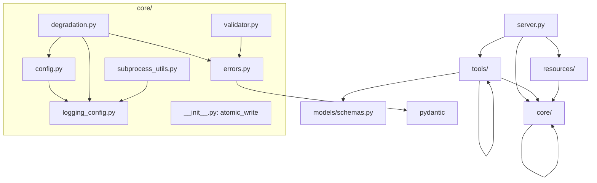

# Xuansto MCP Server v3.4.1 Skill分析文档

> 版本: 3.4.1 | 更新日期: 2026-05-21 | 状态: Beta

## 1. SKILL.md 完整分析

### 1.1 Skill配置文件

**文件**: `data/.skill-config.yaml`

该文件定义了Skill层的全部运行时配置，包含以下核心区块：

| 区块 | 描述 | 关键参数 |
|------|------|----------|
| token_budget | Token预算管理 | default: 100000, 3级压缩阈值 |
| on_demand_loading | 渐进式加载策略 | lazy加载, 3个预加载项, phase感知卸载 |
| knowledge_service | 知识库服务配置 | host: 127.0.0.1:8765, auth: optional |
| logging | 日志配置 | level: INFO, 4个日志文件 |
| degradation | Token降级策略 | L1(0.8)→L2(0.95)→L3(1.0) |
| platform | 平台检测 | auto_detect, fallback: trae |
| planning_files | 规划文件管理 | two_action_rule, three_strike_protocol |
| loop | 循环控制 | max_iterations: 50, stagnation: 3 |
| hooks | Hook配置 | 3 profile, 16个Hook |
| model_routing | 模型路由 | fast/standard/deep三级 |
| mcp | MCP配置 | max_concurrent: 10, lazy_loading: true |
| session_persistence | 会话持久化 | max_sessions: 10, auto_load: true |
| continuous_learning | 持续学习 | pattern_threshold: 2, confidence: 0.40→0.80 |

### 1.2 触发条件分析

Skill通过MCP协议被触发，触发方式：

| 触发方式 | 描述 | 入口 |
|----------|------|------|
| MCP Tool调用 | AI Agent通过MCP协议调用13个工具 | server.py → _with_hook_interception |
| CLI调用 | 命令行工具直接调用 | cli.py → _invoke_tool |
| MCP Resource读取 | AI Agent读取6个资源端点 | skill_resources.py |
| Hook自动触发 | Pre/Post Hook拦截工具调用 | hook_manage.py |

### 1.3 参数传递链

```
MCP Client
    ↓ (JSON-RPC)
FastMCP Server
    ↓ (参数解析)
_with_hook_interception
    ↓ (kwargs传递)
validate_input(Schema, **kwargs)
    ↓ (Pydantic校验)
tool_fn(**validated_params)
    ↓ (业务逻辑)
make_success_response / make_error_response
    ↓ (JSON响应)
MCP Client
```

## 2. 功能逻辑分解

### 2.1 skill_analyze — 技能结构分析

| 子功能 | 输入 | 输出 | 实现 |
|--------|------|------|------|
| YAML Frontmatter解析 | skill_path | metadata dict | _parse_yaml_frontmatter |
| 目录结构扫描 | skill_path, depth | structure dict | _scan_directory |
| Agent注册表解析 | include_agents | agents list | _parse_agent_registry |
| 脚本依赖扫描 | include_scripts | dependencies dict | _scan_script_dependencies |
| 技能验证 | skill_path | issues list | _run_skill_validation |
| 项目规模评估 | skill_path | scale + workflow推荐 | _assess_project_scale |

### 2.2 knowledge_search — 三层知识库检索

| 子功能 | 输入 | 输出 | 降级 |
|--------|------|------|------|
| ChromaDB语义搜索 | query, top_k, scope | results + relevance | → SQLite |
| SQLite FTS5搜索 | query, top_k | results + bm25_score | → keyword |
| 关键词回退搜索 | query, top_k, scope | results + relevance | 最终降级 |
| 知识注入 | content, type, metadata | injected_id + indexed | - |
| 经验沉淀 | pattern_ids | precipitated_id + themes | - |
| FTS5索引维护 | - | knowledge_fts表 | unicode61迁移 |

### 2.3 quality_gate_check — 质量门禁检查

| 子功能 | 输入 | 输出 | 实现 |
|--------|------|------|------|
| 门禁解析 | gate_ids, phase | gates_to_check list | _resolve_gates |
| 脚本执行 | gate_id | PASS/FAIL + details | subprocess.run |
| 内嵌检查 | gate_id, project_path | PASS/FAIL/SKIP | INLINE_CHECKS |
| 文件哈希缓存 | project_path | hash dict | _compute_file_hashes |
| 门禁结果缓存 | project_path | cached checks | _load_gate_cache |
| 缓存有效性 | cache, current_hashes | bool | _is_cache_valid |

### 2.4 workflow_dispatch — 工作流调度

| 子功能 | 输入 | 输出 | 实现 |
|--------|------|------|------|
| 启动工作流 | workflow, project_path | workflow_id + state | _start_workflow |
| 查询状态 | workflow_id | current state | _get_workflow_status |
| 中止工作流 | workflow_id | aborted state | _abort_workflow |
| 阶段推进 | workflow_id | advanced + gates | _advance_phase |
| 快照保存 | workflow_id, state | snapshot_path | _save_snapshot |
| 快照恢复 | workflow_id, phase | recovered state | _load_latest_snapshot |
| 快照清理 | workflow_id | deleted/remaining | _cleanup_snapshots |

### 2.5 agent_status — Agent状态管理

| 子功能 | 输入 | 输出 | 实现 |
|--------|------|------|------|
| 列出Agent | - | agents list | _parse_agent_registry |
| 按Phase查询 | phase | phase_agents | PHASE_AGENT_MAP |
| Agent详情 | agent_name | detail dict | _get_agent_detail |
| 创建实例 | agent_type, capabilities | agent_id | _AgentInstance |
| 能力匹配 | capabilities | matches + coverage | set交集 |
| 分配任务 | agent_id, task | busy status | _agents_lock |
| 销毁实例 | agent_id | destroyed | _agents_lock |

### 2.6 hook_manage — Hook管理

| 子功能 | 输入 | 输出 | 实现 |
|--------|------|------|------|
| 列出Hook | profile | hooks list | HOOK_PROFILES |
| 执行Hook | hook_name, context | status + details | INLINE_HOOK_LOGIC |
| 安全阻断 | command | block/pass | _security_block_logic |
| 危险命令确认 | command | warn/pass | _dangerous_cmd_confirm_logic |
| 格式检查 | project_path | warn/pass | _auto_format_logic |
| Console检测 | project_path | warn/pass | _console_log_detect_logic |
| 类型检查 | project_path | warn/pass | _type_check_logic |
| Git状态检查 | project_path | warn/pass | _git_status_check_logic |
| 决策日志持久化 | project_path | pass | _decision_log_persist_logic |

## 3. 交互模式

### 3.1 工具交互矩阵

|  | skill_analyze | knowledge_search | quality_gate | spec_drift | security_scan | code_simplify | session_manage | workflow_dispatch | agent_status | hook_manage | resource_load | context_compress | server_health |
|---|---|---|---|---|---|---|---|---|---|---|---|---|---|
| skill_analyze | - | ❌ | ❌ | ❌ | ❌ | ❌ | ❌ | ❌ | ❌ | ❌ | ❌ | ❌ | ❌ |
| knowledge_search | ❌ | - | ❌ | ❌ | ❌ | ❌ | ❌ | ❌ | ❌ | ❌ | ❌ | ❌ | ✅降级 |
| quality_gate | ❌ | ❌ | - | ❌ | ❌ | ❌ | ❌ | ❌ | ❌ | ❌ | ❌ | ❌ | ❌ |
| spec_drift | ❌ | ❌ | ❌ | - | ❌ | ❌ | ❌ | ❌ | ❌ | ❌ | ❌ | ❌ | ✅降级 |
| security_scan | ❌ | ❌ | ❌ | ❌ | - | ❌ | ❌ | ❌ | ❌ | ❌ | ❌ | ❌ | ✅降级 |
| code_simplify | ❌ | ❌ | ❌ | ❌ | ❌ | - | ❌ | ❌ | ❌ | ❌ | ❌ | ❌ | ✅降级 |
| session_manage | ❌ | ❌ | ❌ | ❌ | ❌ | ❌ | - | ❌ | ❌ | ❌ | ❌ | ❌ | ❌ |
| workflow_dispatch | ❌ | ❌ | ✅门禁 | ❌ | ❌ | ❌ | ❌ | - | ❌ | ❌ | ❌ | ❌ | ✅快照 |
| agent_status | ❌ | ❌ | ❌ | ❌ | ❌ | ❌ | ❌ | ❌ | - | ❌ | ❌ | ❌ | ❌ |
| hook_manage | ❌ | ❌ | ❌ | ❌ | ❌ | ❌ | ❌ | ❌ | ❌ | - | ❌ | ❌ | ❌ |
| resource_load | ❌ | ❌ | ❌ | ❌ | ❌ | ❌ | ❌ | ❌ | ❌ | ❌ | - | ❌ | ❌ |
| context_compress | ❌ | ❌ | ❌ | ❌ | ❌ | ❌ | ❌ | ❌ | ❌ | ❌ | ❌ | - | ❌ |
| server_health | ❌ | ❌ | ❌ | ❌ | ❌ | ❌ | ❌ | ✅快照 | ❌ | ❌ | ❌ | ❌ | - |

### 3.2 Hook拦截映射

| Hook名 | 拦截工具 | 拦截时机 | 动作 |
|--------|----------|----------|------|
| security-block | code_simplify, security_scan, spec_drift_detect | Pre | block |
| dangerous-cmd-confirm | workflow_dispatch | Pre | warn |
| auto-format | code_simplify | Pre | warn |
| console-log-detect | code_simplify | Pre | warn |
| type-check | quality_gate_check | Pre | warn |
| git-status-check | workflow_dispatch | Pre | warn |
| decision-log-persist | workflow_dispatch, session_manage | Post | pass |

## 4. 渐进式加载差距分析

### 4.1 当前实现

| 组件 | 状态 | 描述 |
|------|------|------|
| PHASE_RESOURCE_MAP | ✅ 已实现 | 9个Phase × 2-3个资源映射 |
| 资源缓存 | ✅ 已实现 | TTL + Hash + LRU |
| 预加载 | ✅ 已实现 | 按Phase或URI批量加载 |
| 缓存失效 | ✅ 已实现 | stale/expired检测 |
| .skill-config.yaml卸载策略 | ✅ 已配置 | phase_transition_rules |

### 4.2 差距

| 差距 | 描述 | 优先级 |
|------|------|--------|
| 卸载未实现 | phase_transition_rules配置存在但未在代码中实现 | 高 |
| Agent按需加载 | 57个Agent定义全部在data/agents/，无按Phase加载 | 中 |
| 参考文档按需加载 | 100+参考文档全部可用，无按需筛选 | 中 |
| 脚本按需加载 | 60+脚本全部在data/scripts/，无按需加载 | 低 |
| Token预算执行 | token_budget配置存在但无执行逻辑 | 高 |

## 5. 可复用 vs 待废弃部分

### 5.1 可复用组件

| 组件 | 复用价值 | 描述 |
|------|----------|------|
| atomic_write() | 高 | 通用原子写入工具 |
| make_success_response / make_error_response | 高 | 统一响应格式 |
| validate_input() | 高 | Pydantic校验封装 |
| FALLBACK_MAP | 高 | 降级映射表模式 |
| INLINE_HOOK_LOGIC | 高 | 7个内嵌Hook逻辑 |
| INLINE_CHECKS | 高 | 35个内嵌门禁检查 |
| _compute_file_hashes | 中 | 文件哈希缓存 |
| PHASE_AGENT_MAP | 中 | Phase-Agent映射 |
| PHASE_RESOURCE_MAP | 中 | Phase-Resource映射 |
| HOOK_PROFILES | 中 | Hook配置级别 |
| _with_hook_interception | 中 | Hook拦截框架 |

### 5.2 待废弃/重构部分

| 组件 | 原因 | 替代方案 |
|------|------|----------|
| run_script_fallback() (degradation.py) | 与subprocess_utils.run_script()重复 | 统一为run_script() |
| _parse_agent_registry() (重复定义) | skill_analyze和agent_status各有一份 | 提取到core/ |
| _RESTORED_STATE全局变量 | 启动后只读一次，设计冗余 | 直接从文件读取 |
| mcp._tool_manager._tools直接访问 | 破坏封装 | N33已部分解决 |
| 脚本硬编码路径 | SCRIPTS_DIR / script_name拼接 | 脚本注册表 |

## 6. 依赖追踪

### 6.1 模块依赖图



### 6.2 外部依赖

| 依赖 | 版本 | 必需 | 用途 |
|------|------|------|------|
| mcp[cli] | >=1.0.0 | ✅ | MCP协议SDK |
| pydantic | >=2.0.0 | ✅ | 参数校验 |
| pyyaml | >=6.0 | ✅ | YAML配置解析 |
| chromadb | >=0.4.0 | ❌ | 语义向量搜索 |
| fastapi | >=0.100.0 | ❌ | 知识库API服务 |
| uvicorn | >=0.20.0 | ❌ | ASGI服务器 |
| openai | >=1.0.0 | ❌ | Embedding生成 |
| sentence-transformers | >=2.0.0 | ❌ | 本地Embedding |

### 6.3 内部脚本依赖

| 脚本 | 被工具引用 | 功能 |
|------|-----------|------|
| check-encoding.py | quality_gate_check (GATE-007, FILE-ENCODING) | 编码检查 |
| coverage-check.py | quality_gate_check (TEST-PASS) | 测试覆盖率 |
| check-comment-lang.py | quality_gate_check (COMMENT-LANGUAGE) | 注释语言检查 |
| script-security-scanner.py | quality_gate_check (SCRIPT-SECURITY) | 脚本安全扫描 |
| spec-drift-detector.py | spec_drift_detect | 规格偏差检测 |
| agentic-security-scanner.py | security_scan | OWASP安全扫描 |
| dependency-scan.py | security_scan | 依赖漏洞扫描 |
| code-simplifier.py | code_simplify | 代码简化 |
| deduplication-detector.py | code_simplify | 重复代码检测 |
| session-persist.py | session_manage (降级) | 会话持久化 |
| project-initializer.py | workflow_dispatch (降级) | 项目初始化 |
| skill-test.py | skill_analyze, agent_status (降级) | 技能测试 |
| knowledge-server.py | knowledge_search (降级) | 知识库搜索 |
| context-compressor.py | context_compress (降级) | 上下文压缩 |
| token-budget-guard.py | hook_manage (token-budget-check) | Token预算 |
| health-checker.py | hook_manage (kb-health-check) | 知识库健康检查 |
| session-catchup.py | hook_manage (load-context) | 会话恢复 |
| session-persist.py | hook_manage (session-save/save-state) | 会话保存 |
| pattern-learner.py | hook_manage (experience-precipitate/pattern-detect) | 模式学习 |
