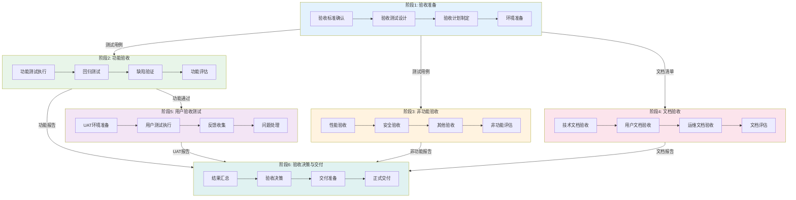

# 验收工作流

## 工作流名称
Acceptance Workflow（验收工作流）

## 描述
完整的软件验收工作流，涵盖功能验收、性能验收、安全验收和用户验收测试。该工作流确保交付物满足需求规格和用户期望，是软件交付前的最后一道质量防线。

## 触发条件
- 用户请求验收测试
- 开发完成后交付前
- 里程碑节点验收
- 合同交付验收
- 用户明确要求"验收"、"UAT"、"交付验收"

## 涉及的Agent

### 核心Agent
| Agent | 角色 | 职责 |
|-------|------|------|
| product-manager | 产品经理 | 验收标准确认、业务验收 |
| test-architect | 测试架构师 | 验收测试设计 |
| e2e-tester | E2E测试工程师 | 端到端验收测试 |

### 支撑Agent
| Agent | 角色 | 职责 |
|-------|------|------|
| security-auditor | 安全审计师 | 安全验收 |
| performance-tester | 性能测试工程师 | 性能验收 |
| documentation-engineer | 文档工程师 | 文档验收 |
| technical-writer | 技术文档工程师 | 用户手册验收 |

## 阶段定义

### 阶段1：验收准备（Acceptance Preparation）
**执行者**: product-manager, test-architect

**输入**:
- 需求规格说明书
- 用户故事列表
- 验收标准

**活动**:
1. 验收标准确认
   - 功能验收标准
   - 性能验收标准
   - 安全验收标准
   - 用户体验标准
2. 验收测试设计
   - 验收测试用例
   - 测试数据准备
   - 验收环境确认
3. 验收计划制定
   - 验收时间安排
   - 参与人员确定
   - 验收流程确认

**输出**:
- 验收标准文档
- 验收测试用例
- 验收计划书

**质量门禁**:
- [ ] 验收标准已确认
- [ ] 测试用例覆盖完整
- [ ] 验收计划已批准

---

### 阶段2：功能验收（Functional Acceptance）
**执行者**: e2e-tester, product-manager

**输入**:
- 验收测试用例
- 待验收系统

**活动**:
1. 功能测试执行
   - 核心功能验证
   - 业务流程验证
   - 边界条件测试
   - 异常处理验证
2. 回归测试
   - 已修复缺陷验证
   - 功能影响评估
   - 稳定性验证
3. 功能验收评估
   - 功能完成度评估
   - 缺陷统计与分析
   - 验收结论

**输出**:
- 功能验收报告
- 缺陷清单
- 验收评估报告

**质量门禁**:
- [ ] 核心功能全部通过
- [ ] 无P0/P1级未修复缺陷
- [ ] 功能完成度 >= 100%

---

### 阶段3：非功能验收（Non-functional Acceptance）
**执行者**: performance-tester, security-auditor

**输入**:
- 性能验收标准
- 安全验收标准
- 待验收系统

**活动**:
1. 性能验收
   - 性能指标验证
   - 负载测试验证
   - 性能基线确认
2. 安全验收
   - 安全测试验证
   - 漏洞修复确认
   - 安全合规检查
3. 其他非功能验收
   - 可用性验收
   - 可维护性验收
   - 兼容性验收

**输出**:
- 性能验收报告
- 安全验收报告
- 非功能验收汇总

**质量门禁**:
- [ ] 性能指标达标
- [ ] 无高危安全漏洞
- [ ] 合规要求满足

---

### 阶段4：文档验收（Documentation Acceptance）
**执行者**: documentation-engineer, technical-writer

**输入**:
- 文档清单
- 文档标准

**活动**:
1. 技术文档验收
   - 架构文档完整性
   - API文档准确性
   - 部署文档可用性
2. 用户文档验收
   - 用户手册完整性
   - 操作指南准确性
   - FAQ覆盖度
3. 运维文档验收
   - 运维手册完整性
   - 监控配置文档
   - 应急预案文档

**输出**:
- 文档验收报告
- 文档问题清单
- 文档改进建议

**质量门禁**:
- [ ] 必要文档齐全
- [ ] 文档内容准确
- [ ] 文档格式规范

---

### 阶段5：用户验收测试（User Acceptance Testing）
**执行者**: product-manager, 用户代表

**输入**:
- 验收测试用例
- 用户手册
- 待验收系统

**活动**:
1. UAT环境准备
   - UAT环境部署
   - 用户账号准备
   - 测试数据准备
2. 用户测试执行
   - 用户操作测试
   - 业务场景验证
   - 用户反馈收集
3. UAT问题处理
   - 问题记录与分类
   - 问题修复与验证
   - 用户确认

**输出**:
- UAT测试报告
- 用户反馈清单
- UAT问题跟踪表

**质量门禁**:
- [ ] 用户代表参与测试
- [ ] 关键业务场景通过
- [ ] 用户满意度 >= 80%

---

### 阶段6：验收决策与交付（Decision & Delivery）
**执行者**: product-manager

**输入**:
- 各阶段验收报告
- 缺陷清单
- 用户反馈

**活动**:
1. 验收结果汇总
   - 功能验收结果
   - 非功能验收结果
   - 文档验收结果
   - UAT结果
2. 验收决策
   - 验收通过/有条件通过/不通过
   - 遗留问题处理方案
   - 风险评估与缓解措施
3. 交付准备
   - 交付清单确认
   - 交付物打包
   - 交付说明编写

**输出**:
- 验收报告
- 交付清单
- 交付说明文档

**质量门禁**:
- [ ] 所有验收项已评估
- [ ] 验收决策已做出
- [ ] 交付物已准备就绪

## 流程图

## 输出产物清单

| 阶段 | 输出产物 | 格式 |
|------|----------|------|
| 验收准备 | 验收标准文档 | Markdown |
| 验收准备 | 验收测试用例 | Markdown/Excel |
| 验收准备 | 验收计划书 | Markdown |
| 功能验收 | 功能验收报告 | Markdown/PDF |
| 功能验收 | 缺陷清单 | Excel/Markdown |
| 非功能验收 | 性能验收报告 | Markdown/PDF |
| 非功能验收 | 安全验收报告 | Markdown/PDF |
| 文档验收 | 文档验收报告 | Markdown |
| UAT | UAT测试报告 | Markdown/PDF |
| UAT | 用户反馈清单 | Excel/Markdown |
| 验收决策 | 验收报告 | PDF |
| 验收决策 | 交付清单 | Excel/Markdown |
| 验收决策 | 交付说明文档 | Markdown |

## 验收标准模板

### 功能验收标准
| 维度 | 标准 | 验证方式 |
|------|------|----------|
| 功能完整性 | 所有需求功能已实现 | 需求追溯矩阵 |
| 功能正确性 | 功能按预期工作 | 测试用例执行 |
| 业务流程 | 业务流程完整正确 | 端到端测试 |
| 数据完整性 | 数据处理正确完整 | 数据验证测试 |
| 错误处理 | 异常情况正确处理 | 异常测试 |

### 性能验收标准
| 指标 | 标准 | 验证方式 |
|------|------|----------|
| 响应时间 | P95 < 3秒 | 性能测试 |
| 吞吐量 | >= 目标TPS | 负载测试 |
| 并发用户 | >= 目标并发数 | 并发测试 |
| 资源利用率 | CPU < 80%, 内存 < 85% | 监控数据 |

### 安全验收标准
| 维度 | 标准 | 验证方式 |
|------|------|----------|
| 漏洞修复 | 无高危漏洞 | 安全扫描 |
| 认证授权 | 认证授权机制有效 | 安全测试 |
| 数据保护 | 敏感数据加密存储 | 安全审计 |
| 合规性 | 符合安全合规要求 | 合规检查 |

### 文档验收标准
| 文档类型 | 标准 | 验证方式 |
|----------|------|----------|
| 用户手册 | 完整、准确、易懂 | 文档审查 |
| API文档 | 完整、准确、最新 | 文档审查 |
| 部署文档 | 步骤清晰、可执行 | 实际部署验证 |
| 运维文档 | 覆盖日常运维场景 | 文档审查 |

## 验收决策标准

### 验收通过
- 所有核心功能验收通过
- 无P0/P1级未修复缺陷
- P2级缺陷 <= 3个且不影响核心功能
- 性能指标达标
- 无高危安全漏洞
- 用户满意度 >= 80%

### 有条件通过
- 核心功能验收通过
- P1级缺陷 <= 2个且有规避方案
- P2级缺陷 <= 5个
- 性能指标基本达标（偏差 < 10%）
- 中危漏洞 <= 3个且有缓解措施
- 用户满意度 >= 70%
- 遗留问题有明确修复计划

### 验收不通过
- 核心功能验收不通过
- 存在P0级缺陷
- P1级缺陷 > 2个
- 性能指标严重不达标
- 存在高危安全漏洞
- 用户满意度 < 70%

## 执行建议

1. **早期介入**: 验收准备应在开发后期提前开始
2. **用户参与**: 确保真实用户参与UAT
3. **环境一致**: UAT环境应尽量接近生产环境
4. **问题跟踪**: 所有发现的问题都应记录跟踪
5. **沟通透明**: 验收进度和问题及时沟通
6. **文档先行**: 文档验收应在功能验收前完成
7. **风险意识**: 关注遗留风险并制定缓解措施

## 验收会议

### 验收评审会议
- **参与人**: 产品经理、开发代表、测试代表、用户代表
- **内容**: 验收结果汇报、问题讨论、验收决策
- **输出**: 验收会议纪要、验收决策结论

### 交付确认会议
- **参与人**: 产品经理、用户代表、运维代表
- **内容**: 交付物确认、培训安排、运维交接
- **输出**: 交付确认书、培训计划、运维交接文档
