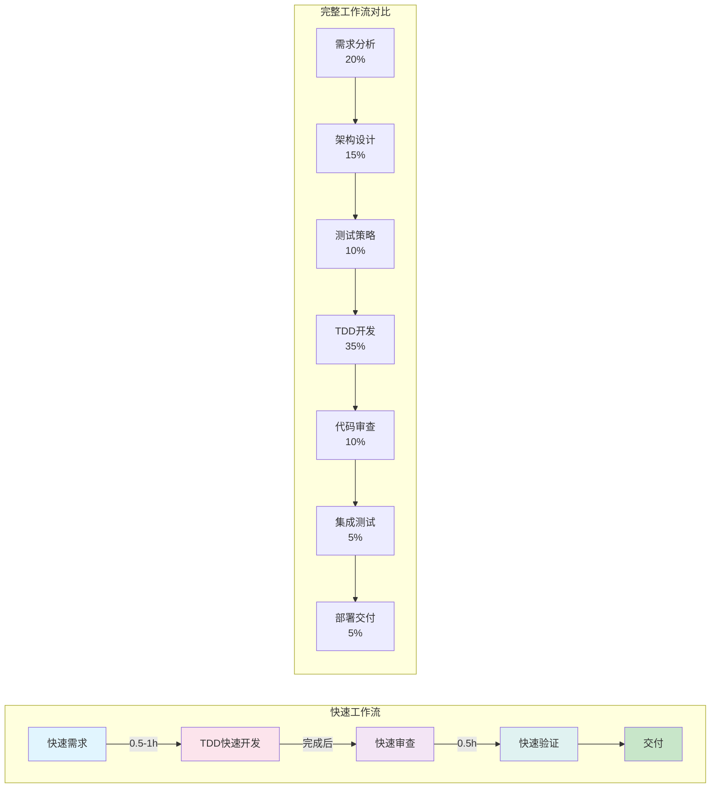
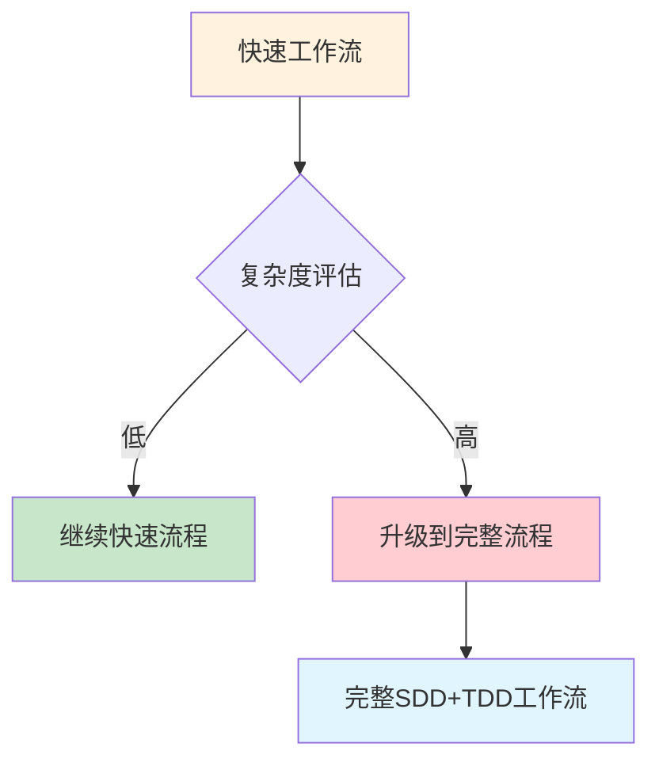

# SDD+TDD 快速工作流

## 工作流名称
SDD+TDD Fast Development Workflow（快速开发工作流）

## 描述
简化的SDD+TDD工作流，适用于小型任务、Bug修复、功能增强等快速迭代场景。该工作流保留了核心的质量保障机制，同时精简了流程步骤，提高开发效率。

## 触发条件
- 用户请求快速开发
- 项目规模：小型（预估开发周期 < 2周）
- 单一模块或组件的开发
- 功能增强或小改动
- 用户明确要求"快速"、"简化"、"fast"

## 涉及的Agent

### 核心Agent
| Agent | 角色 | 职责 |
|-------|------|------|
| fullstack-engineer | 全栈工程师 | 需求理解+实现 |
| unit-tester | 单元测试工程师 | TDD测试 |
| code-reviewer | 代码审查工程师 | 快速审查 |

### 可选Agent
| Agent | 角色 | 触发条件 |
|-------|------|----------|
| security-auditor | 安全审计师 | 涉及安全相关代码 |
| integration-tester | 集成测试工程师 | 需要集成测试时 |

## 阶段定义

### 阶段1：快速需求（Quick Requirements）
**执行者**: fullstack-engineer

**输入**:
- 用户需求描述

**活动**:
1. 需求快速分析
2. 核心功能点识别
3. 实现方案确定

**输出**:
- 简化需求文档
- 实现方案说明

**质量门禁**:
- [ ] 核心功能点明确
- [ ] 实现方案可行

**时长**: 0.5-1小时

---

### 阶段2：TDD快速开发（Fast TDD）
**执行者**: fullstack-engineer, unit-tester

**输入**:
- 简化需求文档
- 实现方案

**活动**:
1. **Red**: 快速编写核心测试用例
2. **Green**: 快速实现功能
3. **Refactor**: 简化重构
4. 快速迭代

**输出**:
- 源代码
- 核心测试用例

**质量门禁**:
- [ ] 核心测试用例通过
- [ ] 代码覆盖率 >= 60%
- [ ] 基本功能可用

**时长**: 根据任务复杂度

---

### 阶段3：快速审查（Quick Review）
**执行者**: code-reviewer

**输入**:
- 源代码
- 测试代码

**活动**:
1. 快速代码扫描
2. 关键问题识别
3. 即时反馈修复

**输出**:
- 审查反馈
- 修复确认

**质量门禁**:
- [ ] 无严重问题
- [ ] 核心逻辑正确

**时长**: 0.5小时

---

### 阶段4：快速验证（Quick Validation）
**执行者**: fullstack-engineer

**输入**:
- 审查通过的代码

**活动**:
1. 功能验证
2. 边界测试
3. 快速回归

**输出**:
- 验证结果
- 交付确认

**质量门禁**:
- [ ] 功能符合预期
- [ ] 无明显缺陷

**时长**: 0.5小时

## 流程图

## 输出产物清单

| 阶段 | 输出产物 | 格式 |
|------|----------|------|
| 快速需求 | 简化需求文档 | Markdown |
| TDD开发 | 源代码 | 源文件 |
| TDD开发 | 测试代码 | 测试文件 |
| 快速审查 | 审查反馈 | Markdown/注释 |
| 快速验证 | 验证结果 | Markdown |

## 与完整工作流的对比

| 维度 | 快速工作流 | 完整工作流 |
|------|------------|------------|
| 阶段数 | 4 | 7 |
| Agent数 | 3-5 | 10+ |
| 文档要求 | 简化 | 完整 |
| 测试覆盖 | >= 60% | >= 80% |
| 适用周期 | < 2周 | > 2周 |
| 架构设计 | 简化 | 完整 |
| 集成测试 | 可选 | 必须 |

## 适用场景

### ✅ 推荐使用
- 单一功能开发
- Bug修复
- 小型重构
- 原型验证
- 配置变更
- UI微调

### ❌ 不推荐使用
- 新系统开发
- 架构变更
- 多模块开发
- 安全敏感功能
- 性能关键模块
- 核心业务逻辑

## 执行建议

1. **时间限制**: 整个流程建议在1-3天内完成
2. **文档精简**: 只保留必要的文档
3. **测试聚焦**: 聚焦核心功能测试
4. **快速反馈**: 即时沟通，快速迭代
5. **质量底线**: 即使快速，也不能牺牲核心质量

## 升级机制

当快速工作流中发现以下情况时，应升级到完整工作流：
- 需求复杂度超出预期
- 发现架构层面问题
- 安全风险较高
- 涉及多个模块
- 用户要求更高质量保障

