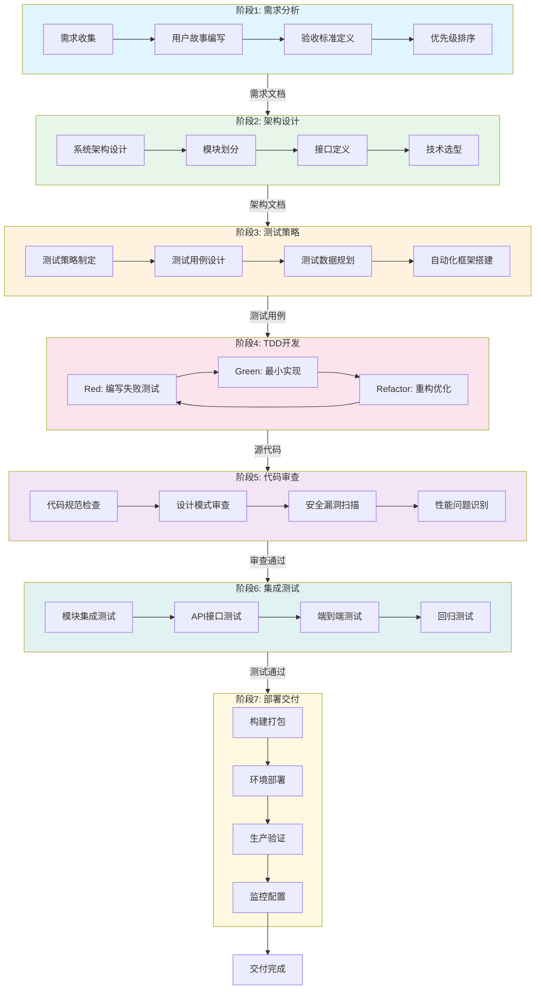

# SDD+TDD 完整工作流

## 工作流名称
SDD+TDD Full Development Workflow（完整软件开发工作流）

## 描述
完整的7阶段SDD（Story-Driven Development）+ TDD（Test-Driven Development）软件开发工作流，适用于中大型项目的系统性开发。该工作流融合了三省六部二十四司协同机制，确保从需求分析到部署交付的全生命周期质量保障。

## 触发条件
- 用户请求完整的软件开发流程
- 项目规模：中大型（预估开发周期 > 2周）
- 需要完整的文档和测试覆盖
- 涉及多个模块或组件的开发
- 用户明确要求"完整流程"、"全生命周期"、"SDD+TDD"

## 涉及的Agent

### 核心Agent
| Agent | 角色 | 职责 |
|-------|------|------|
| product-manager | 产品经理 | 需求分析、用户故事编写 |
| system-architect | 系统架构师 | 架构设计、技术选型 |
| test-architect | 测试架构师 | 测试策略设计 |
| fullstack-engineer | 全栈工程师 | 代码实现 |
| unit-tester | 单元测试工程师 | TDD测试编写 |
| code-reviewer | 代码审查工程师 | 代码质量把关 |
| cicd-specialist | CI/CD专家 | 持续集成部署 |

### 支撑Agent
| Agent | 角色 | 职责 |
|-------|------|------|
| security-auditor | 安全审计师 | 安全检查 |
| performance-tester | 性能测试工程师 | 性能验证 |
| documentation-engineer | 文档工程师 | 文档编写 |

## 阶段定义

### 阶段1：需求分析（Requirement Analysis）
**执行者**: product-manager

**输入**:
- 用户需求描述
- 业务背景信息

**活动**:
1. 需求收集与整理
2. 用户故事编写（User Story）
3. 验收标准定义（Acceptance Criteria）
4. 优先级排序

**输出**:
- 需求规格说明书
- 用户故事列表
- 验收标准文档

**质量门禁**:
- [ ] 所有用户故事符合INVEST原则
- [ ] 验收标准明确可测试
- [ ] 需求已获得用户确认

---

### 阶段2：架构设计（Architecture Design）
**执行者**: system-architect

**输入**:
- 需求规格说明书
- 用户故事列表

**活动**:
1. 系统架构设计
2. 模块划分与接口定义
3. 技术选型决策
4. 数据模型设计

**输出**:
- 架构设计文档
- API接口规范
- 数据模型图
- 技术决策记录（ADR）

**质量门禁**:
- [ ] 架构设计符合SOLID原则
- [ ] 接口定义清晰完整
- [ ] 技术选型有充分理由

---

### 阶段3：测试策略（Test Strategy）
**执行者**: test-architect

**输入**:
- 架构设计文档
- 用户故事列表

**活动**:
1. 测试策略制定
2. 测试用例设计
3. 测试数据规划
4. 自动化测试框架搭建

**输出**:
- 测试策略文档
- 测试用例清单
- 测试数据方案

**质量门禁**:
- [ ] 测试覆盖所有用户故事
- [ ] 测试用例可自动化执行
- [ ] 边界条件和异常场景已覆盖

---

### 阶段4：TDD开发（TDD Development）
**执行者**: fullstack-engineer, unit-tester

**输入**:
- 架构设计文档
- 测试用例清单

**活动**:
1. **Red**: 编写失败的测试用例
2. **Green**: 编写最小代码使测试通过
3. **Refactor**: 重构代码优化结构
4. 循环迭代直到功能完成

**输出**:
- 源代码文件
- 单元测试文件
- 代码覆盖率报告

**质量门禁**:
- [ ] 所有测试用例通过
- [ ] 代码覆盖率 >= 80%
- [ ] 无严重代码异味

---

### 阶段5：代码审查（Code Review）
**执行者**: code-reviewer

**输入**:
- 源代码文件
- 单元测试文件

**活动**:
1. 代码规范检查
2. 设计模式审查
3. 安全漏洞扫描
4. 性能问题识别

**输出**:
- 代码审查报告
- 改进建议清单
- 问题修复确认

**质量门禁**:
- [ ] 无严重代码问题
- [ ] 所有审查意见已处理
- [ ] 代码符合团队规范

---

### 阶段6：集成测试（Integration Testing）
**执行者**: integration-tester, e2e-tester

**输入**:
- 通过审查的代码
- 集成测试用例

**活动**:
1. 模块集成测试
2. API接口测试
3. 端到端测试
4. 回归测试

**输出**:
- 集成测试报告
- E2E测试报告
- 缺陷清单

**质量门禁**:
- [ ] 所有集成测试通过
- [ ] 无P0/P1级缺陷
- [ ] 回归测试通过

---

### 阶段7：部署交付（Deployment）
**执行者**: cicd-specialist

**输入**:
- 测试通过的代码
- 部署配置

**活动**:
1. 构建打包
2. 环境部署
3. 生产验证
4. 监控配置

**输出**:
- 部署包
- 部署报告
- 运维文档

**质量门禁**:
- [ ] 部署成功无错误
- [ ] 生产环境验证通过
- [ ] 监控告警配置完成

## 流程图

## 输出产物清单

| 阶段 | 输出产物 | 格式 |
|------|----------|------|
| 需求分析 | 需求规格说明书 | Markdown |
| 需求分析 | 用户故事列表 | Markdown |
| 架构设计 | 架构设计文档 | Markdown + Mermaid |
| 架构设计 | API接口规范 | OpenAPI/Swagger |
| 测试策略 | 测试策略文档 | Markdown |
| 测试策略 | 测试用例清单 | Markdown |
| TDD开发 | 源代码 | 各语言源文件 |
| TDD开发 | 单元测试 | 测试文件 |
| 代码审查 | 代码审查报告 | Markdown |
| 集成测试 | 测试报告 | Markdown + HTML |
| 部署交付 | 部署包 | 构建产物 |
| 部署交付 | 运维文档 | Markdown |

## 质量保障机制

### 四维防线
1. **需求防线**: 需求评审确保需求清晰完整
2. **设计防线**: 架构评审确保设计合理
3. **编码防线**: TDD + 代码审查确保代码质量
4. **测试防线**: 多层次测试确保功能正确

### 质量指标
| 指标 | 目标值 | 检测方式 |
|------|--------|----------|
| 代码覆盖率 | >= 80% | 自动化工具 |
| 技术债务 | <= 5% | SonarQube |
| 缺陷密度 | <= 0.5/KLOC | 缺陷跟踪 |
| 部署成功率 | >= 99% | CI/CD统计 |

## 回退机制

当某阶段质量门禁未通过时：
1. **阶段内修复**: 在当前阶段内解决问题
2. **回退上一阶段**: 如问题根源在上游，回退并修复
3. **紧急熔断**: 严重问题触发熔断，暂停整个流程

## 执行建议

1. **时间分配**: 需求20% + 设计15% + 测试策略10% + 开发35% + 审查10% + 集成5% + 部署5%
2. **并行策略**: 阶段2和阶段3可并行执行
3. **迭代周期**: 建议每个完整周期不超过4周
4. **文档同步**: 每阶段输出必须及时更新文档
