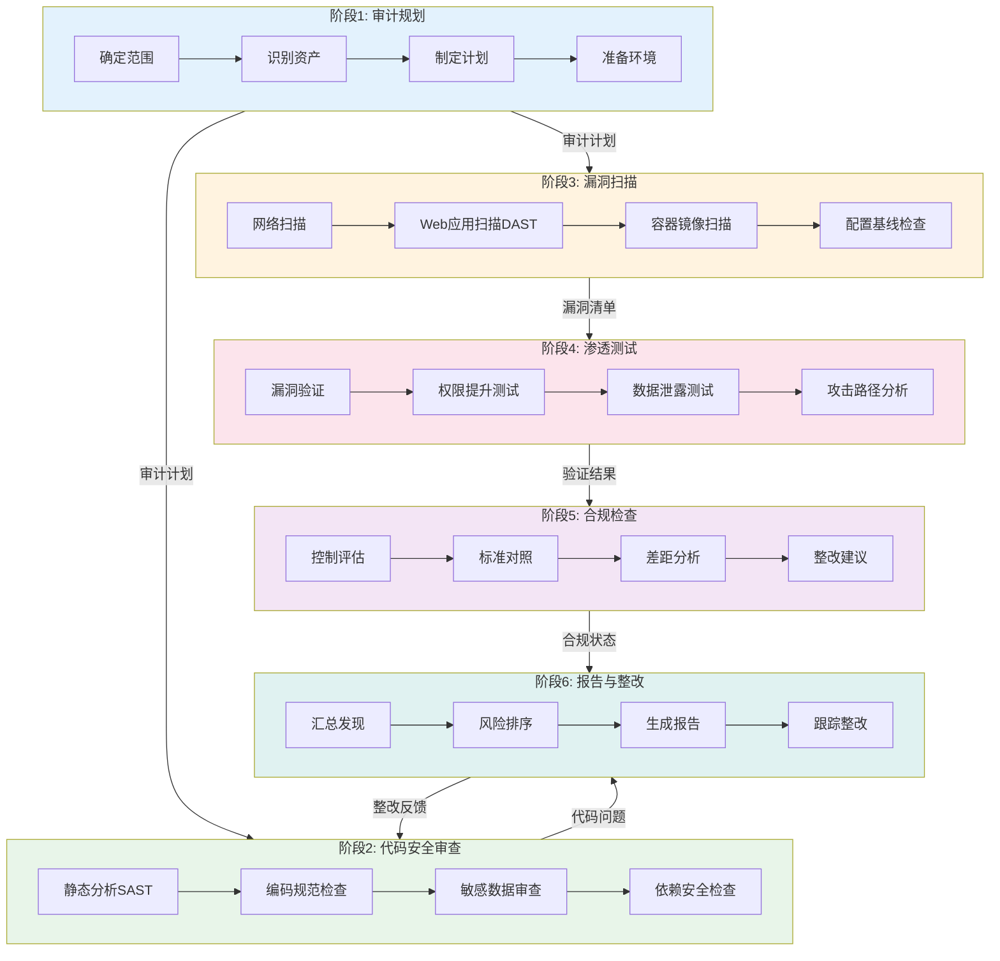

# 安全审计工作流

## 工作流名称
Security Audit Workflow（安全审计工作流）

## 描述
全面的安全审计工作流，涵盖代码安全审查、漏洞扫描、合规检查和安全报告生成。该工作流旨在识别和修复潜在的安全风险，确保系统符合安全标准和法规要求。

## 触发条件
- 用户请求安全审计
- 定期安全检查
- 重大版本发布前
- 安全事件响应
- 合规审计需求
- 用户明确要求"安全审计"、"安全检查"、"漏洞扫描"

## 涉及的Agent

### 核心Agent
| Agent | 角色 | 职责 |
|-------|------|------|
| security-auditor | 安全审计师 | 安全评估、漏洞分析 |
| penetration-tester | 渗透测试工程师 | 渗透测试、漏洞验证 |
| compliance-officer | 合规官 | 合规检查、标准对照 |

### 支撑Agent
| Agent | 角色 | 职责 |
|-------|------|------|
| code-reviewer | 代码审查工程师 | 代码安全审查 |
| devops-engineer | DevOps工程师 | 安全配置检查 |
| cicd-specialist | CI/CD专家 | 安全流水线集成 |

## 阶段定义

### 阶段1：审计规划（Audit Planning）
**执行者**: security-auditor

**输入**:
- 审计范围定义
- 系统架构文档
- 资产清单

**活动**:
1. 确定审计范围和目标
2. 识别关键资产和系统
3. 制定审计计划
4. 准备审计工具和环境

**输出**:
- 审计计划书
- 资产清单
- 风险评估矩阵

**质量门禁**:
- [ ] 审计范围明确
- [ ] 关键资产已识别
- [ ] 审计计划已批准

---

### 阶段2：代码安全审查（Code Security Review）
**执行者**: security-auditor, code-reviewer

**输入**:
- 源代码仓库
- 代码安全规则

**活动**:
1. 静态代码分析（SAST）
2. 安全编码规范检查
3. 敏感数据处理审查
4. 第三方依赖安全检查

**输出**:
- SAST扫描报告
- 代码安全问题清单
- 依赖漏洞报告

**质量门禁**:
- [ ] 所有代码已扫描
- [ ] 高危漏洞已识别
- [ ] 依赖漏洞已评估

---

### 阶段3：漏洞扫描（Vulnerability Scanning）
**执行者**: security-auditor

**输入**:
- 目标系统
- 扫描配置

**活动**:
1. 网络漏洞扫描
2. Web应用扫描（DAST）
3. 容器镜像扫描
4. 配置基线检查

**输出**:
- 漏洞扫描报告
- 配置问题清单
- 风险评级报告

**质量门禁**:
- [ ] 扫描覆盖完整
- [ ] 漏洞已分类评级
- [ ] 紧急漏洞已标记

---

### 阶段4：渗透测试（Penetration Testing）
**执行者**: penetration-tester

**输入**:
- 漏洞扫描报告
- 测试授权

**活动**:
1. 漏洞验证与利用
2. 权限提升测试
3. 数据泄露测试
4. 攻击路径分析

**输出**:
- 渗透测试报告
- 漏洞利用证明
- 攻击链分析

**质量门禁**:
- [ ] 关键漏洞已验证
- [ ] 攻击路径已记录
- [ ] 测试环境已恢复

---

### 阶段5：合规检查（Compliance Check）
**执行者**: compliance-officer

**输入**:
- 系统配置
- 审计证据
- 合规标准

**活动**:
1. 安全控制评估
2. 合规标准对照
3. 差距分析
4. 整改建议

**输出**:
- 合规检查报告
- 差距分析报告
- 整改计划

**质量门禁**:
- [ ] 合规标准已对照
- [ ] 差距已识别
- [ ] 整改计划已制定

---

### 阶段6：报告与整改（Reporting & Remediation）
**执行者**: security-auditor

**输入**:
- 各阶段审计结果
- 整改计划

**活动**:
1. 汇总审计发现
2. 风险优先级排序
3. 生成审计报告
4. 跟踪整改进度

**输出**:
- 安全审计报告
- 风险清单
- 整改跟踪表

**质量门禁**:
- [ ] 报告完整准确
- [ ] 风险已评级
- [ ] 整改责任已分配

## 流程图

## 输出产物清单

| 阶段 | 输出产物 | 格式 |
|------|----------|------|
| 审计规划 | 审计计划书 | Markdown |
| 审计规划 | 资产清单 | Markdown/Excel |
| 审计规划 | 风险评估矩阵 | Markdown |
| 代码审查 | SAST扫描报告 | HTML/PDF |
| 代码审查 | 依赖漏洞报告 | JSON/Markdown |
| 漏洞扫描 | 漏洞扫描报告 | HTML/PDF |
| 漏洞扫描 | 配置问题清单 | Markdown |
| 渗透测试 | 渗透测试报告 | PDF |
| 渗透测试 | 攻击链分析 | Mermaid |
| 合规检查 | 合规检查报告 | PDF |
| 合规检查 | 差距分析报告 | Markdown |
| 报告整改 | 安全审计报告 | PDF |
| 报告整改 | 整改跟踪表 | Excel/Markdown |

## 安全风险评级标准

### 严重程度分级

| 级别 | 描述 | 响应时间 | 示例 |
|------|------|----------|------|
| **Critical** | 可直接导致系统被完全控制或数据泄露 | 立即修复 | SQL注入、RCE |
| **High** | 可导致敏感数据泄露或权限提升 | 24小时内 | XSS、认证绕过 |
| **Medium** | 可能导致有限的数据泄露或服务中断 | 7天内 | 信息泄露、CSRF |
| **Low** | 影响有限，难以利用 | 30天内 | 版本信息泄露 |
| **Info** | 信息性问题，建议改进 | 下次迭代 | 缺少安全头 |

## 常见安全检查项

### 代码安全
- [ ] 输入验证和输出编码
- [ ] SQL注入防护
- [ ] XSS防护
- [ ] CSRF防护
- [ ] 认证和会话管理
- [ ] 访问控制
- [ ] 加密存储
- [ ] 敏感数据处理
- [ ] 日志和监控
- [ ] 错误处理

### 基础设施安全
- [ ] 网络隔离
- [ ] 防火墙配置
- [ ] 入侵检测
- [ ] 补丁管理
- [ ] 备份恢复
- [ ] 访问日志
- [ ] 加密传输
- [ ] 密钥管理

### 合规标准参考
- OWASP Top 10
- CWE/SANS Top 25
- PCI DSS
- ISO 27001
- SOC 2
- GDPR
- 等保2.0

## 执行建议

1. **定期执行**: 建议每季度进行一次全面审计
2. **自动化集成**: 将安全扫描集成到CI/CD流水线
3. **持续监控**: 部署安全监控和告警系统
4. **培训教育**: 定期进行安全意识培训
5. **应急响应**: 建立安全事件响应机制

## 审计工具推荐

### SAST工具
- SonarQube
- Checkmarx
- Fortify
- Semgrep

### DAST工具
- OWASP ZAP
- Burp Suite
- Acunetix

### 依赖扫描
- Snyk
- Dependabot
- OWASP Dependency-Check

### 容器安全
- Trivy
- Clair
- Anchore
