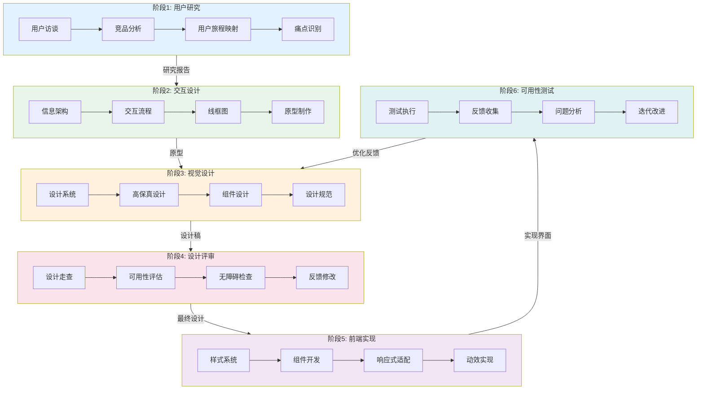

# UI/UX 设计工作流

## 工作流名称
UI/UX Design Workflow（用户界面与体验设计工作流）

## 描述
专注于用户界面设计和用户体验优化的工作流，涵盖从用户研究到设计交付的完整流程。该工作流强调以用户为中心的设计理念，确保产品既美观又易用。

## 触发条件
- 用户请求UI/UX设计
- 新功能界面设计
- 现有界面优化
- 用户体验改进
- 设计系统构建
- 用户明确要求"UI设计"、"UX设计"、"界面设计"、"用户体验"

## 涉及的Agent

### 核心Agent
| Agent | 角色 | 职责 |
|-------|------|------|
| ux-designer | UX设计师 | 用户研究、交互设计 |
| ui-designer | UI设计师 | 视觉设计、组件设计 |
| frontend-stylist | 前端样式工程师 | 样式实现、响应式适配 |
| frontend-developer | 前端工程师 | 组件开发 |

### 支撑Agent
| Agent | 角色 | 职责 |
|-------|------|------|
| product-manager | 产品经理 | 需求确认、优先级 |
| e2e-tester | E2E测试工程师 | 可用性测试 |

## 阶段定义

### 阶段1：用户研究（User Research）
**执行者**: ux-designer

**输入**:
- 产品需求
- 用户画像
- 业务目标

**活动**:
1. 用户访谈与分析
2. 竞品分析
3. 用户旅程映射
4. 痛点识别

**输出**:
- 用户研究报告
- 用户旅程图
- 痛点清单

**质量门禁**:
- [ ] 用户画像清晰
- [ ] 关键痛点已识别
- [ ] 用户旅程完整

---

### 阶段2：交互设计（Interaction Design）
**执行者**: ux-designer

**输入**:
- 用户研究报告
- 痛点清单

**活动**:
1. 信息架构设计
2. 交互流程设计
3. 线框图绘制
4. 原型制作

**输出**:
- 信息架构图
- 交互流程图
- 低保真原型
- 交互说明文档

**质量门禁**:
- [ ] 信息架构合理
- [ ] 交互流程清晰
- [ ] 原型可演示

---

### 阶段3：视觉设计（Visual Design）
**执行者**: ui-designer

**输入**:
- 低保真原型
- 品牌规范

**活动**:
1. 设计系统定义
2. 高保真设计稿
3. 组件设计
4. 设计规范文档

**输出**:
- 高保真设计稿
- 设计系统文档
- 组件库规范
- 切图资源

**质量门禁**:
- [ ] 设计符合品牌规范
- [ ] 组件可复用
- [ ] 设计规范完整

---

### 阶段4：设计评审（Design Review）
**执行者**: ux-designer, ui-designer, product-manager

**输入**:
- 高保真设计稿
- 设计规范文档

**活动**:
1. 设计走查
2. 可用性评估
3. 无障碍检查
4. 反馈收集与修改

**输出**:
- 设计评审报告
- 修改清单
- 最终设计稿

**质量门禁**:
- [ ] 设计评审通过
- [ ] 无障碍标准达标
- [ ] 产品确认验收

---

### 阶段5：前端实现（Frontend Implementation）
**执行者**: frontend-stylist, frontend-developer

**输入**:
- 最终设计稿
- 设计规范文档
- 切图资源

**活动**:
1. 样式系统搭建
2. 组件开发
3. 响应式适配
4. 动效实现

**输出**:
- 样式代码
- UI组件库
- 响应式页面

**质量门禁**:
- [ ] 还原度 >= 95%
- [ ] 响应式适配完成
- [ ] 动效流畅

---

### 阶段6：可用性测试（Usability Testing）
**执行者**: ux-designer, e2e-tester

**输入**:
- 实现的界面
- 测试用户

**活动**:
1. 可用性测试执行
2. 用户反馈收集
3. 问题分析与优化
4. 迭代改进

**输出**:
- 可用性测试报告
- 优化建议清单
- 迭代版本

**质量门禁**:
- [ ] 任务完成率 >= 80%
- [ ] 用户满意度 >= 4/5
- [ ] 关键问题已修复

## 流程图

## 输出产物清单

| 阶段 | 输出产物 | 格式 |
|------|----------|------|
| 用户研究 | 用户研究报告 | Markdown/PDF |
| 用户研究 | 用户旅程图 | Mermaid/Figma |
| 交互设计 | 信息架构图 | Mermaid |
| 交互设计 | 低保真原型 | Figma/Sketch |
| 视觉设计 | 高保真设计稿 | Figma/Sketch |
| 视觉设计 | 设计系统文档 | Markdown |
| 视觉设计 | 组件规范 | Storybook |
| 前端实现 | 样式代码 | CSS/SCSS/Tailwind |
| 前端实现 | UI组件 | React/Vue组件 |
| 可用性测试 | 测试报告 | Markdown/PDF |

## 设计原则

### UX设计原则
1. **用户优先**: 所有设计决策以用户需求为中心
2. **简洁明了**: 减少认知负担，界面简洁直观
3. **一致性**: 保持交互和视觉的一致性
4. **反馈及时**: 提供清晰的操作反馈
5. **容错设计**: 预防错误，提供恢复机制

### UI设计原则
1. **视觉层次**: 通过对比、大小、颜色建立层次
2. **对齐与间距**: 遵循网格系统，保持对齐
3. **色彩和谐**: 使用协调的配色方案
4. **字体易读**: 选择合适的字体和字号
5. **响应式**: 适配不同设备和屏幕尺寸

## 无障碍标准

遵循 WCAG 2.1 AA 级别标准：
- **可感知**: 信息和UI组件必须可被用户感知
- **可操作**: UI组件和导航必须可操作
- **可理解**: 信息和UI操作必须可理解
- **健壮性**: 内容必须足够健壮以适应各种用户代理

## 工具与资源

### 设计工具
- Figma: 协作设计
- Sketch: macOS设计
- Adobe XD: 原型设计

### 前端框架
- Tailwind CSS: 原子化CSS
- shadcn/ui: React组件库
- Radix UI: 无障碍组件

### 设计系统参考
- Material Design
- Apple Human Interface Guidelines
- Ant Design

## 执行建议

1. **早期介入**: UX设计师应尽早参与需求讨论
2. **迭代设计**: 设计是一个迭代过程，允许多轮修改
3. **用户验证**: 关键设计决策应有用户数据支撑
4. **开发协作**: 设计师与开发者保持紧密沟通
5. **文档同步**: 设计变更及时更新文档
