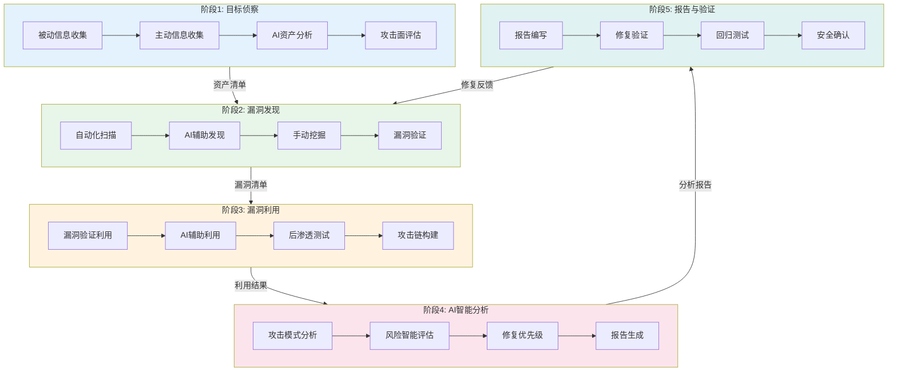

---
metadata:
  name: AI渗透测试工作流
  version: "1.8.0"
  description: AI驱动渗透测试与Agentic安全验证
  platform: all
  min_agents: 2
  max_agents: 4
phases:
  - id: phase-1
    name: 目标侦察
    order: 1
    optional: false
    trigger_condition: 用户请求AI渗透测试或安全评估
    agents:
      primary: [ai-penetration-tester, penetration-tester]
      supporting: []
    quality_gates:
      - gate_id: scope_confirmed
        blocking: true
        pass_criteria: 授权范围已确认
      - gate_id: assets_identified
        blocking: true
        pass_criteria: 关键资产已识别
  - id: phase-2
    name: 漏洞发现
    order: 2
    optional: false
    agents:
      primary: [ai-penetration-tester, penetration-tester]
      supporting: [security-auditor]
    quality_gates:
      - gate_id: scan_complete
        blocking: true
        pass_criteria: 扫描覆盖完整
  - id: phase-3
    name: 漏洞利用
    order: 3
    optional: false
    agents:
      primary: [penetration-tester, ai-penetration-tester]
      supporting: []
    quality_gates:
      - gate_id: vulns_verified
        blocking: true
        pass_criteria: 漏洞已验证
      - gate_id: false_positives_removed
        blocking: true
        pass_criteria: 误报已排除
  - id: phase-4
    name: AI智能分析
    order: 4
    optional: false
    agents:
      primary: [ai-penetration-tester]
      supporting: [security-auditor]
    quality_gates:
      - gate_id: critical_exploited
        blocking: true
        pass_criteria: 关键漏洞已验证利用
  - id: phase-5
    name: 报告与修复验证
    order: 5
    optional: false
    agents:
      primary: [ai-penetration-tester, security-auditor]
      supporting: [penetration-tester]
    quality_gates:
      - gate_id: report_complete
        blocking: true
        pass_criteria: 报告完整准确
agent_matrix:
  ai-penetration-tester:
    phases: [phase-1, phase-2, phase-3, phase-4, phase-5]
    role: primary
    max_parallel_instances: 1
  penetration-tester:
    phases: [phase-1, phase-2, phase-3, phase-5]
    role: primary
    max_parallel_instances: 1
  security-auditor:
    phases: [phase-2, phase-4, phase-5]
    role: primary
    max_parallel_instances: 1
exception_handling:
  phase_failure:
    action: retry_then_escalate
    escalation_target: orchestrator
    max_retries: 3
  agent_unavailable:
    action: substitute_and_continue
    substitute_agent: penetration-tester
  quality_gate_blocked:
    action: auto_fix_then_pause
    auto_fix_agents: [ai-penetration-tester, penetration-tester]
---

# AI渗透测试工作流

## 工作流名称
AI Penetration Testing Workflow（AI驱动的渗透测试工作流）

## 描述
利用AI技术增强的渗透测试工作流，结合自动化扫描与智能分析，高效识别系统安全漏洞。该工作流融合传统渗透测试方法与AI辅助分析，提供更全面、更智能的安全测试能力。

## 触发条件
- 用户请求AI渗透测试
- 安全评估需求
- 系统上线前安全验证
- 红队演练
- 安全合规要求
- 用户明确要求"AI渗透测试"、"智能渗透"、"红队测试"

## 涉及的Agent

### 核心Agent
| Agent | 角色 | 职责 |
|-------|------|------|
| ai-penetration-tester | AI渗透测试工程师 | AI辅助渗透、智能分析 |
| penetration-tester | 渗透测试工程师 | 传统渗透测试、漏洞验证 |
| security-auditor | 安全审计师 | 安全评估、风险分析 |

### 支撑Agent
| Agent | 角色 | 职责 |
|-------|------|------|
| security-tester | 安全测试工程师 | 自动化测试执行 |
| compliance-officer | 合规官 | 测试授权、合规确认 |

## 阶段定义

### 阶段1：目标侦察（Reconnaissance）
**执行者**: ai-penetration-tester

**输入**:
- 测试目标范围
- 测试授权书

**活动**:
1. 被动信息收集
   - 域名信息收集
   - WHOIS查询
   - 搜索引擎信息
   - 社交工程信息
2. 主动信息收集
   - 端口扫描
   - 服务识别
   - 目录枚举
   - 子域名发现
3. AI辅助分析
   - 智能资产发现
   - 攻击面分析
   - 目标优先级排序

**输出**:
- 资产清单
- 攻击面地图
- 目标优先级列表

**质量门禁**:
- [ ] 授权范围已确认
- [ ] 关键资产已识别
- [ ] 攻击面已分析

---

### 阶段2：漏洞发现（Vulnerability Discovery）
**执行者**: ai-penetration-tester, penetration-tester

**输入**:
- 资产清单
- 攻击面地图

**活动**:
1. 自动化漏洞扫描
   - 网络漏洞扫描
   - Web应用扫描
   - API安全测试
2. AI辅助漏洞发现
   - 智能模糊测试
   - 参数污染测试
   - 逻辑漏洞检测
   - 零日漏洞推测
3. 手动漏洞挖掘
   - 业务逻辑分析
   - 权限绕过测试
   - 认证机制测试

**输出**:
- 漏洞清单
- 漏洞详情报告
- AI分析建议

**质量门禁**:
- [ ] 扫描覆盖完整
- [ ] 漏洞已验证
- [ ] 误报已排除

---

### 阶段3：漏洞利用（Exploitation）
**执行者**: penetration-tester

**输入**:
- 漏洞清单
- 测试环境

**活动**:
1. 漏洞验证利用
   - PoC开发与验证
   - 漏洞利用链构建
   - 权限获取测试
2. AI辅助利用
   - 智能Payload生成
   - 绕过技术建议
   - 利用路径优化
3. 后渗透测试
   - 权限提升
   - 横向移动
   - 持久化测试

**输出**:
- 漏洞利用报告
- PoC代码
- 攻击链图

**质量门禁**:
- [ ] 关键漏洞已验证
- [ ] 攻击路径已记录
- [ ] 测试痕迹已清理

---

### 阶段4：AI智能分析（AI Analysis）
**执行者**: ai-penetration-tester

**输入**:
- 测试数据
- 漏洞利用结果

**活动**:
1. 攻击模式分析
   - 攻击路径建模
   - 攻击成本评估
   - 攻击者画像
2. 风险智能评估
   - 漏洞组合分析
   - 业务影响评估
   - 修复优先级建议
3. AI生成报告
   - 自然语言报告
   - 修复建议生成
   - 安全趋势分析

**输出**:
- AI分析报告
- 风险评估矩阵
- 修复优先级建议

**质量门禁**:
- [ ] 分析结果准确
- [ ] 建议可执行
- [ ] 报告清晰易懂

---

### 阶段5：报告与修复验证（Reporting & Verification）
**执行者**: penetration-tester, security-auditor

**输入**:
- 测试结果
- AI分析报告

**活动**:
1. 渗透测试报告编写
   - 执行摘要
   - 详细发现
   - 风险评级
   - 修复建议
2. 修复验证测试
   - 修复效果验证
   - 回归测试
   - 安全确认

**输出**:
- 渗透测试报告
- 修复验证报告
- 安全改进建议

**质量门禁**:
- [ ] 报告完整准确
- [ ] 高危漏洞已修复
- [ ] 验证测试通过

## 流程图

## 输出产物清单

| 阶段 | 输出产物 | 格式 |
|------|----------|------|
| 目标侦察 | 资产清单 | Markdown/Excel |
| 目标侦察 | 攻击面地图 | Mermaid |
| 目标侦察 | 目标优先级列表 | Markdown |
| 漏洞发现 | 漏洞清单 | Markdown/JSON |
| 漏洞发现 | 漏洞详情报告 | Markdown |
| 漏洞利用 | 漏洞利用报告 | PDF |
| 漏洞利用 | PoC代码 | Python/脚本 |
| 漏洞利用 | 攻击链图 | Mermaid |
| AI分析 | AI分析报告 | Markdown/PDF |
| AI分析 | 风险评估矩阵 | Markdown |
| 报告验证 | 渗透测试报告 | PDF |
| 报告验证 | 修复验证报告 | Markdown |

## AI辅助能力

### 智能侦察
- **资产发现**: AI自动发现关联资产和隐藏服务
- **信息关联**: 自动关联多源信息，发现潜在攻击面
- **优先级排序**: 基于风险模型智能排序测试目标

### 智能漏洞发现
- **模糊测试优化**: AI生成针对性测试用例
- **逻辑漏洞检测**: 分析业务逻辑，发现设计缺陷
- **零日推测**: 基于已知模式推测潜在漏洞

### 智能利用
- **Payload生成**: AI生成定制化攻击载荷
- **绕过技术**: 智能推荐WAF/过滤绕过方法
- **利用优化**: 优化攻击路径，提高成功率

### 智能报告
- **自然语言生成**: 自动生成易读的测试报告
- **修复建议**: 智能生成针对性修复建议
- **趋势分析**: 分析安全趋势，预测未来风险

## 渗透测试方法论

### PTES标准
遵循渗透测试执行标准（PTES）：
1. 前期交互
2. 信息收集
3. 威胁建模
4. 漏洞分析
5. 漏洞利用
6. 后渗透
7. 报告

### OWASP测试指南
Web应用测试覆盖：
- 信息收集
- 配置管理
- 身份认证
- 授权测试
- 会话管理
- 输入验证
- 错误处理
- 密码学
- 业务逻辑

## 安全合规要求

### 测试授权
- [ ] 书面授权已获取
- [ ] 测试范围已明确
- [ ] 测试时间已确认
- [ ] 紧急联系人已确定

### 测试约束
- 不影响业务正常运行
- 不泄露敏感数据
- 不安装持久化后门
- 测试完成后清理痕迹

### 数据保护
- 测试数据加密存储
- 敏感信息脱敏处理
- 报告安全传输
- 数据定期销毁

## 执行建议

1. **授权优先**: 确保获得合法授权后再开始测试
2. **安全边界**: 明确测试范围，避免越界
3. **数据保护**: 保护测试过程中获取的敏感数据
4. **及时沟通**: 发现高危漏洞立即通知
5. **痕迹清理**: 测试完成后清理所有测试痕迹
6. **知识更新**: 持续学习新的攻击技术和防御方法

## 工具推荐

### 侦察工具
- Nmap, Masscan
- Subfinder, Amass
- Shodan, Censys
- theHarvester

### 漏洞扫描
- Nessus, OpenVAS
- Burp Suite, OWASP ZAP
- Nuclei, Goby

### 利用框架
- Metasploit
- Cobalt Strike
- ExploitDB

### AI辅助工具
- GPT Security Tools
- AI Fuzzing Frameworks
- ML-based Vulnerability Scanners

## 安全修复闭环

AI渗透测试发现的漏洞须遵循[安全修复5步闭环](security-audit.md#安全修复5步闭环)流程：
1. 本Agent发现漏洞并生成报告
2. Security Auditor验证漏洞真实性
3. Developer编写修复代码
4. Test Architect生成回归测试
5. 本Agent执行复测确认修复

闭环详细定义见 [security-audit.md](security-audit.md)
