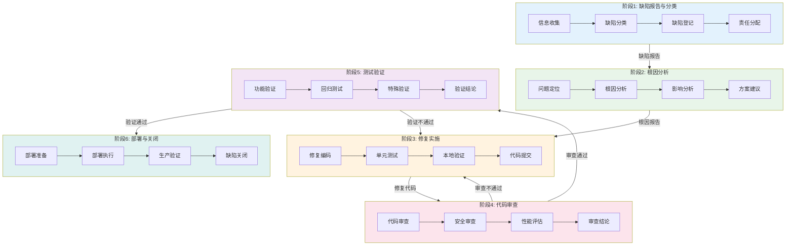
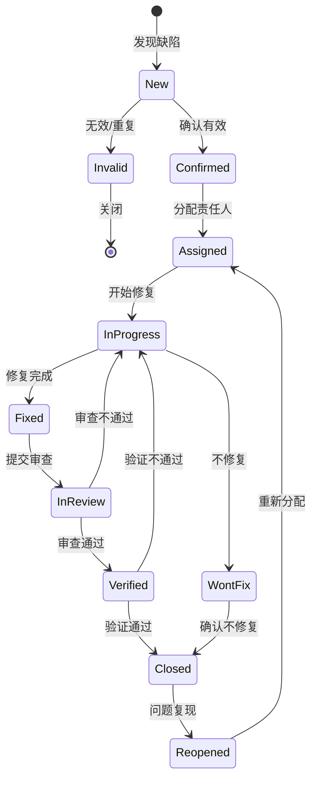
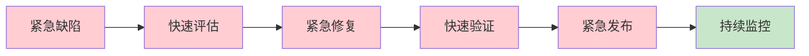

---
metadata:
  name: TDD驱动Bug修复工作流
  version: "1.8.0"
  description: TDD驱动缺陷修复与回归验证工作流
  platform: all
  min_agents: 2
  max_agents: 5
phases:
  - id: phase-1
    name: 缺陷报告与分类
    order: 1
    optional: false
    trigger_condition: 用户报告Bug或测试发现缺陷
    agents:
      primary: [fullstack-engineer, product-manager]
      supporting: []
    quality_gates:
      - gate_id: bug_reproducible
        blocking: true
        pass_criteria: 缺陷可复现
  - id: phase-2
    name: 根因分析
    order: 2
    optional: false
    agents:
      primary: [fullstack-engineer]
      supporting: [code-reviewer]
    quality_gates:
      - gate_id: root_cause_found
        blocking: true
        pass_criteria: 根因已确定且影响范围已评估
  - id: phase-3
    name: 修复实施
    order: 3
    optional: false
    agents:
      primary: [fullstack-engineer, unit-tester]
      supporting: [security-auditor]
    quality_gates:
      - gate_id: fix_complete
        blocking: true
        pass_criteria: 代码修改完成
      - gate_id: unit_test_pass
        blocking: true
        pass_criteria: 单元测试通过
  - id: phase-4
    name: 代码审查
    order: 4
    optional: false
    agents:
      primary: [code-reviewer]
      supporting: [security-auditor]
    quality_gates:
      - gate_id: code_review_pass
        blocking: true
        pass_criteria: 代码审查通过
      - gate_id: no_security_issue
        blocking: true
        pass_criteria: 无安全问题
  - id: phase-5
    name: 测试验证
    order: 5
    optional: false
    agents:
      primary: [unit-tester, test-maintainer]
      supporting: [fullstack-engineer]
    quality_gates:
      - gate_id: bug_fixed
        blocking: true
        pass_criteria: 缺陷已修复
      - gate_id: regression_pass
        blocking: true
        pass_criteria: 回归测试通过
      - gate_id: no_new_defects
        blocking: true
        pass_criteria: 无新缺陷引入
  - id: phase-6
    name: 部署与关闭
    order: 6
    optional: false
    agents:
      primary: [fullstack-engineer, product-manager]
      supporting: []
    quality_gates:
      - gate_id: deploy_success
        blocking: true
        pass_criteria: 部署成功
      - gate_id: production_verified
        blocking: true
        pass_criteria: 生产验证通过
agent_matrix:
  fullstack-engineer:
    phases: [phase-1, phase-2, phase-3, phase-6]
    role: primary
    max_parallel_instances: 2
  unit-tester:
    phases: [phase-3, phase-5]
    role: primary
    max_parallel_instances: 1
  code-reviewer:
    phases: [phase-2, phase-4]
    role: primary
    max_parallel_instances: 1
  test-maintainer:
    phases: [phase-5]
    role: primary
    max_parallel_instances: 1
  security-auditor:
    phases: [phase-3, phase-4]
    role: supporting
    max_parallel_instances: 1
  product-manager:
    phases: [phase-1, phase-6]
    role: supporting
    max_parallel_instances: 1
exception_handling:
  phase_failure:
    action: retry_then_escalate
    escalation_target: orchestrator
    max_retries: 3
  agent_unavailable:
    action: substitute_and_continue
    substitute_agent: fullstack-engineer
  quality_gate_blocked:
    action: auto_fix_then_pause
    auto_fix_agents: [fullstack-engineer, unit-tester]
---

# Bug修复工作流

## 工作流名称
Bug Fix Workflow（缺陷修复工作流）

## 描述
系统化的缺陷修复工作流，涵盖缺陷报告、分析、修复、验证和关闭的完整流程。该工作流确保缺陷得到及时有效的处理，同时防止引入新的问题。

## 触发条件
- 用户报告Bug
- 测试发现缺陷
- 生产环境问题
- 安全漏洞报告
- 用户明确要求"修复Bug"、"解决缺陷"、"Bug修复"

## 涉及的Agent

### 核心Agent
| Agent | 角色 | 职责 |
|-------|------|------|
| fullstack-engineer | 全栈工程师 | 缺陷分析与修复 |
| unit-tester | 单元测试工程师 | 修复验证测试 |
| code-reviewer | 代码审查工程师 | 修复代码审查 |

### 支撑Agent
| Agent | 角色 | 职责 |
|-------|------|------|
| test-maintainer | 测试维护工程师 | 回归测试 |
| security-auditor | 安全审计师 | 安全缺陷评估 |
| product-manager | 产品经理 | 优先级确认 |

## 阶段定义

### 阶段1：缺陷报告与分类（Bug Report & Classification）
**执行者**: product-manager, fullstack-engineer

**输入**:
- 缺陷描述
- 复现步骤
- 环境信息

**活动**:
1. 缺陷信息收集
   - 缺陷描述确认
   - 复现步骤验证
   - 环境信息收集
   - 影响范围评估
2. 缺陷分类
   - 严重程度分级
   - 优先级确定
   - 模块归属
   - 责任人分配
3. 缺陷登记
   - 缺陷跟踪系统录入
   - 相关信息关联
   - 通知相关人员

**输出**:
- 缺陷报告
- 缺陷分类结果
- 缺陷跟踪记录

**质量门禁**:
- [ ] 缺陷可复现
- [ ] 分类准确
- [ ] 责任人已分配

---

### 阶段2：根因分析（Root Cause Analysis）
**执行者**: fullstack-engineer

**输入**:
- 缺陷报告
- 源代码
- 日志文件

**活动**:
1. 问题定位
   - 代码审查定位
   - 日志分析
   - 调试追踪
   - 数据分析
2. 根因分析
   - 5 Why分析法
   - 鱼骨图分析
   - 代码逻辑分析
   - 环境因素分析
3. 影响分析
   - 影响范围评估
   - 关联功能分析
   - 风险评估

**输出**:
- 根因分析报告
- 影响范围文档
- 修复方案建议

**质量门禁**:
- [ ] 根因已确定
- [ ] 影响范围已评估
- [ ] 修复方案可行

---

### 阶段3：修复实施（Fix Implementation）
**执行者**: fullstack-engineer, unit-tester

**输入**:
- 根因分析报告
- 修复方案

**活动**:
1. 修复编码
   - 代码修改
   - 遵循编码规范
   - 添加必要注释
2. 单元测试
   - 编写/更新测试用例
   - 验证修复效果
   - 边界条件测试
3. 本地验证
   - 本地环境测试
   - 功能验证
   - 回归验证

**输出**:
- 修复代码
- 测试代码
- 本地验证报告

**质量门禁**:
- [ ] 代码修改完成
- [ ] 单元测试通过
- [ ] 本地验证通过

---

### 阶段4：代码审查（Code Review）
**执行者**: code-reviewer

**输入**:
- 修复代码
- 测试代码
- 根因分析报告

**活动**:
1. 代码审查
   - 修复逻辑正确性
   - 代码规范检查
   - 潜在问题识别
2. 安全审查
   - 安全影响评估
   - 漏洞引入检查
   - 敏感数据处理
3. 性能评估
   - 性能影响分析
   - 资源消耗评估

**输出**:
- 代码审查报告
- 修改建议
- 审查通过确认

**质量门禁**:
- [ ] 代码审查通过
- [ ] 无安全问题
- [ ] 无性能退化

---

### 阶段5：测试验证（Test Verification）
**执行者**: unit-tester, test-maintainer

**输入**:
- 审查通过的代码
- 测试环境

**活动**:
1. 功能验证
   - 缺陷复现验证
   - 修复效果验证
   - 边界条件测试
2. 回归测试
   - 相关功能回归
   - 集成测试
   - E2E测试
3. 特殊验证
   - 安全验证（安全缺陷）
   - 性能验证（性能缺陷）
   - 兼容性验证

**输出**:
- 测试验证报告
- 回归测试报告
- 验证通过确认

**质量门禁**:
- [ ] 缺陷已修复
- [ ] 回归测试通过
- [ ] 无新缺陷引入

---

### 阶段6：部署与关闭（Deployment & Closure）
**执行者**: fullstack-engineer, product-manager

**输入**:
- 验证通过的代码
- 部署环境

**活动**:
1. 部署准备
   - 部署计划制定
   - 回滚方案准备
   - 监控配置
2. 部署执行
   - 代码部署
   - 配置更新
   - 服务重启
3. 生产验证
   - 生产环境验证
   - 监控观察
   - 用户反馈收集
4. 缺陷关闭
   - 缺陷状态更新
   - 修复记录归档
   - 经验总结

**输出**:
- 部署记录
- 生产验证报告
- 缺陷关闭记录

**质量门禁**:
- [ ] 部署成功
- [ ] 生产验证通过
- [ ] 缺陷已关闭

## 流程图



## 输出产物清单

| 阶段 | 输出产物 | 格式 |
|------|----------|------|
| 缺陷报告 | 缺陷报告 | Markdown/工单系统 |
| 缺陷报告 | 缺陷分类结果 | Markdown |
| 根因分析 | 根因分析报告 | Markdown |
| 根因分析 | 影响范围文档 | Markdown |
| 修复实施 | 修复代码 | 源代码文件 |
| 修复实施 | 测试代码 | 测试文件 |
| 代码审查 | 代码审查报告 | Markdown |
| 测试验证 | 测试验证报告 | Markdown |
| 测试验证 | 回归测试报告 | Markdown |
| 部署关闭 | 部署记录 | Markdown |
| 部署关闭 | 缺陷关闭记录 | 工单系统 |

## 缺陷严重程度分级

| 级别 | 名称 | 描述 | 响应时间 | 示例 |
|------|------|------|----------|------|
| **P0** | 致命 | 系统崩溃、数据丢失、安全漏洞 | 立即响应 | 服务不可用、数据泄露 |
| **P1** | 严重 | 核心功能不可用、严重影响用户 | 4小时内 | 支付失败、登录失败 |
| **P2** | 重要 | 主要功能异常、影响部分用户 | 24小时内 | 搜索结果错误、报表数据不准 |
| **P3** | 一般 | 次要功能问题、用户体验影响 | 3天内 | UI显示异常、提示信息不清 |
| **P4** | 轻微 | 小问题、建议优化 | 下版本 | 文案错误、样式微调 |

## 缺陷状态流转



## 根因分析方法

### 5 Why分析法
```
问题：用户无法登录
Why 1: 登录接口返回错误
Why 2: 数据库连接超时
Why 3: 数据库连接池耗尽
Why 4: 连接未正确释放
Why 5: 异常处理中缺少连接释放代码
根因：异常处理逻辑不完整
```

### 鱼骨图分析维度
- **人（People）**: 操作错误、培训不足
- **流程（Process）**: 流程缺陷、规范缺失
- **技术（Technology）**: 代码缺陷、架构问题
- **环境（Environment）**: 配置问题、资源不足
- **数据（Data）**: 数据异常、数据质量

## 修复最佳实践

### 修复原则
1. **最小修改**: 只修改必要的代码
2. **测试先行**: 先写失败的测试用例
3. **根因修复**: 解决根本原因而非表面现象
4. **防止复发**: 添加防护措施防止同类问题

### 代码修改规范
- 添加清晰的注释说明修复内容
- 遵循现有代码风格
- 不引入新的技术债务
- 考虑向后兼容性

### 测试要求
- 必须有对应的测试用例
- 覆盖修复场景和边界条件
- 执行相关功能的回归测试
- 安全缺陷需安全测试验证

## 紧急修复流程

对于P0级紧急缺陷，采用快速通道：



### 紧急修复特点
- 跳过部分审批流程
- 简化但必要的测试
- 快速部署机制
- 事后补充完整文档
- 事后复盘总结

## 执行建议

1. **及时响应**: 根据优先级及时响应缺陷
2. **充分沟通**: 修复过程中保持沟通
3. **文档记录**: 详细记录分析和修复过程
4. **知识沉淀**: 将经验转化为知识库
5. **持续改进**: 定期分析缺陷模式，改进开发流程
6. **预防为主**: 通过代码审查、自动化测试等手段预防缺陷
