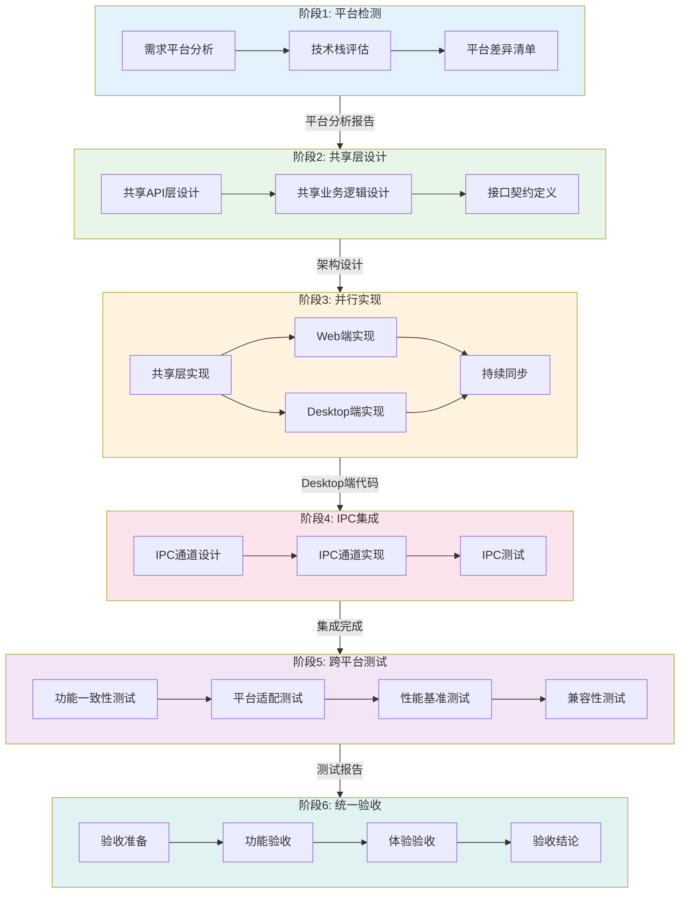

---
metadata:
  name: 跨平台协作开发工作流
  version: "1.8.0"
  description: 跨平台桌面与Web协同开发工作流
  platform: cross-platform
  min_agents: 3
  max_agents: 10
phases:
  - id: phase-1
    name: 平台检测
    order: 1
    optional: false
    trigger_condition: 项目同时有Web和Desktop发布需求
    agents:
      primary: [fullstack-engineer, product-manager]
      supporting: []
    quality_gates:
      - gate_id: platform_requirements_clear
        blocking: true
        pass_criteria: Web与Desktop需求已明确区分
      - gate_id: tech_stack_confirmed
        blocking: true
        pass_criteria: 技术栈选型已确认
  - id: phase-2
    name: 共享层设计
    order: 2
    optional: false
    agents:
      primary: [fullstack-engineer, backend-developer]
      supporting: []
    quality_gates:
      - gate_id: shared_layer_boundary_clear
        blocking: true
        pass_criteria: 共享层与平台层边界清晰
      - gate_id: api_contract_defined
        blocking: true
        pass_criteria: API接口契约已定义
  - id: phase-3
    name: 并行实现
    order: 3
    optional: false
    agents:
      primary: [fullstack-engineer, desktop-developer, desktop-ui-adapter, backend-developer]
      supporting: []
    quality_gates:
      - gate_id: shared_coverage_80
        blocking: true
        pass_criteria: 共享层测试覆盖率>=80%
      - gate_id: web_core_done
        blocking: true
        pass_criteria: Web端核心功能实现完成
      - gate_id: desktop_core_done
        blocking: true
        pass_criteria: Desktop端核心功能实现完成
  - id: phase-4
    name: IPC集成
    order: 4
    optional: false
    agents:
      primary: [desktop-developer, fullstack-engineer]
      supporting: []
    quality_gates:
      - gate_id: ipc_contract_match
        blocking: true
        pass_criteria: IPC通道定义与预加载脚本100%匹配
  - id: phase-5
    name: 跨平台测试
    order: 5
    optional: false
    agents:
      primary: [unit-tester, desktop-developer, fullstack-engineer]
      supporting: []
    quality_gates:
      - gate_id: core_consistency_100
        blocking: true
        pass_criteria: 核心功能一致性100%
      - gate_id: no_p0_p1
        blocking: true
        pass_criteria: 无P0/P1级缺陷
  - id: phase-6
    name: 统一验收
    order: 6
    optional: false
    agents:
      primary: [build-release-engineer, desktop-developer]
      supporting: [product-manager]
    quality_gates:
      - gate_id: web_acceptance_pass
        blocking: true
        pass_criteria: Web端验收通过
      - gate_id: desktop_acceptance_pass
        blocking: true
        pass_criteria: Desktop端验收通过
agent_matrix:
  fullstack-engineer:
    phases: [phase-1, phase-2, phase-3, phase-4, phase-5]
    role: primary
    max_parallel_instances: 2
  product-manager:
    phases: [phase-1, phase-6]
    role: primary
    max_parallel_instances: 1
  backend-developer:
    phases: [phase-2, phase-3]
    role: primary
    max_parallel_instances: 1
  desktop-developer:
    phases: [phase-3, phase-4, phase-5, phase-6]
    role: primary
    max_parallel_instances: 1
  desktop-ui-adapter:
    phases: [phase-3]
    role: primary
    max_parallel_instances: 1
  unit-tester:
    phases: [phase-5]
    role: primary
    max_parallel_instances: 1
  build-release-engineer:
    phases: [phase-6]
    role: primary
    max_parallel_instances: 1
exception_handling:
  phase_failure:
    action: retry_then_escalate
    escalation_target: orchestrator
    max_retries: 3
  agent_unavailable:
    action: substitute_and_continue
    substitute_agent: fullstack-engineer
  quality_gate_blocked:
    action: auto_fix_then_pause
    auto_fix_agents: [fullstack-engineer, desktop-developer]
---

# 跨平台协作工作流

## 工作流名称
Cross-Platform Collaborative Workflow（跨平台协作工作流）

## 描述
面向同时具备 Web 与 Desktop 需求的项目，通过共享 API/业务逻辑层与独立 UI 层的架构策略，实现 Web 和 Desktop 端的并行开发与高效协作。该工作流确保两端功能一致性，同时尊重各平台的交互范式与用户体验差异。

## 触发条件
- 项目同时有 Web 和 Desktop 发布需求
- 需求文档明确包含多平台适配要求
- 产品路线图涵盖 Web 端与桌面端
- 用户明确要求"跨平台开发"、"Web+Desktop"、"多平台适配"

## 涉及的Agent

### 核心Agent
| Agent | 角色 | 职责 |
|-------|------|------|
| fullstack-engineer | 全栈工程师 | 共享层架构设计与实现 |
| desktop-developer | 桌面开发工程师 | Desktop 端原生能力与 UI 实现 |
| desktop-ui-adapter | 桌面UI适配工程师 | Web UI 到 Desktop UI 的适配转换 |
| backend-developer | 后端开发工程师 | API 层设计与实现 |

### 支撑Agent
| Agent | 角色 | 职责 |
|-------|------|------|
| code-reviewer | 代码审查工程师 | 跨平台代码一致性审查 |
| unit-tester | 单元测试工程师 | 共享层与平台层测试 |
| security-auditor | 安全审计师 | 跨平台安全策略审查 |
| product-manager | 产品经理 | 平台差异化需求协调 |

## 阶段定义

### 阶段1：平台检测（Platform Detection）
**执行者**: fullstack-engineer, product-manager

**输入**:
- 项目需求文档
- 技术栈约束
- 目标用户画像

**活动**:
1. 需求平台分析
   - 识别 Web 端功能需求
   - 识别 Desktop 端功能需求
   - 标注平台独有需求
   - 确认功能交集与差集
2. 技术栈评估
   - 评估现有技术栈兼容性
   - 确定桌面框架选型（Electron/Tauri/Flutter）
   - 确定前端框架选型
   - 评估跨平台共享可行性
3. 平台差异清单
   - 列出平台能力差异
   - 标注需要原生适配的功能
   - 确定降级方案
   - 制定平台特性矩阵

**输出**:
- 平台需求分析报告
- 技术栈选型方案
- 平台差异矩阵

**质量门禁**:
- [ ] Web 与 Desktop 需求已明确区分
- [ ] 技术栈选型已确认
- [ ] 平台差异已识别并记录

---

### 阶段2：共享层设计（Shared Layer Design）
**执行者**: fullstack-engineer, backend-developer

**输入**:
- 平台需求分析报告
- 技术栈选型方案

**活动**:
1. 共享 API 层设计
   - 定义统一 API 接口
   - 设计 API 版本策略
   - 规划离线/在线数据同步
   - 定义错误码与异常体系
2. 共享业务逻辑层设计
   - 抽取平台无关业务逻辑
   - 设计业务逻辑模块边界
   - 定义数据模型与状态管理
   - 设计事件/消息总线
3. 共享层接口契约
   - 定义 TypeScript 类型契约
   - 编写接口文档
   - 制定共享层变更规范
   - 建立契约测试

**输出**:
- 共享层架构设计文档
- API 接口契约
- 业务逻辑模块划分

**质量门禁**:
- [ ] 共享层与平台层边界清晰
- [ ] API 接口契约已定义
- [ ] 业务逻辑无平台耦合

---

### 阶段3：并行实现（Parallel Implementation）
**执行者**: fullstack-engineer, desktop-developer, desktop-ui-adapter, backend-developer

**输入**:
- 共享层架构设计文档
- API 接口契约
- 平台差异矩阵

**活动**:
1. 共享层实现
   - 实现 API 客户端
   - 实现业务逻辑模块
   - 实现数据模型与状态管理
   - 编写共享层单元测试
2. Web 端并行实现
   - 实现 Web UI 组件
   - 集成共享业务逻辑
   - 实现 Web 端特有功能
   - Web 端测试
3. Desktop 端并行实现
   - 实现 Desktop UI 适配
   - 集成共享业务逻辑
   - 实现桌面原生能力（文件系统、系统托盘、通知等）
   - Desktop 端测试
4. 持续同步
   - 定期同步共享层变更
   - 解决集成冲突
   - 确保两端功能一致性

**输出**:
- 共享层代码与测试
- Web 端代码与测试
- Desktop 端代码与测试
- 集成同步记录

**质量门禁**:
- [ ] 共享层测试覆盖率 ≥ 80%
- [ ] Web 端核心功能实现完成
- [ ] Desktop 端核心功能实现完成
- [ ] 两端功能对齐验证通过

---

### 阶段4：IPC 集成（IPC Integration）
**执行者**: desktop-developer, fullstack-engineer

**输入**:
- Desktop 端代码
- 共享层代码
- 平台差异矩阵

**活动**:
1. IPC 通道设计
   - 定义主进程与渲染进程通信协议
   - 设计 IPC 消息类型与格式
   - 规划安全边界与权限控制
   - 编写 IPC 接口文档
2. IPC 通道实现
   - 实现主进程 IPC Handler
   - 实现渲染进程 IPC Client
   - 实现原生能力桥接
   - 添加 IPC 类型安全封装
3. IPC 测试
   - 通道连通性测试
   - 消息序列化/反序列化测试
   - 错误处理与超时测试
   - 安全边界验证

**输出**:
- IPC 通信协议文档
- IPC 通道代码
- IPC 测试代码与报告

**质量门禁**:
- [ ] IPC 通道全部连通
- [ ] 原生能力桥接正常
- [ ] IPC 安全边界验证通过
- [ ] IPC 测试覆盖率 ≥ 85%

---

### 阶段5：跨平台测试（Cross-Platform Testing）
**执行者**: unit-tester, desktop-developer, fullstack-engineer

**输入**:
- Web 端构建产物
- Desktop 端构建产物
- 测试用例集

**活动**:
1. 功能一致性测试
   - 对比验证 Web 与 Desktop 功能一致性
   - 验证共享业务逻辑行为一致
   - 验证 API 调用行为一致
   - 差异功能专项测试
2. 平台适配测试
   - Windows 平台功能测试
   - macOS 平台功能测试
   - Linux 平台功能测试
   - 各平台 UI 交互测试
3. 性能基准测试
   - Web 端性能基准
   - Desktop 端性能基准
   - 启动时间对比
   - 内存占用对比
4. 兼容性测试
   - 不同操作系统版本兼容性
   - 不同屏幕分辨率适配
   - 辅助功能可访问性
   - 国际化与本地化

**输出**:
- 跨平台测试报告
- 功能一致性矩阵
- 性能基准报告
- 兼容性测试报告

**质量门禁**:
- [ ] 核心功能一致性 100%
- [ ] 各平台冒烟测试全部通过
- [ ] 性能指标达标
- [ ] 无 P0/P1 级缺陷

---

### 阶段6：统一验收（Unified Acceptance）
**执行者**: product-manager, fullstack-engineer, desktop-developer

**输入**:
- 跨平台测试报告
- 功能一致性矩阵
- 各端构建产物

**活动**:
1. 验收准备
   - 整理各端验收清单
   - 准备演示环境
   - 编写验收操作指南
2. 功能验收
   - Web 端功能验收
   - Desktop 端功能验收
   - 跨平台一致性验收
   - 平台特有功能验收
3. 体验验收
   - 各平台交互体验评审
   - UI 一致性检查
   - 性能体验评估
   - 可访问性验收
4. 验收结论
   - 汇总验收结果
   - 记录待改进项
   - 确认发布就绪状态
   - 签署验收报告

**输出**:
- 统一验收报告
- 待改进项清单
- 发布就绪确认

**质量门禁**:
- [ ] Web 端验收通过
- [ ] Desktop 端验收通过
- [ ] 跨平台一致性验收通过
- [ ] 无阻塞性问题

## 流程图



## 架构原则

### 共享层与平台层分离

```
┌──────────────────────────────────────────────────┐
│                   应用层                          │
├─────────────────────┬────────────────────────────┤
│    Web UI 层        │     Desktop UI 层          │
│  (React/Vue/Svelte) │  (原生适配 + Web渲染)      │
├─────────────────────┴────────────────────────────┤
│              共享业务逻辑层                        │
│  (状态管理 / 数据处理 / 业务规则 / 工具函数)      │
├──────────────────────────────────────────────────┤
│              共享 API 层                          │
│  (HTTP客户端 / WebSocket / 数据同步 / 错误处理)   │
├──────────────────────────────────────────────────┤
│              平台适配层                           │
│  Web: Browser API    │  Desktop: IPC + Native API│
└──────────────────────────────────────────────────┘
```

### 关键设计原则
1. **共享最大化**: API 层和业务逻辑层 100% 共享，避免平台间逻辑分歧
2. **UI 独立化**: 各平台 UI 层独立实现，尊重平台交互范式
3. **适配层抽象**: 通过平台适配层隔离平台差异，共享层不感知平台
4. **契约驱动**: 共享层变更必须通过契约测试验证，确保不破坏任一端

## 输出产物清单

| 阶段 | 输出产物 | 格式 |
|------|----------|------|
| 平台检测 | 平台需求分析报告 | Markdown |
| 平台检测 | 技术栈选型方案 | Markdown |
| 平台检测 | 平台差异矩阵 | Markdown/表格 |
| 共享层设计 | 共享层架构设计文档 | Markdown |
| 共享层设计 | API 接口契约 | TypeScript/OpenAPI |
| 并行实现 | 共享层代码与测试 | 源代码 |
| 并行实现 | Web 端代码与测试 | 源代码 |
| 并行实现 | Desktop 端代码与测试 | 源代码 |
| IPC 集成 | IPC 通信协议文档 | Markdown |
| IPC 集成 | IPC 通道代码 | 源代码 |
| 跨平台测试 | 跨平台测试报告 | Markdown |
| 跨平台测试 | 功能一致性矩阵 | Markdown/表格 |
| 跨平台测试 | 性能基准报告 | Markdown |
| 统一验收 | 统一验收报告 | Markdown |
| 统一验收 | 发布就绪确认 | Markdown |

## 执行建议

1. **早期识别**: 在需求阶段就明确 Web 与 Desktop 的功能交集与差集
2. **契约先行**: 共享层接口契约必须在并行实现前完成定义
3. **持续同步**: 并行实现阶段建议每日同步，避免集成冲突积累
4. **平台尊重**: 不强制两端 UI 完全一致，尊重各平台设计规范
5. **测试覆盖**: 共享层测试是核心保障，覆盖率要求高于平台层
6. **渐进交付**: 可先交付 Web 端 MVP，再逐步补齐 Desktop 端功能
