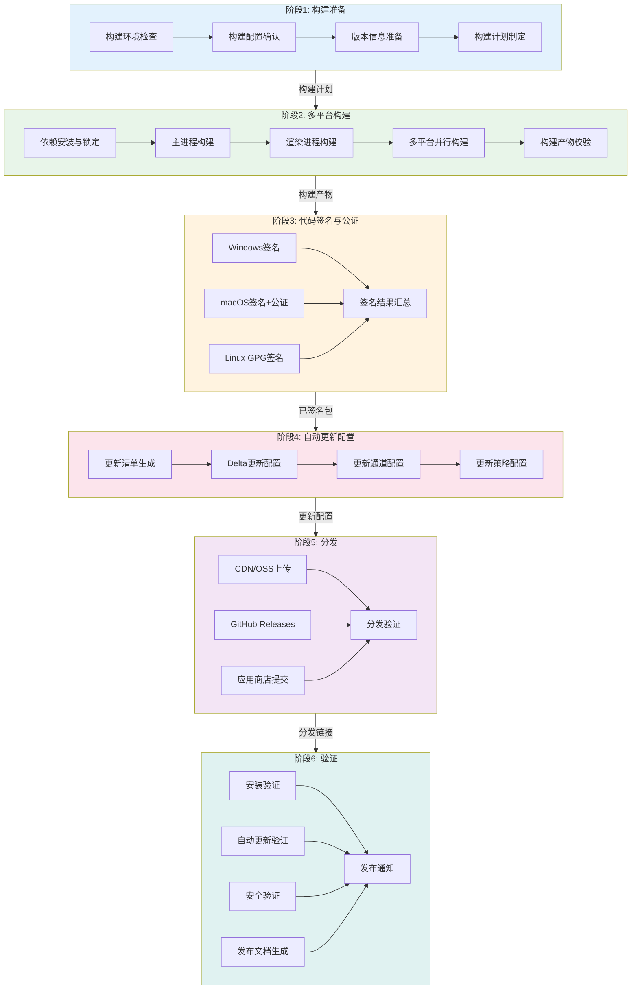

---
metadata:
  name: 桌面构建与发布工作流
  version: "1.8.0"
  description: 桌面应用构建签名与发布工作流
  platform: desktop
  min_agents: 2
  max_agents: 6
phases:
  - id: phase-1
    name: 构建准备
    order: 1
    optional: false
    trigger_condition: 桌面项目验收通过或用户请求构建发布
    agents:
      primary: [build-release-engineer, desktop-developer]
      supporting: []
    quality_gates:
      - gate_id: build_env_ready
        blocking: true
        pass_criteria: 构建环境满足要求
      - gate_id: signing_cert_available
        blocking: true
        pass_criteria: 签名证书可用且未过期
  - id: phase-2
    name: 多平台构建
    order: 2
    optional: false
    agents:
      primary: [build-release-engineer, desktop-developer]
      supporting: [cicd-specialist]
    quality_gates:
      - gate_id: desktop_build_pass
        blocking: true
        pass_criteria: 所有目标平台构建成功
  - id: phase-3
    name: 代码签名与公证
    order: 3
    optional: false
    agents:
      primary: [build-release-engineer, security-auditor]
      supporting: []
    quality_gates:
      - gate_id: signing_verified
        blocking: true
        pass_criteria: 所有平台签名验证通过且macOS公证通过
  - id: phase-4
    name: 自动更新配置
    order: 4
    optional: false
    agents:
      primary: [build-release-engineer, desktop-developer]
      supporting: []
    quality_gates:
      - gate_id: update_manifest_valid
        blocking: true
        pass_criteria: 更新清单格式正确且回滚版本可用
  - id: phase-5
    name: 分发
    order: 5
    optional: false
    agents:
      primary: [build-release-engineer, cicd-specialist]
      supporting: []
    quality_gates:
      - gate_id: distribution_available
        blocking: true
        pass_criteria: 所有分发渠道可用
  - id: phase-6
    name: 验证
    order: 6
    optional: false
    agents:
      primary: [build-release-engineer, desktop-developer]
      supporting: [security-auditor]
    quality_gates:
      - gate_id: install_uninstall_pass
        blocking: true
        pass_criteria: 各平台安装卸载正常
      - gate_id: auto_update_verified
        blocking: true
        pass_criteria: 自动更新流程验证通过
agent_matrix:
  build-release-engineer:
    phases: [phase-1, phase-2, phase-3, phase-4, phase-5, phase-6]
    role: primary
    max_parallel_instances: 1
  desktop-developer:
    phases: [phase-1, phase-2, phase-4, phase-6]
    role: primary
    max_parallel_instances: 1
  security-auditor:
    phases: [phase-3, phase-6]
    role: primary
    max_parallel_instances: 1
  cicd-specialist:
    phases: [phase-2, phase-5]
    role: primary
    max_parallel_instances: 1
exception_handling:
  phase_failure:
    action: retry_then_escalate
    escalation_target: orchestrator
    max_retries: 3
  agent_unavailable:
    action: substitute_and_continue
    substitute_agent: build-release-engineer
  quality_gate_blocked:
    action: auto_fix_then_pause
    auto_fix_agents: [desktop-developer, build-release-engineer]
---

# 桌面构建与发布工作流

## 工作流名称
Desktop Build & Release Workflow（桌面构建与发布工作流 - Phase 8）

## 描述
桌面应用构建与发布的系统化工作流，对应项目生命周期 Phase 8。该工作流覆盖从构建准备到分发验证的完整流程，确保桌面应用在各平台上的构建质量、签名安全、自动更新可靠性和分发可达性。

## 触发条件
- 桌面项目 Phase 6 验收通过
- 用户明确要求"构建桌面应用"、"发布桌面版本"、"打包桌面应用"
- 版本发布计划到达构建阶段
- 紧急热修复需要快速构建发布

## 涉及的Agent

### 核心Agent
| Agent | 角色 | 职责 |
|-------|------|------|
| build-release-engineer | 构建发布工程师 | 构建流程编排、发布执行 |
| desktop-developer | 桌面开发工程师 | 构建配置、原生模块处理 |
| cicd-specialist | CI/CD专家 | 流水线配置、自动化构建 |
| security-auditor | 安全审计师 | 签名验证、安全检查 |

### 支撑Agent
| Agent | 角色 | 职责 |
|-------|------|------|
| documentation-engineer | 文档工程师 | 发布文档与 Release Notes |
| product-manager | 产品经理 | 发布审批与渠道确认 |
| monitor-specialist | 监控专家 | 发布后监控配置 |

## 阶段定义

### 阶段1：构建准备（Build Preparation）
**执行者**: build-release-engineer, desktop-developer

**输入**:
- Phase 6 验收通过报告
- 项目源代码
- 构建配置文件

**活动**:
1. 构建环境检查
   - 验证各平台构建工具链完整性
   - 检查 Node.js/Rust/Dart 版本
   - 验证原生编译环境
   - 确认磁盘空间与内存充足
2. 构建配置确认
   - 读取构建配置文件
   - 确认目标平台列表
   - 确认框架版本与依赖锁定
   - 确认签名证书与密钥可用
3. 版本信息准备
   - 确认版本号（遵循 SemVer）
   - 更新 package.json / Cargo.toml / pubspec.yaml 版本
   - 生成版本信息文件
   - 确认 CHANGELOG 已更新
4. 构建计划制定
   - 制定各平台构建顺序
   - 评估构建时间与资源需求
   - 制定构建失败回退策略
   - 通知相关干系人

**输出**:
- 构建环境检查报告
- 构建计划
- 版本信息文件

**质量门禁**:
- [ ] 构建环境满足要求
- [ ] 签名证书可用且未过期
- [ ] 版本号合规
- [ ] CHANGELOG 已更新

---

### 阶段2：多平台构建（Multi-Platform Build）
**执行者**: build-release-engineer, desktop-developer, cicd-specialist

**输入**:
- 构建计划
- 项目源代码
- 构建配置

**活动**:
1. 依赖安装与锁定
   - 安装项目依赖
   - 验证依赖完整性
   - 锁定依赖版本
   - 原生依赖编译
2. 主进程构建
   - 编译主进程/后端代码
   - 原生模块编译与链接
   - 代码优化与 Tree-shaking
   - 主进程产物输出
3. 渲染进程构建
   - 编译前端资源
   - 资源压缩与哈希
   - 静态资源内联/打包
   - 渲染进程产物输出
4. 多平台并行构建
   - Windows 平台构建（NSIS/WiX）
   - macOS 平台构建（DMG/PKG）
   - Linux 平台构建（AppImage/deb/rpm）
   - 收集各平台构建产物
5. 构建产物校验
   - 文件完整性校验
   - SHA256 哈希计算
   - 构建产物大小记录
   - 构建产物归档

**输出**:
- 各平台安装包
- 构建产物清单
- 构建哈希记录

**质量门禁**:
- [ ] DESKTOP-BUILD: 所有目标平台构建成功
- [ ] 构建产物完整性校验通过
- [ ] 无构建错误与警告（允许级别除外）

---

### 阶段3：代码签名与公证（Code Signing & Notarization）
**执行者**: build-release-engineer, security-auditor

**输入**:
- 各平台安装包
- 签名证书与密钥

**活动**:
1. Windows 代码签名
   - 使用 Authenticode 证书签名
   - 签名 SHA256 哈希
   - 验证签名有效性
   - 时间戳服务器签名
2. macOS 代码签名
   - 使用 Developer ID Application 证书签名
   - 签名应用包与框架
   - 硬化运行时（Hardened Runtime）配置
   - 签名验证
3. macOS 公证
   - 提交 Apple 公证请求
   - 等待公证结果
   - 装订公证票据（Staple notarization ticket）
   - 公证结果验证
4. Linux GPG 签名
   - 使用 GPG 密钥签名
   - 生成签名文件
   - 签名验证
5. 签名结果汇总
   - 各平台签名状态记录
   - 签名证书信息记录
   - 签名验证结果归档

**输出**:
- 已签名的安装包
- 签名验证报告
- 公证结果记录

**质量门禁**:
- [ ] DESKTOP-SIGN: 所有平台签名验证通过
- [ ] macOS 公证通过（如适用）
- [ ] 签名证书信息正确

---

### 阶段4：自动更新配置（Auto-Update Configuration）
**执行者**: build-release-engineer, desktop-developer

**输入**:
- 已签名的安装包
- 版本信息
- 分发服务器配置

**活动**:
1. 更新清单生成
   - 生成 latest.yml / latest-mac.yml / latest-linux.yml
   - 填充版本号、下载地址、哈希值、文件大小
   - 配置最低兼容版本
   - 配置强制更新规则
2. Delta 更新配置
   - 计算与上一版本的差异（如支持）
   - 生成 delta 更新包
   - 配置 delta 更新下载地址
   - 验证 delta 更新完整性
3. 更新通道配置
   - 配置 stable/beta/alpha 通道
   - 设置通道切换规则
   - 配置回滚版本信息
   - 更新通道清单签名
4. 更新策略配置
   - 配置更新检查频率
   - 配置更新下载策略（静默/提示）
   - 配置更新安装策略（重启/延迟）
   - 配置更新回滚触发条件

**输出**:
- 更新清单文件
- Delta 更新包（如适用）
- 更新通道配置
- 更新策略配置

**质量门禁**:
- [ ] DESKTOP-UPDATE: 更新清单格式正确
- [ ] Delta 更新验证通过（如适用）
- [ ] 更新通道配置正确
- [ ] 回滚版本可用

---

### 阶段5：分发（Distribution）
**执行者**: build-release-engineer, cicd-specialist

**输入**:
- 已签名的安装包
- 更新清单文件
- 分发配置

**活动**:
1. CDN/OSS 上传
   - 上传安装包到 CDN/OSS
   - 上传更新清单到 CDN/OSS
   - 配置 CDN 缓存策略
   - 验证下载可用性与速度
2. GitHub Releases 发布
   - 创建 GitHub Release
   - 上传各平台安装包
   - 填写 Release Notes
   - 发布 Release
3. 应用商店提交（如适用）
   - Microsoft Store 提交
   - Mac App Store 提交
   - 填写商店元数据
   - 提交审核
4. 分发验证
   - 验证 CDN 下载链接可用
   - 验证 GitHub Release 可访问
   - 验证更新清单可获取
   - 验证各平台安装包可下载

**输出**:
- 分发上传记录
- CDN 下载链接
- GitHub Release 链接
- 应用商店提交记录

**质量门禁**:
- [ ] DESKTOP-CROSS: 所有分发渠道可用
- [ ] 更新清单可正常获取
- [ ] 安装包下载速度达标

---

### 阶段6：验证（Verification）
**执行者**: build-release-engineer, security-auditor, documentation-engineer

**输入**:
- 分发验证结果
- 各平台安装包下载链接

**活动**:
1. 安装验证
   - Windows: 安装、启动、卸载验证
   - macOS: 安装、启动、卸载验证
   - Linux: 安装、启动、卸载验证
   - 记录安装过程问题
2. 自动更新验证
   - 从上一版本模拟更新
   - 验证全量更新流程
   - 验证增量更新流程（如适用）
   - 验证回滚机制
3. 安全验证
   - 签名验证（各平台）
   - 安全扫描
   - 权限检查
   - 网络安全验证
4. 发布文档生成
   - 生成 Release Notes
   - 更新 CHANGELOG
   - 生成升级指南
   - 生成已知问题清单
5. 发布通知
   - 发送发布通知
   - 更新官网下载页
   - 更新文档站点
   - 社交媒体公告（如适用）

**输出**:
- 安装验证报告
- 自动更新验证报告
- 安全验证报告
- Release Notes
- 发布通知记录

**质量门禁**:
- [ ] 各平台安装/卸载正常
- [ ] 自动更新流程验证通过
- [ ] 安全验证无问题
- [ ] 发布文档完整

## 流程图

## 质量门禁汇总

| 门禁ID | 门禁名称 | 触发阶段 | 检查内容 |
|--------|----------|----------|----------|
| DESKTOP-BUILD | 桌面构建门禁 | 多平台构建 | 所有目标平台构建成功，产物完整 |
| DESKTOP-SIGN | 桌面签名门禁 | 代码签名与公证 | 所有平台签名验证通过，macOS 公证通过 |
| DESKTOP-UPDATE | 桌面更新门禁 | 自动更新配置 | 更新清单正确，更新流程可用，回滚机制正常 |
| DESKTOP-CROSS | 桌面跨平台门禁 | 分发 | 所有分发渠道可用，安装包可下载 |

## 输出产物清单

| 阶段 | 输出产物 | 格式 |
|------|----------|------|
| 构建准备 | 构建环境检查报告 | Markdown |
| 构建准备 | 构建计划 | Markdown |
| 多平台构建 | 各平台安装包 | exe/dmg/AppImage/deb/rpm |
| 多平台构建 | 构建产物清单 | JSON |
| 代码签名 | 已签名安装包 | 同上 |
| 代码签名 | 签名验证报告 | Markdown |
| 自动更新 | 更新清单文件 | YAML/JSON |
| 自动更新 | 更新通道配置 | JSON |
| 分发 | 分发上传记录 | Markdown |
| 分发 | 下载链接清单 | Markdown |
| 验证 | 安装验证报告 | Markdown |
| 验证 | 自动更新验证报告 | Markdown |
| 验证 | Release Notes | Markdown |
| 验证 | 发布通知记录 | Markdown |

## 紧急热修复构建流程

对于紧急热修复，采用快速构建通道：

### 热修复构建特点
- 跳过非必要的构建前检查
- 仅构建受影响平台
- 简化但保留核心签名流程
- 配置强制更新策略
- 事后补充完整文档

## 执行建议

1. **构建环境标准化**: 使用 Docker/VM 统一构建环境，避免环境差异导致构建问题
2. **签名密钥安全**: 签名证书和密钥通过安全存储服务管理，禁止硬编码
3. **构建缓存**: 合理利用构建缓存加速，但需在版本变更时清理缓存
4. **并行构建**: 多平台构建尽量并行执行，缩短总体构建时间
5. **回滚预案**: 发布前确认回滚版本可用，自动更新回滚机制正常
6. **监控先行**: 发布前配置好监控告警，发布后持续观察至少 2 小时
7. **分阶段放量**: 重大版本建议分阶段放量，先 beta 再 stable
