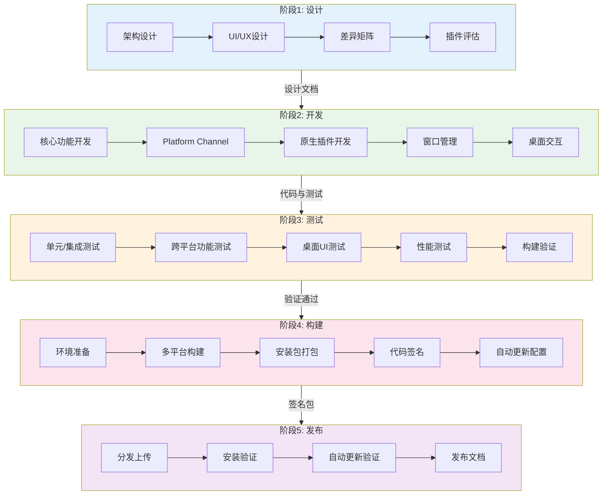

---
metadata:
  name: Flutter桌面应用开发工作流
  version: "1.9.1"
  description: Flutter桌面应用全生命周期开发工作流
  platform: desktop
  min_agents: 3
  max_agents: 8
phases:
  - id: phase-1
    name: 设计
    order: 1
    optional: false
    trigger_condition: Flutter桌面项目需求确认
    agents:
      primary: [desktop-developer, desktop-ui-adapter, product-manager]
      supporting: []
    quality_gates:
      - gate_id: flutter_design_approved
        blocking: true
        pass_criteria: Flutter桌面UI/UX设计通过评审
      - gate_id: platform_matrix_defined
        blocking: true
        pass_criteria: 跨平台差异矩阵已定义
      - gate_id: ipc_contract_defined
        blocking: true
        pass_criteria: Platform Channel契约已定义
  - id: phase-2
    name: 开发
    order: 2
    optional: false
    trigger_condition: 设计评审通过
    agents:
      primary: [desktop-developer, desktop-ui-adapter, native-module-developer]
      supporting: []
    quality_gates:
      - gate_id: flutter_code_review
        blocking: true
        pass_criteria: 代码审查通过
      - gate_id: platform_channel_tested
        blocking: true
        pass_criteria: Platform Channel单元测试通过
      - gate_id: plugin_compat_verified
        blocking: true
        pass_criteria: 插件桌面平台兼容性验证通过
  - id: phase-3
    name: 测试
    order: 3
    optional: false
    trigger_condition: 开发阶段完成
    agents:
      primary: [desktop-tester, desktop-developer]
      supporting: [desktop-ui-adapter]
    quality_gates:
      - gate_id: desktop_build
        blocking: true
        pass_criteria: DESKTOP-BUILD所有目标平台构建成功
      - gate_id: desktop_cross
        blocking: true
        pass_criteria: DESKTOP-CROSS跨平台测试通过
      - gate_id: ipc_contract
        blocking: true
        pass_criteria: IPC-CONTRACT平台通道契约验证通过
  - id: phase-4
    name: 构建
    order: 4
    optional: false
    trigger_condition: 测试阶段通过
    agents:
      primary: [build-release-engineer, desktop-developer]
      supporting: [native-module-developer]
    quality_gates:
      - gate_id: desktop_sign
        blocking: true
        pass_criteria: DESKTOP-SIGN所有平台签名验证通过
      - gate_id: desktop_update
        blocking: true
        pass_criteria: DESKTOP-UPDATE自动更新配置验证通过
  - id: phase-5
    name: 发布
    order: 5
    optional: false
    trigger_condition: 构建与签名验证通过
    agents:
      primary: [build-release-engineer, desktop-developer]
      supporting: [product-manager]
    quality_gates:
      - gate_id: install_uninstall_pass
        blocking: true
        pass_criteria: 各平台安装卸载正常
      - gate_id: auto_update_verified
        blocking: true
        pass_criteria: 自动更新流程验证通过
      - gate_id: release_docs_complete
        blocking: true
        pass_criteria: 发布文档完整
agent_matrix:
  desktop-developer:
    phases: [phase-1, phase-2, phase-3, phase-4, phase-5]
    role: primary
    max_parallel_instances: 1
  desktop-ui-adapter:
    phases: [phase-1, phase-2, phase-3]
    role: primary
    max_parallel_instances: 1
  native-module-developer:
    phases: [phase-2, phase-4]
    role: primary
    max_parallel_instances: 1
  desktop-tester:
    phases: [phase-3]
    role: primary
    max_parallel_instances: 1
  build-release-engineer:
    phases: [phase-4, phase-5]
    role: primary
    max_parallel_instances: 1
  product-manager:
    phases: [phase-1, phase-5]
    role: primary
    max_parallel_instances: 1
exception_handling:
  phase_failure:
    action: retry_then_escalate
    escalation_target: orchestrator
    max_retries: 3
  agent_unavailable:
    action: substitute_and_continue
    substitute_agent: desktop-developer
  quality_gate_blocked:
    action: auto_fix_then_pause
    auto_fix_agents: [desktop-developer, build-release-engineer]
---

# Flutter桌面应用开发工作流

## 工作流名称
Flutter Desktop Application Workflow（Flutter桌面应用开发工作流）

## 描述
Flutter桌面应用全生命周期开发工作流，覆盖从设计到发布的完整流程。该工作流针对Flutter桌面平台的特殊性（Platform Channels、插件兼容性、窗口管理、多平台构建）进行定制化设计，确保Flutter桌面应用在Windows、macOS、Linux三大平台上的功能一致性、性能达标和分发可靠。

## 触发条件
- 用户明确要求"开发Flutter桌面应用"、"创建Flutter桌面项目"
- 项目需求文档指定Flutter为桌面端技术栈
- 现有Flutter移动项目需要扩展桌面平台支持
- 跨平台项目选择Flutter作为桌面端方案

## 涉及的Agent

### 核心Agent
| Agent | 角色 | 职责 |
|-------|------|------|
| desktop-developer | 桌面开发工程师 | Flutter桌面核心开发、Platform Channel实现、构建配置 |
| desktop-ui-adapter | 桌面UI适配工程师 | 桌面端UI/UX适配、响应式布局、平台视觉规范 |
| native-module-developer | 原生模块开发工程师 | 原生插件开发、Platform Channel原生端实现、FFI绑定 |
| desktop-tester | 桌面测试工程师 | 跨平台测试、构建验证、安装/卸载测试 |
| build-release-engineer | 构建发布工程师 | 多平台构建编排、签名、分发、自动更新配置 |

### 支撑Agent
| Agent | 角色 | 职责 |
|-------|------|------|
| product-manager | 产品经理 | 需求确认、发布审批 |
| security-auditor | 安全审计师 | Platform Channel安全审查、桌面安全检查 |
| code-reviewer | 代码审查员 | 代码质量审查 |

## 阶段定义

### 阶段1：设计（Design）
**执行者**: desktop-developer, desktop-ui-adapter, product-manager

**输入**:
- 项目需求文档
- 技术栈约束
- 目标用户画像
- 目标平台列表

**活动**:
1. Flutter桌面架构设计
   - 确定状态管理方案（Riverpod/Bloc/Provider）
   - 设计Platform Channel通信契约
   - 规划原生模块边界
   - 确定插件选型与兼容性策略
2. 桌面UI/UX设计
   - 设计响应式桌面布局
   - 制定平台自适应视觉规范
   - 设计窗口管理策略（多窗口/单窗口）
   - 设计桌面交互模式（键盘快捷键、右键菜单、拖放）
3. 跨平台差异矩阵
   - 识别平台特有功能需求
   - 定义条件编译策略
   - 规划Platform Channel方法映射
   - 制定降级方案
4. 插件兼容性评估
   - 评估现有插件桌面平台支持情况
   - 识别需要自行开发的插件
   - 评估FFI需求
   - 制定插件开发计划

**输出**:
- Flutter桌面架构设计文档
- Platform Channel契约文档
- 跨平台差异矩阵
- 插件兼容性评估报告

**质量门禁**:
- [ ] Flutter桌面UI/UX设计通过评审
- [ ] 跨平台差异矩阵已定义
- [ ] Platform Channel契约已定义

---

### 阶段2：开发（Development）
**执行者**: desktop-developer, desktop-ui-adapter, native-module-developer

**输入**:
- 架构设计文档
- Platform Channel契约文档
- 跨平台差异矩阵
- 插件兼容性评估报告

**活动**:
1. Flutter核心功能开发
   - TDD方式编写业务逻辑
   - 实现状态管理与数据流
   - 实现桌面UI组件与布局
   - 实现平台自适应逻辑
2. Platform Channel实现
   - 实现Dart端MethodChannel调用
   - 实现Dart端EventChannel监听
   - 实现Windows原生端（C++/Win32）
   - 实现macOS原生端（Swift/Objective-C）
   - 实现Linux原生端（C/GTK）
   - 编写Platform Channel单元测试
3. 原生插件开发
   - 开发桌面平台专用插件
   - 实现插件联邦接口（plugin federated）
   - 编写原生端实现
   - 编写插件集成测试
4. 窗口管理实现
   - 集成window_manager或bitsdojo_window
   - 实现窗口大小/位置持久化
   - 实现多窗口管理（如需要）
   - 实现系统托盘功能
5. 桌面交互实现
   - 实现键盘快捷键
   - 实现右键上下文菜单
   - 实现文件拖放
   - 实现原生文件对话框

**输出**:
- Flutter业务代码与测试
- Platform Channel实现代码
- 原生插件代码
- 窗口管理模块
- 桌面交互模块

**质量门禁**:
- [ ] 代码审查通过
- [ ] Platform Channel单元测试通过
- [ ] 插件桌面平台兼容性验证通过

---

### 阶段3：测试（Testing）
**执行者**: desktop-tester, desktop-developer, desktop-ui-adapter

**输入**:
- Flutter应用代码
- Platform Channel实现
- 测试用例集
- 跨平台差异矩阵

**活动**:
1. 单元测试与集成测试
   - 运行Flutter单元测试
   - 运行Platform Channel集成测试
   - 运行Widget测试
   - 生成测试覆盖率报告
2. 跨平台功能测试
   - Windows平台功能验证
   - macOS平台功能验证
   - Linux平台功能验证
   - 功能一致性比对
3. 桌面UI测试
   - 不同分辨率/缩放比测试
   - 窗口大小调整测试
   - 多显示器测试
   - 无障碍功能测试
4. 性能测试
   - 启动时间测量
   - 内存占用监控
   - CPU使用率监控
   - Flutter帧率监控
5. 构建验证
   - `flutter build windows` 验证
   - `flutter build macos` 验证
   - `flutter build linux` 验证
   - 构建产物完整性校验

**输出**:
- 测试覆盖率报告
- 跨平台测试报告
- 性能基准报告
- 构建验证报告

**质量门禁**:
- [ ] DESKTOP-BUILD: 所有目标平台构建成功
- [ ] DESKTOP-CROSS: 跨平台测试通过
- [ ] IPC-CONTRACT: Platform Channel契约验证通过

---

### 阶段4：构建（Build）
**执行者**: build-release-engineer, desktop-developer, native-module-developer

**输入**:
- 测试通过的代码
- 构建配置文件
- 签名证书与密钥

**活动**:
1. 构建环境准备
   - 验证Flutter SDK版本
   - 验证各平台构建工具链
   - 验证原生编译环境
   - 确认依赖锁定（pubspec.lock）
2. 多平台构建
   - Windows: `flutter build windows`
   - macOS: `flutter build macos`
   - Linux: `flutter build linux`
   - 收集各平台构建产物
3. 安装包打包
   - Windows: MSIX/Inno Setup打包
   - macOS: DMG打包与App Store准备
   - Linux: deb/rpm/AppImage打包
   - 构建产物哈希计算
4. 代码签名
   - Windows: Authenticode签名
   - macOS: Developer ID签名与公证
   - Linux: GPG签名
   - 签名验证
5. 自动更新配置
   - 生成更新清单
   - 配置更新通道
   - 配置回滚策略
   - 更新流程验证

**输出**:
- 各平台安装包
- 已签名的安装包
- 签名验证报告
- 更新清单文件

**质量门禁**:
- [ ] DESKTOP-SIGN: 所有平台签名验证通过
- [ ] DESKTOP-UPDATE: 自动更新配置验证通过

---

### 阶段5：发布（Release）
**执行者**: build-release-engineer, desktop-developer, product-manager

**输入**:
- 已签名的安装包
- 更新清单文件
- 分发配置

**活动**:
1. 分发上传
   - CDN/OSS上传安装包
   - GitHub Releases发布
   - 应用商店提交（如适用）
   - 分发链接验证
2. 安装验证
   - Windows: 安装、启动、卸载验证
   - macOS: 安装、启动、卸载验证
   - Linux: 安装、启动、卸载验证
   - 记录安装过程问题
3. 自动更新验证
   - 从上一版本模拟更新
   - 验证全量更新流程
   - 验证回滚机制
4. 发布文档
   - 生成Release Notes
   - 更新CHANGELOG
   - 生成升级指南
   - 发布通知

**输出**:
- 安装验证报告
- 自动更新验证报告
- Release Notes
- 发布通知记录

**质量门禁**:
- [ ] 各平台安装/卸载正常
- [ ] 自动更新流程验证通过
- [ ] 发布文档完整

## 流程图

## 质量门禁汇总

| 门禁ID | 门禁名称 | 触发阶段 | 检查内容 |
|--------|----------|----------|----------|
| DESKTOP-BUILD | 桌面构建门禁 | 测试 | 所有目标平台flutter build成功，产物完整 |
| DESKTOP-SIGN | 桌面签名门禁 | 构建 | 所有平台签名验证通过，macOS公证通过 |
| DESKTOP-UPDATE | 桌面更新门禁 | 构建 | 更新清单正确，更新流程可用，回滚机制正常 |
| DESKTOP-CROSS | 桌面跨平台门禁 | 测试 | 三平台功能一致性验证通过 |
| IPC-CONTRACT | 平台通道契约门禁 | 测试 | Platform Channel通信契约验证通过，参数类型安全 |

## 跨平台测试矩阵

| 测试维度 | Windows | macOS | Linux |
|----------|---------|-------|-------|
| 安装/卸载 | MSIX/Inno Setup | DMG/PKG | deb/rpm/AppImage |
| 启动时间 | ✅ | ✅ | ✅ |
| 窗口管理 | 最小化/最大化/关闭 | 最小化/最大化/关闭 | 最小化/最大化/关闭 |
| 系统托盘 | ✅ | ✅ | ✅ |
| 文件对话框 | Win32原生 | Cocoa原生 | GTK原生 |
| 键盘快捷键 | Ctrl组合键 | Cmd组合键 | Ctrl组合键 |
| 右键菜单 | ✅ | ✅ | ✅ |
| 文件拖放 | ✅ | ✅ | ✅ |
| 自动更新 | ✅ | ✅ | ✅ |
| 代码签名 | Authenticode | Developer ID + 公证 | GPG |
| HiDPI/缩放 | ✅ | Retina支持 | ✅ |
| 多显示器 | ✅ | ✅ | ✅ |
| 无障碍 | MSAA/UIA | VoiceOver | ATK |

## Flutter桌面特有考虑

### Platform Channels
- MethodChannel: 用于一次性调用（如打开文件对话框、获取系统信息）
- EventChannel: 用于持续事件流（如文件系统监听、USB设备变化）
- BasicMessageChannel: 用于双向消息传递
- 所有Channel通信必须定义类型安全的契约

### 插件兼容性
- 优先选择已支持桌面平台的插件
- 使用plugin federated模式开发自定义插件
- 对不支持桌面的插件需编写平台桩（stub）
- FFI用于性能敏感的原生交互

### 窗口管理
- 使用window_manager包管理窗口大小、位置、标题栏
- 实现窗口状态持久化（大小、位置、最大化状态）
- 处理窗口关闭确认（未保存工作提示）
- 多窗口场景需自行管理Window实例

### 构建模式
- Debug模式: `flutter run -d windows/macos/linux`
- Profile模式: `flutter build windows/macos/linux --profile`
- Release模式: `flutter build windows/macos/linux --release`
- 注意: Release模式使用AOT编译，性能最优但调试受限

## 输出产物清单

| 阶段 | 输出产物 | 格式 |
|------|----------|------|
| 设计 | 架构设计文档 | Markdown |
| 设计 | Platform Channel契约文档 | Markdown/YAML |
| 设计 | 跨平台差异矩阵 | Markdown |
| 开发 | Flutter业务代码 | Dart |
| 开发 | Platform Channel实现 | Dart/C++/Swift/C |
| 开发 | 原生插件代码 | Dart/C++/Swift/C |
| 测试 | 测试覆盖率报告 | HTML/JSON |
| 测试 | 跨平台测试报告 | Markdown |
| 测试 | 性能基准报告 | Markdown |
| 构建 | 各平台安装包 | msix/exe/dmg/deb/rpm/AppImage |
| 构建 | 签名验证报告 | Markdown |
| 构建 | 更新清单文件 | YAML/JSON |
| 发布 | 安装验证报告 | Markdown |
| 发布 | Release Notes | Markdown |

## 执行建议

1. **Flutter版本锁定**: 使用FVM（Flutter Version Management）锁定Flutter SDK版本，避免版本差异导致构建问题
2. **Platform Channel契约先行**: 在开发前先定义Platform Channel契约，确保Dart端与原生端接口一致
3. **插件兼容性优先**: 选型时优先考虑已支持桌面平台的插件，减少自行开发工作量
4. **三平台并行开发**: 尽量在开发阶段就同时验证三平台，避免后期发现平台特有问题
5. **构建环境标准化**: 使用CI/CD流水线统一构建环境，Windows构建需在Windows机器上执行
6. **签名密钥安全**: 签名证书和密钥通过安全存储服务管理，禁止硬编码
7. **窗口管理一致性**: 三平台窗口行为需统一测试，特别注意macOS的窗口行为差异
8. **性能基线**: 建立桌面端性能基线，持续监控启动时间和内存占用
