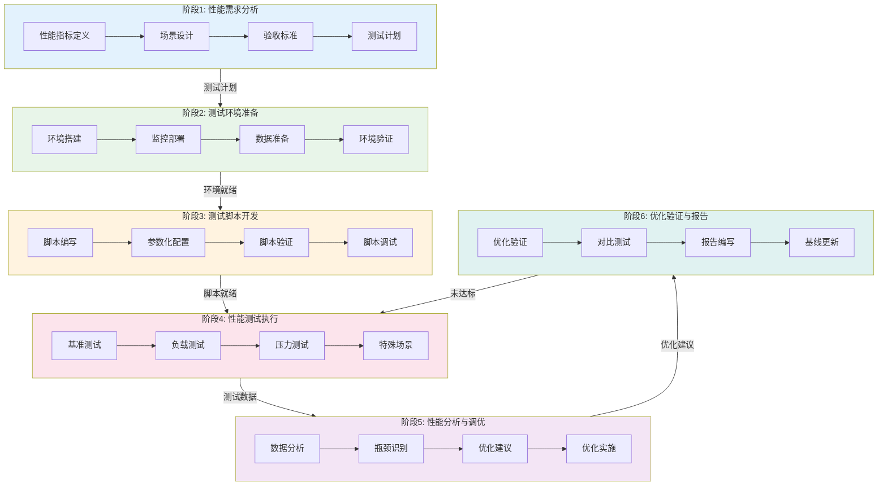

---
metadata:
  name: 性能基准测试工作流
  version: "1.8.0"
  description: 性能基准测试与优化分析工作流
  platform: all
  min_agents: 2
  max_agents: 4
phases:
  - id: phase-1
    name: 性能需求分析
    order: 1
    optional: false
    trigger_condition: 用户请求性能测试或系统上线前验证
    agents:
      primary: [performance-tester, system-architect]
      supporting: []
    quality_gates:
      - gate_id: metrics_quantified
        blocking: true
        pass_criteria: 性能指标已量化
      - gate_id: scenarios_covered
        blocking: true
        pass_criteria: 测试场景已覆盖关键业务
  - id: phase-2
    name: 测试环境准备
    order: 2
    optional: false
    agents:
      primary: [devops-engineer, performance-tester]
      supporting: []
    quality_gates:
      - gate_id: env_ready
        blocking: true
        pass_criteria: 环境配置完成
  - id: phase-3
    name: 测试脚本开发
    order: 3
    optional: false
    agents:
      primary: [performance-tester]
      supporting: []
    quality_gates:
      - gate_id: scripts_valid
        blocking: true
        pass_criteria: 脚本功能正确
  - id: phase-4
    name: 性能测试执行
    order: 4
    optional: false
    agents:
      primary: [performance-tester, devops-engineer]
      supporting: []
    quality_gates:
      - gate_id: execution_complete
        blocking: true
        pass_criteria: 测试场景完整执行
  - id: phase-5
    name: 性能分析与调优
    order: 5
    optional: false
    agents:
      primary: [system-architect, performance-tester]
      supporting: []
    quality_gates:
      - gate_id: bottleneck_located
        blocking: true
        pass_criteria: 瓶颈已定位且根因已分析
  - id: phase-6
    name: 优化验证与报告
    order: 6
    optional: false
    agents:
      primary: [performance-tester]
      supporting: [system-architect]
    quality_gates:
      - gate_id: optimization_feasible
        blocking: true
        pass_criteria: 优化建议可行
agent_matrix:
  performance-tester:
    phases: [phase-1, phase-2, phase-3, phase-4, phase-5, phase-6]
    role: primary
    max_parallel_instances: 1
  system-architect:
    phases: [phase-1, phase-5, phase-6]
    role: primary
    max_parallel_instances: 1
  devops-engineer:
    phases: [phase-2, phase-4]
    role: primary
    max_parallel_instances: 1
exception_handling:
  phase_failure:
    action: retry_then_escalate
    escalation_target: orchestrator
    max_retries: 3
  agent_unavailable:
    action: substitute_and_continue
    substitute_agent: performance-tester
  quality_gate_blocked:
    action: auto_fix_then_pause
    auto_fix_agents: [system-architect, devops-engineer]
---

# 性能测试工作流

## 工作流名称
Performance Testing Workflow（性能测试工作流）

## 描述
全面的性能测试工作流，涵盖性能测试规划、执行、分析和优化建议。该工作流确保系统在各种负载条件下保持良好的性能表现，满足性能需求和用户体验要求。

## 触发条件
- 用户请求性能测试
- 系统上线前性能验证
- 性能问题排查
- 容量规划需求
- 性能基准建立
- 用户明确要求"性能测试"、"压力测试"、"负载测试"、"性能优化"

## 涉及的Agent

### 核心Agent
| Agent | 角色 | 职责 |
|-------|------|------|
| performance-tester | 性能测试工程师 | 测试设计、执行、分析 |
| system-architect | 系统架构师 | 性能优化建议 |
| devops-engineer | DevOps工程师 | 环境配置、监控部署 |

### 支撑Agent
| Agent | 角色 | 职责 |
|-------|------|------|
| backend-developer | 后端工程师 | 代码性能优化 |
| dba | 数据库管理员 | 数据库性能优化 |
| monitor-specialist | 监控专家 | 性能监控配置 |

## 阶段定义

### 阶段1：性能需求分析（Performance Requirements）
**执行者**: performance-tester, product-manager

**输入**:
- 业务需求
- 用户规模预估
- 系统架构文档

**活动**:
1. 性能指标定义
   - 响应时间要求
   - 吞吐量目标
   - 并发用户数
   - 资源利用率上限
2. 性能场景设计
   - 关键业务场景
   - 用户行为建模
   - 数据量预估
3. 验收标准确定
   - SLA定义
   - 性能基线
   - 阈值设定

**输出**:
- 性能需求文档
- 性能测试计划
- 验收标准清单

**质量门禁**:
- [ ] 性能指标已量化
- [ ] 测试场景已覆盖关键业务
- [ ] 验收标准已确认

---

### 阶段2：测试环境准备（Environment Setup）
**执行者**: devops-engineer, performance-tester

**输入**:
- 性能测试计划
- 系统架构文档

**活动**:
1. 测试环境搭建
   - 独立性能测试环境
   - 数据库准备
   - 网络配置
2. 监控系统部署
   - 服务器监控
   - 应用监控
   - 数据库监控
   - 网络监控
3. 测试数据准备
   - 基础数据生成
   - 测试账号准备
   - 数据隔离配置

**输出**:
- 测试环境文档
- 监控配置文档
- 测试数据集

**质量门禁**:
- [ ] 环境配置完成
- [ ] 监控系统正常
- [ ] 测试数据就绪

---

### 阶段3：测试脚本开发（Script Development）
**执行者**: performance-tester

**输入**:
- 性能测试计划
- 测试场景设计

**活动**:
1. 测试脚本编写
   - 用户行为脚本
   - 业务流程脚本
   - 数据驱动脚本
2. 脚本参数化
   - 用户数据参数化
   - 业务数据参数化
   - 环境参数化
3. 脚本验证
   - 功能正确性验证
   - 数据一致性验证
   - 资源清理验证

**输出**:
- 性能测试脚本
- 参数化配置文件
- 脚本验证报告

**质量门禁**:
- [ ] 脚本功能正确
- [ ] 参数化完整
- [ ] 资源可回收

---

### 阶段4：性能测试执行（Test Execution）
**执行者**: performance-tester

**输入**:
- 测试脚本
- 测试环境

**活动**:
1. 基准测试
   - 单用户基准
   - 功能验证
   - 环境验证
2. 负载测试
   - 逐步加压
   - 稳定负载
   - 长时间运行
3. 压力测试
   - 极限负载
   - 破坏性测试
   - 恢复测试
4. 特殊场景测试
   - 峰值测试
   - 容量测试
   - 稳定性测试

**输出**:
- 测试执行日志
- 原始性能数据
- 监控数据

**质量门禁**:
- [ ] 测试场景完整执行
- [ ] 数据采集完整
- [ ] 无测试中断

---

### 阶段5：性能分析与调优（Analysis & Tuning）
**执行者**: performance-tester, system-architect

**输入**:
- 性能测试数据
- 监控数据

**活动**:
1. 性能数据分析
   - 响应时间分析
   - 吞吐量分析
   - 资源利用率分析
   - 错误率分析
2. 瓶颈识别
   - 系统瓶颈定位
   - 资源瓶颈分析
   - 代码热点分析
3. 优化建议
   - 架构优化建议
   - 代码优化建议
   - 配置优化建议
   - 资源扩容建议

**输出**:
- 性能分析报告
- 瓶颈分析报告
- 优化建议清单

**质量门禁**:
- [ ] 瓶颈已定位
- [ ] 根因已分析
- [ ] 优化建议可行

---

### 阶段6：优化验证与报告（Verification & Reporting）
**执行者**: performance-tester

**输入**:
- 优化实施结果
- 优化建议

**活动**:
1. 优化效果验证
   - 对比测试
   - 性能提升评估
   - 回归验证
2. 性能报告编写
   - 测试概述
   - 性能指标结果
   - 瓶颈分析
   - 优化建议
   - 结论与建议

**输出**:
- 性能测试报告
- 优化验证报告
- 性能基线文档

**质量门禁**:
- [ ] 性能指标达标
- [ ] 优化效果验证
- [ ] 报告完整准确

## 流程图

## 输出产物清单

| 阶段 | 输出产物 | 格式 |
|------|----------|------|
| 需求分析 | 性能需求文档 | Markdown |
| 需求分析 | 性能测试计划 | Markdown |
| 环境准备 | 测试环境文档 | Markdown |
| 环境准备 | 监控配置文档 | Markdown |
| 脚本开发 | 性能测试脚本 | JMeter/K6/Locust |
| 测试执行 | 测试执行日志 | Log文件 |
| 测试执行 | 原始性能数据 | CSV/JSON |
| 性能分析 | 性能分析报告 | Markdown/PDF |
| 性能分析 | 瓶颈分析报告 | Markdown |
| 优化验证 | 性能测试报告 | PDF |
| 优化验证 | 性能基线文档 | Markdown |

## 性能测试类型

### 负载测试（Load Testing）
- **目的**: 验证系统在预期负载下的性能表现
- **方法**: 逐步增加负载，观察系统响应
- **指标**: 响应时间、吞吐量、错误率

### 压力测试（Stress Testing）
- **目的**: 找出系统的性能极限和崩溃点
- **方法**: 持续增加负载直到系统崩溃
- **指标**: 最大并发数、崩溃点、恢复能力

### 容量测试（Volume Testing）
- **目的**: 验证系统处理大量数据的能力
- **方法**: 增加数据量，观察系统表现
- **指标**: 数据处理能力、存储性能

### 稳定性测试（Stability/Endurance Testing）
- **目的**: 验证系统长时间运行的稳定性
- **方法**: 持续运行较长时间（如24小时+）
- **指标**: 内存泄漏、性能衰减、错误累积

### 峰值测试（Spike Testing）
- **目的**: 验证系统应对突发流量的能力
- **方法**: 突然增加大量负载，观察系统响应
- **指标**: 响应时间波动、错误率、恢复时间

## 性能指标定义

### 响应时间指标
| 指标 | 描述 | 目标值示例 |
|------|------|------------|
| 平均响应时间 | 所有请求的平均响应时间 | < 1秒 |
| P90响应时间 | 90%请求的响应时间 | < 2秒 |
| P95响应时间 | 95%请求的响应时间 | < 3秒 |
| P99响应时间 | 99%请求的响应时间 | < 5秒 |
| 最大响应时间 | 最慢请求的响应时间 | < 10秒 |

### 吞吐量指标
| 指标 | 描述 | 单位 |
|------|------|------|
| TPS | 每秒事务数 | transactions/sec |
| QPS | 每秒查询数 | queries/sec |
| RPS | 每秒请求数 | requests/sec |
| 并发用户数 | 同时在线用户数 | users |

### 资源利用率指标
| 指标 | 描述 | 阈值 |
|------|------|------|
| CPU使用率 | CPU占用百分比 | < 80% |
| 内存使用率 | 内存占用百分比 | < 85% |
| 磁盘I/O | 磁盘读写速率 | < 80%容量 |
| 网络带宽 | 网络吞吐量 | < 70%容量 |
| 连接数 | 数据库/服务连接数 | < 连接池上限 |

## 工具推荐

### 负载测试工具
- **JMeter**: 开源、功能全面、插件丰富
- **K6**: 现代化、脚本化、云原生
- **Locust**: Python编写、分布式、易扩展
- **Gatling**: 高性能、Scala DSL、报告美观

### 监控工具
- **Prometheus + Grafana**: 指标监控、可视化
- **ELK Stack**: 日志分析、问题定位
- **APM工具**: SkyWalking, Jaeger, Zipkin

### 分析工具
- **JProfiler**: Java应用性能分析
- **FlameGraph**: 火焰图分析
- **Perf**: Linux性能分析

## 执行建议

1. **环境隔离**: 性能测试环境应与生产环境配置一致但独立
2. **数据真实**: 使用接近真实的数据量和数据分布
3. **监控全面**: 覆盖应用、数据库、中间件、基础设施各层
4. **迭代优化**: 性能测试与优化是一个迭代过程
5. **基线管理**: 建立并维护性能基线，用于版本对比
6. **自动化**: 将性能测试集成到CI/CD流水线
