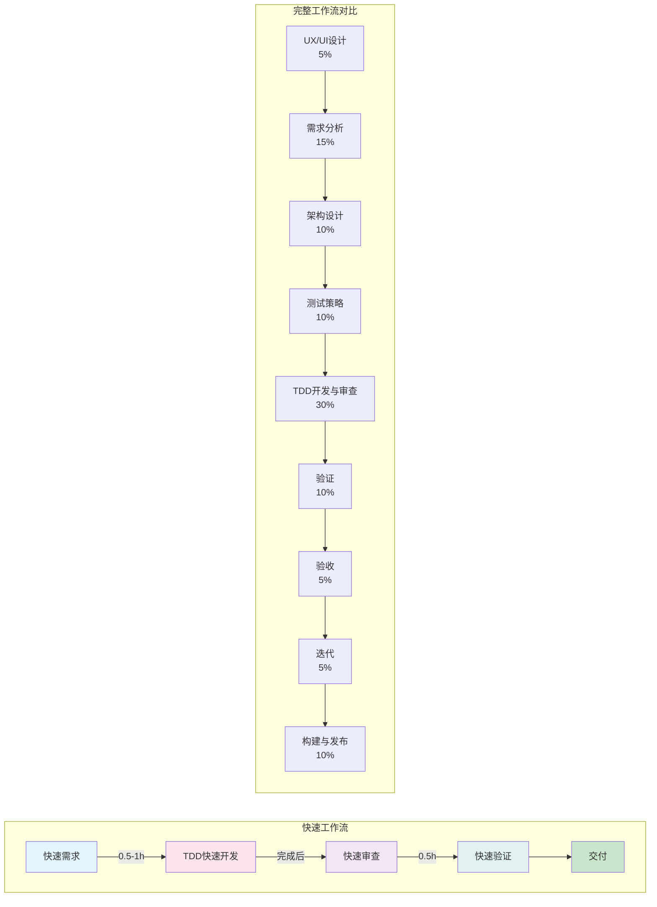
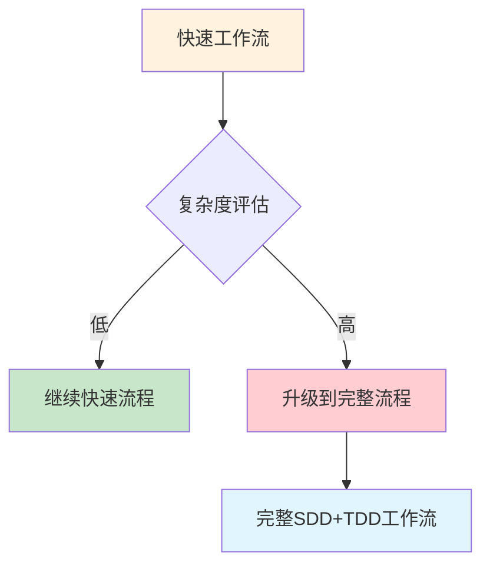

---
metadata:
  name: SDD+TDD快速开发工作流
  version: "1.8.0"
  description: 快速4阶段SDD+TDD轻量开发工作流
  platform: all
  min_agents: 3
  max_agents: 8
phases:
  - id: phase-1
    name: 快速需求
    order: 0
    optional: false
    trigger_condition: 用户请求快速开发或小型任务
    agents:
      primary: [fullstack-engineer]
      supporting: []
    inputs:
      - name: 用户需求描述
        type: document
        required: true
    outputs:
      - name: 简化需求文档
        type: document
        validation: 核心功能点明确
      - name: 实现方案说明
        type: document
        validation: 实现方案可行
    quality_gates:
      - gate_id: core_features_defined
        blocking: true
        pass_criteria: 核心功能点明确
      - gate_id: implementation_feasible
        blocking: true
        pass_criteria: 实现方案可行
    timeout_minutes: 60
    retry:
      max_attempts: 2
      backoff: fixed
  - id: phase-2
    name: 架构设计
    order: 1
    optional: false
    trigger_condition: 快速需求完成
    agents:
      primary: [fullstack-engineer]
      supporting: []
    inputs:
      - name: 简化需求文档
        type: document
        required: true
        source_phase: phase-1
      - name: 实现方案说明
        type: document
        required: true
        source_phase: phase-1
    outputs:
      - name: 简化架构设计
        type: document
        validation: 设计评审通过
      - name: 设计令牌同步确认
        type: document
        validation: Design Tokens与代码同步
    quality_gates:
      - gate_id: design_review
        blocking: true
        pass_criteria: 设计评审通过
      - gate_id: design_tokens_sync
        blocking: false
        pass_criteria: Design Tokens与代码同步
    timeout_minutes: 30
    retry:
      max_attempts: 2
      backoff: fixed
  - id: phase-4
    name: TDD开发与代码审查
    order: 2
    optional: false
    trigger_condition: 架构设计完成
    agents:
      primary: [fullstack-engineer, unit-tester, code-reviewer]
      supporting: []
    inputs:
      - name: 简化需求文档
        type: document
        required: true
        source_phase: phase-1
      - name: 实现方案
        type: document
        required: true
        source_phase: phase-2
    outputs:
      - name: 源代码
        type: code
        validation: 核心测试通过
      - name: 核心测试用例
        type: code
        validation: 覆盖率>=60%
      - name: 审查反馈
        type: document
      - name: 修复确认
        type: document
    quality_gates:
      - gate_id: core_tests_pass
        blocking: true
        pass_criteria: 核心测试用例通过
      - gate_id: coverage_60
        blocking: true
        pass_criteria: 代码覆盖率>=60%
      - gate_id: no_critical_issues
        blocking: true
        pass_criteria: 无严重问题且核心逻辑正确
    timeout_minutes: 120
    retry:
      max_attempts: 3
      backoff: exponential
  - id: phase-5
    name: 验证
    order: 3
    optional: false
    trigger_condition: TDD开发与代码审查通过
    agents:
      primary: [fullstack-engineer]
      supporting: []
    inputs:
      - name: 审查通过的代码
        type: code
        required: true
        source_phase: phase-4
    outputs:
      - name: 验证结果
        type: document
        validation: 功能符合预期
      - name: 交付确认
        type: document
        validation: 演化闭环完成
    quality_gates:
      - gate_id: function_match
        blocking: true
        pass_criteria: 功能符合预期
      - gate_id: no_obvious_defects
        blocking: true
        pass_criteria: 无明显缺陷
      - gate_id: evolution_closed
        blocking: true
        pass_criteria: 演化闭环完成
    timeout_minutes: 30
    retry:
      max_attempts: 2
      backoff: fixed
agent_matrix:
  fullstack-engineer:
    phases: [phase-1, phase-2, phase-4, phase-5]
    role: primary
    max_parallel_instances: 2
  unit-tester:
    phases: [phase-4]
    role: primary
    max_parallel_instances: 1
  code-reviewer:
    phases: [phase-4]
    role: primary
    max_parallel_instances: 1
exception_handling:
  phase_failure:
    action: retry_then_escalate
    escalation_target: orchestrator
    max_retries: 3
  agent_unavailable:
    action: substitute_and_continue
    substitute_agent: fullstack-engineer
  quality_gate_blocked:
    action: auto_fix_then_pause
    auto_fix_agents: [fullstack-engineer]
---

# SDD+TDD 快速工作流

## 工作流名称
SDD+TDD Fast Development Workflow（快速开发工作流）

## 描述
简化的SDD+TDD工作流，适用于小型任务、Bug修复、功能增强等快速迭代场景。该工作流保留了核心的质量保障机制，同时精简了流程步骤，提高开发效率。支持桌面应用快速修复场景。

## 触发条件
- 用户请求快速开发
- 项目规模：小型（预估开发周期 < 2周）
- 单一模块或组件的开发
- 功能增强或小改动
- 用户明确要求"快速"、"简化"、"fast"

## 涉及的Agent

### 核心Agent
| Agent | 角色 | 职责 |
|-------|------|------|
| fullstack-engineer | 全栈工程师 | 需求理解+实现 |
| unit-tester | 单元测试工程师 | TDD测试 |
| code-reviewer | 代码审查工程师 | 快速审查 |

### 可选Agent
| Agent | 角色 | 触发条件 |
|-------|------|----------|
| security-auditor | 安全审计师 | 涉及安全相关代码 |
| integration-tester | 集成测试工程师 | 需要集成测试时 |
| desktop-developer | 桌面开发工程师 | 涉及桌面特定代码时 |

### 增量实施约束

所有Agent在执行复杂任务时必须遵循增量实施规范：
- **工作模式**：分解复杂任务 → 实现单个步骤 → 测试验证 → 重复
- **死循环检测**：若在同一错误上连续3次尝试失败，必须停止执行
- **反模式记录**：将失败模式记录到知识库的anti-patterns目录
- **重启流程**：从头重新开始，而非继续在错误方向上尝试

此约束参考@hivehub/rulebook的增量实施规范，与完整工作流中的增量实施约束保持一致。

## 阶段定义

### 阶段1：快速需求（Quick Requirements）
**执行者**: fullstack-engineer

**输入**:
- 用户需求描述

**活动**:
1. 需求快速分析
2. 核心功能点识别
3. 实现方案确定

**输出**:
- 简化需求文档
- 实现方案说明

**质量门禁**:
- [ ] 核心功能点明确 → **GATE-001**（需求完整性门禁）
- [ ] 实现方案可行 → **GATE-002**（规格一致性门禁）
- [ ] 设计评审通过 → **DESIGN-REVIEW**（设计评审门禁）
- [ ] Design Tokens与代码同步 → **DESIGN-TOKENS**（Design Tokens完整性验证门禁）

> **门控映射说明**: 快速模式下 DESIGN-REVIEW 可简化为 fullstack-engineer 自审，DESIGN-TOKENS 仅在涉及UI变更时检查。

**时长**: 0.5-1小时

---

### 阶段2：TDD快速开发（Fast TDD）
**执行者**: fullstack-engineer, unit-tester

**输入**:
- 简化需求文档
- 实现方案

**活动**:
1. **Red**: 快速编写核心测试用例
2. **Green**: 快速实现功能
3. **Refactor**: 简化重构
4. 快速迭代

**输出**:
- 源代码
- 核心测试用例
- **脚本清理提醒**：实现完成后确认所有临时修改脚本已删除（遵循 script-standards.md 五步闭环规范）[强制]

**质量门禁**:
- [ ] 核心测试用例通过 → **GATE-008**（单元测试门禁）
- [ ] 代码覆盖率 >= 60% → **GATE-007**（代码质量门禁）
- [ ] 基本功能可用 → **GATE-009**（代码审查门禁）
- [ ] 所有源代码文件为UTF-8 without BOM → **FILE-ENCODING**（文件编码格式门禁）**[强制]**
- [ ] 业务注释包含中文说明 → **COMMENT-LANGUAGE**（注释语言规范门禁）**[强制]**

> **强制门控说明**: FILE-ENCODING 和 COMMENT-LANGUAGE 为规格定义中的 **[强制]** 要求，即使在快速模式下也 **不可跳过**。这是确保代码库编码一致性和注释规范性的底线保障。

**时长**: 根据任务复杂度

---

### 阶段3：快速审查（Quick Review）
**执行者**: code-reviewer

**输入**:
- 源代码
- 测试代码

**活动**:
1. 快速代码扫描
2. 关键问题识别
3. 即时反馈修复

**输出**:
- 审查反馈
- 修复确认

**质量门禁**:
- [ ] 无严重问题 → **GATE-010**（集成测试门禁）
- [ ] 核心逻辑正确 → **GATE-011**（端到端门禁）
- [ ] 安全扫描无高危漏洞 → **GATE-012**（安全扫描门禁）
- [ ] Agentic安全合规通过 → **AGENTIC-SECURITY**（Agentic安全合规门禁）

> **门控映射说明**: 快速模式下 GATE-010 和 GATE-011 可简化为核心路径验证；AGENTIC-SECURITY 仅在涉及Agent自主操作时检查。

**时长**: 0.5小时

---

### 阶段4：快速验证（Quick Validation）
**执行者**: fullstack-engineer

**输入**:
- 审查通过的代码

**活动**:
1. 功能验证
2. 边界测试
3. 快速回归
4. 桌面快速验证（窗口渲染/菜单响应/IPC通信基本功能）

**输出**:
- 验证结果
- 交付确认

**质量门禁**:
- [ ] 功能符合预期 → **GATE-013**（部署就绪门禁）
- [ ] 无明显缺陷 → **GATE-014**（生产验证门禁）
- [ ] 演化闭环完成 → **GATE-015**（演化闭环门禁）

> **门控映射说明**: 快速模式下 GATE-013 侧重功能验证而非完整部署清单；GATE-015 可简化为问题追踪闭环确认。

**时长**: 0.5小时

### 规格漂移处理（快速模式）

快速模式下仅区分两级漂移：

- **低影响漂移**（仅影响单个函数或组件内部实现细节）：Agent可自行补全，但需在提交信息中标记 `Spec-Drift: [low] <说明>`，并在PR中阐述变更。Specification Keeper事后审核。
- **高影响漂移**（影响外部API契约、安全模型、关键业务逻辑）：触发人机协作断点，等待Product Manager或人类负责人确认。此级别漂移不得由Agent自主决策。

> 完整的三级漂移处理（含中影响级别）详见 [sdd-tdd-full.md](sdd-tdd-full.md)

## 流程图



## 输出产物清单

| 阶段 | 输出产物 | 格式 |
|------|----------|------|
| 快速需求 | 简化需求文档 | Markdown |
| TDD开发 | 源代码 | 源文件 |
| TDD开发 | 测试代码 | 测试文件 |
| 快速审查 | 审查反馈 | Markdown/注释 |
| 快速验证 | 验证结果 | Markdown |

## 与完整工作流的对比

| 维度 | 快速工作流 | 完整工作流 |
|------|------------|------------|
| 阶段数 | 4 | 9 |
| Agent数 | 3-5 | 10+ |
| 文档要求 | 简化 | 完整 |
| 测试覆盖 | >= 60% | >= 80% |
| 适用周期 | < 2周 | > 2周 |
| 架构设计 | 简化 | 完整 |
| 集成测试 | 可选 | 必须 |

## 适用场景

### ✅ 推荐使用
- 单一功能开发
- Bug修复
- 小型重构
- 原型验证
- 配置变更
- UI微调

### ❌ 不推荐使用
- 新系统开发
- 架构变更
- 多模块开发
- 安全敏感功能
- 性能关键模块
- 核心业务逻辑

## 执行建议

1. **时间限制**: 整个流程建议在1-3天内完成
2. **文档精简**: 只保留必要的文档
3. **测试聚焦**: 聚焦核心功能测试
4. **快速反馈**: 即时沟通，快速迭代
5. **质量底线**: 即使快速，也不能牺牲核心质量

### 人机协作断点（快速模式）

快速模式下仅定义2种触发条件：

- **安全漏洞**：安全渗透测试发现高危零日漏洞时，系统自动暂停并生成决策报告，等待人类评估业务风险
- **连续失败**：连续3次迭代仍未收敛（相同Gate重复失败）时，系统自动暂停并生成决策报告，等待人类输入

决策报告格式：
```markdown
## 决策报告 #[ID]
- **触发条件**: [安全漏洞/连续失败]
- **当前状态**: [简要描述]
- **已尝试方案**: [列出已尝试的修复方案]
- **建议决策**: [Orchestrator的建议]
- **等待人类输入**: [需要确认的具体问题]
```

> 完整的4种触发条件详见 [sdd-tdd-full.md](sdd-tdd-full.md)

## Desktop Fast Track（桌面快速通道）

当修复桌面应用简单Bug时，可使用以下精简流程：

### 快速通道步骤

```
1. 问题定位 → 识别Bug所在层（渲染进程/主进程/原生模块）
2. 快速修复 → 编写失败测试 → 最小修复 → 验证
3. 桌面快速验证 → 窗口渲染 / 菜单响应 / IPC通信
4. 构建验证 → 本地构建目标平台安装包并安装测试
```

### 桌面快速验证清单

- [ ] 应用可正常启动和退出
- [ ] 窗口标题/尺寸/位置正确
- [ ] 系统菜单功能正常
- [ ] 修复的功能在桌面环境正常工作
- [ ] 无控制台错误输出
- [ ] 内存占用无明显异常

### 何时使用完整桌面工作流 vs 快速通道

| 场景 | 快速通道 | 完整桌面工作流 |
|------|----------|----------------|
| 单一平台UI小修复 | ✅ | ❌ |
| IPC消息格式调整 | ✅ | ❌ |
| 新增桌面原生功能 | ❌ | ✅ |
| 跨平台兼容性问题 | ❌ | ✅ |
| 桌面框架升级 | ❌ | ✅ |
| 自动更新机制修改 | ❌ | ✅ |
| 代码签名/公证问题 | ❌ | ✅ |
| 涉及多个桌面特有模块 | ❌ | ✅ |
| 性能问题（内存/CPU） | ❌ | ✅ |
| 安全相关修复 | ❌ | ✅ |

> **注意**: 当快速通道修复涉及IPC通信安全、原生模块或跨平台逻辑时，应升级到完整桌面工作流（SDD+TDD Full Workflow），确保充分测试和审查。

## 升级机制

当快速工作流中发现以下情况时，应升级到完整工作流：
- 需求复杂度超出预期
- 发现架构层面问题
- 安全风险较高
- 涉及多个模块
- 用户要求更高质量保障


