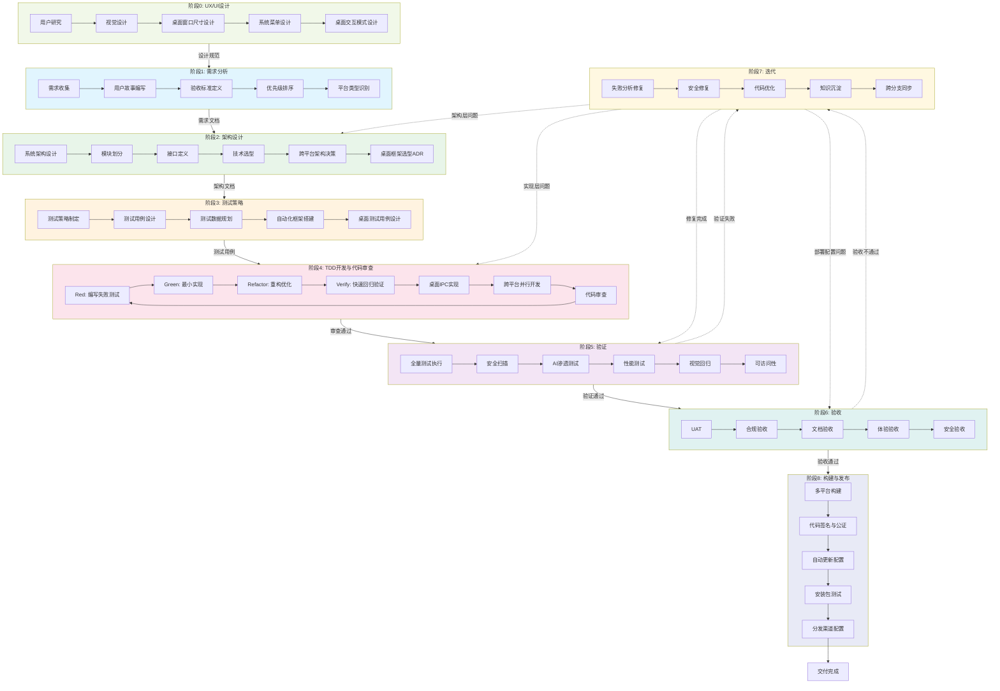

---
metadata:
  name: SDD+TDD完整开发工作流
  version: "1.8.0"
  description: 完整9阶段SDD+TDD融合开发工作流
  platform: all
  min_agents: 5
  max_agents: 15
phases:
  - id: phase-0
    name: UX/UI设计
    order: 0
    optional: false
    trigger_condition: 项目启动且需要UI/UX设计
    agents:
      primary: [ux-designer, ui-designer]
      supporting: [product-manager, frontend-stylist, desktop-ui-adapter]
    inputs:
      - name: 产品需求概述
        type: document
        required: true
      - name: 用户画像
        type: document
        required: true
      - name: 业务目标
        type: document
        required: true
    outputs:
      - name: UX研究报告
        type: document
        validation: 用户旅程完整
      - name: 高保真设计稿
        type: document
        validation: 设计评审通过
      - name: 桌面窗口布局规范
        type: document
        validation: 窗口尺寸适配方案明确
      - name: 系统菜单结构图
        type: document
        validation: 菜单结构合理
      - name: 交互说明文档
        type: document
    quality_gates:
      - gate_id: design_review
        blocking: true
        pass_criteria: 设计评审通过且设计令牌与技术栈兼容
      - gate_id: accessibility_check
        blocking: true
        pass_criteria: 可访问性无A级违规
    timeout_minutes: 120
    retry:
      max_attempts: 2
      backoff: fixed
  - id: phase-1
    name: 需求分析
    order: 1
    optional: false
    trigger_condition: UX/UI设计完成或跳过
    agents:
      primary: [product-manager]
      supporting: []
    inputs:
      - name: 用户需求描述
        type: document
        required: true
      - name: 业务背景信息
        type: document
        required: true
    outputs:
      - name: 需求规格说明书
        type: document
        validation: 需求已获用户确认
      - name: 用户故事列表
        type: document
        validation: 符合INVEST原则
      - name: 验收标准文档
        type: document
        validation: 验收标准明确可测试
      - name: 平台需求分析报告
        type: document
    quality_gates:
      - gate_id: invest_check
        blocking: true
        pass_criteria: 所有用户故事符合INVEST原则
      - gate_id: acceptance_criteria_defined
        blocking: true
        pass_criteria: 验收标准明确可测试且歧义已解决
    timeout_minutes: 60
    retry:
      max_attempts: 2
      backoff: fixed
  - id: phase-2
    name: 架构设计
    order: 2
    optional: false
    trigger_condition: 需求分析完成
    agents:
      primary: [system-architect]
      supporting: []
    inputs:
      - name: 需求规格说明书
        type: document
        required: true
        source_phase: phase-1
      - name: 用户故事列表
        type: document
        required: true
        source_phase: phase-1
    outputs:
      - name: 架构设计文档
        type: document
        validation: 符合SOLID原则
      - name: API接口规范
        type: document
        validation: 接口定义清晰完整
      - name: 数据模型图
        type: document
      - name: 技术决策记录
        type: document
        validation: 技术选型有充分理由
      - name: 跨平台架构方案
        type: document
      - name: 桌面框架选型ADR
        type: document
    quality_gates:
      - gate_id: solid_check
        blocking: true
        pass_criteria: 架构设计符合SOLID原则
      - gate_id: interface_defined
        blocking: true
        pass_criteria: 接口定义清晰完整且跨平台边界明确
    timeout_minutes: 90
    retry:
      max_attempts: 2
      backoff: fixed
  - id: phase-3
    name: 测试策略
    order: 3
    optional: false
    trigger_condition: 架构设计完成
    agents:
      primary: [test-architect]
      supporting: []
    inputs:
      - name: 架构设计文档
        type: document
        required: true
        source_phase: phase-2
      - name: 用户故事列表
        type: document
        required: true
        source_phase: phase-1
    outputs:
      - name: 测试策略文档
        type: document
      - name: 测试用例清单
        type: document
        validation: 覆盖所有用户故事
      - name: 测试数据方案
        type: document
      - name: 桌面测试用例清单
        type: document
    quality_gates:
      - gate_id: coverage_all_stories
        blocking: true
        pass_criteria: 测试覆盖所有用户故事
      - gate_id: automation_ready
        blocking: true
        pass_criteria: 测试用例可自动化执行且边界条件已覆盖
    timeout_minutes: 60
    retry:
      max_attempts: 2
      backoff: fixed
  - id: phase-4
    name: TDD开发与代码审查
    order: 4
    optional: false
    trigger_condition: 测试策略完成
    agents:
      primary: [fullstack-engineer, unit-tester, code-reviewer]
      supporting: [frontend-stylist, desktop-ui-adapter, native-module-developer]
    inputs:
      - name: 架构设计文档
        type: document
        required: true
        source_phase: phase-2
      - name: 测试用例清单
        type: document
        required: true
        source_phase: phase-3
    outputs:
      - name: 源代码文件
        type: code
        validation: 代码审查通过
      - name: 单元测试文件
        type: code
        validation: 覆盖率>=80%
      - name: 代码覆盖率报告
        type: document
        validation: 覆盖率>=80%
      - name: 代码审查报告
        type: document
      - name: 改进建议清单
        type: document
    quality_gates:
      - gate_id: test_pass
        blocking: true
        pass_criteria: 所有测试用例通过
      - gate_id: coverage_80
        blocking: true
        pass_criteria: 代码覆盖率>=80%
      - gate_id: spec_consistency
        blocking: true
        pass_criteria: 所有Spec-Drift标记已按影响级别复核
    timeout_minutes: 240
    retry:
      max_attempts: 3
      backoff: exponential
  - id: phase-5
    name: 验证
    order: 5
    optional: false
    trigger_condition: TDD开发与代码审查通过
    agents:
      primary: [qa-engineer, security-auditor, ai-penetration-tester, performance-tester]
      supporting: []
    inputs:
      - name: 通过审查的代码
        type: code
        required: true
        source_phase: phase-4
      - name: 测试用例清单
        type: document
        required: true
        source_phase: phase-3
      - name: 安全测试清单
        type: document
        required: true
    outputs:
      - name: 测试执行报告
        type: document
        validation: 通过率和覆盖率达标
      - name: 安全审计报告
        type: document
        validation: 无P0/P1安全问题
      - name: 性能测试报告
        type: document
      - name: 视觉差异报告
        type: document
      - name: 可访问性违规清单
        type: document
      - name: 规格一致性报告
        type: document
      - name: 桌面跨平台兼容性报告
        type: document
        validation: 三平台功能一致性>95%
    quality_gates:
      - gate_id: all_tests_pass
        blocking: true
        pass_criteria: 所有测试通过
      - gate_id: no_p0_p1_security
        blocking: true
        pass_criteria: 无P0/P1安全问题
      - gate_id: coverage_met
        blocking: true
        pass_criteria: 覆盖率达标且视觉差异<1%
    timeout_minutes: 120
    retry:
      max_attempts: 2
      backoff: fixed
  - id: phase-6
    name: 验收
    order: 6
    optional: false
    trigger_condition: 验证阶段通过
    agents:
      primary: [product-manager]
      supporting: [desktop-developer, build-release-engineer]
    inputs:
      - name: Phase5验证通过的产物
        type: document
        required: true
        source_phase: phase-5
      - name: 用户故事和验收标准
        type: document
        required: true
        source_phase: phase-1
    outputs:
      - name: 用户验收测试报告
        type: document
      - name: 合规检查清单签署
        type: document
      - name: 文档完整性报告
        type: document
      - name: 体验验收报告
        type: document
      - name: 正式发布建议
        type: document
        validation: 批准或驳回
    quality_gates:
      - gate_id: acceptance_criteria_pass
        blocking: true
        pass_criteria: 所有验收标准通过
      - gate_id: no_blockers
        blocking: true
        pass_criteria: 无阻塞性问题且文档覆盖率100%
    timeout_minutes: 60
    retry:
      max_attempts: 2
      backoff: fixed
  - id: phase-7
    name: 迭代
    order: 7
    optional: true
    trigger_condition: 验证或验收阶段未通过
    agents:
      primary: [orchestrator, refactoring-specialist]
      supporting: [fullstack-engineer, test-architect]
    inputs:
      - name: 验证阶段或验收阶段的反馈
        type: document
        required: true
        source_phase: phase-5
    outputs:
      - name: 修复后的代码
        type: code
        validation: 修复项验证通过
      - name: 迭代总结报告
        type: document
      - name: 学习到的模式
        type: document
      - name: 更新后的规格文档
        type: document
      - name: RCA报告
        type: document
        validation: RCA已完成并归档
      - name: 安全工单闭环记录
        type: document
      - name: 知识同步日志
        type: document
    quality_gates:
      - gate_id: fixes_verified
        blocking: true
        pass_criteria: 所有修复项验证通过
      - gate_id: regression_pass
        blocking: true
        pass_criteria: 回归测试通过
      - gate_id: rca_completed
        blocking: false
        pass_criteria: RCA报告已完成并归档
    timeout_minutes: 120
    retry:
      max_attempts: 3
      backoff: exponential
  - id: phase-8
    name: 构建与发布
    order: 8
    optional: false
    trigger_condition: 验收通过
    agents:
      primary: [build-release-engineer, desktop-developer]
      supporting: [cicd-specialist]
    inputs:
      - name: 部署通过的代码
        type: code
        required: true
        source_phase: phase-6
      - name: 桌面打包配置
        type: document
        required: true
    outputs:
      - name: 多平台安装包
        type: artifact
        validation: 所有平台构建成功
      - name: 代码签名证书
        type: artifact
        validation: 签名与公证通过
      - name: 自动更新配置文件
        type: document
        validation: 自动更新功能验证通过
      - name: 发布说明文档
        type: document
        validation: 发布说明完整
      - name: 分发清单
        type: document
    quality_gates:
      - gate_id: build_success
        blocking: true
        pass_criteria: 所有平台构建成功
      - gate_id: signing_pass
        blocking: true
        pass_criteria: 代码签名与公证通过
      - gate_id: update_verified
        blocking: true
        pass_criteria: 自动更新功能验证通过
    timeout_minutes: 180
    retry:
      max_attempts: 2
      backoff: exponential
agent_matrix:
  ux-designer:
    phases: [phase-0]
    role: primary
    max_parallel_instances: 1
  ui-designer:
    phases: [phase-0]
    role: primary
    max_parallel_instances: 1
  product-manager:
    phases: [phase-1, phase-6]
    role: primary
    max_parallel_instances: 1
  system-architect:
    phases: [phase-2]
    role: primary
    max_parallel_instances: 1
  test-architect:
    phases: [phase-3]
    role: primary
    max_parallel_instances: 1
  fullstack-engineer:
    phases: [phase-4]
    role: primary
    max_parallel_instances: 3
  unit-tester:
    phases: [phase-4]
    role: primary
    max_parallel_instances: 2
  code-reviewer:
    phases: [phase-4]
    role: primary
    max_parallel_instances: 2
  qa-engineer:
    phases: [phase-5]
    role: primary
    max_parallel_instances: 1
  security-auditor:
    phases: [phase-5]
    role: primary
    max_parallel_instances: 1
  ai-penetration-tester:
    phases: [phase-5]
    role: primary
    max_parallel_instances: 1
  performance-tester:
    phases: [phase-5]
    role: primary
    max_parallel_instances: 1
  orchestrator:
    phases: [phase-7]
    role: primary
    max_parallel_instances: 1
  refactoring-specialist:
    phases: [phase-7]
    role: primary
    max_parallel_instances: 1
  build-release-engineer:
    phases: [phase-8]
    role: primary
    max_parallel_instances: 1
  desktop-developer:
    phases: [phase-8]
    role: primary
    max_parallel_instances: 1
exception_handling:
  phase_failure:
    action: retry_then_escalate
    escalation_target: orchestrator
    max_retries: 3
  agent_unavailable:
    action: substitute_and_continue
    substitute_agent: fullstack-engineer
  quality_gate_blocked:
    action: auto_fix_then_pause
    auto_fix_agents: [fullstack-engineer, refactoring-specialist]
---

# SDD+TDD 完整工作流

## 工作流名称
SDD+TDD Full Development Workflow（完整软件开发工作流）

## 描述
完整的9阶段SDD（Story-Driven Development）+ TDD（Test-Driven Development）软件开发工作流，适用于中大型项目的系统性开发。该工作流融合了三省六部二十四司协同机制，确保从需求分析到迭代交付的全生命周期质量保障，并支持桌面/跨平台应用开发。

## 触发条件
- 用户请求完整的软件开发流程
- 项目规模：中大型（预估开发周期 > 2周）
- 需要完整的文档和测试覆盖
- 涉及多个模块或组件的开发
- 用户明确要求"完整流程"、"全生命周期"、"SDD+TDD"

## 涉及的Agent

### 核心Agent
| Agent | 角色 | 职责 |
|-------|------|------|
| product-manager | 产品经理 | 需求分析、用户故事编写、验收（Phase 6） |
| system-architect | 系统架构师 | 架构设计、技术选型 |
| test-architect | 测试架构师 | 测试策略设计 |
| fullstack-engineer | 全栈工程师 | 代码实现（Phase 4） |
| unit-tester | 单元测试工程师 | TDD测试编写（Phase 4） |
| code-reviewer | 代码审查工程师 | 代码质量把关（Phase 4） |
| qa-engineer | QA工程师 | 全量测试执行（Phase 5） |
| orchestrator | 编排器 | 迭代调度与修复协调（Phase 7） |
| refactoring-specialist | 重构专家 | 代码优化与重构（Phase 7） |

### 支撑Agent
| Agent | 角色 | 职责 |
|-------|------|------|
| security-auditor | 安全审计师 | 安全扫描与审计（Phase 5） |
| ai-penetration-tester | AI渗透测试工程师 | AI自主渗透测试（Phase 5） |
| performance-tester | 性能测试工程师 | 性能基准测试（Phase 5） |
| documentation-engineer | 文档工程师 | 文档编写 |
| desktop-developer | 桌面开发工程师 | 桌面原生实现、IPC通信 |
| build-release-engineer | 构建发布工程师 | 桌面打包、签名、分发 |

## 阶段定义

### 阶段0：UX/UI设计（UX/UI Design）
**执行者**: ux-designer, ui-designer
**辅助**: product-manager, frontend-stylist, desktop-ui-adapter

**输入**:
- 产品需求概述
- 用户画像
- 业务目标

**活动**:
1. 用户研究与交互设计
2. 视觉设计与设计系统定义
3. 桌面窗口尺寸设计（最小/默认/全屏布局）
4. 系统菜单设计（应用菜单、右键菜单、托盘菜单）
5. 桌面特有交互模式设计（拖拽、系统通知、全局快捷键）

**输出**:
- UX研究报告
- 高保真设计稿
- 桌面窗口布局规范
- 系统菜单结构图
- 交互说明文档

**质量门禁**:
- [ ] 用户旅程完整
- [ ] 桌面窗口尺寸适配方案明确
- [ ] 系统菜单结构合理
- [ ] 设计评审通过
- [ ] 设计令牌与开发技术栈兼容性验证
- [ ] 可访问性无A级违规

---

### 阶段1：需求分析（Requirement Analysis）
**执行者**: product-manager

**输入**:
- 用户需求描述
- 业务背景信息

**活动**:
1. 需求收集与整理
2. 用户故事编写（User Story）
3. 验收标准定义（Acceptance Criteria）
4. 优先级排序
5. 平台类型识别（Web/桌面/移动端/跨平台）

**输出**:
- 需求规格说明书
- 用户故事列表
- 验收标准文档
- 平台需求分析报告

**质量门禁**:
- [ ] 所有用户故事符合INVEST原则
- [ ] 验收标准明确可测试
- [ ] 需求已获得用户确认
- [ ] 所有歧义问题已解决或标注为待定

---

### 阶段2：架构设计（Architecture Design）
**执行者**: system-architect

**输入**:
- 需求规格说明书
- 用户故事列表

**活动**:
1. 系统架构设计
2. 模块划分与接口定义
3. 技术选型决策
4. 数据模型设计
5. 跨平台架构决策（共享逻辑层 vs 平台特定实现）
6. 桌面框架选型ADR（Electron/Tauri/Qt/WPF等评估）

**输出**:
- 架构设计文档
- API接口规范
- 数据模型图
- 技术决策记录（ADR）
- 跨平台架构方案
- 桌面框架选型ADR

**质量门禁**:
- [ ] 架构设计符合SOLID原则
- [ ] 接口定义清晰完整
- [ ] 技术选型有充分理由
- [ ] 设计令牌与代码组件一一对应
- [ ] 跨平台架构边界已明确

---

### 阶段3：测试策略（Test Strategy）
**执行者**: test-architect

**输入**:
- 架构设计文档
- 用户故事列表

**活动**:
1. 测试策略制定
2. 测试用例设计
3. 测试数据规划
4. 自动化测试框架搭建
5. 桌面特有测试用例设计（窗口管理、系统菜单、托盘图标、文件系统访问、IPC通信、自动更新）

**输出**:
- 测试策略文档
- 测试用例清单
- 测试数据方案
- 桌面测试用例清单

**质量门禁**:
- [ ] 测试覆盖所有用户故事
- [ ] 测试用例可自动化执行
- [ ] 边界条件和异常场景已覆盖
- [ ] 非功能测试用例清单通过System Architect审核

---

### 阶段4：TDD开发与代码审查（TDD Development & Code Review）
**执行者**: frontend-developer, backend-developer, desktop-developer, database-engineer（并行）
**辅助**: unit-tester, code-reviewer, frontend-stylist, desktop-ui-adapter, native-module-developer

**输入**:
- 架构设计文档
- 测试用例清单

**活动**:
1. **Red**: 编写失败的测试用例
2. **Green**: 编写最小代码使测试通过
3. **Refactor**: 重构代码优化结构
4. **Verify**: 快速回归验证重构未引入新问题
5. 循环迭代直到功能完成
6. 桌面IPC通信实现（主进程与渲染进程通信）
7. 原生模块集成（Node.js Native Addon / Rust FFI）
8. 跨平台并行开发（共享逻辑 + 平台适配层）
9. **代码审查**（code-reviewer执行）：
   - 代码规范检查
   - 设计模式审查
   - 安全漏洞扫描
   - 性能问题识别
   - 桌面特有代码审查（IPC安全性、原生模块内存管理、跨平台兼容性）

**规格漂移处理与自动调整权限分级**:
- **低影响漂移**（仅影响单个函数或组件内部实现细节）：Agent可自行补全，但需在提交信息中标记 `Spec-Drift: [low] <说明>`，并在PR中阐述变更。Specification Keeper事后审核并决定是否更新规格文档。
- **中影响漂移**（影响模块间接口或数据格式）：Agent立即暂停，上报Orchestrator。Orchestrator联合System Architect快速评估，若方案明确且风险可控，授权修改并通知Specification Keeper更新规格；若出现不确定因素，转为高影响处理。
- **高影响漂移**（影响外部API契约、安全模型、关键业务逻辑、跨平台共享层）：必须触发"人机协作断点"，等待Product Manager或对应人类负责人确认。此级别漂移强制要求人工介入，不得由Agent自主决策。
- 所有Spec-Drift标记将在质量门禁SPEC-CONSISTENCY中汇总，按影响级别分别复核。

**增量实施约束**:
- Agent必须遵循"分解复杂任务→实现单个步骤→测试验证→重复"的工作模式
- 若在同一错误上连续3次尝试失败，必须停止、记录反模式到知识库、从头重新开始
- 此约束参考@hivehub/rulebook的增量实施规范

**设计令牌同步**:
- 设计令牌（CSS变量/JS对象）必须与设计系统保持一致，通过design-tokens-sync.js脚本自动同步

**Git分支规则**:
- 每个功能开发必须在独立的feature/*分支上进行
- 分支命名规则feature/<功能简述>
- 跨平台功能建议使用feature/<功能>-cross-platform命名

**输出**:
- 源代码文件
- 单元测试文件
- 代码覆盖率报告
- 代码审查报告
- 改进建议清单
- 问题修复确认
- **SCRIPT-CLEANUP检查**：确认 `.knowledge/temp-scripts/` 目录已清空，无残留临时脚本 [强制]

**质量门禁**:
- [ ] 所有测试用例通过
- [ ] 代码覆盖率 >= 80%
- [ ] 无严重代码异味
- [ ] SPEC-CONSISTENCY：所有Spec-Drift标记已按影响级别复核
- [ ] 代码审查通过（无严重代码问题，所有审查意见已处理，代码符合团队规范）

---

### 阶段5：验证（Verification）
**执行者**: qa-engineer, security-auditor, ai-penetration-tester, performance-tester

**输入**:
- 通过审查的代码
- 测试用例清单
- 安全测试清单

**活动**:
1. 全量测试执行（单元+集成+E2E+桌面专项，强制包含非功能基础设施测试）
2. 安全扫描（SAST + 依赖漏洞）
3. AI自主渗透测试
4. 性能基准测试
5. 规格一致性校验（含 Spec-Drift 复核）
6. 文档完整性检查
7. 视觉回归测试（Chromatic/Percy）
8. 可访问性自动化测试（axe-core）
9. 桌面专项验证：
   - 窗口行为自动化测试（Spectron/Playwright for Electron）
   - 安装包完整性验证（文件校验、签名验证）
   - 跨平台兼容性矩阵测试（Windows 10/11, macOS 13+, Ubuntu 22.04+）
   - 系统集成测试（系统托盘、通知、文件关联、自动启动）

**输出**:
- 测试执行报告（通过率、覆盖率）
- 安全审计报告（P0-P3严重等级）
- 性能测试报告
- 视觉差异报告
- 可访问性违规清单
- 规格一致性报告
- 桌面跨平台兼容性报告

**质量门禁**:
- [ ] 所有测试通过
- [ ] 无P0/P1安全问题
- [ ] 覆盖率达标
- [ ] 视觉差异 < 1%（需人工审核）
- [ ] 桌面三平台功能一致性 > 95%

---

### 阶段6：验收（Acceptance）
**执行者**: product-manager

**输入**:
- Phase 5验证通过的产物
- 用户故事和验收标准

**活动**:
1. 用户验收测试（UAT）：基于用户故事和验收标准，模拟最终用户执行关键场景
2. 合规验收：检查GDPR/PCI-DSS等法规要求（如适用）
3. 文档验收：确保用户手册、API文档、部署指南完整且与实现一致
4. 体验验收：检查设计实现是否与设计稿一致，可用性指标是否达标（任务完成率≥95%，满意度≥4/5）
5. 性能验收：验证是否满足非功能性需求（响应时间、并发用户等）
6. 安全验收：确认所有安全门禁已通过，无未修复的中高危漏洞
7. 桌面端专项验收：
   - 安装包可直接安装并成功启动
   - 自动更新流程端到端验证通过
   - 应用商店审核要求检查（如适用）
   - 桌面端用户手册操作步骤准确性

**输出**:
- 用户验收测试报告
- 合规检查清单签署
- 文档完整性报告
- 体验验收报告
- 正式发布建议（批准/驳回）

**质量门禁**:
- [ ] 所有验收标准通过
- [ ] 无阻塞性问题
- [ ] 文档覆盖率100%（关键文档）
- [ ] 体验指标达标
- [ ] 桌面安装与更新验证通过
- [ ] 若验收不通过，返回Phase 7迭代修复

---

### 阶段7：迭代（Iteration）
**执行者**: orchestrator, refactoring-specialist

**输入**:
- 验证阶段或验收阶段的反馈

**活动**:
1. 失败测试分析与修复（优先采用结构化根因分析）
2. 安全问题修复
3. 代码优化与重构
4. 设计不一致调整（视觉差异修复）
5. 桌面跨平台兼容性问题修复
6. 模式学习（成功模式持久化）
7. 知识库更新
8. 规格文档与设计文档同步更新

**智能迭代调度与优先级排序**:
- 当验证或验收暴露出多个待修复项时，Orchestrator根据优先级矩阵自动生成修复计划
- 优先级：阻塞性Gate失败 > 高影响范围（多个模块/用户旅程/多平台受影响）> 低影响范围 > 低修复置信度（需人工介入）
- 修复价值评分 = 阻塞等级 × 影响范围系数 + 修复置信度，按评分降序执行
- 增量验证策略：根据代码变更范围，由Test Architect智能选择受影响测试子集执行，而非每次全量回归

**人机协作断点**:
- 工作流中定义以下决策检查点，当满足条件时系统自动暂停并生成决策报告，等待人类输入：
  - 验收不通过，且产品方向可能需要调整
  - 发现Spec存在逻辑漏洞，且属于高影响漂移
  - 连续迭代3次仍未收敛（相同Gate重复失败）
  - 安全渗透测试发现高危零日漏洞，需人工评估业务风险
- 其余低影响、中影响Spec漂移及明确的技术修复，可由系统自主决策并记录日志

**根因分析框架**:
- 当发生测试失败、安全漏洞或运行时异常时，负责修复的Agent必须遵循RCA模板：
  - **症状**：可观察到的错误现象，精确到日志/堆栈
  - **直接原因**：导致症状的直接代码缺陷或配置错误
  - **根本原因**：为什么会存在这个直接原因？流程/设计/假设的哪个环节出错？
  - **修复措施**：解决根本原因的具体代码变更
  - **预防措施**：如何防止同类问题再次发生？包括新增测试用例、知识库条目、规范更新等
  - **影响范围评估**：此根本原因可能影响的其它模块/服务
- 报告自动存储为经验知识库条目（experience/errors/）
- 每完成一个Bug修复，Test Architect必须自动生成至少一个回归测试用例

**安全修复闭环**:
- 将AI Penetration Tester、Security Auditor、Developer和Test Architect串联为自动工作流：
  1. AI Penetration Tester发现漏洞 → 自动创建安全工单
  2. Security Auditor验证并确认漏洞，指派给对应的Developer Agent
  3. Developer Agent实施修复，同时Test Architect生成回归测试
  4. 修复分支提交后，自动触发AI Penetration Tester复测
  5. 闭环完成，工单关闭，经验沉淀

**跨分支经验同步**:
- Specification Keeper在Phase 7迭代完成后，评估新沉淀的知识条目是否具有通用性
- 对于高置信度（>0.8）且标记为"安全修复"或"常见错误"的条目，自动创建knowledge-sync/<brief-description>分支，向所有活跃的feature/*分支发起合并请求
- 若目标分支已有冲突经验，知识库合并流程自动触发条目去重和置信度比较
- 所有跨分支同步操作记录在knowledge/sync-log.md

**扩展自愈范围**:
- DevOps Engineer和Runtime Supervisor可尝试在沙箱中自动修复常见环境配置问题（环境变量缺失、端口冲突、依赖服务不可用），验证后自动提交修复PR
- 当Spec自身被发现逻辑漏洞时，Specification Keeper在更新规格后，自动触发级联影响分析，标记下游产物中需要同步修改的部分，并生成相应的修复任务

**输出**:
- 修复后的代码
- 迭代总结报告
- 学习到的模式
- 更新后的规格文档
- RCA报告（experience/errors/）
- 安全工单闭环记录
- 知识同步日志（knowledge/sync-log.md）
- **临时脚本清理检查**：确认 `.knowledge/temp-scripts/` 目录已清空，无残留脚本（遵循10.5节脚本生命周期闭环）[强制]

**质量门禁**:
- [ ] 所有修复项验证通过
- [ ] 回归测试通过
- [ ] RCA报告已完成并归档
- [ ] 安全工单全部闭环
- [ ] 跨分支知识同步已完成或已记录待处理
- [ ] 知识库已更新

**回退路径**:
- 如发现架构层问题则返回Phase 2
- 如发现实现层问题则返回Phase 4
- 如发现部署配置问题则返回Phase 6

---

### 阶段8：构建与发布（Build & Release - Desktop）
**执行者**: build-release-engineer, desktop-developer

**输入**:
- 部署通过的代码
- 桌面打包配置

**活动**:
1. 多平台构建（Windows/macOS/Linux并行构建）
2. 代码签名与公证（Apple Notarization / Windows Authenticode）
3. 自动更新配置（增量更新/全量更新策略）
4. 安装包测试（MSI/DMG/AppImage/DEB等）
5. 分发渠道配置（官网下载/应用商店/内部分发）
6. 发布说明编写

**输出**:
- 多平台安装包
- 代码签名证书
- 自动更新配置文件
- 发布说明文档
- 分发清单

**质量门禁**:
- [ ] 所有平台构建成功
- [ ] 代码签名与公证通过
- [ ] 安装包在目标平台可正常安装运行
- [ ] 自动更新功能验证通过
- [ ] 发布说明完整

## 流程图

## 输出产物清单

| 阶段 | 输出产物 | 格式 |
|------|----------|------|
| UX/UI设计 | UX研究报告 | Markdown |
| UX/UI设计 | 高保真设计稿 | Figma/Sketch |
| UX/UI设计 | 桌面窗口布局规范 | Markdown |
| UX/UI设计 | 系统菜单结构图 | Mermaid |
| 需求分析 | 需求规格说明书 | Markdown |
| 需求分析 | 用户故事列表 | Markdown |
| 需求分析 | 平台需求分析报告 | Markdown |
| 架构设计 | 架构设计文档 | Markdown + Mermaid |
| 架构设计 | API接口规范 | OpenAPI/Swagger |
| 架构设计 | 跨平台架构方案 | Markdown |
| 架构设计 | 桌面框架选型ADR | Markdown |
| 测试策略 | 测试策略文档 | Markdown |
| 测试策略 | 测试用例清单 | Markdown |
| 测试策略 | 桌面测试用例清单 | Markdown |
| TDD开发与代码审查 | 源代码 | 各语言源文件 |
| TDD开发与代码审查 | 单元测试 | 测试文件 |
| TDD开发与代码审查 | 代码审查报告 | Markdown |
| TDD开发与代码审查 | 改进建议清单 | Markdown |
| 验证 | 测试执行报告 | Markdown + HTML |
| 验证 | 安全审计报告 | Markdown |
| 验证 | 性能测试报告 | Markdown + HTML |
| 验证 | 视觉差异报告 | Markdown + HTML |
| 验证 | 可访问性违规清单 | Markdown |
| 验证 | 规格一致性报告 | Markdown |
| 验证 | 桌面跨平台兼容性报告 | Markdown |
| 验收 | 用户验收测试报告 | Markdown |
| 验收 | 合规检查清单 | Markdown |
| 验收 | 文档完整性报告 | Markdown |
| 验收 | 体验验收报告 | Markdown |
| 验收 | 正式发布建议 | Markdown |
| 迭代 | 修复后的代码 | 各语言源文件 |
| 迭代 | 迭代总结报告 | Markdown |
| 迭代 | 学习到的模式 | Markdown（knowledge/） |
| 迭代 | 更新后的规格文档 | Markdown |
| 迭代 | RCA报告 | Markdown（experience/errors/） |
| 迭代 | 安全工单闭环记录 | Markdown |
| 迭代 | 知识同步日志 | Markdown（knowledge/sync-log.md） |
| 构建与发布 | 多平台安装包 | MSI/DMG/AppImage/DEB |
| 构建与发布 | 代码签名证书 | 证书文件 |
| 构建与发布 | 自动更新配置 | JSON/YAML |
| 构建与发布 | 发布说明文档 | Markdown |

## 质量保障机制

### 四维防线
1. **需求防线**: 需求评审确保需求清晰完整
2. **设计防线**: 架构评审确保设计合理
3. **编码防线**: TDD + 代码审查确保代码质量
4. **测试防线**: 多层次测试确保功能正确

### 质量指标
| 指标 | 目标值 | 检测方式 |
|------|--------|----------|
| 代码覆盖率 | >= 80% | 自动化工具 |
| 技术债务 | <= 5% | SonarQube |
| 缺陷密度 | <= 0.5/KLOC | 缺陷跟踪 |
| 部署成功率 | >= 99% | CI/CD统计 |

## 回退机制

当某阶段质量门禁未通过时：
1. **阶段内修复**: 在当前阶段内解决问题
2. **回退上一阶段**: 如问题根源在上游，回退并修复
3. **紧急熔断**: 严重问题触发熔断，暂停整个流程

## 执行建议

1. **时间分配**: UX/UI设计10% + 需求15% + 设计12% + 测试策略8% + 开发与代码审查30% + 验证10% + 验收5% + 迭代5% + 构建发布5%
2. **并行策略**: 阶段2和阶段3可并行执行；桌面多平台构建可并行
3. **迭代周期**: 建议每个完整周期不超过4周
4. **文档同步**: 每阶段输出必须及时更新文档
5. **桌面优先**: 如项目包含桌面端，建议优先在单一平台验证后再扩展跨平台
